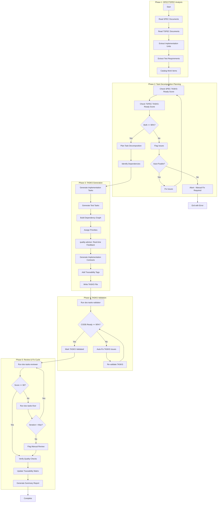
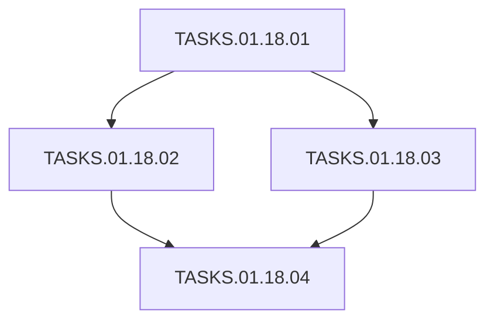
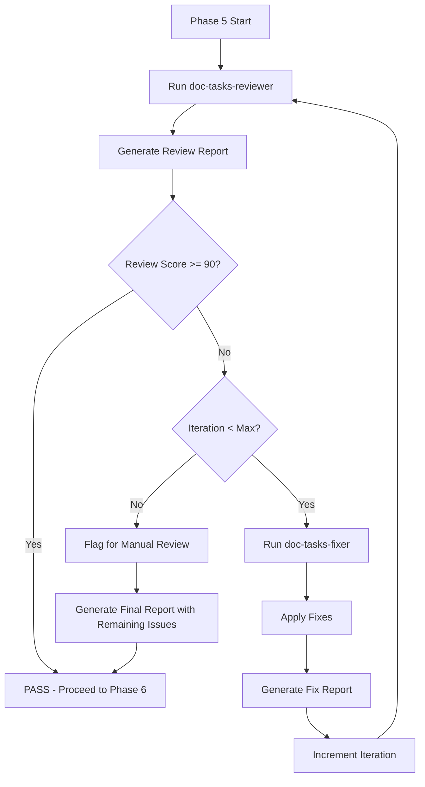
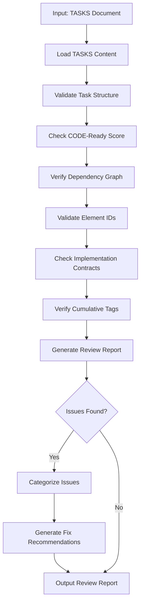
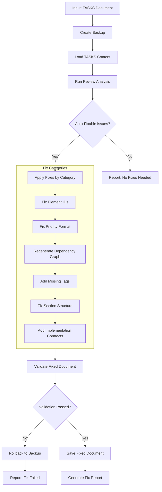

# doc-tasks-autopilot

## Purpose

Automated **Task Breakdown (TASKS)** generation pipeline that processes SPEC and TSPEC documents to generate AI-structured TODO tasks for implementation with CODE-Ready scoring.

**Layer**: 11 (Final documentation layer before code)

**Upstream**: SPEC (Layer 9), TSPEC (Layer 10)

**Downstream**: Code (Layer 12 - execution layer)

---

## Skill Dependencies

| Skill | Purpose | Phase |
|-------|---------|-------|
| `doc-naming` | Element ID format (TASKS.NN.TT.SS, codes 18, 30) | All Phases |
| `doc-spec-validator` | Validate SPEC TASKS-Ready score | Phase 2 |
| `doc-tspec-validator` | Validate TSPEC TASKS-Ready score | Phase 2 |
| `doc-tasks` | TASKS creation rules, TODO format | Phase 3 |
| `quality-advisor` | Real-time quality feedback | Phase 3 |
| `doc-tasks-validator` | Validation with CODE-Ready scoring | Phase 4 |
| `doc-tasks-reviewer` | Content review, link validation, quality scoring | Phase 5: Review |
| `doc-tasks-fixer` | Apply fixes from review report, create missing files | Phase 5: Fix |

---

## Workflow Overview



---

## Task Structure

### Element ID Format

| Element Type | Code | Pattern | Example |
|--------------|------|---------|---------|
| Task | 18 | TASKS.NN.18.SS | TASKS.01.18.01 |
| Task Item | 30 | TASKS.NN.30.SS | TASKS.01.30.01 |

### Priority Levels

| Priority | Code | Description |
|----------|------|-------------|
| P0 | Critical | Must complete first, blocks all others |
| P1 | High | Core functionality |
| P2 | Medium | Important but not blocking |
| P3 | Low | Nice to have, can defer |

---

## TASKS Document Structure

```markdown
# TASKS-01: Component Implementation

## Document Control
| Field | Value |
|-------|-------|
| Status | Draft |
| CODE-Ready Score | 95% |

## 1. Task Overview
Summary of implementation tasks derived from SPEC-01.

## 2. Dependency Graph


## 3. Implementation Tasks

### TASKS.01.18.01: Setup Project Structure
- **Priority**: P0
- **Upstream**: None
- **Downstream**: TASKS.01.18.02, TASKS.01.18.03
- **SPEC Reference**: SPEC.01.28.01
- **Estimated Complexity**: 2/5

### TASKS.01.18.02: Implement Core Logic
- **Priority**: P1
- **Upstream**: TASKS.01.18.01
- **Downstream**: TASKS.01.18.04
- **SPEC Reference**: SPEC.01.28.02

## 7. Implementation Contracts
[Protocol interfaces, exception hierarchies, state machine contracts]

## 8. Traceability
@brd: BRD.01.01.01
@prd: PRD.01.09.01
...
```

---

## Implementation Contracts

Per `IMPLEMENTATION_CONTRACTS_GUIDE.md`, generate contracts when:
- TASKS file has 3+ downstream dependencies
- Shared interfaces across multiple sessions
- Complex state machines or exception hierarchies

**Contract Types**:
1. Protocol Interfaces
2. Exception Hierarchies
3. State Machine Contracts
4. Data Models
5. Dependency Injection Interfaces

---

## Phase 5: Review & Fix Cycle (v2.3)

Iterative review and fix cycle to ensure TASKS quality before completion.



### 5.1 Initial Review

Run `doc-tasks-reviewer` to identify issues.

```bash
/doc-tasks-reviewer TASKS-NN
```

**Output**: `TASKS-NN.R_review_report_v001.md`

### 5.2 Fix Cycle

If review score < 90%, invoke `doc-tasks-fixer`.

```bash
/doc-tasks-fixer TASKS-NN --revalidate
```

**Fix Categories**:

| Category | Fixes Applied |
|----------|---------------|
| Missing Sections | Add missing task overview, contracts sections |
| Element IDs | Convert legacy patterns (TASK-XXX, TODO-XXX) |
| Dependency Graph | Regenerate Mermaid diagram from task references |
| Priority Format | Normalize to P0-P3 format |
| Implementation Contracts | Generate when 3+ dependencies exist |
| Traceability | Update cumulative tags (9 layers) |

**Output**: `TASKS-NN.F_fix_report_v001.md`

### 5.3 Re-Review

After fixes, automatically re-run reviewer.

```bash
/doc-tasks-reviewer TASKS-NN
```

**Output**: `TASKS-NN.R_review_report_v002.md`

### 5.4 Iteration Control

| Parameter | Default | Description |
|-----------|---------|-------------|
| `max_iterations` | 3 | Maximum fix-review cycles |
| `target_score` | 90 | Minimum passing score |
| `stop_on_manual` | false | Stop if only manual issues remain |

**Iteration Example**:

```
Iteration 1:
  Review v001: Score 75 (3 errors, 5 warnings)
  Fix v001: Fixed 6 issues, regenerated dependency graph

Iteration 2:
  Review v002: Score 92 (0 errors, 2 warnings)
  Status: PASS (score >= 90)
```

### 5.5 Quality Checks (Post-Fix)

After passing the fix cycle:

1. **Task Structure Completeness**:
   - All required task fields present (Priority, Upstream, Downstream)
   - SPEC references valid and linked
   - Complexity estimates provided

2. **Dependency Graph Validity**:
   - Valid DAG (no circular dependencies)
   - All task references resolved
   - Mermaid diagram renders correctly

3. **Element ID Compliance** (per `doc-naming` skill):
   - All IDs use TASKS.NN.TT.SS format
   - Element type codes valid for TASKS (18, 30)
   - No legacy patterns (TASK-XXX, TODO-XXX, TI-XXX)

4. **CODE-Ready Report**:
   ```
   CODE-Ready Score Breakdown
   ==========================
   Task Completeness:        24/25 (all required fields)
   Dependency Graph:         20/20 (valid DAG)
   Priority Assignments:     15/15 (P0-P3 assigned)
   Implementation Contracts: 14/15 (contracts where needed)
   Traceability Tags:        15/15 (all 9 tags present)
   SPEC/TSPEC Alignment:     10/10 (references valid)
   ----------------------------
   Total CODE-Ready Score:   98/100 (Target: >= 90)
   Status: READY FOR CODE IMPLEMENTATION
   ```

5. **Traceability Matrix Update**:
   ```bash
   # Update TASKS traceability
   python ai_dev_flow/scripts/update_traceability_matrix.py \
     --tasks docs/11_TASKS/TASKS-NN_{slug}.md \
     --matrix docs/11_TASKS/TASKS-00_TRACEABILITY_MATRIX.md
   ```

---

## Cumulative Tags (9 Required)

```markdown
@brd: BRD.NN.TT.SS
@prd: PRD.NN.TT.SS
@ears: EARS.NN.TT.SS
@bdd: BDD.NN.TT.SS
@adr: ADR-NN
@sys: SYS.NN.TT.SS
@req: REQ.NN.TT.SS
@spec: SPEC.NN.TT.SS
@tspec: TSPEC.NN.TT.SS
@ctr: CTR.NN.TT.SS  # Optional
```

---

## Configuration

### Default Configuration

```yaml
tasks_autopilot:
  version: "1.0"

  scoring:
    tasks_ready_min: 90
    code_ready_min: 90
    strict_mode: false

  execution:
    max_parallel: 3        # HARD LIMIT - do not exceed
    chunk_size: 3          # Documents per chunk
    pause_between_chunks: true
    auto_fix: true
    continue_on_error: false
    timeout_per_spec: 180  # seconds

  output:
    report_format: markdown

  validation:
    skip_validation: false
    fix_iterations_max: 3

  contracts:
    generate_when_dependencies_gte: 3
    include_protocol_interfaces: true
    include_exception_hierarchies: true
    include_state_machines: true
```

---

## Execution Modes

### Mode 1: Generate Mode (Default)

Standard TASKS generation from SPEC/TSPEC documents (see Workflow Overview above).

### Mode 2: Review Mode (v2.1)

Validate existing TASKS documents without modification. Generates quality report with actionable recommendations.

**Command**:
```bash
# Review single TASKS
/doc-tasks-autopilot TASKS-01 --review

# Review all TASKS in directory
/doc-tasks-autopilot docs/11_TASKS/ --review --all

# Review with detailed report
/doc-tasks-autopilot TASKS-01 --review --verbose
```

**Review Process**:



**Review Report Template**:

```markdown
# TASKS Review Report: TASKS-NN_{slug}

## Summary
- **CODE-Ready Score**: NN% (✅/🟡/❌)
- **Total Issues**: N (E errors, W warnings)
- **Auto-Fixable**: N issues
- **Manual Review**: N issues

## Score Breakdown
| Category | Score | Max | Status |
|----------|-------|-----|--------|
| Task Completeness | NN | 25 | ✅/🟡/❌ |
| Dependency Graph | NN | 20 | ✅/🟡/❌ |
| Priority Assignments | NN | 15 | ✅/🟡/❌ |
| Implementation Contracts | NN | 15 | ✅/🟡/❌ |
| Traceability Tags | NN | 15 | ✅/🟡/❌ |
| SPEC/TSPEC Alignment | NN | 10 | ✅/🟡/❌ |

## Issues by Category

### Auto-Fixable Issues
| Issue | Location | Fix Action |
|-------|----------|------------|
| Legacy ID pattern | Line 45 | Convert TASK-001 → TASKS.01.18.01 |
| Missing cumulative tag | Traceability | Add @sys: SYS.01.01.01 |

### Manual Review Required
| Issue | Location | Recommendation |
|-------|----------|----------------|
| Circular dependency | T3 ↔ T5 | Restructure task dependencies |
| Missing complexity | TASKS.01.18.04 | Add Estimated Complexity |
```

**Score Indicators**:
- ✅ Green (>=90%): CODE-Ready
- 🟡 Yellow (70-89%): Needs improvement
- ❌ Red (<70%): Significant issues

**Review Configuration**:

```yaml
review_mode:
  enabled: true
  checks:
    - task_structure       # All required task fields present
    - dependency_graph     # Valid DAG, no cycles
    - priority_assignments # P0-P3 properly assigned
    - implementation_contracts # Contracts when 3+ dependencies
    - cumulative_tags      # 9 required tags present
    - element_ids          # TASKS.NN.18.SS, TASKS.NN.30.SS format
    - spec_alignment       # Tasks trace to SPEC/TSPEC
  output:
    format: markdown       # markdown, json, html
    include_recommendations: true
    include_fix_commands: true
```

### Mode 3: Fix Mode (v2.1)

Auto-repair existing TASKS documents with backup and content preservation.

**Command**:
```bash
# Fix single TASKS
/doc-tasks-autopilot TASKS-01 --fix

# Fix with backup
/doc-tasks-autopilot TASKS-01 --fix --backup

# Fix all TASKS
/doc-tasks-autopilot docs/11_TASKS/ --fix --all

# Fix specific categories only
/doc-tasks-autopilot TASKS-01 --fix --only element_ids,tags

# Dry-run fix (preview changes)
/doc-tasks-autopilot TASKS-01 --fix --dry-run
```

**Fix Process**:



**TASKS-Specific Fix Categories**:

| Category | Description | Auto-Fix Actions |
|----------|-------------|------------------|
| `element_ids` | Element ID format | Convert legacy patterns to TASKS.NN.TT.SS |
| `priorities` | Priority format | Normalize to P0-P3 format |
| `dependency_graph` | Task dependencies | Regenerate Mermaid graph from task refs |
| `cumulative_tags` | Traceability tags | Add missing 9 upstream tags |
| `sections` | Section structure | Add missing Overview, Contracts sections |
| `contracts` | Implementation contracts | Generate when 3+ dependencies exist |
| `circular_deps` | Circular dependencies | Flag only (manual restructure required) |

**Element ID Migration** (Layer 11):

| Legacy Pattern | New Format | Example |
|----------------|------------|---------|
| TASK-NNN | TASKS.NN.18.SS | TASK-001 → TASKS.01.18.01 |
| TODO-NNN | TASKS.NN.18.SS | TODO-005 → TASKS.01.18.05 |
| TI-NNN | TASKS.NN.30.SS | TI-001 → TASKS.01.30.01 |
| ITEM-NNN | TASKS.NN.30.SS | ITEM-010 → TASKS.01.30.10 |

**Content Preservation Rules**:

| Content Type | Preservation Rule |
|--------------|-------------------|
| Custom task descriptions | Never delete, only enhance metadata |
| Dependency relationships | Preserve logic, update format |
| Priority assignments | Preserve values, normalize format |
| Implementation contracts | Preserve all contract code |
| Complexity estimates | Preserve values, add if missing |
| SPEC/TSPEC references | Validate and update format only |

**Fix Configuration**:

```yaml
fix_mode:
  enabled: true
  backup:
    enabled: true
    location: "tmp/backups/"
    timestamp: true
  fix_categories:
    element_ids: true       # Convert legacy ID patterns
    priorities: true        # Normalize P0-P3 format
    dependency_graph: true  # Regenerate Mermaid diagram
    cumulative_tags: true   # Add 9 required tags
    sections: true          # Add missing sections
    contracts: true         # Generate when criteria met
    circular_deps: false    # Manual only (flag but don't auto-fix)
  validation:
    post_fix: true          # Validate after fixes
    rollback_on_fail: true  # Restore backup if validation fails
  preserve:
    task_descriptions: true
    dependency_logic: true
    priority_values: true
    contract_code: true
```

**Fix Report Template**:

```markdown
# TASKS Fix Report: TASKS-NN_{slug}

## Summary
- **Backup Created**: tmp/backups/TASKS-NN_{slug}_20260209_143022.md
- **Issues Fixed**: N of M auto-fixable issues
- **Manual Review**: N issues flagged

## Fixes Applied

### Element ID Migration
| Original | Fixed | Location |
|----------|-------|----------|
| TASK-001 | TASKS.01.18.01 | Line 45 |
| TI-001 | TASKS.01.30.01 | Line 78 |

### Dependency Graph Regenerated
- Updated Mermaid diagram with corrected task references
- Total tasks: 12, Dependencies: 18

### Cumulative Tags Added
- @ears: EARS.01.25.001 (added)
- @sys: SYS.01.01.01 (added)
- @req: REQ.01.01.01 (added)

### Implementation Contracts Generated
- Protocol interface: `IDataProcessor` (TASKS.01.18.03 has 4 dependencies)
- Exception hierarchy: `TaskExecutionError` family

## Manual Review Required

### Circular Dependencies
| Cycle | Tasks Involved | Recommendation |
|-------|----------------|----------------|
| Cycle 1 | T3 → T5 → T3 | Restructure: T5 should not depend on T3 |

## Validation Results
- **CODE-Ready Score**: Before: 72% → After: 94%
- **Validation Errors**: Before: 8 → After: 0
- **Status**: ✅ All auto-fixes validated
```

**Command Line Options** (Review/Fix Modes):

| Option | Default | Description |
|--------|---------|-------------|
| `--review` | false | Run review mode only |
| `--fix` | false | Run fix mode |
| `--backup` | true | Create backup before fixing |
| `--dry-run` | false | Preview fixes without applying |
| `--only` | all | Comma-separated fix categories |
| `--verbose` | false | Detailed output |
| `--all` | false | Process all TASKS in directory |
| `--output-format` | markdown | Report format (markdown, json) |
| `--regenerate-contracts` | false | Force regenerate implementation contracts |

---

## Context Management

### Chunked Parallel Execution (MANDATORY)

**CRITICAL**: To prevent conversation context overflow errors ("Prompt is too long", "Conversation too long"), all autopilot operations MUST follow chunked execution rules:

**Chunk Size Limit**: Maximum 3 documents per chunk

**Chunking Rules**:

1. **Chunk Formation**: Group SPEC/TSPEC-derived TASKS documents into chunks of maximum 3 at a time
2. **Sequential Chunk Processing**: Process one chunk at a time, completing all documents in a chunk before starting the next
3. **Context Pause**: After completing each chunk, provide a summary and pause for user acknowledgment
4. **Progress Tracking**: Display chunk progress (e.g., "Chunk 2/4: Processing TASKS-04, TASKS-05, TASKS-06...")

**Why Chunking is Required**:

- Prevents "Conversation too long" errors during batch processing
- Allows context compaction between chunks
- Enables recovery from failures without losing all progress
- Provides natural checkpoints for user review

**Chunk Completion Template**:

```markdown
## Chunk N/M Complete

Generated:
- TASKS-XX: CODE-Ready Score 94%
- TASKS-YY: CODE-Ready Score 92%
- TASKS-ZZ: CODE-Ready Score 95%

Proceeding to next chunk...
```

---

## Related Resources

- **TASKS Skill**: `.claude/skills/doc-tasks/SKILL.md`
- **TASKS Validator**: `.claude/skills/doc-tasks-validator/SKILL.md`
- **Naming Standards**: `.claude/skills/doc-naming/SKILL.md`
- **Quality Advisor**: `.claude/skills/quality-advisor/SKILL.md`
- **TASKS Template**: `ai_dev_flow/11_TASKS/TASKS-TEMPLATE.md`
- **Implementation Contracts**: `ai_dev_flow/11_TASKS/IMPLEMENTATION_CONTRACTS_GUIDE.md`

---

## Review Document Standards (v2.2)

Review reports generated by this skill are formal project documents and MUST comply with shared standards.

**Reference**: See `REVIEW_DOCUMENT_STANDARDS.md` in the skills directory for complete requirements.

**Key Requirements**:

1. **Storage Location**: Same folder as the reviewed TASKS document
2. **File Naming**: `TASKS-NN.R_review_report.md`
3. **YAML Frontmatter**: Required with `artifact_type: TASKS-REVIEW`, `layer: 11`
4. **Score Field**: `code_ready_score_claimed` / `code_ready_score_validated`
5. **Parent Reference**: Must link to parent TASKS document

**Example Location**:

```
docs/11_TASKS/
├── TASKS-03_f3_observability.md
└── TASKS-03.R_review_report.md    # ← Review stored here
```

---

## Version History

| Version | Date | Changes |
|---------|------|---------|
| 2.3 | 2026-02-10 | **Review & Fix Cycle**: Replaced Phase 5 with iterative Review -> Fix cycle using `doc-tasks-reviewer` and `doc-tasks-fixer`; Added `doc-tasks-fixer` skill dependency; Added iteration control (max 3 cycles); Added quality checks (task structure completeness, dependency graph validity, element ID compliance, CODE-Ready report); Added traceability matrix update step |
| 2.2 | 2026-02-10 | Added Review Document Standards section; Review reports now stored alongside reviewed documents with proper YAML frontmatter and parent references |
| 2.1 | 2026-02-09 | Added Mode 2: Review Mode for validation-only analysis with visual score indicators; Added Mode 3: Fix Mode for auto-repair with backup and content preservation; Element ID migration (TASK-NNN→TASKS.NN.18.SS, TI-NNN→TASKS.NN.30.SS); Implementation contracts auto-generation |
| 1.0 | 2026-02-08 | Initial skill creation with 5-phase workflow; Integrated doc-naming, doc-tasks, quality-advisor, doc-tasks-validator; Added implementation contracts support |
