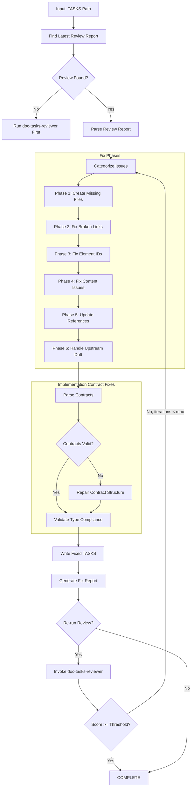
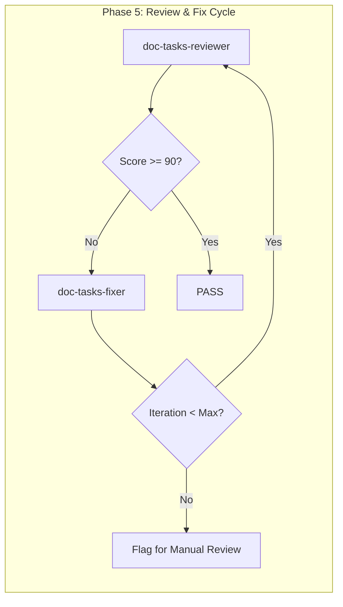

# doc-tasks-fixer

## Purpose

Automated **fix skill** that reads the latest review report and applies fixes to TASKS (Implementation Tasks) documents. This skill bridges the gap between `doc-tasks-reviewer` (which identifies issues) and the corrected TASKS, enabling iterative improvement cycles.

**Layer**: 11 (TASKS Quality Improvement)

**Upstream**: SPEC documents, TSPEC documents, TASKS document, Review Report (`TASKS-NN.R_review_report_vNNN.md`)

**Downstream**: Fixed TASKS, Fix Report (`TASKS-NN.F_fix_report_vNNN.md`)

---

## When to Use This Skill

Use `doc-tasks-fixer` when:

- **After Review**: Run after `doc-tasks-reviewer` identifies issues
- **Iterative Improvement**: Part of Review -> Fix -> Review cycle
- **Automated Pipeline**: CI/CD integration for quality gates
- **Batch Fixes**: Apply fixes to multiple TASKS based on review reports
- **Implementation Contract Issues**: Contracts have incomplete or malformed structure

**Do NOT use when**:
- No review report exists (run `doc-tasks-reviewer` first)
- Creating new TASKS (use `doc-tasks` or `doc-tasks-autopilot`)
- Only need validation (use `doc-tasks-validator`)

---

## Skill Dependencies

| Skill | Purpose | When Used |
|-------|---------|-----------|
| `doc-tasks-reviewer` | Source of issues to fix | Input (reads review report) |
| `doc-naming` | Element ID standards | Fix element IDs |
| `doc-tasks` | TASKS creation rules | Create missing sections |
| `doc-spec` | SPEC traceability | Validate upstream links |
| `doc-tspec` | TSPEC traceability | Validate test links |

---

## Workflow Overview



---

## Fix Phases

### Phase 1: Create Missing Files

Creates files that are referenced but don't exist.

**Scope**:

| Missing File | Action | Template Used |
|--------------|--------|---------------|
| `TASKS-NN_contracts.py` | Create contracts stub | Python contracts template |
| `TASKS-NN_dependencies.yaml` | Create dependencies file | Dependencies template |
| `IPLAN-NNN_*.md` | Create implementation plan | IPLAN template |
| Reference docs | Create placeholder | REF template |

**Contracts Stub Template**:

```python
"""
TASKS-NN: Implementation Contracts
Auto-generated by doc-tasks-fixer - requires completion

This module defines the implementation contracts (Protocol interfaces,
exception hierarchies, state machines, data models) for TASKS-NN.
"""

from typing import Protocol, runtime_checkable
from enum import Enum, auto
from dataclasses import dataclass
from abc import ABC, abstractmethod


# =============================================================================
# Section 7: Protocol Interfaces
# =============================================================================

@runtime_checkable
class ExampleProtocol(Protocol):
    """Protocol interface placeholder.

    TODO: Define actual protocol methods based on SPEC requirements.
    """

    def execute(self, input_data: dict) -> dict:
        """Execute the main operation.

        Args:
            input_data: Input parameters

        Returns:
            Operation result
        """
        ...


# =============================================================================
# Section 8: Exception Hierarchies
# =============================================================================

class TasksBaseException(Exception):
    """Base exception for TASKS-NN operations."""

    def __init__(self, message: str, error_code: str = "ERR-000"):
        self.message = message
        self.error_code = error_code
        super().__init__(self.message)


class ValidationError(TasksBaseException):
    """Raised when validation fails."""

    def __init__(self, message: str, field: str = None):
        super().__init__(message, "ERR-VAL-001")
        self.field = field


class ProcessingError(TasksBaseException):
    """Raised when processing fails."""

    def __init__(self, message: str, step: str = None):
        super().__init__(message, "ERR-PROC-001")
        self.step = step


# =============================================================================
# Section 8: State Machine Contracts
# =============================================================================

class TaskState(Enum):
    """Task state machine states."""

    PENDING = auto()
    IN_PROGRESS = auto()
    BLOCKED = auto()
    COMPLETED = auto()
    FAILED = auto()


# Valid state transitions
STATE_TRANSITIONS = {
    TaskState.PENDING: [TaskState.IN_PROGRESS, TaskState.BLOCKED],
    TaskState.IN_PROGRESS: [TaskState.COMPLETED, TaskState.FAILED, TaskState.BLOCKED],
    TaskState.BLOCKED: [TaskState.PENDING, TaskState.IN_PROGRESS],
    TaskState.COMPLETED: [],  # Terminal state
    TaskState.FAILED: [TaskState.PENDING],  # Can retry
}


# =============================================================================
# Section 8: Data Models
# =============================================================================

@dataclass
class TaskModel:
    """Data model for a task.

    TODO: Extend based on SPEC requirements.
    """

    id: str
    title: str
    status: TaskState = TaskState.PENDING
    priority: int = 2
    assignee: str = None

    def validate(self) -> bool:
        """Validate the task data."""
        if not self.id or not self.title:
            return False
        if not 1 <= self.priority <= 5:
            return False
        return True
```

**Dependencies Template**:

```yaml
# TASKS-NN: Dependencies
# Auto-generated by doc-tasks-fixer - requires completion

dependencies:
  version: "1.0.0"
  tasks_id: TASKS-NN
  created: "YYYY-MM-DD"
  status: draft

upstream:
  specs:
    - id: SPEC-XX
      version: "1.0.0"
      sections:
        # TODO: List required SPEC sections
        - SPEC-XX.section.element

  tspecs:
    - id: TSPEC-XX
      version: "1.0.0"
      test_cases:
        # TODO: List related test cases
        - TSPEC-XX.40.01

downstream:
  implementations:
    # TODO: List downstream implementations
    - file: src/module/component.py
      status: pending

  iplans:
    # TODO: List implementation plans
    - id: IPLAN-001
      status: pending

blocking:
  # Tasks that block this TASKS completion
  - task_id: TASKS-XX
    reason: "Dependency on shared component"

blocked_by:
  # Tasks that this TASKS blocks
  - task_id: TASKS-YY
    reason: "Provides foundation interfaces"
```

---

### Phase 2: Fix Broken Links

Updates links to point to correct locations.

**Fix Actions**:

| Issue Code | Issue | Fix Action |
|------------|-------|------------|
| REV-L001 | Broken internal link | Update path or create target file |
| REV-L002 | External link unreachable | Add warning comment, keep link |
| REV-L003 | Absolute path used | Convert to relative path |
| REV-L010 | SPEC reference broken | Update SPEC path |
| REV-L011 | TSPEC reference broken | Update TSPEC path |
| REV-L012 | Contract import broken | Fix Python import path |

**Path Resolution Logic**:

```python
def fix_link_path(tasks_location: str, target_path: str) -> str:
    """Calculate correct relative path based on TASKS location."""

    # TASKS files: docs/11_TASKS/TASKS-01.md
    # Contracts: docs/11_TASKS/contracts/
    # Dependencies: docs/11_TASKS/deps/

    if is_python_import(target_path):
        return fix_python_import(tasks_location, target_path)
    elif is_spec_reference(target_path):
        return fix_spec_ref(tasks_location, target_path)
    elif is_tspec_reference(target_path):
        return fix_tspec_ref(tasks_location, target_path)
    else:
        return calculate_relative_path(tasks_location, target_path)
```

---

### Phase 3: Fix Element IDs

Converts invalid element IDs to correct format.

**Conversion Rules**:

| Pattern | Issue | Conversion |
|---------|-------|------------|
| `TASKS.NN.XX.SS` | Invalid type code | Convert to valid TASKS code |
| `TASK-XXX` | Legacy pattern | `TASKS.NN.18.SS` (Implementation Task) |
| `CONTRACT-XXX` | Legacy pattern | `TASKS.NN.30.SS` (Contract Definition) |
| `DEP-XXX` | Legacy pattern | `TASKS.NN.18.SS` |

**Type Code Mapping** (TASKS-specific):

| Invalid Code | Valid Code | Element Type |
|--------------|------------|--------------|
| 01-17 | 18 | Implementation Task |
| 19-29 | 30 | Contract Definition |
| Any other | 18/30 | Map to task or contract |

**Valid TASKS Type Codes**:

| Code | Element Type | Description |
|------|--------------|-------------|
| 18 | Implementation Task | Individual implementation task |
| 30 | Contract Definition | Protocol, exception, state machine, or data model |

**Regex Patterns**:

```python
# Find element IDs with invalid type codes for TASKS
invalid_tasks_type = r'TASKS\.(\d{2})\.(?!18|30)(\d{2})\.(\d{2})'

# Find legacy patterns
legacy_task = r'###\s+TASK-(\d+):'
legacy_contract = r'###\s+CONTRACT-(\d+):'
legacy_dep = r'###\s+DEP-(\d+):'
```

---

### Phase 4: Fix Content Issues

Addresses placeholders and incomplete content.

**Fix Actions**:

| Issue Code | Issue | Fix Action |
|------------|-------|------------|
| REV-P001 | `[TODO]` placeholder | Flag for manual completion (cannot auto-fix) |
| REV-P002 | `[TBD]` placeholder | Flag for manual completion (cannot auto-fix) |
| REV-P003 | Template date `YYYY-MM-DD` | Replace with current date |
| REV-P004 | Template name `[Name]` | Replace with metadata author or flag |
| REV-P005 | Empty section | Add minimum template content |
| REV-C001 | Missing Protocol signature | Add placeholder method signature |
| REV-C002 | Missing exception hierarchy | Add base exception class |
| REV-C003 | Invalid state transitions | Add transition validation |

**Auto-Replacements**:

```python
replacements = {
    'YYYY-MM-DDTHH:MM:SS': datetime.now().strftime('%Y-%m-%dT%H:%M:%S'),
    'YYYY-MM-DD': datetime.now().strftime('%Y-%m-%d'),
    'MM/DD/YYYY': datetime.now().strftime('%m/%d/%Y'),
    '[Current date]': datetime.now().strftime('%Y-%m-%dT%H:%M:%S'),
}
```

**Contract Structure Repair**:

| Missing Element | Added Template |
|-----------------|----------------|
| Protocol methods | `def method(self) -> None: ...` |
| Exception base | `class BaseException(Exception): pass` |
| State enum | `class State(Enum): INITIAL = auto()` |
| Data model | `@dataclass class Model: id: str` |

---

### Phase 5: Update References

Ensures traceability and cross-references are correct.

**Fix Actions**:

| Issue | Fix Action |
|-------|------------|
| Missing `@spec:` reference | Add SPEC traceability tag |
| Missing `@tspec:` reference | Add TSPEC traceability tag |
| Incorrect upstream path | Update to correct relative path |
| Missing traceability entry | Add to traceability matrix |
| Missing dependency link | Add to dependencies section |

**SPEC/TSPEC Traceability Fix**:

```markdown
<!-- Before -->
## TASKS.01.18.01: Implement Authentication Handler

<!-- After -->
## TASKS.01.18.01: Implement Authentication Handler

@spec: [SPEC-01.auth.handler](../09_SPEC/SPEC-01.md#auth-handler)
@tspec: [TSPEC-01.40.01](../10_TSPEC/TSPEC-01.md#tspec-01-40-01)
```

---

### Phase 6: Handle Upstream Drift

Addresses issues where upstream SPEC/TSPEC documents have changed since TASKS creation.

**Drift Issue Codes** (from `doc-tasks-reviewer`):

| Code | Severity | Description | Auto-Fix Possible |
|------|----------|-------------|-------------------|
| REV-D001 | Warning | SPEC/TSPEC document modified after TASKS | No (flag for review) |
| REV-D002 | Warning | Referenced specification content changed | No (flag for review) |
| REV-D003 | Info | Upstream document version incremented | Yes (update @ref version) |
| REV-D004 | Info | New specifications added to upstream | No (flag for review) |
| REV-D005 | Error | Critical upstream modification (>20% change) | No (flag for review) |

**Fix Actions**:

| Issue | Auto-Fix | Action |
|-------|----------|--------|
| REV-D001/D002/D004/D005 | No | Add `[DRIFT]` marker to affected references, generate drift summary |
| REV-D003 (version change) | Yes | Update `@spec:` or `@tspec:` tag to include current version |

**Drift Marker Format**:

```markdown
<!-- DRIFT: SPEC-01.md modified 2026-02-08 (TASKS created 2026-02-05) -->
@spec: [SPEC-01.auth.handler](../09_SPEC/SPEC-01.md#auth-handler)

<!-- DRIFT: TSPEC-01.md modified 2026-02-09 (TASKS created 2026-02-05) -->
@tspec: [TSPEC-01.40.01](../10_TSPEC/TSPEC-01.md#tspec-01-40-01)
```

---

## Implementation Contract Fixes

TASKS documents contain implementation contracts in Sections 7-8. This section details specific contract repair strategies.

### Contract Detection

```python
def find_contracts(content: str) -> dict:
    """Find all contracts in TASKS content."""
    contracts = {
        'protocols': [],
        'exceptions': [],
        'state_machines': [],
        'data_models': []
    }

    # Find Python code blocks containing contracts
    code_blocks = re.findall(r'```python\n(.*?)```', content, re.DOTALL)

    for block in code_blocks:
        if 'class' in block and 'Protocol' in block:
            contracts['protocols'].append(block)
        if 'Exception' in block or 'Error' in block:
            contracts['exceptions'].append(block)
        if 'Enum' in block and 'State' in block.lower():
            contracts['state_machines'].append(block)
        if '@dataclass' in block or 'TypedDict' in block:
            contracts['data_models'].append(block)

    return contracts
```

### Contract Type Requirements

| Contract Type | Required Elements |
|---------------|-------------------|
| Protocol | `@runtime_checkable`, method signatures with type hints |
| Exception | Base class, error_code, retry semantics |
| State Machine | `Enum` class, `STATE_TRANSITIONS` dict |
| Data Model | Type annotations, `validate()` method |

### Contract Repair Actions

| Issue | Repair Action |
|-------|---------------|
| Missing `@runtime_checkable` | Add decorator to Protocol |
| Missing type hints | Add `-> None` default return type |
| Missing error_code | Add `error_code` attribute to exception |
| Invalid state transitions | Add missing states to transition dict |
| Missing dataclass decorator | Add `@dataclass` decorator |
| Missing validate method | Add placeholder validate method |

### Contract Template Sections

**Section 7: Protocol Interfaces**

```python
@runtime_checkable
class ProtocolName(Protocol):
    """Protocol description.

    @spec: SPEC-XX.section
    """

    def method_name(self, param: Type) -> ReturnType:
        """Method description."""
        ...
```

**Section 8: Exception Hierarchy**

```python
class ModuleBaseException(Exception):
    """Base exception for module.

    Attributes:
        message: Error message
        error_code: Unique error identifier
        retry_allowed: Whether operation can be retried
    """

    def __init__(self, message: str, error_code: str = "ERR-000"):
        self.message = message
        self.error_code = error_code
        self.retry_allowed = False
        super().__init__(self.message)
```

**Section 8: State Machine**

```python
class EntityState(Enum):
    """State machine for Entity.

    @spec: SPEC-XX.state_machine
    """

    INITIAL = auto()
    PROCESSING = auto()
    COMPLETED = auto()
    FAILED = auto()


STATE_TRANSITIONS: dict[EntityState, list[EntityState]] = {
    EntityState.INITIAL: [EntityState.PROCESSING],
    EntityState.PROCESSING: [EntityState.COMPLETED, EntityState.FAILED],
    EntityState.COMPLETED: [],  # Terminal
    EntityState.FAILED: [EntityState.INITIAL],  # Retry
}
```

**Section 8: Data Model**

```python
@dataclass
class EntityModel:
    """Data model for Entity.

    @spec: SPEC-XX.data_model
    """

    id: str
    name: str
    status: EntityState = EntityState.INITIAL
    created_at: datetime = field(default_factory=datetime.utcnow)

    def validate(self) -> bool:
        """Validate model data."""
        if not self.id or not self.name:
            return False
        return True
```

---

## Command Usage

### Basic Usage

```bash
# Fix TASKS based on latest review
/doc-tasks-fixer TASKS-01

# Fix with explicit review report
/doc-tasks-fixer TASKS-01 --review-report TASKS-01.R_review_report_v001.md

# Fix and re-run review
/doc-tasks-fixer TASKS-01 --revalidate

# Fix with iteration limit
/doc-tasks-fixer TASKS-01 --revalidate --max-iterations 3

# Fix contracts only
/doc-tasks-fixer TASKS-01 --fix-types contracts
```

### Options

| Option | Default | Description |
|--------|---------|-------------|
| `--review-report` | latest | Specific review report to use |
| `--revalidate` | false | Run reviewer after fixes |
| `--max-iterations` | 3 | Max fix-review cycles |
| `--fix-types` | all | Specific fix types (comma-separated) |
| `--create-missing` | true | Create missing reference files |
| `--backup` | true | Backup TASKS before fixing |
| `--dry-run` | false | Preview fixes without applying |
| `--validate-contracts` | true | Validate contract structure after fixes |
| `--type-check` | false | Run mypy on contract code blocks |
| `--acknowledge-drift` | false | Interactive drift acknowledgment mode |
| `--update-drift-cache` | true | Update .drift_cache.json after fixes |

### Fix Types

| Type | Description |
|------|-------------|
| `missing_files` | Create missing contract, dependency docs |
| `broken_links` | Fix link paths and import references |
| `element_ids` | Convert invalid/legacy element IDs (18, 30) |
| `content` | Fix placeholders, dates, names |
| `references` | Update SPEC/TSPEC traceability and cross-references |
| `drift` | Handle upstream drift detection issues |
| `contracts` | Fix implementation contract structure issues |
| `all` | All fix types (default) |

---

## Output Artifacts

### Fix Report

**File Naming**: `TASKS-NN.F_fix_report_vNNN.md`

**Location**: Same folder as the TASKS document.

**Structure**:

```markdown
---
title: "TASKS-NN.F: Fix Report v001"
tags:
  - tasks
  - fix-report
  - quality-assurance
custom_fields:
  document_type: fix-report
  artifact_type: TASKS-FIX
  layer: 11
  parent_doc: TASKS-NN
  source_review: TASKS-NN.R_review_report_v001.md
  fix_date: "YYYY-MM-DDTHH:MM:SS"
  fix_tool: doc-tasks-fixer
  fix_version: "1.0"
---

# TASKS-NN Fix Report v001

## Summary

| Metric | Value |
|--------|-------|
| Source Review | TASKS-NN.R_review_report_v001.md |
| Issues in Review | 22 |
| Issues Fixed | 18 |
| Issues Remaining | 4 (manual review required) |
| Files Created | 2 |
| Files Modified | 1 |
| Contracts Repaired | 6 |

## Files Created

| File | Type | Location |
|------|------|----------|
| TASKS-01_contracts.py | Contract Stubs | docs/11_TASKS/contracts/ |
| TASKS-01_dependencies.yaml | Dependencies | docs/11_TASKS/deps/ |

## Contract Structure Repairs

| Contract | Type | Issue | Repair Applied |
|----------|------|-------|----------------|
| AuthProtocol | Protocol | Missing @runtime_checkable | Added decorator |
| ValidationError | Exception | Missing error_code | Added attribute |
| TaskState | State Machine | Invalid transitions | Fixed transition dict |
| UserModel | Data Model | Missing validate() | Added method |
| ProcessProtocol | Protocol | Missing type hints | Added return types |
| ConfigError | Exception | Missing retry semantics | Added retry_allowed |

## Fixes Applied

| # | Issue Code | Issue | Fix Applied | File |
|---|------------|-------|-------------|------|
| 1 | REV-N004 | Invalid element type | Converted to type 18 | TASKS-01.md |
| 2 | REV-C001 | Missing Protocol signature | Added placeholder | TASKS-01.md |
| 3 | REV-L003 | Absolute path used | Converted to relative | TASKS-01.md |

## Issues Requiring Manual Review

| # | Issue Code | Issue | Location | Reason |
|---|------------|-------|----------|--------|
| 1 | REV-P001 | [TODO] placeholder | TASKS-01.md:L78 | Implementation logic needed |
| 2 | REV-D002 | SPEC content changed | SPEC-01.auth | Review specification update |

## Upstream Drift Summary

| Upstream Document | Reference | Modified | TASKS Updated | Days Stale | Action Required |
|-------------------|-----------|----------|---------------|------------|-----------------|
| SPEC-01.md | TASKS-01:L57 | 2026-02-08 | 2026-02-05 | 3 | Review for changes |
| TSPEC-01.md | TASKS-01:L92 | 2026-02-09 | 2026-02-05 | 4 | Review for changes |

## Type Check Results

| Contract | mypy Status | Issues |
|----------|-------------|--------|
| AuthProtocol | Pass | None |
| ValidationError | Pass | None |
| TaskState | Warning | Missing annotation on line 45 |

## Validation After Fix

| Metric | Before | After | Delta |
|--------|--------|-------|-------|
| Review Score | 80 | 93 | +13 |
| Errors | 7 | 0 | -7 |
| Warnings | 9 | 4 | -5 |
| Valid Contracts | 8/14 | 14/14 | +6 |

## Next Steps

1. Complete [TODO] placeholders in implementation tasks
2. Review upstream SPEC/TSPEC drift
3. Implement contract methods in TASKS-01_contracts.py
4. Run `/doc-tasks-reviewer TASKS-01` to verify fixes
5. Run mypy on contracts to ensure type compliance
```

---

## Integration with Autopilot

This skill is invoked by `doc-tasks-autopilot` in the Review -> Fix cycle:



**Autopilot Integration Points**:

| Phase | Action | Skill |
|-------|--------|-------|
| Phase 5a | Run initial review | `doc-tasks-reviewer` |
| Phase 5b | Apply fixes if issues found | `doc-tasks-fixer` |
| Phase 5c | Re-run review | `doc-tasks-reviewer` |
| Phase 5d | Repeat until pass or max iterations | Loop |

---

## Error Handling

### Recovery Actions

| Error | Action |
|-------|--------|
| Review report not found | Prompt to run `doc-tasks-reviewer` first |
| Cannot create file (permissions) | Log error, continue with other fixes |
| Cannot parse review report | Abort with clear error message |
| Contract parse error | Attempt repair, flag if unrecoverable |
| mypy validation failure | Log warning, continue with fixes |
| Max iterations exceeded | Generate report, flag for manual review |

### Backup Strategy

Before applying any fixes:

1. Create backup in `tmp/backup/TASKS-NN_YYYYMMDD_HHMMSS/`
2. Copy all TASKS files to backup location
3. Apply fixes to original files
4. If error during fix, restore from backup

---

## Related Skills

| Skill | Relationship |
|-------|--------------|
| `doc-tasks-reviewer` | Provides review report (input) |
| `doc-tasks-autopilot` | Orchestrates Review -> Fix cycle |
| `doc-tasks-validator` | Structural validation |
| `doc-naming` | Element ID standards |
| `doc-tasks` | TASKS creation rules |
| `doc-spec` | SPEC upstream traceability |
| `doc-tspec` | TSPEC upstream traceability |

---

## Version History

| Version | Date | Changes |
|---------|------|---------|
| 1.0 | 2026-02-10 | Initial skill creation; 6-phase fix workflow; Implementation contract repair (Protocol, Exception, State Machine, Data Model); Contract stub and dependency file generation; Element ID conversion (types 18, 30); SPEC/TSPEC drift handling; Optional mypy type checking; Integration with autopilot Review->Fix cycle |
