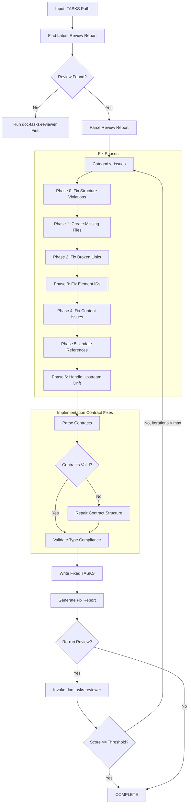
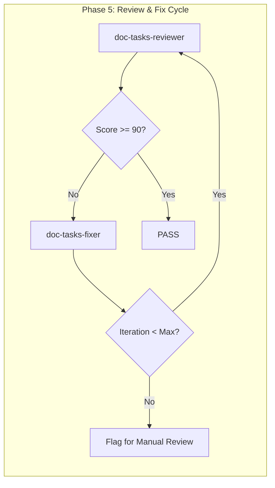

# doc-tasks-fixer

## Purpose

Automated **fix skill** that reads the latest review report and applies fixes to TASKS (Implementation Tasks) documents. This skill bridges the gap between `doc-tasks-reviewer` (which identifies issues) and the corrected TASKS, enabling iterative improvement cycles.

**Layer**: 11 (TASKS Quality Improvement)

**Upstream**: SPEC documents, TSPEC documents, TASKS document, Review Report (`TASKS-NN.R_review_report_vNNN.md`)

**Downstream**: Fixed TASKS, Fix Report (`TASKS-NN.F_fix_report_vNNN.md`)

---

## When to Use This Skill

Use `doc-tasks-fixer` when:

- **After Review**: Run after `doc-tasks-reviewer` identifies issues
- **Iterative Improvement**: Part of Review -> Fix -> Review cycle
- **Automated Pipeline**: CI/CD integration for quality gates
- **Batch Fixes**: Apply fixes to multiple TASKS based on review reports
- **Implementation Contract Issues**: Contracts have incomplete or malformed structure

**Do NOT use when**:
- No review report exists (run `doc-tasks-reviewer` first)
- Creating new TASKS (use `doc-tasks` or `doc-tasks-autopilot`)
- Only need validation (use `doc-tasks-validator`)

---

## Skill Dependencies

| Skill | Purpose | When Used |
|-------|---------|-----------|
| `doc-tasks-reviewer` | Source of issues to fix | Input (reads review report) |
| `doc-naming` | Element ID standards | Fix element IDs |
| `doc-tasks` | TASKS creation rules | Create missing sections |
| `doc-spec` | SPEC traceability | Validate upstream links |
| `doc-tspec` | TSPEC traceability | Validate test links |

---

## Workflow Overview



---

## Fix Phases

### Phase 0: Fix Structure Violations (CRITICAL)

Fixes TASKS documents that are not in nested folders. This phase runs FIRST because all subsequent phases depend on correct folder structure.

**Nested Folder Rule**: ALL TASKS documents MUST be in nested folders regardless of document size.

**Required Structure**:
| TASKS Type | Required Location |
|------------|-------------------|
| Monolithic | `docs/11_TASKS/TASKS-NN_{slug}/TASKS-NN_{slug}.md` |

**Fix Actions**:

| Issue Code | Issue | Fix Action |
|------------|-------|------------|
| REV-STR001 | TASKS not in nested folder | Create folder, move file, update all links |
| REV-STR002 | TASKS folder name doesn't match TASKS ID | Rename folder to match |
| REV-STR003 | Monolithic TASKS >25KB should be sectioned | Flag for manual review |

**Structure Fix Workflow**:

```python
def fix_tasks_structure(tasks_path: str) -> list[Fix]:
    """Fix TASKS structure violations."""
    fixes = []

    filename = os.path.basename(tasks_path)
    parent_folder = os.path.dirname(tasks_path)

    # Extract TASKS ID and slug from filename
    match = re.match(r'TASKS-(\d+)_([^/]+)\.md', filename)
    if not match:
        return []  # Cannot auto-fix invalid filename

    tasks_id = match.group(1)
    slug = match.group(2)
    expected_folder = f"TASKS-{tasks_id}_{slug}"

    # Check if already in nested folder
    if os.path.basename(parent_folder) != expected_folder:
        # Create nested folder
        new_folder = os.path.join(os.path.dirname(parent_folder), expected_folder)
        os.makedirs(new_folder, exist_ok=True)

        # Move file
        new_path = os.path.join(new_folder, filename)
        shutil.move(tasks_path, new_path)
        fixes.append(f"Moved {tasks_path} to {new_path}")

        # Update upstream links in moved file
        content = Path(new_path).read_text()
        updated_content = content.replace('../10_TSPEC/', '../../10_TSPEC/')
        updated_content = updated_content.replace('../09_SPEC/', '../../09_SPEC/')
        Path(new_path).write_text(updated_content)
        fixes.append(f"Updated relative links for nested folder structure")

    return fixes
```

**Link Path Updates After Move**:

| Original Path | Updated Path |
|---------------|--------------|
| `../09_SPEC/SPEC-01_slug/SPEC-01.yaml` | `../../09_SPEC/SPEC-01_slug/SPEC-01.yaml` |
| `../10_TSPEC/UTEST/UTEST-01_slug/UTEST-01.md` | `../../10_TSPEC/UTEST/UTEST-01_slug/UTEST-01.md` |

---

### Phase 1: Create Missing Files

Creates files that are referenced but don't exist.

**Scope**:

| Missing File | Action | Template Used |
|--------------|--------|---------------|
| `TASKS-NN_contracts.py` | Create contracts stub | Python contracts template |
| `TASKS-NN_dependencies.yaml` | Create dependencies file | Dependencies template |
| `IPLAN-NNN_*.md` | Create implementation plan | IPLAN template |
| Reference docs | Create placeholder | REF template |

**Contracts Stub Template**:

```python
"""
TASKS-NN: Implementation Contracts
Auto-generated by doc-tasks-fixer - requires completion

This module defines the implementation contracts (Protocol interfaces,
exception hierarchies, state machines, data models) for TASKS-NN.
"""

from typing import Protocol, runtime_checkable
from enum import Enum, auto
from dataclasses import dataclass
from abc import ABC, abstractmethod


# =============================================================================
# Section 7: Protocol Interfaces
# =============================================================================

@runtime_checkable
class ExampleProtocol(Protocol):
    """Protocol interface placeholder.

    TODO: Define actual protocol methods based on SPEC requirements.
    """

    def execute(self, input_data: dict) -> dict:
        """Execute the main operation.

        Args:
            input_data: Input parameters

        Returns:
            Operation result
        """
        ...


# =============================================================================
# Section 8: Exception Hierarchies
# =============================================================================

class TasksBaseException(Exception):
    """Base exception for TASKS-NN operations."""

    def __init__(self, message: str, error_code: str = "ERR-000"):
        self.message = message
        self.error_code = error_code
        super().__init__(self.message)


class ValidationError(TasksBaseException):
    """Raised when validation fails."""

    def __init__(self, message: str, field: str = None):
        super().__init__(message, "ERR-VAL-001")
        self.field = field


class ProcessingError(TasksBaseException):
    """Raised when processing fails."""

    def __init__(self, message: str, step: str = None):
        super().__init__(message, "ERR-PROC-001")
        self.step = step


# =============================================================================
# Section 8: State Machine Contracts
# =============================================================================

class TaskState(Enum):
    """Task state machine states."""

    PENDING = auto()
    IN_PROGRESS = auto()
    BLOCKED = auto()
    COMPLETED = auto()
    FAILED = auto()


# Valid state transitions
STATE_TRANSITIONS = {
    TaskState.PENDING: [TaskState.IN_PROGRESS, TaskState.BLOCKED],
    TaskState.IN_PROGRESS: [TaskState.COMPLETED, TaskState.FAILED, TaskState.BLOCKED],
    TaskState.BLOCKED: [TaskState.PENDING, TaskState.IN_PROGRESS],
    TaskState.COMPLETED: [],  # Terminal state
    TaskState.FAILED: [TaskState.PENDING],  # Can retry
}


# =============================================================================
# Section 8: Data Models
# =============================================================================

@dataclass
class TaskModel:
    """Data model for a task.

    TODO: Extend based on SPEC requirements.
    """

    id: str
    title: str
    status: TaskState = TaskState.PENDING
    priority: int = 2
    assignee: str = None

    def validate(self) -> bool:
        """Validate the task data."""
        if not self.id or not self.title:
            return False
        if not 1 <= self.priority <= 5:
            return False
        return True
```

**Dependencies Template**:

```yaml
# TASKS-NN: Dependencies
# Auto-generated by doc-tasks-fixer - requires completion

dependencies:
  version: "1.0.0"
  tasks_id: TASKS-NN
  created: "YYYY-MM-DD"
  status: draft

upstream:
  specs:
    - id: SPEC-XX
      version: "1.0.0"
      sections:
        # TODO: List required SPEC sections
        - SPEC-XX.section.element

  tspecs:
    - id: TSPEC-XX
      version: "1.0.0"
      test_cases:
        # TODO: List related test cases
        - TSPEC-XX.40.01

downstream:
  implementations:
    # TODO: List downstream implementations
    - file: src/module/component.py
      status: pending

  iplans:
    # TODO: List implementation plans
    - id: IPLAN-001
      status: pending

blocking:
  # Tasks that block this TASKS completion
  - task_id: TASKS-XX
    reason: "Dependency on shared component"

blocked_by:
  # Tasks that this TASKS blocks
  - task_id: TASKS-YY
    reason: "Provides foundation interfaces"
```

---

### Phase 2: Fix Broken Links

Updates links to point to correct locations.

**Fix Actions**:

| Issue Code | Issue | Fix Action |
|------------|-------|------------|
| REV-L001 | Broken internal link | Update path or create target file |
| REV-L002 | External link unreachable | Add warning comment, keep link |
| REV-L003 | Absolute path used | Convert to relative path |
| REV-L010 | SPEC reference broken | Update SPEC path |
| REV-L011 | TSPEC reference broken | Update TSPEC path |
| REV-L012 | Contract import broken | Fix Python import path |

**Path Resolution Logic**:

```python
def fix_link_path(tasks_location: str, target_path: str) -> str:
    """Calculate correct relative path based on TASKS location."""

    # TASKS files: docs/11_TASKS/TASKS-01.md
    # Contracts: docs/11_TASKS/contracts/
    # Dependencies: docs/11_TASKS/deps/

    if is_python_import(target_path):
        return fix_python_import(tasks_location, target_path)
    elif is_spec_reference(target_path):
        return fix_spec_ref(tasks_location, target_path)
    elif is_tspec_reference(target_path):
        return fix_tspec_ref(tasks_location, target_path)
    else:
        return calculate_relative_path(tasks_location, target_path)
```

---

### Phase 3: Fix Element IDs

Converts invalid element IDs to correct format.

**Conversion Rules**:

| Pattern | Issue | Conversion |
|---------|-------|------------|
| `TASKS.NN.XX.SS` | Invalid type code | Convert to valid TASKS code |
| `TASK-XXX` | Legacy pattern | `TASKS.NN.18.SS` (Implementation Task) |
| `CONTRACT-XXX` | Legacy pattern | `TASKS.NN.30.SS` (Contract Definition) |
| `DEP-XXX` | Legacy pattern | `TASKS.NN.18.SS` |

**Type Code Mapping** (TASKS-specific):

| Invalid Code | Valid Code | Element Type |
|--------------|------------|--------------|
| 01-17 | 18 | Implementation Task |
| 19-29 | 30 | Contract Definition |
| Any other | 18/30 | Map to task or contract |

**Valid TASKS Type Codes**:

| Code | Element Type | Description |
|------|--------------|-------------|
| 18 | Implementation Task | Individual implementation task |
| 30 | Contract Definition | Protocol, exception, state machine, or data model |

**Regex Patterns**:

```python
# Find element IDs with invalid type codes for TASKS
invalid_tasks_type = r'TASKS\.(\d{2})\.(?!18|30)(\d{2})\.(\d{2})'

# Find legacy patterns
legacy_task = r'###\s+TASK-(\d+):'
legacy_contract = r'###\s+CONTRACT-(\d+):'
legacy_dep = r'###\s+DEP-(\d+):'
```

---

### Phase 4: Fix Content Issues

Addresses placeholders and incomplete content.

**Fix Actions**:

| Issue Code | Issue | Fix Action |
|------------|-------|------------|
| REV-P001 | `[TODO]` placeholder | Flag for manual completion (cannot auto-fix) |
| REV-P002 | `[TBD]` placeholder | Flag for manual completion (cannot auto-fix) |
| REV-P003 | Template date `YYYY-MM-DD` | Replace with current date |
| REV-P004 | Template name `[Name]` | Replace with metadata author or flag |
| REV-P005 | Empty section | Add minimum template content |
| REV-C001 | Missing Protocol signature | Add placeholder method signature |
| REV-C002 | Missing exception hierarchy | Add base exception class |
| REV-C003 | Invalid state transitions | Add transition validation |

**Auto-Replacements**:

```python
replacements = {
    'YYYY-MM-DDTHH:MM:SS': datetime.now().strftime('%Y-%m-%dT%H:%M:%S'),
    'YYYY-MM-DD': datetime.now().strftime('%Y-%m-%d'),
    'MM/DD/YYYY': datetime.now().strftime('%m/%d/%Y'),
    '[Current date]': datetime.now().strftime('%Y-%m-%dT%H:%M:%S'),
}
```

**Contract Structure Repair**:

| Missing Element | Added Template |
|-----------------|----------------|
| Protocol methods | `def method(self) -> None: ...` |
| Exception base | `class BaseException(Exception): pass` |
| State enum | `class State(Enum): INITIAL = auto()` |
| Data model | `@dataclass class Model: id: str` |

---

### Phase 5: Update References

Ensures traceability and cross-references are correct.

**Fix Actions**:

| Issue | Fix Action |
|-------|------------|
| Missing `@spec:` reference | Add SPEC traceability tag |
| Missing `@tspec:` reference | Add TSPEC traceability tag |
| Incorrect upstream path | Update to correct relative path |
| Missing traceability entry | Add to traceability matrix |
| Missing dependency link | Add to dependencies section |

**SPEC/TSPEC Traceability Fix**:

```markdown
<!-- Before -->
## TASKS.01.18.01: Implement Authentication Handler

<!-- After -->
## TASKS.01.18.01: Implement Authentication Handler

@spec: [SPEC-01.auth.handler](../09_SPEC/SPEC-01.md#auth-handler)
@tspec: [TSPEC-01.40.01](../10_TSPEC/TSPEC-01.md#tspec-01-40-01)
```

---

### Phase 6: Handle Upstream Drift (Auto-Merge)

Addresses issues where upstream SPEC/TSPEC documents have changed since TASKS creation using a tiered auto-merge system.

**Upstream/Downstream Context**:

| Direction | Artifacts | Relationship |
|-----------|-----------|--------------|
| Upstream | SPEC, TSPEC | Source of requirements and test specifications |
| Downstream | Code, IPLAN | Implementation artifacts that depend on TASKS |

#### Tiered Auto-Merge Thresholds

The auto-merge system uses three tiers based on the percentage of change detected in upstream documents.

| Tier | Change % | Action | Version Bump | Human Review |
|------|----------|--------|--------------|--------------|
| **Tier 1** | < 5% | Auto-merge new tasks | Patch (x.x.+1) | No |
| **Tier 2** | 5-15% | Auto-merge with detailed changelog | Minor (x.+1.0) | Optional |
| **Tier 3** | > 15% | Archive current, trigger regeneration | Major (+1.0.0) | Required |

#### Change Percentage Calculation

```python
def calculate_change_percentage(
    upstream_doc: str,
    tasks_doc: str,
    drift_cache: dict
) -> float:
    """Calculate upstream change percentage affecting TASKS.

    Args:
        upstream_doc: Path to SPEC or TSPEC document
        tasks_doc: Path to TASKS document
        drift_cache: Previous drift state from .drift_cache.json

    Returns:
        Change percentage (0.0 to 100.0)
    """
    # Count affected elements
    current_refs = extract_upstream_references(tasks_doc)
    cached_refs = drift_cache.get('references', {})

    # Calculate changes
    added_refs = set(current_refs) - set(cached_refs)
    removed_refs = set(cached_refs) - set(current_refs)
    modified_refs = [r for r in current_refs
                     if r in cached_refs and current_refs[r] != cached_refs[r]]

    total_refs = max(len(current_refs), len(cached_refs), 1)
    changed_refs = len(added_refs) + len(removed_refs) + len(modified_refs)

    return (changed_refs / total_refs) * 100
```

#### Task ID Pattern

Auto-generated tasks follow the pattern: `TASK-NN-SSS`

| Component | Description | Example |
|-----------|-------------|---------|
| `NN` | Module number (from TASKS-NN) | `01`, `02`, `15` |
| `SSS` | Sequence number within module | `001`, `002`, `999` |

**Full Pattern**: `TASK-{module:02d}-{sequence:03d}`

**Examples**:
- `TASK-01-001`: First task in module 01
- `TASK-03-042`: 42nd task in module 03
- `TASK-15-007`: 7th task in module 15

```python
def generate_task_id(module_number: int, existing_tasks: list[str]) -> str:
    """Generate next available task ID for a module.

    Args:
        module_number: The TASKS module number (NN from TASKS-NN)
        existing_tasks: List of existing task IDs in the module

    Returns:
        Next available task ID in format TASK-NN-SSS
    """
    # Extract sequence numbers from existing tasks
    pattern = re.compile(rf'TASK-{module_number:02d}-(\d{{3}})')
    sequences = [int(m.group(1)) for t in existing_tasks
                 if (m := pattern.match(t))]

    next_seq = max(sequences, default=0) + 1
    return f"TASK-{module_number:02d}-{next_seq:03d}"
```

#### No Deletion Policy

Tasks are NEVER deleted. Instead, they are marked as `[CANCELLED]` with a reason.

**Rationale**: Preserves audit trail, prevents orphaned downstream references, maintains traceability.

```markdown
<!-- Before: Active task -->
### TASK-01-003: Implement Rate Limiting

@spec: SPEC-01.rate_limit
Status: pending
Priority: P2

<!-- After: Cancelled task -->
### TASK-01-003: Implement Rate Limiting [CANCELLED]

@spec: SPEC-01.rate_limit
Status: cancelled
Cancelled: 2026-02-10
Cancel-Reason: Upstream SPEC-01 removed rate limiting requirement (REV-D007)
Original-Priority: P2

<!-- Cancellation preserves all original content below -->
```

**Cancellation Metadata**:

| Field | Description |
|-------|-------------|
| `Status` | Changed to `cancelled` |
| `Cancelled` | Date of cancellation (YYYY-MM-DD) |
| `Cancel-Reason` | Why task was cancelled (with issue code) |
| `Original-Priority` | Preserved for audit trail |

#### Tier 1: Auto-Merge (< 5% Change)

Minor changes are automatically merged without human intervention.

**Actions**:
1. Generate new task IDs for added requirements
2. Update existing task references to new upstream versions
3. Increment patch version (e.g., 1.0.0 -> 1.0.1)
4. Update drift cache

```python
def tier1_auto_merge(tasks_doc: str, upstream_changes: dict) -> MergeResult:
    """Auto-merge minor upstream changes.

    Args:
        tasks_doc: Path to TASKS document
        upstream_changes: Dict of detected changes

    Returns:
        MergeResult with applied changes
    """
    result = MergeResult()

    # Add new tasks for new specifications
    for spec_ref in upstream_changes.get('added', []):
        task_id = generate_task_id(get_module_number(tasks_doc), get_existing_tasks(tasks_doc))
        new_task = create_task_from_spec(spec_ref, task_id)
        result.tasks_added.append(new_task)

    # Update version references
    for ref in upstream_changes.get('version_changed', []):
        update_spec_reference(tasks_doc, ref['old'], ref['new'])
        result.refs_updated.append(ref)

    # Increment patch version
    result.new_version = increment_patch_version(get_tasks_version(tasks_doc))

    return result
```

#### Tier 2: Auto-Merge with Changelog (5-15% Change)

Moderate changes are merged with detailed documentation.

**Actions**:
1. All Tier 1 actions
2. Generate detailed changelog entry
3. Mark affected tasks with `[DRIFT-REVIEWED]` marker
4. Increment minor version (e.g., 1.0.1 -> 1.1.0)
5. Update dependency links
6. Flag for optional human review

**Changelog Format**:

```markdown
## Changelog

### v1.1.0 (2026-02-10) - Upstream Drift Merge

**Merge Type**: Tier 2 Auto-Merge (8.3% change)
**Upstream Documents**: SPEC-01.md, TSPEC-01.md

#### Tasks Added
| ID | Title | Source |
|----|-------|--------|
| TASK-01-015 | Implement OAuth2 PKCE flow | SPEC-01.auth.oauth2_pkce (added 2026-02-09) |
| TASK-01-016 | Add token refresh mechanism | SPEC-01.auth.token_refresh (added 2026-02-09) |

#### Tasks Modified
| ID | Change | Reason |
|----|--------|--------|
| TASK-01-003 | Updated acceptance criteria | SPEC-01.auth.session updated |

#### References Updated
| Old Reference | New Reference |
|---------------|---------------|
| SPEC-01.md@v1.2.0 | SPEC-01.md@v1.3.0 |
| TSPEC-01.md@v1.1.0 | TSPEC-01.md@v1.2.0 |

#### Implementation Contracts Affected
| Contract | Change |
|----------|--------|
| AuthProtocol | New method: `refresh_token()` |
| TokenModel | New field: `refresh_expires_at` |
```

#### Tier 3: Archive and Regenerate (> 15% Change)

Major changes require archiving and regeneration.

**Actions**:
1. Create archive manifest
2. Archive current TASKS version
3. Trigger full TASKS regeneration via `doc-tasks-autopilot`
4. Increment major version (e.g., 1.1.0 -> 2.0.0)
5. Require human review before finalization

**Archive Manifest Format**:

```yaml
# TASKS-NN_archive_manifest_vNNN.yaml
archive:
  document: TASKS-01
  archived_version: "1.1.0"
  archive_date: "2026-02-10T16:00:00"
  archive_reason: "Tier 3 upstream drift (23.5% change)"
  archive_location: "archive/TASKS-01_v1.1.0/"

drift_summary:
  total_change_percentage: 23.5
  upstream_documents:
    - document: SPEC-01.md
      previous_version: "1.3.0"
      current_version: "2.0.0"
      change_percentage: 18.2
    - document: TSPEC-01.md
      previous_version: "1.2.0"
      current_version: "1.5.0"
      change_percentage: 12.1

affected_tasks:
  total: 42
  cancelled: 8
  modified: 15
  unchanged: 19

implementation_contracts:
  protocols_affected: 3
  exceptions_affected: 1
  state_machines_affected: 2
  data_models_affected: 4

downstream_impact:
  iplan_documents:
    - IPLAN-001: "Requires regeneration"
    - IPLAN-002: "Minor updates needed"
  code_files:
    - src/auth/handler.py: "Interface changes required"
    - src/auth/models.py: "Data model updates required"

regeneration:
  trigger_skill: doc-tasks-autopilot
  trigger_args: "SPEC-01 --force-regenerate"
  new_version: "2.0.0"
  human_review_required: true
```

#### Enhanced Drift Cache

The drift cache tracks merge history and upstream state.

**File**: `.drift_cache.json` (in TASKS directory)

```json
{
  "tasks_document": "TASKS-01",
  "cache_version": "2.0",
  "last_updated": "2026-02-10T16:00:00",
  "current_version": "1.1.0",

  "upstream_state": {
    "SPEC-01.md": {
      "version": "1.3.0",
      "hash": "sha256:abc123...",
      "last_checked": "2026-02-10T16:00:00",
      "sections_referenced": [
        "SPEC-01.auth.handler",
        "SPEC-01.auth.session",
        "SPEC-01.auth.oauth2_pkce"
      ]
    },
    "TSPEC-01.md": {
      "version": "1.2.0",
      "hash": "sha256:def456...",
      "last_checked": "2026-02-10T16:00:00",
      "test_cases_referenced": [
        "TSPEC-01.40.01",
        "TSPEC-01.40.02"
      ]
    }
  },

  "merge_history": [
    {
      "date": "2026-02-08T10:00:00",
      "tier": 1,
      "change_percentage": 2.3,
      "version_before": "1.0.0",
      "version_after": "1.0.1",
      "tasks_added": ["TASK-01-012"],
      "tasks_modified": [],
      "tasks_cancelled": []
    },
    {
      "date": "2026-02-10T16:00:00",
      "tier": 2,
      "change_percentage": 8.3,
      "version_before": "1.0.1",
      "version_after": "1.1.0",
      "tasks_added": ["TASK-01-015", "TASK-01-016"],
      "tasks_modified": ["TASK-01-003"],
      "tasks_cancelled": [],
      "changelog_entry": "v1.1.0"
    }
  ],

  "task_registry": {
    "TASK-01-001": {"status": "completed", "spec_ref": "SPEC-01.auth.init"},
    "TASK-01-002": {"status": "in_progress", "spec_ref": "SPEC-01.auth.login"},
    "TASK-01-003": {"status": "pending", "spec_ref": "SPEC-01.auth.session"},
    "TASK-01-012": {"status": "pending", "spec_ref": "SPEC-01.auth.logout"},
    "TASK-01-015": {"status": "pending", "spec_ref": "SPEC-01.auth.oauth2_pkce"},
    "TASK-01-016": {"status": "pending", "spec_ref": "SPEC-01.auth.token_refresh"}
  },

  "implementation_contracts": {
    "protocols": ["AuthProtocol", "SessionProtocol"],
    "exceptions": ["AuthException", "SessionException"],
    "state_machines": ["AuthState", "SessionState"],
    "data_models": ["UserModel", "TokenModel", "SessionModel"]
  }
}
```

#### Handling Task Dependencies

When upstream drift affects tasks with dependencies, the auto-merge system handles cascading updates.

```python
def handle_task_dependencies(
    affected_task: str,
    task_graph: dict,
    change_type: str
) -> list[str]:
    """Propagate changes through task dependency graph.

    Args:
        affected_task: Task ID that was modified/cancelled
        task_graph: Dict mapping task IDs to their dependencies
        change_type: 'modified' or 'cancelled'

    Returns:
        List of downstream tasks requiring update
    """
    downstream_tasks = []

    # Find tasks that depend on the affected task
    for task_id, deps in task_graph.items():
        if affected_task in deps.get('blocked_by', []):
            downstream_tasks.append(task_id)

            if change_type == 'cancelled':
                # Remove dependency, add warning
                add_task_warning(task_id,
                    f"Dependency {affected_task} was cancelled")
            elif change_type == 'modified':
                # Mark for review
                add_task_marker(task_id, '[UPSTREAM-MODIFIED]')

    return downstream_tasks
```

#### Handling Implementation Contracts

When upstream drift affects implementation contracts, the auto-merge system updates contract definitions.

```python
def update_implementation_contracts(
    contracts: dict,
    upstream_changes: dict
) -> ContractUpdateResult:
    """Update implementation contracts based on upstream drift.

    Args:
        contracts: Current contract definitions
        upstream_changes: Detected upstream changes

    Returns:
        ContractUpdateResult with changes applied
    """
    result = ContractUpdateResult()

    for spec_change in upstream_changes.get('spec_changes', []):
        # Check if change affects a protocol
        if affects_protocol(spec_change, contracts['protocols']):
            protocol = get_affected_protocol(spec_change)
            if spec_change['type'] == 'method_added':
                add_protocol_method(protocol, spec_change['method'])
                result.protocols_modified.append(protocol)
            elif spec_change['type'] == 'method_signature_changed':
                update_protocol_signature(protocol, spec_change)
                result.protocols_modified.append(protocol)

        # Check if change affects a data model
        if affects_data_model(spec_change, contracts['data_models']):
            model = get_affected_model(spec_change)
            if spec_change['type'] == 'field_added':
                add_model_field(model, spec_change['field'])
                result.models_modified.append(model)

    return result
```

#### Drift Issue Codes

| Code | Severity | Description | Auto-Fix | Tier |
|------|----------|-------------|----------|------|
| REV-D001 | Info | Upstream version incremented | Yes | 1 |
| REV-D002 | Warning | Minor specification content changed (< 5%) | Yes | 1 |
| REV-D003 | Warning | Moderate specification change (5-15%) | Yes | 2 |
| REV-D004 | Warning | New specifications added to upstream | Yes | 1-2 |
| REV-D005 | Error | Specifications removed from upstream | Yes (cancel) | 2 |
| REV-D006 | Error | Major upstream modification (> 15%) | Partial | 3 |
| REV-D007 | Error | Breaking change to implementation contract | Partial | 3 |
| REV-D008 | Info | Task dependency graph affected | Yes | 1-2 |

#### Fix Actions Summary

| Tier | Issue Codes | Auto-Fix Action |
|------|-------------|-----------------|
| 1 | REV-D001, REV-D002, REV-D004 (minor) | Auto-merge, patch version |
| 2 | REV-D003, REV-D004 (moderate), REV-D005, REV-D008 | Auto-merge with changelog, minor version |
| 3 | REV-D006, REV-D007 | Archive, regenerate, major version |

---

## Implementation Contract Fixes

TASKS documents contain implementation contracts in Sections 7-8. This section details specific contract repair strategies.

### Contract Detection

```python
def find_contracts(content: str) -> dict:
    """Find all contracts in TASKS content."""
    contracts = {
        'protocols': [],
        'exceptions': [],
        'state_machines': [],
        'data_models': []
    }

    # Find Python code blocks containing contracts
    code_blocks = re.findall(r'```python\n(.*?)```', content, re.DOTALL)

    for block in code_blocks:
        if 'class' in block and 'Protocol' in block:
            contracts['protocols'].append(block)
        if 'Exception' in block or 'Error' in block:
            contracts['exceptions'].append(block)
        if 'Enum' in block and 'State' in block.lower():
            contracts['state_machines'].append(block)
        if '@dataclass' in block or 'TypedDict' in block:
            contracts['data_models'].append(block)

    return contracts
```

### Contract Type Requirements

| Contract Type | Required Elements |
|---------------|-------------------|
| Protocol | `@runtime_checkable`, method signatures with type hints |
| Exception | Base class, error_code, retry semantics |
| State Machine | `Enum` class, `STATE_TRANSITIONS` dict |
| Data Model | Type annotations, `validate()` method |

### Contract Repair Actions

| Issue | Repair Action |
|-------|---------------|
| Missing `@runtime_checkable` | Add decorator to Protocol |
| Missing type hints | Add `-> None` default return type |
| Missing error_code | Add `error_code` attribute to exception |
| Invalid state transitions | Add missing states to transition dict |
| Missing dataclass decorator | Add `@dataclass` decorator |
| Missing validate method | Add placeholder validate method |

### Contract Template Sections

**Section 7: Protocol Interfaces**

```python
@runtime_checkable
class ProtocolName(Protocol):
    """Protocol description.

    @spec: SPEC-XX.section
    """

    def method_name(self, param: Type) -> ReturnType:
        """Method description."""
        ...
```

**Section 8: Exception Hierarchy**

```python
class ModuleBaseException(Exception):
    """Base exception for module.

    Attributes:
        message: Error message
        error_code: Unique error identifier
        retry_allowed: Whether operation can be retried
    """

    def __init__(self, message: str, error_code: str = "ERR-000"):
        self.message = message
        self.error_code = error_code
        self.retry_allowed = False
        super().__init__(self.message)
```

**Section 8: State Machine**

```python
class EntityState(Enum):
    """State machine for Entity.

    @spec: SPEC-XX.state_machine
    """

    INITIAL = auto()
    PROCESSING = auto()
    COMPLETED = auto()
    FAILED = auto()


STATE_TRANSITIONS: dict[EntityState, list[EntityState]] = {
    EntityState.INITIAL: [EntityState.PROCESSING],
    EntityState.PROCESSING: [EntityState.COMPLETED, EntityState.FAILED],
    EntityState.COMPLETED: [],  # Terminal
    EntityState.FAILED: [EntityState.INITIAL],  # Retry
}
```

**Section 8: Data Model**

```python
@dataclass
class EntityModel:
    """Data model for Entity.

    @spec: SPEC-XX.data_model
    """

    id: str
    name: str
    status: EntityState = EntityState.INITIAL
    created_at: datetime = field(default_factory=datetime.utcnow)

    def validate(self) -> bool:
        """Validate model data."""
        if not self.id or not self.name:
            return False
        return True
```

---

## Command Usage

### Basic Usage

```bash
# Fix TASKS based on latest review
/doc-tasks-fixer TASKS-01

# Fix with explicit review report
/doc-tasks-fixer TASKS-01 --review-report TASKS-01.R_review_report_v001.md

# Fix and re-run review
/doc-tasks-fixer TASKS-01 --revalidate

# Fix with iteration limit
/doc-tasks-fixer TASKS-01 --revalidate --max-iterations 3

# Fix contracts only
/doc-tasks-fixer TASKS-01 --fix-types contracts

# Handle upstream drift with auto-merge
/doc-tasks-fixer TASKS-01 --fix-types drift

# Force Tier 2 merge with changelog
/doc-tasks-fixer TASKS-01 --fix-types drift --auto-merge-tier 2

# Custom tier thresholds
/doc-tasks-fixer TASKS-01 --tier1-threshold 3 --tier2-threshold 10

# Force regeneration (Tier 3) for major upstream changes
/doc-tasks-fixer TASKS-01 --force-regenerate

# Preview drift merge without applying
/doc-tasks-fixer TASKS-01 --fix-types drift --dry-run
```

### Options

| Option | Default | Description |
|--------|---------|-------------|
| `--review-report` | latest | Specific review report to use |
| `--revalidate` | false | Run reviewer after fixes |
| `--max-iterations` | 3 | Max fix-review cycles |
| `--fix-types` | all | Specific fix types (comma-separated) |
| `--create-missing` | true | Create missing reference files |
| `--backup` | true | Backup TASKS before fixing |
| `--dry-run` | false | Preview fixes without applying |
| `--validate-contracts` | true | Validate contract structure after fixes |
| `--type-check` | false | Run mypy on contract code blocks |
| `--acknowledge-drift` | false | Interactive drift acknowledgment mode |
| `--update-drift-cache` | true | Update .drift_cache.json after fixes |
| `--auto-merge-tier` | auto | Force specific tier (1, 2, 3) or auto-detect |
| `--tier1-threshold` | 5 | Maximum change % for Tier 1 auto-merge |
| `--tier2-threshold` | 15 | Maximum change % for Tier 2 auto-merge |
| `--skip-archive` | false | Skip archive creation for Tier 3 (not recommended) |
| `--force-regenerate` | false | Force Tier 3 regeneration regardless of change % |
| `--preserve-cancelled` | true | Keep cancelled tasks in document |
| `--generate-changelog` | true | Generate changelog for Tier 2+ merges |
| `--notify-downstream` | true | Flag downstream IPLAN/Code for updates |

### Fix Types

| Type | Description |
|------|-------------|
| `missing_files` | Create missing contract, dependency docs |
| `broken_links` | Fix link paths and import references |
| `element_ids` | Convert invalid/legacy element IDs (18, 30) |
| `content` | Fix placeholders, dates, names |
| `references` | Update SPEC/TSPEC traceability and cross-references |
| `drift` | Handle upstream drift with tiered auto-merge (Tier 1-3) |
| `contracts` | Fix implementation contract structure issues |
| `all` | All fix types (default) |

### Drift Fix Sub-Options

| Sub-Option | Description |
|------------|-------------|
| `drift:detect` | Only detect drift, do not apply fixes |
| `drift:tier1` | Apply only Tier 1 (< 5%) auto-merges |
| `drift:tier2` | Apply Tier 1 and Tier 2 (5-15%) auto-merges |
| `drift:tier3` | Full drift handling including archive/regenerate |
| `drift:changelog` | Generate changelog without applying merges |

---

## Output Artifacts

### Fix Report

**Nested Folder Rule**: ALL TASKS use nested folders (`TASKS-NN_{slug}/`) regardless of size. Fix reports are stored alongside the TASKS document in the nested folder.

**File Naming**: `TASKS-NN.F_fix_report_vNNN.md`

**Location**: Inside the TASKS nested folder: `docs/11_TASKS/TASKS-NN_{slug}/`

**Structure**:

```markdown
---
title: "TASKS-NN.F: Fix Report v001"
tags:
  - tasks
  - fix-report
  - quality-assurance
custom_fields:
  document_type: fix-report
  artifact_type: TASKS-FIX
  layer: 11
  parent_doc: TASKS-NN
  source_review: TASKS-NN.R_review_report_v001.md
  fix_date: "YYYY-MM-DDTHH:MM:SS"
  fix_tool: doc-tasks-fixer
  fix_version: "1.0"
---

# TASKS-NN Fix Report v001

## Summary

| Metric | Value |
|--------|-------|
| Source Review | TASKS-NN.R_review_report_v001.md |
| Issues in Review | 22 |
| Issues Fixed | 18 |
| Issues Remaining | 4 (manual review required) |
| Files Created | 2 |
| Files Modified | 1 |
| Contracts Repaired | 6 |

## Files Created

| File | Type | Location |
|------|------|----------|
| TASKS-01_contracts.py | Contract Stubs | docs/11_TASKS/contracts/ |
| TASKS-01_dependencies.yaml | Dependencies | docs/11_TASKS/deps/ |

## Contract Structure Repairs

| Contract | Type | Issue | Repair Applied |
|----------|------|-------|----------------|
| AuthProtocol | Protocol | Missing @runtime_checkable | Added decorator |
| ValidationError | Exception | Missing error_code | Added attribute |
| TaskState | State Machine | Invalid transitions | Fixed transition dict |
| UserModel | Data Model | Missing validate() | Added method |
| ProcessProtocol | Protocol | Missing type hints | Added return types |
| ConfigError | Exception | Missing retry semantics | Added retry_allowed |

## Fixes Applied

| # | Issue Code | Issue | Fix Applied | File |
|---|------------|-------|-------------|------|
| 1 | REV-N004 | Invalid element type | Converted to type 18 | TASKS-01.md |
| 2 | REV-C001 | Missing Protocol signature | Added placeholder | TASKS-01.md |
| 3 | REV-L003 | Absolute path used | Converted to relative | TASKS-01.md |

## Issues Requiring Manual Review

| # | Issue Code | Issue | Location | Reason |
|---|------------|-------|----------|--------|
| 1 | REV-P001 | [TODO] placeholder | TASKS-01.md:L78 | Implementation logic needed |
| 2 | REV-D002 | SPEC content changed | SPEC-01.auth | Review specification update |

## Upstream Drift Summary

| Upstream Document | Reference | Modified | TASKS Updated | Days Stale | Action Required |
|-------------------|-----------|----------|---------------|------------|-----------------|
| SPEC-01.md | TASKS-01:L57 | 2026-02-08 | 2026-02-05 | 3 | Review for changes |
| TSPEC-01.md | TASKS-01:L92 | 2026-02-09 | 2026-02-05 | 4 | Review for changes |

## Type Check Results

| Contract | mypy Status | Issues |
|----------|-------------|--------|
| AuthProtocol | Pass | None |
| ValidationError | Pass | None |
| TaskState | Warning | Missing annotation on line 45 |

## Validation After Fix

| Metric | Before | After | Delta |
|--------|--------|-------|-------|
| Review Score | 80 | 93 | +13 |
| Errors | 7 | 0 | -7 |
| Warnings | 9 | 4 | -5 |
| Valid Contracts | 8/14 | 14/14 | +6 |

## Next Steps

1. Complete [TODO] placeholders in implementation tasks
2. Review upstream SPEC/TSPEC drift
3. Implement contract methods in TASKS-01_contracts.py
4. Run `/doc-tasks-reviewer TASKS-01` to verify fixes
5. Run mypy on contracts to ensure type compliance
```

---

## Integration with Autopilot

This skill is invoked by `doc-tasks-autopilot` in the Review -> Fix cycle:



**Autopilot Integration Points**:

| Phase | Action | Skill |
|-------|--------|-------|
| Phase 5a | Run initial review | `doc-tasks-reviewer` |
| Phase 5b | Apply fixes if issues found | `doc-tasks-fixer` |
| Phase 5c | Re-run review | `doc-tasks-reviewer` |
| Phase 5d | Repeat until pass or max iterations | Loop |

---

## Error Handling

### Recovery Actions

| Error | Action |
|-------|--------|
| Review report not found | Prompt to run `doc-tasks-reviewer` first |
| Cannot create file (permissions) | Log error, continue with other fixes |
| Cannot parse review report | Abort with clear error message |
| Contract parse error | Attempt repair, flag if unrecoverable |
| mypy validation failure | Log warning, continue with fixes |
| Max iterations exceeded | Generate report, flag for manual review |

### Backup Strategy

Before applying any fixes:

1. Create backup in `tmp/backup/TASKS-NN_YYYYMMDD_HHMMSS/`
2. Copy all TASKS files to backup location
3. Apply fixes to original files
4. If error during fix, restore from backup

---

## Related Skills

| Skill | Relationship |
|-------|--------------|
| `doc-tasks-reviewer` | Provides review report (input) |
| `doc-tasks-autopilot` | Orchestrates Review -> Fix cycle |
| `doc-tasks-validator` | Structural validation |
| `doc-naming` | Element ID standards |
| `doc-tasks` | TASKS creation rules |
| `doc-spec` | SPEC upstream traceability |
| `doc-tspec` | TSPEC upstream traceability |

---

## Version History

| Version | Date | Changes |
|---------|------|---------|
| 2.1 | 2026-02-11 | **Structure Compliance**: Added Phase 0 for nested folder rule enforcement (REV-STR001-STR003); Runs FIRST before other fix phases |
| 2.0 | 2026-02-10 | Enhanced Phase 6 with tiered auto-merge system; Tier 1 (< 5%) auto-merge with patch version; Tier 2 (5-15%) auto-merge with changelog and minor version; Tier 3 (> 15%) archive and regenerate with major version; Task ID pattern TASK-NN-SSS; No deletion policy (mark as [CANCELLED]); Archive manifest creation for Tier 3; Enhanced drift cache with merge history and task registry; Task dependency propagation; Implementation contract update handling; New drift issue codes (REV-D001 through REV-D008) |
| 1.0 | 2026-02-10 | Initial skill creation; 6-phase fix workflow; Implementation contract repair (Protocol, Exception, State Machine, Data Model); Contract stub and dependency file generation; Element ID conversion (types 18, 30); SPEC/TSPEC drift handling; Optional mypy type checking; Integration with autopilot Review->Fix cycle |
