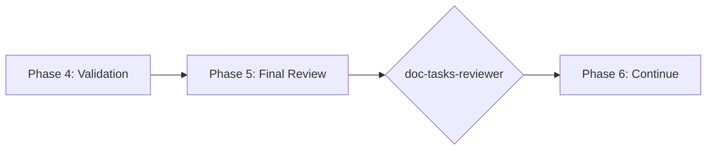

# doc-tasks-reviewer

## Purpose

Comprehensive **content review and quality assurance** for Task Breakdown (TASKS) documents. This skill performs deep content analysis beyond structural validation, checking task completeness, SPEC alignment, implementation contracts, dependency accuracy, and identifying issues that require manual review.

**Layer**: 11 (TASKS Quality Assurance)

**Upstream**: TASKS (from `doc-tasks-autopilot` or `doc-tasks`)

**Downstream**: None (final QA gate before code implementation)

---

## When to Use This Skill

Use `doc-tasks-reviewer` when:

- **After TASKS Generation**: Run immediately after `doc-tasks-autopilot` completes
- **Manual TASKS Edits**: After making manual changes to TASKS
- **Pre-Implementation**: Before starting code implementation
- **Sprint Planning**: When assessing task readiness for development
- **Periodic Review**: Regular quality checks on existing TASKS

**Do NOT use when**:
- TASKS does not exist yet (use `doc-tasks` or `doc-tasks-autopilot` first)
- Need structural/schema validation only (use `doc-tasks-validator`)
- Generating new TASKS content (use `doc-tasks`)

---

## Skill vs Validator: Key Differences

| Aspect | `doc-tasks-validator` | `doc-tasks-reviewer` |
|--------|----------------------|---------------------|
| **Focus** | Schema compliance, CODE-Ready score | Content quality, implementation readiness |
| **Checks** | Required sections, format | Task atomicity, dependency accuracy |
| **Auto-Fix** | Structural issues only | Content issues (formatting) |
| **Output** | CODE-Ready score (numeric) | Review score + issue list |
| **Phase** | Phase 4 (Validation) | Phase 5 (Final Review) |
| **Blocking** | CODE-Ready < threshold blocks | Review score < threshold flags |

---

## Review Checks

### 1. Task Completeness

Validates all tasks have required elements.

**Required Elements**:
- Task ID
- Description
- Acceptance criteria
- Priority
- Estimated complexity
- Dependencies

**Error Codes**:

| Code | Severity | Description |
|------|----------|-------------|
| REV-TC001 | Error | Task missing required element |
| REV-TC002 | Warning | Acceptance criteria insufficient |
| REV-TC003 | Warning | Priority not assigned |
| REV-TC004 | Info | Complexity estimate missing |

---

### 2. SPEC Alignment

Validates tasks trace to SPEC requirements.

**Scope**:
- Every task maps to SPEC component/method
- Full SPEC coverage achieved
- No orphaned tasks
- Implementation order logical

**Error Codes**:

| Code | Severity | Description |
|------|----------|-------------|
| REV-SA001 | Error | Task without SPEC source |
| REV-SA002 | Warning | SPEC component not covered |
| REV-SA003 | Warning | Orphaned task detected |
| REV-SA004 | Info | Implementation order may need adjustment |

---

### 3. Implementation Contracts

Validates Section 7-8 implementation contracts.

**Scope**:
- Protocol interfaces defined
- Exception hierarchies documented
- State machine contracts present
- Data models specified
- DI interfaces defined

**Error Codes**:

| Code | Severity | Description |
|------|----------|-------------|
| REV-IC001 | Warning | Protocol interface missing |
| REV-IC002 | Warning | Exception hierarchy not documented |
| REV-IC003 | Info | State machine contract missing |
| REV-IC004 | Info | DI interface not defined |

---

### 4. Dependency Accuracy

Validates task dependencies are correct.

**Scope**:
- Dependencies exist
- No circular dependencies
- Blocking dependencies identified
- External dependencies documented

**Error Codes**:

| Code | Severity | Description |
|------|----------|-------------|
| REV-DA001 | Error | Dependency does not exist |
| REV-DA002 | Error | Circular dependency detected |
| REV-DA003 | Warning | Blocking dependency not marked |
| REV-DA004 | Info | External dependency not documented |

---

### 5. Task Atomicity

Validates tasks are appropriately sized.

**Scope**:
- Single responsibility
- Independently implementable
- Clear completion criteria
- Reasonable scope

**Error Codes**:

| Code | Severity | Description |
|------|----------|-------------|
| REV-TA001 | Warning | Task too large (should be split) |
| REV-TA002 | Warning | Task has multiple responsibilities |
| REV-TA003 | Info | Completion criteria unclear |
| REV-TA004 | Info | Task scope may be too narrow |

---

### 6. AI Implementation Hints

Validates AI-friendly implementation guidance.

**Scope**:
- File paths specified
- Method signatures suggested
- Import statements provided
- Test patterns documented

**Error Codes**:

| Code | Severity | Description |
|------|----------|-------------|
| REV-AI001 | Warning | File path not specified |
| REV-AI002 | Info | Method signature not suggested |
| REV-AI003 | Info | Import statements not provided |
| REV-AI004 | Info | Test patterns not documented |

---

### 7. Placeholder Detection

Identifies incomplete content requiring replacement.

**Error Codes**:

| Code | Severity | Description |
|------|----------|-------------|
| REV-P001 | Error | [TODO] placeholder found |
| REV-P002 | Error | [TBD] placeholder found |
| REV-P003 | Warning | Template value not replaced |

---

### 8. Naming Compliance

Validates element IDs follow `doc-naming` standards.

**Scope**:
- Element IDs use `TASKS.NN.TT.SS` format
- Element type codes valid for TASKS (18, 30)
- Task naming convention

**Error Codes**:

| Code | Severity | Description |
|------|----------|-------------|
| REV-N001 | Error | Invalid element ID format |
| REV-N002 | Error | Element type code not valid for TASKS |
| REV-N003 | Error | Legacy pattern detected |

---

## Review Score Calculation

**Scoring Formula**:

| Category | Weight | Calculation |
|----------|--------|-------------|
| Task Completeness | 20% | (complete_tasks / total) × 20 |
| SPEC Alignment | 20% | (aligned_tasks / total) × 20 |
| Implementation Contracts | 15% | (contracts_present / required) × 15 |
| Dependency Accuracy | 15% | (valid_deps / total_deps) × 15 |
| Task Atomicity | 10% | (atomic_tasks / total) × 10 |
| AI Implementation Hints | 5% | (hints_present / total) × 5 |
| Placeholder Detection | 5% | (no_placeholders ? 5 : 5 - count) |
| Naming Compliance | 10% | (valid_ids / total_ids) × 10 |

**Total**: Sum of all categories (max 100)

**Thresholds**:
- **PASS**: ≥ 90
- **WARNING**: 80-89
- **FAIL**: < 80

---

## Command Usage

```bash
# Review specific TASKS
/doc-tasks-reviewer TASKS-03

# Review TASKS by path
/doc-tasks-reviewer docs/11_TASKS/TASKS-03_f3_observability.md

# Review all TASKS
/doc-tasks-reviewer all
```

---

## Output Report

Review reports are stored alongside the reviewed document per project standards.

**File Naming**: `TASKS-NN.R_review_report_vNNN.md`

**Location**: Same folder as the reviewed TASKS document.

### Versioning Rules

1. **First Review**: Creates `TASKS-NN.R_review_report_v001.md`
2. **Subsequent Reviews**: Auto-increments version (v002, v003, etc.)
3. **Same-Day Reviews**: Each review gets unique version number

**Version Detection**: Scans folder for existing `TASKS-NN.R_review_report_v*.md` files and increments.

**Example**:

```
docs/11_TASKS/
├── TASKS-03_f3_observability.md
├── TASKS-03.R_review_report_v001.md    # First review
└── TASKS-03.R_review_report_v002.md    # After fixes
```

### Delta Reporting

When previous reviews exist, include score comparison in the report.

See `REVIEW_DOCUMENT_STANDARDS.md` for complete versioning requirements.

---

## Integration with doc-tasks-autopilot

This skill is invoked during Phase 5 of `doc-tasks-autopilot`:



---

## Related Skills

| Skill | Relationship |
|-------|--------------|
| `doc-naming` | Naming standards for Check #8 |
| `doc-tasks-autopilot` | Invokes this skill in Phase 5 |
| `doc-tasks-validator` | Structural validation (Phase 4) |
| `doc-tasks` | TASKS creation rules |
| `doc-spec-reviewer` | Upstream QA |

---

## Version History

| Version | Date | Changes |
|---------|------|---------|
| 1.1 | 2026-02-10 | Added review versioning support (_vNNN pattern); Delta reporting for score comparison |
| 1.0 | 2026-02-10 | Initial skill creation with 8 review checks; Task completeness; SPEC alignment; Implementation contracts; Dependency accuracy; Task atomicity |
