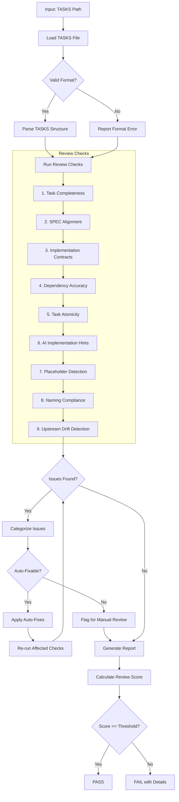
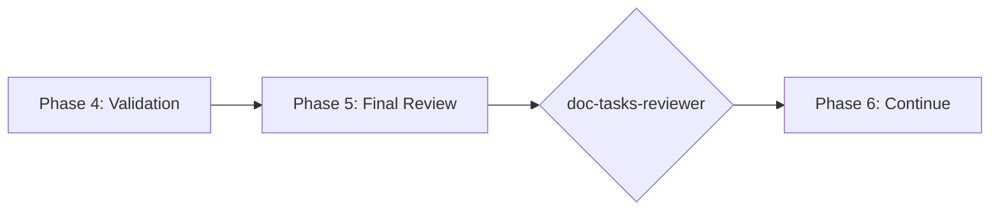

# doc-tasks-reviewer

## Purpose

Comprehensive **content review and quality assurance** for Task Breakdown (TASKS) documents. This skill performs deep content analysis beyond structural validation, checking task completeness, SPEC alignment, implementation contracts, dependency accuracy, and identifying issues that require manual review.

**Layer**: 11 (TASKS Quality Assurance)

**Upstream**: TASKS (from `doc-tasks-autopilot` or `doc-tasks`)

**Downstream**: None (final QA gate before code implementation)

---

## When to Use This Skill

Use `doc-tasks-reviewer` when:

- **After TASKS Generation**: Run immediately after `doc-tasks-autopilot` completes
- **Manual TASKS Edits**: After making manual changes to TASKS
- **Pre-Implementation**: Before starting code implementation
- **Sprint Planning**: When assessing task readiness for development
- **Periodic Review**: Regular quality checks on existing TASKS

**Do NOT use when**:
- TASKS does not exist yet (use `doc-tasks` or `doc-tasks-autopilot` first)
- Need structural/schema validation only (use `doc-tasks-validator`)
- Generating new TASKS content (use `doc-tasks`)

---

## Skill vs Validator: Key Differences

| Aspect | `doc-tasks-validator` | `doc-tasks-reviewer` |
|--------|----------------------|---------------------|
| **Focus** | Schema compliance, CODE-Ready score | Content quality, implementation readiness |
| **Checks** | Required sections, format | Task atomicity, dependency accuracy |
| **Auto-Fix** | Structural issues only | Content issues (formatting) |
| **Output** | CODE-Ready score (numeric) | Review score + issue list |
| **Phase** | Phase 4 (Validation) | Phase 5 (Final Review) |
| **Blocking** | CODE-Ready < threshold blocks | Review score < threshold flags |

---

## Review Workflow



---

## Review Checks

### 1. Task Completeness

Validates all tasks have required elements.

**Required Elements**:
- Task ID
- Description
- Acceptance criteria
- Priority
- Estimated complexity
- Dependencies

**Error Codes**:

| Code | Severity | Description |
|------|----------|-------------|
| REV-TC001 | Error | Task missing required element |
| REV-TC002 | Warning | Acceptance criteria insufficient |
| REV-TC003 | Warning | Priority not assigned |
| REV-TC004 | Info | Complexity estimate missing |

---

### 2. SPEC Alignment

Validates tasks trace to SPEC requirements.

**Scope**:
- Every task maps to SPEC component/method
- Full SPEC coverage achieved
- No orphaned tasks
- Implementation order logical

**Error Codes**:

| Code | Severity | Description |
|------|----------|-------------|
| REV-SA001 | Error | Task without SPEC source |
| REV-SA002 | Warning | SPEC component not covered |
| REV-SA003 | Warning | Orphaned task detected |
| REV-SA004 | Info | Implementation order may need adjustment |

---

### 3. Implementation Contracts

Validates Section 7-8 implementation contracts.

**Scope**:
- Protocol interfaces defined
- Exception hierarchies documented
- State machine contracts present
- Data models specified
- DI interfaces defined

**Error Codes**:

| Code | Severity | Description |
|------|----------|-------------|
| REV-IC001 | Warning | Protocol interface missing |
| REV-IC002 | Warning | Exception hierarchy not documented |
| REV-IC003 | Info | State machine contract missing |
| REV-IC004 | Info | DI interface not defined |

---

### 4. Dependency Accuracy

Validates task dependencies are correct.

**Scope**:
- Dependencies exist
- No circular dependencies
- Blocking dependencies identified
- External dependencies documented

**Error Codes**:

| Code | Severity | Description |
|------|----------|-------------|
| REV-DA001 | Error | Dependency does not exist |
| REV-DA002 | Error | Circular dependency detected |
| REV-DA003 | Warning | Blocking dependency not marked |
| REV-DA004 | Info | External dependency not documented |

---

### 5. Task Atomicity

Validates tasks are appropriately sized.

**Scope**:
- Single responsibility
- Independently implementable
- Clear completion criteria
- Reasonable scope

**Error Codes**:

| Code | Severity | Description |
|------|----------|-------------|
| REV-TA001 | Warning | Task too large (should be split) |
| REV-TA002 | Warning | Task has multiple responsibilities |
| REV-TA003 | Info | Completion criteria unclear |
| REV-TA004 | Info | Task scope may be too narrow |

---

### 6. AI Implementation Hints

Validates AI-friendly implementation guidance.

**Scope**:
- File paths specified
- Method signatures suggested
- Import statements provided
- Test patterns documented

**Error Codes**:

| Code | Severity | Description |
|------|----------|-------------|
| REV-AI001 | Warning | File path not specified |
| REV-AI002 | Info | Method signature not suggested |
| REV-AI003 | Info | Import statements not provided |
| REV-AI004 | Info | Test patterns not documented |

---

### 7. Placeholder Detection

Identifies incomplete content requiring replacement.

**Error Codes**:

| Code | Severity | Description |
|------|----------|-------------|
| REV-P001 | Error | [TODO] placeholder found |
| REV-P002 | Error | [TBD] placeholder found |
| REV-P003 | Warning | Template value not replaced |

---

### 8. Naming Compliance

Validates element IDs follow `doc-naming` standards.

**Scope**:
- Element IDs use `TASKS.NN.TT.SS` format
- Element type codes valid for TASKS (18, 30)
- Task naming convention

**Error Codes**:

| Code | Severity | Description |
|------|----------|-------------|
| REV-N001 | Error | Invalid element ID format |
| REV-N002 | Error | Element type code not valid for TASKS |
| REV-N003 | Error | Legacy pattern detected |

---

### 9. Upstream Drift Detection (Mandatory Cache)

Detects when upstream SPEC and TSPEC documents have been modified after the TASKS was created or last updated.

**The drift cache is mandatory.** All drift detection operations require cache initialization and maintenance.

**Purpose**: Identifies stale TASKS content that may not reflect current SPEC and TSPEC documentation. When SPEC documents (methods, interfaces, components) or TSPEC documents (test cases, coverage requirements) change, the TASKS may need updates to maintain implementation alignment.

**Scope**:
- `@spec:` tag targets (SPEC documents)
- `@tspec:` tag targets (TSPEC documents)
- Traceability section upstream artifact links
- Any markdown links to `../09_SPEC/` or `../10_TSPEC/` source documents

---

#### Drift Cache File (MANDATORY)

**Location**: `docs/11_TASKS/.drift_cache.json`

**Schema**:

```json
{
  "schema_version": "1.0",
  "cache_created": "2026-02-10T17:00:00Z",
  "cache_updated": "2026-02-10T17:00:00Z",
  "tasks_files": {
    "TASKS-03_f3_observability.md": {
      "tasks_version": "1.0",
      "tasks_updated": "2026-02-10T14:30:00",
      "last_review": "2026-02-10T17:00:00",
      "upstream_hashes": {
        "../../09_SPEC/SPEC-03.yaml": "a1b2c3d4e5f6g7h8i9j0k1l2m3n4o5p6q7r8s9t0",
        "../../09_SPEC/SPEC-03.yaml#methods": "b2c3d4e5f6g7h8i9j0k1l2m3n4o5p6q7r8s9t0u1",
        "../../09_SPEC/SPEC-03.yaml#components": "c3d4e5f6g7h8i9j0k1l2m3n4o5p6q7r8s9t0u1v2",
        "../../10_TSPEC/TSPEC-03.md": "d4e5f6g7h8i9j0k1l2m3n4o5p6q7r8s9t0u1v2w3",
        "../../10_TSPEC/TSPEC-03.md#test_cases": "e5f6g7h8i9j0k1l2m3n4o5p6q7r8s9t0u1v2w3x4"
      },
      "upstream_mtimes": {
        "../../09_SPEC/SPEC-03.yaml": "2026-02-08T10:15:00",
        "../../10_TSPEC/TSPEC-03.md": "2026-02-09T16:45:00"
      }
    }
  }
}
```

**Cache Management**:
- Cache file is created on first review if not present
- Cache is updated after each successful review
- Missing cache triggers REV-D006 error
- Corrupted cache triggers cache rebuild with warning

---

#### Three-Phase Detection Algorithm

**Phase 1: Cache Validation**

```
1. Check if .drift_cache.json exists
   - If missing → ERROR REV-D006: "Drift cache not initialized"
   - If corrupted → Rebuild cache, emit WARNING

2. Validate cache schema version
   - If outdated → Migrate cache to current schema

3. Load TASKS entry from cache
   - If TASKS not in cache → Initialize entry
```

**Phase 2: Reference Extraction**

```
1. Extract all upstream references from TASKS:
   - @spec: tags → [path, section anchor]
   - @tspec: tags → [path, section anchor]
   - Links to ../09_SPEC/ → [path]
   - Links to ../10_TSPEC/ → [path]
   - Traceability table upstream artifacts → [path]

2. For each upstream reference:
   a. Resolve path to absolute file path
   b. Check file exists (already covered by Check #2)
   c. Get file modification time (mtime)
```

**Phase 3: Drift Comparison**

```
1. For each upstream reference:
   a. Compare mtime > cached mtime
      - If newer → flag as TIMESTAMP_DRIFT
   b. Compute SHA-256 hash of content
   c. Compare to cached hash
      - If differs → flag as CONTENT_DRIFT
   d. Calculate change percentage
      - If > 20% → flag as SUBSTANTIAL_DRIFT

2. Update cache with current values after comparison
```

---

#### Hash Calculation

**Full File Hash**:

```python
import hashlib

def compute_file_hash(file_path: str) -> str:
    """Compute SHA-256 hash of entire file."""
    with open(file_path, 'rb') as f:
        return hashlib.sha256(f.read()).hexdigest()
```

**Section Hash** (for anchor references):

```python
def compute_section_hash(file_path: str, anchor: str) -> str:
    """Compute SHA-256 hash of specific section."""
    content = extract_section(file_path, anchor)
    return hashlib.sha256(content.encode('utf-8')).hexdigest()

def extract_section(file_path: str, anchor: str) -> str:
    """Extract section content from markdown/yaml by anchor."""
    # For markdown: Find ## {anchor} heading to next ## heading
    # For yaml: Find {anchor}: key to next top-level key
    ...
```

---

#### Error Codes

| Code | Severity | Description |
|------|----------|-------------|
| REV-D001 | Warning | Upstream SPEC/TSPEC document modified after TASKS creation |
| REV-D002 | Warning | Referenced section content has changed (hash mismatch) |
| REV-D003 | Info | Upstream document version incremented |
| REV-D004 | Info | New content added to upstream document |
| REV-D005 | Error | Critical upstream document substantially modified (>20% change) |
| REV-D006 | Error | Drift cache not initialized or missing |

---

#### Report Output

```markdown
## Upstream Drift Analysis

**Cache Status**: Valid (last updated: 2026-02-10T17:00:00Z)

| Upstream Document | TASKS Reference | Last Modified | Cached Modified | Hash Match | Days Stale | Severity |
|-------------------|-----------------|---------------|-----------------|------------|------------|----------|
| SPEC-03.yaml | @spec Section methods | 2026-02-08T10:15:00 | 2026-02-05T09:00:00 | No | 3 | Warning |
| SPEC-03.yaml | @spec components | 2026-02-10T14:30:00 | 2026-02-05T09:00:00 | No | 5 | Warning |
| TSPEC-03.md | @tspec test_cases | 2026-02-09T16:45:00 | 2026-02-05T09:00:00 | Yes | 4 | Info |

**Recommendation**: Review upstream SPEC/TSPEC changes and update TASKS if methods, components, or test cases have changed.

**Cache Updated**: 2026-02-10T17:00:00Z (3 entries refreshed)
```

---

#### Auto-Actions

- Create `.drift_cache.json` if not present (first review)
- Update cache with current hashes and mtimes after review
- Add `[DRIFT]` marker to affected @spec/@tspec tags (optional)
- Generate drift summary in review report

---

#### Configuration

| Setting | Default | Description |
|---------|---------|-------------|
| `cache_enabled` | true | **Mandatory** - Cache is always enabled |
| `drift_threshold_days` | 7 | Days before drift becomes Warning |
| `critical_threshold_days` | 30 | Days before drift becomes Error |
| `tracked_patterns` | `@spec:`, `@tspec:` | Patterns to track for drift |

---

## Review Score Calculation

**Scoring Formula**:

| Category | Weight | Calculation |
|----------|--------|-------------|
| Task Completeness | 19% | (complete_tasks / total) × 19 |
| SPEC Alignment | 19% | (aligned_tasks / total) × 19 |
| Implementation Contracts | 14% | (contracts_present / required) × 14 |
| Dependency Accuracy | 14% | (valid_deps / total_deps) × 14 |
| Task Atomicity | 10% | (atomic_tasks / total) × 10 |
| AI Implementation Hints | 5% | (hints_present / total) × 5 |
| Placeholder Detection | 5% | (no_placeholders ? 5 : 5 - count) |
| Naming Compliance | 9% | (valid_ids / total_ids) × 9 |
| Upstream Drift | 5% | (fresh_refs / total_refs) × 5 |

**Total**: Sum of all categories (max 100)

**Thresholds**:
- **PASS**: >= 90
- **WARNING**: 80-89
- **FAIL**: < 80

---

## Command Usage

```bash
# Review specific TASKS
/doc-tasks-reviewer TASKS-03

# Review TASKS by path
/doc-tasks-reviewer docs/11_TASKS/TASKS-03_f3_observability.md

# Review all TASKS
/doc-tasks-reviewer all
```

---

## Output Report

Review reports are stored alongside the reviewed document per project standards.

**Nested Folder Rule**: ALL TASKS use nested folders (`TASKS-NN_{slug}/`) regardless of size. This ensures review reports, fix reports, and drift cache files are organized with their parent document.

**File Naming**: `TASKS-NN.R_review_report_vNNN.md`

**Location**: Inside the TASKS nested folder: `docs/11_TASKS/TASKS-NN_{slug}/`

### Versioning Rules

1. **First Review**: Creates `TASKS-NN.R_review_report_v001.md`
2. **Subsequent Reviews**: Auto-increments version (v002, v003, etc.)
3. **Same-Day Reviews**: Each review gets unique version number

**Version Detection**: Scans folder for existing `TASKS-NN.R_review_report_v*.md` files and increments.

**Example**:

```
docs/11_TASKS/TASKS-03_f3_observability/
├── TASKS-03_f3_observability.md
├── TASKS-03.R_review_report_v001.md    # First review
├── TASKS-03.R_review_report_v002.md    # After fixes
└── .drift_cache.json
```

### Delta Reporting

When previous reviews exist, include score comparison in the report.

See `REVIEW_DOCUMENT_STANDARDS.md` for complete versioning requirements.

---

## Integration with doc-tasks-autopilot

This skill is invoked during Phase 5 of `doc-tasks-autopilot`:



---

## Related Skills

| Skill | Relationship |
|-------|--------------|
| `doc-naming` | Naming standards for Check #8 |
| `doc-tasks-autopilot` | Invokes this skill in Phase 5 |
| `doc-tasks-validator` | Structural validation (Phase 4) |
| `doc-tasks-fixer` | Applies fixes based on review findings |
| `doc-tasks` | TASKS creation rules |
| `doc-spec-reviewer` | Upstream QA |
| `doc-tspec-reviewer` | Upstream QA (for test specifications) |

---

## Version History

| Version | Date | Changes |
|---------|------|---------|
| 1.3 | 2026-02-10 | Made drift cache mandatory; Added REV-D006 error code for missing cache; Defined cache schema with schema_version; Added Three-Phase Detection Algorithm; Added hash calculation examples; Cache location at docs/11_TASKS/.drift_cache.json; Added cache status to report output |
| 1.2 | 2026-02-10 | Added Check #9: Upstream Drift Detection - detects when SPEC/TSPEC documents modified after TASKS creation; REV-D001-D005 error codes; drift cache support; configurable thresholds; added doc-tasks-fixer to related skills |
| 1.1 | 2026-02-10 | Added review versioning support (_vNNN pattern); Delta reporting for score comparison |
| 1.0 | 2026-02-10 | Initial skill creation with 8 review checks; Task completeness; SPEC alignment; Implementation contracts; Dependency accuracy; Task atomicity |
