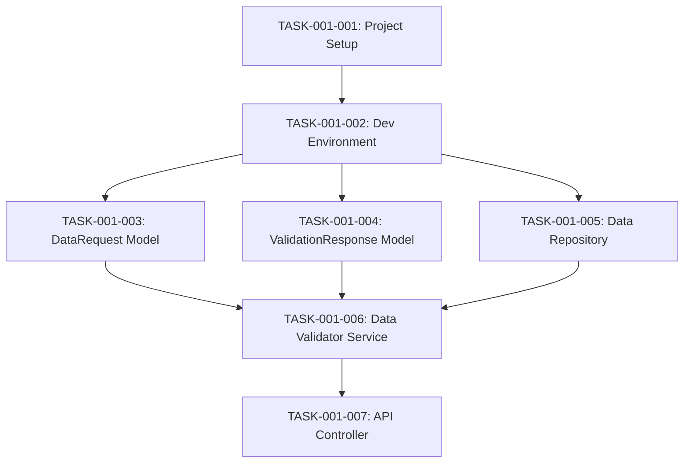

# doc-tasks

## Purpose

Create **Task Breakdown (TASKS)** - Layer 11 artifact in the SDD workflow that decomposes SPEC into actionable, AI-structured TODO tasks for implementation.

**Layer**: 11

**Upstream**: BRD (Layer 1), PRD (Layer 2), EARS (Layer 3), BDD (Layer 4), ADR (Layer 5), SYS (Layer 6), REQ (Layer 7), IMPL (Layer 8), CTR (Layer 9), SPEC (Layer 10)

**Downstream Artifacts**: IPLAN (Layer 12), Code (Layer 13)

## Prerequisites

### Upstream Artifact Verification (CRITICAL)

**Before creating this document, you MUST:**

1. **List existing upstream artifacts**:
   ```bash
   ls docs/BRD/ docs/PRD/ docs/EARS/ docs/BDD/ docs/ADR/ docs/SYS/ docs/REQ/ 2>/dev/null
   ```

2. **Reference only existing documents** in traceability tags
3. **Use `null`** only when upstream artifact type genuinely doesn't exist
4. **NEVER use placeholders** like `BRD-XXX` or `TBD`
5. **Do NOT create missing upstream artifacts** - skip functionality instead


Before creating TASKS, read:

1. **Shared Standards**: `.claude/skills/doc-flow/SHARED_CONTENT.md`
2. **Upstream SPEC**: Read technical specifications (PRIMARY SOURCE)
3. **Template**: `ai_dev_flow/TASKS/TASKS-TEMPLATE.md`
4. **Creation Rules**: `ai_dev_flow/TASKS/TASKS_CREATION_RULES.md`
5. **Validation Rules**: `ai_dev_flow/TASKS/TASKS_VALIDATION_RULES.md`
6. **Validation Script**: `./ai_dev_flow/scripts/validate_tasks.sh`
7. **Implementation Contracts Guide**: `ai_dev_flow/TASKS/IMPLEMENTATION_CONTRACTS_GUIDE.md`

## When to Use This Skill

Use `doc-tasks` when:
- Have completed BRD through SPEC (Layers 1-10)
- Ready to break down SPEC into actionable tasks
- Preparing for implementation planning (Layer 12)
- Need structured TODO format for AI agents
- You are at Layer 11 of the SDD workflow

## TASKS-Specific Guidance

### 1. AI-Structured TODO Format

**Purpose**: Break SPEC into tasks consumable by AI coding agents

**Format**:
```markdown
## Tasks

### Phase 1: Project Setup (3 tasks)

**TASK-001-001: Initialize Project Structure**
- **Action**: Create directory structure per SPEC architecture
- **Files to Create**:
  - `src/controllers/data_validation_controller.py`
  - `src/services/data_validator.py`
  - `src/repositories/data_repository.py`
  - `src/models/data_request.py`
- **Dependencies**: None
- **Estimated Effort**: 30 minutes
- **SPEC Reference**: SPEC-001:implementation.modules
- **Success Criteria**: All directories and empty files created

**TASK-001-002: Set Up Development Environment**
- **Action**: Configure Python environment and dependencies
- **Files to Create**: `requirements.txt`, `pyproject.toml`
- **Dependencies**: TASK-001-001
- **Estimated Effort**: 1 hour
- **SPEC Reference**: SPEC-001:deployment.container
- **Success Criteria**: `pip install -r requirements.txt` succeeds

### Phase 2: Data Models (2 tasks)

**TASK-001-003: Implement DataRequest Model**
- **Action**: Create Pydantic model per CTR-001 schema
- **Files to Modify**: `src/models/data_request.py`
- **Dependencies**: TASK-001-002
- **Estimated Effort**: 1 hour
- **SPEC Reference**: SPEC-001:interfaces.data_models
- **CTR Reference**: CTR-001#/components/schemas/DataRequest
- **Success Criteria**: Model validates per schema, unit tests pass
```

### 2. Required Sections

**Document Control** (MANDATORY - First section before all numbered sections)

**Core Sections**:
1. **Overview**: Summary of task breakdown
2. **Task Hierarchy**: Phases and task groups
3. **Tasks**: Detailed task breakdown (primary content)
4. **Dependencies Graph**: Visual task dependencies (Mermaid diagram)
5. **Effort Summary**: Total effort by phase
6. **Traceability**: Section 7 format with cumulative tags
7. **Implementation Contracts**: Section 8 (MANDATORY) - Contracts provided/consumed

### 3. Task Numbering Format

**Format**: `TASK-{SPEC-ID}-{Task-Number}`

**Example**: `TASK-001-003` means:
- SPEC-001 (from SPEC-001_data_validation.yaml)
- Task 003 (third task in breakdown)

**Benefits**:
- Links task directly to SPEC
- Unique task IDs across project
- Easy to reference in commits

### 4. Task Fields (Required)

**Each task MUST include**:

1. **Task ID**: TASK-{SPEC-ID}-{Task-Number}
2. **Title**: Short description (5-10 words)
3. **Action**: What to do (imperative form)
4. **Files to Create/Modify**: Specific file paths
5. **Dependencies**: Other TASK IDs (or "None")
6. **Estimated Effort**: Time estimate
7. **SPEC Reference**: Section in SPEC (e.g., SPEC-001:implementation.modules)
8. **Success Criteria**: How to verify completion
9. **Optional: CTR Reference**: Link to contract if applicable

### 5. Phase Organization

**Typical Phases**:

1. **Phase 1: Project Setup** (infrastructure, environment)
2. **Phase 2: Data Models** (schemas, models, validation)
3. **Phase 3: Business Logic** (services, core algorithms)
4. **Phase 4: API Layer** (controllers, endpoints)
5. **Phase 5: Error Handling** (error codes, middleware)
6. **Phase 6: Configuration** (env vars, feature flags)
7. **Phase 7: Testing** (unit, integration, performance)
8. **Phase 8: Deployment** (Docker, CI/CD, monitoring)

### 6. Dependencies Graph

**Use Mermaid diagram** to visualize task dependencies:

```markdown
## Dependencies Graph


```

### 7. Effort Summary

**Format**:
```markdown
## Effort Summary

| Phase | Tasks | Total Effort |
|-------|-------|--------------|
| Phase 1: Project Setup | 2 | 1.5 hours |
| Phase 2: Data Models | 2 | 2 hours |
| Phase 3: Business Logic | 3 | 4 hours |
| Phase 4: API Layer | 1 | 1.5 hours |
| Phase 5: Error Handling | 2 | 2 hours |
| Phase 6: Configuration | 1 | 1 hour |
| Phase 7: Testing | 3 | 3 hours |
| Phase 8: Deployment | 2 | 2 hours |
| **TOTAL** | **16** | **17 hours** |

**Assumptions**:
- Developer familiar with Python and FastAPI
- PostgreSQL database already provisioned
- OAuth service already available
```

### 8. Implementation Contracts (MANDATORY)

**Section 8 is required for ALL TASKS files**. Implementation Contracts enable parallel development of dependent TASKS files.

**Structure**:

```markdown
## 8. Implementation Contracts

### 8.1 Contracts Provided by This TASKS
@icon: TASKS-XXX:ContractName
@icon-role: provider

- **Contract Name**: [Interface name]
- **Type**: Protocol Interface | Exception Hierarchy | State Machine | Data Model | DI Interface
- **Consumers**: List of TASKS IDs that depend on this contract
- **Purpose**: Brief description

### 8.2 Contracts Consumed by This TASKS
@icon: TASKS-YYY:OtherContract
@icon-role: consumer

- **Provider**: TASKS-YYY
- **Contract Name**: [Interface name]
- **Purpose**: Why this TASKS needs this contract

### 8.3 No Contracts
If this TASKS provides no contracts and consumes no contracts, state explicitly:
"This TASKS document neither provides nor consumes implementation contracts."
```

**When to Create Contracts**:
- TASKS has 3+ downstream dependencies
- Shared interfaces across multiple implementation sessions
- Complex state machines or exception hierarchies
- Parallel development required

**Contract Types**:
1. **Protocol Interfaces**: `typing.Protocol` with method signatures
2. **Exception Hierarchies**: Typed exceptions with error codes
3. **State Machine Contracts**: `Enum` states with valid transitions
4. **Data Models**: Pydantic/TypedDict schemas
5. **DI Interfaces**: ABC classes for dependency injection

**Reference**: See `ai_dev_flow/TASKS/IMPLEMENTATION_CONTRACTS_GUIDE.md` for detailed guidance.

## Tag Format Convention (By Design)

The SDD framework uses two distinct notation systems for cross-references:

| Notation | Format       | Artifacts                               | Purpose                                                             |
|----------|--------------|----------------------------------------|---------------------------------------------------------------------|
| Dash     | TYPE-NNN     | ADR, SPEC, CTR, IPLAN, ICON            | Technical artifacts - references to files/documents                 |
| Dot      | TYPE.NNN.NNN | BRD, PRD, EARS, BDD, SYS, REQ, IMPL, TASKS | Hierarchical artifacts - references to features inside documents |

**Key Distinction**:
- `@adr: ADR-033` → Points to the document `ADR-033_risk_limit_enforcement.md`
- `@brd: BRD.017.001` → Points to feature 001 inside document `BRD-017.md`

## Unified Feature ID Format (MANDATORY)

**For hierarchical requirements (BRD, PRD, EARS, BDD, SYS, REQ)**:
- **Always use**: `TYPE.NNN.NNN` (dot separator)
- **Never use**: `TYPE-NNN:NNN` (colon separator - DEPRECATED)

Examples:
- `@brd: BRD.017.001` ✅
- `@brd: BRD-017:001` ❌


## Cumulative Tagging Requirements

**Layer 11 (TASKS)**: Must include tags from Layers 1-10

**Tag Count**: 8-10 tags (minimum 8, maximum 10)

**Minimum (IMPL and CTR skipped)**:
```markdown
## Traceability

**Required Tags** (Cumulative Tagging Hierarchy - Layer 11):
```markdown
@brd: BRD.001.003
@prd: PRD.001.002
@ears: EARS.001.001
@bdd: BDD.001.001
@adr: ADR-033, ADR-045
@sys: SYS.001.001
@req: REQ.001.001
@spec: SPEC-001
```

**Maximum (IMPL, CTR, and ICON included)**:
```markdown
@brd: BRD.001.003
@prd: PRD.001.002
@ears: EARS.001.001
@bdd: BDD.001.001
@adr: ADR-033, ADR-045
@sys: SYS.001.001
@req: REQ.001.001
@impl: IMPL.001.001
@ctr: CTR-001
@spec: SPEC-001
@icon: TASKS-001:DataValidator  # if providing or consuming implementation contracts
@icon-role: provider  # or consumer
```

## Upstream/Downstream Artifacts

**Upstream Sources**:
- **BRD** (Layer 1) - Business requirements
- **PRD** (Layer 2) - Product features
- **EARS** (Layer 3) - Formal requirements
- **BDD** (Layer 4) - Test scenarios
- **ADR** (Layer 5) - Architecture decisions
- **SYS** (Layer 6) - System requirements
- **REQ** (Layer 7) - Atomic requirements
- **IMPL** (Layer 8) - Implementation approach (optional)
- **CTR** (Layer 9) - Data contracts (optional)
- **SPEC** (Layer 10) - Technical specifications (PRIMARY SOURCE)

**Downstream Artifacts**:
- **IPLAN** (Layer 12) - Implementation plans (created in `docs/IPLAN/`)
- **Code** (Layer 13) - Implementation

**Same-Type Document Relationships** (conditional):
- `@related-tasks: TASKS-NNN` - TASKS sharing implementation context
- `@depends-tasks: TASKS-NNN` - TASKS that must be completed first

## Creation Process

### Step 1: Read Upstream SPEC

Read SPEC (Layer 10) - technical specifications to decompose.

### Step 2: Reserve ID Number

Check `ai_dev_flow/TASKS/` for next available ID number.

**ID Matching**: TASKS ID typically matches SPEC ID (TASKS-001 from SPEC-001).

### Step 3: Create TASKS File

**File naming**: `ai_dev_flow/TASKS/TASKS-NNN_{slug}.md`

**Example**: `ai_dev_flow/TASKS/TASKS-001_data_validation.md`

### Step 4: Fill Document Control Section

Complete metadata and Document Revision History table.

### Step 5: Write Overview

Summarize task breakdown approach.

### Step 6: Define Phases

Organize tasks into logical phases (8 typical phases).

### Step 7: Create Detailed Tasks

For each task in SPEC:
- Assign TASK ID (TASK-{SPEC-ID}-{Number})
- Write clear Action (imperative)
- List Files to Create/Modify
- Identify Dependencies
- Estimate Effort
- Reference SPEC section
- Define Success Criteria

### Step 8: Create Dependencies Graph

Use Mermaid diagram to visualize task dependencies.

### Step 9: Calculate Effort Summary

Summarize total effort by phase.

### Step 10: Add Cumulative Tags

Include all 8-10 upstream tags (@brd through @spec).

### Step 11: Create/Update Traceability Matrix

**MANDATORY**: Update `ai_dev_flow/TASKS/TASKS-000_TRACEABILITY_MATRIX.md`

### Step 12: Validate TASKS

```bash
./ai_dev_flow/scripts/validate_tasks.sh ai_dev_flow/TASKS/TASKS-001_*.md

python ai_dev_flow/scripts/validate_tags_against_docs.py --artifact TASKS-001 --expected-layers brd,prd,ears,bdd,adr,sys,req,impl,contracts,spec --strict

python ai_dev_flow/scripts/validate_task_dependencies.py ai_dev_flow/TASKS/TASKS-001_*.md
```

### Step 13: Commit Changes

Commit TASKS file and traceability matrix.

## Validation

### Automated Validation

```bash
# Quality gates
./scripts/validate_quality_gates.sh ai_dev_flow/TASKS/TASKS-001_*.md

# Task format validation
./ai_dev_flow/scripts/validate_tasks.sh ai_dev_flow/TASKS/TASKS-001_*.md

# Cumulative tagging
python ai_dev_flow/scripts/validate_tags_against_docs.py \
  --artifact TASKS-001 \
  --expected-layers brd,prd,ears,bdd,adr,sys,req,impl,contracts,spec \
  --strict

# Dependency validation
python ai_dev_flow/scripts/validate_task_dependencies.py ai_dev_flow/TASKS/TASKS-001_*.md
```

### Manual Checklist

- [ ] Document Control section at top
- [ ] Overview explains breakdown approach
- [ ] Tasks organized into phases (8 typical phases)
- [ ] Each task has TASK-{SPEC-ID}-{Number} ID
- [ ] Each task has all required fields
- [ ] Dependencies identified (or "None")
- [ ] Effort estimates provided
- [ ] SPEC references included
- [ ] Success Criteria clear and testable
- [ ] Dependencies Graph (Mermaid diagram) created
- [ ] Effort Summary calculated
- [ ] **Section 8 Implementation Contracts** completed (provider/consumer/none)
- [ ] Cumulative tags: @brd through @spec (8-10 tags) included
- [ ] `@icon` tags added if providing/consuming contracts
- [ ] Traceability matrix updated

## Common Pitfalls

1. **Vague tasks**: Tasks must be specific and actionable
2. **Missing dependencies**: Must identify task dependencies
3. **No effort estimates**: Effort required for planning
4. **Missing SPEC references**: Each task must link to SPEC section
5. **No success criteria**: Must define how to verify completion
6. **Missing cumulative tags**: Layer 11 must include all 8-10 upstream tags
7. **Missing Section 8**: Implementation Contracts section is MANDATORY

## Post-Creation Validation (MANDATORY - NO CONFIRMATION)

**CRITICAL**: Execute this validation loop IMMEDIATELY after document creation. Do NOT proceed to next document until validation passes.

### Automatic Validation Loop

```
LOOP:
  1. Run: python scripts/validate_cross_document.py --document {doc_path} --auto-fix
  2. IF errors fixed: GOTO LOOP (re-validate)
  3. IF warnings fixed: GOTO LOOP (re-validate)
  4. IF unfixable issues: Log for manual review, continue
  5. IF clean: Mark VALIDATED, proceed
```

### Validation Command

```bash
# Per-document validation (Phase 1)
python scripts/validate_cross_document.py --document docs/TASKS/TASKS-NNN_slug.md --auto-fix

# Layer validation (Phase 2) - run when all TASKS documents complete
python scripts/validate_cross_document.py --layer TASKS --auto-fix
```

### Layer-Specific Upstream Requirements

| This Layer | Required Upstream Tags | Count |
|------------|------------------------|-------|
| TASKS (Layer 11) | @brd, @prd, @ears, @bdd, @adr, @sys, @req, @spec (+ @impl, @ctr if created) | 8-10 tags |

### Auto-Fix Actions (No Confirmation Required)

| Issue | Fix Action |
|-------|------------|
| Missing upstream tag | Add with upstream document reference |
| Invalid tag format | Correct to TYPE.NNN.NNN format |
| Broken link | Recalculate path from current location |
| Missing traceability section | Insert from template |

### Validation Codes Reference

| Code | Description | Severity |
|------|-------------|----------|
| XDOC-001 | Referenced requirement ID not found | ERROR |
| XDOC-002 | Missing cumulative tag | ERROR |
| XDOC-003 | Upstream document not found | ERROR |
| XDOC-006 | Tag format invalid | ERROR |
| XDOC-007 | Gap in cumulative tag chain | ERROR |
| XDOC-009 | Missing traceability section | ERROR |

### Quality Gate

**Blocking**: YES - Cannot proceed to next document until Phase 1 validation passes with 0 errors.

---

## Next Skill

After creating TASKS, use:

**`doc-iplan`** - Create Implementation Plans (Layer 12)

The IPLAN will:
- Reference TASKS as upstream source
- Include all 9-11 upstream tags
- Convert tasks to bash command sequences
- Provide session-based execution plan

## Related Resources

- **TASKS Creation Rules**: `ai_dev_flow/TASKS/TASKS_CREATION_RULES.md`
- **TASKS Validation Rules**: `ai_dev_flow/TASKS/TASKS_VALIDATION_RULES.md`
- **TASKS README**: `ai_dev_flow/TASKS/README.md`
- **Shared Standards**: `.claude/skills/doc-flow/SHARED_CONTENT.md`

## Quick Reference

**TASKS Purpose**: Decompose SPEC into actionable AI-structured TODO tasks

**Layer**: 11

**Tags Required**: @brd through @spec (8-10 tags)

**Format**: AI-structured TODO with phases

**Task ID Format**: TASK-{SPEC-ID}-{Task-Number}

**Required Task Fields**:
- Task ID, Title, Action
- Files to Create/Modify
- Dependencies
- Estimated Effort
- SPEC Reference
- Success Criteria

**Key Sections**:
- Task Hierarchy (phases)
- Detailed Tasks (primary content)
- Dependencies Graph (Mermaid)
- Effort Summary

**Next**: doc-iplan
