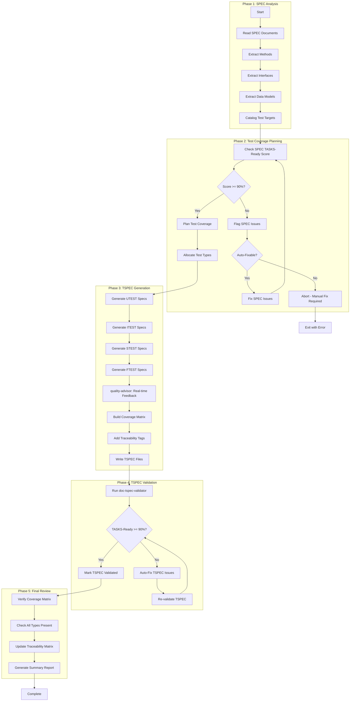

# doc-tspec-autopilot

## Purpose

Automated **Test Specifications (TSPEC)** generation pipeline that processes SPEC documents to generate comprehensive test specifications for UTEST, ITEST, STEST, and FTEST with TASKS-Ready scoring.

**Layer**: 10

**Upstream**: SPEC (Layer 9)

**Downstream**: TASKS (Layer 11)

---

## Skill Dependencies

| Skill | Purpose | Phase |
|-------|---------|-------|
| `doc-naming` | Element ID format (TSPEC.NN.TT.SS, codes 40-43) | All Phases |
| `doc-spec-validator` | Validate SPEC TASKS-Ready score | Phase 2 |
| `doc-tspec` | TSPEC creation rules, test type structure | Phase 3 |
| `quality-advisor` | Real-time quality feedback | Phase 3 |
| `doc-tspec-validator` | Validation with TASKS-Ready scoring | Phase 4 |

---

## Workflow Overview



---

## Test Types

| Type | Code | Purpose | Target |
|------|------|---------|--------|
| **UTEST** | 40 | Unit tests | Individual functions/methods |
| **ITEST** | 41 | Integration tests | Component interactions |
| **STEST** | 42 | Smoke tests | Critical path verification |
| **FTEST** | 43 | Functional tests | End-to-end workflows |

---

## TSPEC Structure

```
docs/10_TSPEC/
├── TSPEC-01_authentication/
│   ├── TSPEC-01.0_index.md
│   ├── TSPEC-01.1_utest.md      # Unit tests
│   ├── TSPEC-01.2_itest.md      # Integration tests
│   ├── TSPEC-01.3_stest.md      # Smoke tests
│   └── TSPEC-01.4_ftest.md      # Functional tests
└── TSPEC-01_authentication.md    # Redirect stub
```

---

## Coverage Matrix Format

| SPEC Element | UTEST | ITEST | STEST | FTEST | Coverage |
|--------------|-------|-------|-------|-------|----------|
| SPEC.01.28.01 | TSPEC.01.40.01 | TSPEC.01.41.01 | TSPEC.01.42.01 | - | 75% |
| SPEC.01.28.02 | TSPEC.01.40.02 | TSPEC.01.41.02 | - | TSPEC.01.43.01 | 75% |

---

## Element ID Format

| Test Type | Code | Pattern | Example |
|-----------|------|---------|---------|
| UTEST | 40 | TSPEC.NN.40.SS | TSPEC.01.40.01 |
| ITEST | 41 | TSPEC.NN.41.SS | TSPEC.01.41.01 |
| STEST | 42 | TSPEC.NN.42.SS | TSPEC.01.42.01 |
| FTEST | 43 | TSPEC.NN.43.SS | TSPEC.01.43.01 |

---

## Cumulative Tags (8 Required)

```markdown
@brd: BRD.NN.TT.SS
@prd: PRD.NN.TT.SS
@ears: EARS.NN.TT.SS
@bdd: BDD.NN.TT.SS
@adr: ADR-NN
@sys: SYS.NN.TT.SS
@req: REQ.NN.TT.SS
@spec: SPEC.NN.TT.SS
@ctr: CTR.NN.TT.SS  # Optional
```

---

## Related Resources

- **TSPEC Skill**: `.claude/skills/doc-tspec/SKILL.md`
- **TSPEC Validator**: `.claude/skills/doc-tspec-validator/SKILL.md`
- **Naming Standards**: `.claude/skills/doc-naming/SKILL.md`
- **Quality Advisor**: `.claude/skills/quality-advisor/SKILL.md`
- **TSPEC Template**: `ai_dev_flow/10_TSPEC/TSPEC-TEMPLATE.md`

---

## Version History

| Version | Date | Changes |
|---------|------|---------|
| 1.0 | 2026-02-08 | Initial skill creation with 5-phase workflow; Integrated doc-naming, doc-tspec, quality-advisor, doc-tspec-validator; Support for all 4 test types |
