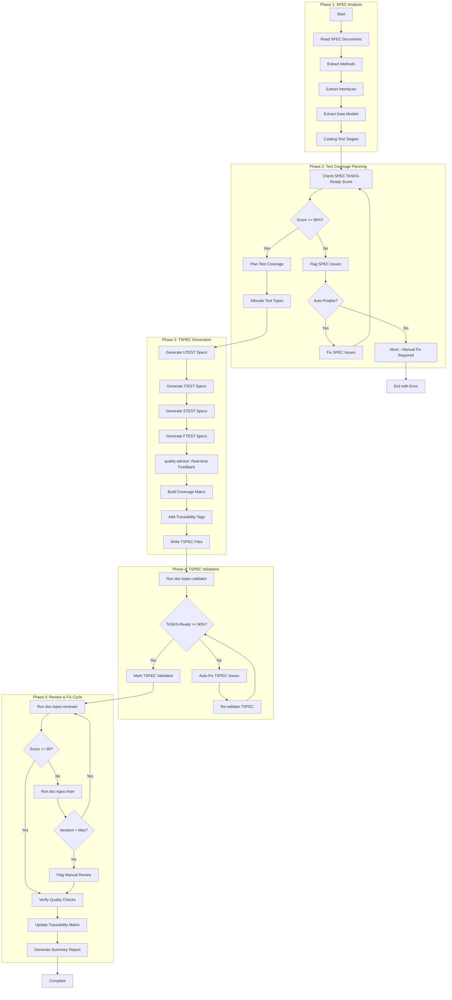
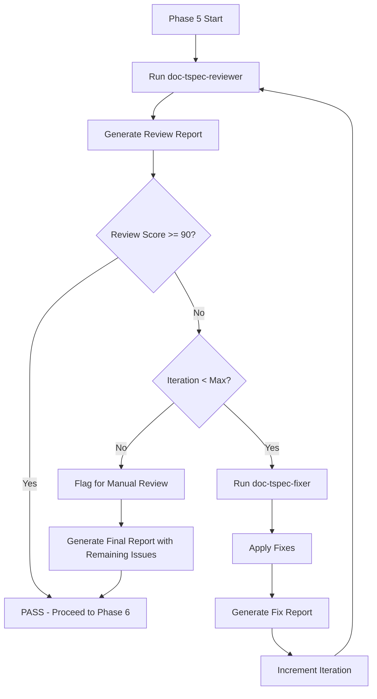
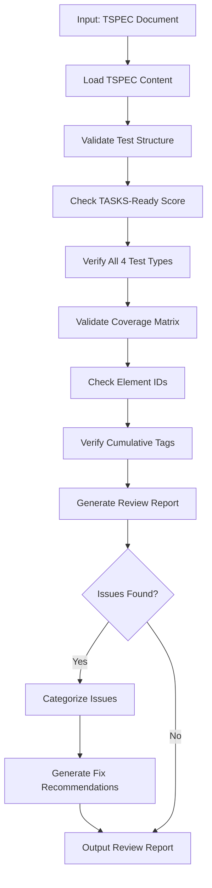
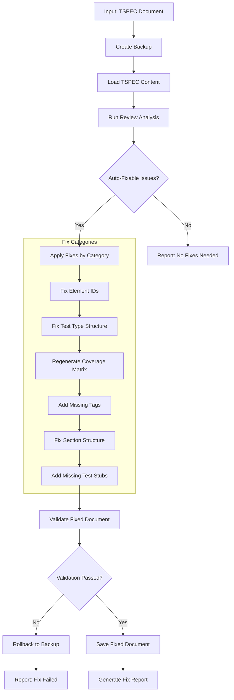

# doc-tspec-autopilot

## Purpose

Automated **Test Specifications (TSPEC)** generation pipeline that processes SPEC documents to generate comprehensive test specifications for UTEST, ITEST, STEST, and FTEST with TASKS-Ready scoring.

**Layer**: 10

**Upstream**: SPEC (Layer 9)

**Downstream**: TASKS (Layer 11)

---

## Skill Dependencies

| Skill | Purpose | Phase |
|-------|---------|-------|
| `doc-naming` | Element ID format (TSPEC.NN.TT.SS, codes 40-43) | All Phases |
| `doc-spec-validator` | Validate SPEC TASKS-Ready score | Phase 2 |
| `doc-tspec` | TSPEC creation rules, test type structure | Phase 3 |
| `quality-advisor` | Real-time quality feedback | Phase 3 |
| `doc-tspec-validator` | Validation with TASKS-Ready scoring | Phase 4 |
| `doc-tspec-reviewer` | Content review, link validation, quality scoring | Phase 5: Review |
| `doc-tspec-fixer` | Apply fixes from review report, create missing files | Phase 5: Fix |

---

## Workflow Overview



---

## Test Types

| Type | Code | Purpose | Target |
|------|------|---------|--------|
| **UTEST** | 40 | Unit tests | Individual functions/methods |
| **ITEST** | 41 | Integration tests | Component interactions |
| **STEST** | 42 | Smoke tests | Critical path verification |
| **FTEST** | 43 | Functional tests | End-to-end workflows |

---

## TSPEC Structure

**All TSPEC use nested folders** (`TSPEC-NN_{slug}/`). This keeps test specification files and companion files organized together.

```
docs/10_TSPEC/
├── TSPEC-01_authentication/
│   ├── TSPEC-01.0_index.md              # Suite index
│   ├── TSPEC-01.1_utest.md              # Unit tests
│   ├── TSPEC-01.2_itest.md              # Integration tests
│   ├── TSPEC-01.3_stest.md              # Smoke tests
│   ├── TSPEC-01.4_ftest.md              # Functional tests
│   ├── TSPEC-01.R_review_report_v001.md # Review report
│   ├── TSPEC-01.F_fix_report_v001.md    # Fix report
│   └── .drift_cache.json                 # Drift cache
└── TSPEC-01_authentication.md            # Redirect stub (optional)
```

---

## Coverage Matrix Format

| SPEC Element | UTEST | ITEST | STEST | FTEST | Coverage |
|--------------|-------|-------|-------|-------|----------|
| SPEC.01.28.01 | TSPEC.01.40.01 | TSPEC.01.41.01 | TSPEC.01.42.01 | - | 75% |
| SPEC.01.28.02 | TSPEC.01.40.02 | TSPEC.01.41.02 | - | TSPEC.01.43.01 | 75% |

---

## Element ID Format

| Test Type | Code | Pattern | Example |
|-----------|------|---------|---------|
| UTEST | 40 | TSPEC.NN.40.SS | TSPEC.01.40.01 |
| ITEST | 41 | TSPEC.NN.41.SS | TSPEC.01.41.01 |
| STEST | 42 | TSPEC.NN.42.SS | TSPEC.01.42.01 |
| FTEST | 43 | TSPEC.NN.43.SS | TSPEC.01.43.01 |

---

## Phase 5: Review & Fix Cycle (v2.3)

Iterative review and fix cycle to ensure TSPEC quality before completion.



### 5.1 Initial Review

Run `doc-tspec-reviewer` to identify issues.

```bash
/doc-tspec-reviewer TSPEC-NN
```

**Output**: `TSPEC-NN.R_review_report_v001.md`

### 5.2 Fix Cycle

If review score < 90%, invoke `doc-tspec-fixer`.

```bash
/doc-tspec-fixer TSPEC-NN --revalidate
```

**Fix Categories**:

| Category | Fixes Applied |
|----------|---------------|
| Missing Test Types | Create missing UTEST/ITEST/STEST/FTEST files |
| Broken Links | Update SPEC references |
| Element IDs | Convert legacy patterns (UT-XXX, IT-XXX, etc.) |
| Coverage Matrix | Regenerate from test specifications |
| Test Structure | Add missing sections per test type template |
| Traceability | Update cumulative tags (8 layers) |

**Output**: `TSPEC-NN.F_fix_report_v001.md`

### 5.3 Re-Review

After fixes, automatically re-run reviewer.

```bash
/doc-tspec-reviewer TSPEC-NN
```

**Output**: `TSPEC-NN.R_review_report_v002.md`

### 5.4 Iteration Control

| Parameter | Default | Description |
|-----------|---------|-------------|
| `max_iterations` | 3 | Maximum fix-review cycles |
| `target_score` | 90 | Minimum passing score |
| `stop_on_manual` | false | Stop if only manual issues remain |

**Iteration Example**:

```
Iteration 1:
  Review v001: Score 78 (2 errors, 6 warnings)
  Fix v001: Fixed 5 issues, created 1 test file

Iteration 2:
  Review v002: Score 91 (0 errors, 2 warnings)
  Status: PASS (score >= 90)
```

### 5.5 Quality Checks (Post-Fix)

After passing the fix cycle:

1. **Test Type Completeness**:
   - All 4 test types present (UTEST, ITEST, STEST, FTEST)
   - Each test type file has required sections
   - No placeholder text remaining

2. **Coverage Matrix Accuracy**:
   - All SPEC elements have test coverage
   - Coverage percentages calculated correctly
   - Target coverage met per test type

3. **Element ID Compliance** (per `doc-naming` skill):
   - All IDs use TSPEC.NN.TT.SS format
   - Element type codes valid for TSPEC (40, 41, 42, 43)
   - No legacy patterns (UT-XXX, IT-XXX, ST-XXX, FT-XXX)

4. **TASKS-Ready Report**:
   ```
   TASKS-Ready Score Breakdown
   ===========================
   Test Type Completeness:  25/25 (all 4 types present)
   Coverage Matrix:         18/20 (coverage targets met)
   SPEC Alignment:          20/20 (tests trace to SPEC)
   Element ID Format:       15/15 (valid format)
   Traceability Tags:       10/10 (8 required tags)
   Test Assertions:         8/10 (assertions present)
   ----------------------------
   Total TASKS-Ready Score: 96/100 (Target: >= 90)
   Status: READY FOR TASKS GENERATION
   ```

5. **Traceability Matrix Update**:
   ```bash
   # Update TSPEC traceability
   python ai_dev_flow/scripts/update_traceability_matrix.py \
     --tspec docs/10_TSPEC/TSPEC-NN_{slug}/ \
     --matrix docs/10_TSPEC/TSPEC-00_TRACEABILITY_MATRIX.md
   ```

---

## Cumulative Tags (8 Required)

```markdown
@brd: BRD.NN.TT.SS
@prd: PRD.NN.TT.SS
@ears: EARS.NN.TT.SS
@bdd: BDD.NN.TT.SS
@adr: ADR-NN
@sys: SYS.NN.TT.SS
@req: REQ.NN.TT.SS
@spec: SPEC.NN.TT.SS
@ctr: CTR.NN.TT.SS  # Optional
```

---

## Configuration

### Default Configuration

```yaml
tspec_autopilot:
  version: "1.0"

  scoring:
    tasks_ready_min: 90
    strict_mode: false

  execution:
    max_parallel: 3        # HARD LIMIT - do not exceed
    chunk_size: 3          # Documents per chunk
    pause_between_chunks: true
    auto_fix: true
    continue_on_error: false
    timeout_per_spec: 180  # seconds

  output:
    structure: sectioned  # 4 test type files per TSPEC
    report_format: markdown

  validation:
    skip_validation: false
    fix_iterations_max: 3

  test_types:
    utest: true
    itest: true
    stest: true
    ftest: true
```

---

## Execution Modes

### Mode 1: Generate Mode (Default)

Standard TSPEC generation from SPEC documents (see Workflow Overview above).

### Mode 2: Review Mode (v2.1)

Validate existing TSPEC documents without modification. Generates quality report with actionable recommendations.

**Command**:
```bash
# Review single TSPEC
/doc-tspec-autopilot TSPEC-01 --review

# Review all TSPEC in directory
/doc-tspec-autopilot docs/10_TSPEC/ --review --all

# Review with detailed report
/doc-tspec-autopilot TSPEC-01 --review --verbose
```

**Review Process**:



**Review Report Template**:

```markdown
# TSPEC Review Report: TSPEC-NN_{slug}

## Summary
- **TASKS-Ready Score**: NN% (✅/🟡/❌)
- **Total Issues**: N (E errors, W warnings)
- **Auto-Fixable**: N issues
- **Manual Review**: N issues

## Test Type Coverage
| Type | File | Tests | Coverage | Status |
|------|------|-------|----------|--------|
| UTEST | TSPEC-NN.1_utest.md | N | NN% | ✅/🟡/❌ |
| ITEST | TSPEC-NN.2_itest.md | N | NN% | ✅/🟡/❌ |
| STEST | TSPEC-NN.3_stest.md | N | NN% | ✅/🟡/❌ |
| FTEST | TSPEC-NN.4_ftest.md | N | NN% | ✅/🟡/❌ |

## Score Breakdown
| Category | Score | Max | Status |
|----------|-------|-----|--------|
| Test Type Completeness | NN | 25 | ✅/🟡/❌ |
| Coverage Matrix | NN | 20 | ✅/🟡/❌ |
| SPEC Alignment | NN | 20 | ✅/🟡/❌ |
| Element ID Format | NN | 15 | ✅/🟡/❌ |
| Traceability Tags | NN | 10 | ✅/🟡/❌ |
| Test Assertions | NN | 10 | ✅/🟡/❌ |

## Issues by Category

### Auto-Fixable Issues
| Issue | Location | Fix Action |
|-------|----------|------------|
| Legacy ID pattern | Line 45 | Convert UT-001 → TSPEC.01.40.01 |
| Missing cumulative tag | Traceability | Add @req: REQ.01.01.01 |

### Manual Review Required
| Issue | Location | Recommendation |
|-------|----------|----------------|
| Missing STEST file | TSPEC-01.3 | Create smoke test specifications |
| Low coverage | SPEC.01.28.05 | Add unit tests for method |
```

**Score Indicators**:
- ✅ Green (>=90%): TASKS-Ready
- 🟡 Yellow (70-89%): Needs improvement
- ❌ Red (<70%): Significant issues

**Review Configuration**:

```yaml
review_mode:
  enabled: true
  checks:
    - test_structure      # All 4 test type files present
    - coverage_matrix     # Coverage >= target per SPEC element
    - spec_alignment      # Tests trace to SPEC methods
    - element_ids         # TSPEC.NN.40-43.SS format
    - cumulative_tags     # 8 required tags present
    - test_assertions     # Each test has clear assertions
  output:
    format: markdown      # markdown, json, html
    include_recommendations: true
    include_fix_commands: true
  coverage_targets:
    utest: 95            # Unit test coverage target %
    itest: 85            # Integration test coverage target %
    stest: 100           # Smoke test must cover critical path
    ftest: 75            # Functional test coverage target %
```

### Mode 3: Fix Mode (v2.1)

Auto-repair existing TSPEC documents with backup and content preservation.

**Command**:
```bash
# Fix single TSPEC
/doc-tspec-autopilot TSPEC-01 --fix

# Fix with backup
/doc-tspec-autopilot TSPEC-01 --fix --backup

# Fix all TSPEC
/doc-tspec-autopilot docs/10_TSPEC/ --fix --all

# Fix specific categories only
/doc-tspec-autopilot TSPEC-01 --fix --only element_ids,tags

# Dry-run fix (preview changes)
/doc-tspec-autopilot TSPEC-01 --fix --dry-run
```

**Fix Process**:



**TSPEC-Specific Fix Categories**:

| Category | Description | Auto-Fix Actions |
|----------|-------------|------------------|
| `element_ids` | Element ID format | Convert legacy patterns to TSPEC.NN.TT.SS |
| `test_types` | Test type files | Create missing UTEST/ITEST/STEST/FTEST files |
| `coverage_matrix` | Coverage tracking | Regenerate matrix from test specifications |
| `cumulative_tags` | Traceability tags | Add missing 8 upstream tags |
| `sections` | Section structure | Add missing sections per test type template |
| `test_stubs` | Missing tests | Generate test stubs for uncovered SPEC elements |
| `assertions` | Test assertions | Flag tests without assertions (manual fix) |

**Element ID Migration** (Layer 10):

| Legacy Pattern | New Format | Example |
|----------------|------------|---------|
| UT-NNN | TSPEC.NN.40.SS | UT-001 → TSPEC.01.40.01 |
| IT-NNN | TSPEC.NN.41.SS | IT-001 → TSPEC.01.41.01 |
| ST-NNN | TSPEC.NN.42.SS | ST-001 → TSPEC.01.42.01 |
| FT-NNN | TSPEC.NN.43.SS | FT-001 → TSPEC.01.43.01 |
| TC-NNN | TSPEC.NN.40.SS | TC-001 → TSPEC.01.40.01 (assume UTEST) |
| TEST-NNN | TSPEC.NN.43.SS | TEST-001 → TSPEC.01.43.01 (assume FTEST) |

**Content Preservation Rules**:

| Content Type | Preservation Rule |
|--------------|-------------------|
| Custom test descriptions | Never delete, only enhance metadata |
| Test assertions | Preserve all test logic |
| Test data/fixtures | Preserve all test data definitions |
| SPEC references | Validate and update format only |
| Coverage percentages | Recalculate after fixes |
| Test prerequisites | Preserve setup/teardown logic |

**Fix Configuration**:

```yaml
fix_mode:
  enabled: true
  backup:
    enabled: true
    location: "tmp/backups/"
    timestamp: true
  fix_categories:
    element_ids: true       # Convert legacy ID patterns
    test_types: true        # Create missing test type files
    coverage_matrix: true   # Regenerate coverage tracking
    cumulative_tags: true   # Add 8 required tags
    sections: true          # Add missing sections
    test_stubs: true        # Generate stubs for uncovered SPEC
    assertions: false       # Manual only (flag but don't auto-fix)
  validation:
    post_fix: true          # Validate after fixes
    rollback_on_fail: true  # Restore backup if validation fails
  preserve:
    test_descriptions: true
    test_assertions: true
    test_data: true
    spec_references: true
```

**Fix Report Template**:

```markdown
# TSPEC Fix Report: TSPEC-NN_{slug}

## Summary
- **Backup Created**: tmp/backups/TSPEC-NN_{slug}_20260209_143022/
- **Issues Fixed**: N of M auto-fixable issues
- **Manual Review**: N issues flagged

## Fixes Applied

### Element ID Migration
| Original | Fixed | File | Location |
|----------|-------|------|----------|
| UT-001 | TSPEC.01.40.01 | TSPEC-01.1_utest.md | Line 45 |
| IT-001 | TSPEC.01.41.01 | TSPEC-01.2_itest.md | Line 23 |
| ST-001 | TSPEC.01.42.01 | TSPEC-01.3_stest.md | Line 12 |

### Test Type Files Created
| File | Tests Generated | Status |
|------|-----------------|--------|
| TSPEC-01.3_stest.md | 5 smoke tests | Created from template |

### Coverage Matrix Regenerated
| SPEC Element | Before | After |
|--------------|--------|-------|
| SPEC.01.28.01 | 50% | 75% |
| SPEC.01.28.02 | 25% | 75% |
| Overall | 45% | 78% |

### Cumulative Tags Added
- @ears: EARS.01.25.001 (added)
- @sys: SYS.01.01.01 (added)
- @req: REQ.01.01.01 (added)

## Test Stubs Generated
| SPEC Element | Test Type | Stub ID |
|--------------|-----------|---------|
| SPEC.01.28.05 | UTEST | TSPEC.01.40.12 |
| SPEC.01.28.05 | ITEST | TSPEC.01.41.08 |

## Manual Review Required

### Tests Without Assertions
| Test ID | File | Issue |
|---------|------|-------|
| TSPEC.01.40.03 | TSPEC-01.1_utest.md | No assert statements |
| TSPEC.01.41.02 | TSPEC-01.2_itest.md | Missing expected outcome |

### Low Coverage Areas
| SPEC Element | Current | Target | Action Needed |
|--------------|---------|--------|---------------|
| SPEC.01.28.07 | 25% | 75% | Add 3+ UTEST, 1+ ITEST |

## Validation Results
- **TASKS-Ready Score**: Before: 68% → After: 92%
- **Validation Errors**: Before: 12 → After: 0
- **Status**: ✅ All auto-fixes validated
```

**Command Line Options** (Review/Fix Modes):

| Option | Default | Description |
|--------|---------|-------------|
| `--review` | false | Run review mode only |
| `--fix` | false | Run fix mode |
| `--backup` | true | Create backup before fixing |
| `--dry-run` | false | Preview fixes without applying |
| `--only` | all | Comma-separated fix categories |
| `--verbose` | false | Detailed output |
| `--all` | false | Process all TSPEC in directory |
| `--output-format` | markdown | Report format (markdown, json) |
| `--generate-stubs` | true | Generate test stubs for uncovered SPEC |
| `--test-types` | all | Comma-separated test types to fix |

---

## Context Management

### Chunked Parallel Execution (MANDATORY)

**CRITICAL**: To prevent conversation context overflow errors ("Prompt is too long", "Conversation too long"), all autopilot operations MUST follow chunked execution rules:

**Chunk Size Limit**: Maximum 3 documents per chunk

**Chunking Rules**:

1. **Chunk Formation**: Group SPEC-derived TSPEC documents into chunks of maximum 3 at a time
2. **Sequential Chunk Processing**: Process one chunk at a time, completing all documents in a chunk before starting the next
3. **Context Pause**: After completing each chunk, provide a summary and pause for user acknowledgment
4. **Progress Tracking**: Display chunk progress (e.g., "Chunk 2/4: Processing TSPEC-04, TSPEC-05, TSPEC-06...")

**Why Chunking is Required**:

- Prevents "Conversation too long" errors during batch processing
- Allows context compaction between chunks
- Enables recovery from failures without losing all progress
- Provides natural checkpoints for user review

**Chunk Completion Template**:

```markdown
## Chunk N/M Complete

Generated:
- TSPEC-XX: TASKS-Ready Score 94% (UTEST + ITEST + STEST + FTEST)
- TSPEC-YY: TASKS-Ready Score 92% (UTEST + ITEST + STEST + FTEST)
- TSPEC-ZZ: TASKS-Ready Score 95% (UTEST + ITEST + STEST + FTEST)

Proceeding to next chunk...
```

---

## Related Resources

- **TSPEC Skill**: `.claude/skills/doc-tspec/SKILL.md`
- **TSPEC Validator**: `.claude/skills/doc-tspec-validator/SKILL.md`
- **Naming Standards**: `.claude/skills/doc-naming/SKILL.md`
- **Quality Advisor**: `.claude/skills/quality-advisor/SKILL.md`
- **TSPEC Template**: `ai_dev_flow/10_TSPEC/TSPEC-TEMPLATE.md`

---

## Review Document Standards (v2.2)

Review reports generated by this skill are formal project documents and MUST comply with shared standards.

**Reference**: See `REVIEW_DOCUMENT_STANDARDS.md` in the skills directory for complete requirements.

**Key Requirements**:

1. **Storage Location**: Same folder as the reviewed TSPEC document
2. **File Naming**: `TSPEC-NN.R_review_report.md`
3. **YAML Frontmatter**: Required with `artifact_type: TSPEC-REVIEW`, `layer: 10`
4. **Score Field**: `impl_ready_score_claimed` / `impl_ready_score_validated`
5. **Parent Reference**: Must link to parent TSPEC document

**Example Location** (ALWAYS use nested folders):

```
docs/10_TSPEC/TSPEC-03_f3_observability/
├── TSPEC-03_f3_observability.md         # ← Main document
├── TSPEC-03.R_review_report_v001.md     # ← Review report
├── TSPEC-03.F_fix_report_v001.md        # ← Fix report
└── .drift_cache.json                     # ← Drift cache
```

**Nested Folder Rule**: ALL TSPEC use nested folders (`TSPEC-NN_{slug}/`) regardless of size. This keeps companion files (review reports, fix reports, drift cache) organized with their parent document.

---

## Version History

| Version | Date | Changes |
|---------|------|---------|
| 2.3 | 2026-02-10 | **Review & Fix Cycle**: Replaced Phase 5 with iterative Review -> Fix cycle using `doc-tspec-reviewer` and `doc-tspec-fixer`; Added `doc-tspec-fixer` skill dependency; Added iteration control (max 3 cycles); Added quality checks (test type completeness, coverage matrix accuracy, element ID compliance, TASKS-Ready report); Added traceability matrix update step |
| 2.2 | 2026-02-10 | Added Review Document Standards section; Review reports now stored alongside reviewed documents with proper YAML frontmatter and parent references |
| 2.1 | 2026-02-09 | Added Mode 2: Review Mode for validation-only analysis with visual score indicators and coverage targets; Added Mode 3: Fix Mode for auto-repair with backup, content preservation, and test stub generation; Element ID migration (UT-NNN→TSPEC.NN.40.SS, IT-NNN→TSPEC.NN.41.SS, ST-NNN→TSPEC.NN.42.SS, FT-NNN→TSPEC.NN.43.SS) |
| 1.0 | 2026-02-08 | Initial skill creation with 5-phase workflow; Integrated doc-naming, doc-tspec, quality-advisor, doc-tspec-validator; Support for all 4 test types |
