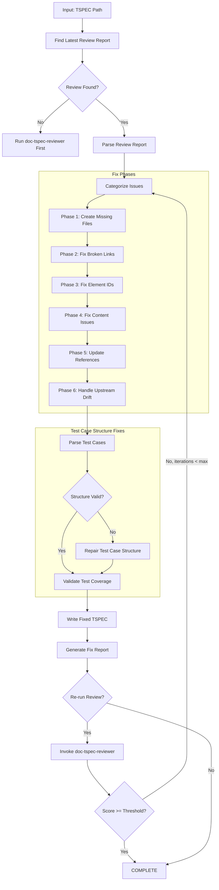
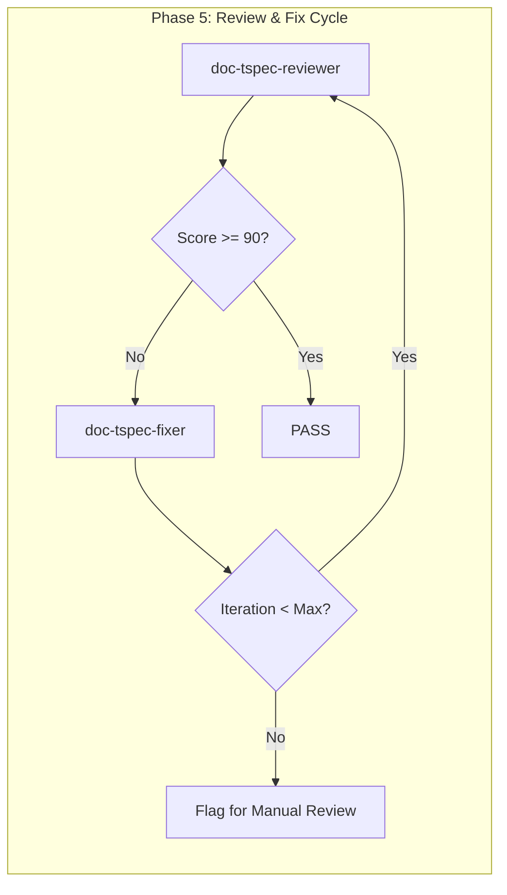

# doc-tspec-fixer

## Purpose

Automated **fix skill** that reads the latest review report and applies fixes to TSPEC (Test Specification) documents. This skill bridges the gap between `doc-tspec-reviewer` (which identifies issues) and the corrected TSPEC, enabling iterative improvement cycles.

**Layer**: 10 (TSPEC Quality Improvement)

**Upstream**: SPEC documents, TSPEC document, Review Report (`TSPEC-NN.R_review_report_vNNN.md`)

**Downstream**: Fixed TSPEC, Fix Report (`TSPEC-NN.F_fix_report_vNNN.md`)

---

## When to Use This Skill

Use `doc-tspec-fixer` when:

- **After Review**: Run after `doc-tspec-reviewer` identifies issues
- **Iterative Improvement**: Part of Review -> Fix -> Review cycle
- **Automated Pipeline**: CI/CD integration for quality gates
- **Batch Fixes**: Apply fixes to multiple TSPECs based on review reports
- **Test Case Structure Issues**: Test cases have malformed structure

**Do NOT use when**:
- No review report exists (run `doc-tspec-reviewer` first)
- Creating new TSPEC (use `doc-tspec` or `doc-tspec-autopilot`)
- Only need validation (use `doc-tspec-validator`)

---

## Skill Dependencies

| Skill | Purpose | When Used |
|-------|---------|-----------|
| `doc-tspec-reviewer` | Source of issues to fix | Input (reads review report) |
| `doc-naming` | Element ID standards | Fix element IDs |
| `doc-tspec` | TSPEC creation rules | Create missing sections |
| `doc-spec` | SPEC traceability | Validate upstream links |

---

## Workflow Overview



---

## Fix Phases

### Phase 1: Create Missing Files

Creates files that are referenced but don't exist.

**Scope**:

| Missing File | Action | Template Used |
|--------------|--------|---------------|
| `TSPEC-NN_test_data.yaml` | Create test data file | Test data template |
| `TSPEC-NN_fixtures.yaml` | Create test fixtures file | Fixtures template |
| `TSPEC-NN_matrix.md` | Create test matrix | Matrix template |
| Reference docs | Create placeholder | REF template |

**Test Data Template**:

```yaml
# TSPEC-NN: Test Data Definitions
# Auto-generated by doc-tspec-fixer - requires completion

test_data:
  version: "1.0.0"
  tspec_id: TSPEC-NN
  created: "YYYY-MM-DD"
  status: draft

datasets:
  # TODO: Add test datasets
  valid_inputs:
    - id: TD-001
      description: "Valid input data set 1"
      data:
        # Add data fields

  invalid_inputs:
    - id: TD-002
      description: "Invalid input data set 1"
      data:
        # Add data fields

  edge_cases:
    - id: TD-003
      description: "Edge case data set 1"
      data:
        # Add data fields

boundary_values:
  # TODO: Define boundary values for testing
  - field: example_field
    min: 0
    max: 100
    boundary_tests:
      - value: -1
        expected: error
      - value: 0
        expected: success
      - value: 100
        expected: success
      - value: 101
        expected: error
```

**Test Fixtures Template**:

```yaml
# TSPEC-NN: Test Fixtures
# Auto-generated by doc-tspec-fixer - requires completion

fixtures:
  version: "1.0.0"
  tspec_id: TSPEC-NN
  created: "YYYY-MM-DD"

setup:
  # TODO: Define setup fixtures
  database:
    - name: test_db_setup
      description: "Initialize test database"
      actions:
        - action: create_schema
        - action: seed_data

  services:
    - name: mock_api_setup
      description: "Setup mock API endpoints"

teardown:
  # TODO: Define teardown fixtures
  database:
    - name: test_db_cleanup
      actions:
        - action: drop_schema
```

**Test Matrix Template**:

```markdown
---
title: "TSPEC-NN: Test Matrix"
tags:
  - tspec
  - test-matrix
  - layer-10
custom_fields:
  document_type: test-matrix
  artifact_type: TSPEC-MATRIX
  layer: 10
  parent_tspec: TSPEC-NN
---

# TSPEC-NN Test Matrix

## Coverage Summary

| Requirement | Test Cases | Pass | Fail | Skip | Coverage |
|-------------|------------|------|------|------|----------|
| REQ-XX.YY.ZZ | TC-001, TC-002 | - | - | - | - |

## Test Case Matrix

| Test ID | Requirement | Priority | Type | Status |
|---------|-------------|----------|------|--------|
| TC-001 | REQ-XX.YY.ZZ | P1 | Unit | Pending |

## Environment Matrix

| Environment | OS | Browser/Runtime | Status |
|-------------|----|-----------------| -------|
| CI | Linux | Node 18 | Pending |

---

*Created by doc-tspec-fixer as placeholder. Complete this document.*
```

---

### Phase 2: Fix Broken Links

Updates links to point to correct locations.

**Fix Actions**:

| Issue Code | Issue | Fix Action |
|------------|-------|------------|
| REV-L001 | Broken internal link | Update path or create target file |
| REV-L002 | External link unreachable | Add warning comment, keep link |
| REV-L003 | Absolute path used | Convert to relative path |
| REV-L008 | Test data reference broken | Update test data path |
| REV-L009 | Fixture reference broken | Update fixture path |

**Path Resolution Logic**:

```python
def fix_link_path(tspec_location: str, target_path: str) -> str:
    """Calculate correct relative path based on TSPEC location."""

    # TSPEC files: docs/10_TSPEC/TSPEC-01.md
    # Test data: docs/10_TSPEC/data/
    # Fixtures: docs/10_TSPEC/fixtures/

    if is_test_data_reference(target_path):
        return fix_test_data_ref(tspec_location, target_path)
    elif is_fixture_reference(target_path):
        return fix_fixture_ref(tspec_location, target_path)
    else:
        return calculate_relative_path(tspec_location, target_path)
```

---

### Phase 3: Fix Element IDs

Converts invalid element IDs to correct format.

**Conversion Rules**:

| Pattern | Issue | Conversion |
|---------|-------|------------|
| `TSPEC.NN.XX.SS` | Invalid type code | Convert to valid TSPEC code |
| `TC-XXX` | Legacy pattern | `TSPEC.NN.40.SS` (Test Case) |
| `TS-XXX` | Legacy pattern | `TSPEC.NN.41.SS` (Test Suite) |
| `TD-XXX` | Legacy pattern | `TSPEC.NN.42.SS` (Test Data) |
| `TF-XXX` | Legacy pattern | `TSPEC.NN.43.SS` (Test Fixture) |

**Type Code Mapping** (TSPEC-specific):

| Invalid Code | Valid Code | Element Type |
|--------------|------------|--------------|
| 01-39 | 40 | Test Case |
| N/A | 41 | Test Suite |
| N/A | 42 | Test Data |
| N/A | 43 | Test Fixture |

**Valid TSPEC Type Codes**:

| Code | Element Type | Description |
|------|--------------|-------------|
| 40 | Test Case | Individual test case specification |
| 41 | Test Suite | Collection of related test cases |
| 42 | Test Data | Test data definition |
| 43 | Test Fixture | Test fixture/setup definition |

**Regex Patterns**:

```python
# Find element IDs with invalid type codes for TSPEC
invalid_tspec_type = r'TSPEC\.(\d{2})\.(?!40|41|42|43)(\d{2})\.(\d{2})'

# Find legacy patterns
legacy_tc = r'###\s+TC-(\d+):'
legacy_ts = r'###\s+TS-(\d+):'
legacy_td = r'###\s+TD-(\d+):'
legacy_tf = r'###\s+TF-(\d+):'
```

---

### Phase 4: Fix Content Issues

Addresses placeholders and incomplete content.

**Fix Actions**:

| Issue Code | Issue | Fix Action |
|------------|-------|------------|
| REV-P001 | `[TODO]` placeholder | Flag for manual completion (cannot auto-fix) |
| REV-P002 | `[TBD]` placeholder | Flag for manual completion (cannot auto-fix) |
| REV-P003 | Template date `YYYY-MM-DD` | Replace with current date |
| REV-P004 | Template name `[Name]` | Replace with metadata author or flag |
| REV-P005 | Empty section | Add minimum template content |
| REV-T001 | Missing test steps | Add placeholder steps structure |
| REV-T002 | Missing expected results | Add placeholder expected results |
| REV-T003 | Missing preconditions | Add placeholder preconditions |

**Auto-Replacements**:

```python
replacements = {
    'YYYY-MM-DDTHH:MM:SS': datetime.now().strftime('%Y-%m-%dT%H:%M:%S'),
    'YYYY-MM-DD': datetime.now().strftime('%Y-%m-%d'),
    'MM/DD/YYYY': datetime.now().strftime('%m/%d/%Y'),
    '[Current date]': datetime.now().strftime('%Y-%m-%dT%H:%M:%S'),
}
```

**Test Case Structure Repair**:

| Missing Element | Added Template |
|-----------------|----------------|
| Preconditions | `**Preconditions**: [TODO: Define preconditions]` |
| Test Steps | `**Steps**:\n1. [TODO: Add step 1]\n2. [TODO: Add step 2]` |
| Expected Results | `**Expected Results**: [TODO: Define expected outcome]` |
| Priority | `**Priority**: P2` (default) |
| Test Type | `**Type**: Functional` (default) |

---

### Phase 5: Update References

Ensures traceability and cross-references are correct.

**Fix Actions**:

| Issue | Fix Action |
|-------|------------|
| Missing `@spec:` reference | Add SPEC traceability tag |
| Missing `@req:` reference | Add REQ traceability tag (via SPEC) |
| Incorrect upstream path | Update to correct relative path |
| Missing traceability entry | Add to traceability matrix |

**SPEC Traceability Fix**:

```markdown
<!-- Before -->
## TC-001: User Authentication Test

<!-- After -->
## TC-001: User Authentication Test

@spec: [SPEC-01.auth.login](../09_SPEC/SPEC-01.md#auth-login)
@req: [REQ-01.28.01](../07_REQ/REQ-01.md#req-01-28-01)
```

---

### Phase 6: Handle Upstream Drift (Auto-Merge)

Addresses issues where upstream SPEC documents have changed since TSPEC creation using a tiered auto-merge system.

**Upstream/Downstream Context**:
- **Upstream**: SPEC (Layer 9) - Test specifications derive from specifications
- **Downstream**: TASKS (Layer 11) / Code - Tests inform implementation tasks

**Drift Issue Codes** (from `doc-tspec-reviewer`):

| Code | Severity | Description | Tier Mapping |
|------|----------|-------------|--------------|
| REV-D001 | Warning | SPEC document modified after TSPEC | Calculated per threshold |
| REV-D002 | Warning | Referenced specification content changed | Calculated per threshold |
| REV-D003 | Info | SPEC document version incremented | Tier 1 |
| REV-D004 | Info | New specifications added to upstream | Tier 1 or 2 |
| REV-D005 | Error | Critical SPEC modification (>20% change) | Tier 3 |

#### Tiered Auto-Merge Thresholds

| Tier | Change % | Action | Version Bump | Requires Review |
|------|----------|--------|--------------|-----------------|
| **Tier 1** | < 5% | Auto-merge new test cases | Patch (x.y.Z) | No |
| **Tier 2** | 5-15% | Auto-merge with changelog | Minor (x.Y.0) | Summary only |
| **Tier 3** | > 15% | Archive + regeneration trigger | Major (X.0.0) | Yes (mandatory) |

#### Change Percentage Calculation

```python
def calculate_change_percentage(spec_before: str, spec_after: str, tspec: str) -> float:
    """
    Calculate drift percentage based on:
    1. Specification section changes affecting test cases
    2. New requirements requiring new tests
    3. Modified requirements requiring test updates
    4. Removed requirements requiring test deprecation
    """
    spec_elements = extract_testable_elements(spec_before)
    spec_elements_new = extract_testable_elements(spec_after)
    tspec_coverage = extract_test_coverage(tspec)

    added = spec_elements_new - spec_elements
    removed = spec_elements - spec_elements_new
    modified = detect_modifications(spec_before, spec_after)

    total_elements = len(spec_elements_new)
    changed_elements = len(added) + len(removed) + len(modified)

    return (changed_elements / total_elements) * 100 if total_elements > 0 else 0
```

#### Test ID Patterns for TSPEC

**Format**: `{TYPE}-NN-TC-SS`

| Type | Description | Example |
|------|-------------|---------|
| UTEST | Unit Test | UTEST-01-TC-01 |
| ITEST | Integration Test | ITEST-01-TC-01 |
| STEST | System Test | STEST-01-TC-01 |
| FTEST | Functional Test | FTEST-01-TC-01 |
| PTEST | Performance Test | PTEST-01-TC-01 |
| SECTEST | Security Test | SECTEST-01-TC-01 |

Where:
- `NN` = TSPEC document number (01-99)
- `TC` = Test Case identifier
- `SS` = Sequence number within type (01-99)

**Auto-Generated ID Example**:
```python
def generate_test_id(tspec_num: int, test_type: str, existing_ids: list) -> str:
    """Generate next available test ID."""
    type_prefix = test_type.upper()  # UTEST, ITEST, etc.
    existing_for_type = [id for id in existing_ids if id.startswith(f"{type_prefix}-{tspec_num:02d}-TC-")]

    if existing_for_type:
        max_seq = max(int(id.split("-")[-1]) for id in existing_for_type)
        next_seq = max_seq + 1
    else:
        next_seq = 1

    return f"{type_prefix}-{tspec_num:02d}-TC-{next_seq:02d}"

# Example: UTEST-01-TC-13 (13th unit test in TSPEC-01)
```

#### Tier 1: Auto-Merge (< 5% Change)

**Trigger**: Minor SPEC updates that require additional test coverage.

**Actions**:
1. Parse new/modified specifications from SPEC
2. Generate new test case stubs with auto-generated IDs
3. Insert test cases in appropriate section
4. Increment patch version (1.0.0 -> 1.0.1)
5. Update drift cache with merge record

**Example Auto-Generated Test Case**:

```markdown
## UTEST-01-TC-13: [Auto-Generated] Validate new_field parameter

@spec: [SPEC-01.api.new_field](../09_SPEC/SPEC-01.md#api-new-field)
@drift-merge: Tier-1 auto-merge on 2026-02-10
@status: PENDING_REVIEW

**Priority**: P2
**Type**: Unit

### Preconditions

[TODO: Define preconditions based on SPEC-01.api.new_field]

### Test Steps

| Step | Action | Expected Result |
|------|--------|-----------------|
| 1 | [TODO: Derived from SPEC-01.api.new_field] | [TODO] |

### Expected Results

[TODO: Define expected outcome based on SPEC-01.api.new_field]
```

#### Tier 2: Auto-Merge with Changelog (5-15% Change)

**Trigger**: Moderate SPEC updates affecting multiple test cases.

**Actions**:
1. Perform all Tier 1 actions
2. Generate detailed changelog section
3. Mark affected existing tests for review
4. Increment minor version (1.0.0 -> 1.1.0)
5. Create drift summary in fix report

**Changelog Section Format**:

```markdown
## Drift Changelog (Tier 2 Auto-Merge)

**Merge Date**: 2026-02-10T16:00:00
**SPEC Version**: SPEC-01 v2.3.0 -> v2.4.0
**Change Percentage**: 8.5%
**Version Bump**: 1.2.0 -> 1.3.0

### New Test Cases Added

| Test ID | Source Spec | Description |
|---------|-------------|-------------|
| ITEST-01-TC-08 | SPEC-01.api.batch_endpoint | Batch processing integration test |
| UTEST-01-TC-14 | SPEC-01.validation.new_rule | New validation rule unit test |

### Existing Tests Marked for Review

| Test ID | Reason | Action Required |
|---------|--------|-----------------|
| UTEST-01-TC-03 | Upstream spec modified | Review expected results |
| ITEST-01-TC-02 | API contract changed | Update test steps |

### Tests Deprecated (Not Deleted)

| Test ID | Reason | Status |
|---------|--------|--------|
| UTEST-01-TC-05 | Spec section removed | [DEPRECATED] |
```

#### Tier 3: Archive and Regeneration (> 15% Change)

**Trigger**: Major SPEC overhaul requiring significant test restructuring.

**Actions**:
1. Create archive manifest
2. Archive current TSPEC version
3. Generate regeneration request for `doc-tspec-autopilot`
4. Increment major version (1.0.0 -> 2.0.0)
5. Flag for mandatory human review

**Archive Manifest Format**:

```yaml
# TSPEC-01_archive_manifest.yaml
archive:
  tspec_id: TSPEC-01
  archived_version: "1.5.2"
  archive_date: "2026-02-10T16:00:00"
  archive_reason: "Tier 3 drift - SPEC changes exceed 15%"
  change_percentage: 23.4

  upstream_trigger:
    document: SPEC-01.md
    previous_version: "2.3.0"
    current_version: "3.0.0"
    modification_date: "2026-02-10T14:00:00"

archived_tests:
  total_count: 25
  by_type:
    UTEST: 12
    ITEST: 8
    STEST: 3
    FTEST: 2

  deprecated_not_deleted:
    - id: UTEST-01-TC-05
      reason: "Spec section FR-001.3 removed"
      original_spec_ref: "SPEC-01.fr.001.3"
    - id: ITEST-01-TC-03
      reason: "Integration point deprecated"
      original_spec_ref: "SPEC-01.api.legacy"

regeneration:
  triggered: true
  target_skill: doc-tspec-autopilot
  new_version: "2.0.0"
  preserve_deprecated: true

archive_location: "docs/10_TSPEC/archive/TSPEC-01_v1.5.2/"
```

#### No-Deletion Policy

**CRITICAL**: Tests are NEVER deleted, only marked as deprecated.

**Deprecation Format**:

```markdown
## [DEPRECATED] UTEST-01-TC-05: Validate legacy_field parameter

@status: DEPRECATED
@deprecated-date: 2026-02-10
@deprecated-reason: Upstream SPEC-01.fr.001.3 removed in v3.0.0
@original-spec: [SPEC-01.fr.001.3](../09_SPEC/SPEC-01.md#fr-001-3) (no longer exists)

> **DEPRECATION NOTICE**: This test case is deprecated and will not be executed.
> It is preserved for historical traceability and audit purposes.

**Priority**: P2
**Type**: Unit

[Original test content preserved below...]
```

**Deprecation Rules**:

| Scenario | Action | Marker |
|----------|--------|--------|
| SPEC section removed | Mark deprecated | `[DEPRECATED]` |
| SPEC requirement obsoleted | Mark deprecated | `[DEPRECATED]` |
| Test superseded by new test | Mark deprecated with reference | `[DEPRECATED] See: NEW-TC-ID` |
| Test temporarily disabled | Mark skipped (not deprecated) | `[SKIP]` |

#### Enhanced Drift Cache

The drift cache tracks merge history for audit and rollback purposes.

**Cache Location**: `.drift_cache.json` (project root or docs folder)

**Enhanced Structure**:

```json
{
  "version": "2.0",
  "last_updated": "2026-02-10T16:00:00",
  "documents": {
    "TSPEC-01": {
      "current_version": "1.3.0",
      "last_check": "2026-02-10T16:00:00",
      "upstream": {
        "SPEC-01": {
          "last_version": "2.4.0",
          "last_modified": "2026-02-10T14:00:00",
          "content_hash": "sha256:abc123..."
        }
      },
      "merge_history": [
        {
          "merge_date": "2026-02-10T16:00:00",
          "tier": 1,
          "change_percentage": 3.2,
          "version_before": "1.2.5",
          "version_after": "1.2.6",
          "tests_added": ["UTEST-01-TC-13"],
          "tests_modified": [],
          "tests_deprecated": [],
          "auto_merged": true
        },
        {
          "merge_date": "2026-02-08T10:00:00",
          "tier": 2,
          "change_percentage": 8.5,
          "version_before": "1.1.0",
          "version_after": "1.2.0",
          "tests_added": ["ITEST-01-TC-08", "UTEST-01-TC-14"],
          "tests_modified": ["UTEST-01-TC-03", "ITEST-01-TC-02"],
          "tests_deprecated": ["UTEST-01-TC-05"],
          "auto_merged": true,
          "changelog_ref": "TSPEC-01.md#drift-changelog-2026-02-08"
        }
      ],
      "deprecated_tests": [
        {
          "id": "UTEST-01-TC-05",
          "deprecated_date": "2026-02-08",
          "reason": "SPEC section FR-001.3 removed",
          "original_spec_ref": "SPEC-01.fr.001.3"
        }
      ]
    }
  }
}
```

#### Drift Fix Actions Summary

| Tier | Change % | Auto-Fix | Version | Tests Added | Tests Modified | Tests Deprecated | Archive |
|------|----------|----------|---------|-------------|----------------|------------------|---------|
| 1 | < 5% | Yes | Patch | Auto-generate | None | None | No |
| 2 | 5-15% | Yes | Minor | Auto-generate | Flag for review | Mark deprecated | No |
| 3 | > 15% | No | Major | Regenerate all | N/A | Preserve all | Yes |

**Drift Marker Format** (retained for backward compatibility):

```markdown
<!-- DRIFT: SPEC-01.md modified 2026-02-08 (TSPEC created 2026-02-05) -->
<!-- DRIFT-TIER: 2 | CHANGE: 8.5% | AUTO-MERGED: 2026-02-10 -->
@spec: [SPEC-01.auth.login](../09_SPEC/SPEC-01.md#auth-login)
```

---

## Test Case Structure Fixes

TSPEC documents contain structured test cases. This section details specific test case repair strategies.

### Test Case Detection

```python
def find_test_cases(content: str) -> list:
    """Find all test cases in TSPEC content."""
    # Match test case headers
    pattern = r'##\s+(TC-\d+|TSPEC\.\d{2}\.40\.\d{2}):\s+(.+)'
    return re.findall(pattern, content)
```

### Required Test Case Elements

| Element | Required | Default Value |
|---------|----------|---------------|
| ID | Yes | Generate from pattern |
| Title | Yes | "[TODO: Add title]" |
| Preconditions | Yes | "[TODO: Define preconditions]" |
| Steps | Yes | Numbered placeholder list |
| Expected Results | Yes | "[TODO: Define expected outcome]" |
| Priority | No | P2 |
| Type | No | Functional |
| Status | No | Pending |

### Test Case Template

```markdown
## TSPEC.NN.40.SS: [Test Case Title]

**Priority**: P1 | P2 | P3
**Type**: Unit | Integration | System | Performance
**Status**: Pending | In Progress | Pass | Fail | Skip

@spec: [SPEC-XX.section](../09_SPEC/SPEC-XX.md#section)

### Preconditions

1. [Precondition 1]
2. [Precondition 2]

### Test Steps

| Step | Action | Expected Result |
|------|--------|-----------------|
| 1 | [Action 1] | [Expected 1] |
| 2 | [Action 2] | [Expected 2] |

### Expected Results

[Overall expected outcome description]

### Test Data

- **Input**: [Input data reference]
- **Expected Output**: [Expected output reference]
```

### Structure Repair Actions

| Issue | Repair Action |
|-------|---------------|
| Missing preconditions section | Add section with placeholder |
| Missing steps table | Add table structure |
| Missing expected results | Add section with placeholder |
| Malformed steps table | Repair table structure |
| Missing SPEC reference | Add @spec placeholder |

---

## Command Usage

### Basic Usage

```bash
# Fix TSPEC based on latest review
/doc-tspec-fixer TSPEC-01

# Fix with explicit review report
/doc-tspec-fixer TSPEC-01 --review-report TSPEC-01.R_review_report_v001.md

# Fix and re-run review
/doc-tspec-fixer TSPEC-01 --revalidate

# Fix with iteration limit
/doc-tspec-fixer TSPEC-01 --revalidate --max-iterations 3

# Fix test case structure only
/doc-tspec-fixer TSPEC-01 --fix-types test_cases
```

### Options

| Option | Default | Description |
|--------|---------|-------------|
| `--review-report` | latest | Specific review report to use |
| `--revalidate` | false | Run reviewer after fixes |
| `--max-iterations` | 3 | Max fix-review cycles |
| `--fix-types` | all | Specific fix types (comma-separated) |
| `--create-missing` | true | Create missing reference files |
| `--backup` | true | Backup TSPEC before fixing |
| `--dry-run` | false | Preview fixes without applying |
| `--validate-structure` | true | Validate test case structure after fixes |
| `--acknowledge-drift` | false | Interactive drift acknowledgment mode |
| `--update-drift-cache` | true | Update .drift_cache.json after fixes |

### Fix Types

| Type | Description |
|------|-------------|
| `missing_files` | Create missing test data, fixture, matrix docs |
| `broken_links` | Fix link paths |
| `element_ids` | Convert invalid/legacy element IDs (40-43) |
| `content` | Fix placeholders, dates, names |
| `references` | Update SPEC traceability and cross-references |
| `drift` | Handle upstream drift detection issues |
| `test_cases` | Fix test case structure issues |
| `all` | All fix types (default) |

---

## Output Artifacts

### Fix Report

**Nested Folder Rule**: ALL TSPEC use nested folders (`TSPEC-NN_{slug}/`) regardless of size. Fix reports are stored alongside the TSPEC document in the nested folder.

**File Naming**: `TSPEC-NN.F_fix_report_vNNN.md`

**Location**: Inside the TSPEC nested folder: `docs/10_TSPEC/TSPEC-NN_{slug}/`

**Structure**:

```markdown
---
title: "TSPEC-NN.F: Fix Report v001"
tags:
  - tspec
  - fix-report
  - quality-assurance
custom_fields:
  document_type: fix-report
  artifact_type: TSPEC-FIX
  layer: 10
  parent_doc: TSPEC-NN
  source_review: TSPEC-NN.R_review_report_v001.md
  fix_date: "YYYY-MM-DDTHH:MM:SS"
  fix_tool: doc-tspec-fixer
  fix_version: "1.0"
---

# TSPEC-NN Fix Report v001

## Summary

| Metric | Value |
|--------|-------|
| Source Review | TSPEC-NN.R_review_report_v001.md |
| Issues in Review | 20 |
| Issues Fixed | 17 |
| Issues Remaining | 3 (manual review required) |
| Files Created | 2 |
| Files Modified | 1 |
| Test Cases Repaired | 5 |

## Files Created

| File | Type | Location |
|------|------|----------|
| TSPEC-01_test_data.yaml | Test Data | docs/10_TSPEC/data/ |
| TSPEC-01_fixtures.yaml | Test Fixtures | docs/10_TSPEC/fixtures/ |

## Test Case Structure Repairs

| Test Case | Issue | Repair Applied |
|-----------|-------|----------------|
| TC-001 | Missing preconditions | Added placeholder section |
| TC-003 | Missing steps table | Added table structure |
| TC-005 | Malformed expected results | Repaired section format |
| TC-007 | Missing SPEC reference | Added @spec placeholder |
| TC-009 | Invalid element ID | Converted to TSPEC.01.40.09 |

## Fixes Applied

| # | Issue Code | Issue | Fix Applied | File |
|---|------------|-------|-------------|------|
| 1 | REV-N004 | Invalid element type | Converted to type 40 | TSPEC-01.md |
| 2 | REV-T001 | Missing test steps | Added table structure | TSPEC-01.md |
| 3 | REV-L003 | Absolute path used | Converted to relative | TSPEC-01.md |

## Issues Requiring Manual Review

| # | Issue Code | Issue | Location | Reason |
|---|------------|-------|----------|--------|
| 1 | REV-P001 | [TODO] placeholder | TSPEC-01.md:L78 | Test content needed |
| 2 | REV-D002 | SPEC content changed | SPEC-01.auth | Review specification update |

## Upstream Drift Summary

| Upstream Document | Reference | Modified | TSPEC Updated | Days Stale | Action Required |
|-------------------|-----------|----------|---------------|------------|-----------------|
| SPEC-01.md | TSPEC-01:L57 | 2026-02-08 | 2026-02-05 | 3 | Review for changes |

## Validation After Fix

| Metric | Before | After | Delta |
|--------|--------|-------|-------|
| Review Score | 82 | 94 | +12 |
| Errors | 6 | 0 | -6 |
| Warnings | 8 | 3 | -5 |
| Valid Test Cases | 12/17 | 17/17 | +5 |

## Next Steps

1. Complete [TODO] placeholders in test case steps
2. Review upstream SPEC drift
3. Populate test data in TSPEC-01_test_data.yaml
4. Run `/doc-tspec-reviewer TSPEC-01` to verify fixes
```

---

## Integration with Autopilot

This skill is invoked by `doc-tspec-autopilot` in the Review -> Fix cycle:



**Autopilot Integration Points**:

| Phase | Action | Skill |
|-------|--------|-------|
| Phase 5a | Run initial review | `doc-tspec-reviewer` |
| Phase 5b | Apply fixes if issues found | `doc-tspec-fixer` |
| Phase 5c | Re-run review | `doc-tspec-reviewer` |
| Phase 5d | Repeat until pass or max iterations | Loop |

---

## Error Handling

### Recovery Actions

| Error | Action |
|-------|--------|
| Review report not found | Prompt to run `doc-tspec-reviewer` first |
| Cannot create file (permissions) | Log error, continue with other fixes |
| Cannot parse review report | Abort with clear error message |
| Test case parse error | Attempt repair, flag if unrecoverable |
| Max iterations exceeded | Generate report, flag for manual review |

### Backup Strategy

Before applying any fixes:

1. Create backup in `tmp/backup/TSPEC-NN_YYYYMMDD_HHMMSS/`
2. Copy all TSPEC files to backup location
3. Apply fixes to original files
4. If error during fix, restore from backup

---

## Related Skills

| Skill | Relationship |
|-------|--------------|
| `doc-tspec-reviewer` | Provides review report (input) |
| `doc-tspec-autopilot` | Orchestrates Review -> Fix cycle |
| `doc-tspec-validator` | Structural validation |
| `doc-naming` | Element ID standards |
| `doc-tspec` | TSPEC creation rules |
| `doc-spec` | SPEC upstream traceability |

---

## Version History

| Version | Date | Changes |
|---------|------|---------|
| 2.0 | 2026-02-10 | Enhanced Phase 6 with tiered auto-merge system (Tier 1: <5% auto-merge patch, Tier 2: 5-15% auto-merge minor with changelog, Tier 3: >15% archive and regenerate major); Added test ID patterns for TSPEC (UTEST/ITEST/STEST/FTEST/PTEST/SECTEST-NN-TC-SS format); Implemented no-deletion policy with [DEPRECATED] markers; Enhanced drift cache with merge history tracking; Added archive manifest creation for Tier 3; Auto-generated test ID support |
| 1.0 | 2026-02-10 | Initial skill creation; 6-phase fix workflow; Test case structure repair; Test data and fixture file generation; Element ID conversion (types 40-43); SPEC drift handling; Integration with autopilot Review->Fix cycle |
