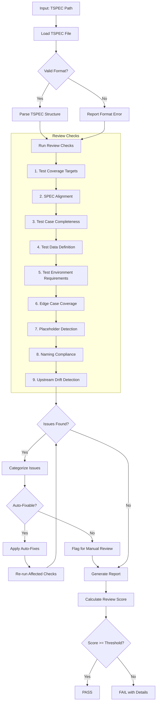
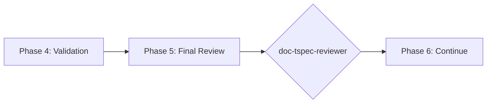

# doc-tspec-reviewer

## Purpose

Comprehensive **content review and quality assurance** for Test Specification (TSPEC) documents. This skill performs deep content analysis beyond structural validation, checking test coverage across all 4 types (UTEST, ITEST, STEST, FTEST), SPEC alignment, test case completeness, and identifying issues that require manual review.

**Layer**: 10 (TSPEC Quality Assurance)

**Upstream**: TSPEC (from `doc-tspec-autopilot` or `doc-tspec`)

**Downstream**: None (final QA gate before implementation)

---

## When to Use This Skill

Use `doc-tspec-reviewer` when:

- **After TSPEC Generation**: Run immediately after `doc-tspec-autopilot` completes
- **Manual TSPEC Edits**: After making manual changes to TSPEC
- **Pre-Implementation**: Before starting test implementation
- **Coverage Review**: When assessing test coverage completeness
- **Periodic Review**: Regular quality checks on existing TSPECs

**Do NOT use when**:
- TSPEC does not exist yet (use `doc-tspec` or `doc-tspec-autopilot` first)
- Need structural/schema validation only (use `doc-tspec-validator`)
- Generating new TSPEC content (use `doc-tspec`)

---

## Skill vs Validator: Key Differences

| Aspect | `doc-tspec-validator` | `doc-tspec-reviewer` |
|--------|----------------------|---------------------|
| **Focus** | Schema compliance, IMPL-Ready score | Content quality, test completeness |
| **Checks** | Required sections, format | Coverage targets, SPEC alignment |
| **Auto-Fix** | Structural issues only | Content issues (formatting) |
| **Output** | IMPL-Ready score (numeric) | Review score + issue list |
| **Phase** | Phase 4 (Validation) | Phase 5 (Final Review) |
| **Blocking** | IMPL-Ready < threshold blocks | Review score < threshold flags |

---

## Review Workflow



---

## Review Checks

### 0. Structure Compliance (12/12) - BLOCKING

Validates TSPEC follows the mandatory nested folder rule.

**Nested Folder Rule**: ALL TSPEC documents MUST be in nested folders.

**Required Structure**:

| TSPEC Type | Required Location |
|------------|-------------------|
| UTEST | `docs/10_TSPEC/UTEST/UTEST-NN_{slug}/UTEST-NN_{slug}.md` |
| ITEST | `docs/10_TSPEC/ITEST/ITEST-NN_{slug}/ITEST-NN_{slug}.md` |
| STEST | `docs/10_TSPEC/STEST/STEST-NN_{slug}/STEST-NN_{slug}.md` |
| FTEST | `docs/10_TSPEC/FTEST/FTEST-NN_{slug}/FTEST-NN_{slug}.md` |

**Error Codes**:

| Code | Severity | Description |
|------|----------|-------------|
| REV-STR001 | Error | TSPEC not in nested folder (BLOCKING) |
| REV-STR002 | Error | Folder name doesn't match TSPEC ID |
| REV-STR003 | Warning | File name doesn't match folder name |
| REV-STR004 | Error | TSPEC not in correct type subdirectory |

**This check is BLOCKING** - TSPEC must pass structure validation before other checks proceed.

---

### 1. Test Coverage Targets

Validates coverage targets are met.

**Coverage Targets**:
- Unit Tests (UTEST): >= 80%
- Integration Tests (ITEST): >= 70%
- Smoke Tests (STEST): Critical paths
- Functional Tests (FTEST): >= 85%

**Error Codes**:

| Code | Severity | Description |
|------|----------|-------------|
| REV-TC001 | Error | UTEST coverage below 80% |
| REV-TC002 | Error | ITEST coverage below 70% |
| REV-TC003 | Warning | STEST missing critical paths |
| REV-TC004 | Warning | FTEST coverage below 85% |

---

### 2. SPEC Alignment

Validates tests trace to SPEC requirements.

**Scope**:
- Every SPEC method has corresponding tests
- All interfaces tested
- Error scenarios covered
- Thresholds validated in tests

**Error Codes**:

| Code | Severity | Description |
|------|----------|-------------|
| REV-SA001 | Error | SPEC method without test |
| REV-SA002 | Error | Interface not tested |
| REV-SA003 | Warning | Error scenario not covered |
| REV-SA004 | Warning | Threshold not validated in test |

---

### 3. Test Case Completeness

Validates test cases have all required elements.

**Required Elements**:
- Test ID
- Description
- Preconditions
- Test steps
- Expected results
- Postconditions

**Error Codes**:

| Code | Severity | Description |
|------|----------|-------------|
| REV-TCC001 | Error | Test case missing required element |
| REV-TCC002 | Warning | Test steps incomplete |
| REV-TCC003 | Warning | Expected results vague |
| REV-TCC004 | Info | Postconditions not defined |

---

### 4. Test Data Definition

Validates test data is properly defined.

**Scope**:
- Test data sets documented
- Boundary values included
- Invalid data sets present
- Data setup/teardown defined

**Error Codes**:

| Code | Severity | Description |
|------|----------|-------------|
| REV-TD001 | Error | No test data defined |
| REV-TD002 | Warning | Boundary values not included |
| REV-TD003 | Warning | Invalid data not tested |
| REV-TD004 | Info | Data setup not documented |

---

### 5. Test Environment Requirements

Validates environment specifications present.

**Scope**:
- Environment requirements documented
- Dependencies listed
- Configuration specified
- Resource requirements defined

**Error Codes**:

| Code | Severity | Description |
|------|----------|-------------|
| REV-TE001 | Warning | Environment requirements missing |
| REV-TE002 | Warning | Dependencies not listed |
| REV-TE003 | Info | Configuration not specified |
| REV-TE004 | Info | Resource requirements not defined |

---

### 6. Edge Case Coverage

Validates edge cases and error conditions tested.

**Scope**:
- Boundary conditions tested
- Null/empty input handling
- Timeout scenarios
- Concurrent access cases

**Error Codes**:

| Code | Severity | Description |
|------|----------|-------------|
| REV-EC001 | Warning | Boundary condition not tested |
| REV-EC002 | Warning | Null/empty input not tested |
| REV-EC003 | Info | Timeout scenario not covered |
| REV-EC004 | Info | Concurrent access not tested |

---

### 7. Placeholder Detection

Identifies incomplete content requiring replacement.

**Error Codes**:

| Code | Severity | Description |
|------|----------|-------------|
| REV-P001 | Error | [TODO] placeholder found |
| REV-P002 | Error | [TBD] placeholder found |
| REV-P003 | Warning | Template value not replaced |

---

### 8. Naming Compliance

Validates element IDs follow `doc-naming` standards.

**Scope**:
- Element IDs use `TSPEC.NN.TT.SS` format
- Element type codes valid for TSPEC (40, 41, 42, 43)
- Test case naming convention

**Error Codes**:

| Code | Severity | Description |
|------|----------|-------------|
| REV-N001 | Error | Invalid element ID format |
| REV-N002 | Error | Element type code not valid for TSPEC |
| REV-N003 | Error | Legacy pattern detected |

---

### 9. Upstream Drift Detection (Mandatory Cache)

Detects when upstream SPEC documents have been modified after the TSPEC was created or last updated.

**The drift cache is mandatory.** All TSPEC reviews must maintain and validate against the drift cache to ensure test specifications remain synchronized with SPEC changes.

**Purpose**: Identifies stale TSPEC content that may not reflect current SPEC documentation. When SPEC documents (methods, interfaces, data models) change, the TSPEC may need updates to maintain test coverage alignment.

**Scope**:
- `@spec:` tag targets (SPEC documents)
- Traceability section upstream artifact links
- Any markdown links to `../09_SPEC/` source documents

#### Drift Cache File (MANDATORY)

Location: `docs/10_TSPEC/.drift_cache.json`

**Schema**:

```json
{
  "cache_version": "2.0",
  "created": "2026-02-10T17:00:00Z",
  "last_validated": "2026-02-10T17:00:00Z",
  "documents": {
    "TSPEC-03": {
      "tspec_path": "docs/10_TSPEC/TSPEC-03_f3_observability.md",
      "tspec_hash": "sha256:abc123...",
      "last_updated": "2026-02-10T14:30:00Z",
      "upstream_refs": {
        "SPEC-03.yaml": {
          "path": "docs/09_SPEC/SPEC-03_f3_observability.yaml",
          "content_hash": "sha256:def456...",
          "section_hashes": {
            "methods": "sha256:ghi789...",
            "interfaces": "sha256:jkl012...",
            "data_models": "sha256:mno345..."
          },
          "last_validated": "2026-02-10T14:30:00Z"
        }
      }
    }
  }
}
```

#### Three-Phase Detection Algorithm

**Phase 1: Cache Initialization**
```
IF .drift_cache.json does not exist:
    1. Create cache file with schema version 2.0
    2. Scan all TSPEC documents in docs/10_TSPEC/
    3. For each TSPEC:
       a. Extract upstream SPEC references
       b. Compute content hashes for TSPEC
       c. Compute content hashes for each upstream SPEC
       d. Store in cache
    4. Report: "Cache initialized with N TSPEC documents"
```

**Phase 2: Drift Detection**
```
FOR each TSPEC being reviewed:
    1. Load cached hashes for this TSPEC
    2. For each upstream SPEC reference:
       a. Compute current hash of SPEC document
       b. Compare to cached hash
       c. IF hashes differ:
          - Flag as DRIFT
          - Compute section-level hashes to identify changed sections
          - Calculate change percentage
    3. Check timestamp: SPEC mtime > TSPEC last_updated
    4. Aggregate drift findings by severity
```

**Phase 3: Cache Update**
```
AFTER successful review (score >= threshold):
    1. Update content hashes for reviewed TSPEC
    2. Update upstream SPEC hashes
    3. Set last_validated timestamp
    4. Write updated cache to disk
    5. Report: "Cache updated for TSPEC-NN"
```

#### Hash Calculation

**Content Hash** (SHA-256):

```python
import hashlib

def compute_content_hash(file_path: str) -> str:
    """Compute SHA-256 hash of file content, normalized."""
    with open(file_path, 'r', encoding='utf-8') as f:
        content = f.read()
    # Normalize: strip whitespace, lowercase for comparison
    normalized = content.strip()
    return f"sha256:{hashlib.sha256(normalized.encode()).hexdigest()[:16]}"

def compute_section_hash(file_path: str, section_name: str) -> str:
    """Compute hash of specific YAML section."""
    # Extract section content between section_name: and next top-level key
    # Apply same normalization and hash
    pass
```

**Error Codes**:

| Code | Severity | Description |
|------|----------|-------------|
| REV-D001 | Warning | Upstream SPEC document modified after TSPEC creation |
| REV-D002 | Warning | Referenced section content has changed (hash mismatch) |
| REV-D003 | Info | Upstream document version incremented |
| REV-D004 | Info | New content added to upstream document |
| REV-D005 | Error | Critical upstream document substantially modified (>20% change) |
| REV-D006 | Error | Drift cache missing or corrupted - must initialize before review |

**Report Output**:

```markdown
## Upstream Drift Analysis

**Cache Status**: Valid | Last validated: 2026-02-10T14:30:00Z

| Upstream Document | TSPEC Reference | Cached Hash | Current Hash | Change % | Severity |
|-------------------|-----------------|-------------|--------------|----------|----------|
| SPEC-03.yaml | @spec methods | sha256:abc1... | sha256:xyz9... | 15% | Warning |
| SPEC-03.yaml | @spec interfaces | sha256:def4... | sha256:def4... | 0% | OK |

### Changed Sections Detail

**SPEC-03.yaml#methods** (15% change):
- Lines 45-67: Method signature changed
- Lines 120-135: New parameter added

**Recommendation**: Review upstream SPEC changes and update TSPEC test cases for modified methods.
```

**Auto-Actions**:
- Initialize `.drift_cache.json` if missing (Phase 1)
- Update cache with current hashes after successful review (Phase 3)
- Add `[DRIFT]` marker to affected @spec tags in review report
- Generate drift summary with section-level detail

**Configuration**:

| Setting | Default | Description |
|---------|---------|-------------|
| `cache_enabled` | true | **Mandatory** - cache is always enabled |
| `drift_threshold_days` | 7 | Days before drift becomes Warning |
| `critical_threshold_days` | 30 | Days before drift becomes Error |
| `change_threshold_percent` | 20 | Change percentage triggering Error severity |
| `tracked_patterns` | `@spec:` | Patterns to track for drift |

---

## Review Score Calculation

**Scoring Formula**:

| Category | Weight | Calculation |
|----------|--------|-------------|
| Test Coverage Targets | 19% | (coverage_met / 4) × 19 |
| SPEC Alignment | 19% | (aligned_tests / total) × 19 |
| Test Case Completeness | 19% | (complete / total_cases) × 19 |
| Test Data Definition | 9% | (data_score) × 9 |
| Test Environment Requirements | 5% | (requirements_met / total) × 5 |
| Edge Case Coverage | 9% | (covered / identified) × 9 |
| Placeholder Detection | 5% | (no_placeholders ? 5 : 5 - count) |
| Naming Compliance | 10% | (valid_ids / total_ids) × 10 |
| Upstream Drift | 5% | (fresh_refs / total_refs) × 5 |

**Total**: Sum of all categories (max 100)

**Thresholds**:
- **PASS**: >= 90
- **WARNING**: 80-89
- **FAIL**: < 80

---

## Command Usage

```bash
# Review specific TSPEC
/doc-tspec-reviewer TSPEC-03

# Review TSPEC by path
/doc-tspec-reviewer docs/10_TSPEC/TSPEC-03_f3_observability.md

# Review all TSPECs
/doc-tspec-reviewer all
```

---

## Output Report

Review reports are stored alongside the reviewed document per project standards.

**Nested Folder Rule**: ALL TSPEC use nested folders (`TSPEC-NN_{slug}/`) regardless of size. This ensures review reports, fix reports, and drift cache files are organized with their parent document.

**File Naming**: `TSPEC-NN.R_review_report_vNNN.md`

**Location**: Inside the TSPEC nested folder: `docs/10_TSPEC/TSPEC-NN_{slug}/`

### Versioning Rules

1. **First Review**: Creates `TSPEC-NN.R_review_report_v001.md`
2. **Subsequent Reviews**: Auto-increments version (v002, v003, etc.)
3. **Same-Day Reviews**: Each review gets unique version number

**Version Detection**: Scans folder for existing `TSPEC-NN.R_review_report_v*.md` files and increments.

**Example**:

```
docs/10_TSPEC/TSPEC-03_f3_observability/
├── TSPEC-03_f3_observability.md
├── TSPEC-03.R_review_report_v001.md    # First review
├── TSPEC-03.R_review_report_v002.md    # After fixes
└── .drift_cache.json
```

### Delta Reporting

When previous reviews exist, include score comparison in the report.

See `REVIEW_DOCUMENT_STANDARDS.md` for complete versioning requirements.

---

## Integration with doc-tspec-autopilot

This skill is invoked during Phase 5 of `doc-tspec-autopilot`:



---

## Related Skills

| Skill | Relationship |
|-------|--------------|
| `doc-naming` | Naming standards for Check #8 |
| `doc-tspec-autopilot` | Invokes this skill in Phase 5 |
| `doc-tspec-validator` | Structural validation (Phase 4) |
| `doc-tspec-fixer` | Applies fixes based on review findings |
| `doc-tspec` | TSPEC creation rules |
| `doc-spec-reviewer` | Upstream QA |

---

## Version History

| Version | Date | Changes |
|---------|------|---------|
| 1.4 | 2026-02-11 | **BLOCKING Structure Compliance check**: Added Check #0 as BLOCKING gate; Validates nested folder rule for all TSPEC types (UTEST/ITEST/STEST/FTEST); REV-STR001-STR004 error codes; TSPEC must pass structure validation before other checks proceed |
| 1.3 | 2026-02-10 | **Mandatory drift cache**: Cache is now required for all reviews; Three-phase detection algorithm; SHA-256 hash calculation with Python example; REV-D006 error code for missing cache; Cache schema v2.0 with section-level hashes; Report output with cache status and change percentages |
| 1.2 | 2026-02-10 | Added Check #9: Upstream Drift Detection - detects when SPEC documents modified after TSPEC creation; REV-D001-D005 error codes; drift cache support; configurable thresholds; added doc-tspec-fixer to related skills |
| 1.1 | 2026-02-10 | Added review versioning support (_vNNN pattern); Delta reporting for score comparison |
| 1.0 | 2026-02-10 | Initial skill creation with 8 review checks; Coverage target validation; SPEC alignment; Test case completeness; Edge case coverage |
