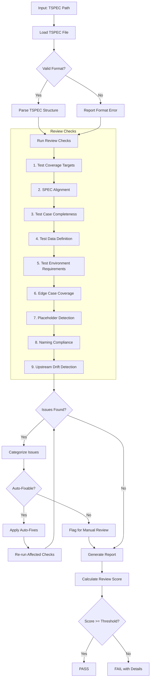
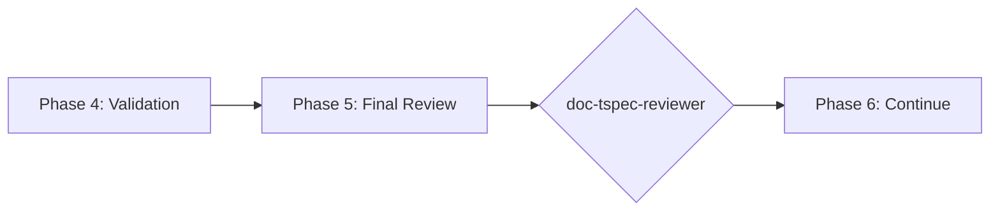

# doc-tspec-reviewer

## Purpose

Comprehensive **content review and quality assurance** for Test Specification (TSPEC) documents. This skill performs deep content analysis beyond structural validation, checking test coverage across all 4 types (UTEST, ITEST, STEST, FTEST), SPEC alignment, test case completeness, and identifying issues that require manual review.

**Layer**: 10 (TSPEC Quality Assurance)

**Upstream**: TSPEC (from `doc-tspec-autopilot` or `doc-tspec`)

**Downstream**: None (final QA gate before implementation)

---

## When to Use This Skill

Use `doc-tspec-reviewer` when:

- **After TSPEC Generation**: Run immediately after `doc-tspec-autopilot` completes
- **Manual TSPEC Edits**: After making manual changes to TSPEC
- **Pre-Implementation**: Before starting test implementation
- **Coverage Review**: When assessing test coverage completeness
- **Periodic Review**: Regular quality checks on existing TSPECs

**Do NOT use when**:
- TSPEC does not exist yet (use `doc-tspec` or `doc-tspec-autopilot` first)
- Need structural/schema validation only (use `doc-tspec-validator`)
- Generating new TSPEC content (use `doc-tspec`)

---

## Skill vs Validator: Key Differences

| Aspect | `doc-tspec-validator` | `doc-tspec-reviewer` |
|--------|----------------------|---------------------|
| **Focus** | Schema compliance, IMPL-Ready score | Content quality, test completeness |
| **Checks** | Required sections, format | Coverage targets, SPEC alignment |
| **Auto-Fix** | Structural issues only | Content issues (formatting) |
| **Output** | IMPL-Ready score (numeric) | Review score + issue list |
| **Phase** | Phase 4 (Validation) | Phase 5 (Final Review) |
| **Blocking** | IMPL-Ready < threshold blocks | Review score < threshold flags |

---

## Review Workflow



---

## Review Checks

### 1. Test Coverage Targets

Validates coverage targets are met.

**Coverage Targets**:
- Unit Tests (UTEST): >= 80%
- Integration Tests (ITEST): >= 70%
- Smoke Tests (STEST): Critical paths
- Functional Tests (FTEST): >= 85%

**Error Codes**:

| Code | Severity | Description |
|------|----------|-------------|
| REV-TC001 | Error | UTEST coverage below 80% |
| REV-TC002 | Error | ITEST coverage below 70% |
| REV-TC003 | Warning | STEST missing critical paths |
| REV-TC004 | Warning | FTEST coverage below 85% |

---

### 2. SPEC Alignment

Validates tests trace to SPEC requirements.

**Scope**:
- Every SPEC method has corresponding tests
- All interfaces tested
- Error scenarios covered
- Thresholds validated in tests

**Error Codes**:

| Code | Severity | Description |
|------|----------|-------------|
| REV-SA001 | Error | SPEC method without test |
| REV-SA002 | Error | Interface not tested |
| REV-SA003 | Warning | Error scenario not covered |
| REV-SA004 | Warning | Threshold not validated in test |

---

### 3. Test Case Completeness

Validates test cases have all required elements.

**Required Elements**:
- Test ID
- Description
- Preconditions
- Test steps
- Expected results
- Postconditions

**Error Codes**:

| Code | Severity | Description |
|------|----------|-------------|
| REV-TCC001 | Error | Test case missing required element |
| REV-TCC002 | Warning | Test steps incomplete |
| REV-TCC003 | Warning | Expected results vague |
| REV-TCC004 | Info | Postconditions not defined |

---

### 4. Test Data Definition

Validates test data is properly defined.

**Scope**:
- Test data sets documented
- Boundary values included
- Invalid data sets present
- Data setup/teardown defined

**Error Codes**:

| Code | Severity | Description |
|------|----------|-------------|
| REV-TD001 | Error | No test data defined |
| REV-TD002 | Warning | Boundary values not included |
| REV-TD003 | Warning | Invalid data not tested |
| REV-TD004 | Info | Data setup not documented |

---

### 5. Test Environment Requirements

Validates environment specifications present.

**Scope**:
- Environment requirements documented
- Dependencies listed
- Configuration specified
- Resource requirements defined

**Error Codes**:

| Code | Severity | Description |
|------|----------|-------------|
| REV-TE001 | Warning | Environment requirements missing |
| REV-TE002 | Warning | Dependencies not listed |
| REV-TE003 | Info | Configuration not specified |
| REV-TE004 | Info | Resource requirements not defined |

---

### 6. Edge Case Coverage

Validates edge cases and error conditions tested.

**Scope**:
- Boundary conditions tested
- Null/empty input handling
- Timeout scenarios
- Concurrent access cases

**Error Codes**:

| Code | Severity | Description |
|------|----------|-------------|
| REV-EC001 | Warning | Boundary condition not tested |
| REV-EC002 | Warning | Null/empty input not tested |
| REV-EC003 | Info | Timeout scenario not covered |
| REV-EC004 | Info | Concurrent access not tested |

---

### 7. Placeholder Detection

Identifies incomplete content requiring replacement.

**Error Codes**:

| Code | Severity | Description |
|------|----------|-------------|
| REV-P001 | Error | [TODO] placeholder found |
| REV-P002 | Error | [TBD] placeholder found |
| REV-P003 | Warning | Template value not replaced |

---

### 8. Naming Compliance

Validates element IDs follow `doc-naming` standards.

**Scope**:
- Element IDs use `TSPEC.NN.TT.SS` format
- Element type codes valid for TSPEC (40, 41, 42, 43)
- Test case naming convention

**Error Codes**:

| Code | Severity | Description |
|------|----------|-------------|
| REV-N001 | Error | Invalid element ID format |
| REV-N002 | Error | Element type code not valid for TSPEC |
| REV-N003 | Error | Legacy pattern detected |

---

### 9. Upstream Drift Detection

Detects when upstream SPEC documents have been modified after the TSPEC was created or last updated.

**Purpose**: Identifies stale TSPEC content that may not reflect current SPEC documentation. When SPEC documents (methods, interfaces, data models) change, the TSPEC may need updates to maintain test coverage alignment.

**Scope**:
- `@spec:` tag targets (SPEC documents)
- Traceability section upstream artifact links
- Any markdown links to `../09_SPEC/` source documents

**Detection Methods**:

| Method | Description | Precision |
|--------|-------------|-----------|
| **Timestamp Comparison** | Compares source doc `mtime` vs TSPEC creation/update date | Medium |
| **Content Hash** | SHA-256 hash of referenced sections | High |
| **Version Tracking** | Checks `version` field in YAML frontmatter | High |

**Algorithm**:

```
1. Extract all upstream references from TSPEC:
   - @spec: tags → [path, section anchor]
   - Links to ../09_SPEC/ → [path]
   - Traceability table upstream artifacts → [path]

2. For each upstream reference:
   a. Resolve path to absolute file path
   b. Check file exists (already covered by Check #2)
   c. Get file modification time (mtime)
   d. Compare mtime > TSPEC last_updated date
   e. If mtime > TSPEC date → flag as DRIFT

3. Optional (high-precision mode):
   a. Extract specific section referenced by anchor
   b. Compute SHA-256 hash of section content
   c. Compare to cached hash (stored in .drift_cache.json)
   d. If hash differs → flag as CONTENT_DRIFT
```

**Drift Cache File** (optional):

Location: `docs/10_TSPEC/.drift_cache.json`

```json
{
  "tspec_version": "1.0",
  "tspec_updated": "2026-02-10",
  "upstream_hashes": {
    "../../09_SPEC/SPEC-03.yaml#methods": "a1b2c3d4...",
    "../../09_SPEC/SPEC-03.yaml#interfaces": "e5f6g7h8..."
  }
}
```

**Error Codes**:

| Code | Severity | Description |
|------|----------|-------------|
| REV-D001 | Warning | Upstream SPEC document modified after TSPEC creation |
| REV-D002 | Warning | Referenced section content has changed (hash mismatch) |
| REV-D003 | Info | Upstream document version incremented |
| REV-D004 | Info | New content added to upstream document |
| REV-D005 | Error | Critical upstream document substantially modified (>20% change) |

**Report Output**:

```markdown
## Upstream Drift Analysis

| Upstream Document | TSPEC Reference | Last Modified | TSPEC Updated | Days Stale | Severity |
|-------------------|-----------------|---------------|---------------|------------|----------|
| SPEC-03.yaml | @spec Section methods | 2026-02-08 | 2026-02-05 | 3 | Warning |
| SPEC-03.yaml | @spec interfaces | 2026-02-10 | 2026-02-05 | 5 | Warning |

**Recommendation**: Review upstream SPEC changes and update TSPEC if methods or interfaces have changed.
```

**Auto-Actions**:
- Update `.drift_cache.json` with current hashes after review
- Add `[DRIFT]` marker to affected @spec tags (optional)
- Generate drift summary in review report

**Configuration**:

| Setting | Default | Description |
|---------|---------|-------------|
| `drift_threshold_days` | 7 | Days before drift becomes Warning |
| `critical_threshold_days` | 30 | Days before drift becomes Error |
| `enable_hash_check` | false | Enable SHA-256 content hashing |
| `tracked_patterns` | `@spec:` | Patterns to track for drift |

---

## Review Score Calculation

**Scoring Formula**:

| Category | Weight | Calculation |
|----------|--------|-------------|
| Test Coverage Targets | 19% | (coverage_met / 4) × 19 |
| SPEC Alignment | 19% | (aligned_tests / total) × 19 |
| Test Case Completeness | 19% | (complete / total_cases) × 19 |
| Test Data Definition | 9% | (data_score) × 9 |
| Test Environment Requirements | 5% | (requirements_met / total) × 5 |
| Edge Case Coverage | 9% | (covered / identified) × 9 |
| Placeholder Detection | 5% | (no_placeholders ? 5 : 5 - count) |
| Naming Compliance | 10% | (valid_ids / total_ids) × 10 |
| Upstream Drift | 5% | (fresh_refs / total_refs) × 5 |

**Total**: Sum of all categories (max 100)

**Thresholds**:
- **PASS**: >= 90
- **WARNING**: 80-89
- **FAIL**: < 80

---

## Command Usage

```bash
# Review specific TSPEC
/doc-tspec-reviewer TSPEC-03

# Review TSPEC by path
/doc-tspec-reviewer docs/10_TSPEC/TSPEC-03_f3_observability.md

# Review all TSPECs
/doc-tspec-reviewer all
```

---

## Output Report

Review reports are stored alongside the reviewed document per project standards.

**File Naming**: `TSPEC-NN.R_review_report_vNNN.md`

**Location**: Same folder as the reviewed TSPEC document.

### Versioning Rules

1. **First Review**: Creates `TSPEC-NN.R_review_report_v001.md`
2. **Subsequent Reviews**: Auto-increments version (v002, v003, etc.)
3. **Same-Day Reviews**: Each review gets unique version number

**Version Detection**: Scans folder for existing `TSPEC-NN.R_review_report_v*.md` files and increments.

**Example**:

```
docs/10_TSPEC/
├── TSPEC-03_f3_observability.md
├── TSPEC-03.R_review_report_v001.md    # First review
└── TSPEC-03.R_review_report_v002.md    # After fixes
```

### Delta Reporting

When previous reviews exist, include score comparison in the report.

See `REVIEW_DOCUMENT_STANDARDS.md` for complete versioning requirements.

---

## Integration with doc-tspec-autopilot

This skill is invoked during Phase 5 of `doc-tspec-autopilot`:



---

## Related Skills

| Skill | Relationship |
|-------|--------------|
| `doc-naming` | Naming standards for Check #8 |
| `doc-tspec-autopilot` | Invokes this skill in Phase 5 |
| `doc-tspec-validator` | Structural validation (Phase 4) |
| `doc-tspec-fixer` | Applies fixes based on review findings |
| `doc-tspec` | TSPEC creation rules |
| `doc-spec-reviewer` | Upstream QA |

---

## Version History

| Version | Date | Changes |
|---------|------|---------|
| 1.2 | 2026-02-10 | Added Check #9: Upstream Drift Detection - detects when SPEC documents modified after TSPEC creation; REV-D001-D005 error codes; drift cache support; configurable thresholds; added doc-tspec-fixer to related skills |
| 1.1 | 2026-02-10 | Added review versioning support (_vNNN pattern); Delta reporting for score comparison |
| 1.0 | 2026-02-10 | Initial skill creation with 8 review checks; Coverage target validation; SPEC alignment; Test case completeness; Edge case coverage |
