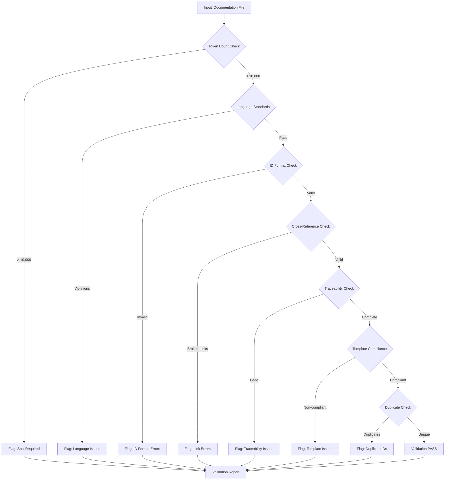

# doc-validator

**Description**: Automated validation of documentation standards for SDD framework compliance

**Category**: Documentation Quality Assurance

**Complexity**: Medium (validation rules + cross-reference analysis)

---

## Purpose

Enforce documentation quality standards across all SDD artifacts to ensure consistency, traceability, and compliance with project requirements. Prevents common documentation errors before commit.

---

## Capabilities

### 1. Token Count Validation
- **Claude Code (Primary)**: Maximum 50,000 tokens (200KB) standard, 100,000 tokens (400KB) absolute maximum
- **Gemini CLI (Secondary)**: Flags files >10,000 tokens for file read tool usage (not `@` reference)
- **GitHub Copilot**: Flags files >30KB for companion summary creation
- Automatic token counting using tiktoken (cl100k_base encoding)
- Identifies files exceeding tool-specific limits
- Suggests consolidation opportunities (removes unnecessary splits)
- Recommends sequential file splitting only when exceeding 100,000 tokens or logical boundaries
- Provides tool-specific recommendations based on file size

### 2. Language Standards Enforcement
- Objective, factual language only
- Excludes promotional content
- No subjective qualifiers (amazing, powerful, efficient, easy)
- No time estimates or performance claims
- No Python code blocks within documentation files

### 3. Cross-Reference Validation
- Validates all internal links ([REQ-*], [BDD-*], [ADR-*], etc.)
- Checks external file references
- Identifies broken links or missing targets
- Validates bidirectional traceability

### 4. ID Format Compliance
- REQ-{CATEGORY}-{NUMBER} (e.g., REQ-AUTH-001)
- BDD-{FEATURE}-{NUMBER} (e.g., BDD-LOGIN-001)
- ADR-{NUMBER} (e.g., ADR-001)
- IMPL-{PHASE}-{NUMBER} (e.g., IMPL-P1-001)
- CTR-{SERVICE}-{VERSION} (e.g., CTR-USER-V1)
- SPEC-{COMPONENT}-{VERSION} (e.g., SPEC-API-V1)
- TASK-{COMPONENT}-{NUMBER} (e.g., TASK-AUTH-001)

### 5. Traceability Matrix Validation
- Ensures all requirements have source references
- Validates forward traceability (REQ → BDD → TASK)
- Validates backward traceability (TASK → BDD → REQ)
- Identifies orphaned requirements or tasks

### 6. Template Compliance
- Validates document structure against templates
- Checks required sections
- Verifies metadata completeness
- Ensures proper header hierarchy

### 7. Duplicate Content Detection
- Identifies duplicate requirement IDs
- Detects copy-paste errors
- Flags redundant content across documents

### 8. Code Separation Validation
- Ensures no Python code blocks in documentation
- Validates flowchart usage instead of code
- Checks for proper code file references

---

## Validation Workflow



---

## Usage Instructions

### Pre-Commit Validation

```bash
# Validate single file
doc-validator validate /path/to/document.md

# Validate directory
doc-validator validate-dir /path/to/docs

# Validate all SDD artifacts
doc-validator validate-all
```

### Integration with doc-flow

When doc-flow generates or updates documentation:
1. Automatically invoke doc-validator
2. Report validation results
3. Block commit if critical errors found
4. Provide fix suggestions

### Validation Report Format

```
=== Documentation Validation Report ===

File: reqs/requirements.md
Status: FAILED

Errors (3):
- [Token Count] 12,450 tokens exceeds 10,000 limit
  → Suggestion: Split at section "Data Architecture Requirements"

- [Cross-Reference] Broken link [REQ-AUTH-015] at line 234
  → Target not found in any REQ documents

- [ID Format] Invalid ID "REQ-USER-LOGIN-1" at line 156
  → Expected format: REQ-{CATEGORY}-{NUMBER} (e.g., REQ-USER-001)

Warnings (1):
- [Language] Subjective qualifier "easy to use" at line 89
  → Replace with objective description

Info (2):
- Total requirements: 45
- Traceability coverage: 98% (44/45 linked)
```

---

## Validation Rules

### Token Count Rules (Tool-Optimized)

**Claude Code (Primary Tool):**
- **CRITICAL**: File > 100,000 tokens → MUST split at logical boundaries
- **WARNING**: File > 50,000 tokens → Consider splitting if logical boundaries exist
- **INFO**: File > 30,000 tokens → Monitor growth, optimal range is 20-40KB

**Gemini CLI (Secondary Tool):**
- **INFO**: File > 10,000 tokens → Recommend using file read tool instead of `@` reference
- Note: No splitting required - file read tool handles any size

**GitHub Copilot:**
- **WARNING**: File > 30,000 bytes → Consider creating companion summary
- **INFO**: File > 20,000 bytes → May need chunked interaction strategy

### Language Standards Rules
- **WARNING**: Python code blocks >50 lines in .md files → Consider separate .py file
- **INFO**: Python code blocks <50 lines → Acceptable inline
- **ERROR**: Promotional language, subjective claims
- **WARNING**: Vague terminology, imprecise descriptions
- **INFO**: Passive voice, verbose phrasing

### Cross-Reference Rules
- **CRITICAL**: Broken internal links
- **ERROR**: Missing bidirectional references
- **WARNING**: Weak traceability (indirect links only)
- **INFO**: Optional references missing

### ID Format Rules
- **CRITICAL**: Malformed ID (cannot parse)
- **ERROR**: Incorrect category/component name
- **WARNING**: Non-sequential numbering
- **INFO**: Naming convention suggestions

### Traceability Rules
- **CRITICAL**: Orphaned requirements (no forward/backward links)
- **ERROR**: Incomplete traceability chain
- **WARNING**: Single-point traceability (only one direction)
- **INFO**: Optional traceability missing

### Template Compliance Rules
- **CRITICAL**: Missing required sections
- **ERROR**: Incorrect header hierarchy
- **WARNING**: Missing optional metadata
- **INFO**: Formatting suggestions

### Duplicate Detection Rules
- **CRITICAL**: Duplicate IDs in same document
- **ERROR**: Duplicate IDs across documents
- **WARNING**: Near-duplicate content (>80% similarity)
- **INFO**: Similar descriptions (may be intentional)

### REF Document Rules (Minimal Validation)

Reference documents (`{TYPE}-REF-NNN`) use minimal, non-blocking validation:

**Required (Blocking)**:
| Check | Pattern | Severity |
|-------|---------|----------|
| H1 ID Match | `^#\s[A-Z]{2,5}-REF-\d{3}:.+` | ERROR |
| Document Control | Section present | ERROR |
| Revision History | Section present | ERROR |
| Introduction | Section present | ERROR |

**Exempted (Not Checked)**:
| Check | Reason |
|-------|--------|
| Cumulative Tags | REF docs don't participate in traceability chain |
| Full Traceability | Traceability is optional for REF docs |
| Quality Gates | Non-blocking validation only |
| SPEC-Ready Score | Not applicable |
| Layer Requirements | REF has no layer assignment |

**Validation Behavior**:
- REF documents flagged with warnings, not errors
- Validation continues even if REF checks fail
- REF documents excluded from traceability matrix validation
- Optional `Related Documents` section encouraged but not required

---

## Tool Access

Required tools for validation:
- `Read`: Read documentation files
- `Glob`: Find all documentation files
- `Grep`: Search for patterns and IDs
- `Bash`: Execute token counting scripts
- `tiktoken` library: Token counting

---

## Schema Definitions

Each artifact type has a YAML schema file (`{TYPE}_SCHEMA.yaml`) that defines validation rules. These schemas are the authoritative source for:
- **Metadata Requirements**: YAML frontmatter fields, allowed values
- **Document Structure**: Required/optional sections, numbering patterns
- **Artifact-Specific Patterns**: Type-specific formats (Gherkin, sequential NNN, TASK-NNN, etc.)
- **Validation Rules**: Error/warning severities with fix instructions
- **Traceability Requirements**: Cumulative tagging hierarchy per layer
- **Error Messages**: Standardized codes (E001-E0XX, W001-W0XX, I001-I0XX)

### Schema File Reference

| Layer | Artifact | Schema File | Key Patterns |
|-------|----------|-------------|--------------|
| 1 | BRD | `ai_dev_flow/BRD/BRD_SCHEMA.yaml` | Business objectives format |
| 2 | PRD | `ai_dev_flow/PRD/PRD_SCHEMA.yaml` | Requirements format, template variants |
| 3 | EARS | `ai_dev_flow/EARS/EARS_SCHEMA.yaml` | WHEN-THE-SHALL-WITHIN format |
| 4 | BDD | `ai_dev_flow/BDD/BDD_SCHEMA.yaml` | Gherkin syntax, step patterns |
| 5 | ADR | `ai_dev_flow/ADR/ADR_SCHEMA.yaml` | Context-Decision-Consequences |
| 6 | SYS | `ai_dev_flow/SYS/SYS_SCHEMA.yaml` | Sequential NNN requirements format |
| 7 | REQ | `ai_dev_flow/REQ/REQ_SCHEMA.yaml` | 12 sections, interface schemas |
| 8 | IMPL | `ai_dev_flow/IMPL/IMPL_SCHEMA.yaml` | Phase organization, deliverables |
| 9 | CTR | `ai_dev_flow/CTR/CTR_SCHEMA.yaml` | Dual-file, OpenAPI/AsyncAPI |
| 10 | SPEC | `ai_dev_flow/SPEC/SPEC_SCHEMA.yaml` | YAML structure, code gen ready |
| 11 | TASKS | `ai_dev_flow/TASKS/TASKS_SCHEMA.yaml` | TASK-NNN, implementation contracts |
| 12 | IPLAN | `ai_dev_flow/IPLAN/IPLAN_SCHEMA.yaml` | Session format, bash commands |

### Schema Validation Usage

```bash
# Validate document against schema (planned implementation)
python scripts/validate_artifact.py --schema ai_dev_flow/REQ/REQ_SCHEMA.yaml --document docs/REQ/REQ-001_example.md

# Validate all documents of a type
python scripts/validate_artifact.py --type REQ --strict
```

---

## Validation Scripts

The following artifact-specific validation scripts are available in `ai_dev_flow/scripts/`:

### Available Scripts (Ready to Use)

| Artifact | Script | Schema Reference |
|----------|--------|------------------|
| BRD | `validate_brd_template.sh` | `BRD_SCHEMA.yaml` |
| REQ | `validate_req_template.sh` | `REQ_SCHEMA.yaml` |
| CTR | `validate_ctr.sh` | `CTR_SCHEMA.yaml` |
| IMPL | `validate_impl.sh` | `IMPL_SCHEMA.yaml` |
| TASKS | `validate_tasks.sh` | `TASKS_SCHEMA.yaml` |
| IPLAN | `validate_iplan.sh` | `IPLAN_SCHEMA.yaml` |
| ICON | `validate_icon.sh` | Implementation Contracts Guide |

### Under Development (Schema-Driven)

| Artifact | Script | Schema Available |
|----------|--------|------------------|
| PRD | `validate_prd.sh` | ✅ `PRD_SCHEMA.yaml` |
| EARS | `validate_ears.sh` | ✅ `EARS_SCHEMA.yaml` |
| BDD | `validate_bdd.sh` | ✅ `BDD_SCHEMA.yaml` |
| ADR | `validate_adr.sh` | ✅ `ADR_SCHEMA.yaml` |
| SYS | `validate_sys.sh` | ✅ `SYS_SCHEMA.yaml` |
| SPEC | `validate_spec.sh` | ✅ `SPEC_SCHEMA.yaml` |

### Usage Examples

```bash
# Validate BRD document
./ai_dev_flow/scripts/validate_brd_template.sh docs/BRD/BRD-001_platform.md

# Validate TASKS document
./ai_dev_flow/scripts/validate_tasks.sh docs/TASKS/TASKS-001_*.md

# Validate Implementation Contracts
./ai_dev_flow/scripts/validate_icon.sh docs/ICON/ICON-001_*.md

# Validate IPLAN document
./ai_dev_flow/scripts/validate_iplan.sh docs/IPLAN/IPLAN-001_*.md
```

**Note**: For artifacts without validation scripts, use the template and SHARED_CONTENT.md for manual validation.

---

## Integration Points

### With doc-flow
- Invoked automatically after document generation
- Blocks workflow progression on critical errors
- Provides inline fix suggestions

### With charts-flow
- Validates diagram references
- Ensures bidirectional links between diagrams and docs

### With project-mngt
- Validates IMPL document structure
- Checks timeline and dependency formats

### With test-automation
- Validates BDD scenario references
- Ensures test traceability

---

## Error Handling

### Token Count Exceeded
```
CONTEXT: Evaluate file size against tool limits:
  - Claude Code: >100,000 tokens requires split
  - Gemini CLI: >10,000 tokens → recommend file read tool (no split needed)
  - GitHub Copilot: >30KB → suggest companion summary

ACTION (if >100,000 tokens):
  - Identify logical split points (functional modules, major sections)
  - Create sequential files with proper naming (doc_001.md, doc_002.md)
  - VERIFY: Each split file ≤ 100,000 tokens (Claude Code limit)
  - UPDATE: Cross-references in all related documents
  - CREATE: Index file listing all parts

ACTION (if 10,000-100,000 tokens):
  - Claude Code: No action needed (optimal range)
  - Gemini CLI: Note in docs to use file read tool instead of @ reference
  - GitHub Copilot: Consider creating companion summary for quick reference
```

### Broken Cross-Reference
```
ACTION: Search for referenced ID across all documents
SUGGEST: Correct ID if typo, or flag missing requirement
VERIFY: Bidirectional link exists
UPDATE: Traceability matrix
```

### Invalid ID Format
```
ACTION: Parse ID structure and identify error
SUGGEST: Correct format based on document type
VERIFY: No duplicate after correction
UPDATE: All references to this ID
```

### Traceability Gap
```
ACTION: Identify missing links in chain
SUGGEST: Add references to complete traceability
VERIFY: Bidirectional links established
UPDATE: Traceability matrix visualization
```

---

## Validation Metrics

Track and report:
- Files validated per run
- Error distribution by type
- Most common violations
- Traceability coverage percentage
- Average file token count
- Validation success rate over time

---

## Example Usage

### Validate Requirements Document

```markdown
Input: reqs/ml_model_requirements.md

Validation Results:
✓ Token count: 8,234 tokens (within limit)
✓ Language standards: No violations
✓ ID format: All 146 requirements properly formatted
✓ Cross-references: All links valid
✗ Traceability: 3 requirements missing BDD references
  - REQ-MRC-015: No forward link to BDD scenarios
  - REQ-SA-008: No forward link to BDD scenarios
  - REQ-ENSEMBLE-004: No forward link to BDD scenarios
✓ Template compliance: Proper structure
✓ No duplicates detected

Recommendation: Add BDD scenario references for 3 requirements
Priority: MEDIUM
```

### Validate BDD Scenarios

```markdown
Input: BDD/authentication_scenarios.md

Validation Results:
✓ Token count: 3,456 tokens (within limit)
✓ Language standards: Compliant
✗ ID format: 2 scenarios with incorrect format
  - Line 45: "BDD-LOGIN-1" should be "BDD-LOGIN-001"
  - Line 89: "BDD-LOGOUT" should be "BDD-LOGOUT-001"
✓ Cross-references: All requirement links valid
✗ Traceability: 5 scenarios not linked to TASK documents
✓ Template compliance: Proper Given-When-Then structure
✓ No duplicates detected

Recommendation: Fix ID formats and establish forward traceability
Priority: HIGH
```

---

## Best Practices

1. **Run validation before commit**: Catch errors early
2. **Address critical errors first**: Block progression until resolved
3. **Track validation metrics**: Identify systematic issues
4. **Automate in CI/CD**: Prevent non-compliant docs from merging
5. **Regular audits**: Monthly full-project validation
6. **Update validation rules**: Evolve with project standards
7. **Provide actionable feedback**: Specific fixes, not just error messages

---

## Limitations

1. Token counting requires tiktoken library installation
2. Cannot validate semantic correctness (only structural)
3. Cross-reference validation limited to explicit links
4. Language analysis uses pattern matching (not AI understanding)
5. Template compliance requires predefined templates
6. Performance degrades with very large document sets (>1000 files)

---

## Future Enhancements

1. AI-powered language quality analysis
2. Automated fix application (with user approval)
3. Real-time validation in editors (LSP integration)
4. Visual traceability matrix generation
5. Integration with version control (git hooks)
6. Customizable validation rule sets
7. Machine learning for duplicate detection improvement
8. Performance optimization for large codebases

---

## Success Criteria

- Zero critical errors in production documents
- ≥95% traceability coverage
- 100% ID format compliance
- No files exceeding token limits
- All cross-references valid
- Language standards compliance ≥90%

---

## Notes

- Validation is non-destructive (read-only analysis)
- Reports saved to `.validation/` directory
- Integration with pre-commit hooks recommended
- Can run in CI/CD pipelines for automated checks
- Customizable severity levels per project needs
