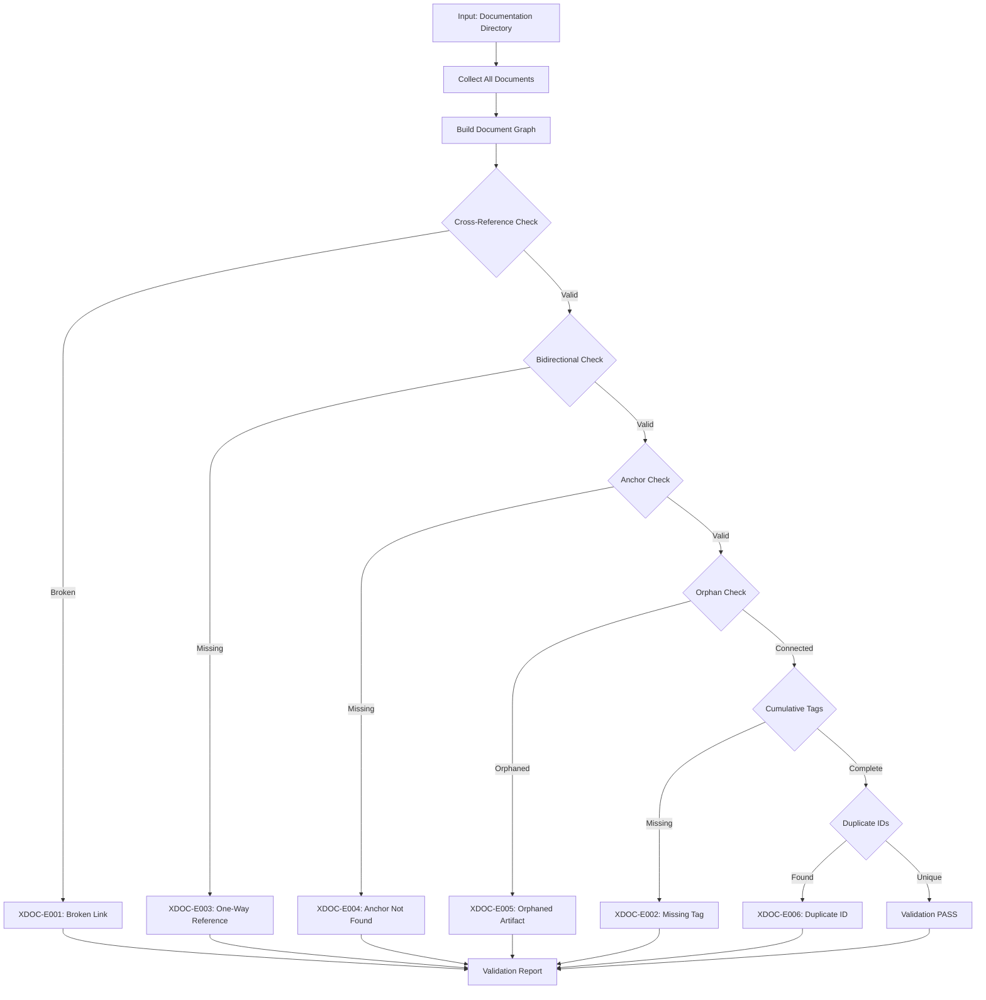

# doc-validator

Cross-document validation for SDD framework compliance. For single-document validation, use the dedicated layer validators.

## Purpose

Validates relationships and consistency ACROSS documents in the SDD framework.

**Core Functions**:
- Identifies broken cross-references between documents
- Detects orphaned artifacts (documents with no upstream references)
- Validates bidirectional link consistency
- Checks cumulative tagging hierarchy across layers
- Detects duplicate IDs across documents
- Validates traceability matrix completeness
- Monitors project-wide consistency

**This Skill Does NOT**:
- Validate single document structure (use `{TYPE}_VALIDATION_RULES.md` in each artifact directory)
- Validate single document metadata (use `{TYPE}_VALIDATION_RULES.md` in each artifact directory)
- Validate single document content (use `{TYPE}_VALIDATION_RULES.md` in each artifact directory)

**Dedicated Layer Validators**:
| Layer | Artifact | Validation Rules File |
|-------|----------|----------------------|
| 1 | BRD | `ai_dev_flow/BRD/BRD_VALIDATION_RULES.md` |
| 2 | PRD | `ai_dev_flow/PRD/PRD_VALIDATION_RULES.md` |
| 3 | EARS | `ai_dev_flow/EARS/EARS_VALIDATION_RULES.md` |
| 4 | BDD | `ai_dev_flow/BDD/BDD_VALIDATION_RULES.md` |
| 5 | ADR | `ai_dev_flow/ADR/ADR_VALIDATION_RULES.md` |
| 6 | SYS | `ai_dev_flow/SYS/SYS_VALIDATION_RULES.md` |
| 7 | REQ | `ai_dev_flow/REQ/REQ_VALIDATION_RULES.md` |
| 8 | IMPL | `ai_dev_flow/IMPL/IMPL_VALIDATION_RULES.md` |
| 9 | CTR | `ai_dev_flow/CTR/CTR_VALIDATION_RULES.md` |
| 10 | SPEC | `ai_dev_flow/10_SPEC/SPEC_VALIDATION_RULES.md` |
| 11 | TASKS | `ai_dev_flow/11_TASKS/TASKS_VALIDATION_RULES.md` |

**ID Format Validation**: For unified ID format validation (4-segment element IDs), use `doc-naming` skill.

**Reference**: [ID_NAMING_STANDARDS.md]({project_root}/ai_dev_flow/ID_NAMING_STANDARDS.md)

**Complexity**: Medium (cross-reference analysis across multiple documents)

**Resource Requirements**:
- CPU: Moderate (file parsing, graph traversal)
- Memory: 200-500MB for 100-200 documents
- Disk: Minimal (read-only validation)
- Network: None (local file operations only)

**Failure Modes**:
- Broken cross-reference: Reports links to non-existent documents
- Missing bidirectional link: Reports one-way references
- Orphaned artifact: Reports documents with no upstream connections
- Duplicate ID: Reports ID conflicts across documents
- Traceability gap: Reports missing required upstream tags

---

## When to Use This Skill

**Use doc-validator when**:
- Validating relationships BETWEEN documents
- Checking project-wide traceability
- Detecting orphaned artifacts
- Validating bidirectional link consistency
- Checking cumulative tagging across layers
- Detecting duplicate IDs across documents
- Before major releases (project-wide validation)

**Do NOT use doc-validator when**:
- Validating a single document's structure (use `{TYPE}_VALIDATION_RULES.md`)
- Validating a single document's metadata (use `{TYPE}_VALIDATION_RULES.md`)
- Validating a single document's content (use `{TYPE}_VALIDATION_RULES.md`)
- Validating ID format compliance (use `doc-naming` skill)
- For detailed traceability analysis (use `trace-check` skill)

---

## Skill Inputs

| Input | Type | Description | Example/Default |
|-------|------|-------------|-----------------|
| docs_path | Required | Path to documentation directory | `{project_root}/docs/` |
| scope | Optional | Validation scope | `"cross-document"` (default), `"traceability"`, `"full"` |
| strictness | Optional | Validation strictness level | `"strict"` (default), `"permissive"` |
| report_format | Optional | Output report format | `"markdown"` (default), `"json"`, `"text"` |

**Scopes**:
- `cross-document`: Links, references, bidirectional consistency
- `traceability`: Cumulative tags, upstream/downstream validation
- `full`: All cross-document validations

---

## Cross-Document Validators

### [IMPLEMENTED] Validation Scripts

| Category | Script | Description | Error Codes |
|----------|--------|-------------|-------------|
| LINKS | `validate_links.py` | Markdown link resolution | XDOC-E001, XDOC-E004 |
| CROSS-REF | `validate_cross_document.py` | Cross-reference validation | XDOC-E001, XDOC-E003 |
| SECTION | `validate_section_count.py` | Section file count vs metadata | SEC-E001, SEC-E002, SEC-E003, SEC-W001 |
| DIAGRAM | `validate_diagram_consistency.py` | Mermaid diagrams match prose | DIAG-E001, DIAG-E002, DIAG-W001, DIAG-W002 |
| TERM | `validate_terminology.py` | Terminology/acronym consistency | TERM-E001, TERM-E002, TERM-W001, TERM-W002 |
| COUNT | `validate_counts.py` | Stated counts match itemized totals | COUNT-E001, COUNT-W001 |
| FWDREF | `validate_forward_references.py` | Prevent upstream to downstream ID refs | FWDREF-E001, FWDREF-E002, FWDREF-W001 |
| TAGS | `validate_tags_against_docs.py` | Cumulative tag compliance | XDOC-E002 |
| IDS | `validate_requirement_ids.py` | Duplicate ID detection | XDOC-E006 |
| MATRIX | `validate_traceability_matrix.py` | Matrix validation | XDOC-W001 |

**Auto-Fix Support**: SECTION, TERM, COUNT validators support `--auto-fix` flag.

**Reference**: See [VALIDATION_STANDARDS.md]({project_root}/ai_dev_flow/VALIDATION_STANDARDS.md) for complete error code registry.

### [IMPLEMENTED] Support Scripts

| Script | Purpose | Status |
|--------|---------|--------|
| `validate_all.py` | Unified orchestrator for all validators | [IMPLEMENTED] |
| `validate_cross_document.py` | Cross-reference validation | [IMPLEMENTED] |
| `validate_links.py` | Markdown link resolution | [IMPLEMENTED] |
| `validate_tags_against_docs.py` | Cumulative tag compliance | [IMPLEMENTED] |
| `validate_traceability_matrix.py` | Matrix validation | [IMPLEMENTED] |
| `error_codes.py` | Standardized error code registry | [IMPLEMENTED] |

---

## Validation Workflow



---

## Error Codes Reference

### Cross-Document Errors (XDOC)

| Code | Message | Severity | Fix |
|------|---------|----------|-----|
| XDOC-E001 | Referenced ID/file not found | ERROR | Verify target document exists |
| XDOC-E002 | Missing cumulative tag | ERROR | Add required upstream tag |
| XDOC-E003 | Bidirectional link missing | ERROR | Add reverse reference |
| XDOC-E004 | Anchor not found in target | ERROR | Fix anchor reference |
| XDOC-E005 | Orphaned artifact | ERROR | Add upstream reference |
| XDOC-E006 | Duplicate ID detected | ERROR | Use unique IDs across project |
| XDOC-W001 | Weak traceability | WARNING | Add direct links |
| XDOC-W002 | Unused artifact | WARNING | Consider removal or linking |

### Section Consistency Errors (SEC)

| Code | Message | Severity | Fix |
|------|---------|----------|-----|
| SEC-E001 | Section count mismatch | ERROR | Update metadata or add sections |
| SEC-E002 | Missing referenced section | ERROR | Create referenced section file |
| SEC-E003 | Section ordering invalid | ERROR | Fix section numbering |
| SEC-W001 | Empty section detected | WARNING | Add content or remove section |

### Diagram Consistency Errors (DIAG)

| Code | Message | Severity | Fix |
|------|---------|----------|-----|
| DIAG-E001 | Diagram references missing entity | ERROR | Add entity to prose |
| DIAG-E002 | Diagram syntax error | ERROR | Fix Mermaid syntax |
| DIAG-W001 | Diagram outdated vs prose | WARNING | Update diagram |
| DIAG-W002 | Prose entity missing from diagram | WARNING | Add to diagram |

### Terminology Errors (TERM)

| Code | Message | Severity | Fix |
|------|---------|----------|-----|
| TERM-E001 | Undefined term used | ERROR | Add to glossary |
| TERM-E002 | Conflicting term definitions | ERROR | Standardize definition |
| TERM-W001 | Inconsistent term usage | WARNING | Use canonical form |
| TERM-W002 | Acronym without expansion | WARNING | Add first-use expansion |

### Count Consistency Errors (COUNT)

| Code | Message | Severity | Fix |
|------|---------|----------|-----|
| COUNT-E001 | Stated count differs from actual | ERROR | Update count or items |
| COUNT-W001 | Count format non-standard | WARNING | Use standard count format |

### Forward Reference Errors (FWDREF)

| Code | Message | Severity | Fix |
|------|---------|----------|-----|
| FWDREF-E001 | Upstream references downstream ID | ERROR | Remove forward reference |
| FWDREF-E002 | Circular reference detected | ERROR | Break reference cycle |
| FWDREF-W001 | Implicit forward reference | WARNING | Make explicit or remove |

---

## Cumulative Tag Validation

Each layer must include ALL upstream tags per the SDD hierarchy:

| Layer | Artifact | Required Upstream Tags |
|-------|----------|------------------------|
| 1 | BRD | None (top level) |
| 2 | PRD | @brd |
| 3 | EARS | @brd, @prd |
| 4 | BDD | @brd, @prd, @ears |
| 5 | ADR | @brd, @prd, @ears, @bdd |
| 6 | SYS | @brd through @adr (5 tags) |
| 7 | REQ | @brd through @sys (6 tags) |
| 8 | IMPL | @brd through @req (7 tags) |
| 9 | CTR | @brd through @req (7 tags) |
| 10 | SPEC | @brd through @req (7 tags) |
| 11 | TASKS | @brd through @spec (8 tags) |

**Validation Script**: `validate_tags_against_docs.py`

---

## Quality Gates

### Severity Levels

| Level | Code | Exit Code | Blocks Commit | Description |
|-------|------|-----------|---------------|-------------|
| ERROR | E | 2 | Yes | Critical issue, must fix |
| WARNING | W | 1 | --strict only | Should fix |
| INFO | I | 0 | No | Suggestion |

### Project-Wide Gates

| Gate | Threshold | Measurement |
|------|-----------|-------------|
| Zero Cross-Ref Errors | 0 | Count of XDOC-E level issues |
| Orphan Limit | 0 | Count of orphaned artifacts |
| Bidirectional Compliance | 100% | Links with reverse references |
| Cumulative Tag Compliance | 100% | Documents with complete upstream tags |
| Duplicate ID Count | 0 | Duplicate IDs across project |

---

## Integration Points

### With Layer Validators

- Single-document validation delegated to `doc-{type}-validator` skills
- Cross-document validation runs after layer validators pass
- Combined quality reports

### With doc-flow

- Invoked after artifact generation for cross-document checks
- Blocks workflow on cross-reference errors
- Provides link fix suggestions

### With trace-check

- Complementary validation (cross-refs vs. detailed traceability)
- Shared cumulative tag validation logic
- Combined traceability reports

### With code-review

- Post-commit cross-document validation
- Quality gate enforcement

---

## Usage Examples

### Validate Cross-References

```bash
python ai_dev_flow/scripts/validate_cross_document.py docs/ --strict
```

### Validate All Links

```bash
python ai_dev_flow/scripts/validate_links.py docs/
```

### Validate Cumulative Tags

```bash
python ai_dev_flow/scripts/validate_tags_against_docs.py \
  --source docs/ \
  --validate-cumulative \
  --strict
```

### Detect Duplicate IDs

```bash
python ai_dev_flow/scripts/validate_requirement_ids.py docs/ --check-duplicates
```

### Full Cross-Document Validation

```bash
python ai_dev_flow/scripts/validate_all.py docs/ --scope cross-document
```

---

## Validation Report Format

```
=== Cross-Document Validation Report ===

Scope: docs/
Status: FAILED

Cross-Reference Errors (3):
- [XDOC-E001] REQ-02_payments.md references non-existent SPEC-05_gateway.yaml
  → Create target document or fix reference

- [XDOC-E003] ADR-03_caching.md linked from SYS-01 but no reverse link
  → Add @sys reference to ADR-03

- [XDOC-E005] IMPL-04_batch.md has no upstream references
  → Add @req tag to connect to requirements

Cumulative Tag Warnings (2):
- [XDOC-E002] TASKS-02 missing required @adr tag
  → Add @adr: ADR-NN to traceability section

- [XDOC-E002] TASKS-01 missing required @spec tag
  → Add @spec: SPEC-NN to traceability section

Summary:
- Documents analyzed: 45
- Cross-reference errors: 3
- Orphaned artifacts: 1
- Bidirectional compliance: 94% (32/34)
- Cumulative tag compliance: 96% (43/45)
```

---

## Script Reference

### Cross-Document Validation Scripts (Location: `ai_dev_flow/scripts/`)

| Script | Purpose | Usage |
|--------|---------|-------|
| `validate_all.py` | Unified orchestrator | `python validate_all.py <dir> --scope cross-document` |
| `validate_cross_document.py` | Cross-references | `python validate_cross_document.py <dir>` |
| `validate_links.py` | Link resolution | `python validate_links.py <dir>` |
| `validate_tags_against_docs.py` | Cumulative tags | `python validate_tags_against_docs.py <dir>` |
| `validate_traceability_matrix.py` | Matrix validation | `python validate_traceability_matrix.py <dir>` |
| `validate_requirement_ids.py` | Duplicate IDs | `python validate_requirement_ids.py <dir>` |
| `validate_section_count.py` | Section consistency | `python validate_section_count.py <dir>` |
| `validate_diagram_consistency.py` | Diagram vs prose | `python validate_diagram_consistency.py <dir>` |
| `validate_terminology.py` | Term consistency | `python validate_terminology.py <dir>` |
| `validate_counts.py` | Count consistency | `python validate_counts.py <dir>` |
| `validate_forward_references.py` | Forward refs | `python validate_forward_references.py <dir>` |
| `error_codes.py` | Error code registry | (library - import in validators) |

---

## Version History

| Version | Date | Changes | Author |
|---------|------|---------|--------|
| 3.2.0 | 2026-02-08 | Added YAML frontmatter version/last_updated fields; standardized Version History format | System |
| 3.1.0 | 2025-12-29 | Updated layer validator references to `{TYPE}_VALIDATION_RULES.md` files; added doc-naming skill reference | System |
| 3.0.0 | 2025-12-20 | Refactored to cross-document validation only; removed single-document validation | System |
| 2.0.0 | 2025-12-19 | Complete overhaul; restructured following trace-check pattern; standardized error codes | System |
| 1.0.0 | 2025-11-01 | Initial release | System |
