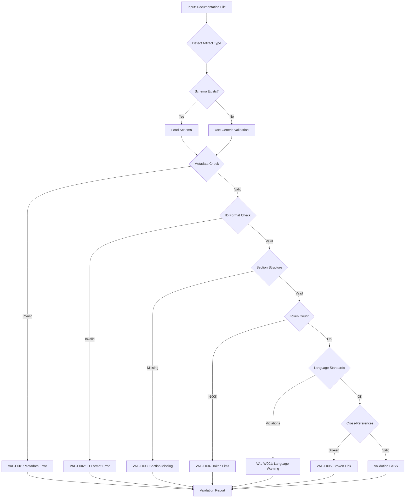

# doc-validator

## Purpose

Automated validation of documentation standards for SDD framework compliance.

**Core Functions**:
- Validates document structure against artifact-specific schemas
- Enforces ID format compliance (unified `TYPE.NN.TT.SS` element format)
- Checks YAML frontmatter metadata requirements
- Validates cumulative tagging hierarchy per layer
- Detects language standard violations (objective, factual language)
- Monitors token count limits (50K standard, 100K max)
- Identifies broken cross-references and links
- Detects duplicate IDs and content

**SDD Layer Coverage** (12 layers):
```
Layer 1: BRD → Layer 2: PRD → Layer 3: EARS →
Layer 4: BDD → Layer 5: ADR → Layer 6: SYS →
Layer 7: REQ → Layer 8: IMPL → Layer 9: CTR →
Layer 10: SPEC → Layer 11: TASKS → Layer 12: IPLAN
```

**Reference**: [ID_NAMING_STANDARDS.md]({project_root}/ai_dev_flow/ID_NAMING_STANDARDS.md)

**Complexity**: Medium (schema validation + cross-reference analysis)

**Resource Requirements**:
- CPU: Moderate (file parsing, regex matching)
- Memory: 100-500MB for 100-200 documents
- Disk: Minimal (read-only validation)
- Network: None (local file operations only)

**Failure Modes**:
- Invalid ID format: Reports non-compliant document/element IDs
- Missing metadata: Reports required YAML frontmatter fields
- Broken links: Reports file paths that do not resolve
- Schema violations: Reports missing required sections
- Token limit exceeded: Reports files requiring split

---

## When to Use This Skill

**Use doc-validator when**:
- Before committing changes to documentation
- After creating new artifacts (BRD, PRD, SPEC, etc.)
- After updating existing artifacts
- During periodic audits (weekly/sprint/release)
- Validating document structure against templates
- Detecting ID format violations
- Verifying metadata completeness
- Checking language standards compliance

**Do NOT use doc-validator when**:
- Validating traceability (use trace-check skill instead)
- Validating code implementation
- For non-SDD documentation projects
- During active editing sessions (wait until stable state)

---

## Skill Inputs

| Input | Type | Description | Example/Default |
|-------|------|-------------|-----------------|
| docs_path | Required | Path to documentation directory | `{project_root}/docs/` |
| artifact_type | Optional | Specific artifact type to validate | `"REQ"`, `"SPEC"`, or `"all"` (default) |
| strictness | Optional | Validation strictness level | `"strict"` (default), `"permissive"` |
| report_format | Optional | Output report format | `"markdown"` (default), `"json"`, `"text"` |
| auto_fix | Optional | Apply automatic fixes | `true` or `false` (default) |

**Strictness Levels**:
- `permissive`: Warnings only, validation continues on errors
- `strict`: Fails on errors, reports warnings

---

## Implementation Status

### [IMPLEMENTED] Validators Ready for Use

| Layer | Artifact | Script | Schema | Status |
|-------|----------|--------|--------|--------|
| 1 | BRD | `validate_brd_template.sh` | `BRD_SCHEMA.yaml` | [IMPLEMENTED] |
| 2 | PRD | `validate_prd.py` | `PRD_SCHEMA.yaml` | [IMPLEMENTED] |
| 3 | EARS | `validate_ears.py` | `EARS_SCHEMA.yaml` | [IMPLEMENTED] |
| 4 | BDD | `validate_bdd.py` | `BDD_SCHEMA.yaml` | [IMPLEMENTED] |
| 5 | ADR | `validate_adr.py` | `ADR_SCHEMA.yaml` | [IMPLEMENTED] |
| 6 | SYS | `validate_sys.py` | `SYS_SCHEMA.yaml` | [IMPLEMENTED] |
| 7 | REQ | `validate_req_template.sh` | `REQ_SCHEMA.yaml` | [IMPLEMENTED] |
| 8 | IMPL | `validate_impl.sh` | `IMPL_SCHEMA.yaml` | [IMPLEMENTED] |
| 9 | CTR | `validate_ctr.sh` | `CTR_SCHEMA.yaml` | [IMPLEMENTED] |
| 10 | SPEC | `validate_spec.py` | `SPEC_SCHEMA.yaml` | [IMPLEMENTED] |
| 11 | TASKS | `validate_tasks.sh` | `TASKS_SCHEMA.yaml` | [IMPLEMENTED] |
| 12 | IPLAN | `validate_iplan.sh` | `IPLAN_SCHEMA.yaml` | [IMPLEMENTED] |
| N/A | ICON | `validate_icon.sh` | N/A | [IMPLEMENTED] |

### [IMPLEMENTED] Support Scripts

| Script | Purpose | Status |
|--------|---------|--------|
| `validate_all.py` | Unified orchestrator for all validators | [IMPLEMENTED] |
| `validate_artifact.py` | Unified validator with auto-detection | [IMPLEMENTED] |
| `validate_cross_document.py` | Cross-reference validation | [IMPLEMENTED] |
| `validate_links.py` | Markdown link resolution | [IMPLEMENTED] |
| `validate_requirement_ids.py` | REQ ID format validation | [IMPLEMENTED] |
| `validate_tags_against_docs.py` | Tag taxonomy compliance | [IMPLEMENTED] |
| `validate_traceability_matrix.py` | Matrix validation | [IMPLEMENTED] |
| `validate_iplan_naming.py` | IPLAN naming convention | [IMPLEMENTED] |
| `error_codes.py` | Standardized error code registry | [IMPLEMENTED] |

---

## Diagram Standards

All diagrams in SDD artifacts MUST use Mermaid syntax. Text-based diagrams (ASCII art, box drawings) are prohibited per `ai_dev_flow/DIAGRAM_STANDARDS.md`.

**Validation includes**: Checking that artifacts use Mermaid diagrams instead of prohibited text-based formats.

## Validation Workflow



---

## Error Codes Reference

### Standardized Error Code Format

**Pattern**: `{TYPE}-{SEVERITY}{NNN}`

| Component | Values | Description |
|-----------|--------|-------------|
| TYPE | VAL, BRD, PRD, EARS, BDD, ADR, SYS, REQ, IMPL, CTR, SPEC, TASKS, IPLAN, XDOC | Artifact or validation type |
| SEVERITY | E (Error), W (Warning), I (Info) | Severity level |
| NNN | 001-999 | Sequential number |

### General Validation Errors (VAL)

| Code | Message | Severity | Fix |
|------|---------|----------|-----|
| VAL-E001 | Missing required metadata field | ERROR | Add field to YAML frontmatter |
| VAL-E002 | Invalid ID format | ERROR | Use `TYPE.NN.TT.SS` format |
| VAL-E003 | Missing required section | ERROR | Add section per template |
| VAL-E004 | Token count exceeds 100K | ERROR | Split at logical boundaries |
| VAL-E005 | Broken cross-reference link | ERROR | Fix file path or anchor |
| VAL-E006 | Duplicate ID detected | ERROR | Use unique sequential IDs |
| VAL-E007 | Invalid YAML syntax | ERROR | Fix YAML formatting |
| VAL-W001 | Subjective language detected | WARNING | Use objective language |
| VAL-W002 | Token count >50K | WARNING | Consider splitting |
| VAL-W003 | Missing optional section | WARNING | Add section if applicable |
| VAL-I001 | Token count >10K (Gemini) | INFO | Use file read tool |
| VAL-I002 | Naming suggestion | INFO | Consider improvement |

### Cross-Document Errors (XDOC)

| Code | Message | Severity | Fix |
|------|---------|----------|-----|
| XDOC-E001 | Referenced ID not found | ERROR | Verify upstream document exists |
| XDOC-E002 | Missing cumulative tag | ERROR | Add required upstream tag |
| XDOC-E003 | Bidirectional link missing | ERROR | Add reverse reference |
| XDOC-E004 | Anchor not found in target | ERROR | Fix anchor reference |
| XDOC-E005 | Orphaned artifact | ERROR | Add upstream reference |
| XDOC-W001 | Weak traceability | WARNING | Add direct links |

---

## Validation Capabilities

### 1. Token Count Validation [IMPLEMENTED]

**Tool-Specific Limits**:
| Tool | Standard | Maximum | Action |
|------|----------|---------|--------|
| Claude Code | 50,000 tokens | 100,000 tokens | Split at 100K |
| Gemini CLI | 10,000 tokens | No limit | Use file read tool |
| GitHub Copilot | 30,000 bytes | 60,000 bytes | Create summary |

**Validation Script**: `validate_artifact.py` (token counting via tiktoken)

### 2. ID Format Validation [IMPLEMENTED]

**Document ID Format**: `TYPE-NNN_{slug}.md`
- Example: `REQ-01_authentication.md`, `SPEC-02_api_contract.yaml`

**Element ID Format**: `TYPE.NN.TT.SS` (unified 4-segment)
- TYPE: Document type (BRD, PRD, REQ, etc.)
- NN: Document number (2+ digits)
- TT: Element type code (01-31)
- SS: Sequential within element type

**Element Type Codes**:
| Code | Type | Code | Type |
|------|------|------|------|
| 01 | Functional Requirement | 09 | User Story |
| 02 | Quality Attribute | 10 | Decision |
| 03 | Constraint | 11 | Implementation Note |
| 04 | Assumption | 12 | Verification Method |
| 05 | Dependency | 13 | Configuration |
| 06 | Acceptance Criteria | 14 | Error Handling |
| 07 | Risk | 15 | Feature |
| 08 | Metric | 16 | Business Rule |

**Reference**: [ID_NAMING_STANDARDS.md]({project_root}/ai_dev_flow/ID_NAMING_STANDARDS.md)

### 3. Metadata Validation [IMPLEMENTED]

**Required YAML Frontmatter**:
```yaml
---
title: "TYPE-NNN: Document Title"
tags:
  - artifact-type-tag
  - layer-N-artifact
custom_fields:
  artifact_type: TYPE
  layer: N
  architecture_approaches: [ai-agent-based, traditional-8layer]
  priority: primary|fallback|shared
  development_status: active|draft|deprecated
---
```

**Validation Script**: `validate_artifact.py`

### 4. Section Structure Validation [IMPLEMENTED]

Each artifact type has required sections defined in its schema:

**Example (REQ - 12 sections)**:
1. Document Control
2. Functional Requirements
3. Interface Specifications
4. Data Schemas
5. Error Handling
6. Configuration Parameters
7. Quality Attributes
8. Implementation Guidance
9. Acceptance Criteria
10. Verification Methods
11. Assumptions & Constraints
12. Traceability Matrix

**Validation Scripts**: `validate_brd_template.sh`, `validate_req_template.sh`, etc.

### 5. Language Standards Validation [IMPLEMENTED]

**Objective Language Required**:
- No subjective qualifiers (amazing, powerful, efficient, easy)
- No promotional content
- No time estimates or performance claims
- Factual, imperative language

**Validation Script**: Pattern matching in `validate_artifact.py`

### 6. Cross-Reference Validation [IMPLEMENTED]

**Link Format**: `[ID](../TYPE/TYPE-NNN_file.md#anchor)`

**Validation Checks**:
- File path resolves
- Anchor exists in target file
- Bidirectional consistency

**Validation Script**: `validate_links.py`, `validate_cross_document.py`

### 7. Cumulative Tag Validation [IMPLEMENTED]

Each layer must include ALL upstream tags:

| Layer | Artifact | Required Tags |
|-------|----------|---------------|
| 1 | BRD | None (top level) |
| 2 | PRD | @brd |
| 3 | EARS | @brd, @prd |
| 4 | BDD | @brd, @prd, @ears |
| 5 | ADR | @brd, @prd, @ears, @bdd |
| 6 | SYS | @brd through @adr |
| 7 | REQ | @brd through @sys |
| ... | ... | Cumulative |

**Validation Script**: `validate_tags_against_docs.py`

### 8. PRD Upstream Source Verification [PLANNED]

**Purpose**: Validate PRD documents correctly reference sectioned BRD input.

**Validation Checks**:
- Verify @brd tag references valid BRD document
- If BRD is sectioned (folder exists), verify PRD references entire BRD (not individual sections)
- Warn if PRD appears to reference only subset of sectioned BRD

**Validation Script**: `validate_prd_upstream.py` [PLANNED]

**Error Codes**:
| Code | Message | Severity | Fix |
|------|---------|----------|-----|
| PRD-W010 | Sectioned BRD detected, verify complete read | WARNING | Confirm all sections read |
| PRD-E010 | Missing BRD upstream reference | ERROR | Add @brd tag |

### 9. Duplicate Detection [IMPLEMENTED]

**Checks**:
- Duplicate element IDs within document
- Duplicate document IDs across project
- Near-duplicate content (>80% similarity)

**Validation Script**: `validate_requirement_ids.py`

---

## Quality Gates

### Severity Levels

| Level | Code | Exit Code | Blocks Commit | Description |
|-------|------|-----------|---------------|-------------|
| ERROR | E | 2 | Yes | Critical issue, must fix |
| WARNING | W | 1 | --strict only | Should fix |
| INFO | I | 0 | No | Suggestion |

### Per-Document Gates

| Gate | Threshold | Measurement |
|------|-----------|-------------|
| Zero Errors | 0 | Count of E-level issues |
| Warning Limit | ≤5 | Count of W-level issues |
| Token Limit | ≤100K | Token count |

### Project-Wide Gates

| Gate | Threshold | Measurement |
|------|-----------|-------------|
| Coverage | ≥90% | Documents passing validation |
| ID Compliance | 100% | Documents with valid IDs |
| Metadata Compliance | 100% | Documents with valid frontmatter |

---

## Integration Points

### With doc-flow
- Invoked automatically after artifact generation
- Blocks workflow on critical errors
- Provides inline fix suggestions

### With trace-check
- Complementary validation (structure vs. traceability)
- Shared cumulative tag validation logic
- Combined quality reports

### With code-review
- Post-commit documentation validation
- Quality gate enforcement

### With test-automation
- BDD feature file validation
- Test traceability verification

---

## Usage Examples

### Validate Single Document

```bash
# Using implemented validator
./ai_dev_flow/scripts/validate_brd_template.sh docs/BRD/BRD-01_platform.md

# Using unified validator
python ai_dev_flow/scripts/validate_artifact.py docs/REQ/REQ-01_auth.md
```

### Validate All Documents of Type

```bash
# Validate all REQ documents
for f in docs/REQ/REQ-*.md; do
  ./ai_dev_flow/scripts/validate_req_template.sh "$f"
done
```

### Validate Cross-References

```bash
python ai_dev_flow/scripts/validate_cross_document.py docs/ --strict
```

### Validate Cumulative Tags

```bash
python ai_dev_flow/scripts/validate_tags_against_docs.py \
  --source docs/ \
  --validate-cumulative \
  --strict
```

---

## Validation Report Format

```
=== Documentation Validation Report ===

File: docs/REQ/REQ-01_requirements.md
Status: FAILED

Errors (2):
- [VAL-E002] Invalid element ID "REQ-USER-LOGIN-1" at line 156
  → Expected format: REQ.01.01.01 (TYPE.NN.TT.SS)

- [VAL-E003] Missing required section "Quality Attributes"
  → Add section per REQ template

Warnings (1):
- [VAL-W001] Subjective language "easy to use" at line 89
  → Replace with objective description

Info (1):
- [VAL-I001] Token count 12,450 (Gemini: use file read tool)

Summary:
- Total elements: 45
- ID compliance: 98% (44/45)
- Section compliance: 92% (11/12)
```

---

## REF Document Rules (Minimal Validation)

Reference documents (`{TYPE}-REF-NNN`) use minimal, non-blocking validation:

**Required (Blocking)**:
| Check | Pattern | Severity |
|-------|---------|----------|
| H1 ID Match | `^#\s[A-Z]{2,5}-REF-\d{3}:.+` | ERROR |
| Document Control | Section present | ERROR |
| Revision History | Section present | ERROR |
| Introduction | Section present | ERROR |

**Exempted (Not Checked)**:
| Check | Reason |
|-------|--------|
| Cumulative Tags | REF docs don't participate in traceability |
| Full Traceability | Optional for REF docs |
| Quality Gates | Non-blocking validation only |
| Layer Requirements | REF has no layer assignment |

---

## Script Reference

### Artifact Validators (Location: `ai_dev_flow/scripts/`)

| Script | Artifact | Usage |
|--------|----------|-------|
| `validate_brd_template.sh` | BRD | `./validate_brd_template.sh <file>` |
| `validate_prd.py` | PRD | `python validate_prd.py <file_or_dir>` |
| `validate_ears.py` | EARS | `python validate_ears.py <file>` |
| `validate_bdd.py` | BDD | `python validate_bdd.py <file_or_dir>` |
| `validate_adr.py` | ADR | `python validate_adr.py <file_or_dir>` |
| `validate_sys.py` | SYS | `python validate_sys.py <file_or_dir>` |
| `validate_req_template.sh` | REQ | `./validate_req_template.sh <file>` |
| `validate_impl.sh` | IMPL | `./validate_impl.sh <file>` |
| `validate_ctr.sh` | CTR | `./validate_ctr.sh <file>` |
| `validate_spec.py` | SPEC | `python validate_spec.py <file_or_dir>` |
| `validate_tasks.sh` | TASKS | `./validate_tasks.sh <file>` |
| `validate_iplan.sh` | IPLAN | `./validate_iplan.sh <file>` |
| `validate_icon.sh` | ICON | `./validate_icon.sh <file>` |

### Support Scripts (Location: `ai_dev_flow/scripts/`)

| Script | Purpose | Usage |
|--------|---------|-------|
| `validate_all.py` | Unified orchestrator | `python validate_all.py <dir> [--layer TYPE] [--all]` |
| `validate_artifact.py` | Unified validator | `python validate_artifact.py <file>` |
| `validate_cross_document.py` | Cross-references | `python validate_cross_document.py <dir>` |
| `validate_links.py` | Link resolution | `python validate_links.py <dir>` |
| `validate_requirement_ids.py` | ID format | `python validate_requirement_ids.py <dir>` |
| `validate_tags_against_docs.py` | Tag compliance | `python validate_tags_against_docs.py <dir>` |
| `error_codes.py` | Error code registry | (library - import in validators) |

---

## Version Information

**Version**: 2.0.0
**Last Updated**: 2025-12-19
**Created**: 2025-11-01
**Status**: Active

**Change Log**:
- 2.0.0 (2025-12-19): Complete overhaul
  - Restructured following trace-check pattern
  - Added [IMPLEMENTED]/[PLANNED] status markers
  - Standardized error codes (`{TYPE}-{SEVERITY}{NNN}`)
  - Updated ID format to unified `TYPE.NN.TT.SS`
  - Added clear implementation status section
  - Added script reference tables
  - Removed aspirational features without status markers
- 1.0.0 (2025-11-01): Initial release
