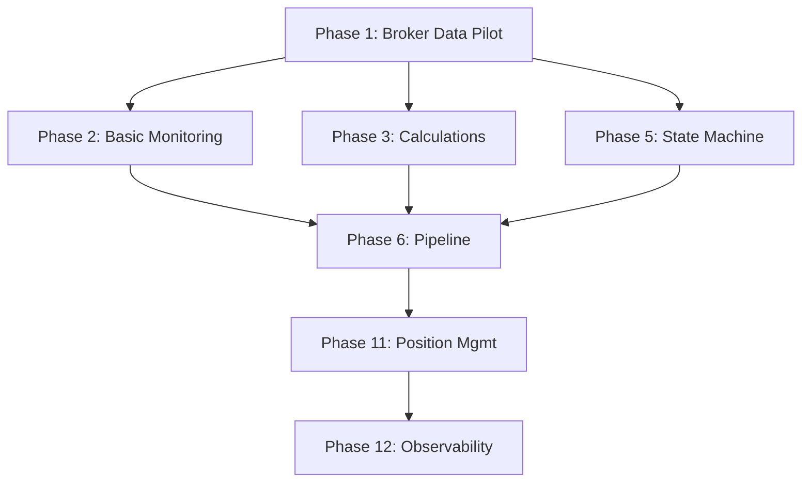

# generate_implementation_plan Skill

**Skill ID**: `generate_implementation_plan`
**Version**: 1.0
**Created**: 2025-11-02
**Purpose**: Generate IMPL (Implementation Plan) documents from BRD documents following SDD workflow standards

## Overview

This skill automates the creation of IMPL documents by analyzing BRD (Business Requirements Documents) and applying atomic phase decomposition principles. It follows the Specification-Driven Development workflow defined in `/opt/data/trading/docs_templates/ai_dev_flow/SPEC_DRIVEN_DEVELOPMENT_GUIDE.md`.

**Skill Position in Workflow**:
```
BRD → PRD → EARS → BDD → ADR → SYS → REQ → **IMPL** → CTR → SPEC → TASKS → Code
                                              ↑
                                         YOU ARE HERE
```

## When to Use This Skill

**Use this skill when**:
- Starting a new project with multiple BRD documents
- BRD document count ≥ 5 requiring phased implementation
- Project involves multiple teams or cross-functional coordination
- External dependencies require careful sequencing
- Stakeholders need visibility into project timeline and milestones

**Do NOT use this skill when**:
- Single BRD with < 2 weeks implementation (go directly REQ → SPEC)
- Single developer, single component change
- Low-risk bug fix or configuration change
- See [WHEN_TO_CREATE_IMPL.md](../../docs_templates/ai_dev_flow/WHEN_TO_CREATE_IMPL.md) for decision criteria

## Skill Inputs

**Required**:
- `brd_directory`: Path to directory containing BRD files (e.g., `/opt/data/trading/docs/BRD/`)
- `output_file`: Path for generated IMPL document (e.g., `/opt/data/trading/docs/BRD/BRD-000_implementation_plan.md`)

**Optional**:
- `force_phase_1_brd`: BRD ID to prioritize as Phase 1 (e.g., `BRD-009`)
- `max_phase_duration_weeks`: Maximum duration per phase (default: 4 weeks)
- `parallel_execution_threshold`: Minimum weeks saved to identify parallel opportunities (default: 2 weeks)

## Skill Workflow

### Step 1: Read BRD Documents

```bash
# Read all BRD files in directory
ls -1 ${brd_directory}/BRD-*.md | grep -v "BRD-000" | sort
```

For each BRD:
- Read complete file content
- Extract functional requirements (FR) count
- Extract non-functional requirements (NFR) count
- Identify complexity rating (Low/Medium/High)
- Note external dependencies mentioned

### Step 2: Analyze Dependencies

**Dependency Analysis Principles**:

1. **Data-First Strategy**: Data infrastructure before business logic
   - Broker connections → Market data → Strategy execution
   - Database schemas → Data pipelines → Analytics

2. **Read-Before-Write Separation**: Validation before enforcement
   - Risk validation logic → Risk enforcement logic
   - Monitoring setup → Alerting configuration

3. **Infrastructure-Before-Application**: Calculation engines before consumers
   - Greeks calculation library → Strategy agents using Greeks
   - ML model serving → Trading strategies using ML predictions

4. **Component Decomposition**: Split large BRDs by logical boundaries
   - State machine + Execution pipeline (separate concerns)
   - Regime classification + Strike selection (separate timing)
   - Validation + Enforcement (separate responsibilities)

**Dependency Matrix Creation**:

| BRD | Blocks BRD | Reason | Type |
|-----|------------|--------|------|
| BRD-009 (Broker) | BRD-003, BRD-004, BRD-005 | No market data = no trading logic | Critical Path |
| BRD-007 (Calculations) | BRD-003, BRD-005 | Greeks needed for strategies | Technical Dependency |
| BRD-002 (State Machine) | BRD-005 (Position Mgmt) | State tracking required | Logical Dependency |

### Step 3: Create Atomic Phases

**Atomicity Criteria**:
- Single clear purpose (one BRD or BRD sub-component)
- Independently deployable and testable
- ≤ 4 weeks duration per phase
- Clear exit criteria with measurable outcomes
- Minimal coupling to other phases (1-2 dependencies max)

**Phase Decomposition Rules**:

```
IF BRD duration > 4 weeks OR FR count > 20:
    Split BRD into sub-components by:
    - Functional boundaries (state vs execution, validation vs enforcement)
    - Technical layers (data vs logic, read vs write)
    - Deployment units (library vs service, agent vs MCP server)

ELSE:
    Keep BRD as single phase
```

**Phase Naming Convention**:
- Use descriptive names, not "Phase 1, 2, 3"
- Format: `[Primary Function] [Implementation Scope]`
- Examples: "Market Data Foundation", "Greeks & Pricing Engine", "Risk Validation Framework"

### Step 4: Sequence Phases by Dependencies

**Sequencing Algorithm**:

1. **Identify Critical Prerequisites**: Phases with zero dependencies → candidates for Phase 1
2. **Apply force_phase_1_brd** (if provided): Override to make specific BRD Phase 1
3. **Build Dependency Graph**: Create directed acyclic graph (DAG) of phase dependencies
4. **Calculate Critical Path**: Longest path through dependency graph
5. **Identify Parallel Opportunities**: Phases with independent dependencies run concurrently

**Critical Path Example**:
```
Phase 1 (Broker: 4 weeks) → Phase 3 (Calculations: 2 weeks) → Phase 6 (Pipeline: 2 weeks) → Phase 11 (Position Mgmt: 3 weeks) = 11 weeks critical path
```

**Parallel Execution Example**:
```
Phase 4 (Documentation: 1 week) runs in parallel with Phases 2-3 (saves 1 week)
Phase 7 (ML Regime: 3 weeks) runs in parallel with Phases 5-6 (saves 3 weeks)
```

### Step 5: Define Exit Criteria

**Exit Criteria Components** (for each phase):

1. **Deliverables Checklist**:
   - [ ] CTR documents created (if interface requirements)
   - [ ] SPEC documents created (all components)
   - [ ] TASKS documents created (AI code generation plans)
   - [ ] Code generated from TASKS
   - [ ] BDD tests passing (if applicable)

2. **Technical Validation**:
   - [ ] Performance targets met (latency, throughput)
   - [ ] Data quality thresholds validated (accuracy, completeness)
   - [ ] Integration tests passing
   - [ ] Security scanning clean

3. **Operational Readiness**:
   - [ ] Monitoring dashboards operational
   - [ ] Alerting configured and tested
   - [ ] Documentation complete
   - [ ] Runbooks created (if production component)

4. **Stakeholder Approval**:
   - [ ] Technical lead sign-off
   - [ ] Product owner acceptance
   - [ ] Go/No-Go decision recorded

**Mandatory Gate Example** (Phase 1 - Broker Data Pilot):
```markdown
### Phase 1 Exit Criteria (MANDATORY GATE)

**ALL criteria must be met before Phase 2 begins:**

- [ ] Connection Stability: 99.5%+ uptime during 4-week pilot
- [ ] Market Data Latency: <100ms (p95) sustained over 2 weeks
- [ ] Data Accuracy: 99.9%+ validated against backup sources
- [ ] Data Completeness: >99.9% for all subscribed symbols
- [ ] Paper Trading: 10+ successful test orders executed
- [ ] Position Reconciliation: 100% match with broker state
- [ ] Monitoring Operational: Dashboard displays real-time status
- [ ] Alerting Functional: Critical alerts trigger <1min from failure
- [ ] Zero Critical Issues: No critical data quality issues in final 2 weeks

**Gate Review**: Week 12 - Phase 1 Exit Gate Review → Phase 2 Go/No-Go Decision
```

### Step 6: Calculate Timeline and Resources

**Duration Estimation**:
- FR count: 0.5 days per functional requirement (average)
- NFR count: 0.3 days per non-functional requirement (average)
- Complexity multiplier: Low=1.0, Medium=1.3, High=1.7
- Integration overhead: +20% for phases with ≥3 dependencies
- Testing overhead: +15% for phases with BDD scenarios

**Formula**:
```
Phase Duration (days) =
    (FR_count × 0.5 + NFR_count × 0.3) × Complexity_Multiplier ×
    (1 + Integration_Overhead) × (1 + Testing_Overhead)

Phase Duration (weeks) = Ceiling(Phase Duration (days) ÷ 5)
```

**Resource Allocation**:
```
Developers = Ceiling(Phase Duration (weeks) ÷ Max_Phase_Duration_Weeks)
QA Engineers = Ceiling(Developers ÷ 3)
DevOps = 0.2 FTE (shared across all phases)
Technical Writer = 0.1 FTE (documentation phases only)
```

### Step 7: Generate IMPL Document

**Template**: Use `/opt/data/trading/docs_templates/ai_dev_flow/IMPL/IMPL-TEMPLATE.md`

**Document Structure**:

1. **Document Control** (Section 1):
   - IMPL ID: `IMPL-[sequence]` (e.g., IMPL-001)
   - Title: "[System Name] Implementation Plan"
   - Status: Draft
   - Related REQs: List all requirements satisfied
   - Deliverables: List all CTR/SPEC/TASKS documents to be created

2. **Part 1: Project Context and Strategy**:
   - Overview: System being implemented, purpose, scope summary
   - Business Objectives: Requirements satisfied table
   - Scope: In-scope/out-of-scope items, assumptions, constraints
   - Dependencies: Upstream (must complete first), External (outside IMPL)

3. **Part 2: Phased Implementation** (one section per phase):
   ```markdown
   ### Phase [N]: [Phase Name]

   | Attribute | Details |
   |-----------|---------|
   | **Purpose** | [What this phase accomplishes] |
   | **Owner** | [Team/Person] |
   | **Timeline** | [Start Date] → [End Date] ([Duration]) |
   | **Deliverables** | CTR-[N], SPEC-[N], TASKS-[N] |
   | **Dependencies** | Requires: [Prerequisites] | Blocks: [Downstream phases] |

   **Success Criteria**: [ ] Deliverables created [ ] [Key milestone]

   **Key Risks**: [Risk 1: Mitigation] | [Risk 2: Mitigation]
   ```

4. **Part 3: Project Management and Risk**:
   - Resource Allocation: Team assignments, effort estimates
   - Overall Timeline: Start/end dates, key milestones
   - Risk Register: Project management risks (not technical risks)
   - Communication Plan: Stakeholder updates, decision authority

5. **Part 4: Tracking and Completion**:
   - Deliverables Checklist: All CTR/SPEC/TASKS documents
   - Project Validation: Phase completion, stakeholder sign-off
   - Project Completion Criteria: When all phases complete
   - Sign-off: PM, Product Owner, Technical Lead approval

6. **Traceability**:
   - Upstream Sources: REQ/ADR/SYS documents
   - Downstream Artifacts: CTR/SPEC/TASKS deliverables
   - Related IMPL Plans: Dependencies, related, supersedes

**Mermaid Dependency Graph**:


**Requirements Mapping Table**:
```markdown
| Phase | BRD | BRD Sub-Component | FR Count | NFR Count | Complexity |
|-------|-----|-------------------|----------|-----------|------------|
| 1 | BRD-009 | Broker Integration Pilot | 26 | 25 | High |
| 2 | BRD-010 | Foundational Monitoring | 8 | 4 | Low-Medium |
| ... | ... | ... | ... | ... | ... |
```

### Step 8: Validate Generated IMPL

**Validation Checklist**:

- [ ] **Atomicity**: All phases ≤ 4 weeks duration
- [ ] **Dependencies**: No circular dependencies in phase graph
- [ ] **Critical Path**: Identified and documented
- [ ] **Parallel Opportunities**: Phases with no dependencies run concurrently
- [ ] **Exit Criteria**: All phases have measurable success criteria
- [ ] **Deliverables**: All phases list CTR/SPEC/TASKS outputs
- [ ] **Timeline**: Total project duration calculated with parallel execution
- [ ] **Resources**: Team allocations specified for each phase
- [ ] **Risks**: Project management risks identified with mitigations
- [ ] **Traceability**: All BRDs mapped to phases, all phases link to BRDs

**Automated Checks**:
```bash
# Check phase duration constraint
grep -A5 "^### Phase" ${output_file} | grep "Duration" | \
    awk -F'[()]' '{print $2}' | \
    awk '{if ($1 > 4) print "WARNING: Phase exceeds 4 weeks: " $0}'

# Check for circular dependencies
python /opt/data/trading/scripts/validation/validate_phase_dependencies.py ${output_file}

# Validate traceability links
python /opt/data/trading/scripts/validation/validate_traceability.py ${output_file}
```

## Example Usage

### Example 1: Options Trading System Implementation Plan

**Input**:
```
brd_directory: /opt/data/trading/docs/BRD/
output_file: /opt/data/trading/docs/BRD/BRD-000_implementation_plan.md
force_phase_1_brd: BRD-009
max_phase_duration_weeks: 4
```

**Output**: IMPL document with 12 atomic phases:
- Phase 1: Market Data Foundation (BRD-009: 4 weeks)
- Phase 2: Observability Foundation (BRD-010: 1 week)
- Phase 3: Greeks & Pricing Engine (BRD-007: 2 weeks)
- Phase 4: System Architecture Documentation (BRD-001: 1 week)
- Phase 5: Core State Machine (BRD-002 State: 2 weeks)
- Phase 6: Trade Execution Pipeline (BRD-002 Pipeline: 2 weeks)
- Phase 7: ML Regime Classification (BRD-003 Regime: 3 weeks)
- Phase 8: Dynamic Strike Selection (BRD-003 Strikes: 2 weeks)
- Phase 9: Risk Validation Framework (BRD-004 Validation: 3 weeks)
- Phase 10: Risk Enforcement Engine (BRD-004 Enforcement: 2 weeks)
- Phase 11: Position Management & Playbooks (BRD-005 + BRD-008: 3 weeks)
- Phase 12: Comprehensive Observability (BRD-011: 2 weeks)

**Total Timeline**: 27 weeks (48% reduction from sequential 52 weeks via parallelization)

### Example 2: User Requests Phase Reordering

**User Feedback**: "set Phase 5: Broker Data Pilot (4 weeks) as Phase 1"

**Skill Action**:
1. Identify BRD-009 (Broker Data Pilot) in phase list
2. Move to Phase 1 position
3. Recalculate all downstream dependencies
4. Update phase numbers (renumber all subsequent phases)
5. Update dependency graph to reflect new Phase 1
6. Regenerate timeline with new critical path
7. Update requirements mapping table

**Result**: BRD-009 becomes critical prerequisite Phase 1, all other phases shift accordingly

## Skill Constraints

**Prohibited Actions**:
- Do NOT include technical implementation details (belongs in SPEC, not IMPL)
- Do NOT include code examples or architecture diagrams (belongs in ADR/SPEC)
- Do NOT include test cases or BDD scenarios (belongs in BDD/TASKS)
- Do NOT use promotional language or subjective claims (objective tone only)

**IMPL Scope** (What IMPL Contains):
- WHO: Team assignments, resource allocation
- WHEN: Timeline, milestones, phase durations
- WHAT: Deliverables (CTR/SPEC/TASKS documents)
- WHY: Business objectives, requirements satisfied

**IMPL Exclusions** (What IMPL Does NOT Contain):
- HOW: Technical implementation (→ SPEC)
- CODE: Python code, algorithms (→ TASKS/Code)
- TESTS: BDD scenarios, unit tests (→ BDD/TASKS)
- ARCHITECTURE: System design, technology choices (→ ADR)

## Quality Gates

**Definition of Done** (for generated IMPL):

1. **Document Structure**:
   - [ ] Document Control section complete with:
     - Project metadata (name, version, date)
     - Owner and preparer information
     - Status tracking
   - [ ] Document Revision History table initialized
   - [ ] All 4 parts present (Context, Phases, Management, Tracking)
   - [ ] All phases follow template structure
   - [ ] Traceability section complete

2. **Phase Quality**:
   - [ ] Atomic phases (≤ 4 weeks each)
   - [ ] Clear exit criteria per phase
   - [ ] Deliverables specified (CTR/SPEC/TASKS)
   - [ ] Dependencies documented

3. **Project Management**:
   - [ ] Resource allocation table complete
   - [ ] Timeline with milestones
   - [ ] Risk register populated
   - [ ] Critical path identified

4. **Traceability**:
   - [ ] All BRDs mapped to phases
   - [ ] All phases link to upstream REQs
   - [ ] All deliverables listed (CTR/SPEC/TASKS)
   - [ ] No orphaned requirements

5. **Documentation Standards**:
   - [ ] Objective language (no promotional content)
   - [ ] Token limit < 10,000 per file
   - [ ] No Python code blocks
   - [ ] Mermaid diagrams for process flows

## Error Handling

**Common Errors and Resolutions**:

1. **Circular Dependency Detected**:
   - Error: Phase A depends on Phase B, Phase B depends on Phase A
   - Resolution: Refactor phases to break circular dependency (split into sub-components)

2. **Phase Duration Exceeds 4 Weeks**:
   - Error: Phase estimated at 6 weeks
   - Resolution: Split phase into smaller sub-components (e.g., BRD-002 → State Machine + Pipeline)

3. **No Clear Phase 1 Candidate**:
   - Error: All BRDs have dependencies on each other
   - Resolution: Identify data foundation (broker, database) as Phase 1, or request user input via `force_phase_1_brd`

4. **Missing BRD Information**:
   - Error: BRD file lacks FR/NFR counts or complexity rating
   - Resolution: Estimate based on document size (token count) and keyword analysis

5. **Timeline Exceeds Stakeholder Deadline**:
   - Error: Critical path = 30 weeks, deadline = 20 weeks
   - Resolution: Identify parallel execution opportunities, or flag as project risk

## Output Format

**Generated IMPL Document**:
- File: `/opt/data/trading/docs/BRD/BRD-000_implementation_plan.md`
- Version: 3.0 (or next version number)
- Date: Current date (YYYY-MM-DD)
- Token Count: < 50,000 tokens (Claude Code standard) or < 100,000 tokens maximum
- Note: For Gemini CLI users, use file read tool (not `@`) if exceeds 10,000 tokens

**Summary Report** (printed to console):
```
Implementation Plan Generated
=============================
Total BRDs Analyzed: 11
Atomic Phases Created: 12
Total Timeline: 27 weeks (52 weeks sequential, 48% reduction)
Critical Path: Phase 1 → 3 → 6 → 11 (11 weeks)
Parallel Opportunities: 3 identified (saving 25 weeks)

Phase Summary:
- Phase 1: Market Data Foundation (BRD-009: 4 weeks) [CRITICAL PREREQUISITE]
- Phase 2: Observability Foundation (BRD-010: 1 week)
- ... [remaining phases]

Validation Results:
✅ All phases ≤ 4 weeks
✅ No circular dependencies
✅ Exit criteria defined for all phases
✅ Traceability complete
✅ Token count: 8,742 tokens (within limit)

Next Steps:
1. Review generated IMPL: /opt/data/trading/docs/BRD/BRD-000_implementation_plan.md
2. Obtain stakeholder approval for phasing approach
3. Begin Phase 1: Market Data Foundation (Week 1)
```

## References

**SDD Workflow**:
- [SPEC_DRIVEN_DEVELOPMENT_GUIDE.md](../../docs_templates/ai_dev_flow/SPEC_DRIVEN_DEVELOPMENT_GUIDE.md) - Authoritative SDD workflow
- [index.md](../../docs_templates/ai_dev_flow/index.md) - Traceability flow diagram

**Templates**:
- [IMPL-TEMPLATE.md](../../docs_templates/ai_dev_flow/IMPL/IMPL-TEMPLATE.md) - IMPL document template
- [CTR-TEMPLATE.md](../../docs_templates/ai_dev_flow/CONTRACTS/CTR-TEMPLATE.md) - API contract template
- [SPEC-TEMPLATE.yaml](../../docs_templates/ai_dev_flow/SPEC/SPEC-TEMPLATE.yaml) - Technical specification template

**Decision Guides**:
- [WHEN_TO_CREATE_IMPL.md](../../docs_templates/ai_dev_flow/WHEN_TO_CREATE_IMPL.md) - IMPL creation criteria
- [ID_NAMING_STANDARDS.md](../../docs_templates/ai_dev_flow/ID_NAMING_STANDARDS.md) - Document ID conventions

**Validation**:
- [validate_traceability.py](../../scripts/validation/validate_traceability.py) - Traceability validation script
- [validate_phase_dependencies.py](../../scripts/validation/validate_phase_dependencies.py) - Dependency graph validation

---

**Skill Version**: 1.0
**Last Updated**: 2025-11-02
**Skill Type**: Document Generation
**Complexity**: High (multi-step workflow with dependency analysis)
