# mermaid-gen

## Purpose

The `mermaid-gen` skill provides AI assistants with expert guidance for creating syntactically correct Mermaid diagrams while avoiding common parsing errors that cause rendering failures. This skill focuses on diagram syntax correctness and best practices.

**Key Benefits**:
- **Error Prevention**: Avoid nested quotes, special character issues, and malformed syntax
- **Syntax Mastery**: Apply correct patterns for flowcharts, sequence diagrams, state machines, etc.
- **Quality Assurance**: Validate diagrams before rendering using proven templates
- **Troubleshooting**: Diagnose and fix parse errors systematically
- **Best Practices**: Follow standardized naming, styling, and structure conventions

## When to Use This Skill

**Use mermaid-gen when**:
- Creating new Mermaid diagrams (flowcharts, sequence diagrams, state machines, etc.)
- Fixing parse errors or rendering issues in existing diagrams
- Converting written descriptions into Mermaid syntax
- Validating diagram syntax before committing to documentation
- Debugging "Expecting X, got Y" parse errors
- Migrating diagrams from other formats to Mermaid
- Need best practice guidance for node naming, styling, subgraphs

**Do NOT use mermaid-gen when**:
- Creating simple tables or text-based lists (use markdown tables)
- Need diagram file management or SVG generation (use `charts-flow` skill instead)
- Creating data visualization charts (bar, pie, line - use charting libraries)
- Need Gantt charts or Git graphs (outside core focus)
- Diagram is already working perfectly (no changes needed)

**Relationship to charts-flow skill**:
- `charts-flow`: Manages diagram files, generates SVG, embeds in documents
- `mermaid-gen`: Ensures diagram syntax is correct before file creation
- **Use together**: `charts-flow` skill calls `mermaid-gen` for diagram generation

## Skill Inputs

### Required Inputs

| Input | Description | Example |
|-------|-------------|---------|
| **Diagram Type** | Type of Mermaid diagram | `flowchart`, `sequence`, `state`, `class` |
| **Diagram Purpose** | What the diagram represents | "Agent communication flow", "State machine transitions" |
| **Content Description** | Key elements and relationships | "3 agents, 1 database, request/response flow" |

### Optional Inputs

| Input | Description | Default |
|-------|-------------|---------|
| **Existing Code** | Current Mermaid code (if fixing) | None (creating new) |
| **Error Message** | Parse error from renderer | None |
| **Styling Preferences** | Color scheme, layout direction | Project defaults |
| **Naming Convention** | Node ID format | `camelCase` |

## Skill Workflow

Follow this 5-step process to create or fix Mermaid diagrams:

### Step 1: Understand Requirements
- Identify diagram type (flowchart, sequence, state, class, etc.)
- List all nodes/entities that need to be represented
- Identify relationships and connections
- Determine flow direction (TD, LR, etc.)
- Note any grouping needs (subgraphs)

### Step 2: Plan Node Structure
- Create meaningful node IDs (camelCase, no spaces)
- Keep display labels concise but descriptive
- Identify decision points (diamond shapes)
- Plan database/storage nodes (cylinder shapes)
- Determine which nodes need special shapes

### Step 3: Apply Syntax Rules (Critical)
- **Remove nested quotes** from all node labels
- **Wrap multi-line labels** (with `<br/>`) in double quotes
- **Keep edge labels simple** - no quotes unless necessary
- **Use ID/label syntax** for subgraphs with special characters
- **Separate node IDs from labels**: `NodeID[Display Label]`

### Step 4: Build Diagram with Template
- Start with appropriate template (flowchart, sequence, state)
- Add nodes with correct syntax
- Define relationships/edges with proper arrow types
- Group related nodes in subgraphs (if needed)
- Add styling directives AFTER all nodes defined
- Include comments (`%%`) for complex sections

### Step 5: Validate and Test
- Check for nested quotes in any labels
- Verify subgraph IDs match style references
- Confirm all node IDs are unique
- Test in Mermaid Live Editor (https://mermaid.live)
- Validate all relationships resolve correctly
- Ensure rendering succeeds without errors

**Error Recovery**: If parse error occurs, see "Troubleshooting Guide" section below.

## Common Mermaid Syntax Errors & Solutions

### 1. Quotes in Node Labels

**❌ WRONG - Nested quotes cause parse errors:**
```mermaid
User[User: "What is the status?"] --> System
Response["Message: "Success""] --> User
```

**✅ CORRECT - Remove inner quotes or escape properly:**
```mermaid
User[User: What is the status?] --> System
Response["Message: Success"] --> User
```

**Rule:** Never use nested quotes within node labels enclosed in `[]` or `()`. Either:
- Remove the inner quotes entirely
- Wrap the entire label in double quotes if using `<br/>` tags

### 2. Multi-line Nodes with Special Characters

**❌ WRONG - Decimals and special chars without quotes:**
```mermaid
Results[Top Results:<br/>1. system_arch.md (0.89)<br/>2. safety.yaml (0.84)]
```

**✅ CORRECT - Wrap in double quotes when using <br/> with numbers/decimals:**
```mermaid
Results["Top Results:<br/>1. system_arch.md (0.89)<br/>2. safety.yaml (0.84)"]
```

**Rule:** When node labels contain:
- `<br/>` tags AND decimal numbers
- `<br/>` tags AND special characters
- Multiple lines with complex content

Wrap the ENTIRE label in double quotes: `NodeID["label content"]`

### 3. Edge Labels with Quotes

**❌ WRONG - Quotes in edge labels:**
```mermaid
A -->|"Execute"| B
A -->|"Cancel" or Timeout| C
```

**✅ CORRECT - Remove quotes from edge labels:**
```mermaid
A -->|Execute| B
A -->|Cancel or Timeout| C
```

**Rule:** Edge labels (text between `|...|`) should never contain quotes unless absolutely necessary. Use plain text.

### 4. Subgraph Names with Special Characters in Style Directives

**❌ WRONG - Ampersands and special chars in style references:**
```mermaid
subgraph "Audit & Compliance"
    Node1
end
style Audit & Compliance fill:#fff
```

**✅ CORRECT - Use ID/label syntax for subgraphs:**
```mermaid
subgraph AuditCompliance["Audit & Compliance"]
    Node1
end
style AuditCompliance fill:#fff
```

**Rule:** When applying styles to subgraphs with special characters:
1. Give subgraph an ID without special chars: `subgraph ID["Display Name"]`
2. Reference the ID in style directive: `style ID fill:#color`

### 5. Node IDs vs Display Labels

**✅ CORRECT - Separate IDs from labels:**
```mermaid
UserNode[User: Query the system] --> ProcessNode[Processing Service]
ProcessNode --> DBNode[(Database)]
```

**Rule:**
- First part (before `[`) is the node ID (no spaces, use camelCase)
- Content in `[]` is the display label (can have spaces, special chars when quoted)

## Mermaid Chart Templates

### Flowchart Template (Architecture Diagrams)

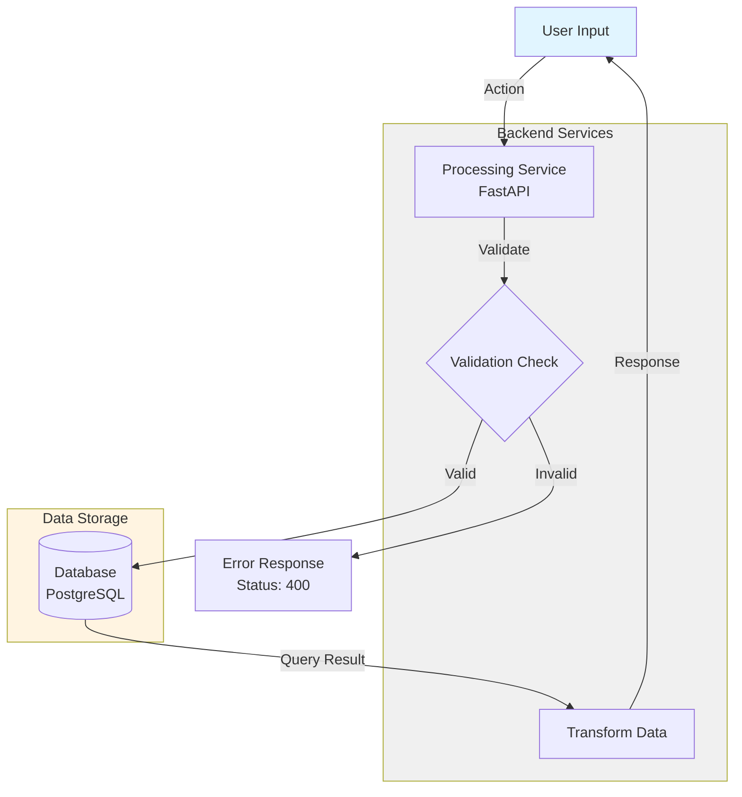

### Sequence Diagram Template

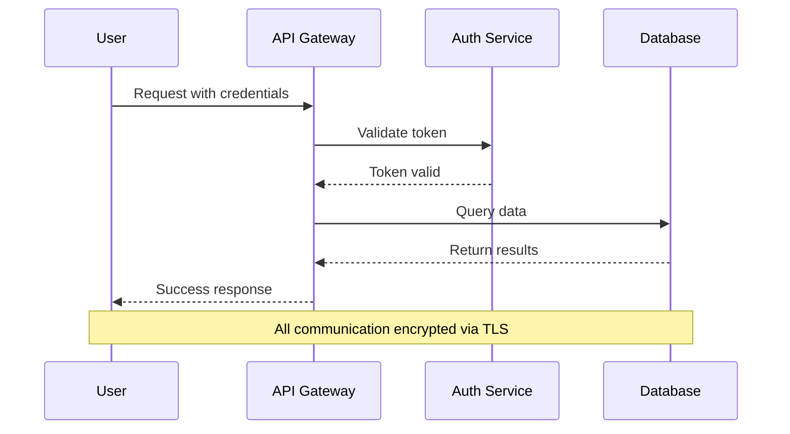

### State Diagram Template

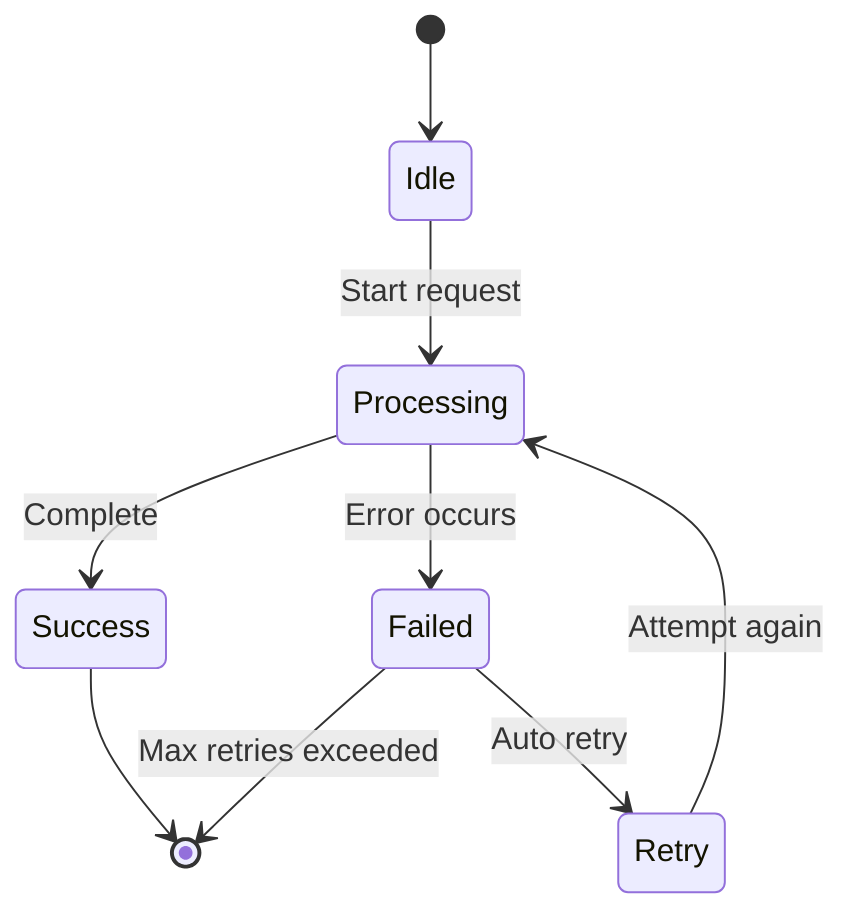

## Quality Gates (Definition of Done)

### Syntax Validation Gates

- [ ] **No nested quotes**: All node labels checked for nested quote issues
- [ ] **Multi-line syntax**: Labels with `<br/>` wrapped in double quotes
- [ ] **Edge labels clean**: No unnecessary quotes in edge labels (between `|...|`)
- [ ] **Subgraph IDs valid**: Subgraphs with special chars use ID/label syntax
- [ ] **Node IDs unique**: No duplicate node IDs in diagram
- [ ] **Node ID format**: All IDs use camelCase with no spaces

### Structure Validation Gates

- [ ] **Diagram renders**: Successfully renders in Mermaid Live Editor
- [ ] **All relationships resolve**: No broken node references
- [ ] **Flow direction correct**: TD, LR, RL, BT specified appropriately
- [ ] **Subgraphs organized**: Related nodes grouped logically
- [ ] **Styling applied**: Style directives added AFTER all nodes defined

### Quality Assurance Gates

- [ ] **Labels concise**: Display labels descriptive but not verbose
- [ ] **Comments added**: Complex sections documented with `%%` comments
- [ ] **Appropriate diagram type**: Using correct type (flowchart vs sequence vs state)
- [ ] **Visual clarity**: Diagram is readable and understandable
- [ ] **Documentation integration**: Title/caption added if embedding in docs

### Pre-Commit Validation

- [ ] **Parse errors**: Zero parse errors in renderer
- [ ] **Cross-browser**: Renders correctly in GitHub, VS Code, docs site
- [ ] **File size**: Diagram complexity reasonable (not overly complex)
- [ ] **Standards compliance**: Follows project diagram naming conventions

## Skill Constraints

### What NOT to Do

- **Do NOT** use nested quotes in any node labels (causes parse errors)
- **Do NOT** put quotes in edge labels unless absolutely necessary
- **Do NOT** use special characters in subgraph IDs without ID/label syntax
- **Do NOT** reference subgraph display names in style directives (use IDs)
- **Do NOT** add styling directives before all nodes are defined
- **Do NOT** use literal newlines in labels (use `<br/>` tags instead)
- **Do NOT** create overly complex diagrams (>50 nodes - split into multiple)
- **Do NOT** use generic node IDs like `node1`, `node2` (use descriptive IDs)
- **Do NOT** skip validation in Mermaid Live Editor before committing
- **Do NOT** use deprecated Mermaid syntax (check version compatibility)

### Diagram Type Restrictions

- **Do NOT** use Mermaid for:
  - Data visualization charts (bar, pie, line charts - use charting library)
  - Gantt charts for project management (use dedicated PM tools)
  - Git graphs (use git visualization tools)
  - Organizational charts with photos (use org chart tools)
  - Complex data tables (use markdown tables)

### File Organization Rules

- **Always** validate syntax before creating diagram files
- **Always** use templates as starting point for diagram type
- **Always** test in Mermaid Live Editor before embedding
- **Always** include diagram type in filename or documentation
- **Always** follow project naming conventions for node IDs

## Example Usage

### Example 1: Create New Flowchart

**User Request**:
> "Create a flowchart showing the authentication flow: user submits credentials, system validates, checks database, returns token or error"

**Skill Actions**:
1. **Identify type**: Flowchart (process flow with decisions)
2. **Plan nodes**: User, Validator, Database, TokenService, Error, Success
3. **Plan flow**: User → Validate → Decision → Database OR Error → Success OR Error
4. **Apply syntax rules**:
   - Node IDs: `userInput`, `validator`, `dbCheck`, `tokenService`, `errorResponse`, `successResponse`
   - Remove nested quotes from all labels
   - Use decision diamond for validation check
5. **Build from template**: Use Flowchart Template
6. **Validate**: Test in Mermaid Live Editor

**Result**:
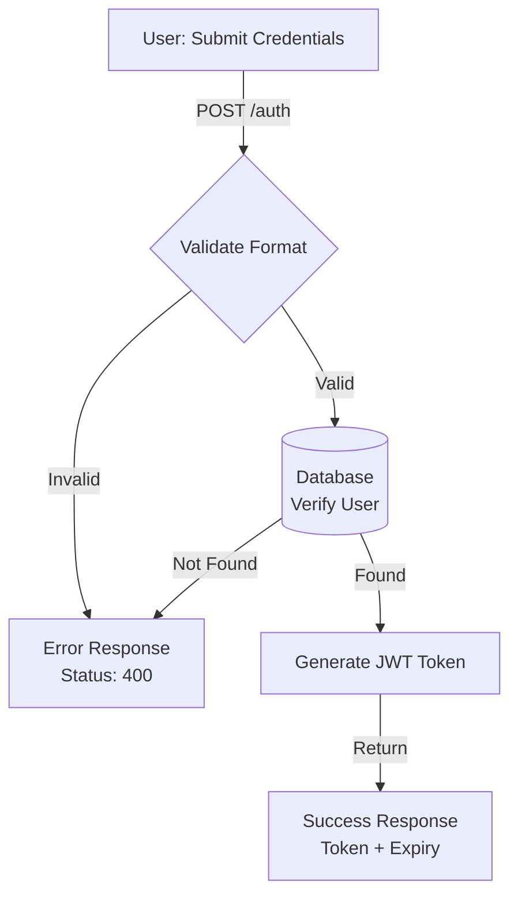

### Example 2: Fix Parse Error

**User Request**:
> "My sequence diagram won't render. Error: 'Expecting SQE, got STR'. Here's the code: `User->>API: Request "data"`"

**Skill Actions**:
1. **Diagnose error**: "Expecting SQE, got STR" = nested quotes issue
2. **Locate problem**: Edge label has nested quotes: `Request "data"`
3. **Apply fix**: Remove inner quotes: `Request data`
4. **Validate**: Test corrected syntax in Mermaid Live Editor
5. **Return fixed code**

**Result**:
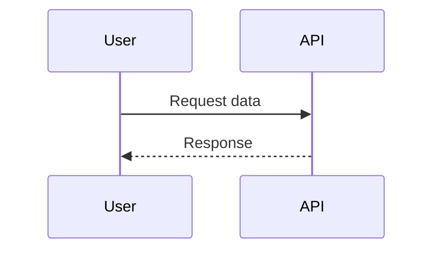

**Explanation**: Edge labels between `|...|` or after `:` should not contain quotes.

### Example 3: Create State Machine with Complex Labels

**User Request**:
> "Create a state diagram for order processing: Draft → Submitted → Processing → Completed or Failed. Include transition conditions."

**Skill Actions**:
1. **Identify type**: State diagram (state transitions)
2. **Plan states**: Draft, Submitted, Processing, Completed, Failed
3. **Plan transitions**: With labeled conditions
4. **Apply syntax rules**:
   - Use `stateDiagram-v2` syntax
   - State IDs: `Draft`, `Submitted`, `Processing`, `Completed`, `Failed`
   - Transition labels with conditions (no quotes)
5. **Build from template**: Use State Diagram Template
6. **Validate**: Test in Mermaid Live Editor

**Result**:
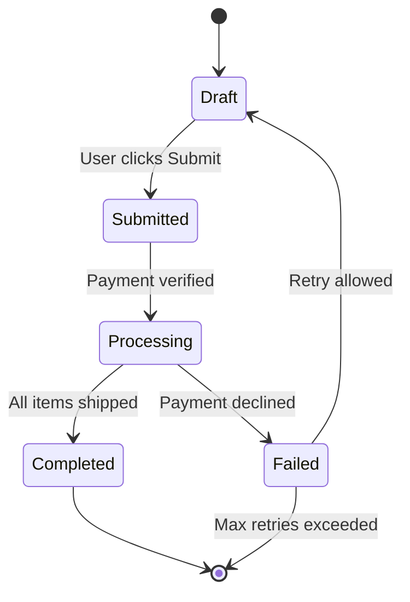

## Common Patterns

### Decision Flow Pattern

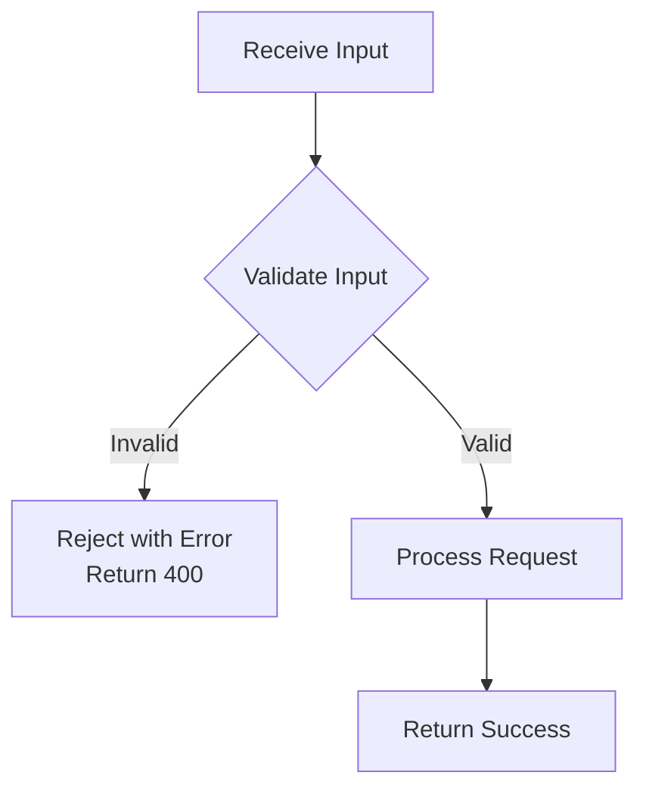

### Multi-Source Integration Pattern

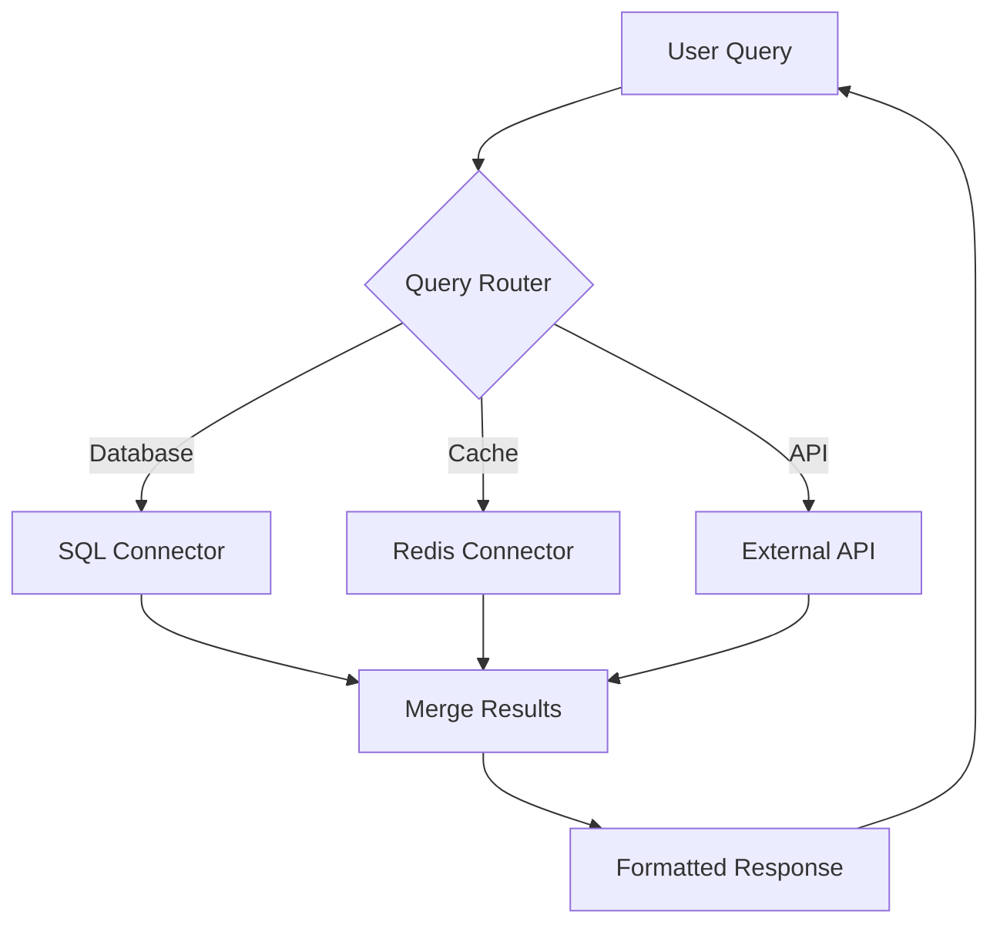

### Error Handling Pattern

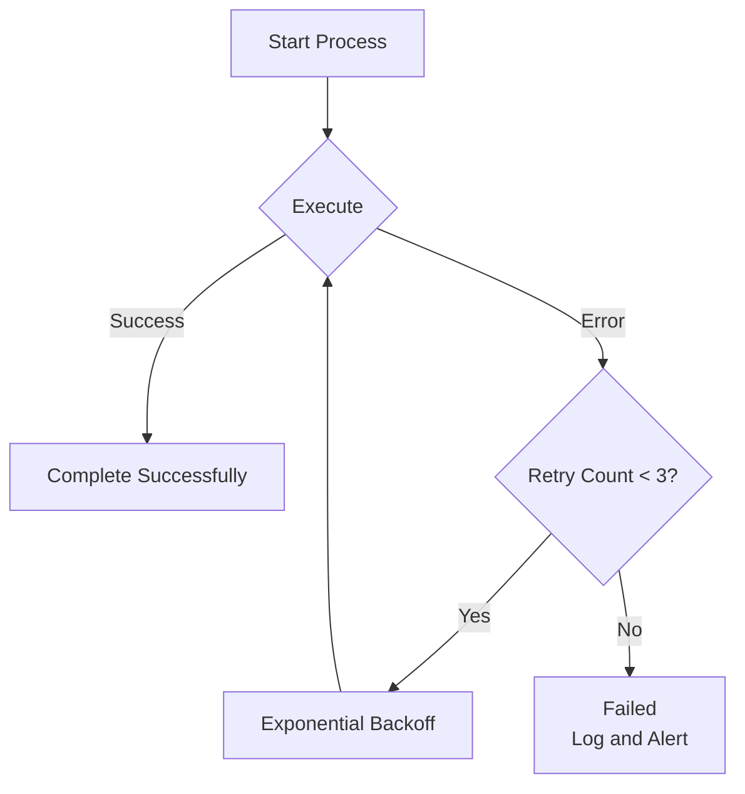

## Troubleshooting Guide

### Error: "Expecting 'SQE', got 'STR'"
- **Cause:** Nested quotes in node labels
- **Fix:** Remove inner quotes or wrap entire label in quotes

### Error: "Expecting 'SPACE', got 'AMP'"
- **Cause:** Special character (&, /, etc.) in style directive
- **Fix:** Use subgraph ID/label syntax: `subgraph ID["Name"]`

### Error: "Parse error on line X"
- **Cause:** Usually quote-related or malformed syntax
- **Fix:** Check for nested quotes, verify node/edge syntax

### Chart not rendering
- **Cause:** Invalid node IDs, broken references, or syntax errors
- **Fix:** Validate in Mermaid Live Editor, check node ID consistency

## Examples from Real Documentation

### Architecture Flow (ADR Pattern)

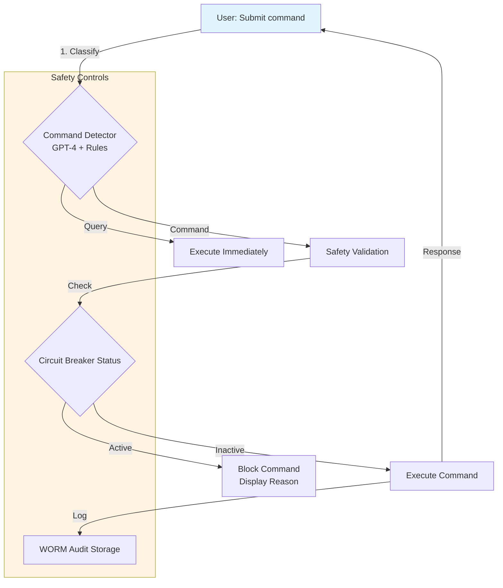

### Data Pipeline Flow

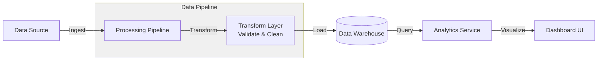

## Quick Reference Card

| Element | Syntax | Example |
|---------|--------|---------|
| Node (rectangle) | `ID[Label]` | `Node1[Process Data]` |
| Node (rounded) | `ID(Label)` | `Start(Begin Process)` |
| Node (database) | `ID[(Label)]` | `DB[(PostgreSQL)]` |
| Node (circle) | `ID((Label))` | `Point((A))` |
| Decision | `ID{Label}` | `Check{Is Valid?}` |
| Arrow | `-->` | `A --> B` |
| Labeled arrow | `-- text -->` or `-->|text|` | `A -->|Send| B` |
| Subgraph | `subgraph ID["Label"]` | `subgraph Sys["System"]` |
| Style | `style ID fill:#color` | `style Node1 fill:#e1f5ff` |
| Comment | `%% comment` | `%% This is a note` |
| Line break | `<br/>` in label | `Node["Line 1<br/>Line 2"]` |

## Output Format

### Generated Artifacts

When using the `mermaid-gen` skill, the primary output is:

**Mermaid Diagram Code Block**:
- Format: Markdown code block with `mermaid` language identifier
- Content: Syntactically valid Mermaid diagram code
- Validation: Tested in Mermaid Live Editor before delivery
- Structure: Includes comments, styling, and proper node/edge syntax

**Example Output**:
````markdown
```mermaid
flowchart TD
    %% Define nodes
    Start[Start Process] --> Process[Execute Task]
    Process --> End[Complete]

    %% Apply styling
    style Start fill:#e1f5ff
    style End fill:#c8e6c9
```
````

### Integration with charts-flow Skill

**Skill Relationship**:
- **mermaid-gen**: Creates syntactically correct diagram code
- **charts-flow**: Takes diagram code and manages file creation, SVG generation, document embedding

**Typical Workflow**:
1. User requests diagram for documentation
2. `charts-flow` skill invoked for file management
3. `charts-flow` internally calls `mermaid-gen` for diagram generation
4. `mermaid-gen` returns validated Mermaid code
5. `charts-flow` creates diagram file, generates SVG, embeds in parent document

**Standalone Usage**:
When user only needs diagram code (not file management):
- Invoke `mermaid-gen` directly
- Returns diagram code block
- User manually embeds in documentation

**Combined Usage**:
When user needs complete diagram file workflow:
- Invoke `charts-flow` skill (which uses `mermaid-gen` internally)
- Returns diagram file + SVG + parent document updates

### Output Validation Checklist

Every output from `mermaid-gen` must meet these criteria:
- ✅ Renders without errors in Mermaid Live Editor
- ✅ No nested quotes in any labels
- ✅ Subgraph IDs match style references
- ✅ All node IDs are unique
- ✅ Comments explain complex sections
- ✅ Follows project naming conventions

## Integration with Project Workflow

### Relationship to Other Skills

**charts-flow Skill**:
- **Purpose**: Diagram file management, SVG generation, document embedding
- **Integration**: Calls `mermaid-gen` to generate diagram content
- **Use Case**: Creating separate diagram files in `diagrams/` subdirectories

**doc-flow Skill**:
- **Purpose**: Specification-Driven Development workflow (BRD → PRD → ADR → SYS → SPEC)
- **Integration**: Diagrams created with `mermaid-gen` support ADRs, SYS docs, and architecture specifications
- **Use Case**: Adding architecture diagrams to ADR documents or system specifications

**project-mngt Skill**:
- **Purpose**: MVP/MMP/MMR implementation planning
- **Integration**: Diagrams visualize project dependencies and implementation flows
- **Use Case**: Creating Gantt-style timelines or dependency graphs (if supported by Mermaid)

### Documentation Standards Alignment

**Technical Guidelines** (per CLAUDE.md):
- Focus on technical implementation (not marketing language)
- Cost optimization considerations (lightweight SVG format)
- Performance focus (separate diagram files for faster rendering)
- Security considerations (no executable code in diagrams)

**Best Practice Integration**:
- Use `mermaid-gen` for syntax correctness
- Use `charts-flow` for file management and performance optimization
- Follow project naming conventions for node IDs
- Validate all diagrams before committing to version control

## Version
- **Version:** 1.0
- **Last Updated:** 2025-11-05
- **Lessons Learned From:** ADR Architecture Flow diagram fixes

## Related Documentation
- [Mermaid Official Docs](https://mermaid.js.org/)
- [Mermaid Live Editor](https://mermaid.live)
- [GitHub Mermaid Support](https://github.blog/2022-02-14-include-diagrams-markdown-files-mermaid/)
