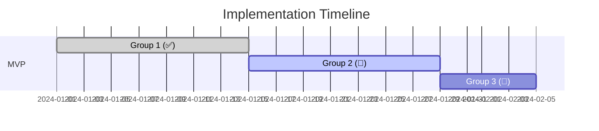

# project-mngt

**Project Implementation Planning with MVP/MMP/MMR Methodology**

## Purpose

This skill teaches AI assistants how to analyze any project's requirements and create implementation plans using the MVP/MMP/MMR (Minimum Viable Product / Minimum Marketable Product / Minimum Marketable Release) methodology.

**This is a METHODOLOGY skill that teaches HOW to plan, not WHAT to plan.**

### Use Cases

1. **Initial Project Planning**: Analyze requirements and create structured implementation plan
2. **Plan Updates**: Modify existing plans when requirements change while preserving completed work
3. **Progress Tracking**: Update plans with current status and adjust remaining work
4. **Release Strategy**: Define logical stages and atomic groups for incremental delivery

### Adaptability

Works with:
- Any number of requirement documents (5 or 500)
- Different formats: BRD, PRD, User Stories, Epics, Features
- Various domains: Trading systems, web apps, APIs, infrastructure, ML/AI
- Changing requirements: Update plans without restarting completed work

### ID Naming Standards

**Reference**: `/opt/data/docs_flow_framework/ai_dev_flow/ID_NAMING_STANDARDS.md`

**Common ID Formats**:
- **Planning Documents**: `PLAN-NNN` (e.g., PLAN-01, PLAN-02)
- **Requirements**: `REQ-NN` or `REQ-NN-YY` (e.g., REQ-01, REQ-01-01)
- **Tasks**: `TASK-NNN` or `TASK-NNN-YY` (e.g., TASK-01, TASK-01-01)

**Format Rules**:
- Use TYPE-NN for primary documents (three digits with leading zeros)
- Use TYPE-NN-YY for sub-items (two digits with leading zeros)
- IDs are unique within their artifact type
- Sequential numbering starts at 001

---

## MVP/MMP/MMR Framework

### Definitions (2024-2025 Best Practices)

#### MVP (Minimum Viable Product)
**Purpose**: Learning vehicle to validate core hypothesis with early adopters
**Focus**: Test riskiest assumptions, gather feedback, prove feasibility
**Quality**: Can have bugs, imperfect UX, manual processes
**Goal**: Answer "Can we build this?" and "Will users use it?"
**Monetization**: Not required - learning, not earning
**Timeline**: 4-12 weeks typical

**MVP Success Criteria**:
- Core functionality works end-to-end
- Riskiest technical assumptions validated
- User feedback collected
- Product-market fit signals observed

#### MMP (Minimum Marketable Product)
**Purpose**: First release-ready product that delivers real customer value
**Focus**: Market-ready quality, essential features, can be sold/deployed
**Quality**: Polished UX, stable, production-ready, minimal bugs
**Goal**: Answer "Will customers pay for this?" and "Can we support it at scale?"
**Monetization**: Required - ready for paying customers
**Timeline**: 8-20 weeks after MVP

**MMP Success Criteria**:
- All essential features complete
- Production-quality code and UX
- Security, performance, reliability validated
- Support processes in place
- Marketing/sales materials ready

#### MMR (Minimum Marketable Release)
**Purpose**: Incremental feature releases that enhance market appeal post-MMP
**Focus**: Additional features, optimizations, integrations, scale improvements
**Quality**: Same as MMP - production-ready, market-quality
**Goal**: Answer "How do we grow adoption?" and "What drives retention?"
**Monetization**: Drives expansion revenue, reduces churn, attracts new segments
**Timeline**: 2-8 weeks per release (ongoing)

**MMR Success Criteria**:
- Adds measurable customer value
- Maintains product quality standards
- Fits within product roadmap vision
- Data-driven prioritization

### Progression Path

```
IDEA → MVP (validate) → MMP (launch) → MMR-1 → MMR-2 → MMR-n (grow)
         ↓                ↓              ↓        ↓        ↓
      Learn First     Earn First    Expand Value Stream
```

### Quality Gates

| Stage | Testing | Documentation | UX | Performance | Security |
|-------|---------|---------------|-----|-------------|----------|
| MVP | Manual OK | Minimal | Basic | Good enough | Basic |
| MMP | Automated | Complete | Polished | Production SLA | Full audit |
| MMR | Automated | Updated | Polished | Production SLA | Continuous |


---

## Analysis Methodology

Follow these 6 steps to create any implementation plan:

### Step 1: Requirements Discovery

**Objective**: Catalog all requirements and understand project scope

**Process**:
1. Read all requirement documents (BRD, PRD, user stories)
2. Extract for each requirement:
   - ID, Description, Complexity (1-5), Priority hints, Dependencies, Functional area
3. Create requirement inventory table

**Output**: Complete catalog of all requirements

### Step 2: Dependency Mapping

**Objective**: Identify relationships and sequencing constraints

**Dependency Types**:
- Technical: Requires infrastructure/library/component
- Business: Prerequisite functionality for workflow
- Data: Requires schema/migration/data source
- Integration: Depends on external system/API

**Process**:
1. For each requirement, identify dependencies
2. Classify as blocking or non-blocking
3. Create dependency graph
4. Identify critical path

**Output**: Dependency map showing blocking relationships

### Step 3: Atomic Grouping Principles

**Objective**: Create independently deployable, testable groups

**Atomic Group Characteristics**:
- Cohesive: Related functionality together
- Independent: Can be developed/tested/deployed separately
- Testable: Clear acceptance criteria
- Valuable: Delivers observable outcome
- Sized Right: 1-4 weeks of work

**Grouping Techniques**:
1. Functional Cohesion: Group by feature area
2. Technical Layer: Group by architectural component
3. User Journey: Group by end-to-end workflow
4. Dependency Cluster: Group tightly coupled requirements

**Naming Convention**: "[Component] [Action]" (e.g., "Broker Integration", "Risk Validation Framework")

**Output**: List of atomic groups with clear boundaries

### Step 4: Stage Assignment (MVP/MMP/MMR)

**Decision Framework**:

MVP Assignment Criteria (must meet at least 2):
- Validates core technical feasibility
- Required for end-to-end workflow
- Tests riskiest assumption
- Generates critical user feedback
- No viable workaround exists

MMP Assignment Criteria:
- Essential for first customer/user
- Required for production deployment
- Regulatory/compliance necessity
- Security/reliability/data integrity critical
- Competitive table stakes feature

MMR Assignment Criteria:
- Enhances existing functionality
- Expands market reach or use cases
- Optimization or performance improvement
- Integration with optional systems
- Nice-to-have that drives adoption/retention

**Output**: Each atomic group assigned to MVP, MMP, MMR-1, MMR-2, etc.

### Step 5: Priority Numbering

**Priority Numbering System**:
- Sequential priorities (1, 2, 3...): Must complete in order
- Parallel priorities (same number): Can execute simultaneously

**Prioritization Rules**:
1. Dependency-Driven: Higher priority = fewer dependencies
2. Risk-First: Address high-risk/uncertainty early
3. Value-Weighed: Balance technical dependencies with business value
4. Resource-Aware: Consider team size and skill distribution

**Parallelization Check**:
- No technical dependencies?
- Different code areas?
- Separate team members available?
- No shared infrastructure bottleneck?
- Integration points clearly defined?

If all yes → Assign same priority number

**Output**: Priority-numbered atomic groups

### Step 6: Timeline Estimation

**Complexity-Based Estimation**:
- Complexity 1: 0.5-1 week
- Complexity 2: 1-2 weeks
- Complexity 3: 2-3 weeks
- Complexity 4: 3-4 weeks
- Complexity 5: 4-6 weeks

**Buffer Management**:
- Stage level: +15% buffer
- Project level: +25% buffer

**Timeline Formula**:
```
Total Time = Σ(Group Duration) / Parallel Tracks + Stage Buffers
```

**Output**: Gantt chart with start/end dates and milestones

---

## Progress Tracking & Status Management

### Implementation Status Categories

| Status | Symbol | Meaning | Mutability |
|--------|--------|---------|------------|
| COMPLETED | ✅ | Fully implemented, tested, deployed | IMMUTABLE |
| IN_PROGRESS | 🚧 | Currently being worked on | Assess impact |
| BLOCKED | ⏸️ | Cannot proceed due to dependency/issue | Requires resolution |
| PLANNED | 📅 | Not yet started, future work | FREELY MODIFIABLE |
| MODIFIED | 🔄 | Changed from original plan | Document changes |
| CANCELLED | ❌ | Removed from scope | Justify removal |

### Status Tracking Requirements

1. Every atomic group MUST have a status
2. **Completed work is IMMUTABLE** - never modify in plan updates
3. In-progress work requires careful impact assessment
4. Only planned work can be freely rearranged
5. All status changes MUST be documented in change log


---

## Change Management Protocol

### Scenario A: New Project (Initial Plan Creation)

**When to Use**: Starting new project, no prior plan

**Inputs**:
- Complete set of requirement documents
- Project context (domain, team size, constraints)
- Timeline constraints (if any)

**Process**:
1. Execute Steps 1-6 (Requirements Discovery through Timeline Estimation)
2. All atomic groups marked as PLANNED
3. Timeline starts from project kickoff (Week 1)

**Output**: `PLAN-XXX_[project_name].md` version 1.0

---

### Scenario B: BRD Changes with Existing Plan (MOST CRITICAL)

**When to Use**: Requirements changed AND project underway

**Inputs**:
- Modified/new requirement documents
- Existing implementation plan
- **Current progress status** (which groups are complete/in-progress)
- Current date (timeline restart point)

**Process** (CRITICAL - Follow Exactly):

**Phase 1: Preserve Completed Work (IMMUTABLE)**
1. Identify all groups with status COMPLETED
2. Mark as LOCKED - do NOT modify
3. **Rule**: Never delete, rename, or change scope of completed work

**Phase 2: Assess In-Progress Work**
1. Identify groups with status IN_PROGRESS
2. Assess: Does BRD change affect scope? Should work continue?
3. Document assessment
4. Decision: Continue as-is / Adjust scope / Cancel

**Phase 3: Analyze BRD Changes**
1. Identify added/modified/removed requirements
2. Map changes to atomic groups
3. Determine affected groups and new groups needed

**Phase 4: Replan PLANNED Work Only**
1. Only modify groups with status PLANNED
2. Options: Regroup, Reprioritize, Add new, Cancel, Modify scope
3. Re-run dependency analysis
4. Re-run stage assignment

**Phase 5: Update Timeline**
1. **Start from current date**, NOT project start
2. Calculate remaining work
3. Re-estimate remaining groups
4. Update end date projection
5. Calculate timeline variance

**Phase 6: Document Changes**
1. Create detailed change log
2. Document BRD changes and rationale
3. List all affected groups
4. Explain timeline impact
5. Update progress summary

**Output**: Updated `PLAN-XXX_[project_name].md` (version incremented)

**CRITICAL RULES**:
- ✅ PRESERVE all completed work
- ✅ ASSESS impact on in-progress work
- ✅ ONLY modify planned work
- ✅ START timeline from TODAY
- ✅ DOCUMENT all changes
- ❌ NEVER modify completed groups
- ❌ NEVER restart timeline from Week 1

---

### Scenario C: Progress Update (No BRD Changes)

**When to Use**: Update plan with progress, requirements unchanged

**Inputs**:
- Existing plan
- Progress update (status changes)
- Current date

**Process**:
1. Update status of groups
2. Mark completed groups with dates
3. Update progress metrics
4. Adjust timeline if pace differs
5. Identify blocked items

**Output**: Refreshed `PLAN-XXX_[project_name].md`


---

## Execution Templates

### Template: Implementation Plan Document Structure

```markdown
# Implementation Plan: [Project Name]

## Document Control

| Item | Details |
|------|---------|
| **Project Name** | [Name] |
| **Plan ID** | PLAN-01 |
| **Version** | X.0 |
| **Date** | YYYY-MM-DD |
| **Status** | [Active / Completed / On Hold] |
| **Owner** | [Name] |
| **Preparer** | [Name] |

### Document Revision History

| Version | Date | Author | Changes Made | Approver |
|---------|------|--------|--------------|----------|
| 1.0 | YYYY-MM-DD | [Name] | Initial plan creation | |
| | | | | |

---

## Executive Summary

**Project Goal**: [One-sentence description]
**Implementation Approach**: MVP → MMP → MMR staged releases
**Current Status**: [X% complete, Y of Z groups done]
**Timeline**: Start: YYYY-MM-DD, Projected End: YYYY-MM-DD, Duration: X weeks

**Key Milestones**:
- MVP: [Date] - [Status]
- MMP: [Date] - [Status]
- MMR-1: [Date] - [Status]

---

## Implementation Progress Summary
*(Include in updated plans)*

**Overall Status**: X% Complete (Y of Z groups completed)

**Completed Stages**:
- MVP (Completed: YYYY-MM-DD, Duration: X weeks)

**Current Stage**: MMP Phase 2 (Week 3 of 4)

**Completed Groups**: [List with dates]
**In Progress**: [List with status]
**Planned**: [List with start dates]
**Blocked**: [List with issues]
**Modified**: [List with reasons]
**Cancelled**: [List with justification]

**Timeline Adjustment**:
- Original End: YYYY-MM-DD
- Current Projected: YYYY-MM-DD
- Variance: +/- X weeks
- Reason: [Explain]

---

## Stage 1: MVP (Minimum Viable Product)

**Goal**: [What this stage validates]
**Status**: [NOT_STARTED / IN_PROGRESS / COMPLETED]
**Duration**: [Original X weeks] | Actual: [If complete]

**Success Criteria**:
- [ ] [Criterion 1]
- [ ] [Criterion 2]

**Exit Criteria**:
- [ ] Core functionality works end-to-end
- [ ] Riskiest assumptions validated

### Atomic Groups

#### Priority 1: [Group Name]
**Status**: [COMPLETED / IN_PROGRESS / BLOCKED / PLANNED / MODIFIED / CANCELLED]

**Requirements**:
- REQ-01: [Description]
- REQ-02: [Description]

**Dependencies**:
- [Dependency 1] (Status: Satisfied / Pending)

**Deliverable**: [Clear, testable output]

**Success Criteria**:
- [ ] [Criterion]

**Duration**: X weeks
**Completion Date**: [If COMPLETED]
**Notes**: [If MODIFIED/BLOCKED/CANCELLED]

---

## Timeline Visualization



---

## Change Log
*(Required in updated plans)*

### Version 2.0 - YYYY-MM-DD

**Reason for Update**: [BRD changes / Progress update]

**BRD Changes**:
- BRD-004: Added 5 new requirements (REQ-041 to REQ-045)

**Impact Analysis**:
- Completed Work: Preserved as-is
- In-Progress Work: [Assessment]
- Planned Work: [Modifications]

**Specific Changes**:
1. Group X: MODIFIED - Added REQ-041, REQ-042
2. Group Y: NEW - Created for REQ-043, REQ-044, REQ-045
3. Group Z: CANCELLED - Requirement removed

**Timeline Impact**: +2 weeks due to new Group Y

---

## Traceability Matrix

| Atomic Group | Requirements | ADRs | BDD Scenarios | Status |
|--------------|--------------|------|---------------|--------|
| MVP Group 1 | REQ-01, REQ-02 | ADR-006 | broker.feature | ✅ |
| MMP Group 5 | REQ-041, REQ-042 | ADR-008 | risk.feature | 🚧 |
```


---

## AI Assistant Usage Instructions

### How to Invoke This Skill

#### Scenario 1: Create Initial Implementation Plan

**Command Pattern**:
```
"Use the project-mgnt skill to create an implementation plan for [project name].

Inputs:
- Requirement documents: [list file paths]
- Project context: [domain, team size, constraints]
- Timeline constraint: [if any]

Create PLAN-XXX_[project_name].md following MVP/MMP/MMR methodology."
```

**Example**:
```
"Use the project-mgnt skill to create an implementation plan for inventory system.

Inputs:
- Requirements: {project_root}/docs/BRD/BRD-*.md (11 files)
- Context: E-commerce domain, 5 FTE team, staging deployment first
- Constraint: MVP in <3 months

Create PLAN-01_inventory_system.md in docs/IMPL/"
```

---

#### Scenario 2: Update Existing Plan (Requirements Changed)

**Command Pattern**:
```
"Use the project-mgnt skill to update the implementation plan at [path].

Inputs:
- Modified BRDs: [list changed files]
- Existing plan: [path]
- Current progress: [which groups complete/in-progress]
- Current date: [today]

IMPORTANT: Preserve completed work, only modify planned work."
```

**Example**:
```
"Use the project-mgnt skill to update PLAN-01_inventory_system.md.

Inputs:
- Modified: BRD-004 added 5 new security requirements
- Plan: docs/IMPL/PLAN-01_inventory_system.md v1.0
- Progress: MVP complete (Groups 1-4), Group 5 in progress (week 2/4)
- Date: 2024-02-01

Create v2.0 with change log."
```

---

### Expected Outputs

Every invocation MUST produce:

1. **Implementation Plan Document**
   - Filename: `PLAN-XXX_[project_name].md`
   - Location: User-specified or docs/IMPL/
   - Format: Markdown following template
   - Versioning: v1.0, v2.0, v3.0...

2. **Required Sections**
   - Document Control section with project metadata and revision history
   - Executive Summary
   - Progress Summary (if update)
   - Stage breakdown (MVP, MMP, MMR)
   - Atomic groups with priorities, status, dependencies
   - Timeline visualization (Gantt chart)
   - Success metrics and exit criteria
   - Change log (if update)
   - Traceability matrix

3. **Change Log** (updates only)
   - BRD changes documented
   - Impact analysis
   - Specific group changes
   - Timeline impact

---

## Decision Frameworks

### Framework 1: MVP Scope Decisions

**Question**: Should this feature be in MVP?

**Key Questions**:
1. Does it test the core hypothesis?
2. Can we validate without it?
3. Is there a simpler alternative for MVP?
4. Does it validate high-risk assumption?
5. Is there a viable workaround?

**MVP Inclusion Criteria** (meet at least 2):
- [ ] Validates core technical feasibility
- [ ] Required for end-to-end workflow
- [ ] Tests riskiest assumption
- [ ] Generates critical user feedback
- [ ] No viable workaround exists

---

### Framework 2: Parallel vs Sequential

**Decision Checklist**:

```
Group A + Group B can be parallel if:
- [ ] No code dependencies
- [ ] Different files/modules
- [ ] No shared database schema changes
- [ ] No shared infrastructure
- [ ] Separate team members available
- [ ] No specialized skill bottleneck
- [ ] Integration points clearly defined
- [ ] Low rework risk

If 8-10 checks = ✅ PARALLEL (same priority)
If 5-7 checks = ⚠️ PARALLEL with caution
If <5 checks = ❌ SEQUENTIAL
```

---

### Framework 3: Stage Gate Criteria

**MVP → MMP Gate**:

Exit Criteria (must meet ALL):
- [ ] Core functionality works end-to-end
- [ ] Riskiest assumptions validated
- [ ] User feedback collected
- [ ] Critical bugs logged
- [ ] Team consensus: hypothesis validated
- [ ] Product Owner sign-off

Proceed if:
- ✅ Hypothesis confirmed
- ✅ Technical feasibility proven
- ✅ Team confident

STOP if:
- ❌ Hypothesis rejected
- ❌ Technical infeasibility
- ❌ Cost exceeds value

---

### Framework 4: Update Impact Assessment

**Process**:

**Step 1: Categorize Change**
- Type: New / Modified / Removed / External dependency
- Size: Small (<5 req) / Medium (5-15) / Large (>15)
- Timing: Early (planned) / Mid (in-progress) / Late (completed)

**Step 2: Map to Groups**
- Completed groups: [Impact: None / Re-validation needed]
- In-progress groups: [Impact: Continue / Adjust / Stop]
- Planned groups: [Impact: Modify / Cancel / Reprioritize]

**Step 3: Impact Level**
- NONE: No action
- LOW: <1 week, adjust in place
- MEDIUM: 1-2 weeks, consider new group
- HIGH: >2 weeks, create new group
- CRITICAL: Invalidates group, cancel/redistribute

**Step 4: Decision Matrix**
- COMPLETED: No change (immutable) unless re-validation needed
- IN_PROGRESS: Continue / Adjust / Stop and replan
- PLANNED: Adjust / Modify / Cancel / Create new


---

## Adaptation Guidelines

### For Different Project Types

#### Infrastructure Projects
- **MVP**: Single environment (dev) with core infrastructure, automation scripts
- **MMP**: Production with full DR/HA, all IaC automated
- **Grouping**: By layer (network, compute, storage, security)
- **Critical Path**: IAM/Security → Network → Compute

#### API Development
- **MVP**: Core endpoints, happy-path only, simplified auth
- **MMP**: All endpoints, full error handling, OAuth, rate limiting
- **Grouping**: By resource/domain (Users API, Orders API)
- **Parallel**: Independent resources can develop simultaneously

#### ML/AI Systems
- **MVP**: Single model, manual training, sample data
- **MMP**: Automated pipeline, versioning, A/B testing, production serving
- **Grouping**: By ML pipeline stage (data prep, training, serving)
- **Critical Path**: Data quality → Model training → Serving

#### Web Applications
- **MVP**: Single-page prototype, core flow, desktop-only
- **MMP**: Responsive, cross-browser, all flows, production hosting
- **Grouping**: By user journey (registration, onboarding, core workflow)
- **Parallel**: Frontend + Backend (clear API contract)

---

### For Changing Requirements

#### New Features Added Mid-Project
1. Is it MVP validation? → Add to MVP (rare)
2. Essential for launch? → Add to MMP
3. Incremental value? → Add to MMR
4. Can wait? → Backlog

**Process**: Create requirement IDs, assess dependencies, fit in existing or create new group, assign stage/priority, update timeline, document in change log.

#### Features Removed/Descoped
1. In COMPLETED group? → Note descoping (already built)
2. In IN_PROGRESS? → Assess if should continue or stop
3. In PLANNED? → Cancel group or reduce scope

**Process**: Identify affected groups, remove requirements, cancel empty groups or adjust deliverables, update timeline, document rationale.

#### Priority Changes (Urgent Feature)
1. Verify dependencies allow earlier execution
2. Reprioritize to earlier priority number
3. Shift other groups later
4. Assess resource impact
5. Update timeline
6. Communicate trade-offs in change log

---

### For Different Team Sizes

#### Small Team (2-3 FTE)
- Limited parallelization (max 2 tracks)
- Focus on sequence over parallel
- Longer MVP/MMP stages
- Add 30-50% buffer for context switching

#### Medium Team (4-8 FTE)
- Good balance (2-3 parallel tracks)
- Specialization possible
- Maximize stage parallelization
- Clear ownership

#### Large Team (9+ FTE)
- High parallelization (4+ tracks)
- Specialized roles
- Risk: Communication overhead, integration complexity
- Strategy: Strict API contracts, daily syncs, strong PM


---

## Best Practices Compendium

### Common Pitfalls and Solutions

**Pitfall 1: MVP Scope Creep**
- Problem: MVP grows with "nice-to-have" features
- Solution: Ruthlessly apply MVP criteria, time-box MVP, create "MMP Backlog"

**Pitfall 2: Ignoring Dependencies**
- Problem: Parallelizing groups with hidden dependencies causes rework
- Solution: Thorough dependency mapping, define APIs before parallel work, daily syncs

**Pitfall 3: Modifying Completed Work**
- Problem: Updates change completed groups, causing confusion
- Solution: Mark completed as IMMUTABLE, create NEW groups for modifications

**Pitfall 4: Underestimating MMP Polish**
- Problem: Thinking MMP is "MVP + features" vs "production quality"
- Solution: Budget 50-100% more time for MMP, use strict "Definition of Done"

**Pitfall 5: No Clear Stage Gates**
- Problem: Moving MVP → MMP without validating success
- Solution: Explicit gate meetings, written exit criteria, PO sign-off required

---

### When to Deviate

**Acceptable Deviations**:
- Regulatory deadline: Compress stages, parallelize aggressively
- Market window: Skip some MMR features, focus on differentiators
- Technical debt crisis: Insert "Stabilization Sprint" between stages

**Never Deviate**:
- ❌ Skip MVP validation
- ❌ Launch MMP with known high-severity bugs
- ❌ Ignore completed work in updates
- ❌ Parallelize hard dependencies

---

### Lessons Learned

1. **MVP Always Takes Longer**: Add 25% buffer (50% for first-time team)
2. **MMP Needs More Testing**: Budget 30% of MMP for testing/QA
3. **Documentation Never "Done"**: Start in MVP, update continuously
4. **Velocity Improves**: First groups slower (learning), later groups faster (momentum)

---

## Validation Checklist

### For New Plans

**Completeness**:
- [ ] All requirements accounted for
- [ ] Dependencies identified and documented
- [ ] No circular dependencies

**Atomic Groups**:
- [ ] Groups independently testable
- [ ] Groups cohesive (related functionality)
- [ ] Size reasonable (1-4 weeks each)
- [ ] Descriptive names

**Stage Assignment**:
- [ ] MVP scope minimal (validation only)
- [ ] MMP includes launch essentials
- [ ] MMR is incremental (not launch-critical)

**Timeline**:
- [ ] Estimates based on complexity
- [ ] Buffers included at stage level
- [ ] Timeline realistic for team size

---

### For Updated Plans (CRITICAL)

**Immutability**:
- [ ] **All completed work preserved unchanged**
- [ ] Completion dates/deliverables unchanged
- [ ] No deletions/scope changes to completed groups

**Impact Assessment**:
- [ ] In-progress work assessed
- [ ] Only planned work modified
- [ ] New requirements mapped to groups

**Change Log**:
- [ ] BRD changes documented
- [ ] Impact analysis complete
- [ ] Specific changes listed with reasons
- [ ] Timeline impact calculated

**Timeline Continuity**:
- [ ] Timeline starts from current date
- [ ] Remaining work calculated accurately
- [ ] Variance explained

**Progress Tracking**:
- [ ] Progress summary accurate
- [ ] Status categories correct
- [ ] Completion percentage calculated

---

## Appendix

### Complexity Rating Scale

| Rating | Definition | Duration |
|--------|------------|----------|
| 1 | Trivial: Config change, minimal code | 0.5-1 week |
| 2 | Simple: Single component, clear requirements | 1-2 weeks |
| 3 | Moderate: Multiple components, some integration | 2-3 weeks |
| 4 | Complex: Cross-system integration, unknowns | 3-4 weeks |
| 5 | Very Complex: Architectural change, high uncertainty | 4-6 weeks |

### Glossary

**MVP**: Learning-focused first version to validate hypothesis. Functional but imperfect.

**MMP**: Market-ready first release with essential features and production quality. Can be sold.

**MMR**: Incremental feature releases after MMP. Production-quality, adds value.

**Atomic Group**: Independently deployable set of related requirements. 1-4 weeks, cohesive, testable.

**Critical Path**: Longest dependency chain determining minimum timeline.

**Dependency**: Prerequisite relationship between requirements or groups.

**Stage Gate**: Decision point between stages to validate completion.

**Priority Number**: Sequencing indicator. Same number = parallel execution.

**Status**: Current state (COMPLETED, IN_PROGRESS, BLOCKED, PLANNED, MODIFIED, CANCELLED).

**Change Log**: Document section tracking all modifications from previous version.

**Immutable**: Cannot be changed. Completed work is immutable in updates.

---

## Worked Example Reference

See examples directory for complete worked examples:

**Trading System v1.0**: Initial plan from 11 BRDs
- 13 atomic groups across MVP/MMP/MMR
- All groups PLANNED
- Timeline: 27 weeks from start

**Trading System v2.0**: Updated after BRD-004 changes
- MVP completed (Groups 1-4)
- Group 5 in progress
- New requirements added
- Timeline adjusted, change log included

*(Full examples in `{project_root}/.claude/skills/project-mngt/examples/`)*

---

## Skill Version History

**Version 1.0** (2025-01-03):
- Initial release
- Complete MVP/MMP/MMR framework
- Change management protocols
- Templates and decision frameworks
- Validation checklists
- Adaptation guidelines

---

## Support and Feedback

For issues or enhancements:
1. Document issue or suggestion
2. Provide scenario where skill didn't work
3. Suggest improvement with rationale

This skill evolves based on real-world usage and feedback.
