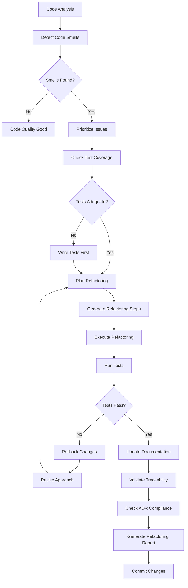

# refactor-flow

**Description**: Code refactoring assistance, technical debt management, and documentation synchronization

**Category**: Code Quality & Maintenance

**Complexity**: Medium-High (code transformation + traceability maintenance)

---

## Purpose

Improve code quality through systematic refactoring while maintaining traceability to specifications. Identify refactoring opportunities, guide safe transformations, and ensure documentation stays synchronized with code changes.

---

## Capabilities

### 1. Code Smell Detection
- **Long methods**: Functions >50 lines
- **God classes**: Classes with too many responsibilities
- **Duplicate code**: Similar code blocks
- **Dead code**: Unused functions/variables
- **Magic numbers**: Hardcoded constants
- **Complex conditionals**: Nested if statements
- **Feature envy**: Methods using other class data extensively
- **Data clumps**: Groups of data that travel together

### 2. Refactoring Recommendations
- **Extract method**: Break down long functions
- **Extract class**: Split god classes
- **Rename**: Improve naming clarity
- **Remove duplication**: DRY principle
- **Simplify conditionals**: Guard clauses, strategy pattern
- **Introduce parameter object**: Replace parameter lists
- **Replace magic numbers**: Named constants
- **Inline method**: Remove unnecessary indirection

### 3. Complexity Reduction
- Reduce cyclomatic complexity
- Simplify nested structures
- Break dependency cycles
- Improve cohesion
- Reduce coupling

### 4. Design Pattern Application
- Identify pattern opportunities
- Suggest appropriate patterns
- Guide pattern implementation
- Validate pattern usage

### 5. Technical Debt Tracking
- Identify technical debt
- Quantify debt severity
- Prioritize debt reduction
- Track debt trends

### 6. Documentation Synchronization
- Update docstrings after refactoring
- Sync SPEC documents with code changes
- Update traceability references
- Maintain ADR compliance

### 7. Safe Refactoring
- Verify tests exist before refactoring
- Ensure tests pass after refactoring
- Preserve public API contracts
- Maintain backward compatibility

### 8. Automated Refactoring
- Auto-fix simple refactorings
- Generate refactoring diffs
- Apply transformations safely
- Rollback capability

---

## Refactoring Workflow



---

## Usage Instructions

### Analyze Code for Refactoring

```bash
refactor-flow analyze --file src/auth/service.py
```

Output:
```
=== Refactoring Analysis: src/auth/service.py ===

Code Smells Found: 6

[HIGH] Long Method (Lines 45-156)
- Method: authenticate_user()
- Length: 112 lines
- Complexity: 15
- Recommendation: Extract validation logic to separate methods
- Estimated effort: 2 hours
- Risk: Low (good test coverage: 95%)

[HIGH] Duplicate Code (85% similarity)
- Locations:
  * Lines 201-215 (validate_password_strength)
  * Lines 234-248 (validate_new_password)
- Recommendation: Extract common logic to shared validator
- Estimated effort: 1 hour
- Risk: Low

[MEDIUM] God Class
- Class: UserAuthenticationService
- Responsibilities: 7 (authentication, validation, logging, caching, email, audit, session)
- Recommendation: Extract email, audit, and caching to separate services
- Estimated effort: 4 hours
- Risk: Medium (affects multiple consumers)

[MEDIUM] Complex Conditional (Lines 89-103)
- Nested depth: 4
- Recommendation: Use guard clauses and early returns
- Estimated effort: 30 minutes
- Risk: Low

[LOW] Magic Numbers (Lines 167, 189, 203)
- Values: 3, 5, 10
- Recommendation: Extract to named constants
- Estimated effort: 15 minutes
- Risk: Very low

[LOW] Dead Code (Lines 278-295)
- Method: legacy_authentication()
- Last used: Never (added 6 months ago)
- Recommendation: Remove if truly unused
- Estimated effort: 5 minutes
- Risk: Very low

Technical Debt Score: 42/100 (High debt)
Refactoring Priority: High
Estimated Total Effort: 7.75 hours
```

### Generate Refactoring Plan

```bash
refactor-flow plan \
  --file src/auth/service.py \
  --priority high \
  --output refactoring-plan.md
```

Generated plan:
```markdown
# Refactoring Plan: UserAuthenticationService

## Objective
Reduce complexity and improve maintainability of authentication service

## Current State
- Complexity: 15 (High)
- Lines of code: 356
- Test coverage: 95%
- Technical debt: 42/100

## Target State
- Complexity: <10 (Acceptable)
- Lines of code: <250
- Test coverage: ≥95%
- Technical debt: <20/100

## Refactoring Steps

### Step 1: Extract Password Validation (Priority: High, Risk: Low)
**Duration**: 1 hour

**Changes**:
1. Create `PasswordValidator` class
2. Move `validate_password_strength()` logic
3. Remove duplicate validation code
4. Update tests

**Before**:
```python
def validate_password_strength(self, password):
    if len(password) < 8:
        return False
    if not any(c.isupper() for c in password):
        return False
    # ... more validation
```

**After**:
```python
class PasswordValidator:
    MIN_LENGTH = 8
    MAX_LENGTH = 128

    @classmethod
    def validate(cls, password: str) -> ValidationResult:
        if len(password) < cls.MIN_LENGTH:
            return ValidationResult(valid=False, error="Too short")
        # ... validation logic
```

**Verification**:
- [ ] Tests pass
- [ ] Coverage maintained
- [ ] No duplicate code

---

### Step 2: Simplify authenticate_user() (Priority: High, Risk: Low)
**Duration**: 2 hours

**Changes**:
1. Extract validation logic to `_validate_credentials()`
2. Extract session creation to `_create_session()`
3. Extract audit logging to `_audit_login_attempt()`
4. Use guard clauses

**Before** (Complexity: 15):
```python
def authenticate_user(self, username, password):
    if username and password:
        if self._validate_format(username):
            user = self.db.get_user(username)
            if user:
                if user.is_active:
                    if self._check_password(password, user.password_hash):
                        # ... 50 more lines
```

**After** (Complexity: 5):
```python
def authenticate_user(self, username: str, password: str) -> AuthResult:
    credentials = self._validate_credentials(username, password)
    if not credentials.valid:
        return AuthResult(success=False, error=credentials.error)

    user = self._get_active_user(username)
    if not user:
        return AuthResult(success=False, error="User not found")

    if not self._verify_password(password, user):
        self._audit_login_attempt(username, success=False)
        return AuthResult(success=False, error="Invalid password")

    session = self._create_session(user)
    self._audit_login_attempt(username, success=True)
    return AuthResult(success=True, session=session)
```

**Verification**:
- [ ] Complexity reduced to <10
- [ ] All tests pass
- [ ] Behavior unchanged

---

### Step 3: Extract Supporting Services (Priority: Medium, Risk: Medium)
**Duration**: 4 hours

**Changes**:
1. Create `EmailService` for email notifications
2. Create `AuditLogger` for security audit logging
3. Create `SessionCache` for session caching
4. Update dependency injection

**Impact Analysis**:
- 5 consumers of UserAuthenticationService
- All consumers need to update imports
- Breaking change (MAJOR version bump)
- Migration guide required

**Migration Guide**:
```python
# Before
auth_service = UserAuthenticationService()
auth_service.send_verification_email(user)

# After
auth_service = UserAuthenticationService()
email_service = EmailService()
email_service.send_verification(user)
```

**Verification**:
- [ ] All consumers updated
- [ ] Integration tests pass
- [ ] Documentation updated
```

### Execute Refactoring

```bash
refactor-flow execute \
  --plan refactoring-plan.md \
  --step 1 \
  --dry-run
```

Dry-run output:
```
=== Refactoring Execution (DRY RUN) ===

Step 1: Extract Password Validation

Changes to be made:

1. Create new file: src/auth/validators.py
   [+] 45 lines

2. Modify file: src/auth/service.py
   [-] 30 lines (removed duplicate code)
   [~] 12 lines (updated to use PasswordValidator)

3. Create test file: tests/auth/test_validators.py
   [+] 67 lines

Diff preview:
────────────────────────────────────────
--- src/auth/service.py
+++ src/auth/service.py
@@ -1,5 +1,6 @@
 from datetime import datetime
 from typing import Optional
+from auth.validators import PasswordValidator

 class UserAuthenticationService:
-    def validate_password_strength(self, password: str) -> bool:
-        if len(password) < 8:
-            return False
-        # ... (removed 28 lines)
+    def validate_password_strength(self, password: str) -> bool:
+        result = PasswordValidator.validate(password)
+        return result.valid
────────────────────────────────────────

Test impact:
- Tests to update: 3
- New tests: 8
- Total test count: 156 → 161

Ready to execute? (--dry-run flag active, no changes made)
```

### Track Technical Debt

```bash
refactor-flow debt \
  --module src/ \
  --output reports/technical-debt.json
```

Output:
```json
{
  "summary": {
    "total_debt_score": 35,
    "critical_debt_items": 3,
    "high_debt_items": 12,
    "medium_debt_items": 28,
    "estimated_hours": 87
  },
  "debt_by_category": {
    "complexity": {
      "score": 45,
      "items": 8,
      "estimated_hours": 24
    },
    "duplication": {
      "score": 30,
      "items": 15,
      "estimated_hours": 18
    },
    "test_coverage": {
      "score": 20,
      "items": 12,
      "estimated_hours": 30
    },
    "documentation": {
      "score": 25,
      "items": 9,
      "estimated_hours": 15
    }
  },
  "critical_items": [
    {
      "file": "src/data/processor.py",
      "issue": "God class with 12 responsibilities",
      "debt_score": 85,
      "estimated_hours": 16,
      "recommendation": "Split into domain-specific services"
    },
    {
      "file": "src/api/handlers.py",
      "issue": "850 lines, complexity 45",
      "debt_score": 92,
      "estimated_hours": 20,
      "recommendation": "Extract handlers to separate modules"
    }
  ],
  "trend": {
    "previous_score": 40,
    "current_score": 35,
    "change": -5,
    "direction": "improving"
  }
}
```

---

## Refactoring Patterns

### Extract Method

**Before**:
```python
def process_order(order):
    # Validate order (15 lines)
    if not order.items:
        raise ValueError("No items")
    for item in order.items:
        if item.quantity <= 0:
            raise ValueError("Invalid quantity")
    # ... more validation

    # Calculate total (10 lines)
    subtotal = sum(item.price * item.quantity for item in order.items)
    tax = subtotal * 0.08
    shipping = calculate_shipping(order)
    total = subtotal + tax + shipping

    # Process payment (20 lines)
    # ... payment logic

    return total
```

**After**:
```python
def process_order(order: Order) -> Decimal:
    self._validate_order(order)
    total = self._calculate_total(order)
    self._process_payment(order, total)
    return total

def _validate_order(self, order: Order) -> None:
    if not order.items:
        raise ValueError("No items")
    for item in order.items:
        if item.quantity <= 0:
            raise ValueError(f"Invalid quantity for {item.name}")

def _calculate_total(self, order: Order) -> Decimal:
    subtotal = sum(item.price * item.quantity for item in order.items)
    tax = subtotal * Decimal('0.08')
    shipping = self._calculate_shipping(order)
    return subtotal + tax + shipping
```

### Replace Conditional with Polymorphism

**Before**:
```python
def calculate_discount(customer, amount):
    if customer.type == 'regular':
        return amount * 0.05
    elif customer.type == 'premium':
        return amount * 0.10
    elif customer.type == 'vip':
        return amount * 0.20
    else:
        return 0
```

**After**:
```python
class Customer(ABC):
    @abstractmethod
    def calculate_discount(self, amount: Decimal) -> Decimal:
        pass

class RegularCustomer(Customer):
    def calculate_discount(self, amount: Decimal) -> Decimal:
        return amount * Decimal('0.05')

class PremiumCustomer(Customer):
    def calculate_discount(self, amount: Decimal) -> Decimal:
        return amount * Decimal('0.10')

class VIPCustomer(Customer):
    def calculate_discount(self, amount: Decimal) -> Decimal:
        return amount * Decimal('0.20')
```

### Introduce Parameter Object

**Before**:
```python
def create_user(username, email, first_name, last_name, birth_date,
                address, city, state, zip_code, phone, preferences):
    # ... implementation
```

**After**:
```python
@dataclass
class UserProfile:
    username: str
    email: str
    first_name: str
    last_name: str
    birth_date: date
    contact_info: ContactInfo
    preferences: UserPreferences

def create_user(profile: UserProfile) -> User:
    # ... implementation
```

---

## Refactoring Checklist

### Pre-Refactoring
- [ ] Understand the code behavior
- [ ] Check test coverage (≥80% recommended)
- [ ] Review SPEC/ADR compliance
- [ ] Identify affected consumers
- [ ] Create backup branch
- [ ] Run full test suite (baseline)

### During Refactoring
- [ ] Make small, incremental changes
- [ ] Run tests after each change
- [ ] Commit frequently with clear messages
- [ ] Preserve public API contracts
- [ ] Maintain backward compatibility (if required)
- [ ] Update inline documentation

### Post-Refactoring
- [ ] Run full test suite
- [ ] Verify coverage maintained/improved
- [ ] Update SPEC documents if API changed
- [ ] Update traceability references
- [ ] Check ADR compliance
- [ ] Update changelog
- [ ] Code review
- [ ] Performance testing (if applicable)

---

## Documentation Synchronization

### After Extract Method

```python
# Before refactoring
def authenticate_user(username, password):
    """
    Authenticate user with username and password.
    Validates credentials, checks user status, creates session.

    Traceability: REQ-AUTH-01, BDD-LOGIN-001
    """

# After refactoring - Update all affected docstrings
def authenticate_user(username: str, password: str) -> AuthResult:
    """
    Authenticate user with username and password.

    Args:
        username: User's login name
        password: User's password

    Returns:
        AuthResult containing success status and session

    Traceability: REQ-AUTH-01, BDD-LOGIN-001
    """

def _validate_credentials(self, username: str, password: str) -> ValidationResult:
    """
    Validate username and password format.

    Traceability: REQ-AUTH-01
    """
```

### Update SPEC Document

```markdown
# SPEC-AUTH-V1.md

## Authentication Service API

### Method: authenticate_user()
**Status**: Updated in v1.2.0 (refactored for clarity)

**Signature**:
```python
def authenticate_user(username: str, password: str) -> AuthResult
```

**Changes in v1.2.0**:
- Refactored internal implementation for better maintainability
- No API changes (backward compatible)
- Improved error messages
- Added type hints

**Traceability**: REQ-AUTH-01
```

---

## Risk Assessment

### Low Risk Refactorings
- Rename variables/methods (with IDE support)
- Extract constants
- Inline temporary variables
- Remove dead code
- Add type hints
- Improve docstrings

### Medium Risk Refactorings
- Extract method
- Extract class
- Move method
- Replace conditional with polymorphism
- Introduce parameter object

### High Risk Refactorings
- Change class hierarchy
- Split database tables
- Modify public API
- Change authentication mechanism
- Refactor core business logic

### Risk Mitigation
1. **Excellent test coverage**: ≥95% for high-risk refactorings
2. **Feature flags**: Enable gradual rollout
3. **Parallel run**: Run old and new code, compare results
4. **Staged rollout**: Canary deployment
5. **Rollback plan**: Quick revert capability
6. **Monitoring**: Extra logging during transition

---

## Tool Access

Required tools:
- `Read`: Read source files and documentation
- `Edit`: Apply refactoring transformations
- `Write`: Create new files
- `Bash`: Run tests and analysis tools
- `Grep`: Search for code patterns

Required libraries:
- rope: Python refactoring library
- autopep8: Code formatting
- radon: Complexity metrics
- pylint: Code analysis

---

## Integration Points

### With code-review
- Identify refactoring opportunities from reviews
- Validate refactoring quality
- Track complexity improvements

### With test-automation
- Ensure tests exist before refactoring
- Run tests after each refactoring step
- Verify coverage maintained

### With doc-validator
- Sync documentation with code changes
- Validate traceability after refactoring
- Update cross-references

### With analytics-flow
- Track technical debt trends
- Measure refactoring impact
- Report debt reduction progress

---

## Best Practices

1. **Test first**: Ensure good test coverage before refactoring
2. **Small steps**: Incremental changes, frequent commits
3. **One thing at a time**: Don't mix refactoring with new features
4. **Preserve behavior**: No functional changes during refactoring
5. **Run tests constantly**: After every small change
6. **Review changes**: Code review for refactorings
7. **Update documentation**: Keep specs synchronized
8. **Monitor performance**: Ensure no performance regressions
9. **Communicate**: Notify team of significant refactorings
10. **Schedule wisely**: Not during critical deadlines

---

## Success Criteria

- Code complexity reduced to target levels
- Test coverage maintained or improved
- Zero functional regressions
- Documentation synchronized
- Traceability preserved
- Team understands changes
- Technical debt score improved by ≥20%

---

## Notes

- Refactoring plans saved to `plans/refactoring/`
- Refactoring reports in `reports/refactoring/`
- Technical debt tracked in `metrics/technical-debt.json`
- Automated refactorings require manual review
- High-risk refactorings need team approval
