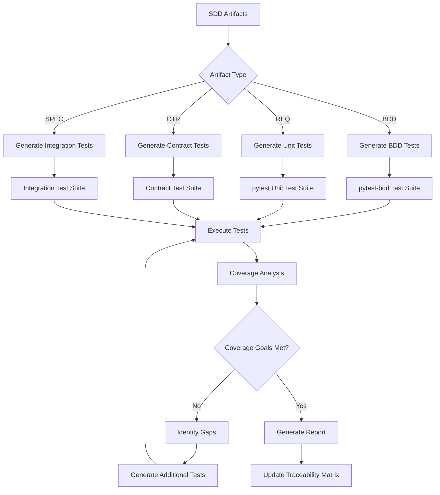

# test-automation

**Description**: Automated test generation, BDD execution, coverage analysis, and contract testing

**Category**: Quality Assurance & Testing

**Complexity**: High (multi-framework integration + coverage analysis)

---

## Purpose

Transform SDD artifacts (BDD scenarios, requirements, contracts) into executable test suites with comprehensive coverage tracking. Ensures code implementation matches specifications and contracts.

---

## Capabilities

### 1. BDD Scenario Generation
- Parse BDD documents (Given-When-Then format)
- Generate pytest-bdd test files
- Map scenarios to test functions
- Handle scenario outlines with examples
- Generate test fixtures from Given clauses

### 2. Unit Test Generation
- Generate unit tests from requirements (REQ documents)
- Create test templates from SPEC documents
- Mock generation for dependencies
- Parameterized test generation
- Edge case identification from requirements

### 3. Integration Test Generation
- API integration tests from CTR contracts
- Database integration tests from data specifications
- Service interaction tests
- End-to-end workflow tests from IMPL documents

### 4. Contract Testing
- Consumer-driven contract tests from CTR YAML
- Schema validation tests
- API contract compliance verification
- Breaking change detection
- Mock server generation from contracts

### 5. Test Coverage Analysis
- Line coverage, branch coverage, path coverage
- Requirement coverage mapping (REQ → Test)
- Scenario coverage tracking (BDD → Test)
- Contract coverage validation (CTR → Test)
- Coverage gap identification

### 6. Performance Test Generation
- Load test scenarios from performance requirements
- Stress test configurations
- Benchmark test generation
- SLA validation tests

### 7. Test Data Generation
- Realistic test data from specifications
- Edge case data generation
- Boundary value analysis
- Invalid input generation for negative tests

---

## Test Generation Workflow



---

## Usage Instructions

### Generate Tests from BDD Scenarios

```python
# Input: BDD/authentication_scenarios.md
# Output: tests/bdd/test_authentication.py

test-automation generate-bdd \
  --input BDD/authentication_scenarios.md \
  --output tests/bdd/test_authentication.py \
  --framework pytest-bdd
```

Generated test structure:
```python
import pytest
from pytest_bdd import scenarios, given, when, then, parsers

scenarios('{project_root}/BDD/authentication_scenarios.md')

@given('a user with valid credentials')
def user_with_valid_credentials(context):
    context.user = create_test_user(
        username='testuser',
        password='ValidP@ssw0rd'
    )

@when('the user attempts to login')
def user_attempts_login(context):
    context.response = login_api(
        username=context.user.username,
        password=context.user.password
    )

@then('the login should succeed')
def login_succeeds(context):
    assert context.response.status_code == 200
    assert 'access_token' in context.response.json()
```

### Generate Unit Tests from Requirements

```python
# Input: reqs/requirements.md (REQ-AUTH-01)
# Output: tests/unit/test_auth_requirements.py

test-automation generate-unit \
  --input reqs/requirements.md \
  --filter REQ-AUTH-* \
  --output tests/unit/test_auth_requirements.py
```

Generated test structure:
```python
import pytest
from auth.service import AuthService

class TestREQ_AUTH_001:
    """Test REQ-AUTH-01: Password must be 8-20 characters"""

    def test_password_minimum_length(self):
        """Verify password < 8 characters is rejected"""
        result = AuthService.validate_password('Short1!')
        assert not result.valid
        assert 'minimum 8 characters' in result.error

    def test_password_maximum_length(self):
        """Verify password > 20 characters is rejected"""
        result = AuthService.validate_password('VeryLongPassword123456789!')
        assert not result.valid
        assert 'maximum 20 characters' in result.error

    def test_password_valid_length(self):
        """Verify password 8-20 characters is accepted"""
        result = AuthService.validate_password('ValidP@ss1')
        assert result.valid
```

### Generate Contract Tests

```python
# Input: ctrs/CTR-USER-V1.yaml
# Output: tests/contract/test_user_contract.py

test-automation generate-contract \
  --input ctrs/CTR-USER-V1.yaml \
  --output tests/contract/test_user_contract.py \
  --provider user-service
```

Generated test structure:
```python
import pytest
from pact import Consumer, Provider, Like, EachLike

@pytest.fixture
def pact():
    return Consumer('user-client').has_pact_with(
        Provider('user-service')
    )

def test_create_user_contract(pact):
    expected = {
        'user_id': Like('123e4567-e89b-12d3-a456-426614174000'),
        'username': Like('testuser'),
        'email': Like('test@example.com'),
        'created_at': Like('2025-01-01T00:00:00Z')
    }

    (pact
     .given('user database is empty')
     .upon_receiving('a request to create a user')
     .with_request('POST', '/api/users')
     .will_respond_with(201, body=expected))

    with pact:
        result = user_api.create_user({
            'username': 'testuser',
            'email': 'test@example.com',
            'password': 'SecureP@ss123'
        })
        assert result.status_code == 201
```

### Execute Test Suite with Coverage

```bash
# Run all tests with coverage
test-automation run \
  --coverage \
  --coverage-report html \
  --traceability

# Run specific test category
test-automation run --category bdd
test-automation run --category unit
test-automation run --category contract

# Run tests for specific requirement
test-automation run --requirement REQ-AUTH-01
```

### Generate Coverage Report

```bash
test-automation coverage-report \
  --format html \
  --output reports/coverage \
  --include-traceability
```

Generated report includes:
- Overall coverage percentage
- Coverage by requirement (REQ → Test mapping)
- Coverage by BDD scenario
- Coverage by contract endpoint
- Untested code paths
- Traceability matrix

---

## Test Templates

### BDD Test Template (pytest-bdd)

```python
"""
BDD Tests for {feature_name}
Generated from: {bdd_document_path}
Traceability: {requirement_ids}
"""

import pytest
from pytest_bdd import scenarios, given, when, then, parsers

# Load all scenarios from BDD document
scenarios('{bdd_document_path}')

# Fixtures
@pytest.fixture
def context():
    """Test context for sharing state between steps"""
    return {}

# Given steps
@given(parsers.parse('{step_description}'))
def step_given(context, {parameters}):
    # Setup preconditions
    pass

# When steps
@when(parsers.parse('{step_description}'))
def step_when(context, {parameters}):
    # Execute action
    pass

# Then steps
@then(parsers.parse('{step_description}'))
def step_then(context, {parameters}):
    # Verify outcome
    pass
```

### Unit Test Template (pytest)

```python
"""
Unit Tests for {requirement_id}
Requirement: {requirement_description}
Source: {requirement_document}
"""

import pytest
from {module} import {class_or_function}

class Test_{requirement_id}:
    """Test suite for {requirement_id}"""

    @pytest.fixture
    def setup(self):
        """Setup test fixtures"""
        return {class_or_function}()

    def test_positive_case(self, setup):
        """Test expected behavior"""
        result = setup.method({valid_input})
        assert result == {expected_output}

    def test_boundary_case_min(self, setup):
        """Test minimum boundary value"""
        result = setup.method({min_value})
        assert {assertion}

    def test_boundary_case_max(self, setup):
        """Test maximum boundary value"""
        result = setup.method({max_value})
        assert {assertion}

    def test_invalid_input(self, setup):
        """Test error handling"""
        with pytest.raises({expected_exception}):
            setup.method({invalid_input})
```

### Integration Test Template

```python
"""
Integration Tests for {component_name}
Specification: {spec_document}
Contracts: {contract_ids}
"""

import pytest
from {test_client} import TestClient
from {app} import app

@pytest.fixture
def client():
    """Test client for API integration tests"""
    return TestClient(app)

class Test_{component_name}_Integration:
    """Integration test suite for {component_name}"""

    def test_api_endpoint_{operation}(self, client):
        """Test {operation} operation"""
        # Arrange
        test_data = {test_payload}

        # Act
        response = client.{http_method}(
            '{endpoint_path}',
            json=test_data
        )

        # Assert
        assert response.status_code == {expected_status}
        assert response.json() == {expected_response}
```

### Contract Test Template (Pact)

```python
"""
Contract Tests for {service_name}
Contract: {contract_id}
Provider: {provider_service}
Consumer: {consumer_service}
"""

import pytest
from pact import Consumer, Provider, Like, EachLike, Term

@pytest.fixture
def pact():
    return Consumer('{consumer_service}').has_pact_with(
        Provider('{provider_service}'),
        host_name='localhost',
        port=1234
    )

class Test_{contract_id}:
    """Contract test suite for {contract_id}"""

    def test_{operation}_contract(self, pact):
        """Test {operation} contract"""
        # Define expected interaction
        expected = {expected_schema}

        # Setup pact
        (pact
         .given('{provider_state}')
         .upon_receiving('{interaction_description}')
         .with_request('{method}', '{path}')
         .will_respond_with({status}, body=expected))

        # Execute and verify
        with pact:
            result = {client_call}
            assert result == expected
```

---

## Coverage Analysis

### Requirement Coverage

```python
# Map requirements to tests
REQ-AUTH-01 → [
    test_password_minimum_length,
    test_password_maximum_length,
    test_password_valid_length
] (100% covered)

REQ-AUTH-002 → [
    test_password_uppercase_required,
    test_password_lowercase_required
] (50% covered - missing number requirement test)
```

### BDD Scenario Coverage

```python
# Map BDD scenarios to test execution
BDD-LOGIN-001: User Login Success → PASS (covered)
BDD-LOGIN-002: User Login Failure → PASS (covered)
BDD-LOGIN-003: Account Lockout → NOT TESTED (0% covered)
```

### Contract Coverage

```python
# Map contract endpoints to tests
POST /api/users → test_create_user_contract (100% covered)
GET /api/users/{id} → test_get_user_contract (100% covered)
PUT /api/users/{id} → NOT TESTED (0% covered)
DELETE /api/users/{id} → NOT TESTED (0% covered)
```

### Coverage Goals

- **Unit Test Coverage**: ≥90% line coverage, ≥80% branch coverage
- **Requirement Coverage**: 100% of MUST requirements tested
- **BDD Scenario Coverage**: 100% of scenarios executed
- **Contract Coverage**: 100% of contract operations tested
- **Integration Coverage**: ≥85% of integration paths tested

---

## Test Data Generation

### From Requirements

```python
# REQ-USER-001: Username must be 3-20 alphanumeric characters

test_data = {
    'valid': ['abc', 'user123', 'JohnDoe2025', 'a'.repeat(20)],
    'boundary_min': 'ab',  # Too short
    'boundary_max': 'a'.repeat(21),  # Too long
    'invalid': ['ab', 'user@123', 'John Doe', '123', ''],
    'edge_cases': ['aaa', 'zzz', '000', '999']
}
```

### From Contracts

```python
# CTR-USER-V1: User schema

test_data = {
    'valid_user': {
        'username': 'testuser',
        'email': 'test@example.com',
        'age': 25
    },
    'missing_required_field': {
        'username': 'testuser'
        # Missing email
    },
    'invalid_type': {
        'username': 123,  # Should be string
        'email': 'test@example.com',
        'age': 'twenty-five'  # Should be integer
    }
}
```

---

## Tool Access

Required tools:
- `Read`: Read SDD artifacts (BDD, REQ, CTR, SPEC)
- `Write`: Generate test files
- `Edit`: Update existing tests
- `Bash`: Execute test frameworks (pytest, pact)
- `Glob`: Find test files and artifacts
- `Grep`: Search for requirements and scenarios

Required libraries:
- pytest
- pytest-bdd
- pytest-cov
- pact-python (for contract testing)
- hypothesis (for property-based testing)
- faker (for test data generation)

---

## Integration Points

### With doc-flow
- Automatically generate tests when BDD/REQ documents created
- Update tests when specifications change
- Validate test traceability

### With code-review
- Verify test coverage meets minimum thresholds
- Identify untested code paths
- Suggest test cases for new code

### With contract-tester
- Execute contract validation tests
- Verify API compliance with CTR documents
- Detect breaking changes

### With doc-validator
- Validate test traceability references
- Ensure all requirements have tests
- Check test documentation quality

---

## Error Handling

### BDD Scenario Parse Error
```
ACTION: Validate Given-When-Then format
SUGGEST: Correct scenario syntax
VERIFY: Scenario parseable by pytest-bdd
UPDATE: BDD document if needed
```

### Test Generation Failure
```
ACTION: Identify missing dependencies or invalid specifications
SUGGEST: Fix specification or install required libraries
VERIFY: Generated test is syntactically correct
UPDATE: Test template if needed
```

### Coverage Gap Detected
```
ACTION: Identify untested requirements/scenarios
SUGGEST: Generate additional test cases
VERIFY: New tests increase coverage
UPDATE: Traceability matrix
```

### Contract Test Failure
```
ACTION: Compare expected vs actual contract
SUGGEST: Update implementation or contract
VERIFY: Provider and consumer agree on contract
UPDATE: Contract version if breaking change
```

---

## Best Practices

1. **Generate tests before implementation** (TDD approach)
2. **Maintain 1:1 mapping** between requirements and tests
3. **Use descriptive test names** referencing requirement IDs
4. **Parameterize tests** for multiple input scenarios
5. **Mock external dependencies** in unit tests
6. **Use real integrations** in integration tests
7. **Keep tests independent** (no shared state)
8. **Run tests in CI/CD** on every commit
9. **Track coverage trends** over time
10. **Update tests** when specifications change

---

## Limitations

1. Cannot generate tests for undefined requirements
2. Test quality depends on specification clarity
3. Manual review required for generated tests
4. Performance test load profiles require manual tuning
5. Complex business logic may need custom test logic
6. Contract testing requires provider cooperation

---

## Future Enhancements

1. AI-powered test case generation from natural language
2. Mutation testing for test effectiveness
3. Visual test result dashboards
4. Automatic test healing (update tests when code changes)
5. Predictive coverage analysis
6. Test prioritization based on risk
7. Continuous test optimization

---

## Success Criteria

- ≥90% unit test coverage
- 100% requirement test coverage (MUST requirements)
- 100% BDD scenario execution
- 100% contract operation coverage
- ≥85% integration test coverage
- Zero untested critical paths
- Test execution time < 10 minutes
- All test documentation and traceability matrices include Document Control sections with:
  - Project metadata (name, version, date, owner, preparer, status)
  - Document Revision History table tracking test plan changes

---

## Notes

- Generated tests require manual review and refinement
- Test data should be isolated per test (no shared fixtures)
- Contract tests require coordination with service providers
- Coverage reports saved to `reports/coverage/`
- Test execution logs saved to `logs/test-runs/`
- Traceability matrix updated after each test run
