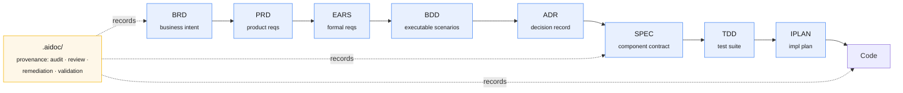

# AI Doc Flow Framework

> **Stop prompting. Start specifying.** An 8-layer specification chain that AI coding
> assistants read, audit, and build from — instead of guessing from a one-off prompt.

[](LICENSE)
[](https://github.com/vladm3105/aidoc-flow-framework/releases)
[](framework/README.md)
[](platforms/claude-code-plugin/)
[](https://github.com/vladm3105/aidoc-flow-framework/commits/main)

**AI Doc Flow Framework** is a structured workflow for **Specification-Driven Development
(SDD)** with AI coding assistants. It guides a project through an 8-layer documentation
chain — from business intent down to executable implementation plans — so AI tools act on
a verifiable spec rather than ad-hoc prompts.

Each layer has its own template, contract, and quality gate. The framework owns the
engine-agnostic specification; two independent platforms (Hermes MCP server, Claude Code
plugin) each implement it, and both pass the same conformance suite.

**Who it's for:** teams shipping AI-generated code that has to stay consistent, traceable,
and auditable as it scales across people and time.

---

## Contents

- [The 8-layer chain](#the-8-layer-chain)
- [Quick start](#quick-start)
- [The problem](#the-problem)
- [What the framework provides](#what-the-framework-provides)
- [What a layer looks like](#what-a-layer-looks-like)
- [Spec-driven vs. ad-hoc prompting](#spec-driven-vs-ad-hoc-prompting)
- [When to use it](#when-to-use-it)
- [Architecture](#architecture)
- [Platforms](#platforms)
- [Status](#status)
- [Contributing](#contributing)
- [Documentation](#documentation)

---

## The 8-layer chain

Each layer derives only from the layers above it, cites them explicitly, and must pass a
quality gate before the next layer is generated.



Lineage is carried by `@upstream:` tags and content-addressed element IDs — never by
matching layer numbers. One upstream item may fan out to many downstream documents.

---

## Quick start

This repo doubles as a Claude Code plugin marketplace
(`.claude-plugin/marketplace.json`). From Claude Code:

```text
/plugin marketplace add vladm3105/aidoc-flow-framework
/plugin install aidoc-flow@aidoc-flow-framework
```

Prefer the MCP-server engine? See [`platforms/hermes/`](platforms/hermes/) and the
[platform comparison](docs/PARITY.md) for a "which should I use?" guide.

---

## The problem

Driving AI assistants from free-form prompts carries three recurring costs:

- **Reproducibility** — output varies between runs, because the prompt is not retained as
  a reviewable artifact.
- **Traceability** — there is no recorded link from a business requirement to the code
  that implements it, so checking or auditing means re-reading everything.
- **Completeness** — nothing measures whether a step is good enough to build on. *"It
  looked right"* is the only gate.

Specification-Driven Development replaces the free-form prompt with a fixed chain of
documents. Each of the eight layers has a defined template, a set of required references
to the layers above it, and a numeric quality gate that must be met before the next layer
is generated. Each step is therefore **reproducible** (a committed artifact),
**traceable** (each element cites the upstream elements it derives from), and
**checkable** (each layer is scored against a rubric and structurally linted).

---

## What the framework provides

- **Eight layered artifacts** — BRD, PRD, EARS, BDD, ADR, SPEC, TDD, IPLAN. Each is a
  document type with a defined template and schema; a layer may reference only the layers
  before it.
- **Cumulative traceability** — `@upstream:` tags link every element to the elements it
  derives from, from business intent down to code. Broken or missing links are detectable,
  not silent.
- **Per-layer quality gates** — each layer is scored against a rubric; downstream
  generation is gated on a minimum score, so an underspecified layer is caught before it
  propagates.
- **Multi-persona review** — each layer is reviewed from a defined set of lenses (for
  example architecture, security, traceability) with weighted scoring and a recorded
  verdict (`framework/governance/REVIEW_TEAM.md`).
- **Deterministic structural lint** — `sdd_doc_lint` checks required sections, ID formats,
  and reference resolution the same way on every run.
- **Committed provenance** — the `.aidoc/` tier keeps audit, review, remediation,
  validation, and security records beside the output, so *"how was this produced?"* is
  answerable without a re-run.
- **Two engines, one contract** — the specification is engine-agnostic; a Hermes MCP
  server and a Claude Code plugin each implement it, and both pass the same conformance
  suite.

---

## What a layer looks like

<details>
<summary>Example: an EARS requirement and its upstream trace (click to expand)</summary>

```text
EARS.01.03.7192  —  Agent-prepared money movement
  WHEN an agent submits a transfer request
  the system SHALL place it in WAITING_APPROVAL
  and SHALL NOT execute it WITHIN the same call.

  @upstream: PRD.01.09.05a4  (Approval Queue capability)
  @upstream: BRD.01.07.b087  (Agent-prepared, user-approved money movement)
```

The same element ID (`EARS.01.03.7192`) is cited by the downstream BDD scenario, SPEC
component, and TDD test — so a future agent has a stable address for *this exact
requirement* and can't quietly reinterpret it. `sdd_doc_lint` fails the build if any
`@upstream:` reference doesn't resolve.

</details>

---

## Spec-driven vs. ad-hoc prompting

| Dimension | Ad-hoc prompting | This framework |
|-----------|------------------|----------------|
| **Reproducibility** | Output varies per run; the prompt is not kept as an artifact | Each layer is a committed document generated from a fixed template |
| **Traceability** | No recorded link from requirement to code | `@upstream:` tags link every element to the ones it derives from |
| **Review** | Re-read the whole output to judge it | Each layer is scored against a rubric before the next is generated |
| **Audit trail** | None unless added by hand | `.aidoc/` keeps audit, review, and remediation records beside the output |
| **Structural correctness** | Checked manually | `sdd_doc_lint` checks it deterministically |

---

## When to use it

Use the framework when outputs must stay consistent and auditable as work scales across a
team or over time — where *"it passed review"* needs to mean something traceable to a
spec, not a one-off prompt that happened to look right.

For a single throwaway script, the layered chain is more structure than the task needs.

---

## Architecture

```text
framework/                  Engine-agnostic specification (the shared contract)
platforms/
  hermes/                   Platform A — Hermes AI (MCP-server engine)
  claude-code-plugin/       Platform B — Claude Code plugin (native engine)
tests/
  conformance/              Shared suite both platforms must pass
```

The `framework/` spec defines the 8-layer SDD flow (BRD → PRD → EARS → BDD → ADR → SPEC →
TDD → IPLAN → Code), schemas, templates, and governance. Each platform is an independent
implementation of that spec — they share the specification and nothing else, and both pass
the same conformance suite at `tests/conformance/`.

---

## Platforms

| Platform | Engine | Release |
|----------|--------|---------|
| **Hermes AI** | MCP server | `hermes/v0.3.0` (`platforms/hermes/`) |
| **Claude Code plugin** | Native Claude Code (skills / agents / commands) | `claude-code-plugin/v0.13.0` (`platforms/claude-code-plugin/`) |

See [`docs/PARITY.md`](docs/PARITY.md) for the capability comparison and a "which platform
should I use?" guide.

---

## Status

What you can rely on today:

- **Framework spec `0.16.1`** — stable and conformance-tested; both engines implement it.
- **Claude Code plugin `v0.13.0`** — usable now, but a **pre-1.0 preview**: commands and
  surfaces may change before 1.0.
- **Hermes (MCP server) `v0.3.0`** — independent engine, same conformance suite.

New work lands on the Claude Code plugin first, with Hermes follow-on batches per
[`plans/HERMES-BACKLOG.md`](plans/HERMES-BACKLOG.md). Delivered and planned work is in
[`ROADMAP.md`](ROADMAP.md); per-release detail is in [`CHANGELOG.md`](CHANGELOG.md).

---

## Contributing

Enable the pre-commit hooks before committing:

```sh
pip install pre-commit && pre-commit install
```

See `.pre-commit-config.yaml` for the hook set and [`SECURITY.md`](SECURITY.md) for the
vulnerability-reporting policy.

---

## Documentation

- [`ROADMAP.md`](ROADMAP.md) — delivery plan and planned work.
- [`CHANGELOG.md`](CHANGELOG.md) — project-level changelog.
- [`SECURITY.md`](SECURITY.md) — security policy and vulnerability reporting.
- [`docs/REPO_STRUCTURE.md`](docs/REPO_STRUCTURE.md) — repository layout (as-built).
- [`docs/PROJECT.md`](docs/PROJECT.md) — versioning, branching, milestones, conformance, change management.
- [`docs/TAGGING.md`](docs/TAGGING.md) — git-tag policy (release + bookmark tags).
- [`docs/PARITY.md`](docs/PARITY.md) — Hermes ↔ plugin capability comparison.
- [`framework/README.md`](framework/README.md) — the engine-agnostic SDD specification.
- [`framework/docs/AIDOC.md`](framework/docs/AIDOC.md) — the `.aidoc/` provenance tier (third committed documentation tier).
- [`tests/ACCEPTANCE.md`](tests/ACCEPTANCE.md) — pre-deployment acceptance-test methodology.
- [`tests/README.md`](tests/README.md) — tiered test-suite navigation hub.
- [`plans/ACCEPTANCE-SUITE-HISTORY.md`](plans/ACCEPTANCE-SUITE-HISTORY.md) — acceptance-suite implementation timeline + lessons learned.
- [`docs/STARTUP_HANDOFF.md`](docs/STARTUP_HANDOFF.md) — historical session brief from the Phase-3/4 migration period.

---

## Pre-migration history

This project was migrated from the pre-migration `ucx_framework` (v0.20.4) into the
multi-platform structure above. The **pristine pre-migration project** is preserved on the
protected, read-only branch **`legacy-ucx-v3.2-read-only`**
(`git checkout legacy-ucx-v3.2-read-only`). The full migration record — per-task plans,
audits, verify records, and the decision log — lives under `plans/`.
