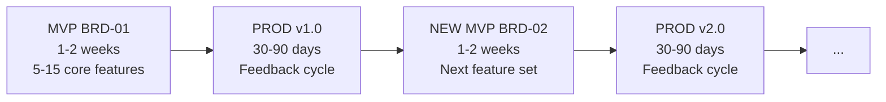
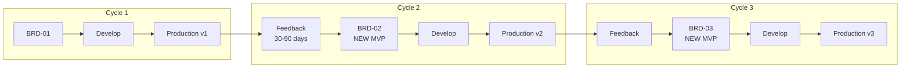

# Docs Flow Framework

**AI-First Specification-Driven Development (SDD) with Scalable Depth**

[](https://opensource.org/licenses/MIT)
[](./ai_dev_ssd_flow/SPEC_DRIVEN_DEVELOPMENT_GUIDE.md)
[](./governance/README.md)

> **AI-First Design**: This framework is designed for AI agents (Claude Code, Gemini CLI, GitHub Copilot) as the primary operators. Humans work *through* AI assistants, not directly with the framework. AI agents autonomously execute workflows, generate artifacts, and manage the development lifecycle.

---

## Core Philosophy: MVP → PROD → NEW MVP

**This is the fundamental lifecycle that drives all framework operations.**



### The Three Phases

| Phase | Duration | What Happens | Output |
|:------|:---------|:-------------|:-------|
| **MVP** | 1-2 weeks | Build 5-15 core features using BRD → PRD → ... → TASKS | Production deployment |
| **PROD** | 30-90 days | Operate, measure metrics, collect user feedback | Insights & priorities |
| **NEW MVP** | 1-2 weeks | Create NEW BRD for next feature set, repeat cycle | Production v2.0 |

### Key Principles

1. **Each BRD = One Iteration Cycle**: Never expand BRDs indefinitely - create new ones
2. **New Features = New BRD**: BRD-01 → BRD-02 → BRD-03 represent successive iterations
3. **Production is Always the Goal**: Every MVP cycle targets production deployment
4. **Cross-Cycle Traceability**: Use `@depends: BRD-01` to link iterations

### BRD Skills (Layer 1)

Use these BRD skills as a focused quality workflow:

- `doc-brd`: Create or update BRD content from template rules.
- `doc-brd-autopilot`: Orchestrate BRD generation/review/fix workflow.
- `doc-brd-validator`: Run structural and schema compliance checks.
- `doc-brd-reviewer`: Run semantic and business-quality review checks.
- `doc-brd-fixer`: Apply deterministic fixes from audit/review findings.
- `doc-brd-audit`: Single wrapper that runs validator → reviewer and produces one combined report for fixer.

Recommended default entrypoint: `/doc-brd-audit <BRD path>`.

### Why This Approach?

- **Prevents scope creep**: Fixed-scope BRDs (5-15 features) ship faster
- **Enables learning**: 30-90 day PROD phase validates assumptions before next iteration
- **Maintains velocity**: 1-2 week MVP cycles keep momentum high
- **Preserves knowledge**: Cross-BRD traceability builds on previous work
- **90%+ automation**: Framework automates 14 of 15 layers per cycle

> **See Also**: [MVP_WORKFLOW_GUIDE.md](./ai_dev_ssd_flow/MVP_WORKFLOW_GUIDE.md) for detailed workflow steps

---

## Repository Contents

This repository provides a **unified SDD framework** with three depth variants to match project complexity:

| Depth | Layers | Best For | Timeline |
|:------|:-------|:---------|:---------|
| **SDD-Lite** | REF → BRD-MVP → PRD-MVP → TASKS | MVPs, prototypes, solo + AI | 1-3 months |
| **SDD-Standard** | + EARS, ADR, SYS, REQ | Production apps, small teams | 3-6 months |
| **SDD-Full** | All 15 layers + 4-Gate CHG | Enterprise, regulated, multi-team | 6+ months |

### Key Directories

| Directory | Purpose |
|:----------|:--------|
| `ai_dev_ssd_flow/` | Layer documentation and templates (BRD, PRD, EARS, etc.) |
| `ai_dev_ssd_flow/AI_EXPERTS/` | AI Expert Board (COUNCIL) framework and templates |
| `governance/` | Project governance, setup guides, scripts, CI/CD templates |
| `governance/shared/` | Shared governance (PR review, branching, releases) |
| `project_knowledge/` | Standalone RAG + Graph knowledge base package for cross-project retrieval |
| `framework_rags/` | Shared RAG tooling and reference implementations |

### Quick Comparison

| Aspect | SDD-Lite | SDD-Standard | SDD-Full |
|:-------|:---------|:-------------|:---------|
| **Layers** | 3-4 | 7-8 | 15 |
| **Setup Time** | Hours | Days | Weeks |
| **Documentation** | PROJECT_PLAN + IPLANs | + EARS, ADR, SYS, REQ | Full traceability matrices |
| **Deployment** | Phase-gated | Phase-gated + review | 4-Gate CHG system |
| **Timeline** | 1-3 months | 3-6 months | 6+ months |
| **Team** | Solo/small + AI | Small team | Multiple teams |

### Choosing a Depth

**Use SDD-Lite when:**
- Building MVPs or prototypes
- Working solo or with small team + AI
- Need rapid iteration with phase-gated deployment
- Quick setup with GitHub Actions automation

**Use SDD-Standard when:**
- Building production applications
- Need moderate traceability (requirements chain)
- Small team with defined architecture decisions

**Use SDD-Full when:**
- Building enterprise software with regulatory requirements (SEC, FINRA, FDA, ISO)
- Need complete audit trails and bidirectional traceability
- Multiple teams working on complex systems
- Formal architecture decisions required (ADRs)

---

## Project Knowledge Base

The framework includes a standalone knowledge base package at `project_knowledge/` with:

- RAG module (PostgreSQL + pgvector)
- Graph module (Neo4j entity/relationship layer)
- Unified MCP server (`kb_*` tool contracts)
- Ingestion, backfill, and pilot validation scripts

### Operating Modes

Use one of two modes depending on project needs:

1. **File-only mode (no databases)**
  - Keep documents in project folders and use direct file reads/search.
  - Best for lightweight workflows and early-stage projects.
  - No `project_knowledge` runtime services required.

2. **Indexed mode (RAG + Graph + MCP)**
  - Ingest files into PostgreSQL (`pgvector`) and Neo4j for semantic retrieval and relationship context.
  - Best for cross-document retrieval, agent memory, and reusable knowledge queries.
  - Requires `project_knowledge` databases and MCP server.

Optional alternative: `framework_rags` provides an additional shared RAG runtime and may be used instead of built-in project RAG when needed. See `framework_rags/README.md`.

### Database Setup (Docker)

```bash
cd /opt/data/docs_flow_framework/project_knowledge
cp .env.example .env
docker compose -f docker-compose.db.yml --env-file .env up -d
```

### Key Entrypoints

```bash
# MCP server
python -m project_knowledge.mcp.server

# Folder ingestion
python project_knowledge/orchestrator.py /path/to/docs --pattern "*.yaml"

# Legacy backfill
python project_knowledge/scripts/backfill_legacy.py --source /path/to/legacy --dry-run

# Pilot validation
python project_knowledge/scripts/pilot_validate.py
```

---

## Framework 1: AI Dev Flow (SDD)

**Specification-Driven Development Template System for AI-Assisted Software Engineering**

### Overview

The AI Dev Flow Framework is a comprehensive template system for implementing AI-Driven Specification-Driven Development (SDD). It provides structured workflows, document templates, and traceability mechanisms to transform business requirements into production-ready code through a systematic, traceable approach optimized for AI-assisted development.

> MVP Note: When using the MVP track, all artifacts are single, flat files. Do not use document splitting or `DOCUMENT_SPLITTING_RULES.md`.

## Automation Philosophy: Maximum Velocity to Production

**PRIMARY GOAL: Fastest Transition from Business Idea to Production MVP**

AI Dev Flow eliminates manual bottlenecks through intelligent automation and strategic human oversight.

**Automation Capabilities**:
- **Quality-Gated Automation**: Replace mandatory checkpoints with AI-scored quality validation
  - Auto-approve if quality score ≥ threshold (90-95%)
  - Human review only if score fails
  - Result: Up to 93% automation (12 of 13 production layers)
- **AI Code Generation**: YAML specs → Production-ready code
- **Auto-Fix Testing**: 3 retry attempts reduce manual debugging
- **Strategic Checkpoints**: Only 5 critical decisions need human approval if quality score < threshold (90%)
- **Continuous Pipeline**: Automated validation, security scanning, deployment builds

**Human-in-the-Loop Checkpoints** (Quality Gates):

| Layer | Checkpoint | Why Human Review? |
|-------|------------|------------------|
| L1 (BRD) | Business owner approves | Strategic business alignment |
| L2 (PRD) | Product manager approves | Product vision validation |
| L5 (ADR) | Architect approves | Technical architecture decisions |
| L11 (Code) | Developer reviews | Code quality and security |
| L13 (Deployment) | Ops approves | Production release gating |

**Automated Layers** (No human intervention required):
- L3 (EARS), L4 (BDD), L6 (SYS), L7 (REQ), L8 (CTR), L9 (SPEC), L10 (TASKS), L12 (Tests)

**Result**: Dramatically reduced manual effort while maintaining quality through strategic oversight.

## MVP → PROD → NEW MVP: Detailed Reference

> **See [Core Philosophy](#core-philosophy-mvp--prod--new-mvp) above for the quick overview.**

This section provides detailed guidance on implementing the iterative lifecycle:



### The Three Phases

| Phase | Duration | Focus | Output |
|-------|----------|-------|--------|
| **MVP** | 1-2 weeks | Core features (5-15) | BRD → PRD → ... → Production |
| **PROD** | 30-90 days | Operate, measure, collect feedback | Metrics, user insights |
| **NEW MVP** | 1-2 weeks | Next feature set | NEW BRD → repeat cycle |

### Key Principles

1. **Each BRD = One Cycle**: Don't expand BRDs indefinitely; create new ones
2. **New Features = New BRD**: BRD-01, BRD-02, BRD-03 represent successive iterations
3. **Production is the Goal**: Every MVP aims for production deployment
4. **Cross-Cycle Traceability**: Link via `@depends: BRD-01` in Section 16.2

### When to Start a New MVP Cycle

- [ ] Current MVP deployed to production and stable
- [ ] User feedback collected (30-90 days minimum)
- [ ] New feature requirements identified and prioritized
- [ ] Current BRD scope complete (no pending P1s)

### Automation Across Cycles

| Stage | Automation Support |
|-------|-------------------|
| **Create MVP** | Full L1-L13 automation (90% automated) |
| **Fix Defects** | Auto-retry testing (3x), auto-fix capabilities |
| **Deploy to Production** | Automated build, validation, security scans |
| **Create NEW MVP** | Create new BRD-NN+1, auto-generate REQ→CODE |
| **Cross-Cycle Links** | Cumulative tags enable impact analysis |

### Lifecycle Example

| Cycle | BRD | Features | Result |
|-------|-----|----------|--------|
| 1 | BRD-01 | User authentication | Production v1 |
| 2 | BRD-02 | Social login (Google, GitHub) | Production v2 |
| 3 | BRD-03 | 2FA, session management | Production v3 |

Each cycle creates a NEW BRD with focused scope, maintaining velocity through automation and quality through human checkpoints.

## Template Selection (MVP-First Approach)

**MVP templates are the framework standard** for all BRDs. The "MVP-first" approach means every project uses the same template and follows the iterative lifecycle.

> **Note**: There is no separate "full" BRD template. The MVP-first approach encourages focused BRDs (5-15 requirements) with new features addressed in subsequent BRD cycles.

### Available MVP Templates (Layers 1-7)
| Layer | Artifact | Default Template |
|-------|----------|------------------|
| 1 | BRD | `BRD-MVP-TEMPLATE.md` |
| 2 | PRD | `PRD-MVP-TEMPLATE.md` |
| 3 | EARS | `EARS-MVP-TEMPLATE.md` |
| 4 | BDD | `BDD-MVP-TEMPLATE.feature` |
| 5 | ADR | `ADR-MVP-TEMPLATE.md` |
| 6 | SYS | `SYS-MVP-TEMPLATE.md` |
| 7 | REQ | `REQ-MVP-TEMPLATE.md` |

Layers 8-15 use full templates only (no MVP variants).

### Triggering Full Templates

When full documentation is required, trigger full templates using:

**Method 1 - Project Settings** (in `.autopilot.yaml` or `CLAUDE.md`):
```yaml
template_profile: enterprise  # or "full" or "strict"
```

**Method 2 - Prompt Keywords** (include in your request):
- "use full template"
- "use enterprise template"
- "enterprise mode"
- "full documentation"
- "comprehensive template"
- "regulatory compliance"

### Key Features

- **90%+ Automation**: 12 of 13 production layers generate automatically with quality gates
- **Strategic Human Oversight**: Only 5 critical checkpoints require human approval (if quality score < 90%)
- **Code-from-Specs**: Direct YAML-to-Python code generation from technical specifications
- **Auto-Fix Testing**: Failing tests trigger automatic code corrections (max 3 retries)
- **Continuous Delivery Loop**: MVP → Defects → Production → Next MVP rapid iteration
- **15-Layer Architecture**: Structured progression from strategy to validation (Strategy → BRD → PRD → EARS → BDD → ADR → SYS → REQ → CTR → SPEC → TSPEC → TASKS → Code → Tests → Validation)
- **Cumulative Tagging Hierarchy**: Each artifact includes tags from ALL upstream layers for complete audit trails
- **REQ v3.0 Support**: Enhanced REQ templates with sections 3-7 (interfaces/schemas/errors/config/quality attributes) for ≥90% SPEC-readiness
- **Tag-Based Auto-Discovery**: Lightweight @tags in code auto-generate bidirectional traceability matrices
- **Namespaced Traceability**: Unified `TYPE.NN.TT.SS` format (e.g., `BRD.01.01.30`) prevents ambiguity
- **Complete Traceability**: Bidirectional links between all artifacts (business → architecture → code)
- **AI-Optimized Templates**: Ready for Claude Code, Gemini, GitHub Copilot, and other AI coding assistants
- **Domain-Agnostic**: Adaptable to any software domain (finance, healthcare, e-commerce, SaaS, IoT)
- **Token-Efficient Design**: Optimized for AI tool context windows (50K-100K tokens per document)
- **Dual-File Contracts**: CTR uses `.md` (human) + `.yaml` (machine) for parallel development
- **Automated Validation**: Scripts for tag extraction, cumulative tagging validation, and matrix generation with CI/CD integration
- **Regulatory Compliance**: Complete audit trails meet SEC, FINRA, FDA, ISO requirements

## AI-First Architecture

This framework is designed for **AI agents as primary operators**. Humans interact through AI assistants rather than directly manipulating the framework.

### How It Works

```
Human Intent → AI Agent → Framework Execution → Production Code
     ↑                          │
     └──────── Feedback ────────┘
```

**AI Agent Responsibilities**:
- Parse issues and generate implementation plans (IPLAN)
- Execute SDD workflow (BRD → PRD → ... → Code)
- Create branches, implement changes, submit PRs
- Run automated reviews and respond to feedback
- Manage memory across sessions (MEMORY.md files)

**Human Responsibilities**:
- Define business requirements and intent
- Review and approve at quality gates (optional if score ≥90%)
- Provide feedback when AI agents escalate

### Agent Orchestration (.aidev)

The framework includes a native **Agent Orchestration System** located in `.aidev/`. This system implements the **BMAD Methodology**, deploying a swarm of 16 specialized AI agents (using Claude Code, Gemini, and Codex) to autonomously generate and validate the documentation artifacts.

**Key Capabilities**:
- **16-Layer Swarm**: A dedicated agent role for every layer (e.g., `product-manager` for PRDs, `architect` for ADRs)
- **Adversarial Pair Architecture**: Every step is executed by one model (e.g., Gemini) and reviewed by another (e.g., Claude) to minimize hallucinations
- **CLI-First**: Designed to work with standard CLI tools (`claude`, `gemini`, `codex`)
- **75+ Skills**: Comprehensive skill library for document generation, validation, and review

**[Get Started with the Framework](./ai_dev_ssd_flow/README.md)**

## Quality Gates and Traceability Validation

The framework includes automated quality gates that ensure each layer in the 16-layer SDD workflow meets maturity thresholds before progressing to downstream artifacts. Quality gates prevent immature artifacts from affecting subsequent development stages.

### Quality Gate Architecture

**Automatic Validation Points:**
- **Ready Score Gates**: Each artifact includes a maturity score (e.g., `EARS-Ready Score: [PASS] 95% ≥90%`)
- **Cumulative Tag Enforcement**: All artifacts must include traceability tags from upstream layers
- **Pre-commit Blocking**: Git hooks validate artifacts before commits

**Pre-commit Quality Gates:**
- `./scripts/validate_quality_gates.sh docs/PRD/PRD-001.md` - Validates individual artifact readiness
- Automatic validation during `git commit` on changes to `docs/` directory
- Refer to [`TRACEABILITY_VALIDATION.md`](./ai_dev_ssd_flow/TRACEABILITY_VALIDATION.md) for complete specification

### Quality Gate Workflow By Layer

Each layer transition has specific quality requirements:

| **From→To** | **Quality Gate** | **Validation Command** |
|-------------|------------------|------------------------|
| **Any Doc** | `COUNCIL_AUDIT` | `bash ai_dev_ssd_flow/scripts/doc_council_audit.sh <doc>` |
| **BRD→PRD** | `EARS-Ready Score ≥90%` | `./scripts/validate_quality_gates.sh docs/BRD/BRD-001.md` |
| **PRD→EARS** | `BDD-Ready Score ≥90%` | `./scripts/validate_quality_gates.sh docs/PRD/PRD-001.md` |
| **EARS→BDD** | `ADR-Ready Score ≥90%` | `./scripts/validate_quality_gates.sh docs/EARS/EARS-001.md` |
| **BDD→ADR** | `SYS-Ready Score ≥90%` | `./scripts/validate_quality_gates.sh docs/BDD/BDD-001.feature` |
| **ADR→SYS** | `REQ-Ready Score ≥90%` | `./scripts/validate_quality_gates.sh docs/ADR/ADR-001.md` |
| **SYS→REQ** | `SPEC-Ready Score ≥90%` | `./scripts/validate_quality_gates.sh docs/SYS/SYS-001.md` |
| **REQ→IMPL** | `IMPL-Ready Score ≥90%` | `./scripts/validate_quality_gates.sh docs/REQ/risk/lim/REQ-001.md` |
| **IMPL→SPEC** | `TASKS-Ready Score ≥90%` (SPEC) | `./scripts/validate_quality_gates.sh docs/SPEC/SPEC-001.yaml` |
| **CTR→SPEC** | Contract file validation | `./scripts/validate_quality_gates.sh docs/CTR/CTR-001.md` |

**Pre-commit Hook Integration:**
```bash
# Automatic validation on git commit
git add docs/SYS/SYS-001.md
git commit -m "Add SYS requirements"
# Output: [PASS] Quality gates passed! Ready for next layer transition.
```

### Git Pre-commit Hook Activation

To enable quality gates, the pre-commit hook must be active:

```bash
# Verify hook is active
ls -la .git/hooks/pre-commit
# Should show executable permissions

# If not active, make executable
chmod +x .git/hooks/pre-commit
```

**What Quality Gates Prevent:**
- [PASS] Undervalidating artifacts proceeding to next layer
- [PASS] Cumulatived traceability tag violations
- [PASS] Missing upstream dependencies
- [PASS] Regulator Paygrade compliance (SEC, FINRA, FDA, ISO audit requirements)
- [PASS] Implications from premature artifacts propagating downstream

### Outcome Metrics

Quality gates provide quantitative measures of framework effectiveness:

- **Maturity Index**: Percentage of artifacts with ≥90% ready scores
- **Traceability Compliance**: Bidirectional linking coverage percentage
- **Development Velocity**: Reduced iteration cycles through early quality validation
- **Regulatory Readiness**: Automated audit trail validation

## Quick Start

### 1. Clone the Repository

```bash
git clone https://github.com/[YOUR_ORG]/ai-dev-flow-framework.git
cd ai-dev-flow-framework
```

### 2. Multi-Project Setup (Recommended)

For organizations managing multiple projects with shared framework resources:

```bash
# Setup hybrid shared/custom resources for a project
./scripts/setup_project_hybrid.sh /path/to/your/project

# See detailed documentation:
# - Full guide: MULTI_PROJECT_SETUP_GUIDE.md
# - Quick reference: MULTI_PROJECT_QUICK_REFERENCE.md
```

**Benefits:**
- Single source of truth for skills, templates, and validation scripts
- Zero duplication across projects
- Instant framework updates across all projects
- Project-specific customizations supported

## Automation Capabilities

### What Gets Automated

| Capability | Status | Description |
|------------|--------|-------------|
| Document Generation | [PASS] 90% | 12 layers auto-generate from upstream (L1-L11) |
| Test Specs (TSPEC) | [PASS] Full | UTEST, ITEST, STEST, FTEST from upstream artifacts |
| Code Generation | [PASS] Full | SPEC+TASKS → Production Python code |
| Test Generation | [PASS] Full | BDD scenarios + TSPEC → pytest test suites |
| TDD Workflow | [PASS] Full | Red→Green validation with auto-fix |
| Change Management | [PASS] Full | 4-Gate CHG system with cascade detection |
| Traceability | [PASS] Full | Automated tag extraction and matrix generation |
| Validation | [PASS] Full | Contract compliance, security scans, coverage |
| Deployment | [WARN] Partial | Automated build, optional human-approved deployment |

### What Requires Human Review

- **Business decisions** (BRD, PRD) - Optional if quality score ≥90%
- **Architecture decisions** (ADR) - Optional if quality score ≥90%
- **Code quality** (before testing) - Optional if quality score ≥90%
- **Production deployment** (final gate) - Optional if quality score ≥90%

**Philosophy**: Automate repetitive work, preserve human judgment for critical decisions.

### 3. Explore the Templates

All templates are located in `ai_dev_ssd_flow/`:

```bash
cd ai_dev_ssd_flow
ls -R
```

### 4. Start Your Project

Choose your entry point based on project context. For new documents, prefer the `-MVP-TEMPLATE` variants (e.g., `BRD/BRD-MVP-TEMPLATE.md`, `PRD/PRD-MVP-TEMPLATE.md`, `ADR/ADR-MVP-TEMPLATE.md`). Use full templates for complex/regulatory projects.

**Option A: Greenfield Project (New)**
```bash
# Use project-init skill (if using Claude Code)
# Or manually create directory structure
mkdir -p docs/{BRD,PRD,EARS,BDD,ADR,SYS,REQ,IMPL,CTR,SPEC,TASKS}
```

**Option B: Existing Project**
```bash
# Copy templates to your project
cp -r ai_dev_ssd_flow/* your-project/docs/
```

### 5. Follow the Workflow

1. **Business Requirements** → Start with `BRD/BRD-MVP-TEMPLATE.md` (or full `BRD-TEMPLATE.md`)
2. **Product Requirements** → Create `PRD/PRD-MVP-TEMPLATE.md` (or full `PRD-TEMPLATE.md`)
3. **Formal Requirements** → Use `EARS/EARS-MVP-TEMPLATE.md` (or full `EARS-TEMPLATE.md`)
4. **Behavior Tests** → Write `BDD/BDD-MVP-TEMPLATE.feature` (or full `BDD-TEMPLATE.feature`)
5. **Architecture** → Document with `ADR/ADR-MVP-TEMPLATE.md` (or full `ADR-TEMPLATE.md`)
6. **System Design** → Create `SYS/SYS-MVP-TEMPLATE.md` (or full `SYS-TEMPLATE.md`)
7. **Atomic Requirements** → Define `REQ/REQ-MVP-TEMPLATE.md` (or full `REQ-TEMPLATE.md`)
8. **Implementation Plan** → Organize with `IMPL/IMPL-TEMPLATE.md` (Layer 8 - optional)
9. **API Contracts** → Specify with `CTR/CTR-TEMPLATE.md + .yaml` (Layer 9 - if interfaces)
10. **Technical Specs** → Design with `SPEC/SPEC-TEMPLATE.yaml` (Layer 10)
11. **Code Generation** → Guide with `TASKS/TASKS-TEMPLATE.md` (Layer 11)
12. **Implementation** → Write code with cumulative traceability tags (Layer 12)

### 6. Add Cumulative Traceability Tags (Recommended)

Embed cumulative tags in your code docstrings (each layer includes ALL upstream tags):

```python
"""Order service implementation.

@brd: BRD.01.01.30, BRD.01.01.06
@prd: PRD.02.07.05
@ears: EARS.03.24.01
@bdd: BDD.04.13.01
@adr: ADR-010
@sys: SYS.08.25.02
@req: REQ-045
@spec: SPEC-003
@tasks: TASKS-015
@impl-status: complete
"""
```

Then validate and auto-generate matrices:

```bash
# Extract tags from codebase
python ai_dev_ssd_flow/scripts/extract_tags.py --source src/ docs/ tests/ --output docs/generated/tags.json

# Validate cumulative tagging hierarchy
python ai_dev_ssd_flow/scripts/validate_tags_against_docs.py --validate-cumulative --strict

# Generate traceability matrices
python ai_dev_ssd_flow/scripts/generate_traceability_matrices.py --auto

# View generated matrices
ls docs/generated/matrices/
```

## Documentation Structure

### 15-Layer Architecture with Cumulative Tagging

The SDD workflow organizes artifacts into 15 distinct layers (0-14) with cumulative tagging hierarchy:

```
Layer 0: Strategy Layer
└── External strategy documents (product roadmaps, market analysis)

Layer 1: Business Requirements
└── BRD (Business Requirements Documents)

Layer 2: Product Requirements
└── PRD (Product Requirements Documents)

Layer 3: Formal Requirements
└── EARS (Event Analysis Requirements Specification)

Layer 4: Testing Requirements
└── BDD (Behavior-Driven Development - Gherkin scenarios)

Layer 5: Architecture Decisions
└── ADR (Architecture Decision Records)

Layer 6: System Requirements
└── SYS (System Requirements Specifications)

Layer 7: Atomic Requirements
└── REQ (Requirements Specifications)

Layer 8: Interface Contracts [OPTIONAL]
└── CTR (API Contracts - dual-file .md + .yaml)

Layer 9: Technical Specifications
└── SPEC (YAML Technical Specifications)

Layer 10: Test Specifications (TSPEC)
└── TSPEC (Unit, Integration, Smoke, Functional test specs)

Layer 11: Task Breakdown
└── TASKS (Code Generation Plans)

Layer 12: Implementation
└── Code (Source code with cumulative tags)

Layer 13: Testing
└── Tests (Test implementations with cumulative tags)

Layer 14: Validation
└── Validation → Review → Production

Layer 99: Council Audit (Quality Gate)
└── COUNCIL (AI Expert Board Audit Reports generated by 6-persona board)
```

**Cumulative Tagging**: Each layer includes tags from ALL upstream layers, creating complete audit trails for regulatory compliance.

### Complete Automation Pipeline

The framework supports full automation from requirements to production:

**Phase 1: Business Input** → Human provides initial requirements

**Phase 2: Document Generation (L1-L10)**
- Human review (optional if quality score ≥90%): BRD, PRD, ADR
- Auto-generates: EARS, BDD, SYS, REQ, CTR, SPEC, TASKS
- Quality gates ensure each layer meets 90% readiness before proceeding

**Phase 3: Code Generation (L11)**
- AI generates code from SPEC + TASKS + CTR
- Validates contract compliance and traceability
- Human reviews before testing (optional if quality score ≥90%)

**Phase 4: Test Execution (L12)**
- Auto-generates tests from BDD scenarios
- Runs unit, integration, and behavioral tests
- Auto-fix with max 3 retries
- Enforces 80% coverage minimum

**Phase 5: Validation & Deployment (L13)**
- Tag validation and traceability matrix generation
- Security scanning (bandit, safety)
- Build artifacts
- Human approves deployment to production (optional if quality score ≥90%)

See [SDD_AUTOMATION_WORKFLOW.md](./ai_dev_ssd_flow/SDD_AUTOMATION_WORKFLOW.md) for complete automation playbook.

### Template Categories

#### Business Layer Templates
- **BRD-TEMPLATE.md**: Comprehensive business requirements (general purpose)
- **PRD-TEMPLATE.md**: Product requirements with features and KPIs
- **EARS-TEMPLATE.md**: Formal WHEN-THE-SHALL-WITHIN requirements

#### Architecture Layer Templates
- **ADR-TEMPLATE.md**: Architecture decisions with context and consequences
- **SYS-TEMPLATE.md**: System requirements with functional requirements and quality attributes

#### Requirements Layer Templates
- **REQ-TEMPLATE.md**: Atomic requirements with acceptance criteria
- **BDD-TEMPLATE.feature**: Gherkin scenarios for behavior validation

#### Implementation Layer Templates
- **IMPL-TEMPLATE.md**: Implementation plans (WHO/WHEN) - project management [Layer 8]
- **CTR-TEMPLATE.md + .yaml**: API contracts (dual-file format) [Layer 9 - optional]
- **SPEC-TEMPLATE.yaml**: Technical specifications (HOW to build) [Layer 10]
- **TASKS-TEMPLATE.md**: Code generation plans (exact TODOs) [Layer 11]

## Traceability System

### Tag-Based Auto-Discovery with Cumulative Tagging (Recommended)

**Principle:** Code is the single source of truth. Each artifact includes tags from ALL upstream layers. Traceability matrices are auto-generated from these cumulative tags.

#### Cumulative Namespaced Tag Format

Embed cumulative tags in code docstrings using namespaced format:

```python
"""Order placement service implementation.

@brd: BRD.01.01.30, BRD.01.01.06
@prd: PRD.02.07.05
@ears: EARS.03.24.01
@bdd: BDD.04.13.01
@adr: ADR-010
@sys: SYS.08.25.02
@req: REQ-045
@spec: SPEC-003
@tasks: TASKS-015
@impl-status: complete
"""
```

**Format:** `@tag-type: TYPE.NN.TT.SS` (e.g., `@brd: BRD.01.01.30`)

**Tag Types (Cumulative Hierarchy):**
- `@brd:` - Business Requirements Document references (Layer 1)
- `@prd:` - Product Requirements Document references (Layer 2)
- `@ears:` - EARS requirements (Layer 3)
- `@bdd:` - BDD test scenarios (Layer 4)
- `@adr:` - Architecture Decision Records (Layer 5)
- `@sys:` - System Requirements references (Layer 6)
- `@req:` - Atomic Requirements (Layer 7)
- `@impl:` - Implementation Plans (Layer 8 - optional)
- `@ctr:` - API Contracts (Layer 9 - optional)
- `@spec:` - Technical Specifications (Layer 10)
- `@tasks:` - Task breakdowns (Layer 11)
- `@impl-status:` - Implementation status (pending|in-progress|complete|deprecated)

**Benefits:**
- [PASS] Complete audit trail from strategy to code
- [PASS] Regulatory compliance (SEC, FINRA, FDA, ISO)
- [PASS] Impact analysis (identify all affected artifacts)
- [PASS] Automated cumulative validation (scripts enforce hierarchy)
- [PASS] No sync drift (tags can't become stale)
- [PASS] Bidirectional matrices auto-generated
- [PASS] CI/CD enforceable (pre-commit hooks)

**Why Cumulative?**
- Each layer N includes tags from layers 1 through N-1
- Complete traceability chain from business requirements to implementation
- Instant impact analysis when upstream requirements change

**Why Unified Format?**
- `@brd: BRD.30` [FAIL] Ambiguous (which BRD document?)
- `@brd: BRD-001:30` [FAIL] Old format (deprecated)
- `@brd: BRD.01.01.30` [PASS] Unified format (current standard)

#### Traditional Section 7 (Legacy)

Manual traceability sections in documents remain supported during migration:

```markdown
## 7. Traceability

**Upstream:**
- [BRD-001](../BRD/BRD-001_requirements.md#BRD.01.01.30)

**Downstream:**
- [SPEC-003](../SPEC/SPEC-003_implementation.yaml)
```

> **Note**: Path examples above use relative paths within a project structure. Adjust paths based on your project's directory organization.

**Migration:** New projects should use tag-based approach. Existing projects can migrate gradually.

### ID Naming Standards

**SCOPE**: These standards apply ONLY to **documentation artifacts**, NOT source code.

#### [PASS] Apply To:
- Documentation files in `docs/` directories (BRD, PRD, REQ, ADR, SPEC, CTR, etc.)
- BDD feature files (`.feature`) in test directories

#### [FAIL] Do NOT Apply To:
- **Source code files**: Follow language-specific conventions (PEP 8 for Python, etc.)
- **Test files**: Follow testing framework conventions (pytest, Jest, JUnit, etc.)

All documentation follows standardized ID formats:

- **Format**: `TYPE-XXX` or `TYPE-XXX-YY`
- **Examples**: `BRD-001`, `REQ-003-02`, `ADR-1000`
- **Rules**:
  - XXX: 3-4 digit sequential number (001-999, then 1000-9999)
  - YY: 2-3 digit sub-document number (optional, 01-99)
  - Zero-padding maintained until range exceeded

### Traceability Matrices

**AUTO-GENERATED** from code tags (recommended) or manually maintained:

- `TYPE-000_TRACEABILITY_MATRIX.md`
- Tracks upstream sources (what drove this document)
- Tracks downstream artifacts (what derives from this document)
- **Generation**: `python scripts/generate_traceability_matrices.py --auto`

**Forward Matrix Example:**
```markdown
| Requirement | Implementing Files | Status |
|-------------|-------------------|--------|
| BRD.01.01.30 | src/services/account.py:12 | [PASS] Complete |
```

**Reverse Matrix Example:**
```markdown
| Source File | Requirements | Status |
|-------------|-------------|--------|
| src/services/account.py | BRD.01.01.30, SYS.01.25.06 | Complete |
```

### Migration Guide: Section 7 → Tags

**Step 1: Add Tags to New Code**
```python
# Start with new implementations
"""New feature implementation.

@brd: BRD.001.045
@spec: SPEC-005
@impl-status: in-progress
"""
```

**Step 2: Gradually Tag Existing Code**
- Prioritize high-value files (core services, critical paths)
- Add tags during code reviews or maintenance
- Use coverage reports to track progress

**Step 3: Validate Tags**
```bash
# Check tag format and document references
python ai_dev_ssd_flow/scripts/validate_tags_against_docs.py --strict
```

**Step 4: Generate Matrices**
```bash
# Auto-generate bidirectional matrices
python ai_dev_ssd_flow/scripts/generate_traceability_matrices.py --auto
```

**Step 5: Phase Out Section 7**
- Once tag coverage >80%, Section 7 becomes optional
- Keep Section 7 in documents, remove from code
- Let auto-generated matrices be the source of truth

**Coexistence:** Both approaches work together during migration. Section 7 in documents + tags in code.

## Key Concepts

### When to Create IMPL

**Create IMPL When**:
- Duration ≥2 weeks
- Teams ≥3
- Components ≥5
- Critical budget/timeline
- External dependencies

**Skip IMPL When**:
- Single component
- Duration <2 weeks
- Single developer
- Low risk

Reference: `ai_dev_ssd_flow/WHEN_TO_CREATE_IMPL.md`

### When to Create CTR (API Contracts)

**Create CTR When**:
- Public APIs
- Event schemas
- Data models
- Version compatibility requirements

**Skip CTR When**:
- Internal logic only
- No external interface
- No serialization

Reference: `ai_dev_ssd_flow/WHEN_TO_CREATE_IMPL.md#when-to-create-ctr`

### Dual-File CTR Format

API contracts require BOTH files:

- `CTR-001_api_contract.md` - Human-readable context, error handling, quality attributes
- `CTR-001_api_contract.yaml` - Machine-readable JSON Schema, OpenAPI/AsyncAPI

Policy: `ai_dev_ssd_flow/ADR/ADR-CTR_SEPARATE_FILES_POLICY.md`

## Token Limits (AI Tool Optimized)

### Claude Code (Primary)
- Standard: 50,000 tokens (200KB)
- Maximum: 100,000 tokens (400KB)

### Gemini CLI (Secondary)
- Use file read tool (not `@`) for files >10,000 tokens
- No splitting needed

### GitHub Copilot
- Keep <30KB or create companion summaries

### General Rules
- Create sequential files (doc_001.md, doc_002.md) only when exceeding 100,000 tokens
- Reference: `ai_dev_ssd_flow/AI_TOOL_OPTIMIZATION_GUIDE.md`

## Documentation Standards

### Language Requirements
- Objective, factual language only
- No promotional content or subjective claims
- Document implementation complexity (scale 1-5)
- Include resource requirements and constraints
- Specify failure modes and error conditions

### Code Separation
- No Python code blocks in markdown documentation
- Use Mermaid flowcharts for logic representation
- Create separate `.py` files for code examples
- Reference format: `[See Code Example: filename.py - function_name()]`

### Content Filtering

**Eliminate**:
- Benefit statements ("This will help you...")
- Efficiency claims ("Faster than...")
- Ease-of-use assertions ("Simply..." "Just...")
- Superlative adjectives (best, optimal, superior)

**Enforce**:
- Imperative verb forms for procedures
- Conditional statements for error handling
- Precise data type specifications
- Measurable impact criteria

## Testing Infrastructure

The framework includes a complete testing infrastructure aligned with the TSPEC layer (Layer 10).

### Test Types (TSPEC Layer)

| Type | Code | Directory | Purpose |
|------|------|-----------|----------|
| UTEST | 40 | `tests/unit/` | Unit tests (fast, isolated) |
| ITEST | 41 | `tests/integration/` | Integration tests (component interaction) |
| STEST | 42 | `tests/smoke/` | Smoke tests (post-deployment health) |
| FTEST | 43 | `tests/functional/` | Functional tests (end-to-end) |

### Quick Start

```bash
# Run all tests
python tests/scripts/run_tests.py --type all

# Run specific test type
python tests/scripts/run_tests.py --type utest --save

# Run with coverage
python tests/scripts/run_tests.py --type all --coverage

# Compare test results for regression detection
python tests/scripts/compare_test_results.py baseline.json current.json
```

### Test Management Scripts

| Script | Purpose |
|--------|--------|
| `tests/scripts/run_tests.py` | Unified test runner with result saving |
| `tests/scripts/compare_test_results.py` | Regression detection between runs |
| `tests/scripts/archive_test_results.py` | Result archival and trend tracking |
| `tests/scripts/generate_coverage_report.py` | Coverage report generation |
| `ai_dev_ssd_flow/10_TSPEC/scripts/manage_test_registry.py` | Central test catalog management |

### Test Registry

The test registry (`ai_dev_ssd_flow/10_TSPEC/test_registry.yaml`) provides a central catalog of all tests with:
- Test ID and type tracking
- Upstream artifact references (REQ, SPEC, CTR)
- Execution history and results
- Coverage targets

```bash
# List all registered tests
python ai_dev_ssd_flow/10_TSPEC/scripts/manage_test_registry.py --list

# Add a test to registry
python ai_dev_ssd_flow/10_TSPEC/scripts/manage_test_registry.py --add UTEST-001 UTEST "Test name" "tests/unit/test_file.py::test_func"

# Validate registry
python ai_dev_ssd_flow/10_TSPEC/scripts/manage_test_registry.py --validate
```

### CI/CD Integration

GitHub Actions workflow (`.github/workflows/test-pipeline.yml`) provides:
- Automated test execution on push/PR
- Parallel test type execution
- Coverage reporting
- Regression detection against baseline
- Artifact archival

### Coverage Requirements

| Metric | Threshold |
|--------|----------|
| Unit test coverage | ≥80% |
| Branch coverage | Enabled |
| Fail on decrease | Configurable |

Reference: `ai_dev_ssd_flow/10_TSPEC/`, `tests/README.md`

---

## Validation Tools

### Cumulative Tag Automation (v2.0 - Recommended)

**Validation Scripts Location**: `ai_dev_ssd_flow/scripts/` (copy to your project or use directly from framework)

```bash
# Extract cumulative tags from all source files
python ai_dev_ssd_flow/scripts/extract_tags.py --source src/ docs/ tests/ --output docs/generated/tags.json

# Validate cumulative tagging hierarchy (ENFORCES all upstream tags present)
python ai_dev_ssd_flow/scripts/validate_tags_against_docs.py \
  --source src/ docs/ tests/ \
  --validate-cumulative \
  --strict

# Generate bidirectional traceability matrices
python ai_dev_ssd_flow/scripts/generate_traceability_matrices.py --auto

# Complete workflow (extract + validate cumulative + generate)
python ai_dev_ssd_flow/scripts/generate_traceability_matrices.py --auto
```

**CI/CD Integration:**
```yaml
# .github/workflows/traceability.yml
- name: Validate Cumulative Tagging Hierarchy
  run: |
    python ai_dev_ssd_flow/scripts/extract_tags.py --source src/ docs/ tests/ --output docs/generated/tags.json
    python ai_dev_ssd_flow/scripts/validate_tags_against_docs.py --validate-cumulative --strict
```

### Legacy Validation Scripts

For projects using traditional Section 7:

```bash
# Validate requirement IDs and format
python ai_dev_ssd_flow/scripts/validate_requirement_ids.py

# Validate traceability matrices
python ai_dev_ssd_flow/scripts/validate_traceability_matrix.py --matrix path/to/matrix.md --input path/to/docs/

# Update traceability matrices incrementally
python ai_dev_ssd_flow/scripts/update_traceability_matrix.py --matrix path/to/matrix.md --input path/to/docs/

```

### Quality Gates

Pre-commit checklist:

**Cumulative Tagging Projects (v2.0):**
- [ ] All artifacts include cumulative tags from ALL upstream layers
- [ ] Tags use unified format (TYPE.NN.TT.SS)
- [ ] Tag extraction successful: `python ai_dev_ssd_flow/scripts/extract_tags.py --source src/ docs/ tests/`
- [ ] Cumulative validation passes: `python ai_dev_ssd_flow/scripts/validate_tags_against_docs.py --validate-cumulative --strict`
- [ ] No gaps in cumulative tag chains (e.g., if @adr exists, @brd through @bdd must exist)
- [ ] Traceability matrices generated: `python ai_dev_ssd_flow/scripts/generate_traceability_matrices.py --auto`
- [ ] Implementation status tags present (@impl-status: complete|in-progress|pending)

**Traditional Projects (Legacy):**
- [ ] IDs comply with naming standards (XXX or XXX-YY format)
- [ ] No ID collisions (each XXX unique)
- [ ] All cross-references use valid markdown links
- [ ] Section 7 Traceability complete in all documents

**All Projects:**
- [ ] IMPL decision validated (created if complex, skipped if simple)
- [ ] CTR decision validated (created if interface, skipped if internal)
- [ ] SPEC interfaces match CTR contracts (if applicable)
- [ ] CTR dual-file format (both .md and .yaml exist)
- [ ] BDD scenarios have traceability references
- [ ] File size under 50,000 tokens standard, 100,000 maximum
- [ ] Layer numbering correct (0-15, not simplified diagram labels)

## Integration with AI Coding Tools

### Claude Code

Use the `doc-flow` skill for guided workflow:

```
User: "Implement position risk limit validation using doc-flow"
Assistant: [Launches doc-flow skill, creates full artifact chain]
```

### Gemini CLI

For files >10,000 tokens, use file read tool:

```bash
gemini read path/to/large_file.md
```

### GitHub Copilot

Keep documents <30KB or create companion summaries for context.

## Project Structure

```
aidoc-flow-framework/
├── README.md                          # This file
├── MULTI_PROJECT_SETUP_GUIDE.md       # Multi-project hybrid setup guide
├── MULTI_PROJECT_QUICK_REFERENCE.md   # Quick reference for common multi-project tasks
├── ai_dev_ssd_flow/                       # Template system (v2.2)
│   ├── index.md                       # Workflow overview with Mermaid diagram
│   ├── README.md                      # Framework documentation
│   ├── SPEC_DRIVEN_DEVELOPMENT_GUIDE.md  # Authoritative SDD methodology
│   ├── ID_NAMING_STANDARDS.md         # Document ID format rules
│   ├── THRESHOLD_NAMING_RULES.md      # Threshold and limit naming standards
│   ├── TRACEABILITY.md                # Cumulative tagging hierarchy
│   ├── TRACEABILITY_SETUP.md          # Validation setup and CI/CD integration
│   ├── TRACEABILITY_VALIDATION.md     # Validation procedures
│   ├── TRACEABILITY_MATRIX_COMPLETE-TEMPLATE.md  # Complete matrix template
│   ├── COMPLETE_TAGGING_EXAMPLE.md    # End-to-end cumulative tagging example
│   ├── DOMAIN_ADAPTATION_GUIDE.md     # Domain customization guide
│   ├── DOMAIN_SELECTION_QUESTIONNAIRE.md  # Domain selection tool
│   ├── FINANCIAL_DOMAIN_CONFIG.md     # Financial sector configuration
│   ├── SOFTWARE_DOMAIN_CONFIG.md      # Generic software configuration
│   ├── GENERIC_DOMAIN_CONFIG.md       # Minimal configuration template
│   ├── CONTRACT_DECISION_QUESTIONNAIRE.md  # CTR decision guide
│   ├── WHEN_TO_CREATE_IMPL.md         # IMPL decision guide
│   ├── PLATFORM_VS_FEATURE_BRD.md     # BRD type selection guide
│   ├── AI_TOOL_OPTIMIZATION_GUIDE.md  # AI tool optimization
│   ├── AI_ASSISTANT_RULES.md          # Rules for AI assistants
│   ├── PROJECT_SETUP_GUIDE.md         # Single-project setup guide
│   ├── PROJECT_KICKOFF_TASKS.md       # Project initialization checklist
│   ├── QUICK_REFERENCE.md             # Quick reference guide
│   ├── MATRIX_TEMPLATE_COMPLETION_GUIDE.md  # How to fill traceability matrices
│   ├── BRD/                           # Business requirements templates (Layer 1)
│   ├── PRD/                           # Product requirements templates (Layer 2)
│   ├── EARS/                          # Formal requirements templates (Layer 3)
│   ├── BDD/                           # Behavior-driven test templates (Layer 4)
│   ├── ADR/                           # Architecture decision templates (Layer 5)
│   ├── SYS/                           # System requirements templates (Layer 6)
│   ├── REQ/                           # Atomic requirements templates (Layer 7)
│   ├── IMPL/                          # Implementation plan templates (Layer 8)
│   ├── CTR/                           # API contract templates - dual-file (Layer 9)
│   ├── SPEC/                          # Technical specification templates (Layer 10)
│   ├── 10_TSPEC/                      # Test specification templates (Layer 10b)
│   ├── TASKS/                         # Code generation templates (Layer 11)
│   ├── CHG/                           # Change management templates
│   └── scripts/                       # Validation and automation scripts
│       ├── extract_tags.py            # Extract tags from codebase
│       ├── validate_tags_against_docs.py  # Validate cumulative tagging
│       ├── generate_traceability_matrices.py  # Generate matrices
│       ├── generate_traceability_matrix.py    # Generate single matrix
│       ├── validate_traceability_matrix.py    # Validate matrix structure
│       ├── validate_traceability_matrix_enforcement.py  # Matrix enforcement
│       ├── update_traceability_matrix.py      # Update existing matrices
│       ├── validate_requirement_ids.py  # Validate REQ-ID format
│       ├── validate_req_spec_readiness.py  # REQ SPEC-readiness scoring
│       ├── validate_documentation_paths.py  # Path consistency validation
│       ├── validate_links.py          # Markdown link validation
│       ├── validate_brd_template.sh   # BRD template compliance
│       ├── validate_req_template.sh   # REQ template compliance
│       └── README.md                  # Complete scripts documentation
├── scripts/                           # Project setup and test scripts (root level)
│   ├── setup_project_hybrid.sh        # Automated hybrid project setup
│   ├── standardize_workflow_refs.sh   # Standardize workflow references
│   ├── run_tests.py                   # Unified test runner
│   ├── compare_test_results.py        # Regression detection
│   ├── archive_test_results.py        # Result archival
│   └── generate_coverage_report.py    # Coverage reports
├── tests/                             # Test suite (aligned with TSPEC Layer 10)
│   ├── conftest.py                    # Shared fixtures
│   ├── test_config.yaml               # Test configuration
│   ├── requirements.txt               # Test dependencies
│   ├── unit/                          # UTEST - Unit tests
│   ├── integration/                   # ITEST - Integration tests
│   ├── smoke/                         # STEST - Smoke tests
│   ├── functional/                    # FTEST - Functional tests
│   └── results/                       # Test result archives
├── work_plans/                        # Implementation plans
└── docs/                              # Additional documentation
```

## Example Workflow

### Complete Artifact Chain with Cumulative Tagging

```
Layer 0: Strategy Document (no tags)
    ↓
Layer 1: BRD-001: Business Requirements
    ↓
Layer 2: PRD-001: Product Requirements (@brd)
    ↓
Layer 3: EARS-001: Formal Requirements (@brd, @prd)
    ↓
Layer 4: BDD-001: Behavior Tests (@brd, @prd, @ears)
    ↓
Layer 5: ADR-001: Architecture Decision (@brd→@bdd)
    ↓
Layer 6: SYS-001: System Requirements (@brd→@adr)
    ↓
Layer 7: REQ-001: Atomic Requirement (@brd→@sys)
    ↓
Layer 8: IMPL-001: Implementation Plan [OPTIONAL] (@brd→@req)
    ↓
Layer 9: CTR-001: API Contract (.md + .yaml) [IF INTERFACE] (@brd→@impl)
    ↓
Layer 10: SPEC-001: Technical Specification (YAML) (@brd→@req + optional impl/ctr)
    ↓
Layer 11: TASKS-001: Code Generation Plan (@brd→@spec)
    ↓
Layer 12: Code Implementation (cumulative tags @brd→@tasks)
    ↓
Layer 13: Test Suite (cumulative tags @brd→@code)
    ↓
Layer 14: Production Validation (all upstream tags)
```

**Each layer includes ALL upstream tags** for complete audit trail and regulatory compliance.

## Use Cases

### Financial Trading Systems
- Use `BRD-TEMPLATE.md` with domain-specific customization
- Example: Options trading strategy implementation
- Full traceability from strategy documents to production code

### General Software Projects
- Use `BRD-TEMPLATE.md` for comprehensive business requirements
- Customize based on project complexity using domain adaptation guide
- Scales from small prototypes to enterprise systems

### Microservices Architecture
- Use CTR dual-file format for service contracts
- Define interfaces before implementation
- Enable parallel development across teams

### Regulatory Compliance Projects
- Complete audit trails via traceability matrices
- Document all architectural decisions (ADR)
- Track requirements through implementation

## Contributing

Contributions welcome! Please:

1. Fork the repository
2. Create a feature branch (`git checkout -b feature/improvement`)
3. Follow existing template structure
4. Update traceability documentation
5. Submit a pull request

## Automation & Workflow

**MVP Autopilot Guide (v6.0)**:
- [ai_dev_ssd_flow/AUTOPILOT/MVP_AUTOPILOT.md](./ai_dev_ssd_flow/AUTOPILOT/MVP_AUTOPILOT.md) - Complete automation guide with TSPEC, TDD, and CHG
- [ai_dev_ssd_flow/AUTOPILOT/MVP_GITHUB_CICD_INTEGRATION_PLAN.md](./ai_dev_ssd_flow/AUTOPILOT/MVP_GITHUB_CICD_INTEGRATION_PLAN.md) - CI/CD integration plan
- [ai_dev_ssd_flow/AUTOPILOT/MVP_PIPELINE_END_TO_END_USER_GUIDE.md](./ai_dev_ssd_flow/AUTOPILOT/MVP_PIPELINE_END_TO_END_USER_GUIDE.md) - End-to-end user guide

**Configuration**:
- [ai_dev_ssd_flow/AUTOPILOT/config/default.yaml](./ai_dev_ssd_flow/AUTOPILOT/config/default.yaml) - Default configuration
- [ai_dev_ssd_flow/AUTOPILOT/config/tdd.yaml](./ai_dev_ssd_flow/AUTOPILOT/config/tdd.yaml) - TDD mode configuration
- [ai_dev_ssd_flow/AUTOPILOT/config/quality_gates.yaml](./ai_dev_ssd_flow/AUTOPILOT/config/quality_gates.yaml) - Quality gate settings

**Core Scripts**:
- [ai_dev_ssd_flow/AUTOPILOT/scripts/mvp_autopilot.py](./ai_dev_ssd_flow/AUTOPILOT/scripts/mvp_autopilot.py) - Main orchestration script
- [ai_dev_ssd_flow/AUTOPILOT/scripts/validate_metadata.py](./ai_dev_ssd_flow/AUTOPILOT/scripts/validate_metadata.py) - Metadata validator
- [ai_dev_ssd_flow/AUTOPILOT/scripts/validate_quality_gates.py](./ai_dev_ssd_flow/AUTOPILOT/scripts/validate_quality_gates.py) - Quality gate checker (Python)
- [ai_dev_ssd_flow/AUTOPILOT/scripts/validate_quality_gates.sh](./ai_dev_ssd_flow/AUTOPILOT/scripts/validate_quality_gates.sh) - Quality gate validator (shell)

**TDD Scripts (v6.0)**:
- [ai_dev_ssd_flow/AUTOPILOT/scripts/analyze_test_requirements.py](./ai_dev_ssd_flow/AUTOPILOT/scripts/analyze_test_requirements.py) - Parse tests, extract traceability
- [ai_dev_ssd_flow/AUTOPILOT/scripts/generate_spec_tdd.py](./ai_dev_ssd_flow/AUTOPILOT/scripts/generate_spec_tdd.py) - Generate test-aware SPEC
- [ai_dev_ssd_flow/AUTOPILOT/scripts/validate_tdd_stage.py](./ai_dev_ssd_flow/AUTOPILOT/scripts/validate_tdd_stage.py) - Validate Red/Green state
- [ai_dev_ssd_flow/AUTOPILOT/scripts/update_test_traceability.py](./ai_dev_ssd_flow/AUTOPILOT/scripts/update_test_traceability.py) - Update PENDING tags
- [ai_dev_ssd_flow/AUTOPILOT/scripts/generate_integration_tests.py](./ai_dev_ssd_flow/AUTOPILOT/scripts/generate_integration_tests.py) - Generate integration tests
- [ai_dev_ssd_flow/AUTOPILOT/scripts/generate_smoke_tests.py](./ai_dev_ssd_flow/AUTOPILOT/scripts/generate_smoke_tests.py) - Generate smoke tests
- [ai_dev_ssd_flow/AUTOPILOT/scripts/validate_tdd_e2e.py](./ai_dev_ssd_flow/AUTOPILOT/scripts/validate_tdd_e2e.py) - End-to-end TDD validation

**Quick Start**:

```bash
# Standard MVP generation
python3 ai_dev_ssd_flow/AUTOPILOT/scripts/mvp_autopilot.py \
  --root . \
  --intent "My MVP" \
  --slug my_mvp \
  --auto-fix \
  --report markdown

# TDD mode (test-first development)
python3 ai_dev_ssd_flow/AUTOPILOT/scripts/mvp_autopilot.py \
  --root . \
  --intent "My MVP" \
  --slug my_mvp \
  --tdd-mode \
  --auto-fix

# Change Management mode
python3 ai_dev_ssd_flow/AUTOPILOT/scripts/mvp_autopilot.py \
  --root . \
  --chg-mode \
  --chg-level L2 \
  --auto-fix

# GitHub Actions
make docs  # Runs mvp-autopilot.yml workflow
```

## Reviewer and Fixer Skills System

The framework includes a comprehensive quality assurance system with reviewer skills (v1.4) and fixer skills (v2.0) for all 11 artifact types.

### Reviewer Skills (v1.4)

Reviewer skills perform comprehensive content review with mandatory drift detection:

| Artifact | Skill | Cache Location |
|----------|-------|----------------|
| BRD | `doc-brd-reviewer` | `docs/01_BRD/{folder}/.drift_cache.json` |
| PRD | `doc-prd-reviewer` | `docs/02_PRD/{folder}/.drift_cache.json` |
| EARS | `doc-ears-reviewer` | `docs/03_EARS/{folder}/.drift_cache.json` |
| BDD | `doc-bdd-reviewer` | `docs/04_BDD/{folder}/.drift_cache.json` |
| ADR | `doc-adr-reviewer` | `docs/05_ADR/{folder}/.drift_cache.json` |
| SYS | `doc-sys-reviewer` | `docs/06_SYS/{folder}/.drift_cache.json` |
| REQ | `doc-req-reviewer` | `docs/07_REQ/{folder}/.drift_cache.json` |
| CTR | `doc-ctr-reviewer` | `docs/08_CTR/{folder}/.drift_cache.json` |
| SPEC | `doc-spec-reviewer` | `docs/09_SPEC/{folder}/.drift_cache.json` |
| TSPEC | `doc-tspec-reviewer` | `docs/10_TSPEC/{folder}/.drift_cache.json` |
| TASKS | `doc-tasks-reviewer` | `docs/11_TASKS/{folder}/.drift_cache.json` |

Layer 10 subtype reviewer coverage also includes:
- `doc-utest-reviewer`
- `doc-itest-reviewer`
- `doc-ftest-reviewer`
- `doc-ptest-reviewer`
- `doc-sectest-reviewer`
- `doc-stest-reviewer`

**Mandatory Three-Phase Drift Detection**:
1. **Load Cache**: Read existing `.drift_cache.json` or create new
2. **Detect Drift**: Compare SHA-256 hashes of upstream documents
3. **Update Cache**: Write updated cache after every review (MANDATORY)

**Drift Cache Schema**:
```json
{
  "schema_version": "1.0",
  "document_id": "BRD-01",
  "last_reviewed": "2026-02-10T16:30:00",
  "reviewer_version": "1.4",
  "upstream_documents": {
    "../../00_REF/source.md": {
      "hash": "sha256:abc123...",
      "last_modified": "2026-02-10T15:34:26",
      "file_size": 50781
    }
  },
  "review_history": [
    {"date": "2026-02-10T16:30:00", "score": 97, "report_version": "v002"}
  ]
}
```

### Fixer Skills (v2.0)

Fixer skills implement tiered auto-merge with no-deletion policy:

| Tier | Change % | Action | Version Increment |
|------|----------|--------|-------------------|
| **Tier 1** | <5% | Auto-merge additions/updates | Patch (1.0→1.0.1) |
| **Tier 2** | 5-15% | Auto-merge + detailed changelog | Minor (1.0→1.1) |
| **Tier 3** | >15% | Archive + trigger regeneration | Major (1.x→2.0) |

**No Deletion Policy**:
- Content is never deleted, only marked as deprecated
- Markers: `[DEPRECATED]`, `[SUPERSEDED]`, `[CANCELLED]`, `@deprecated`
- Archive manifest created for Tier 3 changes
- Complete audit trail maintained

### Audit Wrapper Compatibility

Audit wrappers run validator + reviewer and produce combined reports for fixer workflows.

- Preferred output contract: `*.A_audit_report_vNNN.md`
- Legacy compatibility: fixers continue accepting `*.R_review_report_vNNN.md`
- Included wrappers cover core artifacts, TSPEC subtype workflows, and TASKS (`doc-tasks-audit`)

**Change Percentage Calculation**:
```python
change_percentage = ((added_lines + deleted_lines) / original_lines) * 100
```

### ISO 8601 Datetime Format

All timestamps use ISO 8601 format: `YYYY-MM-DDTHH:MM:SS`
- Enables same-day drift detection with timestamp precision
- Required in: frontmatter, review reports, drift cache, changelogs
- Example: `2026-02-10T16:30:00`

---

## Development Tools

A comprehensive suite of tools is included for building, testing, and debugging AI agents:

| Tool | Category | Purpose |
|------|----------|--------|
| **[Mock MCP Server](dev_tools/mcp/README.md)** | Mocking | Simulate MCP tools for offline testing |
| **[Mock A2A Server](dev_tools/a2a/README.md)** | Mocking | Simulate agent-to-agent interactions |
| **[Agent Evaluator](dev_tools/evaluator/README.md)** | Testing | "LLM-as-a-Judge" semantic testing |
| **[Chaos Proxy](dev_tools/chaos_proxy/README.md)** | Testing | Test agent resilience to network faults |
| **[Log Analyzer](dev_tools/log_analyzer/README.md)** | Observability | Calculate token usage and costs |
| **[Context Viewer](dev_tools/context_viewer/README.md)** | Observability | Visual debugger for agent prompts |
| **[Headless Tracing](dev_tools/tracing/README.md)** | Observability | OpenTelemetry implementation for visual tracing |
| **[Event Replay](dev_tools/event_replay/README.md)** | Data | Time-travel debugging with historical data |
| **[Runtime Validator](dev_tools/safety/README.md)** | Safety | Ensure agent handling of safe structured outputs |
| **[Human Inspector](dev_tools/inspector/README.md)** | Manual | Interactive REPL for manual debugging |

**[View All Development Tools](dev_tools/README.md)**

---

## SDD Governance

**AI-First Project Governance, CI/CD, and Setup Automation**

### Overview

The `governance/` directory provides AI-first project governance that applies to all SDD depths. AI agents autonomously manage the issue lifecycle, PR reviews, and deployment workflows with minimal human intervention.

### Framework Components

| Directory | Purpose |
|:----------|:--------|
| `governance/` | Project governance documentation, rules, templates, and helper scripts |
| `.claude/skills/` | 75+ Claude Code skills for document generation, validation, and review |
| `.github/workflows/` | 24+ GitHub Actions for CI/CD, AI review, and automation |

### Key Features

| Feature | Description |
|:--------|:------------|
| **Agent Dispatch Workflow** | `agent-dispatch.yml` triggers Claude Code on `ai:ready` label |
| **Phase-Gated Deployment** | dev → staging → prod with automated gates |
| **AI Label Lifecycle** | `ai:ready` → `ai:in-progress` → `ai:review-requested` |
| **AI PR Review** | `ai-review.yml` runs automated code review via Claude Code CLI |
| **Acceptance Criteria Verification** | `verify-acceptance.yml` validates PR against issue checkboxes |
| **IPLAN Auto-Scaffolding** | Generate implementation plans from issues |
| **Multi-Cloud Support** | Setup scripts for GCP, AWS, Azure |
| **IPLAN Templates** | Session-scoped implementation plans |
| **AI Agent Memory** | MEMORY.md files for session persistence |

### Governance Automation (v2.0)

| Workflow | Trigger | Description |
|:---------|:--------|:------------|
| `agent-dispatch.yml` | `ai:ready` label | Dispatch issue to Claude Code for implementation |
| `pr-issue-link.yml` | PR opened | Post PR link to linked issue |
| `ai-review.yml` | PR ready | AI code review + post summary to issue |
| `verify-acceptance.yml` | PR ready | Validate against issue acceptance criteria |
| `deploy-staging.yml` | Phase complete | Generate deployment notes |
| `staging-signoff.yml` | Manual trigger | Evaluate production readiness |
| `check-phase-completion.yml` | Issue closed | Generate phase completion report |
| `sync-tasks.yml` | Manual trigger | Bidirectional TASKS ↔ GitHub sync |
| `validate-governance.yml` | CI/pre-commit | Detect documentation drift |
| `validate-config.yml` | Nightly/manual | Verify secrets and branch protection |

### Quick Start

```bash
# Copy governance to your project
cp -r governance/ /path/to/your/project/governance/
cp -r governance/shared/ /path/to/your/project/governance/

# Configure placeholders
cd /path/to/your/project
./governance/scripts/project_setup/validate_configuration.sh

# Replace placeholders (see CONFIG.md for full list)
find . -type f \( -name "*.md" -o -name "*.yml" \) \
  -exec sed -i 's|{PROJECT_PREFIX}|myproj|g' {} \;
```

### Governance Structure

```
governance/
├── SDD_DEPTH_GUIDE.md           # Lite vs Standard vs Full
├── sdd/                         # SDD governance (all depths)
│   ├── GOVERNANCE_RULES.md      # Operational policies
│   ├── CONFIG.md                # 50+ placeholder variables
│   ├── SETUP_GUIDE.md           # Step-by-step customization
│   ├── CLOUD_GUIDE.md           # GCP/AWS/Azure setup
│   ├── AI_ISSUE_LIFECYCLE.md    # Issue workflow
│   ├── templates/               # Project templates
│   │   ├── CLAUDE.md
│   │   ├── README_AIAGENT.md
│   │   └── qa/                  # QA templates
│   ├── scripts/                 # Setup automation
│   │   └── project_setup/cloud/
│   └── plans/                   # IPLAN templates
└── shared/                      # Shared governance
    ├── AI_PR_Review/            # AI code review docs
    ├── BRANCHING_STRATEGY.md
    ├── DEFINITION_OF_DONE.md
    └── RELEASE_PROCESS.md
```

### Deployment Pipeline

```
Issue Closed (phase N)
       │
       ▼
deploy-dev.yml (phase N)
       │
       ▼ (all phases complete)
check-all-phases-dev.yml
       │
       ▼
deploy-staging.yml
       │
       ▼ (manual + 2 approvers)
deploy-prod.yml (gradual rollout)
```

### Documentation

- [SDD_DEPTH_GUIDE.md](./governance/SDD_DEPTH_GUIDE.md) - Choose Lite/Standard/Full
- [GOVERNANCE_RULES.md](./governance/GOVERNANCE_RULES.md) - Operational policies
- [CONFIG.md](./governance/CONFIG.md) - All placeholder variables
- [SETUP_GUIDE.md](./governance/SETUP_GUIDE.md) - Customization guide
- [CLOUD_GUIDE.md](./governance/CLOUD_GUIDE.md) - Cloud provider setup

---

## License

MIT License - See LICENSE file for details

## References

### Core Documentation
- [Workflow Guide](./ai_dev_ssd_flow/SPEC_DRIVEN_DEVELOPMENT_GUIDE.md) - Complete SDD methodology
- [Index](./ai_dev_ssd_flow/index.md) - Template overview with workflow diagram
- [Quick Reference](./ai_dev_ssd_flow/QUICK_REFERENCE.md) - Quick reference for common tasks
- [ID Standards](./ai_dev_ssd_flow/ID_NAMING_STANDARDS.md) - Naming conventions
- [Threshold Naming Rules](./ai_dev_ssd_flow/THRESHOLD_NAMING_RULES.md) - Threshold and limit naming standards
- [Traceability](./ai_dev_ssd_flow/TRACEABILITY.md) - Cumulative tagging hierarchy
- [Traceability Setup](./ai_dev_ssd_flow/TRACEABILITY_SETUP.md) - Validation automation and CI/CD integration
- [Traceability Validation](./ai_dev_ssd_flow/TRACEABILITY_VALIDATION.md) - Validation procedures
- [Complete Tagging Example](./ai_dev_ssd_flow/COMPLETE_TAGGING_EXAMPLE.md) - End-to-end cumulative tagging
- [Traceability Matrix Template](./ai_dev_ssd_flow/TRACEABILITY_MATRIX_COMPLETE-TEMPLATE.md) - Complete matrix examples
- [Matrix Completion Guide](./ai_dev_ssd_flow/MATRIX_TEMPLATE_COMPLETION_GUIDE.md) - How to fill matrices

### Multi-Project Setup
- [Multi-Project Setup Guide](./MULTI_PROJECT_SETUP_GUIDE.md) - Complete hybrid approach documentation
- [Quick Reference](./MULTI_PROJECT_QUICK_REFERENCE.md) - Common commands and patterns
- Setup Script: `scripts/setup_project_hybrid.sh` - Automated project configuration

### Domain Adaptation
- [Domain Adaptation Guide](./ai_dev_ssd_flow/DOMAIN_ADAPTATION_GUIDE.md) - Adapting framework to specific domains
- [Domain Selection Questionnaire](./ai_dev_ssd_flow/DOMAIN_SELECTION_QUESTIONNAIRE.md) - Domain selection tool
- [Financial Domain Config](./ai_dev_ssd_flow/FINANCIAL_DOMAIN_CONFIG.md) - Financial sector configuration
- [Software Domain Config](./ai_dev_ssd_flow/SOFTWARE_DOMAIN_CONFIG.md) - Generic software configuration
- [Generic Domain Config](./ai_dev_ssd_flow/GENERIC_DOMAIN_CONFIG.md) - Minimal configuration template

### Decision Guides
- [Contract Decision Questionnaire](./ai_dev_ssd_flow/CONTRACT_DECISION_QUESTIONNAIRE.md) - When to create CTR
- [Platform vs Feature BRD](./ai_dev_ssd_flow/PLATFORM_VS_FEATURE_BRD.md) - BRD type selection
- [CTR Policy](./ai_dev_ssd_flow/05_ADR/ADR-CTR_SEPARATE_FILES_POLICY.md) - Dual-file format

### AI Tool Optimization
- [Tool Optimization Guide](./ai_dev_ssd_flow/AI_TOOL_OPTIMIZATION_GUIDE.md) - Claude Code, Gemini, Copilot
- [AI Assistant Rules](./ai_dev_ssd_flow/AI_ASSISTANT_RULES.md) - Rules for AI assistants

### Validation Scripts (v2.2)

**Core Validation (15 scripts)**:
- `ai_dev_ssd_flow/scripts/extract_tags.py` - Extract @tags from source files
- `ai_dev_ssd_flow/scripts/validate_tags_against_docs.py` - Validate cumulative tagging hierarchy (use `--validate-cumulative`)
- `ai_dev_ssd_flow/scripts/generate_traceability_matrices.py` - Generate bidirectional matrices
- `ai_dev_ssd_flow/scripts/validate_traceability_matrix.py` - Validate matrix structure
- `ai_dev_ssd_flow/scripts/validate_traceability_matrix_enforcement.py` - Enforce matrix rules
- `ai_dev_ssd_flow/scripts/update_traceability_matrix.py` - Update existing matrices
- `ai_dev_ssd_flow/scripts/validate_requirement_ids.py` - Validate REQ-ID format
- `ai_dev_ssd_flow/scripts/validate_req_spec_readiness.py` - REQ SPEC-readiness scoring
- `ai_dev_ssd_flow/scripts/validate_documentation_paths.py` - Path consistency validation
- `ai_dev_ssd_flow/scripts/validate_links.py` - Markdown link validation
- `ai_dev_ssd_flow/scripts/validate_brd_template.sh` - BRD template compliance
- `ai_dev_ssd_flow/scripts/validate_req_template.sh` - REQ template compliance
- `ai_dev_ssd_flow/scripts/generate_traceability_matrix.py` - Generate single matrix (legacy)
- `ai_dev_ssd_flow/scripts/README.md` - Complete scripts documentation

### Project Setup Scripts
- `scripts/setup_project_hybrid.sh` - Automated multi-project hybrid setup

## Support

- **Issues**: [GitHub Issues](https://github.com/[YOUR_ORG]/ai-dev-flow-framework/issues)
- **Documentation**: [ai_dev_ssd_flow/](./ai_dev_ssd_flow/)
- **Examples**: See `ai_dev_ssd_flow/*/examples/` directories

## Acknowledgments

Developed for AI-assisted software engineering workflows optimized for:
- Claude Code (Anthropic)
- Gemini CLI (Google)
- GitHub Copilot (Microsoft)

---

**Version**: 2.9
**Last Updated**: 2026-02-25T10:00:00
**Maintained by**: Vladimir M.

## Changelog

### Version 2.9 (2026-02-25T10:00:00)
- [PASS] **MVP → PROD → NEW MVP Lifecycle Prominence**: Made iterative lifecycle the central philosophy
  - Added "Core Philosophy" section immediately after AI-First Design in README
  - Added prominent lifecycle section to `ai_dev_ssd_flow/index.md`
  - Updated `SPEC_DRIVEN_DEVELOPMENT_GUIDE.md` with lifecycle section at top
  - Updated `MVP_WORKFLOW_GUIDE.md` (v3.1) with comprehensive lifecycle diagram
  - Added cross-references between core philosophy and detailed reference sections
  - Consistent messaging across all key documentation files

### Version 2.8 (2026-02-18T18:00:00)
- [PASS] **AI-First Framework Design**: Highlighted AI agents as primary operators throughout documentation
  - Added AI-First badge and prominent design statement
  - Added AI-First Architecture section explaining human/AI responsibilities
  - Updated governance section to reflect autonomous agent dispatch
- [PASS] **Governance Automation v2.0**: Implemented 15 automation items (P1-P3)
  - **P1 Critical**: Acceptance criteria verification, IPLAN auto-scaffolding, PR-issue linking, review history posting
  - **P2 High Value**: Deployment notes generation, staging sign-off, phase summary, TASKS sync, QA results in releases
  - **P3 Operational**: Governance doc validation, auto-add phase labels, config validation, auto-transition backlog
- [PASS] **New Workflow Files (6)**:
  - `pr-issue-link.yml` - Auto-post PR link to linked issue
  - `verify-acceptance.yml` - Verify PR against acceptance criteria
  - `staging-signoff.yml` - Evaluate staging readiness
  - `sync-tasks.yml` - TASKS ↔ GitHub bidirectional sync
  - `validate-governance.yml` - Detect governance documentation drift
  - `validate-config.yml` - Validate project configuration
- [PASS] **New Python Scripts (8)**:
  - `verify_acceptance_criteria.py` - Acceptance criteria verification
  - `generate_iplan_from_issue.py` - IPLAN scaffolding from issues
  - `generate_deployment_plan.py` - Deployment notes generation
  - `check_staging_ready.py` - Staging readiness evaluation
  - `generate_phase_summary.py` - Phase completion summary
  - `sync_tasks_from_issues.py` - TASKS bidirectional sync
  - `validate_governance.py` - Governance drift detection
  - `validate_project_setup.py` - Project configuration validation
- [PASS] **Enhanced Workflows**: Updated `agent-dispatch.yml`, `ai-review.yml`, `auto-add-to-project.yml`, `phase-transition.yml`, `release.yml`
- [PASS] **Bug Fixes**: Added missing `regression` label, fixed deprecated GitHub Actions syntax

### Version 2.7 (2026-02-18T12:00:00)
- [PASS] **Unified SDD Framework**: Consolidated governance around single SDD methodology with scalable depth
  - Removed separate "Issues Flow" concept - now SDD-Lite/Standard/Full depth variants
  - Renamed `governance/issues_flow/` → `governance/`
  - Created `SDD_DEPTH_GUIDE.md` with layer mappings for each depth
  - Removed `ai_project_issues_flow/` directory (integrated useful templates into `governance/templates/`)
  - Added QA templates (`governance/templates/qa/`) and Claude settings template
  - Updated all documentation to reflect unified approach

### Version 2.6 (2026-02-17T12:00:00)
- [PASS] **Production Readiness**: Framework cleaned and production-ready
  - **ai_dev_ssd_flow**: Removed 10 backup directories (191 files), added 4 missing templates
  - **governance**: Fixed error handling in 10 Python workflow scripts
  - Removed broken IPLAN references (IPLAN-004, 006, 008, 009, 010, 011) from 18 files
  - Standardized emoji decorations to text notation across 326 files
- [PASS] **Error Handling Improvements**: Added try/except for FileNotFoundError, json.JSONDecodeError, subprocess.SubprocessError, ET.ParseError in deployment scripts
- [PASS] **Template Fixes**: Fixed hardcoded paths in `.env.example` and `settings.local.json.template` to use `{LOCAL_PROJECT_PATH}` placeholder
- [PASS] **Documentation Cleanup**: Removed emoji decorations, standardized to [PASS]/[FAIL]/[WARN] notation

### Version 2.5 (2026-02-10T16:30:00)
- [PASS] **Fixer Skills v2.0**: Tiered auto-merge system for all 11 artifact types
  - **Tier 1 (<5% change)**: Auto-merge additions/updates, patch version increment (1.0→1.0.1)
  - **Tier 2 (5-15% change)**: Auto-merge with detailed changelog, minor version increment (1.0→1.1)
  - **Tier 3 (>15% change)**: Archive current version, trigger regeneration, major version increment (1.x→2.0)
  - **No Deletion Policy**: Mark content as [DEPRECATED], [SUPERSEDED], [CANCELLED], or @deprecated
  - Supports all artifact types: BRD, PRD, EARS, BDD, ADR, SYS, REQ, CTR, SPEC, TSPEC, TASKS
- [PASS] **Reviewer Skills v1.4**: Mandatory drift cache with three-phase detection algorithm
  - **Drift Cache File**: `.drift_cache.json` in each document folder
  - **Three-Phase Detection**: Load Cache → Detect Drift → Update Cache (MANDATORY)
  - **SHA-256 Hash Computation**: High-precision content comparison
  - **Review History Tracking**: Complete audit trail of all reviews
  - Supports all 11 artifact types with cache at `docs/{NN}_{TYPE}/.drift_cache.json`
- [PASS] **ISO 8601 Datetime Format**: Standardized `YYYY-MM-DDTHH:MM:SS` format across all skills and templates
  - Enables same-day drift detection with timestamp precision
  - Consistent datetime format in frontmatter, review reports, and cache files
- [PASS] **Enhanced Documentation**: Updated README and skills documentation

### Version 2.4 (2026-02-07T00:00:00)
- [PASS] **Autopilot v6.0**: Complete automation upgrade
  - Added TSPEC (Layer 10) test specification integration
  - Added TDD workflow mode with Red→Green validation
  - Added CHG (Change Management) 4-Gate integration
- [PASS] **New TDD Scripts**:
  - `analyze_test_requirements.py` - Extract traceability from tests
  - `generate_spec_tdd.py` - Generate test-aware SPEC
  - `validate_tdd_stage.py` - Validate Red/Green states
  - `update_test_traceability.py` - Update PENDING tags
  - `generate_integration_tests.py` - Generate integration tests
  - `generate_smoke_tests.py` - Generate smoke tests
  - `validate_tdd_e2e.py` - End-to-end TDD validation
- [PASS] **Autopilot Test Suite**: Unit, smoke, regression, and BDD tests
- [PASS] **Documentation Updates**: Updated multi-project setup guides

### Version 2.3 (2026-02-06T00:00:00)
- [PASS] **Testing Infrastructure**: Complete runtime test infrastructure for TSPEC layer
  - Added `tests/` directory with 4 test type subdirectories (unit, integration, smoke, functional)
  - Added `tests/requirements.txt` with test dependencies
  - Added `tests/scripts/run_tests.py` - Unified test runner with result saving
  - Added `tests/scripts/compare_test_results.py` - Regression detection between runs
  - Added `tests/scripts/archive_test_results.py` - Result archival and trend tracking
  - Added `tests/scripts/generate_coverage_report.py` - Coverage report generation
  - Added `ai_dev_ssd_flow/10_TSPEC/scripts/manage_test_registry.py` - Test catalog management
  - Added `ai_dev_ssd_flow/10_TSPEC/test_registry.yaml` - Central test registry
  - Added `ai_dev_ssd_flow/10_TSPEC/test_registry_schema.yaml` - Registry validation schema
  - Added `ai_dev_ssd_flow/10_TSPEC/test_result_schema.yaml` - Result file schema
  - Added `.github/workflows/test-pipeline.yml` - CI/CD test automation
- [PASS] **Sample Tests**: 44 sample tests demonstrating patterns for each test type
- [PASS] **Documentation Updates**: Updated TSPEC README, main README, and tests/README

### Version 2.2 (2025-11-20T00:00:00)
- [PASS] **Validation Scripts Expansion**: Grew from 3 to 15 validation scripts
  - Added `validate_req_spec_readiness.py` - REQ SPEC-readiness scoring
  - Added `validate_documentation_paths.py` - Path consistency validation
  - Added `validate_links.py` - Markdown link validation
  - Added `validate_traceability_matrix_enforcement.py` - Matrix enforcement rules
  - Added `validate_brd_template.sh` - BRD template compliance
  - Added `validate_req_template.sh` - REQ template compliance
- [PASS] **Domain Adaptation**: Added comprehensive domain configuration guides
  - `FINANCIAL_DOMAIN_CONFIG.md` - Financial sector-specific guidance
  - `SOFTWARE_DOMAIN_CONFIG.md` - Generic software project guidance
  - `GENERIC_DOMAIN_CONFIG.md` - Minimal configuration template
  - `DOMAIN_SELECTION_QUESTIONNAIRE.md` - Domain selection tool
- [PASS] **Enhanced Documentation**:
  - `PLATFORM_VS_FEATURE_BRD.md` - BRD type selection guidance
  - `TRACEABILITY_SETUP.md` - Enhanced setup guide
  - `TRACEABILITY_VALIDATION.md` - Validation procedures
  - Updated `index.md` with 7 categorized documentation sections
- [PASS] **Decision Frameworks**: Contract and IMPL decision questionnaires
- [PASS] **Tool Optimization**: Token limits guide for Claude Code, Gemini CLI, GitHub Copilot

### Version 2.1 (2025-11-19T00:00:00)
- Updated REQ references to v3.0 (REQ v3.0 sections 3-7 for SPEC-ready ≥90%)

### Version 2.0 (2025-11-13T00:00:00) - Cumulative Tagging Hierarchy
- [PASS] **15-Layer Architecture**: Expanded from 10 to 15 layers (Strategy → Validation)
- [PASS] **Cumulative Tagging System**: Each artifact includes tags from ALL upstream layers
- [PASS] **Automated Validation**: Enhanced scripts enforce cumulative tagging compliance
  - `extract_tags.py` - Extract tags from codebase
  - `validate_tags_against_docs.py` - Validate cumulative hierarchy with `--validate-cumulative`
  - `generate_traceability_matrices.py` - Auto-generate bidirectional matrices
- [PASS] **Traceability Matrix Templates**: All 13 artifact types include cumulative tagging sections
- [PASS] **Complete Documentation**:
  - `COMPLETE_TAGGING_EXAMPLE.md` - End-to-end cumulative tagging example
  - `TRACEABILITY_SETUP.md` - Setup guide with CI/CD integration
  - `DOMAIN_ADAPTATION_GUIDE.md` - Domain customization checklists
- [PASS] **Directory Updates**: CONTRACTS → CTR (dual-file format)
- [PASS] **Regulatory Compliance**: Complete audit trails for SEC, FINRA, FDA, ISO
- [PASS] **Impact Analysis**: Instant identification of affected downstream artifacts

### Version 1.1.0 (2025-11-12T00:00:00)
- Added tag-based auto-discovery traceability system
- Introduced unified tag format (TYPE.NN.TT.SS)
- Added automated validation scripts
- Updated quality gates for tag-based and traditional projects
- Added CI/CD integration examples for traceability validation
- Legacy Section 7 approach still supported during migration

### Version 1.0.0 (2025-11-09T00:00:00)
- Initial release with 10-layer SDD workflow
- Complete template system for all artifact types
- Traditional Section 7 traceability
