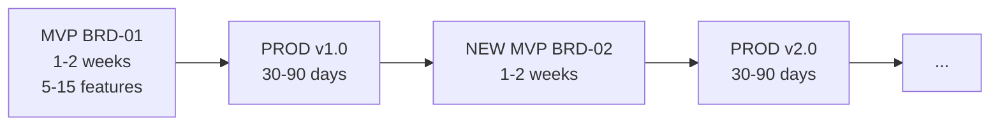

# Docs Flow Framework

**AI-First Specification-Driven Development (SDD) with Scalable Depth**

> **AI-First Design**: This framework is designed for AI agents (Claude Code, Gemini CLI, GitHub Copilot) as the primary operators. Humans work *through* AI assistants. AI agents autonomously execute workflows, generate artifacts, and manage the development lifecycle.

---

## Core Lifecycle: MVP → PROD → NEW MVP



| Phase | Duration | Output |
|:------|:---------|:-------|
| **MVP** | 1-2 weeks | BRD → PRD → EARS → BDD → ADR → SYS → REQ → SPEC → TSPEC → TASKS → Production |
| **PROD** | 30-90 days | Operate, measure metrics, collect user feedback |
| **NEW MVP** | 1-2 weeks | Create NEW BRD for next feature set, repeat cycle |

Each BRD represents one iteration cycle. New features get new BRDs (BRD-01, BRD-02, BRD-03). Cross-cycle traceability via `@depends: BRD-01`.

---

## SDD Depth Variants

| Depth | Layers | Best For | Timeline |
|:------|:-------|:---------|:---------|
| **SDD-Lite** | REF → BRD → PRD → TASKS | MVPs, prototypes, solo + AI | 1-3 months |
| **SDD-Standard** | + EARS, ADR, SYS, REQ | Production apps, small teams | 3-6 months |
| **SDD-Full** | All 15 layers + 4-Gate CHG | Enterprise, regulated, multi-team | 6+ months |

See [governance/SDD_DEPTH_GUIDE.md](./governance/SDD_DEPTH_GUIDE.md) for detailed layer mappings.

---

## 15-Layer Architecture

All 11 artifact layers use **unified YAML templates** with embedded authoring guidance (`_guidance` fields).

| Layer | Artifact | C4 Level | Template |
|-------|----------|----------|----------|
| 1 | BRD | Context (L1) | `BRD-TEMPLATE.yaml` |
| 2 | PRD | Container (L2) | `PRD-TEMPLATE.yaml` |
| 3 | EARS | Transition | `EARS-TEMPLATE.yaml` |
| 4 | BDD | Transition | `BDD-TEMPLATE.yaml` |
| 5 | ADR | Bridge | `ADR-TEMPLATE.yaml` |
| 6 | SYS | Component (L3) | `SYS-TEMPLATE.yaml` |
| 7 | REQ | Decomposition | `REQ-TEMPLATE.yaml` |
| 8 | CTR | Decomposition | `CTR-TEMPLATE.yaml` (optional) |
| 9 | SPEC | Code (L4) | `SPEC-TEMPLATE.yaml` |
| 10 | TSPEC | Validation | `TSPEC-TEMPLATE.yaml` |
| 11 | TASKS | Execution | `TASKS-TEMPLATE.yaml` |
| 12-14 | Code/Tests/Validation | — | Source code, test execution, deployment |

CHG (Change Management) is a governance overlay with 4 gates. See `ai_dev_ssd_flow/CHG/`.

---

## Repository Structure

| Directory | Purpose |
|:----------|:--------|
| `ai_dev_ssd_flow/` | SDD layer templates, standards, and framework guides |
| `mcp_sdd/` | **UCX** (Unified Context Framework) MCP server: 20 tools for SDD lifecycle. Also known as `ucx` or `mcp_sdd`. |
| `governance/` | Project governance templates, setup guides, CI/CD scripts |
| `project_knowledge/` | Knowledge base package (RAG + Graph) |
| `changelog/` | Per-version changelogs |
| `roadmap/` | Roadmap and release planning |

### ai_dev_ssd_flow/ Highlights

```
ai_dev_ssd_flow/
├── {NN}_{TYPE}/          11 layer directories, each with {TYPE}-TEMPLATE.yaml
├── CHG/                  Change management (4-gate system)
├── PROJECT/              SDD Project Model (sprint integration)
├── README.md             Framework overview
├── ID_NAMING_STANDARDS.md
├── TRACEABILITY.md
├── DIAGRAM_STANDARDS.md
├── MVP_WORKFLOW_GUIDE.md
└── SPEC_DRIVEN_DEVELOPMENT_GUIDE.md
```

### mcp_sdd/ Highlights

20 MCP tools (12 deterministic, 2 orchestration, 6 LLM-dependent):

| Tool | Purpose |
|------|---------|
| Tool | Purpose |
|------|---------|
| `sdd_validate` | Validate SDD artifacts against templates (MD + YAML, cross-section rules) |
| `sdd_validate_fix` | Generate source-protected fix from validation report (executor-driven) |
| `sdd_validate_links` | Validate markdown links (file + anchor resolution) |
| `sdd_create` | Scaffold new SDD documents |
| `sdd_consistency` | Artifact lineage checks (MD + YAML) |
| `sdd_preflight` | Environment readiness checks |
| `sdd_review` | Multi-persona LLM document review (configurable persona lists via `persona_mappings.yaml`) |
| `sdd_remediate` | Deterministic remediation findings + review report parsing |
| `sdd_remediate_fix` | Source-protected remediation fix (executor-driven) |
| `sdd_run_lifecycle` | Full create→validate→review→fix pipeline |
| `sdd_score_show` | Quality score with categorized weights (structural/cross-section) |
| `sdd_next_action` | Recommend next lifecycle stage (MD + YAML aware) |

All 11 unified YAML templates available in `mcp_sdd/templates/`.

Project UCX assets (personas, prompts, templates) scaffolded to `{project}/UCX/` via `sdd_init`.

---

## Quick Start

### For New Projects

1. Choose your SDD depth (Lite / Standard / Full)
2. Copy templates from `mcp_sdd/templates/` or layer directories
3. Create documents using mcp_sdd `sdd_create`
4. Validate with mcp_sdd `sdd_validate`

### Document Size Policy

All SDD documents are **monolithic** (single self-contained file) up to **50,000 tokens**. If a document exceeds 50,000 tokens, create a new document of the same type with its own scope.

### Validation

```bash
# Via mcp_sdd CLI
python -m mcp_server.cli.main validate --project <path> --doc-type brd --layer 01_BRD --document <file>

# Link validation
python -m mcp_server.cli.main validate-links --target <path>
```

---

## Cumulative Tagging

Each layer requires traceability tags from ALL upstream layers:

```
BRD (0 tags) → PRD (@brd) → EARS (@brd,@prd) → BDD (+@ears) → ADR (+@bdd) →
SYS (+@adr) → REQ (+@sys) → CTR (+@req) → SPEC (+@ctr) → TSPEC (+@spec) → TASKS (+@tspec)
```

See [CUMULATIVE_TAG_REFERENCE.md](./ai_dev_ssd_flow/CUMULATIVE_TAG_REFERENCE.md).

---

## Key References

### Framework

| Document | Purpose |
|----------|---------|
| [ai_dev_ssd_flow/README.md](./ai_dev_ssd_flow/README.md) | SDD framework overview |
| [MVP_WORKFLOW_GUIDE.md](./ai_dev_ssd_flow/MVP_WORKFLOW_GUIDE.md) | MVP → PROD → NEW MVP lifecycle |
| [SPEC_DRIVEN_DEVELOPMENT_GUIDE.md](./ai_dev_ssd_flow/SPEC_DRIVEN_DEVELOPMENT_GUIDE.md) | Complete SDD methodology |
| [ID_NAMING_STANDARDS.md](./ai_dev_ssd_flow/ID_NAMING_STANDARDS.md) | Document and element ID formats |
| [TRACEABILITY.md](./ai_dev_ssd_flow/TRACEABILITY.md) | Cross-layer traceability rules |
| [DIAGRAM_STANDARDS.md](./ai_dev_ssd_flow/DIAGRAM_STANDARDS.md) | Mermaid-only diagram rules, C4+DFD model |

### Governance

| Document | Purpose |
|----------|---------|
| [governance/README.md](./governance/README.md) | Governance template library |
| [governance/SDD_DEPTH_GUIDE.md](./governance/SDD_DEPTH_GUIDE.md) | Lite vs Standard vs Full |
| [governance/GOVERNANCE_RULES.md](./governance/GOVERNANCE_RULES.md) | Operational policies |

### Releases

| Document | Purpose |
|----------|---------|
| [roadmap/ROADMAP.md](./roadmap/ROADMAP.md) | Version timeline and planned releases |
| [changelog/](./changelog/) | Per-version changelogs (v0.1.0 – v0.17.0) |

---

## Version

| Field | Value |
|-------|-------|
| Current Version | 0.17.0 |
| Latest Release | UCX root relocation, review report parsing, YAML parity, cross-section validation |
| mcp_sdd Version | 1.10.0 |
| Next Major | 1.0.0 (multi-MCP ecosystem) |

---

## License

MIT
