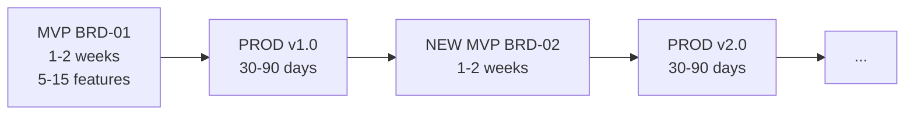

# UCX Framework

**AI-First Specification-Driven Development (SDD) with Scalable Depth**

> **AI-First Design**: This framework is designed for AI agents (Claude Code, Gemini CLI, GitHub Copilot) as the primary operators. Humans work *through* AI assistants. AI agents autonomously execute workflows, generate artifacts, and manage the development lifecycle.

---

## Core Lifecycle: MVP → PROD → NEW MVP



| Phase | Duration | Output |
|:------|:---------|:-------|
| **MVP** | 1-2 weeks | BRD → PRD → EARS → BDD → ADR → SPEC → TDD → IPLAN → Code |
| **PROD** | 30-90 days | Operate, measure metrics, collect user feedback |
| **NEW MVP** | 1-2 weeks | Create NEW BRD for next feature set, repeat cycle |

Each BRD represents one iteration cycle. New features get new BRDs (BRD-01, BRD-02, BRD-03). Cross-cycle traceability via `@depends: BRD-01`. Both **v2 (14-layer)** and **v3 (8-layer)** workflows are available — v3 is the recommended path for new projects.

---

## SDD Depth Variants

| Depth | Layers | Best For | Timeline |
|:------|:-------|:---------|:---------|
| **SDD-Lite** | REF → BRD → PRD → IPLAN | MVPs, prototypes, solo + AI | 1-3 months |
| **SDD-Standard** | + EARS, BDD, ADR | Production apps, small teams | 3-6 months |
| **SDD-Full** | All 8 layers + CHG governance overlay | Enterprise, regulated, multi-team | 6+ months |

See [ucx_flow_v3/README.md](./ucx_flow_v3/README.md) for detailed layer mappings. The original v2 14-layer variant is preserved in [ai_dev_ssd_flow/](./ai_dev_ssd_flow/).

---

## Architecture

### SDD v3 (Recommended — 8 Layers)

Streamlined 8-layer framework with C4 architecture model mapping. All layers use **unified YAML templates** with embedded authoring guidance (`_guidance` fields).

| Layer | Artifact | Name | C4 Level | Template |
|-------|----------|------|----------|----------|
| 1 | BRD | Business Requirements Document | C4-L1 Context | `BRD-TEMPLATE.yaml` |
| 2 | PRD | Product Requirements Document | C4-L2 Container | `PRD-TEMPLATE.yaml` |
| 3 | EARS | Easy Approach to Requirements Syntax | Decision Bridge | `EARS-TEMPLATE.yaml` |
| 4 | BDD | Behavior-Driven Development | Decision Bridge | `BDD-TEMPLATE.yaml` |
| 5 | ADR | Architecture Decision Record | Decision Bridge | `ADR-TEMPLATE.yaml` |
| 6 | SPEC | Technical Specification | C4-L3 Component | `SPEC-TEMPLATE.yaml` |
| 7 | TDD | Test-Driven Development Guide | Implementation Bridge | `TDD-TEMPLATE.yaml` |
| 8 | IPLAN | Implementation Plan | Implementation Bridge | `IPLAN-TEMPLATE.yaml` |

CHG (Change Management) is a governance overlay with 5 gates (GATE-01 through GATE-CODE). See `ucx_flow_v3/CHG/`.

### v2 (Legacy — 14 Layers)

The original 14-layer framework is preserved in `ai_dev_ssd_flow/` for existing projects. SYS, REQ, CTR, TSPEC subtypes, and TASKS remain available.


---

## Repository Structure

| Directory | Purpose |
|:----------|:--------|
| `ucx_flow_v3/` | **SDD v3** (current): 8-layer streamlined framework with C4 mapping, CHG governance overlay |
| `ai_dev_ssd_flow/` | **SDD v2** (legacy): 14-layer framework templates, standards, and guides |
| `mcp_ucx/` | **UCX** (Unified Context eXcelerator) — AI agent orchestration platform: 25 MCP tools for SDD lifecycle. Creates per-project context for any AI agent. Also known as `ucx` or `mcp_ucx`. |
| `governance/` | Project governance templates, setup guides, CI/CD scripts |
| `ucx_knowledge/` | Knowledge base package (RAG + Graph) |
| `changelog/` | Per-version changelogs |
| `roadmap/` | Roadmap and release planning |

Note: historical records in `changelog/`, `plans/`, and archived docs may contain legacy naming (for example `mcp-sdd` or `MCP SDD`) to preserve release and audit accuracy.

### ucx_flow_v3/ (Current)

```
ucx_flow_v3/
├── 01_BRD/               BRD-TEMPLATE.yaml (978 lines), BRD-00_index.md, README
├── 02_PRD/               PRD-TEMPLATE.yaml (607 lines), PRD-00_index.md, README
├── 03_EARS/              EARS-TEMPLATE.yaml (376 lines), EARS-00_index.md, README
├── 04_BDD/               BDD-TEMPLATE.yaml (367 lines), BDD-00_index.md, README
├── 05_ADR/               ADR-TEMPLATE.yaml (446 lines), ADR-00_index.md, README
├── 06_SPEC/              SPEC-TEMPLATE.yaml (189 lines), SPEC-00_index.md, README
├── 07_TDD/               TDD-TEMPLATE.yaml (266 lines), TDD-00_index.md, README
├── 08_IPLAN/             IPLAN-TEMPLATE.yaml, IPLAN-00_index.yaml, README
├── CHG/                  Change management governance overlay (5-gate system)
├── LAYER_REGISTRY.yaml   Authoritative layer definitions (232 lines)
├── README.md             v3 framework overview with C4 mapping
├── SPEC_DRIVEN_DEVELOPMENT_GUIDE.md
├── ID_NAMING_STANDARDS.md
├── TRACEABILITY.md
├── DIAGRAM_STANDARDS.md
├── THRESHOLD_NAMING_RULES.md
├── TESTING_STRATEGY_TDD.md
├── QUICK_REFERENCE.md
└── plans/                Migration plans (v2→v3, CHG transition)
```

### ai_dev_ssd_flow/ (Legacy v2)

```
ai_dev_ssd_flow/
├── {NN}_{TYPE}/          11 layer directories, each with {TYPE}-TEMPLATE.yaml
├── CHG/                  Change management (4-gate system)
├── PROJECT/              SDD Project Model (sprint integration)
├── README.md             Framework overview
├── ID_NAMING_STANDARDS.md
├── TRACEABILITY.md
├── DIAGRAM_STANDARDS.md
├── MVP_WORKFLOW_GUIDE.md
└── SPEC_DRIVEN_DEVELOPMENT_GUIDE.md
```

### mcp_ucx/ Highlights

25 MCP tools (13 deterministic, 1 maintenance, 2 session management, 2 executor management, 2 orchestration, 5 LLM-dependent):

| Tool | Purpose |
|------|---------|
| `sdd_validate` | Validate SDD artifacts against templates (MD + YAML, cross-section rules) |
| `sdd_validate_links` | Validate markdown links (file + anchor resolution) |
| `sdd_create` | Scaffold new SDD documents |
| `sdd_consistency` | Artifact lineage checks (MD + YAML) |
| `sdd_preflight` | Environment readiness checks |
| `sdd_review` | Multi-persona LLM document review (configurable persona lists via `persona_mappings.yaml`) |
| `sdd_remediate` | Deterministic remediation findings + source-protected fix via `--fix` |
| `sdd_clean` | Prune obsolete stage artifacts (reports, derived copies), keep latest N |
| `sdd_run_lifecycle` | Full create→validate→review→fix pipeline (with optional `clean_before`) |
| `sdd_score_show` | Quality score with categorized weights (structural/cross-section) |
| `sdd_next_action` | Recommend next lifecycle stage (MD + YAML aware) |

All 11 unified YAML templates available in `mcp_ucx/templates/`.

Project UCX assets (personas, prompts, templates) scaffolded to `{project}/UCX/` via `sdd_init`.

---

## Quick Start

### For New Projects

1. Choose your SDD depth (Lite / Standard / Full)
2. Copy templates from `mcp_ucx/templates/` or layer directories
3. Create documents using mcp_ucx `sdd_create`
4. Validate with mcp_ucx `sdd_validate`

### Document Size Policy

All SDD documents are **monolithic** (single self-contained file) up to **50,000 tokens**. If a document exceeds 50,000 tokens, create a new document of the same type with its own scope.

### Validation

```bash
# Via mcp_ucx CLI
python -m mcp_server.cli.main validate --project <path> --doc-type brd --layer 01_BRD --document <file>

# Link validation
python -m mcp_server.cli.main validate-links --target <path>
```

---

## Cumulative Tagging

Each layer requires traceability tags from ALL upstream layers:

**v3 (8 layers):**
```
BRD (0 tags) → PRD (@brd) → EARS (+@prd) → BDD (+@ears) → ADR (+@bdd) → SPEC (+@adr) → TDD (+@spec) → IPLAN (+@tdd)
```

See [ucx_flow_v3/TRACEABILITY.md](./ucx_flow_v3/TRACEABILITY.md).

**v2 (14 layers):**
```
BRD (0 tags) → PRD → EARS → BDD → ADR → SYS → REQ → CTR → SPEC → TSPEC → TASKS
```

---

## Key References

### Framework

| Document | Purpose |
|----------|---------|
| [ucx_flow_v3/README.md](./ucx_flow_v3/README.md) | SDD v3 framework overview (current, recommended) |
| [ucx_flow_v3/LAYER_REGISTRY.yaml](./ucx_flow_v3/LAYER_REGISTRY.yaml) | Authoritative v3 layer definitions with C4 mapping |
| [ai_dev_ssd_flow/README.md](./ai_dev_ssd_flow/README.md) | SDD v2 framework overview (legacy, maintained) |
| [ucx_flow_v3/SPEC_DRIVEN_DEVELOPMENT_GUIDE.md](./ucx_flow_v3/SPEC_DRIVEN_DEVELOPMENT_GUIDE.md) | Complete SDD v3 methodology |
| [ucx_flow_v3/ID_NAMING_STANDARDS.md](./ucx_flow_v3/ID_NAMING_STANDARDS.md) | Document and element ID formats |
| [ucx_flow_v3/TRACEABILITY.md](./ucx_flow_v3/TRACEABILITY.md) | Cross-layer traceability rules |
| [ucx_flow_v3/DIAGRAM_STANDARDS.md](./ucx_flow_v3/DIAGRAM_STANDARDS.md) | Mermaid-only diagram rules, C4+DFD model |

### Governance

| Document | Purpose |
|----------|---------|
| [governance/README.md](./governance/README.md) | Governance template library |
| [governance/GOVERNANCE_RULES.md](./governance/GOVERNANCE_RULES.md) | Operational policies |
| [ucx_flow_v3/CHG/README.md](./ucx_flow_v3/CHG/README.md) | Change management governance overlay (5-gate system) |

### Releases

| Document | Purpose |
|----------|---------|
| [roadmap/ROADMAP.md](./roadmap/ROADMAP.md) | Version timeline and planned releases |
| [changelog/](./changelog/) | Per-version changelogs (v0.1.0 – v0.20.0) |

---

## Version

| Field | Value |
|-------|-------|
| Current Version | 0.20.0 |
| Latest Release | SDD v3.2 — 8-layer streamlined framework with C4 mapping, CHG governance overlay |
| mcp_ucx Version | 1.12.0 |
| Next Major | 1.0.0 (multi-MCP ecosystem with governance and knowledge base) |

---

## License

MIT
