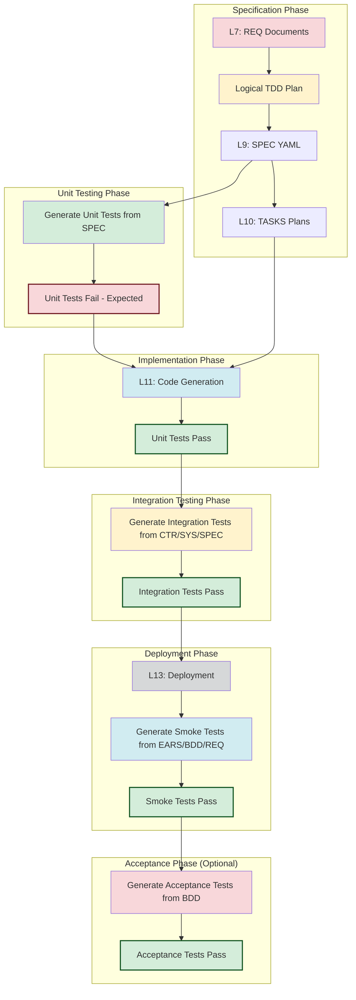

# SDD Testing Strategy with Test-Driven Development

**Purpose**: Define comprehensive testing approach for AI Dev Flow framework integrating Test-Driven Development with specification-driven development.

**Version**: 1.0
**Last Updated**: 2026-01-21

---

## Overview

This strategy defines a comprehensive testing approach that:
- **Integrates TDD** with SDD framework layers
- **Derives tests** from appropriate upstream artifacts
- **Validates code** at multiple levels (unit, integration, smoke, acceptance)
- **Ensures traceability** from business requirements through tests
- **Supports automated** test generation and execution

---

## Testing Philosophy

### Test-Driven Development Integration

**Core Principle**: Generate unit tests **before** code generation to drive implementation.

**TDD Cycle in SDD Framework**:
```
REQ (L7) → Generate Unit Tests (Fail) → SPEC/TASKS → CODE (Pass)
            ↑                                          ↑
        Define behavior                           Implement behavior
```

**Benefits**:
- Tests serve as executable specifications
- Code generation has clear contracts to satisfy
- Forces testable design from start
- Reduces refactoring and debugging effort
- Faster development cycle

### Multi-Level Validation

Each layer of testing validates different aspects:
1. **Unit tests**: Individual function correctness
2. **Integration tests**: Component interaction
3. **Smoke tests**: Post-deployment health
4. **Acceptance tests**: Business requirement satisfaction

---

## Complete Testing Workflow

### Visual Flow



### Detailed Workflow Steps

#### Step 1: Logical TDD (Pre-SPEC) - Layer 7.5

**When**: Before writing the SPEC (Layer 9)

**Source**: **REQ documents (Layer 7)**

**Purpose**: Define WHAT to test (Input/Output tables) to drive specific Interface design.

**Action**:
1. Open `REQ-NN.md`
2. Populate **Section 8.1 Logical TDD**
3. Define table: `| Test Case | Input | Expected Output | Coverage |`

**Example**:
| Test Case | Input | Expected Output | Coverage |
|-----------|-------|-----------------|----------|
| Fee Calc | `amount=100` | `fee=1.50` | Business Rule A |
| Circuit Trip | `fails=5` | `State=OPEN` | Resilience |

**Benefit**: These cases dictate exactly which methods must exist in the SPEC.

#### Step 2: Unit Tests (Technical TDD) - Layer 9

**When**: After SPEC (Layer 9) is defined but before Code

**Source**: **SPEC documents (Layer 9)**

**Purpose**: Enforce the contract (signatures, types, exceptions)

**Action**:
```bash
# Generate unit tests from SPEC signatures
test-automation generate-unit \
  --input 09_SPEC/ \
  --output tests/unit/ \
  --framework pytest
```

**Expected Outcome**: Tests FAIL (Red State) - **This is correct**

**Traceability Tags**:
```python
"""
Unit tests for REQ-001
@brd: BRD-01
@req: REQ-01.01.01
@spec: SPEC-01.yaml
@code: PENDING
"""
```

#### Step 3: Code Generation - Layer 11

**When**: After SPEC (Layer 9) and TASKS (Layer 10) are complete

**Action**:
```bash
# Generate code from SPEC using TASKS as implementation guide
python AUTOPILOT/scripts/code_generator.py \
  --spec 09_SPEC/SPEC-01_*.yaml \
  --tasks 10_TASKS/TASKS-01_*.md \
  --output src/
```

**Expected Outcome**: Unit tests from Step 2 now PASS (Green State)

**Update Traceability Tags**:
```python
"""
Unit tests for REQ-001
@req: REQ-01.01.01
@code: src/services/validation_service.py  # NOW FILLED
"""
```

#### Step 3: Integration Tests - After All TASKS Complete

**When**: After all components are implemented and unit tests pass

**Source**:
- **CTR contracts (Layer 8)** - API/service boundaries
- **SYS requirements (Layer 6)** - System interaction patterns
- **SPEC documents (Layer 9)** - Component interfaces

**Purpose**: Validate component interactions and data flows

**Action**:
```bash
# Generate integration tests from multiple sources
test-automation generate-integration \
  --input 08_CTR/ 06_SYS/ 09_SPEC/ \
  --output tests/integration/ \
  --framework pytest
```

**Test Structure**:
```python
"""
Integration tests for User API Service
@brd: BRD-01
@prd: PRD-01
@ears: EARS-01
@bdd: BDD-01
@adr: ADR-01
@sys: SYS-01
@req: REQ-01.01.01
@ctr: CTR-01_user_api_v1
@spec: SPEC-01_user_service.yaml
@tasks: TASKS-001_user_service.md
@code: src/api/user_routes.py
"""
class Test_UserAPI_Integration:
    """Test User API integration with database and services"""

    def test_create_user_persists_to_database(self, client, db):
        """API call saves user to database correctly"""
        response = client.post('/api/users', json={
            'username': 'testuser',
            'email': 'test@example.com'
        })
        assert response.status_code == 201

        user = db.session.query(User).filter_by(username='testuser').first()
        assert user.email == 'test@example.com'

    def test_contract_compliance(self, client):
        """API response matches CTR contract schema"""
        response = client.post('/api/users', json={...})
        assert response.status_code == 201

        # Validate against CTR-01 schema
        schema = load_ctr_schema('CTR-01_user_api_v1.yaml')
        validate(response.json(), schema)
```

#### Step 4: Deployment - Layer 13

**When**: After all integration tests pass

**Action**: Deploy to target environment (dev/staging/production)

**Validation**: Infrastructure health checks

#### Step 5: Smoke Tests - After Deployment

**When**: Immediately after deployment completes

**Source**:
- **EARS (Layer 3)** - Critical event-response flows
- **BDD (Layer 4)** - Happy path scenarios
- **REQ (Layer 7)** - P0/MUST requirements

**Purpose**: Quick sanity check that deployment succeeded

**Action**:
```bash
# Generate smoke tests from multiple sources
test-automation generate-smoke \
  --input 03_EARS/ 04_BDD/ 07_REQ/ \
  --output tests/smoke/ \
  --framework pytest
```

**Test Characteristics**:
- Run in <5 minutes
- Test critical path only
- Simple assertions only
- Fail fast, fail loudly

**Test Structure**:
```python
"""
Smoke tests for deployed system
@brd: BRD-01
@prd: PRD-01
@ears: EARS-01.03.01  # User login event
@bdd: BDD-01_scenario:happy_login
@req: REQ-01.01.01, REQ-01.02.01
@code: src/main.py, src/api/auth_routes.py
@environment: production
"""
class Test_DeploymentSmoke:
    """Quick health check after deployment"""

    def test_application_starts(self, client):
        """Application responds to health check"""
        response = client.get('/health')
        assert response.status_code == 200
        assert response.json()['status'] == 'healthy'

    def test_database_connects(self):
        """Database connection established"""
        result = db.session.execute('SELECT 1').scalar()
        assert result == 1

    def test_critical_api_responds(self, client):
        """Authentication endpoint responds (not 500)"""
        response = client.post('/api/auth/login', json={
            'username': 'test',
            'password': 'test'
        })
        assert response.status_code in [200, 401]  # Not server error
        assert response.status_code != 500

    def test_bdd_happy_path_login(self, client):
        """BDD happy path: Valid credentials succeed"""
        # Matches BDD-01: "Given a valid user, When logging in, Then succeed"
        response = client.post('/api/auth/login', json={
            'username': 'validuser',
            'password': 'correctpassword'
        })
        assert response.status_code == 200
        assert 'access_token' in response.json()
```

**Decision Rule**:
- **Smoke tests FAIL**: Stop deployment, rollback, fix immediately
- **Smoke tests PASS**: Proceed to acceptance tests (optional)

#### Step 6: Acceptance Tests (Optional) - Layer 4

**When**: After smoke tests pass (can run in parallel with production monitoring)

**Source**: **BDD documents (Layer 4)** - Full scenario validation

**Purpose**: Validate end-to-end behavior matches acceptance criteria

**Action**:
```bash
# Generate acceptance tests from BDD scenarios
test-automation generate-bdd \
  --input 04_BDD/ \
  --output tests/acceptance/ \
  --framework pytest-bdd
```

**Test Structure** (pytest-bdd):
```python
"""
Acceptance tests from BDD scenarios
@brd: BRD-01
@prd: PRD-01
@ears: EARS-01
@bdd: BDD-01_user_authentication.feature
@adr: ADR-01
@sys: SYS-01
@req: REQ-01.01.01, REQ-01.02.01, REQ-01.03.01
@ctr: CTR-01_user_api_v1
@spec: SPEC-01_user_service.yaml
@tasks: TASKS-001_auth_service.md
@code: src/services/auth_service.py
"""
# Load all BDD scenarios
scenarios('../../04_BDD/BDD-01_user_authentication.feature')

@pytest.fixture
def context():
    """Shared context for BDD steps"""
    return {}

@given('a registered user with valid credentials')
def registered_user(context):
    context.user = create_test_user(
        username='testuser',
        password='ValidP@ssw0rd'
    )

@when('the user attempts to login')
def user_login(context):
    context.response = client.post('/api/auth/login', json={
        'username': context.user.username,
        'password': context.user.password
    })

@then('the login should succeed')
def login_succeeds(context):
    assert context.response.status_code == 200
    assert 'access_token' in context.response.json()
    assert context.response.json()['token_type'] == 'Bearer'
```

---

## Test Derivation Mapping

| Test Type | Primary Source | Secondary Sources | SDD Layer | Purpose |
|-----------|----------------|-------------------|------------|---------|
| **Unit Tests** | REQ (L7) | - | L7 | Validate atomic requirements |
| **Integration Tests** | CTR (L8) | SYS (L6), SPEC (L9) | L6-L9 | Validate component interactions |
| **Smoke Tests** | EARS (L3), BDD (L4), REQ (L7) | - | L3-L4, L7 | Post-deployment health check |
| **Acceptance Tests** | BDD (L4) | - | L4 | Validate business requirements |

---

## Test Characteristics Comparison

| Characteristic | Unit Tests | Integration Tests | Smoke Tests | Acceptance Tests |
|----------------|--------------|-------------------|--------------|------------------|
| **Scope** | Single function | Multiple components | Critical system paths | End-to-end workflows |
| **Speed** | Milliseconds | Seconds/Minutes | <5 minutes | Minutes |
| **Dependencies** | Mocked | Real/Test Containers | Deployed system | Deployed system |
| **Failure Impact** | Fix function | Fix interaction | Rollback deployment | Fix business logic |
| **Execution Timing** | During development | Before deployment | After deployment | After smoke tests |
| **TDD Compatible** | ✅ Yes | ❌ No | ❌ No | ✅ Yes |

---

## Traceability in Tests

### Cumulative Tagging Pattern

Each test type includes all upstream traceability tags:

**Unit Tests (Before Code)**:
```python
@brd: BRD-01
@prd: PRD-01
@ears: EARS-01
@bdd: BDD-01
@adr: ADR-01
@sys: SYS-01
@req: REQ-01.01.01
@code: PENDING  # Update after code generation
@tasks: PENDING  # Update after TASKS creation
```

**Integration Tests**:
```python
@brd: BRD-01
@prd: PRD-01
@ears: EARS-01
@bdd: BDD-01
@adr: ADR-01
@sys: SYS-01
@req: REQ-01.01.01
@ctr: CTR-01_user_api_v1  # Add for interface contracts
@spec: SPEC-01_user_service.yaml
@tasks: TASKS-001_user_service.md
@code: src/api/user_routes.py
```

**Smoke Tests**:
```python
@brd: BRD-01
@prd: PRD-01
@ears: EARS-01.03.01  # Specific event
@bdd: BDD-01_scenario:happy_login
@req: REQ-01.01.01  # P0 requirements only
@code: src/main.py  # Entry points
@environment: production
```

**Acceptance Tests**:
```python
@brd: BRD-01
@prd: PRD-01
@ears: EARS-01
@bdd: BDD-01_user_authentication.feature
@adr: ADR-01
@sys: SYS-01
@req: REQ-01.01.01, REQ-01.02.01, REQ-01.03.01
@ctr: CTR-01_user_api_v1
@spec: SPEC-01_user_service.yaml
@tasks: TASKS-001_auth_service.md
@code: src/services/auth_service.py
```

---

## Test Generation Commands

### Generate Unit Tests (TDD - Before Code)
```bash
test-automation generate-unit \
  --input 07_REQ/ \
  --output tests/unit/ \
  --framework pytest \
  --coverage-threshold 90

# Expected: Tests FAIL (no code yet)
```

### Run Unit Tests (After Code Generation)
```bash
pytest tests/unit/ \
  --cov=src/ \
  --cov-report=html \
  --cov-fail-under=90
```

### Generate Integration Tests
```bash
test-automation generate-integration \
  --input 08_CTR/ 06_SYS/ 09_SPEC/ \
  --output tests/integration/ \
  --framework pytest

# Uses real databases (testcontainers) or test fixtures
```

### Run Integration Tests
```bash
pytest tests/integration/ \
  --testcontainers \
  --timeout=300
```

### Generate Smoke Tests
```bash
test-automation generate-smoke \
  --input 03_EARS/ 04_BDD/ 07_REQ/ \
  --output tests/smoke/ \
  --framework pytest \
  --timeout=300  # Must complete in 5 minutes
```

### Run Smoke Tests (Post-Deployment)
```bash
pytest tests/smoke/ \
  --environment=production \
  --fail-fast
```

### Generate Acceptance Tests
```bash
test-automation generate-bdd \
  --input 04_BDD/ \
  --output tests/acceptance/ \
  --framework pytest-bdd
```

### Run Acceptance Tests
```bash
pytest tests/acceptance/ \
  --gherkin-terminal-reporter
```

---

## Best Practices

### Unit Tests
1. **Generate tests first** before any code
2. **Expect failures** initially - this is correct
3. **Update traceability tags** after code generation
4. **Test one thing** per test function
5. **Use descriptive names** referencing REQ IDs
6. **Mock external dependencies** (database, APIs)
7. **Run in milliseconds** - no I/O operations
8. **Aim for 90%+ coverage**

### Integration Tests
1. **Generate after all components** implemented
2. **Use real databases** (testcontainers) or test fixtures
3. **Test at service boundaries**
4. **Validate CTR contract compliance**
5. **Mock external APIs** you don't control
6. **Test both success and failure** paths
7. **Clean up test data** after each test
8. **Run in CI/CD before deployment**

### Smoke Tests
1. **Generate from critical paths** only (EARS/BDD/P0 REQ)
2. **Run immediately after deployment**
3. **Fail fast** - first error stops execution
4. **Simple assertions** - no complex logic
5. **Target <5 minutes** execution time
6. **Test core functionality** - not edge cases
7. **Use production-like environment** configuration
8. **Rollback on failure**

### Acceptance Tests
1. **Generate from BDD scenarios** as source of truth
2. **Test end-to-end workflows** from user perspective
3. **Use Given-When-Then** step definitions
4. **Run after smoke tests** pass
5. **Can run in parallel** with production monitoring
6. **Validate business requirements** satisfaction

---

## CI/CD Pipeline Integration

### Automated Pipeline Definition

```yaml
# .github/workflows/ci-cd.yml

name: CI/CD Pipeline

on: [push, pull_request]

jobs:
  # Phase 1: Unit Tests
  unit-tests:
    runs-on: ubuntu-latest
    steps:
      - checkout
      - setup-python
      - install-dependencies
      - name: Generate Unit Tests from REQ
        run: |
          test-automation generate-unit \
            --input 07_REQ/ \
            --output tests/unit/
      - name: Run Unit Tests (Expected to fail if no code)
        run: pytest tests/unit/ --continue-on-collection-errors
      - name: Generate Code from SPEC/TASKS
        run: |
          python AUTOPILOT/scripts/code_generator.py \
            --spec 09_SPEC/ \
            --tasks 10_TASKS/ \
            --output src/
      - name: Run Unit Tests (Should pass now)
        run: |
          pytest tests/unit/ \
            --cov=src/ \
            --cov-fail-under=90

  # Phase 2: Integration Tests (After all code)
  integration-tests:
    needs: unit-tests
    runs-on: ubuntu-latest
    services:
      - postgres:latest  # Test database
      - redis:latest    # Test cache
    steps:
      - checkout
      - setup-python
      - install-dependencies
      - name: Generate Integration Tests
        run: |
          test-automation generate-integration \
            --input 08_CTR/ 06_SYS/ 09_SPEC/ \
            --output tests/integration/
      - name: Run Integration Tests
        run: pytest tests/integration/ --testcontainers

  # Phase 3: Deploy to Staging
  deploy-staging:
    needs: integration-tests
    runs-on: ubuntu-latest
    steps:
      - checkout
      - deploy-to: staging

  # Phase 4: Smoke Tests (Post-Deployment)
  smoke-tests:
    needs: deploy-staging
    runs-on: ubuntu-latest
    steps:
      - checkout
      - setup-python
      - install-dependencies
      - name: Generate Smoke Tests
        run: |
          test-automation generate-smoke \
            --input 03_EARS/ 04_BDD/ 07_REQ/ \
            --output tests/smoke/
      - name: Run Smoke Tests
        run: |
          pytest tests/smoke/ \
            --environment=staging \
            --fail-fast
      - name: Rollback on Failure
        if: failure()
        run: rollback-deployment staging

  # Phase 5: Acceptance Tests (Optional)
  acceptance-tests:
    needs: smoke-tests
    runs-on: ubuntu-latest
    steps:
      - checkout
      - setup-python
      - install-dependencies
      - name: Generate Acceptance Tests from BDD
        run: |
          test-automation generate-bdd \
            --input 04_BDD/ \
            --output tests/acceptance/ \
            --framework pytest-bdd
      - name: Run Acceptance Tests
        run: pytest tests/acceptance/

  # Phase 6: Deploy to Production
  deploy-production:
    needs: acceptance-tests
    runs-on: ubuntu-latest
    steps:
      - checkout
      - deploy-to: production
```

---

## Quality Gates

### Pre-Commit Gates
- All unit tests pass
- Code coverage ≥90%
- Linting passes

### Pre-Deployment Gates
- All unit tests pass
- All integration tests pass
- Smoke tests generated from EARS/BDD/REQ

### Post-Deployment Gates
- Smoke tests pass
- (Optional) Acceptance tests pass

### Rollback Triggers
- Smoke tests fail → Immediate rollback
- Critical errors detected → Rollback
- Performance degraded → Rollback

---

## Success Criteria

### Test Coverage Targets
| Metric | Target | Rationale |
|--------|---------|-----------|
| Unit Test Coverage | ≥90% | High confidence in individual functions |
| Requirement Coverage (Unit) | 100% of P0/MUST | Critical paths tested |
| Integration Coverage | ≥85% | Component interactions validated |
| Smoke Test Duration | <5 minutes | Fast feedback |
| Smoke Test Success Rate | 100% | Deployment must succeed |

### Test Execution Time Targets
| Test Type | Target Time | Frequency |
|------------|--------------|-----------|
| Unit Tests | <2 minutes | Every commit |
| Integration Tests | <10 minutes | Every PR |
| Smoke Tests | <5 minutes | Every deployment |
| Acceptance Tests | <20 minutes | Pre-release |

---

## Example: Complete Test Suite for User Service

### Test File Structure
```
tests/
├── unit/
│   ├── test_req_001_email_validation.py
│   ├── test_req_002_user_creation.py
│   └── test_req_003_password_hashing.py
├── integration/
│   ├── test_user_api_integration.py
│   ├── test_auth_service_integration.py
│   └── test_database_integration.py
├── smoke/
│   └── test_deployment_smoke.py
└── acceptance/
    └── test_bdd_user_scenarios.py
```

### Traceability Example: End-to-End

**BRD-01**: User authentication system

**→ PRD-01**: User can login with valid credentials

**→ EARS-01**: WHEN user submits valid credentials, THEN authenticate within 200ms

**→ BDD-01_scenario:happy_login**:
```gherkin
Scenario: Successful login with valid credentials
  Given a registered user with valid credentials
  When the user attempts to login
  Then the login should succeed
```

**→ REQ-01.01.01**: System validates email format

**→ Unit Test** (tests/unit/test_req_001_email_validation.py):
```python
def test_valid_email_format(self):
    assert validate_email('user@example.com') is True
```

**→ CTR-01_user_api_v1**: POST /api/auth/login contract

**→ Integration Test** (tests/integration/test_auth_api.py):
```python
def test_login_contract_compliance(self):
    response = client.post('/api/auth/login', json={...})
    assert response.status_code == 200
    validate(response.json(), ctr_schema)
```

**→ SPEC-01_auth_service.yaml**: Auth service implementation

**→ TASKS-001_auth_service.md**: Implementation steps

**→ CODE** (src/services/auth_service.py):
```python
def authenticate_user(email, password):
    # Implementation validates email (REQ-01.01.01)
    if not is_valid_email(email):
        raise InvalidEmailError()
    # ... rest of implementation
```

**→ Smoke Test** (tests/smoke/test_deployment_smoke.py):
```python
def test_bdd_happy_path_login(self):
    """Validates EARS-01 and BDD-01 after deployment"""
    response = client.post('/api/auth/login', json={...})
    assert response.status_code == 200
    assert 'access_token' in response.json()
```

**→ Acceptance Test** (tests/acceptance/test_bdd_user_scenarios.py):
```python
# Executes complete BDD-01 scenario
scenarios('../../04_BDD/BDD-01_user_authentication.feature')
```

---

## Troubleshooting

### Unit Tests Fail After Code Generation
**Problem**: Code doesn't match test expectations
**Solution**:
1. Review REQ document requirements
2. Check SPEC implementation details
3. Update code OR update test (if REQ was unclear)

### Integration Tests Fail
**Problem**: Component interaction issues
**Solution**:
1. Verify CTR contract compliance
2. Check SYS integration patterns
3. Review component interfaces in SPEC

### Smoke Tests Fail After Deployment
**Problem**: Deployment broken
**Action**: **IMMEDIATE ROLLBACK**
**Investigation**:
1. Check environment configuration
2. Verify infrastructure health
3. Review deployment logs

### Acceptance Tests Fail
**Problem**: Business logic issues
**Solution**:
1. Review BDD scenarios
2. Check if requirements changed
3. Update implementation OR BDD (via ADR if major change)

---

## Maintenance

**Update Triggers**:
- New REQ documents → Generate new unit tests
- New CTR contracts → Update integration tests
- New BDD scenarios → Update smoke/acceptance tests
- Code refactoring → Update test expectations
- Architecture changes (ADR) → Re-run test generation

**Version Control**:
- Tests tracked alongside code
- Tag releases with test suite version
- Traceability matrix updated with each change

---

## Autopilot Integration

This section describes how Test-Driven Development integrates with the **Autopilot** automated workflow, enabling tests to guide SPEC design.

### Key Principle: Test-First Specification

**Traditional Flow** (Code-First):
```
REQ → SPEC → CODE → TESTS
```
*Problem*: SPECs may not be testable, tests follow code.

**TDD Flow** (Test-First):
```
REQ → LOGICAL TDD → SPEC → UNIT TESTS → CODE → TESTS PASS
```
*Advantage*: Tests guide SPEC contract creation, ensuring testability.

### Autopilot Workflow Configuration

```yaml
# AUTOPILOT/TDD_WORKFLOW_CONFIG.yaml
workflow:
  name: "Autopilot TDD Pipeline"
  version: "2.0"

  stages:
    # Stage 1: Standard Artifact Generation (L1-L7)
    - name: generate_artifacts
      layers: [BRD, PRD, EARS, BDD, ADR, SYS, REQ]
      auto_approve_threshold: 90

    # Stage 2: Logical TDD (Pre-SPEC Test Planning)
    - name: logical_tdd
      action: populate_req_section_8_1
      source: 07_REQ/
      skip_quality_gate: true

    # Stage 3: TDD Unit Test Generation
    - name: tdd_unit_tests
      action: generate_unit_tests
      source: 09_SPEC/
      output: tests/unit/
      framework: pytest
      expected_status: fail

    # Stage 4: Code Generation (L11)
    - name: generate_code
      layer: CODE
      source: [09_SPEC/, 10_TASKS/]
      test_validation: tests/unit/

    # Stage 5: Validate Unit Tests
    - name: validate_unit_tests
      action: run_tests
      test_dir: tests/unit/
      coverage_threshold: 90
      expected_status: pass
```

### Two-Phase Traceability Tagging

**Phase 1: Test Generation (PENDING Tags)**
```python
"""
Unit tests for REQ-001
@req: REQ-01.01.01
@spec: PENDING
@code: PENDING
"""
```

**Phase 2: After Code Generation (Filled Tags)**
```python
"""
Unit tests for REQ-001
@req: REQ-01.01.01
@spec: 09_SPEC/SPEC-001.yaml
@code: src/services/validation_service.py
"""
```

**Automation Script**:
```bash
python AUTOPILOT/scripts/update_test_traceability.py \
  --test-dir tests/unit/ \
  --spec-dir 09_SPEC/ \
  --code-dir src/
```

### Troubleshooting

| Problem | Root Cause | Solution |
|---------|------------|----------|
| Unit Tests Fail After Code Gen | SPEC doesn't match test requirements | Review test expectations, update SPEC to match |
| SPEC Ignoring Tests | Autopilot not reading tests | Set `test_awareness: true` in config |
| PENDING Tags Not Updating | Automation script not run | Execute `update_test_traceability.py` manually |

---

## References

### Framework Documents
- [MVP_WORKFLOW_GUIDE.md](./MVP_WORKFLOW_GUIDE.md) - SDD workflow overview
- [COMPLETE_TAGGING_EXAMPLE.md](./COMPLETE_TAGGING_EXAMPLE.md) - Cumulative tagging patterns
- [TRACEABILITY.md](./TRACEABILITY.md) - Traceability requirements
- [SPEC_DRIVEN_DEVELOPMENT_GUIDE.md](./SPEC_DRIVEN_DEVELOPMENT_GUIDE.md) - SDD principles

### Test-Related Skills
- [test-automation](../.claude/skills/test-automation) - Test generation skill
- [contract-tester](../.claude/skills/contract-tester) - CTR validation
- [code-review](../.claude/skills/code-review) - Code quality checks

### External References
- [Pytest Documentation](https://docs.pytest.org/)
- [pytest-bdd](https://pytest-bdd.readthedocs.io/)
- [Testcontainers](https://testcontainers-python.readthedocs.io/)

---

**Document Control**

| Item | Details |
|------|---------|
| **Framework Version** | SDD v2.2 |
| **Test Strategy Version** | 1.0 |
| **Date Created** | 2026-01-21 |
| **Last Updated** | 2026-01-21 |
| **Status** | Active |
| **Maintained By** | AI Dev Flow Working Group |
| **Review Frequency** | Quarterly or on major framework updates |

**Change History**:

| Version | Date | Changes | Author |
|---------|-------|---------|---------|
| 1.0 | 2026-01-21 | Initial TDD integration with SDD framework | Framework Team |
