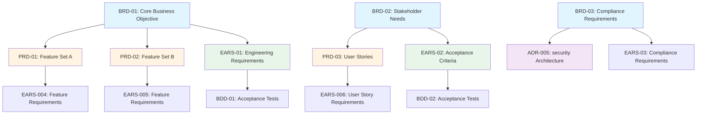

# Traceability Matrix: BRD-01 through BRD-NN

## Document Control

| Item | Details |
|------|---------|
| Document ID | TRACEABILITY_MATRIX_BRD |
| Title | Comprehensive Business Requirements Traceability Matrix |
| Status | [Active/Draft] |
| Version | 1.0.0 |
| Date Created | YYYY-MM-DD |
| Author | [Team Name] |
| Purpose | Track bidirectional traceability for all Business Requirements Documents |


---

Note: Some examples in this document show a portable `docs/` root. In this repository, artifact folders live at the ai_dev_flow root without the `docs/` prefix; see README → “Using This Repo” for path mapping.

**⚠️ TAG-BASED AUTO-GENERATION AVAILABLE**

This traceability matrix can be automatically generated by scanning code files for @brd:, @spec:, @test: tags.

**Recommended Approach:** Use tag-based auto-discovery instead of manual maintenance.

**Generate automatically using:**
```bash
# Extract tags from all files
python scripts/extract_tags.py --source src/ docs/ tests/ --output docs/generated/tags.json

# Validate tags against documents
python scripts/validate_tags_against_docs.py --tags docs/generated/tags.json --strict

# Generate BRD traceability matrix
python scripts/generate_traceability_matrix.py --type BRD --output docs/01_BRD/BRD-00_TRACEABILITY_MATRIX.md
```

**Benefits:**
- ✅ Single source of truth: Tags embedded in code
- ✅ Always up-to-date: Generated from current codebase
- ✅ No manual sync: Automated validation prevents drift
- ✅ Coverage metrics: Automatically calculated

**Tag Format:** `@brd: BRD.NN.01.SS` (unified element ID format, e.g., `BRD.01.01.30`)

**Format**: TYPE.NN.TT.SS (DOC_NUM.ELEM_TYPE.SEQ) - Element type 01 = Functional Requirement

See: [TRACEABILITY.md](../TRACEABILITY.md#tag-based-auto-discovery-alternative) for complete tag-based workflow.

---

## 1. Overview

### 1.1 Document Type Description
Business Requirements Documents (BRDs) capture strategic business objectives, stakeholder needs, market analysis, and high-level business goals that drive product development. BRDs translate strategic vision into actionable business requirements.

### 1.2 Coverage Scope
This matrix tracks traceability for all BRD documents in the project, mapping upstream sources (market research, strategic plans, stakeholder interviews) to downstream artifacts (PRD features, EARS requirements).

### 1.3 Statistics
- **Total BRDs Tracked**: [X] documents
- **Document Status**: [Y] active, [Z] superseded
- **Coverage Period**: [Start Date] to [End Date]
- **Last Updated**: YYYY-MM-DD

---

## 2. Required Tags (Cumulative Tagging Hierarchy - Layer 1)

### 2.1 Tag Requirements for BRD Artifacts

**Layer**: 1
**Artifact Type**: BRD (Business Requirements Document)
**Required Tags**: None (BRD is top-level artifact)
**Tag Count**: 0

### 2.2 Tag Format

BRD is Layer 1 in the cumulative tagging hierarchy and serves as the top-level artifact. **BRD documents do not require upstream traceability tags** since they represent the highest level of formal requirements documentation.

However, BRD documents should reference their strategic sources in the "Upstream Sources" section using natural language references:

```markdown
## 10. Traceability

### 2.3.1 Upstream Sources

**Strategic Source**: Market Analysis Report section 4.2 - service integration Requirements
**Business Justification**: Q4 2024 Strategic Initiative - Platform Modernization
**Stakeholder Input**: Executive Steering Committee Meeting 2024-09-15
```

### 2.3 Example: BRD with Strategic References

```markdown
# BRD-09: service integration Business Requirements

## 10. Traceability

### 2.3.2 Upstream Sources (Example)

**Required Tags** (Cumulative Tagging Hierarchy - Layer 1):
- None (BRD is top-level artifact)

**Strategic Sources**:
- Market Analysis Report section 4.2: "service integration Market Opportunity"
- Q4 2024 Strategic Plan: "Platform Modernization Initiative"
- Executive Committee Decision (2024-09-15): "Approved service integration roadmap"
- Stakeholder Interviews (2024-08-20 through 2024-09-10): provider connectivity pain points

### 2.3.3 Downstream Artifacts

**Direct Dependencies**:
- PRD.16.07.01: operation execution Product Requirements (`@brd: BRD.09.01.15`)
- PRD.17.07.01: Order Management Features (`@brd: BRD.09.01.20`)
- EARS.12.24.01: Formal operation execution requirements (`@brd: BRD.09.01.15`)
```

### 2.4 Validation Rules

1. **No Upstream Tags Required**: BRD documents do not use `@artifact-type` tags for upstream traceability
2. **Strategic Documentation**: BRDs MUST document strategic sources in natural language (Market Research, Strategic Plans, Stakeholder Input)
3. **Downstream Awareness**: BRDs SHOULD list downstream artifacts that reference them (PRDs, EARS, etc.)
4. **Tag Discovery**: All downstream artifacts MUST include `@brd: BRD.NN.01.SS` tags referencing this BRD

### 2.5 Tag Discovery

Find all artifacts that reference a specific BRD:

```bash
# Find all downstream artifacts referencing BRD-09
python scripts/extract_tags.py --find-references BRD-09

# Generate reverse traceability report
python scripts/generate_traceability_matrix.py --type BRD --show-downstream
```

### 2.6 BRD as Traceability Anchor

BRD serves as the **traceability anchor** for the entire SDD workflow:

```
Strategy (External) → BRD (Layer 1)
                        ↓
                  Downstream Artifacts Tag with @brd:
                        ↓
            PRD (Layer 2): @brd: BRD.09.01.15
                        ↓
         EARS (Layer 3): @brd: BRD.09.01.15, @prd: PRD.16.01.01...
                        ↓
         [Complete chain through Code and Tests]
```

**Key Principle**: While BRD has no upstream tags, **every downstream artifact** from PRD through Tests MUST include `@brd: BRD.NN.01.SS` tags, creating complete end-to-end traceability from business requirements to production code.

---

## 5. Complete BRD Inventory

| BRD ID | Title | Business Domain | Status | Date | Upstream Sources | Downstream Artifacts |
|--------|-------|-----------------|--------|------|------------------|---------------------|
| BRD-01 | [Business requirement title] | [Domain/category] | Active | YYYY-MM-DD | Market Research, Strategic Plan | PRD-01, PRD-02, EARS-01 |
| BRD-02 | [Business requirement title] | [Domain/category] | Active | YYYY-MM-DD | Stakeholder Interviews | PRD-03, EARS-02 |
| BRD-NN | ... | ... | ... | ... | ... | ... |

**Document Status Legend**:
- **Active**: Current and actively referenced
- **Draft**: Under development
- **Superseded**: Replaced by newer version
- **Archived**: Historical reference only

---

## 6. Upstream Traceability (OPTIONAL for BRD)

> **Note**: BRD is the root artifact in the SDD workflow. Upstream traceability is OPTIONAL and may only reference other BRDs or business description documents.

### 6.1 Strategic Sources → BRD Traceability

| Source Type | Source ID/Reference | BRD IDs | Relationship Description |
|-------------|---------------------|---------|--------------------------|
| Market Research | [Research Report Name/Date] | BRD-01, BRD-04 | Market opportunity analysis drives business requirements |
| Strategic Plan | [Strategic Plan section X.Y] | BRD-02, BRD-05 | Corporate strategy defines business objectives |
| Stakeholder Interviews | [Interview Notes Date] | BRD-03, BRD-06 | Stakeholder needs inform requirement priorities |
| Competitive Analysis | [Analysis Document] | BRD-NN, BRD-NN | Competitive positioning drives feature requirements |
| Regulatory Requirements | [Regulation Reference] | BRD-09 | Compliance mandates business requirements |

### 6.2 Upstream Source Summary

| Source Category | Total Sources | BRDs Derived | Coverage % |
|-----------------|---------------|--------------|------------|
| Market Research | [X] | [Y] BRDs | XX% |
| Strategic Plans | [X] | [Y] BRDs | XX% |
| Stakeholder Input | [X] | [Y] BRDs | XX% |
| Competitive Analysis | [X] | [Y] BRDs | XX% |
| Regulatory | [X] | [Y] BRDs | XX% |

---

## 7. Downstream Traceability (OPTIONAL)

> **Note**: Downstream traceability is OPTIONAL. Only add links to documents that actually exist.

### 7.1 BRD → PRD Traceability

| BRD ID | BRD Title | PRD IDs | PRD Titles | Relationship |
|--------|-----------|---------|------------|--------------|
| BRD-01 | [Business requirement] | PRD-01, PRD-02 | [Product features] | Business objectives drive product requirements |
| BRD-02 | [Business requirement] | PRD-03 | [Product feature] | Stakeholder needs translate to product SPEC |
| BRD-NN | ... | ... | ... | ... |

### 7.2 BRD → EARS Traceability

| BRD ID | BRD Title | EARS IDs | EARS Titles | Relationship |
|--------|-----------|----------|-------------|--------------|
| BRD-01 | [Business requirement] | EARS-01, EARS-02 | [Formal requirements] | Business goals formalized as EARS statements |
| BRD-02 | [Business requirement] | EARS-03 | [Formal requirement] | Business constraints expressed as formal requirements |
| BRD-NN | ... | ... | ... | ... |

### 7.3 BRD → ADR Traceability (Strategic Architecture Decisions)

| BRD ID | BRD Title | ADR IDs | ADR Titles | Relationship |
|--------|-----------|---------|------------|--------------|
| BRD-NN | [Business requirement with architectural impact] | ADR-NN, ADR-NN | [Architecture decisions] | Business requirements drive strategic technical decisions |
| BRD-NN | ... | ... | ... | ... |

### 7.4 Downstream Artifact Summary

| Artifact Type | Total Artifacts | BRDs Traced | Coverage % |
|---------------|-----------------|-------------|------------|
| PRD | [X] | [Y] BRDs | XX% |
| EARS | [X] | [Y] BRDs | XX% |
| ADR | [X] | [Y] BRDs | XX% |
| BDD | [X] | [Y] BRDs | XX% |

---

## 8. Cross-BRD Dependencies

### 8.1 BRD Relationship Map



> **Note on Diagram Labels**: The above flowchart shows the sequential workflow. For formal layer numbers used in cumulative tagging, always reference the 15-layer architecture (Layers 0-14) defined in README.md. Diagram groupings are for visual clarity only.

### 8.2 Inter-BRD Dependencies

| Source BRD | Target BRD | Dependency Type | Description |
|------------|------------|-----------------|-------------|
| BRD-01 | BRD-05 | Prerequisite | Core platform must exist before advanced features |
| BRD-02 | BRD-03 | Related | Authentication requirements support authorization features |
| BRD-NN | ... | ... | ... |

---

## 9. Business Domain Summary

### 9.1 BRDs by Business Domain

| Business Domain | BRD IDs | Total | Description |
|-----------------|---------|-------|-------------|
| [Core Platform] | BRD-01, BRD-02, BRD-03 | 3 | Fundamental platform capabilities |
| [User Experience] | BRD-04, BRD-05 | 2 | User-facing features and workflows |
| [security & Compliance] | BRD-06, BRD-07 | 2 | security requirements and regulatory compliance |
| [Integration] | BRD-NN, BRD-NN | 2 | External system integration requirements |
| [Analytics & Reporting] | BRD-NN | 1 | Business intelligence and reporting |

### 9.2 Strategic Alignment

| Strategic Goal | Related BRDs | Impact Level | Status |
|----------------|--------------|--------------|--------|
| [Goal 1: Market Leadership] | BRD-NN, BRD-NN, BRD-NN | High | On Track |
| [Goal 2: Regulatory Compliance] | BRD-06, BRD-07 | Critical | In Progress |
| [Goal 3: Customer Satisfaction] | BRD-02, BRD-05 | High | Complete |

---

## 10. Business Value and Priority Summary

### 10.1 Priority Distribution

| Priority Level | BRD Count | Percentage | Status |
|----------------|-----------|------------|--------|
| Critical | [X] | XX% | [Implementation status] |
| High | [X] | XX% | [Implementation status] |
| Medium | [X] | XX% | [Implementation status] |
| Low | [X] | XX% | [Implementation status] |

### 10.2 ROI Impact Analysis

| BRD ID | Business Value | Implementation Complexity | ROI Score | Priority |
|--------|----------------|---------------------------|-----------|----------|
| BRD-01 | High | Medium | 8/10 | Critical |
| BRD-02 | Medium | Low | 7/10 | High |
| BRD-NN | ... | ... | ... | ... |

---

## 11. Implementation Status

### 11.1 Artifact Creation Coverage

| Artifact Type | Required | Created | Pending | Coverage % |
|---------------|----------|---------|---------|------------|
| PRD | [X] | [Y] | [Z] | XX% |
| EARS | [X] | [Y] | [Z] | XX% |
| BDD | [X] | [Y] | [Z] | XX% |
| ADR | [X] | [Y] | [Z] | XX% |
| **Total** | **[X]** | **[Y]** | **[Z]** | **XX%** |

### 11.2 BRD Implementation Status

| BRD ID | PRD Status | EARS Status | BDD Status | Overall Status | Completion % |
|--------|------------|-------------|------------|----------------|--------------|
| BRD-01 | ✅ Complete | ✅ Complete | ✅ Complete | Complete | 100% |
| BRD-02 | ✅ Complete | 🟡 In Progress | ⏳ Pending | In Progress | 60% |
| BRD-03 | 🟡 In Progress | ⏳ Pending | ⏳ Pending | Started | 20% |
| BRD-NN | ... | ... | ... | ... | ... |

**Status Legend**:
- ✅ Complete: Artifact created and validated
- 🟡 In Progress: Artifact under development
- ⏳ Pending: Artifact not yet started
- ❌ Blocked: Artifact creation blocked by dependencies

### 11.3 Gap Analysis

**Missing Downstream Artifacts**:
- BRD-XXX: Missing PRD mapping (business requirements not translated to product features)
- BRD-YYY: Missing EARS formalization (business goals not formalized)
- BRD-ZZZ: Missing BDD acceptance criteria (no test scenarios defined)

**Orphaned Documents** (downstream artifacts with no BRD source):
- PRD-XXX: Product requirement with no business justification
- EARS-YYY: Formal requirement with no business context

---

## 12. Immediate Next Steps

### 12.1 Priority Actions

1. **Complete Missing PRD Mappings**: [X] BRDs require PRD artifacts
2. **Formalize EARS Requirements**: [Y] business requirements need EARS statements
3. **Define Acceptance Criteria**: [Z] BRDs need BDD scenarios
4. **Resolve Orphaned Artifacts**: [N] orphaned documents need BRD linkage

### 12.2 Upcoming Milestones

| Milestone | Target Date | Required BRDs | Status |
|-----------|-------------|---------------|--------|
| [Milestone 1: MVP Release] | YYYY-MM-DD | BRD-01 through BRD-05 | On Track |
| [Milestone 2: Feature Expansion] | YYYY-MM-DD | BRD-NN range | Planning |
| [Milestone 3: Market Launch] | YYYY-MM-DD | All BRDs | Not Started |

### 12.3 Quality Improvement Recommendations

- **Traceability Coverage**: Achieve 100% BRD → PRD → EARS coverage
- **Business Alignment**: Validate all BRDs align with current strategic goals
- **Stakeholder Review**: Schedule quarterly BRD review with business stakeholders
- **Documentation Quality**: Ensure all BRDs include measurable success criteria

---

## 13. Revision History

| Version | Date | Changes | Author |
|---------|------|---------|--------|
| 1.0.0 | YYYY-MM-DD | Initial traceability matrix creation | [Author Name] |
| 0.9.0 | YYYY-MM-DD | Draft version for review | [Author Name] |

---

## 14. References

### 14.1 Internal Documentation
- **BRD Index**: [BRD-00_index.md](BRD-00_index.md)
- **BRD Template**: [BRD-TEMPLATE.md](BRD-TEMPLATE.md)
- **Complete Traceability Matrix**: [../TRACEABILITY_MATRIX_COMPLETE-TEMPLATE.md](../TRACEABILITY_MATRIX_COMPLETE-TEMPLATE.md)
- **Traceability Standards**: [../TRACEABILITY.md](../TRACEABILITY.md)
- **SDD Workflow Guide**: [../SPEC_DRIVEN_DEVELOPMENT_GUIDE.md](../SPEC_DRIVEN_DEVELOPMENT_GUIDE.md)

### 14.2 External Standards
- ISO/IEC/IEEE 29148:2018 - Systems and software engineering requirements
- BABOK (Business Analysis Body of Knowledge) - Business Requirements Standards
- PMI Business Analysis for Practitioners Guide

### 14.3 Related Matrices
- [PRD Traceability Matrix](../02_PRD/PRD-00_TRACEABILITY_MATRIX-TEMPLATE.md)
- [EARS Traceability Matrix](../03_EARS/EARS-00_TRACEABILITY_MATRIX-TEMPLATE.md)
- [ADR Traceability Matrix](../05_ADR/ADR-00_TRACEABILITY_MATRIX-TEMPLATE.md)

---

## 15. Appendix A: Matrix Maintenance Guidelines

### 15.1 When to Update This Matrix
1. **After Creating/Updating BRDs**: Add new entries within 1 business day
2. **Milestone Completions**: Full matrix review and validation
3. **Quarterly Reviews**: Validate all links and coverage metrics
4. **Strategic Planning Cycles**: Align BRDs with updated business strategy

### 15.2 Automated Generation
```bash
# Generate matrix from BRD directory
python ../scripts/generate_traceability_matrix.py \
  --type BRD \
  --input ../01_BRD/ \
  --template BRD-00_TRACEABILITY_MATRIX-TEMPLATE.md \
  --output TRACEABILITY_MATRIX_BRD.md

# Validate matrix
python ../scripts/validate_traceability_matrix.py \
  --matrix TRACEABILITY_MATRIX_BRD.md \
  --strict

# Update incrementally
python ../scripts/update_traceability_matrix.py \
  --matrix TRACEABILITY_MATRIX_BRD.md \
  --preserve-annotations
```

### 15.3 Quality Checklist
- [ ] All BRD documents included in inventory
- [ ] Upstream sources documented for each BRD
- [ ] Downstream artifacts mapped (PRD, EARS, ADR, BDD)
- [ ] Cross-BRD dependencies identified
- [ ] Business domain categorization complete
- [ ] Priority and ROI analysis included
- [ ] Implementation status current (within 1 week)
- [ ] Gap analysis identifies missing artifacts
- [ ] All hyperlinks resolve correctly
- [ ] Mermaid diagrams render without errors
- [ ] Coverage metrics mathematically correct
- [ ] Revision history updated
