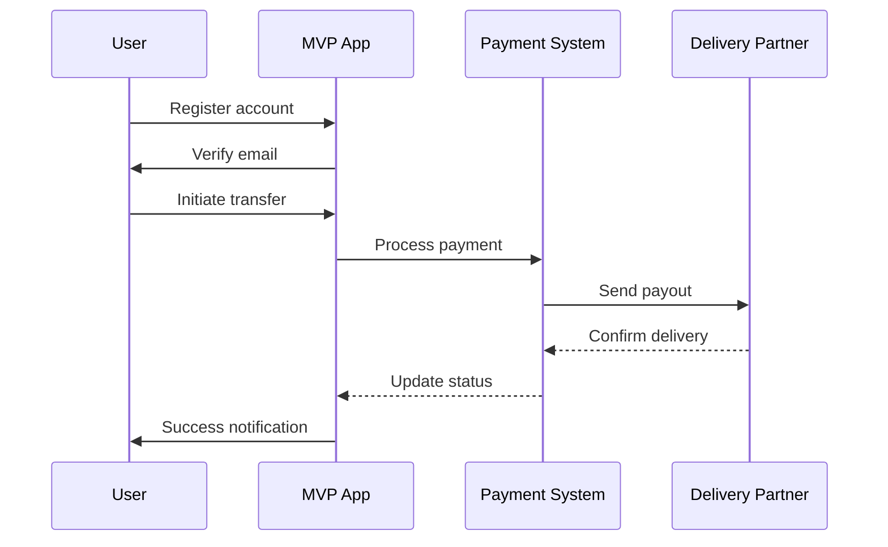

# BRD-MVP-TEMPLATE: Business Requirements Document (MVP)

<!--
AI_CONTEXT_START
Role: AI Product Owner / Business Analyst
Objective: Create a streamlined MVP Business Requirements Document.
Constraints:
- Focus strictly on MVP scope (5-15 core requirements).
- Keep descriptions concise and avoiding generic filler.
- Maintain single-file structure.
- Prioritize P1 (Must Have) features.
AI_CONTEXT_END
-->
---
title: "BRD-MVP-TEMPLATE: Streamlined Business Requirements Document for MVP"
tags:
  - brd-template
  - mvp-template
  - layer-1-artifact
  - document-template
custom_fields:
  document_type: brd
  artifact_type: BRD
  layer: 1
  architecture_approaches: [ai-agent-based]
  priority: shared
  development_status: draft
  template_for: mvp-business-requirements-document
  descriptive_slug: null
  schema_reference: "BRD_SCHEMA.yaml"
  schema_version: "1.0"
  schema_status: optional
  template_profile: mvp
  template_source: "BRD-MVP-TEMPLATE.md"
  creation_rules_reference: "BRD_MVP_CREATION_RULES.md"
  validation_rules_reference: "BRD_MVP_VALIDATION_RULES.md"
  traceability_matrix_template: "BRD-00_TRACEABILITY_MATRIX-TEMPLATE.md"
---

> **Purpose**: This is a **streamlined BRD template** for Minimum Viable Product (MVP) projects. It maintains framework compliance while reducing documentation overhead for projects focused on delivering core functionality quickly.
>
> **Use this template when**:
> - Building an MVP with 5-15 core features
> - Fast iteration is prioritized over comprehensive planning
> - You need working product for real users, not just technical validation
> - Team size is small (2-10 people)

> **Section Mapping Note**: MVP template uses condensed section numbering tailored for MVP scope.

> **Validation Note**: MVP templates are intentionally streamlined; some full-template checks will report expected differences (e.g., reduced sections). See `scripts/README.md` → "MVP Template Validation" for guidance.

> References: Schema `BRD_SCHEMA.yaml` | Rules `BRD_MVP_CREATION_RULES.md`, `BRD_MVP_VALIDATION_RULES.md` | Matrix `BRD-00_TRACEABILITY_MATRIX-TEMPLATE.md`

---

## 0. Document Control

| Item | Details |
|------|---------|
| **Project Name** | [Enter MVP project name] |
| **Document Version** | [e.g., 1.0] |
| **Date** | [Current date] |
| **Document Owner** | [Name and title] |
| **Prepared By** | [Business Analyst name] |
| **Status** | [Draft / In Review / Approved] |
| **MVP Target Launch** | [Target date] |
| **PRD-Ready Score** | [Score]/100 (Target: ≥90/100) |

### Executive Summary (MVP)
[One-paragraph elevator pitch of the MVP: target users, core value, and expected impact.]

### Document Revision History

| Version | Date | Author | Changes Made | Approver |
|---------|------|--------|--------------|----------|
| 1.0 | [Date] | [Name] | Initial MVP draft | |

---

## 1. Introduction

Business Context (MVP):
[Brief situational context — what business environment or trigger motivates this MVP?]

### 1.1 Purpose
This Business Requirements Document (BRD) defines the business requirements for [MVP Project Name]. This document focuses on the **Minimum Viable Product** - the smallest set of features needed to deliver value to early users and validate the core business hypothesis.

### 1.2 Document Scope
This document covers:
- Core business objectives for MVP
- Essential functional requirements (5-15 requirements)
- Baseline quality attributes (performance, security, usability)
- Streamlined architecture decision topics
- MVP success criteria and transition to full product

**Out of Scope for MVP BRD**:
- Detailed stakeholder communication plans (simplified to key approvers)
- Comprehensive cost-benefit analysis (ROI estimate only)
- Full support and maintenance operations (basic support plan)
- Extensive user story matrices (5-10 high-level stories)

### 1.3 Intended Audience
- Executive sponsor (approval authority)
- Product manager (feature prioritization)
- Development team (technical implementation)
- Early users/beta testers (feedback loop)

### 1.4 Document Conventions
- **Must/Shall:** MVP critical requirements (P1)
- **Should:** Important for MVP (P2)
- **Future:** Post-MVP enhancements (documented but deferred)

---

## 2. Business Objectives

### 2.1 MVP Hypothesis
[State the core hypothesis this MVP aims to validate. Example: "Users will pay for instant cross-border money transfers if the experience is simpler than traditional methods."]

**Key Validation Questions**:
1. [Question 1 - e.g., "Will users complete onboarding in <5 minutes?"]
2. [Question 2 - e.g., "Will we achieve ≥90% transaction success rate?"]
3. [Question 3 - e.g., "Will users rate the experience ≥4.0/5?"]

### 2.2 Business Problem Statement
**Problem**: [Concise description of the business problem]

**Impact**: [Quantifiable impact - revenue loss, customer pain, market gap]

**MVP Solution**: [How the MVP addresses this problem with minimum features]

### 2.3 MVP Business Goals

1. **Goal 1**: [Primary business goal - e.g., "Validate market demand"]
2. **Goal 2**: [Secondary goal - e.g., "Prove technical feasibility"]
3. **Goal 3**: [Tertiary goal - e.g., "Build early user community"]

### 2.4 MVP Success Metrics

| Objective ID | Objective Statement | Success Metric | MVP Target | Measurement Period |
|--------------|---------------------|----------------|------------|-------------------|
| BRD.NN.23.01 | [Objective] | [How measured] | [Target] | [90 days post-launch] |
| BRD.NN.23.02 | [Objective] | [How measured] | [Target] | [90 days post-launch] |
| BRD.NN.23.03 | [Objective] | [How measured] | [Target] | [90 days post-launch] |

### 2.5 Expected Benefits (MVP Scope)

**Quantifiable Benefits**:
- User acquisition: [Target number] early users
- Revenue validation: [Target $] in test transactions
- Time to market: Launch in [X weeks/months]

**Qualitative Benefits**:
- Market validation for full product investment
- User feedback for product refinement
- Team learning on technical stack

---

## 3. Project Scope

### 3.1 MVP Scope Statement
[Define the minimum set of features needed to deliver value and validate the business hypothesis. Be explicit about what's included vs deferred.]

### 3.2 MVP Core Features (In-Scope)

**P1 - Must Have for MVP Launch**:
1. [Core feature 1 - e.g., "User registration and basic profile"]
2. [Core feature 2 - e.g., "Single payment corridor (US → Mexico)"]
3. [Core feature 3 - e.g., "Bank account payout only"]
4. [Core feature 4 - e.g., "Email notifications"]
5. [Core feature 5 - e.g., "Basic transaction history"]

**P2 - Should Have if Time Permits**:
1. [Nice-to-have feature 1]
2. [Nice-to-have feature 2]

### 3.3 Explicitly Out-of-Scope for MVP

**Future Enhancements (Post-MVP)**:
1. [Feature deferred - e.g., "Multiple payment corridors"]
2. [Feature deferred - e.g., "Cash pickup options"]
3. [Feature deferred - e.g., "Mobile apps (web-only for MVP)"]
4. [Feature deferred - e.g., "Real-time chat support"]

**Rationale**: MVP focuses on proving core value proposition; additional features added based on user feedback.

### 3.4 MVP Workflow (High-Level)

**End-to-End User Journey**:

**Happy Path Summary** (5-7 key steps):
1. [Step 1 - User action and business outcome]
2. [Step 2 - User action and business outcome]
3. [Step 3 - User action and business outcome]
4. [Step 4 - User action and business outcome]
5. [Step 5 - User action and business outcome]

### 3.5 MVP Technology Stack

**User-Facing Platforms**:
- Web application (browser-based, responsive design)
- [Mobile apps: Out of scope for MVP]

**Core Technology Decisions**:
- [Frontend: e.g., React/Next.js]
- [Backend: e.g., Node.js/Python]
- [Database: e.g., PostgreSQL]
- [Hosting: e.g., GCP/AWS]

> **Note**: Detailed technology evaluation in Section 7 (Architecture Decision Requirements)

---

## 4. Stakeholders

**Decision Makers**:
- **Executive Sponsor**: [Name/Title] - Final approval authority
- **Product Owner**: [Name/Title] - Feature prioritization
- **Technical Lead**: [Name/Title] - Architecture decisions

**Key Contributors**:
- **Compliance/Legal**: [Department] - Regulatory guidance (if applicable)
- **Early Users/Beta Testers**: [Description] - Feedback loop

> **Full stakeholder matrix**: Deferred to full product phase. MVP focuses on minimal approval chain.

---

## 5. User Stories

> **Complete user stories**: Detailed user story tables belong in PRD. This section provides high-level summaries for MVP.

> **MVP vs Full BRD**: These user story tables are simplified for MVP scope (5-10 stories).
> Full BRD Section 5 would contain only category summaries with detailed stories in PRD.
> For MVP, consolidated tables are acceptable to reduce document count.

**ID Format**: `BRD.NN.09.SS` (User Story)

### 5.1 Primary User Stories (MVP Essential)

**End Users** (5-7 core stories):

| Story ID | User Role | Action | Business Value | Priority |
|----------|-----------|--------|----------------|----------|
| BRD.NN.09.01 | [user role] | [core action] | [business value] | P1 |
| BRD.NN.09.02 | [user role] | [core action] | [business value] | P1 |
| BRD.NN.09.03 | [user role] | [core action] | [business value] | P1 |
| BRD.NN.09.04 | [user role] | [core action] | [business value] | P2 |
| BRD.NN.09.05 | [user role] | [core action] | [business value] | P2 |

**Operational Users** (2-3 stories):

| Story ID | User Role | Action | Business Value | Priority |
|----------|-----------|--------|----------------|----------|
| BRD.NN.09.06 | [admin/support role] | [capability] | [operational efficiency] | P1 |
| BRD.NN.09.07 | [compliance role] | [capability] | [regulatory compliance] | P1 |

### 5.2 User Story Summary

- **Total MVP User Stories**: [X] (P1: [Y], P2: [Z])
- **Future Phase Stories**: [XX] (logged for post-MVP roadmap)

---

## 6. Functional Requirements

> **Terminology Note**: Functional Requirements in BRD are business-level capabilities. Technical implementation details belong in PRD.

### 6.1 MVP Requirements Overview

**Priority Definitions**:
- **P1 (Must Have)**: Essential for MVP launch; blocks go-live if missing
- **P2 (Should Have)**: Important but workarounds exist for MVP
- **Future**: Post-MVP enhancements based on user feedback

### 6.2 MVP Functional Requirements

Quick Core MVP Requirements Checklist:
- [ ] P1 Requirement 1 (must have for MVP)
- [ ] P1 Requirement 2
- [ ] P1 Requirement 3

---

### 6.3 BRD.NN.01.01: [MVP Core Feature 1 - Business Capability Name]

**ID Format**: `BRD.NN.01.SS` (Feature Requirement)

**Business Capability**: [One-sentence description of what business capability this enables for MVP]

**Business Requirements**:
- [Business need 1 - what must be accomplished]
- [Business need 2 - regulatory or compliance requirement if applicable]
- [Business need 3 - partner dependency at business level]

**Business Rules**:
- [Policy constraint 1 - business rule that governs behavior]
- [Policy constraint 2 - regulatory limit or threshold]

**Business Acceptance Criteria**:

| Criteria ID | Criterion | MVP Target |
|-------------|-----------|------------|
| BRD.NN.06.01 | [Measurable criterion] | [Target value] |
| BRD.NN.06.02 | [Measurable criterion] | [Target value] |

**Related Requirements**: [Platform BRDs or related Feature BRDs]

**Complexity**: X/5 ([Business rationale])

---

### 6.4 BRD.NN.01.02: [MVP Core Feature 2]

[Repeat structure above for each core MVP feature - aim for 5-15 requirements total]

---

### 6.3 Business Rules (Core Only)

[Document critical business rules for MVP - 5-10 rules maximum]

| Rule ID | Business Rule Description | Conditions | Actions | Priority |
|---------|--------------------------|------------|---------|----------|
| BR-001 | [Core rule] | [When this exists] | [System must do this] | P1 |
| BR-002 | [Core rule] | [When this exists] | [System must do this] | P1 |

---

## 7. Quality Attributes

### 7.1 MVP Quality Attributes Overview

**MVP Philosophy**: Establish baseline quality for core user experience. Advanced quality attributes (extensive scalability, comprehensive observability) deferred to full product.

### 7.2 Architecture Decision Requirements (Streamlined for MVP)

> **Framework Compliance**: All BRDs must address 7 mandatory ADR topic categories. MVP template uses streamlined format.

#### 7.2.1 Mandatory ADR Topics (MVP Streamlined Format)

---

#### BRD.NN.32.01: Infrastructure - [Hosting & Deployment]

**Status**: [ ] Selected | [ ] Pending | [ ] N/A

**Business Driver**: [Why MVP needs this - e.g., "Need rapid deployment for user testing"]

**Budget Constraint**: $[X,XXX]/month maximum

**Recommended Selection**: [Option - e.g., "GCP Cloud Run for serverless MVP"] OR **Pending**

**Rationale**: [1-2 sentence business justification]

**PRD Requirements**: [What PRD must detail - e.g., "Container configuration, auto-scaling thresholds"]

---

#### BRD.NN.32.02: Data Architecture - [Database & Storage]

**Status**: [ ] Selected | [ ] Pending | [ ] N/A

**Business Driver**: [Data requirements]

**Budget Constraint**: $[X,XXX]/month maximum

**Recommended Selection**: [Option - e.g., "PostgreSQL on Cloud SQL"] OR **Pending**

**Rationale**: [1-2 sentence business justification]

**PRD Requirements**: [What PRD must detail]

---

#### BRD.NN.32.03: Integration - [External Systems]

**Status**: [ ] Selected | [ ] Pending | [ ] N/A - [No external integrations for MVP]

**Business Driver**: [Integration needs - e.g., "Partner API for payouts"]

**Recommended Selection**: [Option] OR **Pending**

**PRD Requirements**: [What PRD must detail]

---

#### BRD.NN.32.04: Security - [Authentication & Data Protection]

**Status**: [ ] Selected | [ ] Pending | [ ] N/A

**Business Driver**: [Security requirements - regulatory or user trust]

**Compliance Requirements**: [e.g., "GDPR for EU users, basic PII encryption"]

**Recommended Selection**: [Option - e.g., "Firebase Auth + field-level encryption"]

**PRD Requirements**: [What PRD must detail]

---

#### BRD.NN.32.05: Observability - [Monitoring & Logging]

**Status**: [ ] Selected | [ ] Pending | [ ] N/A - [Basic logging only for MVP]

**Business Driver**: [Why needed - e.g., "Error tracking for MVP iteration"]

**Recommended Selection**: [Option - e.g., "Cloud provider native logging"]

**PRD Requirements**: [What PRD must detail]

---

#### BRD.NN.32.06: AI/ML - [If Applicable]

**Status**: [ ] Selected | [ ] Pending | [X] N/A - [No AI/ML in MVP scope]

**Rationale**: [Why N/A or what's needed]

---

#### BRD.NN.32.07: Technology Selection - [Core Stack]

**Status**: [ ] Selected | [ ] Pending | [ ] N/A

**Business Driver**: [Why technology choice matters]

**Team Constraints**: [Existing skills to leverage]

**Recommended Selection**: [Tech stack - e.g., "React + Node.js + PostgreSQL"]

**Rationale**: [Team expertise, rapid development, community support]

**PRD Requirements**: [Detailed framework versions, build process]

---

### 7.3 Performance Requirements (MVP Baseline)

**ID Format**: `BRD.NN.02.SS` (Quality Attribute)

| Req ID | Requirement | Metric | MVP Target | Priority |
|--------|-------------|--------|------------|----------|
| BRD.NN.02.01 | Page load time | Load time | <3 seconds | P1 |
| BRD.NN.02.02 | Transaction processing | Response time | <10 seconds | P1 |
| BRD.NN.02.03 | Concurrent users | User capacity | 100 users | P2 |

### 7.4 Security Requirements (MVP Essential)

| Req ID | Requirement | Standard | Priority | Validation |
|--------|-------------|----------|----------|------------|
| BRD.NN.02.10 | User authentication | Email + password (min) | P1 | Login testing |
| BRD.NN.02.11 | Data encryption at rest | AES-256 | P1 | Security audit |
| BRD.NN.02.12 | HTTPS/TLS | TLS 1.2+ | P1 | Certificate check |
| BRD.NN.02.13 | PII protection | Field-level encryption | P1 | Compliance review |

### 7.5 Reliability Requirements (MVP Baseline)

| Req ID | Requirement | MVP Target | Priority |
|--------|-------------|------------|----------|
| BRD.NN.02.20 | System uptime | 95% (MVP acceptable) | P2 |
| BRD.NN.02.25 | Backup frequency | Daily | P1 |
| BRD.NN.02.26 | Recovery time (RTO) | <4 hours | P2 |

> **Note**: Full product will target 99.9% uptime. MVP focuses on functionality validation.

---

## 8. Business Constraints and Assumptions

### 8.1 MVP Business Constraints

**ID Format**: `BRD.NN.03.SS` (Business Constraint)

| ID | Constraint Category | Description | Impact |
|----|---------------------|-------------|--------|
| BRD.NN.03.01 | Budget | MVP budget capped at $[XXX,XXX] | Limits scope to core features |
| BRD.NN.03.02 | Timeline | Must launch within [X] weeks | Drives feature prioritization |
| BRD.NN.03.03 | Team Size | [X] developers available | Limits parallel workstreams |
| BRD.NN.03.04 | [Regulatory] | [If applicable] | [Impact] |

### 8.2 MVP Assumptions

**ID Format**: `BRD.NN.04.SS` (Business Assumption)

| ID | Assumption | Validation Method | Impact if False |
|----|------------|-------------------|-----------------|
| BRD.NN.04.01 | [Assumption] | [How to validate] | [Mitigation plan] |
| BRD.NN.04.02 | [Assumption] | [How to validate] | [Mitigation plan] |

---

## 9. Acceptance Criteria

### 9.1 MVP Launch Criteria

**Must-Have Criteria** (All must be met):
1. [ ] All P1 functional requirements implemented and tested
2. [ ] MVP success metrics defined and tracking enabled
3. [ ] Security baseline met (authentication, encryption, HTTPS)
4. [ ] Basic error handling and user feedback in place
5. [ ] Early user onboarding flow tested with [X] beta users
6. [ ] Legal/compliance approval (if applicable)

**Should-Have Criteria** (80% completion acceptable):
1. [ ] All P2 functional requirements
2. [ ] Automated testing coverage ≥60%
3. [ ] Documentation for early users (FAQ, help content)

### 9.2 MVP Success Validation (Post-Launch)

**30-Day Metrics**:
- [ ] [X] active users
- [ ] [Y] successful transactions
- [ ] ≥[Z]% transaction success rate
- [ ] User satisfaction score ≥[rating]

**90-Day Decision Gate**:
- Proceed to full product if [criteria met]
- Pivot if [criteria indicate different direction]
- Shutdown if [validation fails]

---

## 10. Business Risk Management

**ID Format**: `BRD.NN.05.SS` (Business Risk)

| Risk ID | Risk Description | Likelihood | Impact | Mitigation Strategy | Owner |
|---------|------------------|------------|--------|---------------------|-------|
| BRD.NN.05.01 | [Top risk 1] | High/Med/Low | High/Med/Low | [How to mitigate] | [Role] |
| BRD.NN.05.02 | [Top risk 2] | High/Med/Low | High/Med/Low | [How to mitigate] | [Role] |
| BRD.NN.05.03 | [Top risk 3] | High/Med/Low | High/Med/Low | [How to mitigate] | [Role] |

**Risk Acceptance**: MVP accepts higher risk tolerance than full product. Focus on critical user experience and data security risks only.

---

## 11. Implementation Approach

### 11.1 MVP Development Phases

**Phase 1 - Foundation** (Weeks 1-[X]):
- [Infrastructure setup]
- [Core database schema]
- [Authentication]

**Phase 2 - Core Features** (Weeks [X]-[Y]):
- [Feature 1]
- [Feature 2]
- [Feature 3]

**Phase 3 - Integration & Testing** (Weeks [Y]-[Z]):
- [Partner integrations]
- [End-to-end testing]
- [Beta user testing]

**Phase 4 - Launch** (Week [Z]):
- [Production deployment]
- [User onboarding]
- [Monitoring setup]

### 11.2 MVP Support Model (Basic)

**Support Channels**:
- Email support: [email address]
- Response SLA: [X] business hours
- Escalation: [Process]

**Known Limitations**:
- No 24/7 support for MVP
- Limited language support ([English only, etc.])
- Basic self-service help content only

> **Full support operations**: Defined post-MVP based on user volume and feedback.

---

## 12. Cost-Benefit Analysis

**Development Costs**:
- Team: [X] people × [Y] weeks = $[ZZZ,ZZZ]
- Infrastructure: $[X,XXX]/month
- Third-party services: $[X,XXX]/month

**Total MVP Investment**: $[XXX,XXX]

**ROI Hypothesis**: [Expected return or validation metric]

> **Detailed cost-benefit analysis**: Deferred until MVP validates market demand.

---

## 13. Traceability

### 13.1 Upstream Dependencies

**ID Format**: `@upstream: [artifact-type]: [ID]`

| Upstream Artifact | Reference | Relevance |
|-------------------|-----------|-----------|
| [Stakeholder Requirements] | [Document] | [How it informs this BRD] |
| [Market Research] | [Document] | [How it informs this BRD] |

> **Note**: Use `null` if no upstream artifacts exist.

### 13.2 Downstream Artifacts (Expected)

**ID Format**: `@downstream: [artifact-type]: [placeholder]`

- **PRD**: Product Requirements Document (Layer 2) - Detailed technical specifications
- **03_EARS/BDD**: Test specifications (Layer 7) - Acceptance test scenarios
- **ADR**: Architecture Decision Records (Layer 5) - Technology selections from Section 7

> **Note**: Do NOT create numeric downstream references (PRD-#, ADR-#) until artifacts exist.

### 13.3 Cross-BRD References

[If this MVP depends on platform BRDs]

| Related BRD | Dependency Type | Rationale |
|-------------|----------------|-----------|
| Platform BRD (e.g., BRD-01) | Foundation | [Infrastructure/services required] |

---

## 14. Glossary

📚 **Master Glossary**: For common terminology, see [BRD-00_GLOSSARY.md](BRD-00_GLOSSARY.md)

### 14.1 MVP-Specific Terms

| Term | Definition | Context |
|------|------------|---------|
| [MVP Term 1] | [Definition] | [Where used in this BRD] |
| [MVP Term 2] | [Definition] | [Where used in this BRD] |

> **MVP Simplification**: Full BRD requires 6 glossary subsections (17.1-17.6). MVP consolidates to:
> - Master Glossary reference (links to shared terms)
> - MVP-Specific Terms (project-unique terminology)
>
> Expand to full structure during Migration to Full BRD (Section 16).

---

## 15. Appendices

### 15.1 Appendix A: MVP Metrics Dashboard

| Metric | Target | Data Source | Review Frequency |
|--------|--------|-------------|------------------|
| [Metric 1] | [Target] | [System] | Daily |
| [Metric 2] | [Target] | [System] | Weekly |

### 15.2 Appendix B: Future Roadmap (Post-MVP)

**If MVP Succeeds**:
- Phase 2 features: [List]
- Platform scaling: [Considerations]
- Market expansion: [Plans]

**Transition Criteria**:
- MVP → Full Product requires: [Criteria]

---

## 16. Migration to Full BRD Template

### 16.1 When to Migrate

- [ ] MVP validation complete (30-90 day metrics achieved)
- [ ] Product scope expanding beyond MVP features
- [ ] Regulatory or compliance requirements demand comprehensive documentation
- [ ] Stakeholder matrix requires formal communication plan
- [ ] Partner integrations require detailed SLAs

### 16.2 Migration Steps

2. **Transfer core content**: Copy sections 1-7 from MVP to corresponding full template sections
3. **Expand sections**: Add missing sections from full template:
   - Extended stakeholder analysis (Section 4 in full)
   - Detailed cost-benefit analysis (Section 8 in full)
   - Comprehensive risk register (Section 9 in full)
   - Full support and operations plan (Section 10 in full)
   - Complete appendices
4. **Update traceability**: Ensure all downstream references point to new document ID
5. **Archive MVP version**: Move MVP BRD to archive with "superseded by BRD-NN" note
6. **Run validation**: Execute `python3 scripts/validate_brd.py` on new document

### 16.3 Section Mapping (MVP → Full)

| MVP Section | Full Template Section |
|-------------|-----------------------|
| 1. Introduction | 1. Introduction |
| 2. Business Objectives | 2. Business Objectives |
| 3. MVP Scope | 3. Project Scope (expand) |
| 4. Stakeholders (Simplified) | 4. Stakeholder Analysis (expand) |
| 5. User Stories | 5. User Stories & Personas (expand) |
| 6. Functional Requirements | 6. Functional Requirements (expand) |
| 7. Quality Attributes | 7. Quality Attributes (expand) |
| 8. Constraints & Assumptions | 8. Business Constraints (expand) |
| 9. Acceptance Criteria | 9. Risk Management (expand) |
| 10-15 (various) | 10-17 (add full sections) |

---

## Document Control Notes

**MVP Iteration Philosophy**:
- This BRD is intentionally lean for rapid iteration
- Detailed requirements will be evolved based on user feedback
- Expect frequent updates during MVP phase

**Version Management**:
- Track all changes in revision history
- MVP BRD may have faster release cadence than full BRD
- Lock requirements 1 week before launch

---

## 17. File Size Guidelines

- **MVP BRD Target**: 200-400 lines (this template ~600 lines with instructions)
- **If exceeding 500 lines**: Consider whether this is truly an MVP scope or needs full BRD
- **Section splitting**: Generally not needed for MVP, use monolithic template

---

**End of MVP BRD Template**
