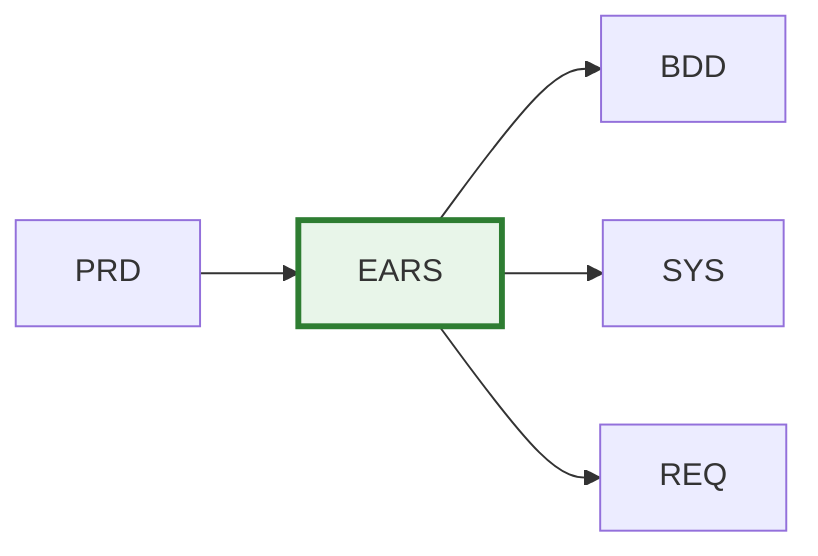

# EARS-000: EARS Requirements Master Index

Note: Some examples in this document show a portable `docs/` root. In this repository, artifact folders live at the ai_dev_flow root without the `docs/` prefix; see README → “Using This Repo” for path mapping.

## Purpose

This document serves as the master index for all EARS (Event-Action-Response-State) Requirements in the project. Use this index to:

- **Discover** existing formal requirements
- **Track** requirement specification status
- **Coordinate** requirements engineering across teams
- **Reference** atomic, testable requirements

## Position in Document Workflow



> **Note on Diagram Labels**: The above flowchart shows the sequential workflow. For formal layer numbers used in cumulative tagging, always reference the 15-layer architecture (Layers 0-14) defined in README.md. Diagram groupings are for visual clarity only.

**Layer**: 3 (Formal Requirements Layer)
**Upstream**: BRD, PRD
**Downstream**: BDD, SYS, REQ

## EARS Requirements Index

| EARS ID | Title | Requirement Type | Status | Related PRD | Test Coverage | Last Updated |
|---------|-------|------------------|--------|-------------|---------------|--------------|
| [EARS-MVP-TEMPLATE.md](./EARS-MVP-TEMPLATE.md) | Template (default) | Reference | Reference | - | - | 2025-11-13T00:00:00 |

## Planned

- Use this section to list EARS documents planned but not yet created. Move rows to the main index table when created.

| ID | Title | Source PRD | Priority | Notes |
|----|-------|------------|----------|-------|
| EARS-XX | … | PRD-YY | High/Med/Low | … |

## Status Definitions

| Status | Meaning | Description |
|--------|---------|-------------|
| **Draft** | In development | EARS requirements being written |
| **Review** | Under review | Technical review in progress |
| **Approved** | Finalized | Requirements approved and testable |
| **Implemented** | In system | Requirements implemented in code |
| **Verified** | Tested | Requirements verified through testing |
| **Deprecated** | Obsolete | No longer valid, superseded by newer requirement |

## EARS Statement Types

| Type | Pattern | Example | Usage |
|------|---------|---------|-------|
| **Event-driven** | WHEN [trigger] THEN [response] | WHEN user clicks submit THEN validate form | Triggered actions |
| **State-driven** | WHILE [state] THEN [response] | WHILE system is offline THEN queue requests | Continuous conditions |
| **Unwanted** | IF [condition] THEN [prevention] | IF invalid input THEN reject with error | Error handling |
| **Optional** | WHERE [feature enabled] THEN [response] | WHERE premium enabled THEN show analytics | Feature flags |
| **Ubiquitous** | THE [system] SHALL [requirement] | THE system SHALL log all transactions | Always-on requirements |

## Adding New EARS Requirements

When creating a new EARS document:

1. **Copy Template**:
   ```bash
   cp ai_dev_flow/03_EARS/EARS-MVP-TEMPLATE.md \
      docs/03_EARS/EARS-NN_requirement_area.md
   ```

2. **Assign EARS ID**: Use next sequential number (EARS-01, EARS-02, ...)

3. **Update This Index**: Add new row to table above

4. **Create Cross-References**: Update related PRD and create downstream BDD scenarios

## Allocation Rules

- **Numbering**: Allocate sequentially starting at `01`
- **One Area Per File**: Each `EARS-NN` file covers a coherent requirement area
- **Slugs**: Short, descriptive, lower_snake_case
- **Testability**: Every requirement must be verifiable through testing
- **Index Updates**: Add entry for every new EARS document

## Index by Requirement Type

### Event-Driven Requirements
- None

### State-Driven Requirements
- None

### Unwanted Behavior (Error Handling)
- None

### Optional Features
- None

### Ubiquitous Requirements
- None

## Index by Status

### Draft
- None

### Review
- None

### Approved
- None

### Implemented
- None

### Verified
- None

## Test Coverage Summary

| EARS ID | Total Requirements | BDD Scenarios | Unit Tests | Integration Tests | Coverage % |
|---------|-------------------|---------------|------------|-------------------|------------|
| - | 0 | 0 | 0 | 0 | 0% |

## Metrics

| Metric | Value | Description |
|--------|-------|-------------|
| Total EARS Documents | 0 | Total formal requirement documents |
| Total Requirements | 0 | Total atomic requirements specified |
| Event-Driven | 0 | WHEN/THEN requirements |
| State-Driven | 0 | WHILE/THEN requirements |
| Test Coverage | 0% | Percentage with BDD scenarios |
| Verification Rate | 0% | Percentage verified through testing |

## Related Documents

- **Template**: [EARS-MVP-TEMPLATE.md](./EARS-MVP-TEMPLATE.md)
- **README**: [README.md](./README.md) - Learn about EARS purpose and statement types
- **Traceability Matrix**: [EARS-00_TRACEABILITY_MATRIX-TEMPLATE.md](./EARS-00_TRACEABILITY_MATRIX-TEMPLATE.md)

## Maintenance Guidelines

### Updating This Index

- Update whenever new EARS document is created
- Track status changes through requirement lifecycle
- Maintain test coverage metrics
- Link to BDD scenarios for verification

### Quality Checks

Before marking EARS as "Approved":
- ✅ All requirements follow EARS patterns (WHEN/THEN, WHILE/THEN, etc.)
- ✅ Requirements are atomic and independently testable
- ✅ Measurable acceptance criteria defined
- ✅ Cross-references to PRD complete
- ✅ BDD scenarios planned or created

---

**Index Version**: 2.0
**Last Updated**: 2025-11-13T00:00:00
**Maintainer**: [Project Team]
