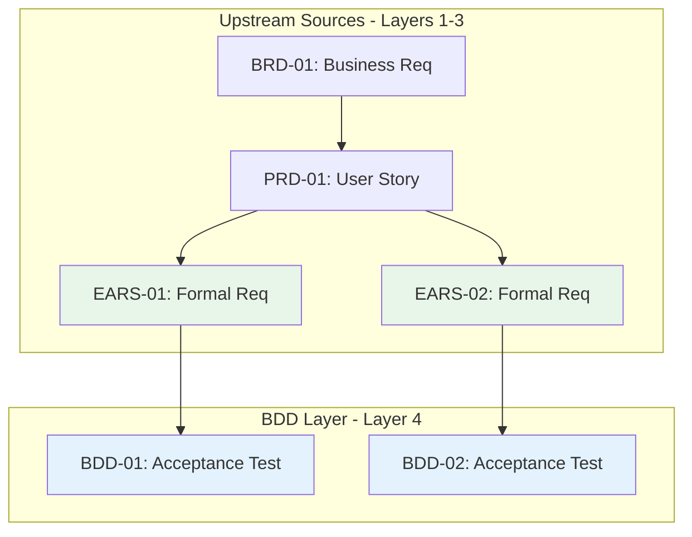

# Traceability Matrix: BDD-01 through BDD-NN

## Document Control

| Item | Details |
|------|---------|
| Document ID | TRACEABILITY_MATRIX_BDD |
| Title | Comprehensive BDD Test Scenarios Traceability Matrix |
| Status | [Active/Draft] |
| Version | 1.0.0 |
| Date Created | YYYY-MM-DD |
| Author | [Team Name] |
| Purpose | Track upstream traceability for all Behavior-Driven Development (BDD) test scenarios |


---

**⚠️ TAG-BASED AUTO-GENERATION AVAILABLE**

This traceability matrix can be automatically generated by scanning code files for @bdd:, @spec:, @test: tags.

**Recommended Approach:** Use tag-based auto-discovery instead of manual maintenance.

**Generate automatically using:**
```bash
# Extract tags from all files
python scripts/extract_tags.py --source src/ docs/ tests/ --output docs/generated/tags.json

# Validate tags against documents
python scripts/validate_tags_against_docs.py --tags docs/generated/tags.json --strict

# Generate BDD traceability matrix
python scripts/generate_traceability_matrix.py --type BDD --output docs/04_BDD/BDD-00_TRACEABILITY_MATRIX.md
```

**Benefits:**
- ✅ Single source of truth: Tags embedded in code
- ✅ Always up-to-date: Generated from current codebase
- ✅ No manual sync: Automated validation prevents drift
- ✅ Coverage metrics: Automatically calculated

**Tag Format:** `@bdd: BDD.NN.EE.SS` (unified 4-segment format, e.g., `BDD.03.13.01`)

See: [TRACEABILITY.md](../TRACEABILITY.md#tag-based-auto-discovery-alternative) for complete tag-based workflow.

---

## 1. Overview

### 1.1 Document Type Description
BDD documents define acceptance criteria using Gherkin syntax (Given-When-Then), providing executable specifications that validate requirements through automated testing.

### 1.2 Coverage Scope
This matrix tracks all BDD feature files and their upstream sources (BRD, PRD, EARS). Downstream documents (ADR, SYS, REQ, SPEC) track their own upstream references to BDD—this matrix does not maintain downstream links.

### 1.3 Statistics
- **Total BDD Files Tracked**: [X] documents
- **Total Scenarios**: [Y] test scenarios
- **Total Steps**: [Z] test steps
- **Coverage Period**: [Start Date] to [End Date]
- **Last Updated**: YYYY-MM-DD

---

## 2. Required Tags (Cumulative Tagging Hierarchy - Layer 4)

### 2.1 Tag Requirements for BDD Artifacts

**Layer**: 4
**Artifact Type**: BDD (Behavior-Driven Development Test Scenarios)
**Required Tags**: `@brd`, `@prd`, `@ears`
**Tag Count**: 3+ (minimum 3, may include additional scenario-specific references)

### 2.2 Tag Format

**Gherkin Feature File Format**:
```gherkin
@brd: BRD.NN.EE.SS
@prd: PRD.NN.EE.SS
@ears: EARS.NN.EE.SS
Feature: Feature Name
```

**Markdown Documentation Format**:
```markdown
@brd: BRD.NN.EE.SS
@prd: PRD.NN.EE.SS
@ears: EARS.NN.EE.SS
```

**Format Rules**:
- Prefix: `@` symbol
- Artifact Type: lowercase (`brd`, `prd`, `ears`)
- Separator: colon `:` after artifact type, `:` between document ID and requirement ID
- Document ID: Standard format (e.g., `BRD-09`, `PRD-016`, `EARS-012`)
- Requirement ID: Specific requirement/section identifier
- Multiple Values: comma-separated `@brd: BRD.01.01.30, BRD.01.01.06`
- Gherkin: Use tag-per-line format before Feature declaration

### 2.3 Example: BDD Feature File with Required Tags

```gherkin
# BDD-015: Place Limit Order Acceptance Tests
# File: features/order_placement/place_limit_order.feature

@brd: BRD.09.01.15
@brd: BRD.09.01.06
@prd: PRD.16.01.03
@ears: EARS.12.24.02
@ears: EARS.12.24.01
Feature: Place Limit Order
  As a trader
  I want to place limit orders with specified price and quantity
  So that I can control my operation execution price

  Background:
    Given the service system is connected to Interactive providers
    And I have sufficient buying power

  @scenario-place-order
  Scenario: Successfully place a limit order for ITEM-001 item
    Given I am authenticated as an active trader
    When I submit a limit order to BUY 100 shares of ITEM-001 at $150.00
    Then the order should be accepted by the provider
    And the order status should be "Submitted"
    And I should receive an order confirmation with order ID
```

**Tag Analysis**:
- `@brd: BRD.09.01.15` - Business requirement for request submission
- `@brd: BRD.09.01.06` - Quality attribute (performance)
- `@prd: PRD.16.01.03` - Product feature specification
- `@ears: EARS.12.24.02` - EARS "WHEN trader submits order" event
- `@ears: EARS.12.24.01` - EARS "THE system SHALL validate order" state

### 2.4 Example: BDD Documentation with Upstream Tags

```markdown
# BDD-015: Place Limit Order Test Scenarios

## 8. Traceability

### 8.1 Upstream Sources

**Required Tags** (Cumulative Tagging Hierarchy - Layer 4):
```markdown
@brd: BRD.09.01.15, BRD.09.01.06
@prd: PRD.16.01.03
@ears: EARS.12.24.02, EARS.12.24.01
```

### 8.2 Downstream Artifacts
- **Test Implementation**: `tests/test_order_placement.py`
- **Code Under Test**: `src/services/order_service.py`
- **Test Data**: `fixtures/order_test_data.json`
```

### 2.5 Validation Rules

1. **Required**: Each BDD artifact MUST include at least one tag for each required layer: `@brd`, `@prd`, `@ears`
2. **Format Compliance**: All tags must follow `@artifact-type: DOC-ID:NN` format
3. **Valid References**: All referenced documents and requirements must exist
4. **No Gaps**: Cannot skip any required upstream layer (BRD, PRD, EARS)
5. **Gherkin Placement**: In feature files, tags must appear before Feature declaration
6. **Scenario-Level Tags**: Additional tags can be added at scenario level for granular traceability

### 2.6 Tag Discovery

BDD tags can be discovered automatically:
```bash
# Find all BDDs and their upstream tags
python scripts/extract_tags.py --type BDD --show-all-upstream

# Validate BDD-015 has required tags
python scripts/validate_tags_against_docs.py \
  --artifact BDD-015 \
  --expected-layers brd,prd,ears \
  --strict

# Generate BDD traceability report
python scripts/generate_traceability_matrix.py \
  --type BDD \
  --show-coverage
```

### 2.7 BDD Traceability Pattern

```
Strategy (Layer 0)
    ↓
BRD (Layer 1) ← Business Requirements
    ↓
PRD (Layer 2) ← Product Features
    ↓
EARS (Layer 3) ← Engineering Requirements
    ↓
[BDD (Layer 4)] ← YOU ARE HERE - Acceptance Tests
    ↓
ADR (Layer 5) ← Architecture Decisions
    ↓
Test Implementation & Code (Layers 13-14)
```

**Key Role**: BDD bridges engineering requirements (EARS) and technical implementation, providing executable acceptance criteria that validate product behavior against business needs.

---

## 4. Complete BDD Inventory

| BDD ID | Title | Feature Category | Scenarios | Steps | Status | Date | Upstream Sources |
|--------|-------|------------------|-----------|-------|--------|------|------------------|
| BDD-01 | [Feature file title] | [Category] | 5 | 25 | Passing | YYYY-MM-DD | EARS-01, PRD-01, BRD-01 |
| BDD-02 | [Feature file title] | [Category] | 3 | 15 | Failing | YYYY-MM-DD | EARS-02, PRD-02, BRD-01 |
| BDD-NN | ... | ... | ... | ... | ... | ... | ... |

**Status Legend**:
- **Passing**: All scenarios pass
- **Failing**: One or more scenarios fail
- **Pending**: Not yet implemented
- **Skipped**: Temporarily disabled

---

## 5. Upstream Traceability (REQUIRED)

> **Traceability Rule**: Upstream traceability is REQUIRED for BDD documents. All BDD test scenarios MUST reference existing BRD, PRD, and EARS documents.

### 5.1 EARS → BDD Traceability

| EARS ID | EARS Title | BDD IDs | BDD Scenarios | Relationship |
|---------|------------|---------|---------------|--------------|
| EARS-01 | [Engineering requirement] | BDD-01 | Scenarios 1-3 | EARS statements validated through BDD |
| EARS-02 | [Engineering requirement] | BDD-02, BDD-03 | Scenarios 1-2, 1 | Multiple BDD files test requirement |
| EARS-NN | ... | ... | ... | ... |

### 5.2 PRD → BDD Traceability

| PRD ID | PRD User Story | BDD IDs | BDD Scenarios | Relationship |
|--------|----------------|---------|---------------|--------------|
| PRD-01 | [User story] | BDD-01 | Scenarios 1-5 | Acceptance criteria defined in BDD |
| PRD-NN | ... | ... | ... | ... |

### 5.3 BRD → BDD Traceability

> **Note**: REQ (Layer 7) is DOWNSTREAM from BDD (Layer 4), not upstream. BDD references BRD, PRD, and EARS only.

| BRD ID | BRD Title | BDD IDs | BDD Scenarios | Relationship |
|--------|-----------|---------|---------------|--------------|
| BRD-01 | [Business requirement] | BDD-01, BDD-02 | Scenarios 1-5 | Business requirement validated through acceptance tests |
| BRD-NN | ... | ... | ... | ... |

### 5.4 Upstream Source Summary

| Source Category | Total Sources | BDD Files | Scenarios | Coverage % |
|-----------------|---------------|-----------|-----------|------------|
| BRD | [X] | [Y] | [Z] | XX% |
| PRD | [X] | [Y] | [Z] | XX% |
| EARS | [X] | [Y] | [Z] | XX% |

> **Note**: BDD (Layer 4) upstream sources are limited to BRD (Layer 1), PRD (Layer 2), and EARS (Layer 3). REQ and ADR are downstream artifacts.

---

## 6. Downstream Reference Guidance

> **Upstream-Only Traceability Rule**: This matrix does NOT track downstream documents. Each downstream artifact tracks its own upstream references. This eliminates post-creation maintenance and ensures traceability accuracy.

### 6.1 How Downstream Documents Reference BDD

When creating downstream artifacts, they MUST include `@bdd` tags referencing this matrix's BDD files:

| Downstream Type | Required Tag Format | Example |
|-----------------|---------------------|---------|
| ADR | `@bdd: BDD.NN.EE.SS` | `@bdd: BDD.15.13.01` |
| SYS | `@bdd: BDD.NN.EE.SS` | `@bdd: BDD.03.13.02` |
| REQ | `@bdd: BDD.NN.EE.SS` | `@bdd: BDD.15.13.01` |
| SPEC | `@bdd: BDD.NN.EE.SS` | `@bdd: BDD.08.13.03` |

### 6.2 Finding Downstream References

To discover which downstream documents reference a specific BDD:

```bash
# Find all ADR documents referencing BDD-15
grep -r "@bdd: BDD.15" ../05_ADR/

# Find all REQ documents referencing any BDD
grep -r "@bdd:" ../07_REQ/

# Find all downstream references to a specific BDD scenario
grep -r "BDD.15.13.01" ../05_ADR/ ../06_SYS/ ../07_REQ/ ../10_SPEC/

# Generate reverse traceability report
python scripts/generate_reverse_traceability.py --upstream BDD-15 --downstream ADR,SYS,REQ,SPEC
```

### 6.3 Downstream Document Responsibilities

Each downstream artifact type has specific tagging responsibilities:

| Artifact | Layer | Must Include | Purpose |
|----------|-------|--------------|---------|
| ADR | 5 | `@brd`, `@prd`, `@ears`, `@bdd` | Architecture decisions validated by BDD tests |
| SYS | 6 | `@brd` through `@bdd`, `@adr` | System requirements derive from BDD scenarios |
| REQ | 7 | `@brd` through `@sys` | Atomic requirements trace to acceptance tests |
| SPEC | 10 | `@brd` through `@ctr` | Specifications implement tested requirements |

---

## 7. BDD Test Coverage Analysis

### 7.1 Scenario Execution Status

| BDD ID | Total Scenarios | Passing | Failing | Pending | Skipped | Pass Rate |
|--------|-----------------|---------|---------|---------|---------|-----------|
| BDD-01 | 5 | 5 | 0 | 0 | 0 | 100% |
| BDD-02 | 3 | 2 | 1 | 0 | 0 | 67% |
| BDD-03 | 4 | 0 | 0 | 4 | 0 | 0% |
| BDD-NN | ... | ... | ... | ... | ... | ... |
| **Total** | **[X]** | **[Y]** | **[Z]** | **[A]** | **[B]** | **XX%** |

### 7.2 Feature Category Coverage

| Feature Category | BDD Files | Scenarios | Pass Rate | Status |
|------------------|-----------|-----------|-----------|--------|
| [Authentication] | 3 | 15 | 100% | ✅ Complete |
| [API Integration] | 5 | 25 | 85% | 🟡 Issues |
| [Data Processing] | 2 | 10 | 100% | ✅ Complete |
| [User Interface] | 4 | 20 | 60% | 🔴 Failing |

### 7.3 Requirements Coverage

| Requirement Type | Total Requirements | BDD Coverage | Coverage % | Status |
|------------------|-------------------|--------------|------------|--------|
| Functional | [X] | [Y] | XX% | [Status] |
| Quality Attribute | [X] | [Y] | XX% | [Status] |
| security | [X] | [Y] | XX% | [Status] |
| Performance | [X] | [Y] | XX% | [Status] |

---

## 8. Cross-BDD Dependencies

### 8.1 BDD Relationship Map



> **Note on Diagram Labels**: The above flowchart shows the sequential workflow. For formal layer numbers used in cumulative tagging, always reference the 16-layer architecture (Layers 0-15) defined in README.md. Diagram groupings are for visual clarity only.

### 8.2 Inter-BDD Dependencies

| Source BDD | Target BDD | Dependency Type | Description |
|------------|------------|-----------------|-------------|
| BDD-01 | BDD-005 | Prerequisite | Authentication tests must pass before authorization |
| BDD-02 | BDD-03 | Setup | Data setup scenarios required |
| BDD-NN | ... | ... | ... |

---

## 9. Test Execution Metrics

### 9.1 Execution Performance

| BDD ID | Scenarios | Avg Duration | Total Duration | Performance Status |
|--------|-----------|--------------|----------------|-------------------|
| BDD-01 | 5 | 2.3s | 11.5s | ✅ Good |
| BDD-02 | 3 | 5.7s | 17.1s | 🟡 Slow |
| BDD-03 | 4 | 1.2s | 4.8s | ✅ Good |
| BDD-NN | ... | ... | ... | ... |

### 9.2 Flakiness Analysis

| BDD ID | Executions | Flaky Runs | Flakiness % | Stability |
|--------|------------|------------|-------------|-----------|
| BDD-01 | 100 | 0 | 0% | ✅ Stable |
| BDD-02 | 100 | 5 | 5% | 🟡 Unstable |
| BDD-03 | 100 | 0 | 0% | ✅ Stable |
| BDD-NN | ... | ... | ... | ... |

---

## 10. Implementation Status

### 10.1 BDD Implementation Progress

| BDD ID | Scenarios Defined | Scenarios Implemented | Scenarios Passing | Completion % |
|--------|-------------------|----------------------|-------------------|--------------|
| BDD-01 | 5 | 5 | 5 | 100% |
| BDD-02 | 3 | 3 | 2 | 67% |
| BDD-03 | 4 | 0 | 0 | 0% |
| BDD-NN | ... | ... | ... | ... |

### 10.2 Gap Analysis

**Missing Upstream References**:
- BDD-XXX: Missing `@brd` tag (no business requirement link)
- BDD-YYY: Missing `@ears` tag (no formal requirement link)
- BDD-ZZZ: Upstream EARS-NN no longer exists (orphaned reference)

**Upstream Validation Issues**:
- BDD-AAA: References deprecated PRD (needs update)
- BDD-BBB: EARS reference points to wrong statement
- BDD-CCC: Missing rationale for upstream derivation

**Failing Tests**:
- BDD-02, Scenario 3: API timeout issue
- BDD-005, Scenario 1: Data validation failure

**Pending Implementation**:
- BDD-03: All scenarios awaiting implementation
- BDD-007: Integration test scenarios defined but not coded

---

## 11. Immediate Next Steps

### 11.1 Priority Actions

1. **Fix Failing Tests**: [X] scenarios failing
2. **Implement Pending Scenarios**: [Y] scenarios not implemented
3. **Add Missing BDD Coverage**: [Z] requirements need tests
4. **Resolve Flaky Tests**: [N] unstable scenarios

### 11.2 Test Quality Improvements

| Improvement Area | BDD Affected | Target Date | Owner |
|------------------|--------------|-------------|-------|
| Fix failing API tests | BDD-02 | YYYY-MM-DD | [Owner] |
| Implement pending scenarios | BDD-03, BDD-007 | YYYY-MM-DD | [Owner] |
| Reduce test execution time | BDD-NN, BDD-NN | YYYY-MM-DD | [Owner] |
| Stabilize flaky tests | BDD-02, BDD-009 | YYYY-MM-DD | [Owner] |

---

## 12. Revision History

| Version | Date | Changes | Author |
|---------|------|---------|--------|
| 1.0.0 | YYYY-MM-DD | Initial traceability matrix creation | [Author Name] |

---

## 13. References

### 13.1 Internal Documentation
- **BDD Index**: [BDD-00_index.md](BDD-00_index.md)
- **BDD Template**: [BDD-MVP-TEMPLATE.feature](BDD-MVP-TEMPLATE.feature)
- **Complete Traceability Matrix**: [../TRACEABILITY_MATRIX_COMPLETE-TEMPLATE.md](../TRACEABILITY_MATRIX_COMPLETE-TEMPLATE.md)
- **Traceability Standards**: [../TRACEABILITY.md](../TRACEABILITY.md)

### 13.2 BDD Standards
- Gherkin Reference Documentation
- Cucumber Best Practices
- BDD Testing Patterns

### 13.3 Related Matrices
- [EARS Traceability Matrix](../03_EARS/EARS-00_TRACEABILITY_MATRIX-TEMPLATE.md)
- [PRD Traceability Matrix](../02_PRD/PRD-00_TRACEABILITY_MATRIX-TEMPLATE.md)
- [REQ Traceability Matrix](../07_REQ/REQ-00_TRACEABILITY_MATRIX-TEMPLATE.md)

---

## 14. Appendix A: Matrix Maintenance Guidelines

### 14.1 Automated Generation
```bash
# Generate matrix from BDD directory
python ../scripts/generate_traceability_matrix.py \
  --type BDD \
  --input ../04_BDD/ \
  --template BDD-00_TRACEABILITY_MATRIX-TEMPLATE.md \
  --output TRACEABILITY_MATRIX_BDD.md

# Validate matrix
python ../scripts/validate_traceability_matrix.py \
  --matrix TRACEABILITY_MATRIX_BDD.md \
  --check-test-status

# Update incrementally
python ../scripts/update_traceability_matrix.py \
  --matrix TRACEABILITY_MATRIX_BDD.md \
  --sync-test-results
```

### 14.2 Quality Checklist
- [ ] All BDD files included in inventory
- [ ] All BDD have valid `@brd` tags (Layer 1 upstream)
- [ ] All BDD have valid `@prd` tags (Layer 2 upstream)
- [ ] All BDD have valid `@ears` tags (Layer 3 upstream)
- [ ] All upstream references point to existing documents
- [ ] Scenario execution status current
- [ ] Coverage metrics calculated
- [ ] Flakiness analysis complete
- [ ] Test performance metrics included
- [ ] Gap analysis identifies missing upstream references
