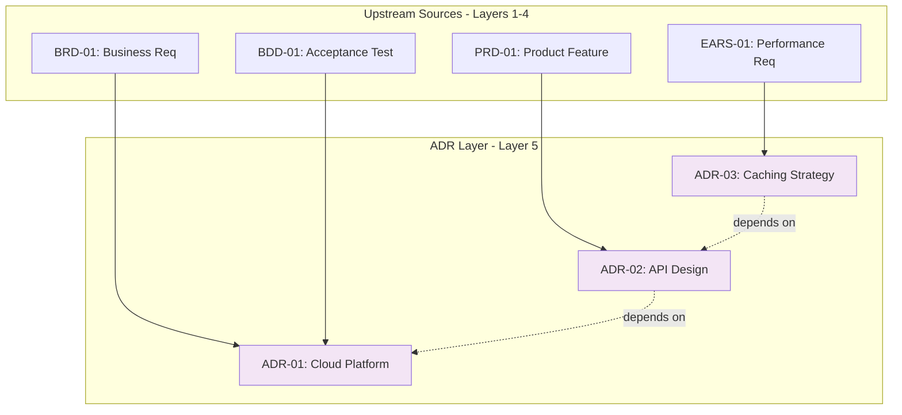

# Traceability Matrix: ADR-01 through ADR-NN

## Document Control

| Item | Details |
|------|---------|
| Document ID | TRACEABILITY_MATRIX_ADR |
| Title | Comprehensive Architecture Decision Records Traceability Matrix |
| Status | [Active/Draft] |
| Version | 1.0.0 |
| Date Created | YYYY-MM-DD |
| Author | [Team Name] |
| Purpose | Track upstream traceability for all Architecture Decision Records |


---

**⚠️ TAG-BASED AUTO-GENERATION AVAILABLE**

This traceability matrix can be automatically generated by scanning code files for @adr:, @spec:, @test: tags.

**Recommended Approach:** Use tag-based auto-discovery instead of manual maintenance.

**Generate automatically using:**
```bash
# Extract tags from all files
python scripts/extract_tags.py --source src/ docs/ tests/ --output docs/generated/tags.json

# Validate tags against documents
python scripts/validate_tags_against_docs.py --tags docs/generated/tags.json --strict

# Generate ADR traceability matrix
python scripts/generate_traceability_matrix.py --type ADR --output docs/05_ADR/ADR-00_TRACEABILITY_MATRIX.md
```

**Benefits:**
- ✅ Single source of truth: Tags embedded in code
- ✅ Always up-to-date: Generated from current codebase
- ✅ No manual sync: Automated validation prevents drift
- ✅ Coverage metrics: Automatically calculated

**Tag Format:** `@adr: ADR-NN` (document-level format, e.g., `ADR-033`)

See: [TRACEABILITY.md](../TRACEABILITY.md#tag-based-auto-discovery-alternative) for complete tag-based workflow.

---

## 1. Overview

### 1.1 Document Type Description
Architecture Decision Records (ADRs) document significant architectural decisions, their context, rationale, consequences, and alternatives considered. ADRs provide the "WHY" behind technical choices.

### 1.2 Coverage Scope
This matrix tracks all ADRs and their upstream sources (BRD, PRD, EARS, BDD). Downstream documents (SYS, REQ, CTR, SPEC, TASKS, Code) track their own upstream references to ADRs—this matrix does not maintain downstream links.

### 1.3 Statistics
- **Total ADRs Tracked**: [X] documents
- **Active Decisions**: [Y] ADRs
- **Superseded Decisions**: [Z] ADRs
- **Coverage Period**: [Start Date] to [End Date]
- **Last Updated**: YYYY-MM-DD

---

---

## 2. Required Tags (Cumulative Tagging Hierarchy - Layer 5)

### 2.1 Tag Requirements for ADR Artifacts

**Layer**: 5
**Artifact Type**: ADR (Architecture Decision Records)
**Required Tags**: `@brd`, `@prd`, `@ears`, `@bdd`
**Tag Count**: 4

### 2.2 Tag Format

```markdown
@brd: BRD.09.01.15, BRD.09.01.06
@prd: PRD.16.01.03
@ears: EARS.12.24.02, EARS.12.24.01
@bdd: BDD.15.13.01, BDD.15.13.02
```

**Format Rules**:
- Prefix: `@` symbol
- Artifact Type: lowercase (`brd`, `prd`, `ears`, `bdd`)
- Separator: colon `:` after artifact type, `:` between document ID and requirement ID
- Document ID: Standard format (e.g., `ADR-NN`)
- Requirement ID: Specific requirement/section identifier
- Multiple Values: comma-separated for same artifact type

### 2.3 Example: ADR with Required Tags

```markdown
# ADR-NN: Service Architecture

## 7. Traceability

### 7.1 Upstream Sources

**Required Tags** (Cumulative Tagging Hierarchy - Layer 5):
```markdown
@brd: BRD-NN
@prd: PRD-NN
@ears: EARS-NN, EARS-NN
@bdd: BDD-NN, BDD-NN
```

### 7.2 Downstream Artifacts
[Links to CTR, SPEC, TASKS, Code that reference this ADR]
```

### 2.4 Validation Rules

1. **Required**: Each ADR artifact MUST include at least one tag for each required layer
2. **Format Compliance**: All tags must follow `@artifact-type: DOC-ID:NN` format
3. **Valid References**: All referenced documents and requirements must exist
4. **No Gaps**: Cannot skip any required upstream layer in the chain
5. **Tag Count**: Must have exactly 4 tags for Layer 5

### 2.5 Tag Discovery

ADR tags can be discovered automatically:
```bash
# Find all ADRs and their upstream tags
python scripts/extract_tags.py --type ADR --show-all-upstream

# Validate ADR-NN has required tags
python scripts/validate_tags_against_docs.py \
  --artifact ADR-NN \
  --expected-layers brd,prd,ears,bdd \
  --strict

# Generate ADR traceability report
python scripts/generate_traceability_matrix.py \
  --type ADR \
  --show-coverage
```

### 2.6 ADR Traceability Pattern

**Key Role**: ADR documents architectural choices that implement BDD acceptance criteria, bridging validated requirements and system design.

---

## 4. Complete ADR Inventory

| ADR ID | Title | Decision Category | Status | Date | Upstream Sources |
|--------|-------|-------------------|--------|------|------------------|
| ADR-NN | [Architecture decision title] | [Category] | Accepted | YYYY-MM-DD | BRD-NN, PRD-NN, EARS-NN, BDD-NN |
| ADR-NN | [Architecture decision title] | [Category] | Accepted | YYYY-MM-DD | BRD-NN, PRD-NN, EARS-NN, BDD-NN |
| ADR-NN | ... | ... | ... | ... | ... |

**Status Legend**:
- **Proposed**: Under review
- **Accepted**: Approved and active
- **Superseded**: Replaced by newer ADR
- **Deprecated**: No longer applicable
- **Rejected**: Not approved

---

## 5. Upstream Traceability (REQUIRED)

> **Traceability Rule**: Upstream traceability is REQUIRED for ADR documents. All ADRs MUST reference existing BRD, PRD, EARS, and BDD documents.

### 4.1 BRD → ADR Traceability

| BRD ID | BRD Title | ADR IDs | ADR Titles | Relationship |
|--------|-----------|---------|------------|--------------|
| BRD-NN | [Business requirement] | ADR-NN | [Architecture decisions] | Business constraints drive technical decisions |
| BRD-NN | ... | ... | ... | ... |

### 4.2 PRD → ADR Traceability

| PRD ID | PRD Title | ADR IDs | ADR Titles | Relationship |
|--------|-----------|---------|------------|--------------|
| PRD-NN | [Product feature] | ADR-NN | [Architecture decisions] | Product requirements necessitate architectural choices |
| PRD-NN | ... | ... | ... | ... |

### 4.3 EARS → ADR Traceability

| EARS ID | EARS Title | ADR IDs | ADR Titles | Relationship |
|---------|------------|---------|------------|--------------|
| EARS-NN | [Formal requirement] | ADR-NN | [Architecture decision] | Performance requirements drive architectural patterns |
| EARS-NN | ... | ... | ... | ... |

### 4.4 BDD → ADR Traceability

| BDD ID | BDD Title | ADR IDs | ADR Titles | Relationship |
|--------|-----------|---------|------------|--------------|
| BDD-NN | [Test scenarios] | ADR-NN | [Architecture decision] | Testing requirements influence architectural approach |
| BDD-NN | ... | ... | ... | ... |

### 4.5 Upstream Source Summary

| Source Category | Total Sources | ADRs Derived | Coverage % |
|-----------------|---------------|--------------|------------|
| BRD | [X] | [Y] ADRs | XX% |
| PRD | [X] | [Y] ADRs | XX% |
| EARS | [X] | [Y] ADRs | XX% |
| BDD | [X] | [Y] ADRs | XX% |
| Technical Analysis | [X] | [Y] ADRs | XX% |

---

## 6. Downstream Reference Guidance

> **Upstream-Only Traceability Rule**: This matrix does NOT track downstream documents. Each downstream artifact (SYS, REQ, CTR, SPEC, TASKS, Code) tracks its own upstream references to ADRs. This eliminates post-creation maintenance and ensures traceability accuracy.

### 6.1 How Downstream Documents Reference ADRs

| Downstream Type | Required Tag Format | Example |
|-----------------|---------------------|---------|
| SYS | `@adr: ADR-NNN` | `@adr: ADR-NN` |
| REQ | `@adr: ADR-NNN` | `@adr: ADR-NN` |
| CTR | `@adr: ADR-NNN` | `@adr: ADR-NN` |
| SPEC | `@adr: ADR-NNN` | `@adr: ADR-NN` |
| TASKS | `@adr: ADR-NNN` | `@adr: ADR-NN` |
| Code | `@adr: ADR-NNN` | `@adr: ADR-NN` |

### 6.2 Finding Downstream References

To discover which downstream documents reference a specific ADR, use reverse traceability:

```bash
# Find all SYS documents referencing ADR-NN
grep -r "@adr: ADR-NN" ../06_SYS/

# Find all REQ documents referencing any ADR
grep -r "@adr:" ../07_REQ/

# Generate reverse traceability report
python scripts/generate_reverse_traceability.py \
  --upstream ADR-NN \
  --downstream SYS,REQ,CTR,SPEC,TASKS,Code
```

### 6.3 Downstream Document Responsibilities

| Downstream Type | Layer | Required Upstream Tags | ADR Relationship |
|-----------------|-------|------------------------|------------------|
| SYS | 6 | `@brd`, `@prd`, `@ears`, `@bdd`, `@adr` | System requirements derived from architecture |
| REQ | 7 | `@brd`, `@prd`, `@ears`, `@bdd`, `@adr`, `@sys` | Atomic requirements implement architecture |
| CTR | 8 | `@brd`, `@prd`, `@ears`, `@bdd`, `@adr`, `@sys`, `@req` | Interface contracts implement architecture |
| SPEC | 9 | All upstream layers | Specifications detail architecture implementation |
| TASKS | 10 | `@brd` through `@spec` | Implementation tasks derived from specs |
| Code | 11 | `@brd` through `@tasks` | Source code implementing requirements |

---

## 7. Architecture Decision Categories

### 6.1 ADRs by Decision Category

| Decision Category | ADR IDs | Total | Description |
|-------------------|---------|-------|-------------|
| [Infrastructure] | ADR-01, ADR-02, ADR-03 | 3 | Cloud platform, deployment, hosting |
| [Data Architecture] | ADR-004, ADR-005 | 2 | Database, storage, data flow |
| [security] | ADR-006, ADR-007 | 2 | Authentication, encryption, access control |
| [Integration] | ADR-008, ADR-009 | 2 | API design, messaging, protocols |
| [Performance] | ADR-010 | 1 | Caching, scalability, optimization |

### 6.2 Technology Stack Summary

| Technology Area | Technologies Selected | ADR IDs | Status |
|-----------------|----------------------|---------|--------|
| [Cloud Platform] | [Azure/AWS/GCP] | ADR-01 | Implemented |
| [Database] | [PostgreSQL] | ADR-004 | Implemented |
| [API Framework] | [FastAPI] | ADR-008 | Implemented |
| [Authentication] | [OAuth 2.0] | ADR-006 | In Progress |

---

## 8. Cross-ADR Dependencies

### 7.1 ADR Relationship Map



> **Note on Diagram Labels**: The above flowchart shows the sequential workflow. For formal layer numbers used in cumulative tagging, always reference the 14-layer architecture (Layers 0-13) defined in README.md. Diagram groupings are for visual clarity only.

### 7.2 Inter-ADR Dependencies

| Source ADR | Target ADR | Dependency Type | Description |
|------------|------------|-----------------|-------------|
| ADR-01 | ADR-004 | Prerequisite | Cloud platform must be selected before database choice |
| ADR-02 | ADR-01 | Related | API design depends on cloud platform capabilities |
| ADR-03 | ADR-02 | Enhancement | Caching strategy enhances API performance |
| ADR-NN | ... | ... | ... |

---

## 9. Decision Impact Analysis

### 8.1 Cost Impact

| ADR ID | Technology/Service | Est. Monthly Cost | Annual Cost | Impact Level |
|--------|-------------------|-------------------|-------------|--------------|
| ADR-01 | Azure Cloud Services | $X,XXX | $XX,XXX | High |
| ADR-004 | PostgreSQL Database | $XXX | $X,XXX | Medium |
| ADR-006 | Auth0 Service | $XXX | $X,XXX | Medium |
| ADR-NN | ... | ... | ... | ... |
| **Total** | | **$X,XXX** | **$XX,XXX** | |

### 8.2 Implementation Complexity

| ADR ID | ADR Title | Complexity (1-5) | Effort (days) | Team Size | Status |
|--------|-----------|------------------|---------------|-----------|--------|
| ADR-01 | [Architecture decision] | 4 | 20 | 3 | Complete |
| ADR-02 | [Architecture decision] | 3 | 10 | 2 | In Progress |
| ADR-03 | [Architecture decision] | 2 | 5 | 1 | Not Started |
| ADR-NN | ... | ... | ... | ... | ... |

### 8.3 Risk Assessment

| ADR ID | Identified Risks | Mitigation Strategies | Risk Level |
|--------|------------------|----------------------|------------|
| ADR-01 | Vendor lock-in | Use abstraction layer, containerization | Medium |
| ADR-004 | Data migration complexity | Incremental migration, rollback plan | High |
| ADR-006 | Third-party service dependency | Implement failover, local caching | Low |
| ADR-NN | ... | ... | ... |

---

## 10. Implementation Status

### 9.1 Artifact Creation Coverage

| Artifact Type | Required | Created | Pending | Coverage % |
|---------------|----------|---------|---------|------------|
| SYS | [X] | [Y] | [Z] | XX% |
| REQ | [X] | [Y] | [Z] | XX% |
| CTR | [X] | [Y] | [Z] | XX% |
| SPEC | [X] | [Y] | [Z] | XX% |
| TASKS | [X] | [Y] | [Z] | XX% |
| Code | [X] | [Y] | [Z] | XX% |
| **Total** | **[X]** | **[Y]** | **[Z]** | **XX%** |

### 9.2 ADR Implementation Status

| ADR ID | SYS Status | REQ Status | CTR Status | SPEC Status | TASKS Status | Code Status | Overall Status | Completion % |
|--------|------------|------------|-----------|-------------|-------------|-------------|----------------|--------------|
| ADR-01 | ✅ Complete | ✅ Complete | ✅ Complete | ✅ Complete | ✅ Complete | ✅ Complete | Complete | 100% |
| ADR-02 | ✅ Complete | 🟡 In Progress | ⏳ Pending | 🟡 In Progress | ⏳ Pending | ⏳ Pending | In Progress | 60% |
| ADR-03 | 🟡 In Progress | ⏳ Pending | ⏳ Pending | ⏳ Pending | ⏳ Pending | ⏳ Pending | Started | 25% |
| ADR-NN | ... | ... | ... | ... | ... | ... |

### 9.3 Gap Analysis

**Missing Upstream References**:
- ADR-XXX: Missing BRD reference (no business justification documented)
- ADR-YYY: Missing EARS reference (no formal requirements linked)
- ADR-ZZZ: Missing BDD reference (no acceptance criteria linked)

**Incomplete Upstream Chains**:
- ADR-XXX: References PRD but missing BRD link (broken chain)
- ADR-YYY: References BDD but missing EARS link (incomplete hierarchy)

**To find downstream coverage** (reverse traceability):
```bash
# Run reverse traceability to find downstream references
python scripts/generate_reverse_traceability.py --upstream ADR --downstream SYS,REQ,CTR,SPEC,TASKS,Code
```

---

## 11. Immediate Next Steps

### 10.1 Priority Actions

1. **Complete Missing SYS Requirements**: [X] ADRs need system requirements
2. **Decompose into REQ**: [Y] ADRs need atomic requirements
3. **Create SPEC Documents**: [Z] ADRs need implementation specifications
4. **Review Superseded ADRs**: [N] ADRs need status update

### 10.2 Architecture Review Schedule

| Review Type | Target Date | ADRs Scope | Status |
|-------------|-------------|------------|--------|
| [Quarterly Architecture Review] | YYYY-MM-DD | All active ADRs | Scheduled |
| [Technology Stack Review] | YYYY-MM-DD | Infrastructure ADRs | Planning |
| [security Architecture Review] | YYYY-MM-DD | security ADRs | Scheduled |

### 10.3 Quality Improvement Recommendations

- **Decision Rationale**: Ensure all ADRs document alternatives considered
- **Consequence Analysis**: Document both benefits and drawbacks
- **Implementation Tracking**: Link all ADRs to implementation artifacts
- **Review Cadence**: Schedule quarterly ADR reviews for relevance

---

## 12. Revision History

| Version | Date | Changes | Author |
|---------|------|---------|--------|
| 1.0.0 | YYYY-MM-DD | Initial traceability matrix creation | [Author Name] |

---

## 13. References

### 13.1 Internal Documentation
- **ADR Index**: [ADR-00_index.md](ADR-00_index.md)
- **ADR Template**: [ADR-MVP-TEMPLATE.md](ADR-MVP-TEMPLATE.md) (default; full template archived)
- **Complete Traceability Matrix**: [../TRACEABILITY_MATRIX_COMPLETE-TEMPLATE.md](../TRACEABILITY_MATRIX_COMPLETE-TEMPLATE.md)
- **Traceability Standards**: [../TRACEABILITY.md](../TRACEABILITY.md)

### 13.2 ADR Standards
- Michael Nygard's ADR Template
- ThoughtWorks Technology Radar
- Architecture Decision Records GitHub Organization

### 13.3 Related Matrices
- [SYS Traceability Matrix](../06_SYS/SYS-00_TRACEABILITY_MATRIX-TEMPLATE.md)
- [REQ Traceability Matrix](../07_REQ/REQ-00_TRACEABILITY_MATRIX-TEMPLATE.md)
- [SPEC Traceability Matrix](../09_SPEC/SPEC-00_TRACEABILITY_MATRIX-TEMPLATE.md)

---

## 14. Appendix A: Matrix Maintenance Guidelines

### 14.1 Automated Generation
```bash
# Generate matrix from ADR directory
python ../scripts/generate_traceability_matrix.py \
  --type ADR \
  --input ../05_ADR/ \
  --template ADR-00_TRACEABILITY_MATRIX-TEMPLATE.md \
  --output TRACEABILITY_MATRIX_ADR.md

# Validate matrix
python ../scripts/validate_traceability_matrix.py \
  --matrix TRACEABILITY_MATRIX_ADR.md \
  --strict

# Update incrementally
python ../scripts/update_traceability_matrix.py \
  --matrix TRACEABILITY_MATRIX_ADR.md \
  --preserve-annotations
```

### 14.2 Quality Checklist
- [ ] All ADR documents included in inventory
- [ ] All ADRs have complete upstream tags (`@brd`, `@prd`, `@ears`, `@bdd`)
- [ ] No broken upstream reference chains
- [ ] Decision categories classified
- [ ] Technology stack documented
- [ ] Cost impact analysis complete
- [ ] Implementation complexity assessed
- [ ] Risk assessment included
- [ ] Inter-ADR dependencies mapped
- [ ] Gap analysis identifies missing upstream references
- [ ] All hyperlinks resolve correctly
- [ ] Mermaid diagrams render without errors
- [ ] Reverse traceability scripts documented for downstream discovery
