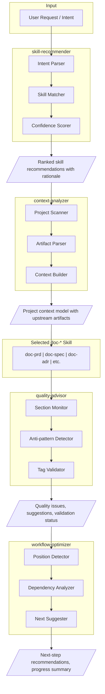
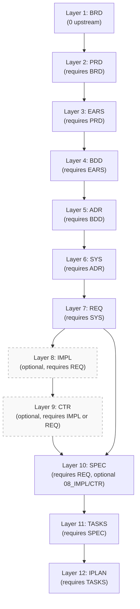

# ADR-000: AI-Powered Documentation Assistant Architecture

<a id="ADR-000"></a>

## Document Control

| Item | Details |
|------|---------|
| **Project Name** | AI Dev Flow Framework Enhancement |
| **Document Version** | 1.0.0 |
| **Date Created** | 2025-11-29 |
| **Last Updated** | 2025-11-29 |
| **Status** | Proposed |
| **Decision Maker** | Framework Team |

### Document Revision History

| Version | Date | Author | Changes |
|---------|------|--------|---------|
| 1.0.0 | 2025-11-29 | AI Assistant | Initial draft - AI-powered documentation assistant architecture |

---

## 1. Context

### Background

The AI Dev Flow framework provides 25+ documentation skills for creating SDD artifacts. Users must manually select appropriate skills, understand project context, and navigate the 16-layer workflow. This creates friction and inconsistency in documentation quality.

### Problem Statement

Current skill-based workflow requires users to:
1. Know which skill to invoke for their documentation task
2. Manually gather project context and existing artifact references
3. Validate artifacts after creation rather than during
4. Determine next steps without workflow guidance

### Driving Requirements

| Requirement | Source | Description |
|-------------|--------|-------------|
| Automated skill selection | PRD.00.07.01 | System recommends skills based on user intent |
| Context awareness | PRD.00.07.02 | System analyzes project structure before doc creation |
| Quality guidance | PRD.00.07.03 | Proactive quality checks during artifact creation |
| Workflow navigation | PRD.00.07.04 | Next-step recommendations after artifact completion |

---

## 2. Decision

### Chosen Approach: Modular Assistant Skill Architecture

Implement four specialized Claude Code skills that work independently or in combination to provide intelligent documentation assistance:

1. **skill-recommender**: Analyzes user requests and suggests appropriate documentation skills
2. **context-analyzer**: Scans project structure and surfaces relevant context for documentation
3. **quality-advisor**: Provides proactive quality guidance during artifact creation
4. **workflow-optimizer**: Recommends next steps and tracks workflow progress

### Architecture Overview



---

## 3. Rationale

### Option A: Single Monolithic Assistant Skill (Rejected)

**Approach**: One comprehensive skill handling all assistance functions.

**Pros**:
- Single invocation point
- Unified context management
- Simpler user mental model

**Cons**:
- Large, complex skill difficult to maintain
- Cannot use individual functions independently
- Higher latency for simple operations
- Testing complexity increases exponentially

**Decision**: Rejected due to maintainability and flexibility concerns.

### Option B: Modular Assistant Skills (Chosen)

**Approach**: Four specialized skills that can work independently or together.

**Pros**:
- Each skill focused and maintainable
- Users can invoke specific functions as needed
- Parallel development possible
- Individual testing and validation
- Incremental enhancement capability

**Cons**:
- Multiple invocation points
- Potential coordination complexity
- Users must learn multiple skills

**Decision**: Chosen for flexibility, maintainability, and focused functionality.

### Option C: Hook-Based Integration (Considered for Future)

**Approach**: Use Claude Code hooks to automatically invoke assistant functions.

**Pros**:
- Seamless integration without explicit invocation
- Automatic context and quality assistance
- Reduced user cognitive load

**Cons**:
- Requires Claude Code hook support
- May introduce latency on every operation
- Less user control

**Decision**: Deferred for future enhancement once modular skills proven.

---

## 4. Technical Details

### 4.1 Skill Recommender Architecture

**Purpose**: Analyze user intent and recommend appropriate documentation skills.

**Components**:

| Component | Responsibility | Implementation |
|-----------|----------------|----------------|
| Intent Parser | Extract action verbs and targets from user request | Keyword matching with intent categories |
| Skill Matcher | Map parsed intent to skill catalog | Rule-based matching with skill metadata |
| Confidence Scorer | Rank matches by relevance | Weighted scoring based on intent signals |

**Intent Categories**:
- `create`: New artifact creation (doc-brd, doc-prd, doc-spec, etc.)
- `update`: Modify existing artifacts
- `validate`: Check artifact quality (trace-check, doc-validator)
- `analyze`: Review project state (context-analyzer, analytics-flow)
- `plan`: Workflow planning (project-mngt, adr-roadmap)

**Skill Catalog Structure**:
```yaml
skills:
  - name: doc-prd
    category: core-workflow
    layer: 2
    intent_signals: [create, product, requirements, features, prd]
    description: Create Product Requirements Documents
  - name: trace-check
    category: quality-assurance
    intent_signals: [validate, traceability, links, check]
    description: Validate bidirectional traceability
```

### 4.2 Context Analyzer Architecture

**Purpose**: Scan project structure and build context model for documentation.

**Components**:

| Component | Responsibility | Implementation |
|-----------|----------------|----------------|
| Project Scanner | Enumerate artifacts by type and location | Directory traversal with pattern matching |
| Artifact Parser | Extract metadata and traceability from docs | Markdown/YAML parsing with section extraction |
| Context Builder | Construct context model for session use | In-memory model with artifact relationships |

**Context Model Structure**:
```yaml
context:
  project_root: /path/to/project
  artifact_inventory:
    BRD: [BRD-01, BRD-02]
    PRD: [PRD-01]
    SPEC: []
  workflow_position:
    current_layer: 2
    completed_layers: [1]
    next_layers: [3, 4, 5]
  upstream_candidates:
    - id: BRD-01
      title: Platform Foundation
      relevance: high
  key_terms: [trading, risk, position]
```

### 4.3 Quality Advisor Architecture

**Purpose**: Provide proactive quality guidance during artifact creation.

**Components**:

| Component | Responsibility | Implementation |
|-----------|----------------|----------------|
| Section Monitor | Track section completion against template | Template comparison with completion scoring |
| Anti-pattern Detector | Identify common documentation mistakes | Rule-based pattern matching |
| Tag Validator | Verify cumulative tagging compliance | Tag extraction with layer validation |

**Anti-patterns Detected**:
- Missing Document Control section
- Empty or placeholder traceability references
- Vague acceptance criteria without measurable outcomes
- Missing cumulative tags for artifact layer
- Naming convention violations

**Quality Feedback Format**:
```yaml
quality_report:
  status: warning
  completeness: 75%
  issues:
    - severity: error
      section: Traceability
      message: Missing @brd tag (required for Layer 2 artifact)
      suggestion: Add upstream BRD reference to Section 7
    - severity: warning
      section: KPIs
      message: KPI lacks measurable target
      suggestion: Add quantitative metric (e.g., "≥85% accuracy")
```

### 4.4 Workflow Optimizer Architecture

**Purpose**: Guide users through SDD workflow with next-step recommendations.

**Components**:

| Component | Responsibility | Implementation |
|-----------|----------------|----------------|
| Position Detector | Determine current position in workflow | Artifact analysis with layer mapping |
| Dependency Analyzer | Identify required downstream artifacts | Workflow graph traversal |
| Next Suggester | Recommend next actions with rationale | Priority-weighted suggestions |

**Workflow Graph**:



**Recommendation Format**:

```yaml
workflow_recommendations:
  current_position:
    completed_artifact: PRD-000
    layer: 2
  next_steps:
    - priority: P0
      action: Create EARS document
      skill: doc-ears
      rationale: Required downstream from PRD
    - priority: P1
      action: Create BDD scenarios
      skill: doc-bdd
      rationale: Can start in parallel with EARS
  progress:
    completed_layers: 2
    total_layers: 12
    completion_percentage: 17%
```

---

## 5. Consequences

### Positive Consequences

| Consequence | Impact |
|-------------|--------|
| Reduced skill selection time | Users get recommendations instead of searching catalog |
| Improved context awareness | New artifacts have accurate upstream references |
| Proactive quality assurance | Issues caught during creation, not after |
| Clear workflow guidance | Users always know next steps |
| Maintainable architecture | Each skill focused and independently testable |

### Negative Consequences

| Consequence | Mitigation |
|-------------|------------|
| Multiple skills to learn | Provide unified entry point or workflow mode |
| Potential recommendation errors | Include confidence scores and override capability |
| Added framework complexity | Comprehensive documentation and examples |
| Performance overhead | Optimize parsing and caching where possible |

### Technical Debt Considerations

| Item | Priority | Plan |
|------|----------|------|
| Skill catalog maintenance | Medium | Automate catalog generation from SKILL.md files |
| Context caching | Low | Implement project-level context cache |
| Hook integration | Low | Evaluate Claude Code hook support for auto-invocation |

---

## 6. Implementation Notes

### Skill Development Order

1. **Phase 1**: skill-recommender (core capability, enables discovery)
2. **Phase 2**: context-analyzer (foundation for context-aware docs)
3. **Phase 3**: quality-advisor (enhances existing doc-* skills)
4. **Phase 4**: workflow-optimizer (guides full workflow)

### Integration Points

| Integration | Description |
|-------------|-------------|
| doc-flow skill | Reference skill-recommender for skill discovery |
| doc-* skills | Quality advisor invoked during artifact creation |
| trace-check | Shares validation logic with quality advisor |
| project-init | Context analyzer used during initialization |

### Testing Strategy

| Test Type | Scope |
|-----------|-------|
| Unit tests | Individual component logic (parsers, matchers) |
| Integration tests | Skill invocation and output validation |
| Scenario tests | End-to-end workflows with sample projects |
| Performance tests | Latency benchmarks for each skill |

---

## 7. Traceability

**Required Tags** (Cumulative Tagging Hierarchy - Layer 5):

```text
@brd: null (framework-level ADR)
@prd: PRD.00.07.01, PRD.00.07.02, PRD.00.07.03, PRD.00.07.04
@ears: null (to be created)
@bdd: null (to be created)
```

### Upstream Sources

| Source | Type | Reference |
|--------|------|-----------|
| PRD-000 | Product Requirements | [PRD-000](../02_PRD/PRD-00_ai_assisted_documentation_features.md#PRD-000) |
| SPEC_DRIVEN_DEVELOPMENT_GUIDE | Methodology Guide | [SPEC_DRIVEN_DEVELOPMENT_GUIDE.md](../SPEC_DRIVEN_DEVELOPMENT_GUIDE.md) |

### Downstream Artifacts

| Artifact | Type | Reference |
|----------|------|-----------|
| skill-recommender | Skill Implementation | To be created - `.claude/skills/skill-recommender/` |
| context-analyzer | Skill Implementation | To be created - `.claude/skills/context-analyzer/` |
| quality-advisor | Skill Implementation | To be created - `.claude/skills/quality-advisor/` |
| workflow-optimizer | Skill Implementation | To be created - `.claude/skills/workflow-optimizer/` |

### Primary Anchor/ID

- **ADR-000**: AI-Powered Documentation Assistant Architecture

---

## 8. References

### Internal References

| Document | Purpose |
|----------|---------|
| [PRD-000](../02_PRD/PRD-00_ai_assisted_documentation_features.md) | Product requirements driving this decision |
| [SKILL README](../../.claude/skills/README.md) | Existing skill catalog and structure |
| [doc-flow SKILL](../../.claude/skills/doc-flow/SKILL.md) | Reference skill architecture |
| [trace-check SKILL](../../.claude/skills/trace-check/SKILL.md) | Quality validation patterns |

### External References

| Reference | Purpose |
|-----------|---------|
| Claude Code documentation | Skill development guidelines |

---

## Decision Record

| Item | Value |
|------|-------|
| **Decision** | Implement modular assistant skill architecture |
| **Date** | 2025-11-29 |
| **Status** | Proposed |
| **Supersedes** | None |
| **Superseded By** | None |

---

## Change Log

| Date | Version | Changes | Author |
|------|---------|---------|--------|
| 2025-11-29 | 1.0.0 | Initial draft | AI Assistant |
