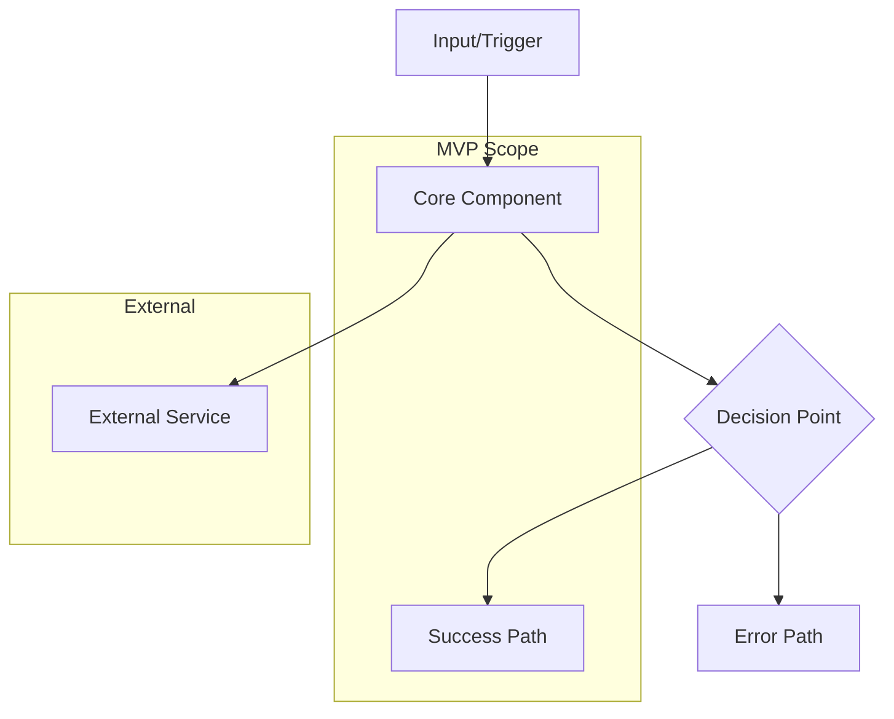

<!--
AI_CONTEXT_START
Role: AI Software Architect
Objective: Create a streamlined MVP Architecture Decision Record.
Constraints:
- Focus on the single decision at hand.
- Analyze 2-3 viable alternatives maximum.
- Be decisive; clear recommendation required.
- Keep implementation notes focused on immediate MVP needs.
- Maintain single-file structure (no document splitting in MVP).
AI_CONTEXT_END
-->
---
title: "ADR-MVP-TEMPLATE: Architecture Decision Record (MVP Version)"
tags:
  - adr-template
  - mvp-template
  - layer-5-artifact
custom_fields:
  document_type: template
  artifact_type: ADR
  layer: 5
  architecture_approaches: [ai-agent-based]
  priority: shared
  development_status: draft
  template_variant: mvp
  template_profile: mvp
  template_source: "ADR-MVP-TEMPLATE.md"
  schema_reference: "ADR_SCHEMA.yaml"
  schema_version: "1.0"
  schema_status: optional
  creation_rules_reference: "ADR_MVP_CREATION_RULES.md"
  validation_rules_reference: "ADR_MVP_VALIDATION_RULES.md"
  traceability_matrix_template: "ADR-00_TRACEABILITY_MATRIX-TEMPLATE.md"
---

> **MVP Template** — Single-file, streamlined ADR for rapid MVP decisions.
> Use this template for MVP architecture decisions with 2-3 alternatives.

> **Validation Note**: MVP templates are intentionally streamlined and will show validation errors when run against full template validators (e.g., `validate_adr.py`). This is expected behavior. See `scripts/README.md` → "MVP Template Validation" for guidance.

> References: Schema `ADR_SCHEMA.yaml` | Rules `ADR_MVP_CREATION_RULES.md`, `ADR_MVP_VALIDATION_RULES.md` | Matrix `ADR-00_TRACEABILITY_MATRIX-TEMPLATE.md`

# ADR-NN: [Architecture Decision Title]

## 1. Document Control

| Item | Details |
|------|---------|
| **Status** | Proposed / Accepted / Deprecated / Superseded |
| **Date** | YYYY-MM-DD |
| **Decision Makers** | [Names/Roles] |
| **Author** | [Architect/Lead Name] |
| **Version** | 1.0 |
| **SYS-Ready Score** | [Score]/100 (Target: ≥85 for MVP) |

---

## 2. Context

### 2.1 Problem Statement

**Originating Topic**: BRD.NN.32.SS - [Topic Name from BRD Section 7.2]

[1-2 paragraph description of the architectural challenge or decision needed]

**Business Driver**: [Why this decision matters to the business - from BRD §7.2]

**Key Constraints**:
- [Constraint 1 - e.g., budget limit, regulatory requirement]
- [Constraint 2 - e.g., timeline, team expertise]
- [Constraint 3 - e.g., existing infrastructure, integration requirement]

### 2.2 Technical Context

[Brief background on existing system state and technical environment]

**Current State**:
- [What exists today]
- [What's working/not working]

**MVP Requirements**:
- [Core requirement this decision must satisfy]
- [Quality attribute targets - e.g., p95 < 200ms]

---

## 3. Decision

**ID Format**: `ADR.NN.10.SS` (Decision)

### 3.1 Chosen Solution (ADR.NN.10.01)

**We will use**: [Selected option/technology/approach]

**Because**:
1. [Primary reason - aligned with business driver]
2. [Secondary reason - technical fit]
3. [Tertiary reason - cost/time advantage]

### 3.2 Key Components

| Component | Purpose | Technology |
|-----------|---------|------------|
| [Component 1] | [What it does] | [Specific tech] |
| [Component 2] | [What it does] | [Specific tech] |
| [Component 3] | [What it does] | [Specific tech] |

### 3.3 Implementation Approach

[2-3 sentences on how this will be implemented for MVP]

**MVP Scope**: [What's included in MVP implementation]

**Post-MVP Scope**: [What's deferred to later phases]

---

## 4. Alternatives Considered

**ID Format**: `ADR.NN.12.SS` (Alternative)

### 4.1 Option A: [Selected Option Name] ✓ (ADR.NN.12.01)

**Description**: [Brief description of the chosen approach]

**Pros**:
- [Advantage 1]
- [Advantage 2]

**Cons**:
- [Trade-off 1]
- [Trade-off 2]

**Est. Cost**: $[X]/month | **Fit**: Best

---

### 4.2 Option B: [Alternative Option Name] (ADR.NN.12.02)

**Description**: [Brief description]

**Pros**:
- [Advantage 1]
- [Advantage 2]

**Cons**:
- [Disadvantage 1 - why rejected]
- [Disadvantage 2]

**Rejection Reason**: [Specific reason why not selected]

**Est. Cost**: $[X]/month | **Fit**: Good/Poor

---

### 4.3 Option C: [Alternative Option Name] (Optional) (ADR.NN.12.03)

**Description**: [Brief description]

**Pros**:
- [Advantage 1]

**Cons**:
- [Disadvantage 1]

**Rejection Reason**: [Specific reason]

**Est. Cost**: $[X]/month | **Fit**: Poor

---

## 5. Consequences

**ID Format**: `ADR.NN.13.SS` (Consequence)

### 5.1 Positive Outcomes (ADR.NN.13.01)

- [Benefit 1]: [Quantifiable impact]
- [Benefit 2]: [Quantifiable impact]
- [Benefit 3]: [Qualitative benefit]

### 5.2 Trade-offs & Risks (ADR.NN.13.02)

| Risk/Trade-off | Impact | Mitigation |
|----------------|--------|------------|
| [Trade-off 1] | [H/M/L] | [How we'll address it] |
| [Trade-off 2] | [H/M/L] | [How we'll address it] |
| [Risk 1] | [H/M/L] | [Mitigation strategy] |

### 5.3 Cost Estimate

| Category | MVP Phase | Monthly Ongoing |
|----------|-----------|-----------------|
| Development | [X] person-weeks | - |
| Infrastructure | $[X] one-time | $[X]/month |
| Third-party services | $[X] setup | $[X]/month |
| **Total** | **$[X]** | **$[X]/month** |

---

## 6. Architecture Flow

### 6.1 High-Level Flow



### 6.2 Key Integration Points

| System | Integration Type | Purpose |
|--------|-----------------|---------|
| [System 1] | [REST/gRPC/Async] | [What data flows] |
| [System 2] | [REST/gRPC/Async] | [What data flows] |

---

## 7. Implementation Assessment

### 7.1 MVP Development Phases

| Phase | Duration | Deliverables |
|-------|----------|--------------|
| Phase 1 | [X] weeks | [Core implementation] |
| Phase 2 | [X] weeks | [Integration & testing] |

### 7.2 Rollback Plan

**Rollback Trigger**: [Conditions requiring reversion]

**Rollback Steps**:
1. [Step 1]
2. [Step 2]
3. [Step 3]

**Estimated Rollback Time**: [X] minutes/hours

### 7.3 Monitoring (MVP Baseline)

| Metric | Alert Threshold | Action |
|--------|-----------------|--------|
| Error rate | > [X]% | [Response] |
| Latency (p95) | > [X]ms | [Response] |
| Availability | < [X]% | [Response] |

---

## 8. Verification

### 8.1 Success Criteria

- [ ] [Measurable technical outcome 1]
- [ ] [Measurable technical outcome 2]
- [ ] [Performance target met]
- [ ] [Integration working]

### 8.2 BDD Scenarios

[Reference to BDD scenarios that validate this decision]

- Feature: [Feature name] - `04_BDD/BDD-NN_{suite}/BDD-NN.SS_{slug}.feature`

---

## 9. Traceability

### 9.1 Upstream References

| Source | Document | Relevant Section |
|--------|----------|------------------|
| BRD | BRD.NN | §7.2 - Architecture Decision Requirements |
| PRD | PRD.NN | §18 - Architecture Decision Topics |
| EARS | EARS.NN | [Relevant requirements] |

### 9.2 Downstream Artifacts

| Artifact | Status | Relationship |
|----------|--------|--------------|
| SYS-NN | TBD | System requirements derived from this ADR |
| REQ-NN | TBD | Atomic requirements |
| SPEC-NN | TBD | Technical specifications |

### 9.3 Traceability Tags

```markdown
@brd: BRD.NN.32.SS
@prd: PRD.NN.EE.SS
@ears: EARS.NN.24.SS
```

---

## 10. Related Decisions

| Relationship | ADR | Description |
|--------------|-----|-------------|
| Depends On | ADR-NN | [What this decision depends on] |
| Related | ADR-NN | [Related parallel decision] |
| Supersedes | ADR-NN | [Previous decision replaced] |

---

## 11. Migration to Full ADR Template

### 11.1 When to Migrate

- [ ] Decision requires 4+ alternatives analysis
- [ ] Complex trade-off evaluation needed
- [ ] Regulatory/compliance documentation required
- [ ] Decision impacts multiple systems/teams
- [ ] Detailed implementation assessment required

### 11.2 Migration Steps

2. **Transfer core content**: Map MVP sections to full template
3. **Add detailed analysis**: Expand alternatives, add scoring matrices
4. **Add missing sections**: 
   - Detailed context and background
   - Complete stakeholder impact
   - Full implementation assessment
   - Status change history
5. **Update traceability**: Link to SYS, REQ documents with cumulative tags
6. **Archive MVP version**: Move to archive with "superseded" note
7. **Run validation**: Execute `python3 scripts/validate_adr.py` on new document

### 11.3 Section Mapping (MVP → Full)

| MVP Section | Full Template Section |
|-------------|-----------------------|
| 1. Document Control | 1. Document Control |
| 2. Context | 4. Context (expand subsections) |
| 3. Decision | 5. Decision (expand with full analysis) |
| 4. Alternatives | 6. Alternatives Considered (expand) |
| 5. Consequences | 7. Consequences (expand) |
| 6. Architecture Overview | 8. Architecture Flow (expand) |
| 7. Implementation Notes | 9. Implementation Assessment (expand) |
| 8. Validation | 10. Validation & Success Criteria |
| 9. Traceability | 11. Traceability |
| 10. Related Decisions | 12. Related Decisions |

---

**Document Version**: 1.0
**Template Version**: 1.0 (MVP)
**Last Updated**: YYYY-MM-DD

---

> **MVP Template Notes**:
> - This template is ~250 lines (vs 699 lines for full ADR)
> - Single file - no sectioning
> - Focus on decision + rationale + 2-3 alternatives
> - Maintains ai_dev_flow framework compliance
