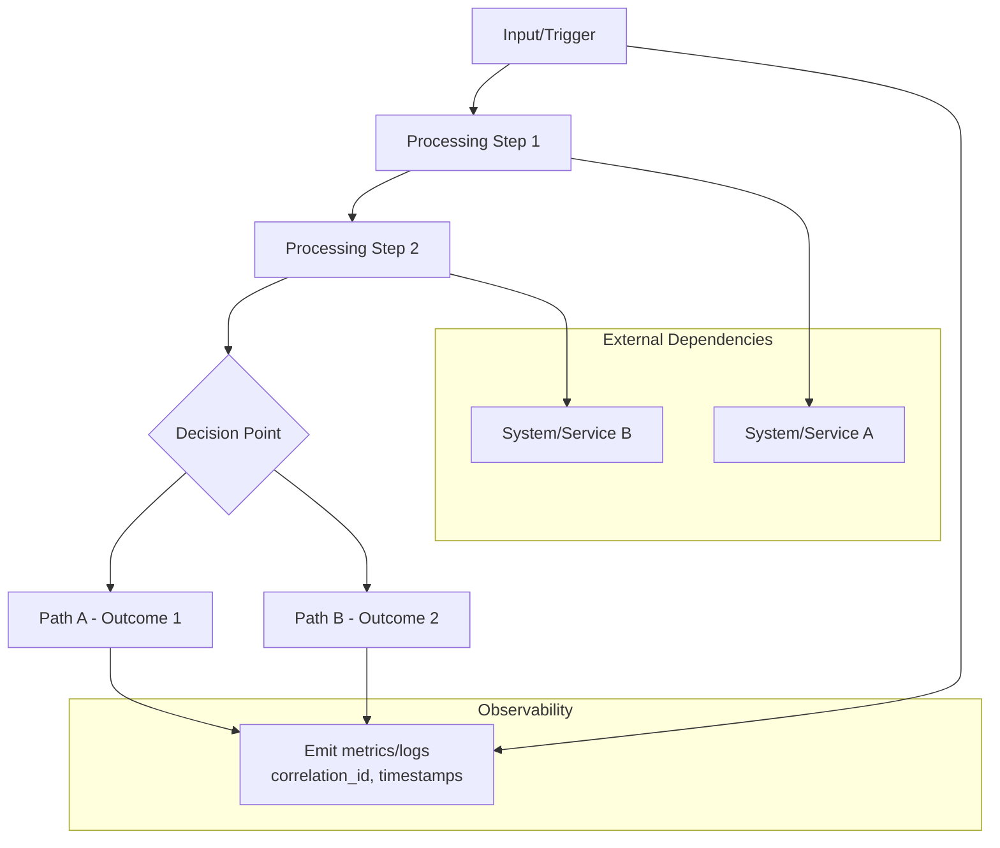

# =============================================================================
# 📋 Document Authority: This is the PRIMARY STANDARD for ADR structure.
# All other documents (Schema, Creation Rules, Validation Rules) DERIVE from this template.
# - In case of conflict, this template is the single source of truth
# - Schema: ADR_SCHEMA.yaml - Machine-readable validation (derivative)
# - Creation Rules: ADR_CREATION_RULES.md - AI guidance for document creation (derivative)
# - Validation Rules: ADR_VALIDATION_RULES.md - AI checklist after document creation (derivative)
#   NOTE: VALIDATION_RULES includes all CREATION_RULES and may be extended for validation
# =============================================================================
---
title: "ADR-TEMPLATE: Architecture Decision Record"
tags:
  - adr-template
  - layer-5-artifact
  - shared-architecture
  - document-template
custom_fields:
  document_type: template
  artifact_type: ADR
  layer: 5
  architecture_approaches: [ai-agent-based, traditional-8layer]
  priority: shared
  development_status: active
  template_for: architecture-decision-record
  descriptive_slug: null  # Folder's descriptive name (e.g., database_selection)
  schema_reference: "ADR_SCHEMA.yaml"
  schema_version: "1.0"
---

> Reference Template — For learning and small docs only. Real ADRs should be split per `../DOCUMENT_SPLITTING_RULES.md` using:
> - `ADR-SECTION-0-TEMPLATE.md` to create `ADR-{NN}.0_index.md`
> - `ADR-SECTION-TEMPLATE.md` to create `ADR-{NN}.{S}_{slug}.md`

> **📋 Document Authority**: This is the **PRIMARY STANDARD** for ADR structure.
> - **Schema**: `ADR_SCHEMA.yaml v1.0` - Validation rules
> - **Creation Rules**: `ADR_CREATION_RULES.md` - Usage guidance
> - **Validation Rules**: `ADR_VALIDATION_RULES.md` - Post-creation checks

> **Note**: Section-based templates are the DEFAULT for 01_BRD/02_PRD/ADR.
> This monolithic template is for small documents only (<25KB).
> Use nested folder structure: `docs/05_ADR/ADR-NN/ADR-NN.S_slug.md`

# ADR-NN: [Architecture Decision Title]

## 1. Document Control

| Item | Details |
|------|---------|
| **Project Name** | [Enter project name] |
| **Document Version** | [e.g., 1.0] |
| **Date** | [Current date] |
| **Document Owner** | [Name and title] |
| **Prepared By** | [Architect/Technical Lead name] |
| **Status** | [Draft / In Review / Approved] |
| **SYS-Ready Score** | ✅ 95% (Target: ≥90%) |

### 1.1 Document Revision History

| Version | Date | Author | Changes Made | Approver |
|---------|------|--------|--------------|----------|
| 1.0 | [Date] | [Name] | Initial draft | |
| | | | | |

---

> **⚠️ UPSTREAM ARTIFACT REQUIREMENT**: Before completing traceability tags:
> 1. **Check existing artifacts**: List what upstream documents actually exist in `docs/`
> 2. **Reference only existing documents**: Use actual document IDs, not placeholders
> 3. **Use `null` appropriately**: Only when upstream artifact type genuinely doesn't exist for this feature
> 4. **Do NOT create phantom references**: Never reference documents that don't exist
> 5. **Do NOT create missing upstream artifacts**: If upstream artifacts are missing, skip that functionality. Only create functionality for existing upstream artifacts.


## 2. Position in Document Workflow

**⚠️ CRITICAL**: Always reference [SPEC_DRIVEN_DEVELOPMENT_GUIDE.md](../SPEC_DRIVEN_DEVELOPMENT_GUIDE.md) as the single source of truth for workflow steps, artifact definitions, and quality gates.

ADR is in the **Architecture Layer** within the complete SDD workflow:

**Business Layer** (BRD → PRD → EARS) → **Testing Layer** (BDD) → **Architecture Layer** (ADR → SYS) ← **YOU ARE HERE** → **Requirements Layer** (REQ) → **Project Management Layer** (IMPL) → **Interface Layer** (CTR - optional) → **Technical Specs (SPEC)** → **Code Generation Layer** (TASKS) → **Execution Layer** (Code → Tests) → **Validation Layer** (Validation → Review → Production)

**Complete Workflow:**
```
BRD (Business Requirements)
  ↓
PRD (Product Requirements)
  ↓
EARS (Engineering Requirements — Event-Action-Response-State)
  ↓
BDD (Behavior-Driven Tests)
  ↓
ADR (Architecture Decisions) ← YOU ARE HERE
  ↓
SYS (System Requirements)
  ↓
REQ (Atomic Requirements)
  ↓
IMPL (Implementation Plans - WHO/WHEN)
  ↓
CTR (API Contracts - optional, if interface requirement)
  ↓
SPEC (Technical Specifications - YAML)
  ↓
TASKS (Code Generation Plans)
  ↓
Code (Python/TypeScript Implementation)
  ↓
Tests (Unit, Integration, BDD Execution)
  ↓
Validation (Traceability & Quality Gates)
  ↓
Production-Ready Code
```

# PART 1: Decision Context and Requirements

## 3. Status
**Status**: Proposed
**Date**: YYYY-MM-DD
**Decision Makers**: [Team/Person names]
**ADR Author**: [Name]
**Last Updated**: YYYY-MM-DD

## 4. Context

### 4.1 Problem Statement

**Originating Topic**: {DOC_TYPE}.NN.21.SS - [Topic Name from BRD Section 7.2]

#### Inherited Content

The following fields are copied from upstream documents to maintain traceability:

**Business Driver** (from BRD §7.2):
[Copy the business driver text from BRD Section 7.2 - WHY this decision matters to business]

**Business Constraints** (from BRD §7.2):
- [Constraint 1 from BRD Section 7.2 - e.g., regulatory requirement]
- [Constraint 2 from BRD Section 7.2 - e.g., budget limit]

**Technical Options Evaluated** (from PRD §18):
1. [Option A from PRD Section 18 - brief description]
2. [Option B from PRD Section 18 - brief description]
3. [Option C from PRD Section 18 - brief description]

**Evaluation Criteria** (from PRD §18):
- [Criterion 1]: [Measurable target]
- [Criterion 2]: [Measurable target]

**References**:
- BRD: [BRD-NN] (link TBD) §7.2.X
- PRD: [PRD-NN] (link TBD) §18.X
- EARS: [EARS-NN] (link TBD)
- BDD: [BDD-NN] (link TBD)

### 4.2 Background
[Historical context and existing system state - how did we get here? What current system state drove this need?]

### 4.3 Driving Forces
[What makes this decision unavoidable now? Business pressures, technical limitations, compliance requirements, etc.]

### 4.4 Constraints
- **Technical**: Platform, language, infrastructure, performance limitations
- **Business**: Timeline pressure, budget constraints, resource availability
- **Operational**: Deployment, monitoring, maintenance, scaling requirements
- **Regulatory/Compliance**: Legal, security, or industry standards requirements

### 4.5 Technology Stack Compliance

**Optional**: If your project maintains a technology stack ADR, reference it here.

Before proposing new technologies, verify compliance with project-wide technology stack:

**Core Technologies** (example - customize for your project):
- **Backend**: Python 3.11+, FastAPI
- **Frontend**: React 18, TypeScript
- **Infrastructure**: Cloud provider, IaC tools
- **Data**: Database, message queue
- **Testing**: Test frameworks

**Compliance Check**:
- [ ] Technology aligns with approved stack
- [ ] If proposing new technology: Justification documented below
- [ ] If replacing technology: Migration path and rationale documented

**New Technology Justification** (if applicable):
[If proposing technology not in approved stack, document:
- Why existing stack cannot meet requirements
- Evaluation against alternatives
- Integration impact and migration plan
- Recommendation to update stack if adopted]

### 4.6 Threshold Management

**⚠️ IMPORTANT**: ADR documents have a **dual role** for thresholds:
1. **Reference** platform-wide thresholds from PRD threshold registry
2. **Define** architecture-specific thresholds unique to this decision

**Threshold Naming Convention**: `@threshold: ADR.NN.category.subcategory.key`

**Format Reference**: See `THRESHOLD_NAMING_RULES.md` for complete naming standards.

**Platform Thresholds Referenced** (from PRD Threshold Registry):
```yaml
# Reference thresholds from PRD that constrain this architectural decision
performance:
  - "@threshold: PRD.NN.perf.api.p95_latency"      # Architecture must meet this target
  - "@threshold: PRD.NN.perf.api.p99_latency"      # Architecture must meet this target
sla:
  - "@threshold: PRD.NN.sla.uptime.target"         # Architecture availability requirement
  - "@threshold: PRD.NN.sla.error_rate.target"     # Architecture error budget
resource:
  - "@threshold: PRD.NN.resource.cpu.max"          # Infrastructure constraint
  - "@threshold: PRD.NN.resource.memory.max"       # Infrastructure constraint
```

**Architecture-Specific Thresholds Defined** (unique to this ADR):
```yaml
# Define thresholds specific to this architectural decision
# Format: @threshold: ADR.NN.category.key
circuit_breaker:
  - "@threshold: ADR.NN.circuit.failure_threshold"    # e.g., 5 failures
  - "@threshold: ADR.NN.circuit.recovery_timeout"     # e.g., 30s
  - "@threshold: ADR.NN.circuit.half_open_requests"   # e.g., 3 requests
retry:
  - "@threshold: ADR.NN.retry.max_attempts"           # e.g., 3 attempts
  - "@threshold: ADR.NN.retry.backoff_base_ms"        # e.g., 100ms
  - "@threshold: ADR.NN.retry.backoff_max_ms"         # e.g., 10000ms
caching:
  - "@threshold: ADR.NN.cache.ttl_seconds"            # e.g., 300s
  - "@threshold: ADR.NN.cache.max_entries"            # e.g., 10000
  - "@threshold: ADR.NN.cache.eviction_percent"       # e.g., 20%
pool:
  - "@threshold: ADR.NN.pool.min_connections"         # e.g., 5
  - "@threshold: ADR.NN.pool.max_connections"         # e.g., 50
  - "@threshold: ADR.NN.pool.idle_timeout"            # e.g., 300s
```

**Threshold Impact Analysis**:

| Threshold ID | Type | Value | Architecture Impact | Justification |
|--------------|------|-------|-------------------|---------------|
| PRD.NN.perf.api.p95_latency | Referenced | 200ms | Constrains component selection | SLA requirement |
| ADR.NN.circuit.failure_threshold | Defined | 5 | Resilience pattern tuning | Prevent cascade failures |
| ADR.NN.retry.max_attempts | Defined | 3 | Error handling strategy | Balance reliability vs latency |

**Reference**: See [THRESHOLD_NAMING_RULES.md](../THRESHOLD_NAMING_RULES.md) for naming conventions.

## 5. Decision

### 5.1 Chosen Solution
[Concise description of what was selected and why it addresses the problem]

### 5.2 Key Components
- **Component 1**: [Purpose, role, and key characteristics]
- **Component 2**: [Purpose, role, and key characteristics]
- **Component N**: [Purpose, role, and key characteristics]

### 5.3 Implementation Approach
[High-level strategy for realization including patterns, technologies, and integration approach]

## 6. Requirements Satisfied

### 6.1 Primary Requirements

| Requirement ID | Description | How This Decision Satisfies It |
|----------------|-------------|-------------------------------|
| PRD-### | [Brief description] | [Specific mechanism/technique used] |
| **PRD-NN | [Brief description] | [Specific mechanism/technique used] | * if this ADR satify more then 1 PRD 
| EARS-### | [Brief description] | [Specific mechanism/technique used] |
| **EARS-NN | [Brief description] | [Specific mechanism/technique used] | * if this ADR satify more then  1 EARS 
| BDD-### | [Brief description] | [Specific mechanism/technique used] |
| **BDD-NN | [Brief description] | [Specific mechanism/technique used] | * if this ADR satify more then 1 BDD requirements


### 6.2 Source Business Logic
[References to product strategy, business rules, or domain logic justifying this architectural approach]

### 6.3 Quality Attributes
[Links to quality attributes (performance, security, scalability, reliability) addressed by this decision:
- Performance: [specific metrics/constraints satisfied]
- security: [security requirements addressed]
- Scalability: [capacity/throughput requirements met]
- Reliability: [uptime/availability requirements satisfied]]

---

# PART 2: Impact Analysis and Architecture

## 7. Consequences

### 7.1 Positive Outcomes

**Requirements Satisfaction:**
- Satisfies Primary Requirements [PRD-###, PRD-###, etc.] through [specific mechanism/technique]
- Addresses [business need] with [quantifiable benefit]

**Technical Benefits:**
- [Benefit 1]: [Quantifiable advantage with metrics where possible]
- [Benefit 2]: [Quantifiable advantage with metrics where possible]

**Business Benefits:**
- [Business value 1]: [Measurable outcome in business terms]
- [Business value 2]: [Measurable outcome in business terms]

### 7.2 Negative Outcomes

**Trade-offs:**
- [Trade-off 1]: [What we sacrificed] (addressed by ADR-### or accepted risk)

**Risks:**
- **Risk 1**: [Description] | **Mitigation**: [Strategy] | **Likelihood**: [Low/Medium/High]
- **Risk 2**: [Description] | **Mitigation**: [Strategy] | **Likelihood**: [Low/Medium/High]

**Costs:**
- **Development**: [Estimation in person-hours, complexity assessment]
- **Operational**: [Ongoing cost impact - compute, storage, monitoring]
- **Maintenance**: [Long-term burden - complexity, learning curve, dependencies]

## 8. Architecture Flow



> **Note on Diagram Labels**: The above flowchart shows the sequential workflow. For formal layer numbers used in cumulative tagging, always reference the 16-layer architecture (Layers 0-15) defined in README.md. Diagram groupings are for visual clarity only.

[Describe the flow and key interaction points. Include error paths and monitoring points.]

## 9. Implementation Assessment

### 9.1 Complexity Evaluation
- **Overall Complexity**: Low/Medium/High
- **Development Effort**: [Estimation with rationale]
- **Testing Complexity**: [Unit, integration, end-to-end requirements]
- **Deployment Complexity**: [Migration, rollback, zero-downtime concerns]

### 9.2 Dependencies
- **Required Components**: [List with interfaces/contracts needed]
- **External Services**: [APIs, databases, third-party services]
- **Configuration**: [Required settings, Secrets, certificates]
- **Infrastructure**: [Compute, network, storage requirements]

### 9.3 Resources
- **Compute**: [CPU, memory, disk requirements and justification]
- **Network**: [Bandwidth, latency, security requirements]
- **Storage**: [Volume, retention, backup requirements]
- **Cost Estimate**: [Infrastructure and operational cost projections]

### 9.4 Failure Modes & Recovery
- **Critical Failure Modes**: [What can go wrong and likelihood]
- **Recovery Strategies**: [Detection, mitigation, failover approaches]
- **Data Consistency**: [Impact on data integrity during failures]
- **Service Degradation**: [Graceful degradation strategies]

### 9.5 Rollback Plan
- **Rollback Triggers**: [Conditions requiring reversion]
- **Rollback Steps**: [Procedural steps for safe rollback]
- **Rollback Impact**: [Downtime, data migration, user impact]
- **Feature Flags**: [Configuration toggles for gradual rollout/rollback]

### 9.6 Compatibility
- **Backward Compatibility**: [Impact on existing consumers]
- **Forward Compatibility**: [Migration path for dependent systems]
- **Breaking Changes**: [Contract violations and migration requirements]
- **Deprecation Strategy**: [Sunsetting old implementations]

### 9.7 Monitoring & Observability
- **Success Metrics**: [KPIs measuring decision effectiveness]
- **Error Tracking**: [Failure patterns and alerting thresholds]
- **Performance Metrics**: [Latency, throughput, error rate baselines]
- **Business Metrics**: [User adoption, business outcome tracking]

## 10. Impact Analysis

### 10.1 Affected Components
- **Direct Impact**: [Components requiring modification]
- **Downstream Systems**: [Services affected by interface changes]
- **Data Flow**: [Information flow changes and new dependencies]
- **Cross-cutting Concerns**: [security, monitoring, configuration impacts]

### 10.2 Migration Strategy
- **Phase 1**: [Immediate changes, low risk]
- **Phase 2**: [Major implementation, feature flags]
- **Phase 3**: [Cleanup, optimization, full adoption]

### 10.3 Testing Requirements
- **Unit Tests**: [Component-level test coverage needed]
- **Integration Tests**: [Cross-component validation]
- **End-to-End Tests**: [Full workflow validation with real dependencies]
- **Performance Tests**: [Load and stress testing requirements]
- **Contract Tests**: [Interface validation and compatibility]

### 10.4 Operational Costs
- **Runbook Updates**: [Operational procedure changes]
- **Monitoring Setup**: [New dashboards, alerts, metrics]
- **Support Documentation**: [Knowledge base, troubleshooting guides]
- **Documentation Requirements**: [Team onboarding documentation for new architecture]

## 11. Verification

### 11.1 BDD Scenarios
[List or reference BDD scenarios that validate this architectural approach:

- Scenario: [Brief description] - File: `04_BDD/BDD-NN_{suite}/BDD-NN.SS_{slug}.feature#L##`

### 11.2 Specification Impact
[Changes required in downstream specifications and contracts]

### 11.3 Validation Criteria
**Technical Validation:**
- [Measurable technical outcomes and acceptance criteria]
- [Performance benchmarks and service level objectives]
- [security compliance and vulnerability assessments]

**Business Validation:**
- [Business outcome measures and success metrics]
- [User experience improvements and adoption targets]
- [Revenue/profit impact and ROI measurements]

## 12. Alternatives Considered

### 12.1 Alternative A: [Descriptive Name]
**Description**: [What approach was considered and key characteristics]

**Pros**:
- [Advantage 1 with quantifiable benefits]
- [Advantage 2 with quantifiable benefits]

**Cons**:
- [Disadvantage 1 with specific concerns]
- [Disadvantage 2 with specific concerns]

**Rejection Reason**: [Specific justification for non-selection tied to requirements/constraints]
**Fit Score**: Poor/Good/Better (relative ranking)

### 12.2 Alternative B: [Descriptive Name]
**Description**: [What approach was considered and key characteristics]

**Pros**:
- [Advantage 1 with quantifiable benefits]
- [Advantage 2 with quantifiable benefits]

**Cons**:
- [Disadvantage 1 with specific concerns]
- [Disadvantage 2 with specific concerns]

**Rejection Reason**: [Specific justification for non-selection tied to requirements/constraints]
**Fit Score**: Poor/Good/Better (relative ranking)

---

# PART 3: Implementation and Operations

### 12.3 Alternative C: [Descriptive Name]
**Description**: [Optional - if more than 2 alternatives were seriously considered]
**Pros**: [Advantages identified]
**Cons**: [Disadvantages identified]
**Rejection Reason**: [Specific justification]
**Fit Score**: Poor/Good/Better (relative ranking)

## 13. Security

### 13.1 Input Validation
- [Schema validation, type enforcement, boundary checks]
- [Malformed payload handling and error responses]

### 13.2 Authentication & Authorization
- [Access control mechanisms and identity validation]
- [Role-based permissions and privilege escalation prevention]

### 13.3 Data Protection
- [Encryption at rest and in transit requirements]
- [PII handling, retention policies, and data minimization]

### 13.4 Security Monitoring
- [Intrusion detection and anomaly alerting]
- [Audit logging requirements and security event tracking]

### 13.5 Secrets Management
- [Credential handling following ADR-### for Secrets management]
- [Key rotation, access control, and compromise response]

### 13.6 Compliance
- [Regulatory requirements addressed by this architecture]
- [Audit requirements and compliance validation procedures]

## 14. Related Decisions

**Technology Stack**: Project-wide approved technologies (optional - create separate ADR if needed)
**Depends On**: [ADR-### prerequisites and architectural foundations]
**Supersedes**: [ADR-### previous decisions replaced by this one]
**Related**: [ADR-### complementary parallel decisions]
**Impacts**: [ADR-### future decisions affected by this architectural choice]

## 15. Implementation Notes

### 15.1 Development Phases
1. **Phase 1**: [Immediate implementation steps]
2. **Phase 2**: [Integration and testing]
3. **Phase 3**: [Optimization and hardening]

### 15.2 Code Locations
- **Primary Implementation**: [Main codebase location]
- **Tests**: [Test file locations]
- **Configuration**: [Config file locations]
- **Documentation**: [Runbooks, API docs, troubleshooting guides]

### 15.3 Configuration Management
- [Required configuration parameters and validation]
- [Environment-specific overrides and Secrets handling]
- [Configuration deployment and rollback procedures]

### 15.4 Rollback Procedures
[Step-by-step rollback process including:
- Configuration changes to revert
- Database migrations to unwind
- Service deployment rollbacks
- Data cleanup requirements]

### 15.5 Performance Considerations
- [Performance bottlenecks identified and mitigation strategies]
- [Caching strategies and data consistency trade-offs]
- [Asynchronous processing opportunities]

### 15.6 Scalability Considerations
- [Horizontal scaling capabilities and limitations]
- [Database connection pooling and resource management]
- [Load balancing and request distribution strategies]

---

# PART 4: Traceability and Documentation

## 16. Traceability

### 16.1 Upstream Sources
<!-- VALIDATOR:IGNORE-LINKS-START -->
- **Business Logic**: [PRD-### - Product requirements driving this decision](../02_PRD/PRD-###.md)
<!-- VALIDATOR:IGNORE-LINKS-END -->
<!-- VALIDATOR:IGNORE-LINKS-START -->
- **EARS Requirements**: [EARS-### - Engineering requirements driving this decision](../03_EARS/EARS-###.md)
<!-- VALIDATOR:IGNORE-LINKS-END -->
<!-- VALIDATOR:IGNORE-LINKS-START -->
- **BDD scenarios**: `04_BDD/BDD-###{suite}/BDD-###.SS_{slug}.feature` - Behavior-driven test scenarios
<!-- VALIDATOR:IGNORE-LINKS-END -->

### 16.2 Downstream Artifacts
<!-- VALIDATOR:IGNORE-LINKS-START -->
- **System Requirements**: [SYS-### - System-level requirements satisfied](../06_SYS/SYS-###.md)
<!-- VALIDATOR:IGNORE-LINKS-END -->
<!-- VALIDATOR:IGNORE-LINKS-START -->
- **Requirements**: [REQ-### - Links to specific requirements this ADR addresses](../07_REQ/.../REQ-###.md)
<!-- VALIDATOR:IGNORE-LINKS-END -->
<!-- VALIDATOR:IGNORE-LINKS-START -->
- **Specifications**: [SPEC-### - Technical specifications this ADR enables](../10_SPEC/.../SPEC-###.yaml)
<!-- VALIDATOR:IGNORE-LINKS-END -->
- **Implementation**: [Code location and key files/classes]

### 16.3 Document Links
- **Anchors/IDs**: `#ADR-NN` (internal document reference)
- **Code Path(s)**: [Specific file paths, classes, or modules implementing this decision]
- **Cross-references**: [Related documents and their relationship to this ADR]

### 16.4 Validation Artifacts
- **Test Results**: [Test run evidence and coverage reports]
- **Performance Benchmarks**: [Before/after performance comparisons]
- **Security Assessments**: [Security audit and penetration test results]

### 16.5 Same-Type References (Conditional)

**Include this section only if same-type relationships exist between ADRs.**

| Relationship | Document ID | Document Title | Purpose |
|--------------|-------------|----------------|---------|
<!-- VALIDATOR:IGNORE-LINKS-START -->
| Related | [ADR-NN](./ADR-NN_...md) | [Related ADR title] | Shared architectural context |
<!-- VALIDATOR:IGNORE-LINKS-END -->
<!-- VALIDATOR:IGNORE-LINKS-START -->
| Depends | [ADR-NN](./ADR-NN_...md) | [Prerequisite ADR title] | Must complete before this |
<!-- VALIDATOR:IGNORE-LINKS-END -->

**Tags:**
```markdown
@related-adr: ADR-NN
@depends-adr: ADR-NN
```

### 16.6 Traceability Tags

**Required Tags** (Cumulative Tagging Hierarchy - Layer 5):
```markdown
@brd: BRD.NN.EE.SS
@prd: PRD.NN.EE.SS
@ears: EARS.NN.24.SS
@bdd: BDD.NN.13.SS
```

**Format**: `@artifact-type: TYPE.NN.TT.SS` (Unified Element ID format: DOC_TYPE.DOC_NUM.ELEM_TYPE.SEQ)

**Layer 5 Requirements**: ADR must reference ALL upstream artifacts:
- `@brd`: Business Requirements Document(s)
- `@prd`: Product Requirements Document(s)
- `@ears`: EARS Requirements
- `@bdd`: BDD Scenarios

**Tag Placement**: Include tags in this section or at the top of the document (after Document Control).

**Example**:
```markdown
@brd: BRD.01.01.30
@prd: PRD.03.07.02
@ears: EARS.01.24.03
@bdd: BDD.03.13.01
```

**Validation**: Tags must reference existing documents and requirement IDs. Complete chain validation ensures all upstream artifacts (BRD through BDD) are properly linked.

**Purpose**: Cumulative tagging enables complete traceability chains from business requirements through architecture decisions. See [TRACEABILITY.md](../TRACEABILITY.md#cumulative-tagging-hierarchy) for complete hierarchy documentation.

## 17. References

### 17.1 Internal Links
<!-- VALIDATOR:IGNORE-LINKS-START -->
- [PRD-###: Product Requirements](../02_PRD/PRD-###.md)
<!-- VALIDATOR:IGNORE-LINKS-END -->
<!-- VALIDATOR:IGNORE-LINKS-START -->
- [EARS-###: Engineering Requirements](../03_EARS/EARS-###.md)
<!-- VALIDATOR:IGNORE-LINKS-END -->
<!-- VALIDATOR:IGNORE-LINKS-START -->
- [BDD-###.SS: Behavior-Driven Development](../04_BDD/BDD-###{suite}/BDD-###.SS_{slug}.feature)
<!-- VALIDATOR:IGNORE-LINKS-END -->
<!-- VALIDATOR:IGNORE-LINKS-START -->
- [SYS-###: System Requirements](../06_SYS/SYS-###.md)
<!-- VALIDATOR:IGNORE-LINKS-END -->
<!-- VALIDATOR:IGNORE-LINKS-START -->
- [REQ-###: Related Requirement](../07_REQ/.../REQ-###.md)
<!-- VALIDATOR:IGNORE-LINKS-END -->
<!-- VALIDATOR:IGNORE-LINKS-START -->
- [SPEC-###: Technical Specification](../10_SPEC/.../SPEC-###.yaml)
<!-- VALIDATOR:IGNORE-LINKS-END -->

### 17.2 External Links
<!-- VALIDATOR:IGNORE-LINKS-START -->
- [Technology Documentation](URL): Reference for chosen technology/solution
<!-- VALIDATOR:IGNORE-LINKS-END -->
<!-- VALIDATOR:IGNORE-LINKS-START -->
- [Research/Articles](URL): Supporting evidence for architectural decision
<!-- VALIDATOR:IGNORE-LINKS-END -->
<!-- VALIDATOR:IGNORE-LINKS-START -->
- [Standards/Compliance](URL): Applicable industry standards or compliance requirements
<!-- VALIDATOR:IGNORE-LINKS-END -->

### 17.3 Additional Context
- **Related Research**: [Papers, blog posts, or studies informing this decision]
- **Industry Benchmarks**: [Performance/cost comparisons from similar implementations]
- **Lessons Learned**: [Insights from previous similar decisions or implementations]

---

**Template Version**: 1.0
**Last Reviewed**: YYYY-MM-DD
**Next Review**: YYYY-MM-DD (recommend quarterly for active ADRs)
## File Size Limits

- Target: 300–500 lines per file
- Maximum: 600 lines per file (absolute)
- If this document approaches/exceeds limits, split into `ADR-{NN}.{S}_{slug}.md` section files using `ADR-SECTION-TEMPLATE.md` and update `ADR-{NN}.0_index.md`.

## Document Splitting Standard

Split ADRs when the narrative grows long or contains multiple cohesive subtopics:
- Add/update `ADR-{NN}.0_index.md` with sections and navigation
- Create `ADR-{NN}.{S}_{slug}.md` via `ADR-SECTION-TEMPLATE.md`
- Maintain consistent context, consequences, and verification across sections; link related decisions
- Validate references and run size lint
