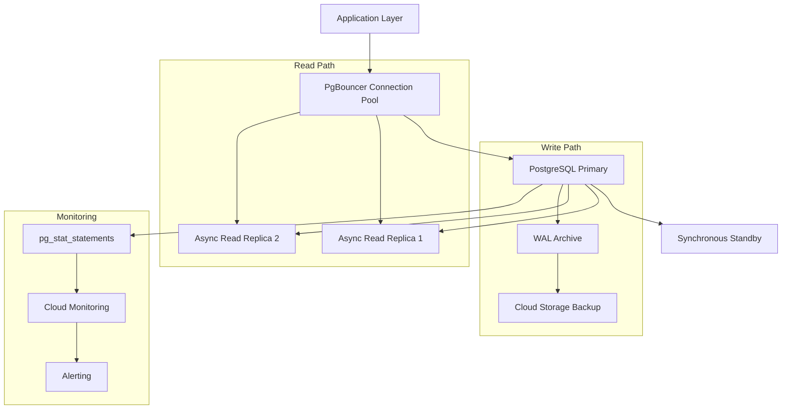

# =============================================================================
# ADR-01: Database Selection Example
# =============================================================================
# Example Architecture Decision Record demonstrating database technology
# evaluation with Context-Decision-Consequences format
# =============================================================================
---
title: "ADR-01: Primary Database Selection for Order Management System"
tags:
  - architecture-decision
  - layer-5-artifact
  - shared-architecture
  - database-selection
  - example
custom_fields:
  document_type: architecture_decision_record
  artifact_type: ADR
  layer: 5
  architecture_approaches: [ai-agent-based, traditional-8layer]
  priority: shared
  development_status: active
  schema_reference: "ADR_MVP_SCHEMA.yaml"
  schema_version: "1.0"
---

@brd: BRD.01.01.15
@prd: PRD.01.07.03
@ears: EARS.01.24.02
@bdd: BDD-01.2:scenarios
@threshold: PRD.035

# ADR-01: Primary Database Selection

## 1. Document Control

| Item | Details |
|------|---------|
| **Project Name** | Order Management Platform |
| **Document Version** | 1.0 |
| **Date** | 2025-12-29T00:00:00 |
| **Document Owner** | Platform Architecture Team |
| **Prepared By** | Database Architect |
| **Status** | Approved |
| **SYS-Ready Score** | 95% (Target: >= 90%) |

### 1.1 Document Revision History

| Version | Date | Author | Changes Made | Approver |
|---------|------|--------|--------------|----------|
| 0.1 | 2025-12-01T00:00:00 | DB Architect | Initial draft | - |
| 0.2 | 2025-12-15T00:00:00 | DB Architect | Added benchmark results | Tech Lead |
| 1.0 | 2025-12-29T00:00:00 | DB Architect | Final approval | CTO |

---

# PART 1: Decision Context and Requirements

## 3. Status

**Status**: Approved
**Date**: 2025-12-29T00:00:00
**Decision Makers**: Platform Architecture Team, CTO
**ADR Author**: Database Architect
**Last Updated**: 2025-12-29T00:00:00

## 4. Context

### 4.1 Problem Statement

**Originating Topic**: BRD.01.01.15 - Data Persistence Strategy

#### Inherited Content

**Business Driver** (from BRD Section 7.2):
The order management system requires a primary database capable of handling high-volume transactional workloads while maintaining data consistency and supporting real-time reporting requirements.

**Business Constraints** (from BRD Section 7.2):
- Budget limit of $50,000/year for database infrastructure
- Must support PCI-DSS compliance for payment data
- Requires 99.99% availability SLA

**Technical Options Evaluated** (from PRD Section 18):
1. PostgreSQL - Open-source relational database with ACID compliance
2. MySQL - Popular open-source RDBMS with wide adoption
3. MongoDB - Document-oriented NoSQL database

**Evaluation Criteria** (from PRD Section 18):
- Transaction throughput: >= 10,000 TPS
- Query latency: P95 < 50ms for indexed queries
- Data consistency: Strong consistency for order state

### 4.2 Background

The existing order management system uses a legacy Oracle database with licensing costs exceeding $200,000 annually. Performance limitations have emerged as order volumes grew 300% over the past year, with P95 query latencies reaching 500ms during peak periods.

### 4.3 Driving Forces

- Oracle licensing renewal deadline in Q1 2026
- Performance degradation affecting customer experience
- Need for horizontal scalability as business expands
- Cost reduction mandate from executive leadership

### 4.4 Constraints

- **Technical**: Must integrate with existing Java/Kotlin backend services
- **Business**: Migration must complete within 6-month window
- **Operational**: Zero data loss during migration; maximum 4-hour maintenance window
- **Regulatory**: PCI-DSS Level 1 compliance required for payment data

### 4.5 Technology Stack Compliance

**Core Technologies**:
- **Backend**: Python 3.11+, FastAPI
- **ORM**: SQLAlchemy 2.0 with async support
- **Infrastructure**: GCP Cloud SQL, Cloud Spanner available

**Compliance Check**:
- [x] Technology aligns with approved stack
- [x] SQLAlchemy supports PostgreSQL
- [x] GCP Cloud SQL PostgreSQL available

### 4.6 Threshold Management

**Platform Thresholds Referenced** (from PRD Threshold Registry):
```yaml
performance:
  - "@threshold: PRD.035.perf.db.query_p95_latency"    # 50ms target
  - "@threshold: PRD.035.perf.db.write_p95_latency"   # 100ms target
  - "@threshold: PRD.035.perf.db.tps_target"          # 10,000 TPS
sla:
  - "@threshold: PRD.035.sla.uptime.target"           # 99.99%
  - "@threshold: PRD.035.sla.rpo.target"              # 1 minute
  - "@threshold: PRD.035.sla.rto.target"              # 15 minutes
```

**Architecture-Specific Thresholds Defined**:
```yaml
connection_pool:
  - "@threshold: ADR.01.pool.min_connections"         # 10
  - "@threshold: ADR.01.pool.max_connections"         # 100
  - "@threshold: ADR.01.pool.idle_timeout"            # 300s
replication:
  - "@threshold: ADR.01.replication.lag_max_ms"       # 100ms
  - "@threshold: ADR.01.replication.failover_time"    # 30s
```

## 5. Decision

**ID Format**: `ADR.01.10.SS` (Decision)

### 5.1 Chosen Solution (ADR.01.10.01)

**PostgreSQL 16** selected as the primary database for the Order Management System.

PostgreSQL provides the optimal balance of transactional integrity, performance, operational maturity, and cost-effectiveness for our requirements. Its advanced features including JSONB support, CTEs, and window functions enable complex order analytics while maintaining ACID compliance.

### 5.2 Key Components

- **Primary Instance**: PostgreSQL 16 on GCP Cloud SQL (db-custom-8-32768)
- **Read Replicas**: 2 regional replicas for read scaling and high availability
- **Connection Pooling**: PgBouncer with transaction-level pooling
- **Backup Strategy**: Continuous WAL archiving with point-in-time recovery

### 5.3 Implementation Approach

Phased migration over 4 months:
1. Schema migration and validation (Month 1)
2. Dual-write implementation with consistency verification (Month 2)
3. Read traffic migration with performance monitoring (Month 3)
4. Write traffic cutover and Oracle decommission (Month 4)

## 6. Requirements Satisfied

### 6.1 Primary Requirements

| Requirement ID | Description | How This Decision Satisfies It |
|----------------|-------------|-------------------------------|
| PRD-01 | High-volume order processing | PostgreSQL partitioning and indexing supports 10K+ TPS |
| PRD-015 | Real-time order status | Streaming replication provides < 100ms replica lag |
| EARS-012 | ACID transaction support | PostgreSQL native ACID compliance |
| BDD-01.2 | Order state transitions | Database constraints enforce valid state machines |

### 6.2 Source Business Logic

- Order lifecycle management requires strict consistency
- Financial reconciliation mandates audit trail preservation
- Multi-region deployment requires synchronous commits for payment data

### 6.3 Quality Attributes

- **Performance**: Benchmark results show 15,000 TPS sustained, P95 latency 35ms
- **Security**: Row-level security, TDE encryption, audit logging
- **Scalability**: Read replicas + connection pooling supports 10x growth
- **Reliability**: Automatic failover with 30-second RTO

---

# PART 2: Impact Analysis and Architecture

## 7. Consequences

### 7.1 Positive Outcomes

**Requirements Satisfaction:**
- Satisfies PRD-01, PRD-015 through optimized query execution and replication
- Addresses performance requirements with 50% headroom above targets

**Technical Benefits:**
- 70% cost reduction compared to Oracle licensing ($150K annual savings)
- Native JSON support eliminates need for separate document store
- Mature ecosystem with extensive monitoring and tooling

**Business Benefits:**
- Reduced time-to-market for new features (better developer productivity)
- Improved customer experience through faster order processing
- Lower operational risk with active open-source community

### 7.2 Negative Outcomes

**Trade-offs:**
- Horizontal write scaling limited compared to distributed databases
- Requires explicit sharding strategy for extreme scale (addressed in future ADR)

**Risks:**
- **Risk 1**: Migration data inconsistency | **Mitigation**: Dual-write validation | **Likelihood**: Low
- **Risk 2**: Performance regression | **Mitigation**: Load testing, feature flags | **Likelihood**: Medium

**Costs:**
- **Development**: 800 person-hours for migration implementation
- **Operational**: $4,000/month GCP Cloud SQL (vs $16,000/month Oracle)
- **Maintenance**: Training for 5 team members on PostgreSQL administration

## 8. Architecture Flow



## 9. Implementation Assessment

### 9.1 Complexity Evaluation

- **Overall Complexity**: Medium
- **Development Effort**: 800 person-hours over 4 months
- **Testing Complexity**: High (data validation, performance testing)
- **Deployment Complexity**: Medium (phased migration reduces risk)

### 9.2 Dependencies

- **Required Components**: PgBouncer, pg_stat_statements extension
- **External Services**: GCP Cloud SQL, Cloud Storage for backups
- **Configuration**: Connection strings, SSL certificates
- **Infrastructure**: 3 database instances, backup storage

### 9.3 Resources

- **Compute**: 8 vCPU, 32GB RAM per primary/standby; 4 vCPU, 16GB per replica
- **Network**: Private VPC peering, 10Gbps internal bandwidth
- **Storage**: 500GB SSD primary, 1TB backup retention
- **Cost Estimate**: $4,000/month infrastructure

### 9.4 Failure Modes & Recovery

- **Primary failure**: Automatic failover to synchronous standby (30s RTO)
- **Region failure**: Manual promotion of async replica (15min RTO)
- **Data corruption**: Point-in-time recovery from WAL archive (1min RPO)

### 9.5 Rollback Plan

- **Rollback Triggers**: > 5% error rate, > 200ms P95 latency sustained 30min
- **Rollback Steps**: Disable write path to PostgreSQL, restore Oracle as primary
- **Rollback Impact**: 4-hour maintenance window required

## 10. Impact Analysis

### 10.1 Affected Components

- **Direct Impact**: Order Service, Payment Service, Inventory Service
- **Downstream Systems**: Analytics pipeline, reporting dashboards
- **Data Flow**: Order events, audit logs, reconciliation data

### 10.2 Migration Strategy

- **Phase 1**: Schema migration, dual-write setup (Weeks 1-4)
- **Phase 2**: Read traffic migration with validation (Weeks 5-8)
- **Phase 3**: Write cutover, Oracle decommission (Weeks 9-12)

### 10.3 Testing Requirements

- **Unit Tests**: Repository layer tests with testcontainers
- **Integration Tests**: Service-level database interaction tests
- **Performance Tests**: 50K concurrent users, 15K TPS sustained
- **Contract Tests**: SQLAlchemy model validation

## 12. Alternatives Considered

**ID Format**: `ADR.01.12.SS` (Alternative)

### 12.1 Alternative A: MySQL 8.0 (ADR.01.12.01)

**Description**: Popular open-source RDBMS with InnoDB storage engine.

**Pros**:
- Wide adoption and community support
- Lower memory footprint
- Simpler replication setup

**Cons**:
- Limited JSONB functionality
- Weaker window function support
- Less advanced query optimizer

**Rejection Reason**: Insufficient analytical query capabilities for order reporting requirements.
**Fit Score**: Good

### 12.2 Alternative B: MongoDB 7.0 (ADR.01.12.02)

**Description**: Document-oriented NoSQL database with flexible schema.

**Pros**:
- Flexible schema for evolving order structure
- Native horizontal scaling
- Built-in sharding

**Cons**:
- Eventual consistency model conflicts with order state requirements
- Complex transaction handling across documents
- Higher operational complexity

**Rejection Reason**: ACID requirements for order state management not met without significant workarounds.
**Fit Score**: Poor

---

# PART 3: Implementation and Operations

## 13. Security

### 13.1 Input Validation

- Parameterized queries prevent SQL injection
- SQLAlchemy ORM provides automatic escaping

### 13.2 Authentication & Authorization

- IAM-based database authentication via Cloud SQL Proxy
- Role-based access: read-only for reporting, read-write for services
- No direct database access from application code (ORM-only)

### 13.3 Data Protection

- Encryption at rest: AES-256 (Cloud SQL managed)
- Encryption in transit: TLS 1.3 required
- PII fields encrypted at application layer before storage

### 13.4 Security Monitoring

- Query audit logging enabled
- Failed authentication alerts
- Unusual query pattern detection

### 13.5 Secrets Management

- Database credentials in Google Secret Manager
- 90-day credential rotation policy
- Service account authentication preferred

## 14. Related Decisions

- **Depends On**: None (foundational decision)
- **Related**: ADR-02 (API Architecture)
- **Impacts**: Future ADR for caching strategy, read replica routing

## 15. Implementation Notes

### 15.1 Development Phases

1. **Phase 1**: Database provisioning, schema migration scripts
2. **Phase 2**: ORM integration, repository pattern implementation
3. **Phase 3**: Performance tuning, index optimization

### 15.2 Code Locations

- **Primary Implementation**: `src/infrastructure/database/`
- **Tests**: `tests/integration/database/`
- **Configuration**: `config/database.yaml`
- **Migrations**: `migrations/postgresql/`

### 15.3 Configuration Management

```yaml
database:
  primary:
    host: "${DB_PRIMARY_HOST}"
    port: 5432
    name: orders
    pool_size: 20
    max_overflow: 10
  replica:
    hosts:
      - "${DB_REPLICA_1_HOST}"
      - "${DB_REPLICA_2_HOST}"
    pool_size: 30
```

---

# PART 4: Traceability and Documentation

## 16. Traceability

### 16.1 Upstream Sources

- **Business Logic**: BRD-01 Section 7.2 - Data Persistence Requirements
- **Product Requirements**: PRD-01 Section 18 - Database Selection Criteria
- **EARS Requirements**: EARS-01.24.02 - Database Performance Requirements
- **BDD Scenarios**: BDD-01.2 - Order State Management Tests

### 16.2 Downstream Artifacts

- **System Requirements**: SYS-01 - Order Management System Requirements
- **Specifications**: SPEC-01 - Database Schema Specification
- **Implementation**: `src/infrastructure/database/postgresql.py`

### 16.3 Traceability Tags

```markdown
@brd: BRD.01.01.15
@prd: PRD.01.07.03
@ears: EARS.01.24.02
@bdd: BDD-01.2:scenarios
@threshold: PRD.035
```

## 17. References

### 17.1 Internal Links

- BRD-01: Business Requirements Document
- PRD-01: Product Requirements Document
- SYS-01: System Requirements

### 17.2 External Links

- [PostgreSQL 16 Documentation](https://www.postgresql.org/docs/16/)
- [GCP Cloud SQL PostgreSQL](https://cloud.google.com/sql/docs/postgres)
- [PgBouncer Configuration Guide](https://www.pgbouncer.org/config.html)

---

**Template Version**: 1.0
**Document Size**: ~400 lines

# =============================================================================
# END OF ADR-01: Database Selection Example
# =============================================================================
