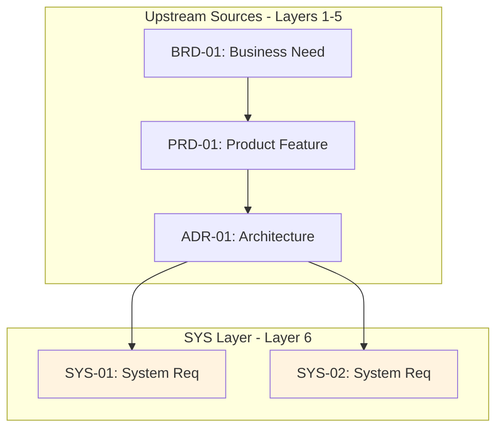

# Traceability Matrix: SYS-01 through SYS-NN

## Document Control

| Item | Details |
|------|---------|
| Document ID | TRACEABILITY_MATRIX_SYS |
| Title | Comprehensive System Requirements Traceability Matrix |
| Status | [Active/Draft] |
| Version | 1.0.0 |
| Date Created | YYYY-MM-DD |
| Author | [Team Name] |
| Purpose | Track upstream traceability for all System Requirements Documents |


---

**⚠️ TAG-BASED AUTO-GENERATION AVAILABLE**

This traceability matrix can be automatically generated by scanning code files for @sys:, @spec:, @test: tags.

**Recommended Approach:** Use tag-based auto-discovery instead of manual maintenance.

**Generate automatically using:**
```bash
# Extract tags from all files
python scripts/extract_tags.py --source src/ docs/ tests/ --output docs/generated/tags.json

# Validate tags against documents
python scripts/validate_tags_against_docs.py --tags docs/generated/tags.json --strict

# Generate SYS traceability matrix
python scripts/generate_traceability_matrix.py --type SYS --output docs/06_SYS/SYS-00_TRACEABILITY_MATRIX.md
```

**Benefits:**
- ✅ Single source of truth: Tags embedded in code
- ✅ Always up-to-date: Generated from current codebase
- ✅ No manual sync: Automated validation prevents drift
- ✅ Coverage metrics: Automatically calculated

**Tag Format:** `@sys: SYS.NN.EE.SS` (unified 4-segment format, e.g., `SYS.08.01.01` for functional, `SYS.08.02.01` for quality)

See: [TRACEABILITY.md](../TRACEABILITY.md#tag-based-auto-discovery-alternative) for complete tag-based workflow.

---

## 1. Overview

### 1.1 Document Type Description
System Requirements Documents (SYS) define system-level functional requirements and quality attributes derived from architecture decisions. SYS documents bridge architectural decisions (ADR) and atomic implementation requirements (REQ).

### 1.2 Coverage Scope
This matrix tracks all SYS documents and their upstream sources (BRD, PRD, EARS, BDD, ADR). Downstream documents (REQ, SPEC) track their own upstream references to SYS—this matrix does not maintain downstream links.

### 1.3 Statistics
- **Total SYS Tracked**: [X] documents
- **Total Requirements**: [Y] system requirements
- **Coverage Period**: [Start Date] to [End Date]
- **Last Updated**: YYYY-MM-DD

---

---

## 2. Required Tags (Cumulative Tagging Hierarchy - Layer 6)

### 2.1 Tag Requirements for SYS Artifacts

**Layer**: 6
**Artifact Type**: SYS (System Requirements)
**Required Tags**: `@brd`, `@prd`, `@ears`, `@bdd`, `@adr`
**Tag Count**: 5

### 2.2 Tag Format

```markdown
@brd: BRD.09.01.15, BRD.09.01.06
@prd: PRD.16.01.03
@ears: EARS.12.24.02, EARS.12.24.01
@bdd: BDD.15.13.01
@adr: ADR-033
```

**Format Rules**:
- Prefix: `@` symbol
- Artifact Type: lowercase (`brd`, `prd`, `ears`, `bdd`, `adr`)
- Separator: colon `:` after artifact type, `:` between document ID and requirement ID
- Document ID: Standard format (e.g., `SYS-NN`)
- Requirement ID: Specific requirement/section identifier
- Multiple Values: comma-separated for same artifact type

### 2.3 Example: SYS with Required Tags

````markdown
# SYS-012: Order Service System Requirements

## 12. Traceability

### 12.1 Upstream Sources

**Required Tags** (Cumulative Tagging Hierarchy - Layer 6):

```
@brd: BRD.09.01.15, BRD.09.01.06
@prd: PRD.16.01.03
@ears: EARS.12.24.02, EARS.12.24.01
@bdd: BDD.15.13.01
@adr: ADR-033
```

### 12.2 Downstream Artifacts

[Links to SPEC, TASKS, Code that reference this SYS]
````

### 2.4 Validation Rules

1. **Required**: Each SYS artifact MUST include at least one tag for each required layer
2. **Format Compliance**: All tags must follow `@artifact-type: DOC-ID:NN` format
3. **Valid References**: All referenced documents and requirements must exist
4. **No Gaps**: Cannot skip any required upstream layer in the chain
5. **Tag Count**: Must have exactly 5 tags for Layer 6

### 2.5 Tag Discovery

SYS tags can be discovered automatically:
```bash
# Find all SYSs and their upstream tags
python scripts/extract_tags.py --type SYS --show-all-upstream

# Validate SYS-012 has required tags
python scripts/validate_tags_against_docs.py \
  --artifact SYS-012 \
  --expected-layers brd,prd,ears,bdd,adr \
  --strict

# Generate SYS traceability report
python scripts/generate_traceability_matrix.py \
  --type SYS \
  --show-coverage
```

### 2.6 SYS Traceability Pattern

**Key Role**: SYS translates architecture decisions into concrete system-level requirements that can be decomposed into atomic specifications.

---

## 3. Complete SYS Inventory

| SYS ID | Title | System Category | Total Requirements | Status | Date | Upstream Sources |
|--------|-------|-----------------|-------------------|--------|------|------------------|
| SYS-01 | [System requirement title] | [Category] | [X] | Active | YYYY-MM-DD | BRD-01, PRD-01, EARS-01, BDD-01, ADR-01 |
| SYS-02 | [System requirement title] | [Category] | [X] | Active | YYYY-MM-DD | BRD-01, PRD-02, EARS-02, BDD-02, ADR-02 |
| SYS-NN | ... | ... | ... | ... | ... | ... |

---

## 4. Upstream Traceability (REQUIRED)

> **Traceability Rule**: Upstream traceability is REQUIRED for SYS documents. All SYS requirements MUST reference existing BRD, PRD, EARS, BDD, and ADR documents.

### 4.1 ADR → SYS Traceability

| ADR ID | ADR Title | SYS IDs | SYS Titles | Relationship |
|--------|-----------|---------|------------|--------------|
| ADR-01 | [Architecture decision] | SYS-01, SYS-02 | [System requirements] | Architectural decisions translated to system requirements |
| ADR-NN | ... | ... | ... | ... |

### 4.2 EARS → SYS Traceability

| EARS ID | EARS Title | SYS IDs | SYS Titles | Relationship |
|---------|------------|---------|------------|--------------|
| EARS-01 | [Formal requirement] | SYS-01 | [System requirement] | Formal requirements inform system-level SPEC |
| EARS-NN | ... | ... | ... | ... |

---

## 5. Downstream Reference Guidance

> **Upstream-Only Traceability Rule**: This matrix does NOT track downstream documents. Each downstream artifact (REQ, SPEC) tracks its own upstream references to SYS. This eliminates post-creation maintenance and ensures traceability accuracy.

### 5.1 How Downstream Documents Reference SYS

| Downstream Type | Required Tag Format | Example |
|-----------------|---------------------|---------|
| REQ | `@sys: SYS.NN.EE.SS` | `@sys: SYS.08.01.01` |
| SPEC | `@sys: SYS.NN.EE.SS` | `@sys: SYS.12.02.02, SYS.12.02.03` |

### 5.2 Finding Downstream References

To discover which downstream documents reference a specific SYS, use reverse traceability:

```bash
# Find all REQ documents referencing SYS-012
grep -r "@sys: SYS.12" ../07_REQ/

# Find all SPEC documents referencing any SYS
  grep -r "@sys:" ../09_SPEC/


# Generate reverse traceability report
python scripts/generate_reverse_traceability.py \
  --upstream SYS-012 \
  --downstream REQ,SPEC
```

### 5.3 Downstream Document Responsibilities

| Downstream Type | Layer | Required Upstream Tags | SYS Relationship |
|-----------------|-------|------------------------|------------------|
| REQ | 7 | `@brd`, `@prd`, `@ears`, `@bdd`, `@adr`, `@sys` | Atomic requirements decompose system requirements |
| SPEC | 9 | All upstream layers | Specifications detail system requirement implementation |

---

## 6. System Requirements Categories

### 6.1 SYS by Category

| Category | SYS IDs | Total | Functional | Quality Attributes |
|----------|---------|-------|------------|-------------------|
| [Infrastructure] | SYS-01, SYS-02 | 2 | 1 | 1 |
| [security] | SYS-03, SYS-004 | 2 | 2 | 0 |
| [Performance] | SYS-005 | 1 | 0 | 1 |
| [Integration] | SYS-006, SYS-007 | 2 | 2 | 0 |

### 6.2 Quality Attributes Summary

| QA Category | SYS IDs | Requirements | Status |
|--------------|---------|--------------|--------|
| Performance | SYS-005 | [X] | [Status] |
| Scalability | SYS-02 | [X] | [Status] |
| security | SYS-03, SYS-004 | [X] | [Status] |
| Reliability | SYS-008 | [X] | [Status] |
| Maintainability | SYS-009 | [X] | [Status] |

---

## 7. Cross-SYS Dependencies



> **Note on Diagram Labels**: The above flowchart shows the sequential workflow. For formal layer numbers used in cumulative tagging, always reference the 14-layer architecture (Layers 0-13) defined in README.md. Diagram groupings are for visual clarity only.

---

## 8. Implementation Status

### 8.1 SYS Implementation Progress

| SYS ID | Total Requirements | REQ Created | SPEC Created | Completion % |
|--------|-------------------|-------------|--------------|--------------|
| SYS-01 | 10 | 10 | 5 | 75% |
| SYS-02 | 5 | 5 | 5 | 100% |
| SYS-03 | 8 | 4 | 0 | 25% |
| SYS-NN | ... | ... | ... | ... |

---

## 9. Immediate Next Steps

### 9.1 Priority Actions
1. **Complete Missing REQ Decomposition**: [X] SYS documents need atomic requirements
2. **Create SPEC Documents**: [Y] SYS documents need technical specifications
3. **Validate QA Coverage**: [Z] quality attributes need verification

---

## 10. Revision History

| Version | Date | Changes | Author |
|---------|------|---------|--------|
| 1.0.0 | YYYY-MM-DD | Initial creation | [Author Name] |

---

## 11. References

- **SYS Index**: [SYS-00_index.md](SYS-00_index.md)
- **SYS MVP Template**: [SYS-MVP-TEMPLATE.md](SYS-MVP-TEMPLATE.md) (default)
- **SYS Full Template**: (removed from workflow)
- **Complete Traceability Matrix**: [../TRACEABILITY_MATRIX_COMPLETE-TEMPLATE.md](../TRACEABILITY_MATRIX_COMPLETE-TEMPLATE.md)
- **Related Matrices**: [ADR](../05_ADR/ADR-00_TRACEABILITY_MATRIX-TEMPLATE.md), [REQ](../07_REQ/REQ-00_TRACEABILITY_MATRIX-TEMPLATE.md), [SPEC](../09_SPEC/SPEC-00_TRACEABILITY_MATRIX-TEMPLATE.md)
