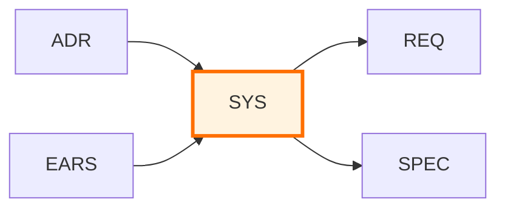

# SYS-000: System Requirements Specification Master Index

Note: Some examples in this document show a portable `docs/` root. In this repository, artifact folders live at the ai_dev_flow root without the `docs/` prefix; see README → “Using This Repo” for path mapping.

## Purpose

This document serves as the master index for all System Requirements Specification (SYS) documents in the project. Use this index to:

- **Discover** existing system-level requirements
- **Track** system specification status
- **Coordinate** system design across components
- **Reference** functional requirements and quality attributes

## Position in Document Workflow



> **Note on Diagram Labels**: The above flowchart shows the sequential workflow. For formal layer numbers used in cumulative tagging, always reference the 14-layer architecture (Layers 0-13) defined in README.md. Diagram groupings are for visual clarity only.

**Layer**: 6 (System Requirements Layer)
**Upstream**: BRD, PRD, EARS, BDD, ADR
**Downstream**: REQ, SPEC

## System Requirements Index

| SYS ID | Title | System Category | Status | Related ADR | Requirements | Last Updated |
|--------|-------|-----------------|--------|-------------|--------------|--------------|
| [SYS-MVP-TEMPLATE.md](./SYS-MVP-TEMPLATE.md) | Template (default) | Reference | Reference | - | - | 2025-11-13 |

## Planned

- Use this section to list SYS documents planned but not yet created. Move rows to the main index table when created.

| ID | Title | Sources (02_PRD/EARS) | Priority | Notes |
|----|-------|---------------------|----------|-------|
| SYS-XX | … | 02_PRD/EARS-YY | High/Med/Low | … |

## Status Definitions

| Status | Meaning | Description |
|--------|---------|-------------|
| **Draft** | In development | SYS document being written |
| **Review** | Under review | Architecture and requirements review in progress |
| **Approved** | Finalized | Requirements approved, ready for decomposition |
| **Decomposed** | REQs created | Atomic requirements (REQ) created from SYS |
| **Implemented** | In system | Requirements implemented in specifications and code |
| **Verified** | Tested | Requirements verified through testing |

## System Categories

| Category | Description | Examples |
|----------|-------------|----------|
| **Infrastructure** | System infrastructure and deployment | Compute, storage, networking |
| **Security** | Authentication, authorization, compliance | Identity management, encryption |
| **Performance** | Throughput, latency, scalability | Response times, concurrent users |
| **Integration** | External system connections | APIs, message queues, webhooks |
| **Data Management** | Data storage, processing, analytics | Databases, caching, ETL |
| **Observability** | Monitoring, logging, alerting | Metrics, traces, logs |
| **Reliability** | Availability, fault tolerance, recovery | HA, backup, disaster recovery |

## Adding New System Requirements

When creating a new SYS document:

1. **Copy Template**:
   ```bash
   cp ai_dev_flow/06_SYS/SYS-MVP-TEMPLATE.md \
      docs/06_SYS/SYS-NN_system_area.md
   ```

2. **Assign SYS ID**: Use next sequential number (SYS-01, SYS-02, ...)

3. **Update This Index**: Add new row to table above

4. **Create Cross-References**: Link to upstream 05_ADR/EARS and plan downstream 07_REQ/SPEC

## Allocation Rules

- **Numbering**: Allocate sequentially starting at `01`
- **One System Area Per File**: Each `SYS-NN` covers a coherent system area
- **Slugs**: Short, descriptive, lower_snake_case
- **Decomposition**: Each SYS should decompose into atomic REQ documents
- **Index Updates**: Add entry for every new SYS document

## Index by Category

### Infrastructure
- None

### Security
- None

### Performance
- None

### Integration
- None

### Data Management
- None

### Observability
- None

### Reliability
- None

## Index by Status

### Draft
- None

### Review
- None

### Approved
- None

### Decomposed
- None

### Implemented
- None

### Verified
- None

## Requirements Summary

### Functional Requirements by System
- None

### Quality Attributes Summary

| QA Category | SYS Documents | Total Requirements | Status |
|--------------|---------------|--------------------|--------|
| Performance | - | 0 | - |
| Scalability | - | 0 | - |
| Security | - | 0 | - |
| Reliability | - | 0 | - |
| Maintainability | - | 0 | - |

## Decomposition Status

| SYS ID | Total Requirements | REQ Created | SPEC Created | Completion % |
|--------|-------------------|-------------|--------------|--------------|
| - | 0 | 0 | 0 | 0% |

## Metrics

| Metric | Value | Description |
|--------|-------|-------------|
| Total SYS Documents | 0 | Total system requirement documents |
| Total Requirements | 0 | Total system-level requirements |
| Functional Requirements | 0 | Functional system requirements |
| Quality Attributes | 0 | QAs (performance, security, etc.) |
| Decomposed to REQ | 0% | Percentage decomposed into atomic REQ |
| Implemented | 0% | Percentage with SPEC and code |

## Related Documents

- **Template**: [SYS-MVP-TEMPLATE.md](./SYS-MVP-TEMPLATE.md)
- **README**: [README.md](./README.md) - Learn about SYS purpose and structure
- **Traceability Matrix**: [SYS-00_TRACEABILITY_MATRIX-TEMPLATE.md](./SYS-00_TRACEABILITY_MATRIX-TEMPLATE.md)

## Maintenance Guidelines

### Updating This Index

- Update whenever new SYS document is created
- Track status changes through system requirements lifecycle
- Maintain decomposition status (SYS → REQ → SPEC)
- Monitor quality attributes coverage

### Quality Checks

Before marking SYS as "Approved":
- ✅ Functional requirements clearly defined
- ✅ Quality attributes with measurable criteria
- ✅ System constraints documented
- ✅ Cross-references to upstream 05_ADR/EARS complete
- ✅ Decomposition plan for atomic REQ created
- ✅ Test strategy defined

---

**Index Version**: 2.0
**Last Updated**: 2025-11-13
**Maintainer**: [Project Team]
