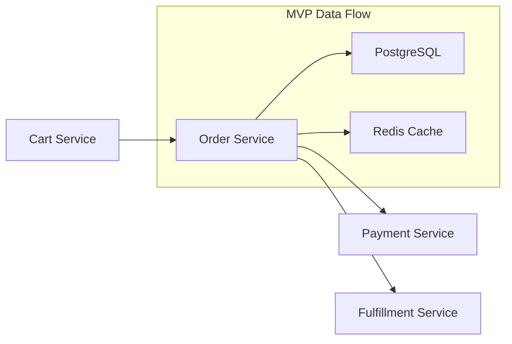

# SYS-01: Order Management System

**MVP Scope**: This system specification focuses on core MVP capabilities for order management. Extended system requirements deferred to full SYS document upon MVP success.

## 1. Document Control

| Item | Details |
|------|---------|
| **Status** | Approved |
| **Version** | 1.0.0 |
| **Date Created** | 2025-12-29 |
| **Last Updated** | 2025-12-29 |
| **Author** | Technical Architecture Team |
| **Owner** | Platform Engineering Team |
| **Priority** | High |
| **REQ-Ready Score** | ✅ 95% (Target: ≥85% for MVP) |

---

## 2. Executive Summary

The Order Management System (OMS) provides core order processing capabilities for the e-commerce platform. It handles order creation, validation, payment coordination, fulfillment orchestration, and lifecycle management from cart checkout through delivery confirmation.

### 2.1 System Context

**Architecture Layer**: Backend Services

**Interacts With**:
- Upstream: Cart Service, Customer Service
- Downstream: Payment Service, Fulfillment Service, Notification Service

**Business Value**: Supports order processing workflows with 99.9% accuracy target, enabling same-day fulfillment through real-time inventory coordination.

---

## 3. Scope

### 3.1 System Boundaries

**Included Capabilities (MVP)**:
- Order creation from cart
- Order validation and state management
- Payment coordination
- Order lifecycle tracking
- Basic error handling and recovery

**Excluded Capabilities (Post-MVP)**:
- International order routing - Reason: Complex tax/customs requirements
- B2B order handling - Reason: Different workflow requirements
- Subscription orders - Reason: Recurring billing complexity

### 3.2 External Dependencies

| Dependency | Type | Status | Impact if Unavailable |
|------------|------|--------|----------------------|
| Payment Service | API | Available | Queue orders for retry |
| Inventory Service | API | Available | Show "availability varies" |
| Customer Service | API | Available | Use cached customer data |

---

## 4. Functional Requirements

**ID Format**: `SYS.01.01.SS` (Functional Requirement)

### 4.1 Core System Behaviors

#### SYS.01.01.01: Create Order from Cart

**Description**: Transform shopping cart into a new order with inventory reservation.

| Aspect | Specification |
|--------|---------------|
| **Inputs** | Customer ID, cart items, shipping address, payment method token |
| **Processing** | Validate items, calculate totals, create DRAFT order, reserve inventory |
| **Outputs** | Order ID, order summary, estimated delivery date |
| **Success Criteria** | Order created within 500ms, inventory reserved atomically |

---

#### SYS.01.01.02: Submit Order for Payment

**Description**: Transition order from DRAFT to payment processing.

| Aspect | Specification |
|--------|---------------|
| **Inputs** | Order ID, payment authorization |
| **Processing** | Validate DRAFT status, transition to PENDING_PAYMENT, initiate payment |
| **Outputs** | Payment confirmation, updated order status |
| **Success Criteria** | Payment processed, order status reflects result |

---

#### SYS.01.01.03: Cancel Order

**Description**: Cancel an order and release all held resources.

| Aspect | Specification |
|--------|---------------|
| **Inputs** | Order ID, cancellation reason |
| **Processing** | Validate cancellable state, release inventory, initiate refund if needed |
| **Outputs** | Cancellation confirmation, refund status |
| **Success Criteria** | Order cancelled atomically, all resources released |

---

### 4.2 Data Processing (MVP Baseline)

**Input Handling**:
- Validation: JSON schema validation, product ID verification, quantity limits (1-100)
- Error handling: Return 400 with field-level errors for invalid data

**Data Storage** (if applicable):
- Storage type: PostgreSQL (primary), Redis (cache)
- Retention: Active orders indefinitely, completed orders archived after 7 years

**Output Format**:
- Schema: JSON with ISO 8601 timestamps, decimal currency (2 places)
- Validation: Response schema validation before sending

### 4.3 Error Handling (MVP)

| Error Type | System Behavior | User Experience |
|------------|-----------------|-----------------|
| Invalid input | Return 400 with field errors | Detailed validation message |
| Payment failure | Keep PENDING_PAYMENT, retry | "Payment failed, please retry" |
| Inventory unavailable | Reject order | "Item no longer available" |
| External service down | Circuit breaker, queue | "Processing delayed" notification |

---

## 5. Quality Attributes

**ID Format**: `SYS.01.02.SS` (Quality Attribute)

### 5.1 Performance (SYS.01.02.01)

| Metric | MVP Target | Measurement |
|--------|------------|-------------|
| Response time (p50) | < 100ms | APM traces |
| Response time (p95) | < 500ms | APM traces |
| Throughput | 1000 req/sec | Load testing |

### 5.2 Reliability (SYS.01.02.02)

| Metric | MVP Target | Notes |
|--------|------------|-------|
| Availability | 99.9% | Excluding maintenance |
| Error rate | < 0.1% | Of total requests |
| Recovery time | < 5 minutes | From failure detection |

### 5.3 Security (SYS.01.02.03)

- [x] **Authentication**: OAuth 2.0 with JWT
- [x] **Authorization**: Role-based access control
- [x] **Encryption in transit**: TLS 1.3
- [x] **Encryption at rest**: AES-256 for sensitive data
- [x] **Input validation**: All user inputs validated

### 5.4 Observability (SYS.01.02.04)

**Logging**:
- Format: Structured JSON
- Levels: DEBUG, INFO, WARN, ERROR
- Correlation: Request ID propagation across services

**Metrics** (MVP baseline):
- Request count, error rate, latency (p50/p95/p99)
- Orders created/completed/cancelled per minute

**Alerting**:
- Error rate > 1% for 5 minutes
- Latency (p95) > 500ms for 5 minutes

---

## 6. Interface Specifications

### 6.1 API Interfaces (High-Level)

> **Note**: Detailed API contracts (endpoints, schemas) created as CTR documents after REQ approval.

**Interface Style**: REST

| Endpoint Pattern | Method | Purpose | Auth |
|------------------|--------|---------|------|
| `/api/v1/orders` | POST | Create new order | Required |
| `/api/v1/orders/{id}` | GET | Retrieve order details | Required |
| `/api/v1/orders/{id}` | PATCH | Update order | Required |
| `/api/v1/orders/{id}/submit` | POST | Submit for payment | Required |
| `/api/v1/orders/{id}/cancel` | POST | Cancel order | Required |

### 6.2 Data Formats

**Request Format**: JSON
**Response Format**: JSON

**Standard Response Structure**:
```json
{
  "success": true,
  "data": { ... },
  "error": null,
  "request_id": "uuid"
}
```

**Error Response Structure**:
```json
{
  "success": false,
  "data": null,
  "error": {
    "code": "ORDER_VALIDATION_FAILED",
    "message": "Human readable message",
    "details": [...]
  },
  "request_id": "uuid"
}
```

---

## 7. Data Management Requirements

### 7.1 Data Model (MVP)

| Entity | Key Fields | Storage | Retention |
|--------|------------|---------|-----------|
| Order | id, customer_id, status, total, created_at | PostgreSQL | Indefinite |
| OrderItem | id, order_id, product_id, quantity, price | PostgreSQL | Indefinite |
| OrderEvent | id, order_id, event_type, timestamp | PostgreSQL | 7 years |

### 7.2 Data Flow



---

## 8. Deployment and Operations Requirements

### 8.1 Deployment (MVP)

**Environment**: Cloud Run (GCP)
**Regions**: Single region (us-central1) for MVP
**Scaling**: Min 2 instances, Max 20 instances

### 8.2 Configuration

| Config Parameter | Type | Default | Description |
|------------------|------|---------|-------------|
| ORDER_TIMEOUT_MS | int | 30000 | Order processing timeout |
| MAX_ITEMS_PER_ORDER | int | 100 | Maximum items per order |
| PAYMENT_RETRY_COUNT | int | 3 | Payment retry attempts |

### 8.3 Maintenance

**Backup** (if applicable):
- Frequency: Continuous (WAL) + Daily snapshots
- Retention: 30 days
- Recovery test: Monthly

---

## 9. Testing and Validation Requirements

### 9.1 Test Coverage (MVP Targets)

| Test Type | Target Coverage | Scope |
|-----------|-----------------|-------|
| Unit tests | >= 80% | Core business logic |
| Integration tests | Critical paths | API endpoints, database operations |
| Load tests | Baseline metrics | Performance targets verification |

### 9.2 BDD Scenario Coverage

| Capability | BDD Feature | Scenario Count |
|------------|-------------|----------------|
| Order Creation | `BDD-01_order_creation.feature` | 8 scenarios |
| Order Modification | `BDD-01_order_modification.feature` | 5 scenarios |
| Order Cancellation | `BDD-01_order_cancellation.feature` | 4 scenarios |

---

## 10. Acceptance Criteria

### 10.1 Functional Validation

- [ ] Order creation completes within 500ms (p95)
- [ ] Order state transitions follow defined state machine
- [ ] Inventory reservations atomic with order creation
- [ ] Payment failures keep order in recoverable state
- [ ] Cancelled orders release all held resources

### 10.2 Quality Validation

- [ ] Performance targets met in staging environment
- [ ] Security controls verified (auth, encryption)
- [ ] Logging and monitoring operational
- [ ] API documentation complete

---

## 11. Risk Assessment (Top 5)

**ID Format**: `SYS.01.07.SS` (Risk)

| Risk ID | Risk | Likelihood | Impact | Mitigation |
|---------|------|------------|--------|------------|
| SYS.01.07.01 | Payment service unavailable | M | H | Circuit breaker, queue for retry |
| SYS.01.07.02 | Inventory sync delays | M | M | Cached availability, oversell protection |
| SYS.01.07.03 | Database failover during order | L | H | Transaction rollback, idempotency keys |
| SYS.01.07.04 | Peak load exceeds capacity | M | H | Auto-scaling, load shedding |
| SYS.01.07.05 | Data consistency issues | L | H | Strong consistency, reconciliation jobs |

---

## 12. Traceability

### 12.1 Upstream Sources

| Source Type | Document ID | Document Title | Relevant Sections | Relationship |
|-------------|-------------|----------------|-------------------|--------------|
| BRD | [BRD-000](../../01_BRD/BRD-00_index.md) | Business Requirements Index | Index | Business objectives reference |
| PRD | [PRD-000](../../02_PRD/PRD-00_index.md#PRD-000) | Product Requirements Index | Index | Product features reference |
| EARS | [EARS-000](../../03_EARS/EARS-00_index.md#EARS-000) | EARS Index | Index | Formal requirements reference |
| ADR | [ADR-000](../../05_ADR/ADR-00_index.md#ADR-000) | Architecture Decisions Index | Index | Architecture reference |

### 12.2 Downstream Artifacts

| Artifact | Requirement Title | SYS Features Driving Requirement | Verification Method | Relationship |
|----------|------------------|----------------------------------|---------------------|--------------|
| REQ (TBD) | Order Creation Requirements | SYS.01.01.01 - SYS.01.01.03 | Unit test, Integration test | Detailed implementation requirement |
| SPEC (TBD) | Order Service Specification | Sections 4.1, 6.1 | BDD scenario, Contract test | Implementation blueprint |
| CTR (TBD) | Order API Contract | Section 6.1 | Contract test | API/contract definition |

### 12.3 Traceability Tags

```markdown
@brd: BRD.01.01.10
@prd: PRD.01.07.01
@ears: EARS.01.24.01
@bdd: BDD.01.13.01
@adr: ADR-00
```

---

**Document Version**: 1.0.0
**Template Version**: 1.0 (MVP)
**Last Updated**: 2025-12-29

---

> **MVP Template Notes**:
> - This example demonstrates SYS-MVP-TEMPLATE.md structure
> - Focus on core order management capabilities
> - Uses unified 4-segment ID format (SYS.NN.TT.SS)
> - REQ-Ready Score threshold: >=85% for MVP

---

## 13. Traceability

### 13.1 Upstream Sources

| Source Type | Document ID | Document Title | Relevant Sections | Relationship |
|-------------|-------------|----------------|-------------------|--------------|
| BRD | BRD.01.01.10 | Order Management Business Requirements | Section 3.2 | Business objectives driving system requirements |
| PRD | PRD.01.07.01 | Order Processing Product Requirements | Section 4.1 | Product features reference |
| EARS | EARS.01.24.01 | Order Processing Formal Requirements | Section 2 | Formal requirements reference |
| ADR | ADR-05 | Order Service Architecture Decision | Section 2.1 | Architecture constraints |

### 13.2 Downstream Artifacts

| Artifact | Requirement Title | SYS Features Driving Requirement | Verification Method | Relationship |
|----------|------------------|----------------------------------|---------------------|--------------|
| REQ-01 | Order Creation Requirements | SYS.01.01.01 - SYS.01.01.03 | Unit test, Integration test | Atomic requirements |
| SPEC-01 | Order Service Specification | Sections 4.1, 6.1 | BDD scenario, Contract test | Implementation blueprint |
| CTR-01 | Order API Contract | Section 6.1 | Contract test | API contract definition |

### 13.3 Traceability Tags

```markdown
@brd: BRD.01.01.10
@prd: PRD.01.07.01
@ears: EARS.01.24.01
@bdd: BDD.01.13.01
@adr: ADR-05
@sys: SYS.01.25.01
```

---

## 14. Implementation Notes

### 14.1 Technical Approach

**Architecture Pattern**: Microservices with event-driven communication
- Order Service as core domain service
- Event sourcing for order state changes
- CQRS for read/write separation

**Key Technologies**:
- Java/Spring Boot for service implementation
- PostgreSQL for transactional data
- Redis for caching and session management
- Kafka for event streaming
- Kubernetes for container orchestration

### 14.2 Code Location

```
src/
├── order-service/
│   ├── src/main/java/com/example/order/
│   │   ├── api/           # REST controllers
│   │   ├── service/       # Business logic
│   │   ├── repository/    # Data access
│   │   ├── domain/        # Domain models
│   │   └── events/        # Event publishers
│   └── src/test/
│       ├── unit/          # Unit tests
│       └── integration/   # Integration tests
```

### 14.3 Dependencies

**Runtime Dependencies**:
- Spring Boot 3.x
- PostgreSQL 15+
- Redis 7.x
- Apache Kafka 3.x

**Development Dependencies**:
- JUnit 5
- TestContainers
- Mockito

---

## 15. Change History

| Version | Date | Author | Changes |
|---------|------|--------|---------|
| 1.0.0 | 2025-12-29 | Technical Architecture Team | Initial version - Order Management System requirements |
| 1.1.0 | 2026-02-08 | Technical Architecture Team | Added missing sections 13-15 (Traceability, Implementation Notes, Change History) |

