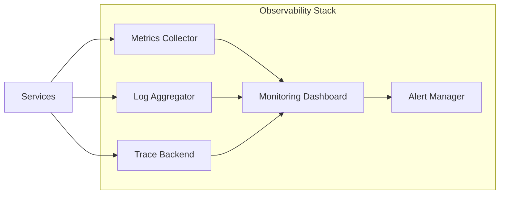

# SYS-02: Platform Quality Attributes

**MVP Scope**: This system specification defines quality attribute requirements for the e-commerce platform MVP. Extended quality requirements deferred to full SYS document upon MVP success.

## 1. Document Control

| Item | Details |
|------|---------|
| **Status** | Approved |
| **Version** | 1.0.0 |
| **Date Created** | 2025-12-29 |
| **Last Updated** | 2025-12-29 |
| **Author** | Platform Architecture Team |
| **Owner** | Platform Engineering Team |
| **Priority** | High |
| **REQ-Ready Score** | ✅ 95% (Target: ≥85% for MVP) |

---

## 2. Executive Summary

This document defines quality attribute requirements for the e-commerce platform. These non-functional requirements establish measurable performance, reliability, scalability, security, and observability targets that all platform services must achieve.

### 2.1 System Context

**Architecture Layer**: Platform-wide (cross-cutting)

**Interacts With**:
- Upstream: All business services inherit these requirements
- Downstream: Infrastructure and monitoring systems

**Business Value**: Ensures customer-facing operations complete within acceptable timeframes, maintains platform availability at 99.9% uptime, and protects customer data through comprehensive security controls.

---

## 3. Scope

### 3.1 System Boundaries

**Included Capabilities (MVP)**:
- Performance targets (response time, throughput)
- Reliability requirements (availability, fault tolerance)
- Security baseline (authentication, encryption)
- Observability fundamentals (logging, metrics, alerting)

**Excluded Capabilities (Post-MVP)**:
- Advanced scalability patterns - Reason: Not needed at MVP scale
- Compliance certifications (SOC2, PCI-DSS) - Reason: Post-MVP priority
- Multi-region disaster recovery - Reason: Single region for MVP

### 3.2 External Dependencies

| Dependency | Type | Status | Impact if Unavailable |
|------------|------|--------|----------------------|
| Cloud Monitoring | API | Available | Reduced observability |
| Secret Manager | API | Available | Manual secret rotation |
| Load Balancer | Infrastructure | Available | Reduced fault tolerance |

---

## 4. Functional Requirements

**ID Format**: `SYS.02.01.SS` (Functional Requirement)

> **Note**: Quality attribute documents focus on non-functional requirements. Section 4 defines observable behaviors related to quality enforcement.

### 4.1 Core System Behaviors

#### SYS.02.01.01: Health Check Endpoint

**Description**: Each service must expose a health check endpoint for monitoring.

| Aspect | Specification |
|--------|---------------|
| **Inputs** | HTTP GET request to `/health` |
| **Processing** | Check database connectivity, cache availability, dependencies |
| **Outputs** | JSON response with status and component health |
| **Success Criteria** | Response within 100ms, accurate status reporting |

---

#### SYS.02.01.02: Metrics Collection

**Description**: Each service must emit standard metrics for monitoring dashboards.

| Aspect | Specification |
|--------|---------------|
| **Inputs** | Runtime telemetry data |
| **Processing** | Aggregate and expose via Prometheus format |
| **Outputs** | Request count, latency histograms, error rates |
| **Success Criteria** | Metrics available at `/metrics` endpoint |

---

#### SYS.02.01.03: Structured Logging

**Description**: All services must emit structured logs with correlation IDs.

| Aspect | Specification |
|--------|---------------|
| **Inputs** | Application events, request data |
| **Processing** | Format as JSON with standard fields |
| **Outputs** | Log entries to centralized logging system |
| **Success Criteria** | All logs include timestamp, level, correlation_id |

---

### 4.2 Data Processing (MVP Baseline)

**Input Handling**:
- Validation: All inputs validated before processing
- Error handling: Structured error responses with codes

**Data Storage** (if applicable):
- Storage type: Not applicable (cross-cutting requirements)
- Retention: Metrics 30 days, logs 90 days

**Output Format**:
- Schema: Prometheus for metrics, JSON for logs
- Validation: Schema compliance checked

### 4.3 Error Handling (MVP)

| Error Type | System Behavior | User Experience |
|------------|-----------------|-----------------|
| Service degradation | Circuit breaker activation | Graceful fallback |
| Resource exhaustion | Auto-scaling trigger | Minimal impact |
| Security violation | Request rejection, alert | Access denied message |

---

## 5. Quality Attributes

**ID Format**: `SYS.02.02.SS` (Quality Attribute)

### 5.1 Performance (SYS.02.02.01)

| Metric | MVP Target | Measurement |
|--------|------------|-------------|
| API response time (p50) | < 50ms | APM traces |
| API response time (p95) | < 200ms | APM traces |
| API response time (p99) | < 500ms | APM traces |
| Page load (Time to Interactive) | < 2.5s | Real user monitoring |
| Throughput (sustained) | 1000 req/sec | Load testing |
| Throughput (peak) | 3000 req/sec | Load testing |

**Resource Utilization Targets**:

| Resource | Normal | Warning | Critical |
|----------|--------|---------|----------|
| CPU | < 70% | 80% | 90% |
| Memory | < 70% | 85% | 95% |
| Disk I/O | < 60% | 80% | 90% |

### 5.2 Reliability (SYS.02.02.02)

| Metric | MVP Target | Notes |
|--------|------------|-------|
| Availability (Tier 1) | 99.9% | Checkout, Payment, Auth |
| Availability (Tier 2) | 99.5% | Catalog, Search, Inventory |
| Error rate | < 0.1% | Of total requests |
| MTTR | < 30 minutes | Mean time to recovery |

**Fault Tolerance**:

| Component | Redundancy | Failover Time |
|-----------|------------|---------------|
| Application servers | N+1 | < 30 seconds |
| Database | Primary + replica | < 60 seconds |
| Cache | 3-node cluster | < 10 seconds |

### 5.3 Security (SYS.02.02.03)

- [x] **Authentication**: OAuth 2.0 with JWT (1-hour expiry)
- [x] **Authorization**: RBAC with least privilege
- [x] **Encryption in transit**: TLS 1.3 required
- [x] **Encryption at rest**: AES-256 for sensitive data
- [x] **Input validation**: All endpoints validated
- [x] **Session management**: 30-minute idle timeout

**Security Monitoring**:

| Event | Threshold | Action |
|-------|-----------|--------|
| Failed logins | > 100/min | Rate limit + alert |
| Privilege escalation | Any | Immediate alert |
| API abuse | > 1000 req/min/user | Rate limit |

### 5.4 Observability (SYS.02.02.04)

**Logging**:
- Format: Structured JSON
- Levels: ERROR, WARN, INFO, DEBUG
- Correlation: Request ID propagation
- Retention: 90 days

**Metrics**:
- Business: Orders/min, revenue/hour, conversion rate
- Technical: Latency (p50/p95/p99), error rate, throughput
- Granularity: 1 minute
- Retention: 30 days

**Alerting**:

| Alert | Condition | Severity | Response |
|-------|-----------|----------|----------|
| Service down | Health check fails 3x | Critical | Page on-call |
| High error rate | > 1% for 5 min | High | Alert team |
| Latency spike | p95 > 200ms for 5 min | High | Alert team |
| Resource exhaustion | CPU > 90% for 5 min | Medium | Auto-scale |

---

## 6. Interface Specifications

### 6.1 API Interfaces (High-Level)

> **Note**: Quality attributes apply to all service APIs. These are standard endpoints.

**Interface Style**: REST/Prometheus

| Endpoint Pattern | Method | Purpose | Auth |
|------------------|--------|---------|------|
| `/health` | GET | Health check | None |
| `/health/ready` | GET | Readiness probe | None |
| `/health/live` | GET | Liveness probe | None |
| `/metrics` | GET | Prometheus metrics | Internal |

### 6.2 Data Formats

**Health Check Response**:

```json
{
  "status": "healthy",
  "timestamp": "2025-12-29T10:00:00Z",
  "components": {
    "database": "healthy",
    "cache": "healthy",
    "dependencies": "healthy"
  }
}
```

**Log Entry Format**:

```json
{
  "timestamp": "2025-12-29T10:30:00.000Z",
  "level": "INFO",
  "service": "order-service",
  "correlation_id": "req-abc123",
  "trace_id": "trace-xyz789",
  "message": "Request processed",
  "context": { "duration_ms": 45 }
}
```

---

## 7. Data Management Requirements

### 7.1 Data Model (MVP)

| Entity | Key Fields | Storage | Retention |
|--------|------------|---------|-----------|
| Metrics | timestamp, name, value, labels | Time-series DB | 30 days |
| Logs | timestamp, level, message, context | Log aggregator | 90 days |
| Traces | trace_id, span_id, duration | Trace backend | 7 days |

### 7.2 Data Flow



---

## 8. Deployment and Operations Requirements

### 8.1 Deployment (MVP)

**Environment**: GCP (Cloud Run, Cloud SQL, Memorystore)
**Regions**: Single region (us-central1) for MVP
**Scaling**: Auto-scaling based on CPU/request metrics

### 8.2 Configuration

| Config Parameter | Type | Default | Description |
|------------------|------|---------|-------------|
| LOG_LEVEL | string | INFO | Minimum log level |
| METRICS_ENABLED | bool | true | Enable metrics endpoint |
| HEALTH_CHECK_TIMEOUT_MS | int | 5000 | Health check timeout |
| CIRCUIT_BREAKER_THRESHOLD | int | 5 | Failures before open |

### 8.3 Maintenance

**Backup** (if applicable):
- Frequency: Daily (metrics), continuous (logs)
- Retention: Per data type (see Section 7.1)
- Recovery test: Monthly

---

## 9. Testing and Validation Requirements

### 9.1 Test Coverage (MVP Targets)

| Test Type | Target Coverage | Scope |
|-----------|-----------------|-------|
| Unit tests | >= 85% | Core quality enforcement logic |
| Integration tests | Critical paths | Health checks, metrics, logging |
| Load tests | Performance targets | Verify p95/p99 under load |
| Chaos tests | Fault tolerance | Circuit breaker, failover |

### 9.2 BDD Scenario Coverage

| Capability | BDD Feature | Scenario Count |
|------------|-------------|----------------|
| Performance | `BDD-02_performance.feature` | 6 scenarios |
| Reliability | `BDD-02_reliability.feature` | 8 scenarios |
| Security | `BDD-02_security.feature` | 10 scenarios |

---

## 10. Acceptance Criteria

### 10.1 Functional Validation

- [ ] Health check endpoints respond within 100ms
- [ ] Metrics endpoint exposes all required metrics
- [ ] Structured logging includes correlation IDs
- [ ] Circuit breakers activate on failures
- [ ] Auto-scaling responds to load

### 10.2 Quality Validation

- [ ] API p95 latency < 200ms under normal load
- [ ] Platform availability >= 99.9% (Tier 1)
- [ ] All data encrypted at rest and in transit
- [ ] Alerting triggers within 5 minutes of threshold breach

---

## 11. Risk Assessment (Top 5)

**ID Format**: `SYS.02.07.SS` (Risk)

| Risk ID | Risk | Likelihood | Impact | Mitigation |
|---------|------|------------|--------|------------|
| SYS.02.07.01 | Monitoring system overload | M | H | Sampling, aggregation |
| SYS.02.07.02 | Alert fatigue | M | M | Tuned thresholds, runbooks |
| SYS.02.07.03 | Log storage costs | H | M | Retention policies, compression |
| SYS.02.07.04 | Security incident detection lag | L | H | Real-time alerting |
| SYS.02.07.05 | Performance regression undetected | M | H | Automated benchmarks |

---

## 12. Traceability

### 12.1 Upstream References

| Source | Document | Relevant Section |
|--------|----------|------------------|
| BRD | BRD.01 | Platform reliability objectives |
| PRD | PRD.01 | Non-functional product requirements |
| EARS | EARS.01 | Quality attribute constraints |
| ADR | ADR.05 | Observability architecture decision |

### 12.2 Downstream Artifacts

| Artifact | Status | Relationship |
|----------|--------|--------------|
| REQ | TBD | Atomic quality requirements |
| SPEC | TBD | Monitoring specifications |
| CTR | TBD | Observability API contracts |

### 12.3 Traceability Tags

```markdown
@brd: BRD.01.01.15
@prd: PRD.01.07.05
@ears: EARS.01.24.05
@bdd: BDD.02.13.01
@adr: ADR-05
```

---

**Document Version**: 1.0.0
**Template Version**: 1.0 (MVP)
**Last Updated**: 2025-12-29

---

> **MVP Template Notes**:
> - This example demonstrates quality attributes using SYS-MVP-TEMPLATE.md structure
> - Focus on MVP-essential performance, reliability, security, and observability
> - Uses unified 4-segment ID format (SYS.NN.TT.SS)
> - REQ-Ready Score threshold: >=85% for MVP
