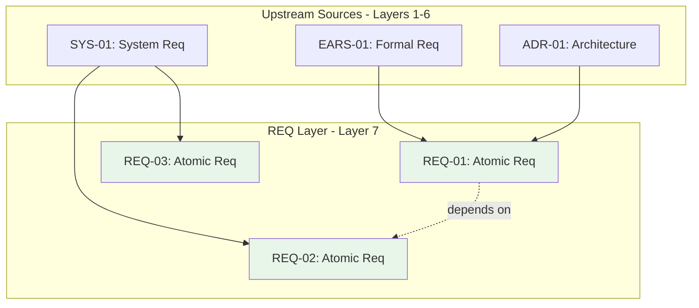

# Traceability Matrix: REQ-01 through REQ-NN

## Document Control

| Item | Details |
|------|---------|
| Document ID | TRACEABILITY_MATRIX_REQ |
| **Template Version** | **3.0** |
| Title | Comprehensive Atomic Requirements Traceability Matrix |
| Status | [Active/Draft] |
| Version | 1.0.0 |
| Date Created | YYYY-MM-DDTHH:MM:SS |
| Last Updated | YYYY-MM-DDTHH:MM:SS |
| Author | [Team Name] |
| **Layer** | **7 (Requirements)** |
| Purpose | Track upstream traceability for all Atomic Requirements Documents |


---

**⚠️ TAG-BASED AUTO-GENERATION AVAILABLE**

This traceability matrix can be automatically generated by scanning code files for @req:, @spec:, @test: tags.

**Recommended Approach:** Use tag-based auto-discovery instead of manual maintenance.

**Generate automatically using:**
```bash
# Extract tags from all files
python scripts/extract_tags.py --source src/ docs/ tests/ --output docs/generated/tags.json

# Validate tags against documents
python scripts/validate_tags_against_docs.py --tags docs/generated/tags.json --strict

# Generate REQ traceability matrix
python scripts/generate_traceability_matrix.py --type REQ --output docs/07_REQ/REQ-00_TRACEABILITY_MATRIX.md
```

**Benefits:**
- ✅ Single source of truth: Tags embedded in code
- ✅ Always up-to-date: Generated from current codebase
- ✅ No manual sync: Automated validation prevents drift
- ✅ Coverage metrics: Automatically calculated

**Tag Format:** `@req: REQ.NN.26.SS` (unified 4-segment format, e.g., `REQ.03.26.01`)

See: [TRACEABILITY.md](../TRACEABILITY.md#tag-based-auto-discovery-alternative) for complete tag-based workflow.

---

## 4. Overview

### 4.1 Document Type Description
Atomic Requirements Documents (REQ) define single, testable, implementation-ready requirements. REQ documents are the bridge between formal requirements (03_EARS/SYS) and technical specifications (09_SPEC/Code).

### 4.2 Coverage Scope
This matrix tracks all REQ documents and their upstream sources (BRD, PRD, EARS, BDD, ADR, SYS). Downstream documents (CTR, SPEC, TASKS, Code) track their own upstream references to REQ—this matrix does not maintain downstream links.

### 4.3 Statistics
- **Total REQ Tracked**: [X] documents
- **Requirement Domains**: [Y] domains
- **Coverage Period**: [Start Date] to [End Date]
- **Last Updated**: YYYY-MM-DDTHH:MM:SS

---

## 5. Required Tags (Cumulative Tagging Hierarchy - Layer 7)

### 5.1 Tag Requirements for REQ Artifacts

**Layer**: 7
**Artifact Type**: REQ (Atomic Requirements Document)
**Required Tags**: `@brd` through `@sys`
**Tag Count**: 6

### 5.2 Tag Format

```markdown
@brd: BRD.09.01.15, BRD.09.01.06
@prd: PRD.16.01.03
@ears: EARS.12.24.02, EARS.12.24.01
@bdd: BDD.15.13.01
@adr: ADR-033
@sys: SYS.12.25.01, SYS.12.25.02
```

**Format Rules**:
- Prefix: `@` symbol
- Artifact Types: lowercase (`brd`, `prd`, `ears`, `bdd`, `adr`, `sys`)
- Separator: colon `:` after artifact type
- Document ID: `TYPE-NN` format
- Requirement ID: specific requirement/section identifier
- Multiple Values: comma-separated within each tag line

### 5.3 Example: REQ with Required Tags

```markdown
# REQ-045: Place Limit Order Atomic Requirement

## 14. Traceability

### 15.1 Upstream Sources

**Required Tags** (Cumulative Tagging Hierarchy - Layer 7):
```markdown
@brd: BRD.09.01.15, BRD.09.01.06
@prd: PRD.16.01.03
@ears: EARS.12.24.02, EARS.12.24.01
@bdd: BDD.15.13.01, BDD.15.13.02
@adr: ADR-033
@sys: SYS.12.25.01, SYS.12.25.02
```

**Traceability Chain**:
- **BRD.09.01.15**: Business requirement for request submission capability
- **BRD.09.01.06**: Performance requirement (2-second execution)
- **PRD.16.01.03**: Product feature for operation execution
- **EARS.12.24.02**: Formal requirement "WHEN order validation succeeds..."
- **EARS.12.24.01**: State-driven requirement for order lifecycle
- **BDD.15.13.01**: Acceptance test scenario
- **BDD.15.13.02**: Negative test scenario
- **ADR-033**: Architecture decision for event-driven trade processing
- **SYS.12.25.01**: System performance requirement (2-second SLA)
- **SYS.12.25.02**: System reliability requirement (99.9% uptime)

### 15.2 Downstream Artifacts

> **Note**: Downstream links are added AFTER those documents are created.

**Direct Dependencies** (populated after downstream creation):
- SPEC: [SPEC IDs when created] - implementation specifications
- CTR: [CTR IDs when created] - API contracts
- Code: [Code paths when implemented] (`@req: REQ.45.26.01`)
- Tests: [Test paths when implemented] (`@req: REQ.45.26.01`)
```

### 5.4 Example: Atomic Requirement Structure

```markdown
# REQ-045: Place Limit Order Atomic Requirement

## 4. Requirement Statement

The system SHALL provide an API endpoint to place limit orders with the following parameters:
- Symbol (required, string, format: identifier)
- Quantity (required, positive integer)
- Limit price (required, positive decimal, 2 decimal places)
- Order type (required, enum: BUY, SELL)
- Time in force (required, enum: DAY, GTC, IOC)

## 5. Acceptance Criteria

1. Valid limit order request SHALL return order ID within 100ms
2. Invalid parameters SHALL return 400 error with descriptive message
3. System SHALL validate account has sufficient funds/shares
4. Order SHALL be placed on exchange within 2 seconds of validation
5. System SHALL log all request submission attempts

## 9. Constraints

- Maximum quantity: 10,000 shares per order
- Minimum price increment: $0.01
- Account balance check required before placement
- Market hours validation required (9:30 AM - 4:00 PM ET)

## 10. Dependencies

- Authentication service (REQ-010)
- Account balance service (REQ-015)
- Market data service (REQ-020)
- Order validation service (REQ-040)

## 14. Traceability

[Tags as shown in example above]
```

### 5.5 Validation Rules

1. **Required Tags**: Each REQ MUST include all 6 upstream tags (BRD through SYS)
2. **Format Compliance**: All tags must follow `@type: DOC-ID:REQ-ID` format
3. **Valid References**: All referenced documents and requirements must exist
4. **No Gaps**: Cannot skip intermediate layers (must include all layers from BRD through SYS)
5. **Atomic Nature**: Each REQ must be single-concern, testable, and implementation-ready
6. **Complete Chain**: Must trace back to original business requirements (BRD)

### 5.6 Tag Discovery

```bash
# Find all REQs and their complete upstream tag chain
python scripts/extract_tags.py --type REQ --show-all-upstream

# Validate REQ-045 has all required tags
python scripts/validate_tags_against_docs.py \
  --artifact REQ-045 \
  --expected-layers brd,prd,ears,bdd,adr,sys \
  --strict

# Generate REQ implementation coverage report
python scripts/generate_traceability_matrix.py \
  --type REQ \
  --show-downstream-coverage
```

### 5.7 REQ Traceability Pattern

REQ at Layer 7 represents the atomic, implementation-ready requirements:

```
BRD (Layer 1) → Business requirements
  ↓
PRD (Layer 2) → Product features (@brd)
  ↓
EARS (Layer 3) → Formal engineering requirements (@brd, @prd)
  ↓
BDD (Layer 4) → Test scenarios (@brd, @prd, @ears)
  ↓
ADR (Layer 5) → Architecture decisions (@brd through @bdd)
  ↓
SYS (Layer 6) → System requirements (@brd through @adr)
  ↓
REQ (Layer 7) → Atomic requirements (@brd through @sys)
  ↓
CTR (Layer 8) → API contracts (@brd through @req)
  ↓
SPEC (Layer 9) → Technical specifications (@brd through @req + optional ctr)
  ↓
TSPEC (Layer 10) → Test specifications (@brd through @spec)
  ↓
TASKS (Layer 11) → Implementation tasks (@brd through @tspec)
  ↓
Code (Layer 12) → Source code (@brd through @tasks)
```

**Key Role**: REQ decomposes high-level requirements (EARS, SYS) into single-concern, atomic, testable requirements that map directly to code implementations, serving as the bridge between requirements and implementation.

---

## 9. Complete REQ Inventory

| REQ ID | Title | Domain | Priority | Status | Date | Upstream Sources |
|--------|-------|--------|----------|--------|------|------------------|
| REQ-01 | [Atomic requirement title] | [Domain] | Must | Active | YYYY-MM-DDTHH:MM:SS | BRD-01, PRD-01, EARS-01, BDD-01, ADR-01, SYS-01 |
| REQ-02 | [Atomic requirement title] | [Domain] | Should | Active | YYYY-MM-DDTHH:MM:SS | BRD-01, PRD-01, EARS-02, BDD-02, ADR-01, SYS-02 |
| REQ-NN | ... | ... | ... | ... | ... | ... |

**Priority Legend**: Must, Should, Could, Won't (MoSCoW)

---

## 10. Upstream Traceability (REQUIRED)

> **Traceability Rule**: Upstream traceability is REQUIRED for REQ documents. All REQ requirements MUST reference existing BRD through SYS documents.

### 15.1 EARS → REQ Traceability

| EARS ID | EARS Title | REQ IDs | REQ Titles | Relationship |
|---------|------------|---------|------------|--------------|
| EARS-01 | [Formal requirement] | REQ-01, REQ-02 | [Atomic requirements] | EARS decomposed into atomic implementation requirements |
| EARS-NN | ... | ... | ... | ... |

### 15.2 SYS → REQ Traceability

| SYS ID | SYS Title | REQ IDs | REQ Titles | Relationship |
|--------|-----------|---------|------------|--------------|
| SYS-01 | [System requirement] | REQ-03, REQ-04, REQ-005 | [Atomic requirements] | System requirements broken down to atomic level |
| SYS-NN | ... | ... | ... | ... |

### 11.3 ADR → REQ Traceability

| ADR ID | ADR Title | REQ IDs | REQ Titles | Relationship |
|--------|-----------|---------|------------|--------------|
| ADR-01 | [Architecture decision] | REQ-006 | [Atomic requirement] | Architectural decisions necessitate specific requirements |
| ADR-NN | ... | ... | ... | ... |

---

## 11. Downstream Reference Guidance

> **Upstream-Only Traceability Rule**: This matrix does NOT track downstream documents. Each downstream artifact (CTR, SPEC, TASKS, Code) tracks its own upstream references to REQ. This eliminates post-creation maintenance and ensures traceability accuracy.

### 11.1 How Downstream Documents Reference REQ

| Downstream Type | Required Tag Format | Example |
|-----------------|---------------------|---------|
| CTR | `@req: REQ.NN.26.SS` | `@req: REQ.10.26.03, REQ.10.26.04` |
| SPEC | `@req: REQ.NN.26.SS` | `@req: REQ.03.26.01` |
| TASKS | `@req: REQ.NN.26.SS` | `@req: REQ.20.26.02` |
| Code | `@req: REQ.NN.26.SS` | `@req: REQ.45.26.01` |

### 11.2 Finding Downstream References

To discover which downstream documents reference a specific REQ, use reverse traceability:

```bash
# Find all CTR documents referencing REQ-045
  grep -r "@req: REQ.45" ../08_CTR/

# Find all SPEC documents referencing any REQ
  grep -r "@req:" ../09_SPEC/


# Find code files with REQ tags
grep -r "@req:" src/

# Generate reverse traceability report
python scripts/generate_reverse_traceability.py \
  --upstream REQ-045 \
  --downstream CTR,SPEC,TASKS,Code
```

### 11.3 Downstream Document Responsibilities

| Downstream Type | Layer | Required Upstream Tags | REQ Relationship |
|-----------------|-------|------------------------|------------------|
| CTR | 8 | `@brd` through `@req` | API contracts defined by requirements |
| SPEC | 9 | All upstream layers | Technical specifications implementing requirements |
| TASKS | 10 | `@brd` through `@spec` | Development tasks derived from requirements |
| Code | 11 | `@brd` through `@tasks` | Source code implementing requirements |

---

## 13. Requirement Domains

### 15.1 REQ by Domain

| Domain | REQ IDs | Total | Must | Should | Could | Status |
|--------|---------|-------|------|--------|-------|--------|
| [api/] | REQ-01, REQ-02, REQ-03 | 3 | 2 | 1 | 0 | [Status] |
| [auth/] | REQ-04, REQ-005 | 2 | 2 | 0 | 0 | [Status] |
| [data/] | REQ-006, REQ-007 | 2 | 1 | 1 | 0 | [Status] |
| [risk/lim/] | REQ-008, REQ-009 | 2 | 2 | 0 | 0 | [Status] |

### 15.2 Priority Distribution

| Priority | Count | Percentage | Implemented | Pending |
|----------|-------|------------|-------------|---------|
| Must | [X] | XX% | [Y] | [Z] |
| Should | [X] | XX% | [Y] | [Z] |
| Could | [X] | XX% | [Y] | [Z] |
| Won't | [X] | XX% | [Y] | [Z] |

---

## 13. Cross-REQ Dependencies



> **Note on Diagram Labels**: The above flowchart shows the sequential workflow. For formal layer numbers used in cumulative tagging, always reference the 15-layer architecture (Layers 0-14) defined in README.md. Diagram groupings are for visual clarity only.

### 15.1 Inter-REQ Dependencies

| Source REQ | Target REQ | Dependency Type | Description |
|------------|------------|-----------------|-------------|
| REQ-01 | REQ-005 | Prerequisite | Authentication required before authorization |
| REQ-02 | REQ-03 | Related | Data validation supports data processing |
| REQ-NN | ... | ... | ... |

---

## 14. Verification and Acceptance

### 15.1 REQ Verification Status

| REQ ID | Verification Method | BDD Scenarios | Code Tests | Verified | Status |
|--------|---------------------|---------------|------------|----------|--------|
| REQ-01 | BDD + Unit Tests | BDD-01 | test_module.py | Yes | ✅ |
| REQ-02 | Integration Tests | BDD-02 | test_integration.py | Yes | ✅ |
| REQ-03 | Unit Tests | N/A | test_feature.py | No | 🟡 |
| REQ-NN | ... | ... | ... | ... | ... |

### 15.2 Acceptance Criteria Coverage

| REQ ID | Total Criteria | Verified | Coverage % | Status |
|--------|----------------|----------|------------|--------|
| REQ-01 | 5 | 5 | 100% | ✅ Complete |
| REQ-02 | 3 | 2 | 67% | 🟡 Partial |
| REQ-03 | 4 | 0 | 0% | ⏳ Pending |
| REQ-NN | ... | ... | ... | ... |

---

## 15. Implementation Status

### 15.1 REQ Implementation Progress

| REQ ID | CTR Status | SPEC Status | Code Status | Overall | Completion % |
|--------|-----------|-------------|-------------|---------|--------------|
| REQ-01 | ✅ | ✅ | ✅ | ✅ | Complete | 100% |
| REQ-02 | ✅ | N/A | 🟡 | 🟡 | In Progress | 60% |
| REQ-03 | 🟡 | N/A | ⏳ | ⏳ | Started | 25% |
| REQ-NN | ... | ... | ... | ... | ... | ... |

### 15.2 Gap Analysis

**Missing Upstream References**:
- REQ-XXX: Missing SYS reference (no system requirement linkage)
- REQ-YYY: Missing EARS reference (no formal requirement linked)
- REQ-ZZZ: Missing ADR reference (no architecture decision linked)

**Incomplete Upstream Chains**:
- REQ-XXX: References SYS but missing ADR link (broken chain)
- REQ-YYY: References ADR but missing EARS link (incomplete hierarchy)

**To find downstream coverage** (reverse traceability):
```bash
# Run reverse traceability to find downstream references
python scripts/generate_reverse_traceability.py --upstream REQ --downstream CTR,SPEC,TASKS,Code
```

---

## 16. Immediate Next Steps

### 16.1 Priority Actions
1. **Complete Missing SPEC Documents**: [X] REQ documents need specifications
2. **Implement Pending Code**: [Y] REQ documents need code implementation
3. **Verify Acceptance Criteria**: [Z] REQ documents need verification

---

## 17. Revision History

| Version | Date | Changes | Author |
|---------|------|---------|--------|
| 1.0.0 | YYYY-MM-DDTHH:MM:SS | Initial creation | [Author Name] |

---

## 18. References

- **REQ Index**: [REQ-00_index.md](REQ-00_index.md)
- **REQ MVP Template**: [REQ-MVP-TEMPLATE.md](REQ-MVP-TEMPLATE.md) (Default - ≥70% SPEC-Ready)
- **REQ Full Template**: (removed from workflow)
- **REQ Schema**: [REQ_MVP_SCHEMA.yaml](REQ_MVP_SCHEMA.yaml) (Supports MVP/full profiles)
- **Complete Traceability Matrix**: [../TRACEABILITY_MATRIX_COMPLETE-TEMPLATE.md](../TRACEABILITY_MATRIX_COMPLETE-TEMPLATE.md)
- **Related Matrices**: [EARS](../03_EARS/EARS-00_TRACEABILITY_MATRIX-TEMPLATE.md), [SPEC](../09_SPEC/SPEC-00_TRACEABILITY_MATRIX-TEMPLATE.md), [CTR](../08_CTR/CTR-00_TRACEABILITY_MATRIX-TEMPLATE.md)

---

## 19. Appendix A: Matrix Maintenance

### 19.1 Automated Generation
```bash
python ../scripts/generate_traceability_matrix.py \
  --type REQ \
  --input ../07_REQ/ \
  --template REQ-00_TRACEABILITY_MATRIX-TEMPLATE.md \
  --output TRACEABILITY_MATRIX_REQ.md
```
