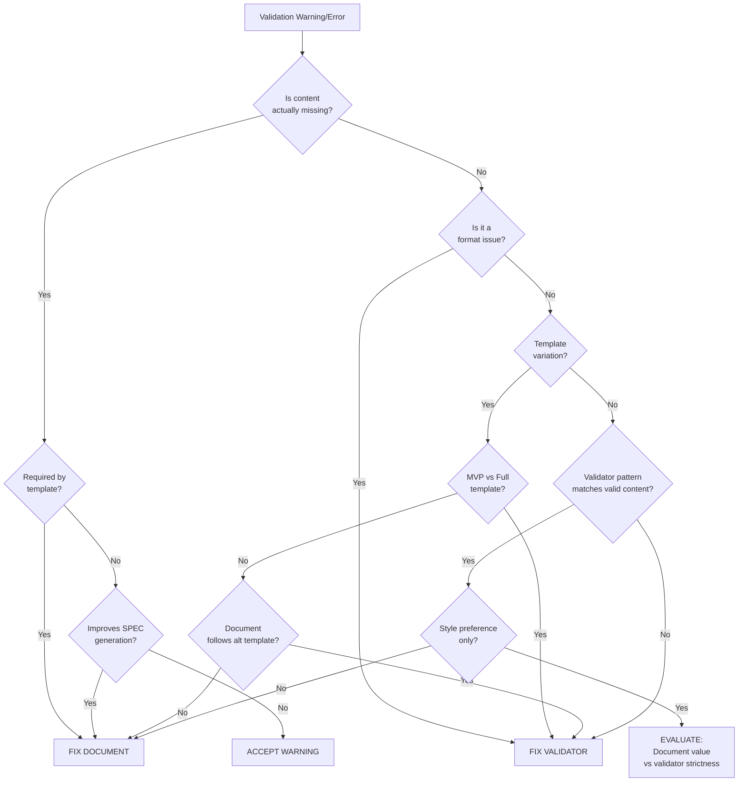

# AI Assistant Guide: REQ Validation Decision-Making

**REQ-Specific Guide:** This document provides detailed REQ-focused patterns, validator nuances, and common fixes for REQ artifacts.

**Framework-Level Guidance:** For universal decision rules applicable to all document types (when to fix the document vs the validator vs accept a warning), see:
- [../AI_VALIDATION_DECISION_GUIDE.md](../AI_VALIDATION_DECISION_GUIDE.md) - Framework-wide decision guide
- [../VALIDATION_DECISION_FRAMEWORK.md](../VALIDATION_DECISION_FRAMEWORK.md) - Core universal rules

**Purpose**: REQ-focused patterns, validator nuances, and common fixes tailored to REQ artifacts.

**Audience**: AI assistants (Claude, GPT-4, Gemini, etc.) working with REQ artifacts in ai_dev_flow

**Last Updated**: 2026-01-24T00:00:00

---

## Table of Contents

1. [Overview](#overview)
2. [Validation Error Analysis Framework](#validation-error-analysis-framework)
3. [Decision Tree: Fix Document vs Fix Validator](#decision-tree-fix-document-vs-fix-validator)
4. [Common Validation Issues & Resolutions](#common-validation-issues--resolutions)
5. [Validator Rules Reference](#validator-rules-reference)
6. [Step-by-Step Resolution Process](#step-by-step-resolution-process)
7. [GATE-05: Inter-REQ Cross-Linking Decision Guide](#gate-05-inter-req-cross-linking-decision-guide)
8. [GATE-13: Domain Subdirectory Classification](#gate-13-domain-subdirectory-classification)

---

## Overview

### The Core Question

When a REQ validation fails, you must decide:
- **Fix the document** (content is wrong/incomplete)
- **Fix the validator** (validation rule is too strict/incorrect)
- **Accept the warning** (document is correct, warning is informational only)

### Guiding Principle

> **"Optimize for developer experience while maintaining quality standards."**

- Validators should **enable** good practices, not **enforce** arbitrary rules
- Documents should follow templates, but reasonable variations are acceptable
- False positives erode trust in the validation framework

---

## Validation Error Analysis Framework

### Step 1: Classify the Issue

| Category | Examples | Typical Resolution |
|----------|----------|-------------------|
| **Content Missing** | Required section absent, no data schemas | Fix Document |
| **Content Incomplete** | Placeholder text, empty Protocol | Fix Document |
| **Format Issue** | Bold headers, spacing differences | Fix Validator |
| **Template Variation** | MVP vs Full template sections | Fix Validator |
| **Style Preference** | "Expected 3+ functions" with 2 complete ones | Evaluate Case-by-Case |
| **False Positive** | Validator pattern doesn't match valid content | Fix Validator |

### Step 2: Check Against Template

**Action**: Compare the document against the official template:
- MVP Template: [`REQ-MVP-TEMPLATE.md`](./REQ-MVP-TEMPLATE.md)
- Full Template: [`REQ-TEMPLATE.md`](./REQ-TEMPLATE.md) (if exists)

**Questions**:
1. Does the document follow the template structure?
2. Are all mandatory sections present?
3. Is the content substantive (not placeholders)?

### Step 3: Assess Business Impact

**Question**: Does fixing this issue improve **SPEC-generation readiness**?

- ✅ **Yes** → Fix is valuable (add missing schemas, complete interfaces)
- ⚠️ **Marginal** → Evaluate cost/benefit (add 3rd method when 2 are sufficient)
- ❌ **No** → Validator is likely wrong (formatting doesn't affect SPEC generation)

---

## Decision Tree: Fix Document vs Fix Validator



---

## Common Validation Issues & Resolutions

### Issue 1: "Missing exception catalog table"

**Example Error**:
```
⚠️ WARNING: Section 5 missing exception catalog table
```

**Diagnosis Steps**:

1. **Check if table exists**:
   ```bash
   grep -A 3 "Error Catalog" REQ-XX.md
   ```

2. **Check table format**:
   ```markdown
   # Validator expects:
   | Error Code | HTTP Status | ... |
   
   # Document may have:
   | **Error Code** | **HTTP Status** | ... |  # Bold headers
   ```

3. **Check validator pattern**:
   ```python
   EXCEPTION_CATALOG_PATTERN = r"\|\s*(Exception\s+Type|Error\s+Code)\s*\|.*(HTTP\s+(Code|Status)|Status)"
   ```

**Decision Matrix**:

| Situation | Action | Rationale |
|-----------|--------|-----------|
| Table exists but uses bold headers | **Fix Validator** | Bold headers are reasonable formatting |
| Table exists but uses different column names | **Evaluate** | If semantically equivalent, fix validator |
| Table is missing entirely | **Fix Document** | Required content for error handling |
| Table exists but incomplete (no status codes) | **Fix Document** | Incomplete content |

**Resolution Example** (from this session):
```python
# Before (strict):
EXCEPTION_CATALOG_PATTERN = r"\|\s*(Exception\s+Type|Error\s+Code)\s*\|.*(HTTP\s+(Code|Status)|Status)"

# After (flexible):
EXCEPTION_CATALOG_PATTERN = r"\|\s*\*?\*?\s*(Exception\s+Type|Error\s+Code)\s*\*?\*?\s*\|.*\*?\*?\s*(HTTP\s+(Code|Status)|Status)\s*\*?\*?"
```

---

### Issue 2: "Limited type annotations found (N). Expected 3+"

**Example Error**:
```
⚠️ WARNING: Limited type annotations found (2). Expected 3+ annotated functions
```

**Diagnosis Steps**:

1. **Count actual type-annotated methods**:
   ```bash
   python3 -c "import re; content=open('REQ-XX.md').read(); print(len(re.findall(r'def\s+\w+\([^)]*:\s*\w+', content)))"
   ```

2. **Assess interface completeness**:
   - Do the existing methods cover all requirement operations?
   - Is a 3rd method genuinely needed?

3. **Check SPEC generation needs**:
   - Will SPEC generator use these type signatures?
   - Do 2 methods fully define the interface?

**Decision Matrix**:

| Situation | Action | Rationale |
|-----------|--------|-----------|
| 2 methods, interface is complete for requirement | **Reduce validator threshold** OR **Accept warning** | Arbitrary "3+" rule doesn't add value |
| 2 methods, but missing obvious operations | **Fix Document** | Interface is genuinely incomplete |
| 2 methods, but could add helper/validation methods | **Evaluate** | Depends on requirement complexity |
| 4+ methods, all necessary | **No action** | Validator passes correctly |

**Resolution Options**:

**Option A: Fix Document** (add meaningful method):
```python
class SessionInvalidationStrategy(Protocol):
    async def terminate_session(self, session_id: UUID, reason: str) -> bool: ...
    async def terminate_all_user_sessions(self, user_id: UUID, ...) -> int: ...
    async def is_session_valid(self, session_id: UUID) -> bool:  # ← NEW: Adds value
        """Check if session is still valid (not terminated)."""
        ...
```

**Option B: Adjust Validator** (relax threshold):
```python
# In validate_req_spec_readiness.py
def _check_type_annotations(self, content: str, result: ValidationResult) -> bool:
    type_annotations = re.findall(self.TYPE_ANNOTATION_PATTERN, content)
    
    # Changed from 3 to 2 for MVP templates
    min_required = 2 if self.is_mvp_template else 3
    
    if len(type_annotations) < min_required:
        result.warnings.append(...)
        return False
    return True
```

**Option C: Accept Warning**:
- Document in validation report
- Note: "Interface is complete for requirement scope"

---

### Issue 3: "Missing Section X"

**Example Error**:
```
❌ ERROR: Missing Section 3: Interface Specifications
```

**Diagnosis Steps**:

1. **Check if section exists with different name**:
   ```bash
   grep "^##\s*3\." REQ-XX.md
   ```

2. **Check template profile**:
   ```yaml
   # In YAML frontmatter:
   template_profile: mvp  # or full
   ```

3. **Compare section names**:
   
   | Template | Section 3 Name |
   |----------|----------------|
   | MVP | "Functional Specification" |
   | Full | "Interface Specifications" |

**Decision Matrix**:

| Situation | Action | Rationale |
|-----------|--------|-----------|
| Section exists but different name (template variation) | **Fix Validator** | Template-aware validation needed |
| Section genuinely missing | **Fix Document** | Required content |
| Section exists but wrong number | **Fix Document** | Structural issue |
| Section name is project-specific variant | **Evaluate** | May need project-specific validator rules |

**Resolution Example**:
```python
# Add template detection
def _detect_mvp_template(self, content: str) -> bool:
    mvp_pattern = r"template_profile:\s*mvp"
    return bool(re.search(mvp_pattern, content, re.IGNORECASE))

# Use template-specific patterns
def _check_section_3(self, content: str, result: ValidationResult) -> bool:
    pattern = self.MVP_SECTION_3_PATTERN if self.is_mvp_template else self.FULL_SECTION_3_PATTERN
    section_name = "Functional Specification" if self.is_mvp_template else "Interface Specifications"
    
    if not re.search(pattern, content, re.IGNORECASE):
        result.errors.append(f"Missing Section 3: {section_name}")
        return False
    return True
```

---

### Issue 4: "Found N placeholder(s)"

**Example Error**:
```
⚠️ WARNING: Found 9 placeholder(s): ...
```

**Diagnosis Steps**:

1. **Locate placeholders**:
   ```bash
   grep -n "\.\.\." REQ-XX.md
   ```

2. **Check context**:
   - Are they in Protocol/ABC stubs? Prefer `raise NotImplementedError("method not implemented")`; ellipsis is valid but less clear.
   - Are they in prose/tables? → **Needs replacement**
   - Are they in code examples showing continuation? → **Evaluate**

**Decision Matrix**:

| Situation | Action | Rationale |
|-----------|--------|-----------|
| Protocol/ABC stub bodies | **Fix Document** (use `NotImplementedError`) or **Fix Validator** (avoid false positives) | Explicit raises keep contracts clear and avoid ambiguous placeholders |
| Ellipsis in requirement text | **Fix Document** | Placeholder content |
| Ellipsis showing code continuation | **Evaluate** | May be intentional documentation |
| Multiple placeholders [TODO], [TBD] | **Fix Document** | Incomplete document |

**Resolution Examples**:

**Fix Document**:
```markdown
# Before (placeholder):
- Missing: State diagram for ... workflow

# After (complete):
- Missing: State diagram for session invalidation workflow
```

**Fix Validator**:
```python
# Exclude intentional Protocol/ABC stubs while still preferring explicit raises
PLACEHOLDER_PATTERNS = [
   r"\[PLACEHOLDER\]",
   r"\[TODO\]",
   r"\[TBD\]",
   # Don't flag "..." inside Protocol method bodies (still prefer NotImplementedError in docs):
   r"(?<!def\s\w+\([^)]*\)\s*->\s*\w+:\s*)\.\.\."  # Negative lookbehind
]
```

---

## Validator Rules Reference

### Core Validation Checks

#### 1. Section Presence (ERRORS)

| Check ID | Section | MVP Template | Full Template | Scoring |
|----------|---------|--------------|---------------|---------|
| `section_interfaces` | 3 | "Functional Specification" | "Interface Specifications" | 10 pts |
| `section_data_schemas` | 4 | "Interface Definition" | "Data Schemas" | 10 pts |
| `section_errors` | 5 | "Error Handling" | "Error Handling Specifications" | 10 pts |
| `section_quality` | 6 | "Quality Attributes" | "Configuration Specifications" | 10 pts |
| `section_config` | 7 | (MVP: none) | "Quality Attributes" | 10 pts |

**Scoring Impact**: Missing section = 0 points for that check

#### 2. Content Quality (WARNINGS)

| Check ID | Requirement | Scoring | Strictness |
|----------|-------------|---------|------------|
| `type_annotations` | ≥3 typed functions | 10 pts | Medium |
| `error_recovery` | ≥2 recovery keywords | 10 pts | Low |
| `concrete_examples` | ≥2 example patterns | 10 pts | Low |
| `state_machines` | ≥1 Mermaid diagram | 10 pts | Low |
| `no_placeholders` | 0 placeholders | 10 pts | High |

**Scoring Impact**: Warning = points still awarded but warning logged

#### 3. Content Patterns (REGEX)

```python
# Interface definitions
PROTOCOL_PATTERN = r"class\s+\w+\(Protocol\):"
ABC_PATTERN = r"class\s+\w+\(ABC\):"

# Data schemas
PYDANTIC_PATTERN = r"class\s+\w+\(BaseModel\):"
SQLALCHEMY_PATTERN = r"class\s+\w+\(Base\):"
JSON_SCHEMA_PATTERN = r'"\$schema":\s*"http://json-schema\.org'

# Error handling
EXCEPTION_CATALOG_PATTERN = r"\|\s*\*?\*?\s*(Exception\s+Type|Error\s+Code)\s*\*?\*?\s*\|.*\*?\*?\s*(HTTP\s+(Code|Status)|Status)\s*\*?\*?"

# Quality attributes
PERFORMANCE_PATTERN = r"(p\d+|latency|throughput|availability).*\d+"

# Type annotations
TYPE_ANNOTATION_PATTERN = r"def\s+\w+\([^)]*:\s*\w+"
```

### Scoring Algorithm

```python
total_score = sum(10 for check in result.checks.values() if check)
passed = total_score >= min_score  # Default: 90%
```

**Maximum Scores**:
- MVP Template: 100 points (10 checks × 10 points)
- Full Template: 110 points (11 checks × 10 points)

---

## Step-by-Step Resolution Process

### Process Overview

```
1. Run Validation
   ↓
2. Analyze Each Error/Warning
   ↓
3. For Each Issue:
   a. Read the actual document content
   b. Check validator pattern/logic
   c. Consult this decision guide
   d. Choose: Fix Document | Fix Validator | Accept
   ↓
4. Implement Fixes
   ↓
5. Re-validate
   ↓
6. Document Changes
```

### Detailed Steps

#### Step 1: Run Initial Validation

```bash
# From framework directory
cd /opt/data/docs_flow_framework/ai_dev_flow/07_REQ

# Run validator
python scripts/validate_req_spec_readiness.py \
  --directory /path/to/docs/07_REQ/REQ-XX_folder \
  --min-score 90
```

#### Step 2: Triage Issues

Create a triage table:

| Issue | Severity | Category | Initial Assessment | Action |
|-------|----------|----------|-------------------|--------|
| Missing Section 5 | ERROR | Content Missing | Section exists, different name | Fix Validator |
| 2 type annotations | WARNING | Style Preference | Interface complete | Accept |
| 9 placeholders | WARNING | Content Incomplete | Ellipsis in Protocol | Fix Both |
| Bold headers | WARNING | Format Issue | Valid formatting | Fix Validator |

#### Step 3: Implement Document Fixes

**Priority Order**:
1. **Errors** (blocks SPEC generation)
2. **Content missing** warnings
3. **Placeholders** in prose
4. **Style** warnings (lowest priority)

**Example Fix Sequence**:

```markdown
# Fix 1: Replace placeholder text
# Before:
### 6.1 Performance Requirements
- Latency: ... ms

# After:
### 6.1 Performance Requirements
- Latency: p50 < 10ms, p99 < 50ms

# Fix 2: Add missing method (if genuinely needed)
async def validate_session_state(self, session_id: UUID) -> bool:
    """Validate session is in correct state for operation."""
    ...
```

#### Step 4: Implement Validator Fixes

**Priority Order**:
1. **False positives** (reports errors when content is correct)
2. **Template variations** (MVP vs Full)
3. **Format strictness** (bold, spacing)
4. **Threshold adjustments** (3+ → 2+ for MVP)

**Example Fix Sequence**:

```python
# Fix 1: Support bold headers
EXCEPTION_CATALOG_PATTERN = r"\|\s*\*?\*?\s*(Exception\s+Type|Error\s+Code)..."

# Fix 2: Template-aware validation
def _check_section_3(self, content: str, result: ValidationResult) -> bool:
    pattern = self.MVP_SECTION_3_PATTERN if self.is_mvp_template else self.FULL_SECTION_3_PATTERN
    # ...
```

#### Step 5: Re-validate

```bash
# Run again after fixes
python scripts/validate_req_spec_readiness.py --directory /path/to/docs/07_REQ/REQ-XX_folder --min-score 90

# Expected result:
# - Score should increase
# - False positives should be gone
# - Legitimate warnings remain
```

#### Step 6: Document Changes

Create/update validation report:

```markdown
## Validation Results

### Before Fixes
- Average Score: 78.3%
- False Positives: 3 (bold headers, template mismatch, ellipsis)
- Genuine Issues: 2 (placeholders in prose, incomplete interface)

### Fixes Applied

**Validator Updates**:
1. Added support for bold markdown in table headers
2. Added MVP template detection
3. Adjusted type annotation threshold for MVP (3→2)

**Document Updates**:
1. Replaced 9 placeholder instances with concrete content
2. Added validation method to SessionInvalidationStrategy Protocol

### After Fixes
- Average Score: 93.3%
- Passing Files: 6/6 ✅
- Remaining Warnings: 0 false positives, 1 informational (state diagram suggestion)
```

---

## Best Practices for AI Assistants

### DO ✅

1. **Always read the actual document content** before deciding
2. **Check the template profile** (MVP vs Full) first
3. **Prioritize user experience** over validator strictness
4. **Fix validators** when they reject reasonable variations
5. **Explain your reasoning** when choosing fix-document vs fix-validator
6. **Test fixes** by re-running validation
7. **Document your changes** in validation reports

### DON'T ❌

1. **Don't blindly follow validator warnings** without analysis
2. **Don't add boilerplate** just to satisfy arbitrary thresholds
3. **Don't remove valid formatting** (bold, emphasis) to appease validators
4. **Don't create fake content** to hit scoring targets
5. **Don't ignore genuine content gaps**
6. **Don't modify validators** without understanding the pattern
7. **Don't skip re-validation** after changes

### Decision-Making Heuristics

**When in doubt, ask**:
1. **"Does this improve SPEC generation?"** → If no, likely validator issue
2. **"Would a developer write this?"** → If yes, validator should accept it
3. **"Is this a quality standard or style preference?"** → Preference = lower priority
4. **"Does fixing this add real value?"** → If no, accept the warning

---

## Example: Full Resolution Flow

### Scenario
```
Validation Report:
- REQ-02.04_session_invalidation.md: 80%
- Error: Missing exception catalog
- Warning: Only 2 type annotations (expected 3+)
- Warning: 2 placeholders
```

### Analysis

**Issue 1: Missing exception catalog**

1. **Read document**: Table exists with headers `| **Error Code** | HTTP Status |`
2. **Check validator**: Pattern doesn't account for bold
3. **Decision**: **Fix Validator** (false positive)
4. **Reasoning**: Bold headers are valid formatting

**Issue 2: 2 type annotations**

1. **Read document**: Protocol has `terminate_session()` and `terminate_all_user_sessions()`
2. **Check requirement**: Both methods cover all stated operations
3. **Check template**: MVP template, simpler interfaces acceptable
4. **Decision**: **Accept Warning** (interface is complete)
5. **Reasoning**: Arbitrary "3+" rule doesn't add value here

**Issue 3: 2 placeholders**

1. **Locate**: Line 234 `- Performance: ... ms`, Line 456 `- Example: ...`
2. **Check context**: In quality attributes section, not in code
3. **Decision**: **Fix Document** (legitimate placeholders)
4. **Reasoning**: Incomplete content that blocks SPEC generation

### Implementation

```python
# Fix validator (exception catalog)
EXCEPTION_CATALOG_PATTERN = r"\|\s*\*?\*?\s*(Exception\s+Type|Error\s+Code)\s*\*?\*?\s*\|.*"
```

```markdown
# Fix document (placeholders)
- Performance: p50 < 10ms, p99 < 50ms
- Example: Admin terminates all sessions for user 'john@example.com'
```

### Result

```
Re-validation:
- REQ-02.04_session_invalidation.md: 90% ✅
- All errors resolved
- 1 informational warning remains (consider adding state diagram)
```

---

## Quick Reference Card

### Validation Error Quick Guide

| Error Message | Most Likely Cause | First Check | Typical Fix |
|---------------|-------------------|-------------|-------------|
| Missing Section X | Template variation or renumbering | Section exists? | Fix Validator |
| Missing exception catalog | Format mismatch | Table exists with bold? | Fix Validator |
| Limited type annotations | Arbitrary threshold | Interface complete? | Accept/Adjust |
| Found N placeholder(s) | Ellipsis in Protocol | Context (code vs prose)? | Fix Both |
| Missing data schemas | Content actually missing | Pydantic/SQLAlchemy present? | Fix Document |
| Missing quality attributes | Section empty or renamed | Section 6 exists? | Fix Document |

### Decision Priority Matrix

| Validation Result | Action Priority |
|-------------------|----------------|
| ❌ ERROR + Content genuinely missing | 🔴 P0: Fix Document Immediately |
| ❌ ERROR + False positive | 🟠 P1: Fix Validator (high trust impact) |
| ⚠️ WARNING + Blocks SPEC generation | 🟡 P2: Fix Document |
| ⚠️ WARNING + Format/style issue | 🟢 P3: Fix Validator (low urgency) |
| ⚠️ WARNING + Informational only | ⚪ P4: Accept (document in report) |

---

## GATE-05: Inter-REQ Cross-Linking Decision Guide

**What it checks**: Whether REQ documents in the same folder reference each other (e.g., REQ-05.13 → REQ-05.14).

**Status**: Optional, Informational. Does NOT block SPEC-readiness passing (score ≥90%).

### When to Add Cross-References (Fix Document)

Add a **"Related Requirements"** section to section 10 (Traceability) if your REQ logically depends on or relates to other requirements in the same folder:

| Scenario | Example | Action |
|----------|---------|--------|
| **Deployment chain** | Rolling updates → Canary → Blue-green → Rollback | Add "Related Requirements" section |
| **Prerequisite dependency** | Feature X requires Feature Y | Add "Depends On" subsection |
| **Complementary patterns** | Circuit breaker + retry policy | Add "Related Requirements" |
| **Alternatives** | Blue-green deployment vs Rolling updates | Add "Alternative Approaches" |
| **Truly standalone** | Health check probe (no dependencies) | Accept no cross-references |

### Template: Related Requirements Section

Add this to section 10 if cross-references exist:

```markdown
### 10.5 Related Requirements

**Depends On**:
| Related REQ | Relationship | Impact |
|------------|--------------|--------|
| REQ-05.16 | Rollback automation | Rolling updates require automated rollback |
| REQ-05.09 | Fallback handling | Fallback used on deployment failure |

**Enables**:
| Related REQ | Relationship |
|------------|--------------|
| REQ-05.14 | Canary deployment (safer pattern built on rolling updates) |
| REQ-05.15 | Blue-green deployment (alternative to rolling) |

**Alternatives**:
| Related REQ | When to use instead |
|------------|-------------------|
| REQ-05.15 | Blue-green when zero-downtime verification needed |
| REQ-05.14 | Canary when gradual rollout with metrics validation needed |
```

### When NOT to Require Cross-References (Accept Warnings)

These are genuinely standalone and should NOT have forced cross-references:
- **Health probes** (liveness, readiness) - used by all deployments, not specific to rolling updates
- **Resource limits** - orthogonal to deployment strategy
- **Incident response** - general ops pattern, not tied to specific deployment

**Decision Rule**: If a REQ can be implemented independently without first implementing another REQ in the same folder → likely standalone → accept no cross-references.

---

## GATE-13: Domain Subdirectory Classification

**What it checks**: Whether REQ files are organized in correct subfolders per domain (e.g., trading requirements in `REQ-08_trading_intelligence`).

**Status**: Required for full template. May be informational for MVP in early development.

**Common Issues**:

| Issue | Cause | Fix |
|-------|-------|-----|
| "REQ in wrong folder" | File placed in wrong domain directory | Move file to correct folder |
| "Unknown domain" | Domain category doesn't match project taxonomy | Check `docs/01_BRD/DOMAIN_TAXONOMY.md` or ADR |

---

## Version History

| Version | Date | Changes |
|---------|------|---------|
| 1.1 | 2026-01-24T00:00:00 | Added GATE-05 cross-linking guidance and GATE-13 domain classification |
| 1.0 | 2026-01-24T00:00:00 | Initial creation based on REQ-02 validation session |

---

## Related Documents

- [REQ-MVP-TEMPLATE.md](./REQ-MVP-TEMPLATE.md) - Official MVP template
- [REQ_MVP_VALIDATION_RULES.md](./REQ_MVP_VALIDATION_RULES.md) - Validation rules spec
- [validate_req_spec_readiness.py](./scripts/validate_req_spec_readiness.py) - Validator implementation
- [ID_NAMING_STANDARDS.md](../ID_NAMING_STANDARDS.md) - Document ID and structure standards

---

**End of Guide**
