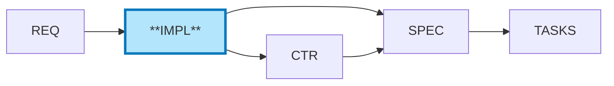

# =============================================================================
# 📋 Document Authority: This is the PRIMARY STANDARD for IMPL structure.
# All other documents (Schema, Creation Rules, Validation Rules) DERIVE from this template.
# - In case of conflict, this template is the single source of truth
# - Schema: IMPL_SCHEMA.yaml - Machine-readable validation (derivative)
# - Creation Rules: IMPL_CREATION_RULES.md - AI guidance for document creation (derivative)
# - Validation Rules: IMPL_VALIDATION_RULES.md - AI checklist after document creation (derivative)
#   NOTE: VALIDATION_RULES includes all CREATION_RULES and may be extended for validation
# =============================================================================
---
title: "IMPL-TEMPLATE: Implementation Approach Document"
tags:
  - impl-template
  - layer-8-artifact
  - shared-architecture
  - document-template
custom_fields:
  document_type: template
  artifact_type: IMPL
  layer: 8
  architecture_approaches: [ai-agent-based, traditional-8layer]
  priority: shared
  development_status: active
  template_for: implementation-approach-document
  schema_reference: "IMPL_SCHEMA.yaml"
  schema_version: "1.0"
---

> **📋 Document Authority**: This is the **PRIMARY STANDARD** for IMPL structure.
> - **Schema**: `IMPL_SCHEMA.yaml v1.0` - Validation rules
> - **Creation Rules**: `IMPL_CREATION_RULES.md` - Usage guidance
> - **Validation Rules**: `IMPL_VALIDATION_RULES.md` - Post-creation checks

# IMPL-NN: [Implementation Plan Title]

**⚠️ CRITICAL**: Always reference [SPEC_DRIVEN_DEVELOPMENT_GUIDE.md](../SPEC_DRIVEN_DEVELOPMENT_GUIDE.md) as the single source of truth for workflow steps, artifact definitions, and quality gates.

**resource**: IMPL is in Layer 8 (Project Management Layer) - organizes WHO does WHAT, WHEN.

## 1. Document Control

| Field | Value |
|-------|-------|
| **IMPL ID** | IMPL-NN |
| **Title** | [Feature or System Name] Implementation Plan |
| **Status** | Draft \| Planned \| In Progress \| On Hold \| Completed \| Cancelled |
| **Created** | YYYY-MM-DD |
| **Author** | [Your Name / Team] |
| **Owner** | [Team or Person Responsible] |
| **Last Updated** | YYYY-MM-DD |
| **Version** | 1.0 |
| **Related REQs** | [REQ-NN](<!-- VALIDATOR:IGNORE-LINKS-START -->../07_REQ/.../REQ-NN.md<!-- VALIDATOR:IGNORE-LINKS-END -->), [REQ-MM](<!-- VALIDATOR:IGNORE-LINKS-START -->../07_REQ/.../REQ-MM.md<!-- VALIDATOR:IGNORE-LINKS-END -->) |
| **Deliverables** | CTR-NN, SPEC-NN, TASKS-NN, CTR-YY, SPEC-YY, TASKS-YY |

## 2. Position in Document Workflow

**IMPL (Implementation Plans)** ← YOU ARE HERE

For the complete traceability workflow with visual diagram, see: [index.md - Traceability Flow](../index.md#traceability-flow)

**Quick Reference**:


> **Note on Diagram Labels**: The above flowchart shows the sequential workflow. For formal layer numbers used in cumulative tagging, always reference the 15-layer architecture (Layers 0-14) defined in README.md. Diagram groupings are for visual clarity only.

**IMPL Purpose**: Define WHO does WHAT by WHEN (Project Management Layer)
- **Input**: REQ (atomic requirements)
- **Output**: Project plan with phases, teams, deliverables, timelines
- **Consumer**: CTR and SPEC reference IMPL for coordination and phasing

**⚠️ CRITICAL SCOPE DISTINCTION**:
- **IMPL focuses on**: WHO (teams), WHAT (deliverables), WHEN (timeline), WHY (business objectives)
- **IMPL does NOT contain**: HOW (technical implementation) - that goes in SPEC
- **IMPL does NOT contain**: Test details - that goes in 04_BDD/TASKS
- **IMPL is project management**, not technical design

---

> **⚠️ UPSTREAM ARTIFACT REQUIREMENT**: Before completing traceability tags:
> 1. **Check existing artifacts**: List what upstream documents actually exist in `docs/`
> 2. **Reference only existing documents**: Use actual document IDs, not placeholders
> 3. **Use `null` appropriately**: Only when upstream artifact type genuinely doesn't exist for this feature
> 4. **Do NOT create phantom references**: Never reference documents that don't exist
> 5. **Do NOT create missing upstream artifacts**: If upstream artifacts are missing, skip that functionality. Only create functionality for existing upstream artifacts.


## 3. Project Context and Strategy (PART 1)

### 3.1 Overview

**What System/Feature Is Being Implemented**:
[Brief description of the system or feature being built, 2-3 sentences]

**Purpose**:
[Why this implementation is needed, what business value it delivers]

**Scope Summary**:
[High-level summary of what's included in this implementation]

### 3.2 Business Objectives

**Requirements Satisfied**:

| Requirement ID | Description | Implementation Approach |
|----------------|-------------|------------------------|
| [REQ-NN](<!-- VALIDATOR:IGNORE-LINKS-START -->../07_REQ/.../REQ-NN.md<!-- VALIDATOR:IGNORE-LINKS-END -->) | [What business need] | [High-level approach in this IMPL] |
| [REQ-MM](<!-- VALIDATOR:IGNORE-LINKS-START -->../07_REQ/.../REQ-MM.md<!-- VALIDATOR:IGNORE-LINKS-END -->) | [Another requirement] | [How we'll address it] |

**Source Business Logic**:
[References to product strategy documents or business rules driving this implementation]

**Success Criteria**:
[How will we know this implementation is successful? Measurable outcomes]

### 3.3 Scope

**In Scope**:
- [Component or feature 1]
- [Component or feature 2]
- [Component or feature 3]

**Out of Scope**:
- [What is NOT included in this implementation]
- [Features deferred to future work]
- [Explicit exclusions to manage expectations]

**Assumptions**:
- [Assumption 1 about resources, dependencies, or environment]
- [Assumption 2]

**Constraints**:
- **Technical**: [Technology limitations, platform constraints]
- **Resource**: [Team availability, budget, tools]
- **Timeline**: [Deadlines, release schedules]
- **Business**: [Regulatory requirements, business rules]

### 3.4 Dependencies

**Upstream Dependencies** (Must be complete before starting):

| Dependency | Type | Status | Impact if Delayed |
|------------|------|--------|-------------------|
| [REQ-NN](<!-- VALIDATOR:IGNORE-LINKS-START -->../07_REQ/.../REQ-NN.md<!-- VALIDATOR:IGNORE-LINKS-END -->) | Requirement | Approved | Cannot start Phase 1 |
<!-- VALIDATOR:IGNORE-LINKS-START -->
| [ADR-MM](../05_ADR/ADR-MM.md) | Architecture Decision | Draft | Risk: Design changes |
<!-- VALIDATOR:IGNORE-LINKS-END -->

**External Dependencies** (Outside this IMPL):
- [Other systems, services, or teams we depend on]
- [Third-party APIs or services]
- [Infrastructure or platform requirements]

---

## 4. Phased Implementation (PART 2)

> **Element ID Format**: Replace `NN` with your document number (e.g., `IMPL.01.29.01` for IMPL-01).
> Element type code `29` = Implementation Phase per ID_NAMING_STANDARDS.md.

### IMPL.NN.29.01: Phase 1 - [Phase Name]

| Attribute | Details |
|-----------|---------|
| **Purpose** | [What this phase accomplishes] |
| **Owner** | [Team/Person] |
| **Timeline** | [Start Date] → [End Date] ([Duration]) |
| **Deliverables** | CTR-NN, SPEC-NN, TASKS-NN |
| **Dependencies** | Requires: [Prerequisites] \| Blocks: [Downstream phases] |

**Success Criteria**: [ ] Deliverables created [ ] [Key milestone] [ ] Stakeholder approval

**Key Risks**: [Risk 1: Mitigation] \| [Risk 2: Mitigation]

---

### IMPL.NN.29.02: Phase 2 - [Phase Name]

| Attribute | Details |
|-----------|---------|
| **Purpose** | [What this phase accomplishes] |
| **Owner** | [Team/Person] |
| **Timeline** | [Start Date] → [End Date] ([Duration]) |
| **Deliverables** | CTR-YY, SPEC-YY, TASKS-YY |
| **Dependencies** | Requires: Phase 1 complete \| Blocks: Phase 3 start |

**Success Criteria**: [ ] Deliverables created [ ] [Key milestone]

**Key Risks**: [Risk: Mitigation]

---

### IMPL.NN.29.NN: Phase N - [Final Phase]

| Attribute | Details |
|-----------|---------|
| **Purpose** | [Integration, deployment, or final steps] |
| **Owner** | [Team/Person] |
| **Timeline** | [Start Date] → [End Date] ([Duration]) |
| **Deliverables** | Integration validation, Documentation, Deployment artifacts |
| **Dependencies** | Requires: All previous phases complete |

**Success Criteria**: [ ] Components integrated [ ] System validated [ ] Production ready

---

## 5. Project Management and Risk (PART 3)

### 5.1 Resources, Timeline, and Dependencies

**Resource Allocation**:

| Team/Person | Role | Phases | Estimated Effort |
|-------------|------|--------|------------------|
| [Team A] | [Agent Development] | Phase 1, 2 | [X person-weeks] |
| [Team B] | [MCP Server Development] | Phase 1 | [Y person-weeks] |
| [Person C] | [Infrastructure] | Phase 3 | [Z person-days] |

**Overall Timeline**: [Start: YYYY-MM-DD] → [End: YYYY-MM-DD] ([Total Duration])

**Key Milestones**:

| Milestone | Date | Status |
|-----------|------|--------|
| Phase 1 Complete (CTR-NN, SPEC-NN, TASKS-NN) | [YYYY-MM-DD] | Pending |
| Phase 2 Complete (CTR-YY, SPEC-YY, TASKS-YY) | [YYYY-MM-DD] | Pending |
| Production Ready | [YYYY-MM-DD] | Pending |

**Critical Path**: [Phases that cannot be delayed]

**Current Blockers**: [Blocker: Impact and resolution] \| [Blocker: Impact and resolution]

### 5.2 Risk Register

**Project Management Risks** (Technical risks go in 05_ADR/SPEC):

| Risk ID | Risk Description | Probability | Impact | Mitigation Strategy | Owner | Status |
|---------|------------------|-------------|--------|---------------------|-------|--------|
| R-001 | [Resource unavailability] | Medium | High | [Cross-train team members, buffer capacity] | [PM] | Open |
| R-002 | [Timeline underestimation] | Medium | High | [Add buffer to critical path, weekly tracking] | [PM] | Open |
| R-003 | [Scope creep] | Medium | Medium | [Change control process, stakeholder alignment] | [PM] | Open |
| R-004 | [Dependency delays] | Low | High | [Early coordination, alternative paths] | [PM] | Open |
| R-005 | [Integration testing blocked by environment] | Low | High | [Parallel environment setup, early access] | [Tech Lead] | Open |
| R-006 | [Technical debt accumulation] | Medium | Medium | [Code review gates, refactoring sprints] | [Tech Lead] | Open |

**Focus Areas**: Resource allocation, timeline management, scope control, dependency coordination

#### Contingency Plans

| Trigger Condition | Contingency Action | Decision Authority |
|-------------------|--------------------|--------------------|
| Phase delayed >5 days | Scope reduction review | Project Owner |
| Resource unavailable >3 days | Backup resource activation | Team Lead |
| Critical dependency blocked | Escalation to stakeholders | Project Owner |
| Quality gate failure | Remediation sprint planning | Tech Lead |

### 5.3 Communication Plan

| Stakeholder | Role | Updates Frequency | Method |
|-------------|------|-------------------|--------|
| [Product Owner] | Decision maker | Weekly | Status meeting |
| [Technical Lead] | Technical decisions | Daily | Stand-up |
| [Development Team] | Implementers | Daily | Stand-up |

**Decision Authority**:
- **Scope Changes**: [Product Owner approval required]
- **Timeline Changes**: [PM + Product Owner approval]
- **Resource Changes**: [PM approval, escalate if capacity issue]

#### Escalation Matrix

| Issue Type | Level 1 (Within 1 day) | Level 2 (Within 3 days) | Level 3 (Critical) |
|------------|------------------------|-------------------------|---------------------|
| Technical blocker | Tech Lead | PM + Architect | Project Sponsor |
| Resource conflict | PM | Department Head | Project Sponsor |
| Scope dispute | Product Owner | PM + PO | Steering Committee |
| External dependency | PM | Vendor contact | Executive Sponsor |

**Decision Timeline Expectations**:
- Level 1 decisions: Same business day
- Level 2 decisions: Within 2 business days
- Level 3 decisions: Emergency meeting within 24 hours

---

## 6. Tracking and Completion (PART 4)

### 6.1 Deliverables Checklist

**Phase 1 Deliverables**:
- [ ] CTR-NN: [API Contract Title] created
- [ ] SPEC-NN: [Technical Spec Title] created
- [ ] TASKS-NN: [Code Generation Plan] created
- [ ] [Additional deliverable if any]

**Phase 2 Deliverables**:
- [ ] CTR-YY: [API Contract Title] created
- [ ] SPEC-YY: [Technical Spec Title] created
- [ ] TASKS-YY: [Code Generation Plan] created

**Phase N Deliverables**:
- [ ] Integration tests complete
- [ ] Documentation complete
- [ ] Deployment artifacts created

**Overall Deliverables**:
- [ ] All CTR documents created: [List CTR-IDs]
- [ ] All SPEC documents created: [List SPEC-IDs]
- [ ] All TASKS documents created: [List TASKS-IDs]
- [ ] All code generated from TASKS
- [ ] All tests passing
- [ ] System deployed and validated

### 6.2 Project Validation

**Project Management Validation** (Technical validation in 10_SPEC/04_BDD/TASKS):
- [ ] All phases completed on schedule (or variance documented with approval)
- [ ] All deliverable documents created (09_CTR/10_SPEC/TASKS listed in section 6.1)
- [ ] All project risks mitigated or accepted by stakeholders
- [ ] All dependencies resolved or escalated
- [ ] Resource allocation tracked against estimates (variance documented)
- [ ] Stakeholder sign-off received for each phase
- [ ] Budget tracking complete (if applicable)

**Business Validation**:
- [ ] Requirements satisfied (REQ-NN validation complete)
- [ ] Success criteria met (from section 3.2)
- [ ] Final stakeholder approval received
- [ ] Handoff to operations complete (if applicable)

**Operational Acceptance**:
- [ ] Deployment handoff documented
- [ ] Monitoring requirements identified
- [ ] Support team briefed (if applicable)
- [ ] Knowledge transfer completed

**Validation Methods**:

| Validation Type | Method | Evidence Location |
|-----------------|--------|-------------------|
| Deliverable completeness | Checklist review | Section 6.1 |
| Quality standards | Validation scripts | tmp/validation_reports/ |
| Stakeholder approval | Sign-off | Section 6.5 |

### 6.3 Project Completion Criteria

**Project Complete When**:
1. **All Deliverables Created**: 09_CTR/10_SPEC/TASKS documents listed in section 6.1
2. **All Phases Complete**: Each phase meets its success criteria (section 4.x)
3. **Stakeholder Sign-off**: Product Owner + Technical Lead approval (section 6.5)
4. **Handoff Complete**: Operations team ready to support (if applicable)

### 6.4 Lessons Learned (Post-Implementation)

| Category | Observation | Recommendation |
|----------|-------------|----------------|
| Timeline | [What went well/poorly] | [How to improve estimates] |
| Resources | [Team performance insights] | [Staffing recommendations] |
| Process | [Workflow effectiveness] | [Process improvements] |
| Risks | [How risks materialized] | [Better mitigation strategies] |

### 6.5 Sign-off

**Completion Date**: [YYYY-MM-DD or TBD]

| Role | Name | Status | Date |
|------|------|--------|------|
| Project Manager | [Name] | [Approved/Pending] | [Date] |
| Product Owner | [Name] | [Approved/Pending] | [Date] |
| Technical Lead | [Name] | [Approved/Pending] | [Date] |

**Follow-up Items**: [Known issues, handoff tasks, future enhancements]

---

## 7. Traceability

### 7.1 Upstream Sources

#### Business Context

| Source Type | Document ID | Document Title | Relevant sections | Relationship |
|-------------|-------------|----------------|-------------------|--------------|
| BRD | [BRD-NN](<!-- VALIDATOR:IGNORE-LINKS-START -->../01_BRD/BRD-NN.md<!-- VALIDATOR:IGNORE-LINKS-END -->) | [Business Requirements] | section X | defines_scope |
| PRD | [PRD-NN](<!-- VALIDATOR:IGNORE-LINKS-START -->../02_PRD/PRD-NN.md<!-- VALIDATOR:IGNORE-LINKS-END -->) | [Product Requirements] | section Y | defines_features |

#### Engineering Context

| Source Type | Document ID | Document Title | Relevant sections | Relationship |
|-------------|-------------|----------------|-------------------|--------------|
| SYS | [SYS-NN](<!-- VALIDATOR:IGNORE-LINKS-START -->../06_SYS/SYS-NN.md<!-- VALIDATOR:IGNORE-LINKS-END -->) | [System Requirements] | section A | system_constraints |
| REQ | [REQ-NN](<!-- VALIDATOR:IGNORE-LINKS-START -->../07_REQ/.../REQ-NN.md<!-- VALIDATOR:IGNORE-LINKS-END -->) | [Atomic Requirements] | section B | requirement_source |
| REQ | [REQ-MM](<!-- VALIDATOR:IGNORE-LINKS-START -->../07_REQ/.../REQ-MM.md<!-- VALIDATOR:IGNORE-LINKS-END -->) | [Another Requirement] | section C | functional_requirement |

#### Architecture Context

| Source Type | Document ID | Document Title | Relevant sections | Relationship |
|-------------|-------------|----------------|-------------------|--------------|
| ADR | [ADR-NN](../05_ADR/ADR-NN.md) | [Architecture Decision] | All | architecture_decision |
| EARS | [EARS-NN](<!-- VALIDATOR:IGNORE-LINKS-START -->../03_EARS/EARS-NN.md<!-- VALIDATOR:IGNORE-LINKS-END -->) | [EARS Requirements] | section Z | formal_requirements |

### 7.2 Downstream Artifacts (Deliverables)

| Artifact Type | Document ID | Document Title | Status | Relationship |
|---------------|-------------|----------------|--------|--------------|
| CTR | [CTR-NN](<!-- VALIDATOR:IGNORE-LINKS-START -->../09_CTR/CTR-NN.md<!-- VALIDATOR:IGNORE-LINKS-END -->) | [API Contract] | Pending | Interface definition |
| SPEC | [SPEC-NN](<!-- VALIDATOR:IGNORE-LINKS-START -->../10_SPEC/.../SPEC-NN.yaml<!-- VALIDATOR:IGNORE-LINKS-END -->) | [Technical Spec] | Pending | Implementation blueprint |
| TASKS | [TASKS-NN](<!-- VALIDATOR:IGNORE-LINKS-START -->../11_TASKS/TASKS-NN.md<!-- VALIDATOR:IGNORE-LINKS-END -->) | [Code Generation Plan] | Pending | Code generation guide |
| CTR | [CTR-YY](<!-- VALIDATOR:IGNORE-LINKS-START -->../09_CTR/CTR-YY.md<!-- VALIDATOR:IGNORE-LINKS-END -->) | [API Contract] | Pending | Interface definition |
<!-- VALIDATOR:IGNORE-LINKS-START -->
| SPEC | [SPEC-YY](../10_SPEC/.../SPEC-YY.yaml) | [Technical Spec] | Pending | Implementation blueprint |
<!-- VALIDATOR:IGNORE-LINKS-END -->
<!-- VALIDATOR:IGNORE-LINKS-START -->
| TASKS | [TASKS-YY](../11_TASKS/TASKS-YY.md) | [Code Generation Plan] | Pending | Code generation guide |
<!-- VALIDATOR:IGNORE-LINKS-END -->

#### Deliverable Success Criteria

| Artifact Type | Quality Gate | Evidence Required |
|---------------|--------------|-------------------|
| CTR | Schema validation passes | CTR validation report |
| SPEC | Technical review approved | Review sign-off |
| TASKS | All acceptance criteria defined | TASKS validation report |

#### Phase-Gate Quality Checks

Before marking a phase complete, verify:
- [ ] All listed deliverables created
- [ ] Deliverables pass validation rules
- [ ] Cross-document references valid
- [ ] Stakeholder review completed

### 7.3 Same-Type References (Conditional)

**Include this section only if same-type relationships exist between IMPL documents.**

| Relationship | Document ID | Document Title | Purpose |
|--------------|-------------|----------------|---------|
<!-- VALIDATOR:IGNORE-LINKS-START -->
| Related | [IMPL-NN](./IMPL-NN_...md) | [Related IMPL title] | Shared implementation context |
<!-- VALIDATOR:IGNORE-LINKS-END -->
<!-- VALIDATOR:IGNORE-LINKS-START -->
| Depends | [IMPL-NN](./IMPL-NN_...md) | [Prerequisite IMPL title] | Must complete before this |
<!-- VALIDATOR:IGNORE-LINKS-END -->

**Legacy Format** (for backward compatibility):
- **Depends On**: [IMPL-NN previous implementation plans this depends on]
- **Related**: [IMPL-YY complementary implementation plans]
- **Supersedes**: [IMPL-ZZZ older plans replaced by this one]

**Tags:**
```markdown
@related-impl: IMPL-NN
@depends-impl: IMPL-NN
```

### 7.4 Traceability Tags

**Required Tags** (Cumulative Tagging Hierarchy - Layer 8):
```markdown
@brd: BRD.NN.EE.SS
@prd: PRD.NN.EE.SS
@ears: EARS.NN.EE.SS
@bdd: BDD.NN.EE.SS
@adr: ADR-NN
@sys: SYS.NN.EE.SS
@req: REQ.NN.EE.SS
```

**Format**: `@artifact-type: TYPE.NN.TT.SS (Unified Feature ID)`

**Layer 8 Requirements**: IMPL must reference ALL upstream artifacts:
- `@brd`: Business Requirements Document(s)
- `@prd`: Product Requirements Document(s)
- `@ears`: EARS Requirements
- `@bdd`: BDD Scenarios
- `@adr`: Architecture Decision Records
- `@sys`: System Requirements
- `@req`: Atomic Requirements

**Downstream Tags** (Deliverables Produced):
```markdown
@ctr: CTR.NN.EE.SS
@spec: SPEC.NN.EE.SS
@tasks: TASKS.NN.EE.SS
```

- `@ctr`: Contract documents produced by this implementation
- `@spec`: Technical specifications produced by this implementation
- `@tasks`: Task breakdown documents produced by this implementation

> **Note**: Implementation contracts are embedded in TASKS Section 7-8.

**Tag Placement**: Include tags in this section or at the top of the document (after Document Control).

**Example**:
```markdown
# Upstream (Layer 8 inherits all upstream tags)
@brd: BRD.01.01.30
@prd: PRD.03.01.02
@ears: EARS.01.24.03
@bdd: BDD.03.13.01
@adr: ADR-033
@sys: SYS.08.25.01
@req: REQ.03.26.01

# Downstream (Deliverables produced by this IMPL)
@ctr: CTR.03.21.01
@spec: SPEC.03.22.01
@tasks: TASKS.03.23.01
```

**Validation**: Tags must reference existing documents and requirement IDs. Complete chain validation ensures all upstream artifacts (BRD through REQ) are properly linked.

**Purpose**: Cumulative tagging enables complete traceability chains from business requirements through implementation planning. See [TRACEABILITY.md](../TRACEABILITY.md#cumulative-tagging-hierarchy) for complete hierarchy documentation.

---

## 8. References

**Internal**: [REQ-NN](<!-- VALIDATOR:IGNORE-LINKS-START -->../07_REQ/.../REQ-NN.md<!-- VALIDATOR:IGNORE-LINKS-END -->) \| [ADR-PPP](../05_ADR/ADR-PPP.md) \| [IMPL-00 Index](./IMPL-00_index.md)

**Templates**: [CTR-MVP-TEMPLATE](../09_CTR/CTR-MVP-TEMPLATE.md) \| [SPEC-MVP-TEMPLATE](../10_SPEC/SPEC-MVP-TEMPLATE.yaml) \| [TASKS-TEMPLATE](../11_TASKS/TASKS-TEMPLATE.md)

**Guidelines**: [IMPL README](./README.md) \| [SPEC README](../10_SPEC/README.md)

---

## 9. Template Instructions

**Usage**: `cp IMPL-TEMPLATE.md IMPL-042_my_feature.md`

**Fill Out in Order**:
1. Document Control table → Part 1 (Context) → Part 2 (Phases) → Part 3 (Resources/Risks) → Part 4 (Tracking)
2. Each phase lists deliverables (09_CTR/10_SPEC/TASKS), teams, timelines, dependencies
3. Update index: Add entry to IMPL-00_index.md
4. Track progress: Update status as phases complete

**⚠️ SCOPE BOUNDARIES**:
- **IMPL Contains**: WHO (teams), WHEN (timeline), WHY (objectives), WHAT (deliverables)
- **IMPL Excludes**: HOW (→ SPEC), Code (→ TASKS), Tests (→ 04_BDD/TASKS)

---

**Template Version**: 1.0
**Last Reviewed**: 2025-11-02
**Next Review**: 2026-02-02 (quarterly)