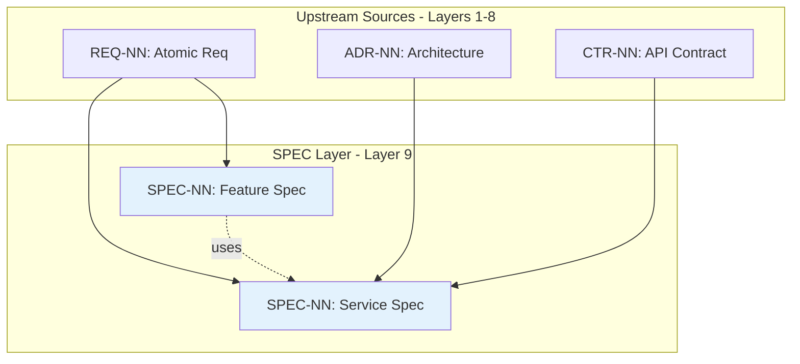

# Traceability Matrix: SPEC-NN (project-agnostic example IDs)

## Document Control

| Item | Details |
|------|---------|
| Document ID | TRACEABILITY_MATRIX_SPEC |
| Title | Comprehensive Technical Specifications Traceability Matrix |
| Status | [Active/Draft] |
| Version | 1.0.0 |
| Date Created | YYYY-MM-DD |
| Author | [Team Name] |
| Purpose | Track upstream traceability for all Technical Specification Documents (YAML format) |


---

Note: Some examples in this document show a portable `docs/` root. In this repository, artifact folders live at the ai_dev_flow root without the `docs/` prefix; see README → “Using This Repo” for path mapping.

**⚠️ TAG-BASED AUTO-GENERATION AVAILABLE**

This traceability matrix can be automatically generated by scanning code files for @spec: and @test: tags.

**Recommended Approach:** Use tag-based auto-discovery instead of manual maintenance.

**Generate automatically using:**
```bash
# NOTE: In this ai_dev_flow repo, drop any `docs/` prefix shown in generic examples.
# Extract tags from all files
python scripts/extract_tags.py --source src/ docs/ tests/ --output docs/generated/tags.json

# Validate tags against documents
python scripts/validate_tags_against_docs.py --tags docs/generated/tags.json --strict

# Generate SPEC traceability matrix
python scripts/generate_traceability_matrix.py --type SPEC --output docs/09_SPEC/SPEC-00_TRACEABILITY_MATRIX.md
```

**Benefits:**
- ✅ Single source of truth: Tags embedded in code
- ✅ Always up-to-date: Generated from current codebase
- ✅ No manual sync: Automated validation prevents drift
- ✅ Coverage metrics: Automatically calculated

**Tag Format:** `@spec: SPEC.NN.27.NN` (for specific requirements) or `@spec: SPEC-NN` (for single-doc refs)

See: [TRACEABILITY.md](../TRACEABILITY.md#tag-based-auto-discovery-alternative) for complete tag-based workflow.

---

## 1. Overview

### 1.1 Document Type Description
Technical Specification Documents (SPEC) define HOW to implement requirements using YAML format. SPEC documents provide AI-optimized implementation blueprints including interfaces, algorithms, patterns, performance targets, and observability.

### 1.2 Coverage Scope
This matrix tracks all SPEC documents and their upstream sources (BRD, PRD, EARS, BDD, ADR, SYS, REQ, and optionally CTR). Downstream documents (TASKS, Code, Tests) track their own upstream references to SPEC—this matrix does not maintain downstream links.

### 1.3 Statistics
- **Total SPEC Tracked**: [X] documents
- **Total Components**: [Y] services/agents/infrastructure
- **Coverage Period**: [Start Date] to [End Date]
- **Last Updated**: YYYY-MM-DD

---

## 2. Required Tags (Cumulative Tagging Hierarchy - Layer 9)

### 2.1 Tag Requirements for SPEC Artifacts

**Layer**: 9
**Artifact Type**: SPEC (Technical Specification - YAML format)
**Required Tags**: `@brd` through `@req` + optional `@ctr`
**Tag Count**: 7-8 (7 required, 1 optional)

### 2.2 Tag Format

SPEC documents use YAML format with a dedicated `cumulative_tags` section:

```yaml
cumulative_tags:
  brd: "BRD.09.01.15"
  prd: "PRD.16.01.03"
  ears: "EARS.12.24.02"
  bdd: "BDD.15.13.01"
  adr: "ADR-NN"
  sys: "SYS.12.25.01"
  req: "REQ.45.26.01"
  ctr: "CTR-NN"  # Optional - include if exists
```

**Format Rules**:
- YAML mapping format (key: value pairs)
- Keys: lowercase artifact types
- Values: quoted strings in `DOC-ID:NN` format
- Optional tags: CTR - include only if it exists in traceability chain
- Multiple references: comma-separated within quoted string

### 2.3 Example: SPEC with Required Tags

```yaml
# SPEC-NN: request submission Service Specification

spec_id: SPEC-NN
title: "request submission Service Technical Specification"
version: "1.0.0"
status: active

# Cumulative Tagging Hierarchy (Layer 9)
# Required: 7 upstream tags (BRD through REQ)
# Optional: CTR (include if it exists in chain)
cumulative_tags:
  brd: "BRD.09.01.15, BRD.09.01.06"
  prd: "PRD.16.01.03"
  ears: "EARS.12.24.02, EARS.12.24.01"
  bdd: "BDD.15.13.01, BDD.15.13.02"
  adr: "ADR-NN"
  sys: "SYS.12.25.01, SYS.12.25.02"
  req: "REQ.45.26.01, REQ.45.26.02"
  ctr: "CTR-NN"  # Optional

component:
  name: "RequestSubmissionService"
  type: "service"
  layer: "business_logic"

# ... rest of YAML specification ...
```

### 2.4 Example: SPEC Without Optional Layers

When CTR doesn't exist in the traceability chain:

```yaml
# SPEC-NN: Simple Data Processor Specification

cumulative_tags:
  brd: "BRD.01.01.20"
  prd: "PRD.03.01.05"
  ears: "EARS.05.24.01"
  bdd: "BDD.08.13.01"
  adr: "ADR-NN"
  sys: "SYS.20.25.03"
  req: "REQ.30.26.01"
  # No CTR - not needed for this component

component:
  name: "DataProcessor"
  type: "service"
```

**Tag Count**: 7 (all required, no optional layers)

### 2.5 Validation Rules

1. **Required Tags**: Each SPEC MUST include tags from BRD through REQ (7 tags minimum)
2. **Optional Layers**: CTR tag is optional - include only if it exists in chain
3. **YAML Format**: Tags must be in YAML `cumulative_tags` mapping format
4. **Valid References**: All referenced documents and requirements must exist
5. **No Gaps**: Cannot skip intermediate layers (e.g., must include all layers from BRD through REQ)
6. **Comma Separation**: Multiple values for same artifact type use comma-separated format

### 2.6 Tag Discovery and Validation

```bash
# Find all SPECs and validate cumulative tags
python scripts/extract_tags.py --type SPEC --validate-cumulative

# Check SPEC-NN has all required upstream tags
python scripts/validate_tags_against_docs.py \
  --artifact SPEC-NN \
  --expected-layers brd,prd,ears,bdd,adr,sys,req \
  --strict

# Generate SPEC traceability report with tag analysis
python scripts/generate_traceability_matrix.py \
  --type SPEC \
  --show-tags \
  --check-completeness
```

### 2.7 SPEC Traceability Pattern

SPEC sits at Layer 9, pulling together all upstream requirements:

```
BRD (Layer 1) → Business requirements
  ↓
PRD (Layer 2) → Product features
  ↓
EARS (Layer 3) → Engineering requirements
  ↓
BDD (Layer 4) → Test scenarios
  ↓
ADR (Layer 5) → Architecture decisions
  ↓
SYS (Layer 6) → System requirements
  ↓
REQ (Layer 7) → Atomic requirements
  ↓ (optional)
CTR (Layer 8) → API contracts
  ↓
SPEC (Layer 9) → Technical specification (YAML)
  ↓
TASKS (Layer 10) → Implementation tasks
  ↓
Code (Layer 11) → Source code
```

**Key Insight**: SPEC aggregates ALL design decisions and requirements into a single AI-optimized YAML document, enabling automated code generation via TASKS.

---

## 3. Complete SPEC Inventory

| SPEC ID | Title | Spec Type | Status | Date | Upstream Sources |
|---------|-------|-----------|--------|------|------------------|
| SPEC-NN | [Technical specification title] | Service | Active | YYYY-MM-DD | BRD-NN, PRD-NN, EARS-NN, BDD-NN, ADR-NN, SYS-NN, REQ-NN, CTR-NN |
| SPEC-NN | [Technical specification title] | Agent | Active | YYYY-MM-DD | BRD-NN, PRD-NN, EARS-NN, BDD-NN, ADR-NN, SYS-NN, REQ-NN |
| SPEC-NN | ... | ... | ... | ... | ... |

**Status Legend**:
- **Active**: Current specification
- **In Development**: Under construction
- **Validated**: Reviewed and approved
- **Superseded**: Replaced by newer version

---

## 4. Upstream Traceability (REQUIRED)

> **Traceability Rule**: Upstream traceability is REQUIRED for SPEC documents. All SPEC specifications MUST reference existing BRD through REQ documents (with optional CTR if it exists).

### 9.1 REQ → SPEC Traceability

| REQ ID | REQ Title | SPEC IDs | SPEC Titles | Relationship |
|--------|-----------|----------|-------------|--------------|
| REQ-NN | [Atomic requirement] | SPEC-NN | [Technical specification] | Requirement implemented in specification |
| REQ-NN | ... | ... | ... | ... |

### 9.2 ADR → SPEC Traceability

| ADR ID | ADR Title | SPEC IDs | SPEC Titles | Relationship |
|--------|-----------|----------|-------------|--------------|
| ADR-NN | [Architecture decision] | SPEC-NN, SPEC-NN | [Technical specifications] | Architectural patterns implemented in SPEC |
| ADR-NN | ... | ... | ... | ... |

### 6.3 CTR → SPEC Traceability

| CTR ID | CTR Title | SPEC IDs | SPEC Titles | Provider/Consumer |
|--------|-----------|----------|-------------|-------------------|
| CTR-NN | [API contract] | SPEC-NN | [Technical specification] | Provider |
| CTR-NN | [API contract] | SPEC-NN, SPEC-NN | [Technical specifications] | Consumers |
| CTR-NN | ... | ... | ... | ... |

---

## 6. Downstream Reference Guidance

> **Upstream-Only Traceability Rule**: This matrix does NOT track downstream documents. Each downstream artifact (TASKS, Code, Tests) tracks its own upstream references to SPEC. This eliminates post-creation maintenance and ensures traceability accuracy.

### 6.1 How Downstream Documents Reference SPEC

| Downstream Type | Required Tag Format | Example |
|-----------------|---------------------|---------|
| TASKS | `@spec: SPEC.NN.27.NN` | `@spec: SPEC.NN.27.NN` |
| Code | `@spec: SPEC.NN.27.NN` | `@spec: SPEC.NN.27.NN` |
| Tests | `@spec: SPEC.NN.27.NN` | `@spec: SPEC.NN.27.NN, SPEC.NN.27.NN` |

### 6.2 Finding Downstream References

To discover which downstream documents reference a specific SPEC, use reverse traceability:

```bash
# Find all TASKS documents referencing a SPEC
  grep -r "@spec: SPEC\.NN" ../11_TASKS/


# Find all code files referencing any SPEC
grep -r "@spec:" src/

# Find all test files referencing SPEC
grep -r "@spec:" tests/

# Generate reverse traceability report
python scripts/generate_reverse_traceability.py \
  --upstream SPEC-NN \
  --downstream TASKS,Code,Tests
```

### 6.3 Downstream Document Responsibilities

| Downstream Type | Layer | Required Upstream Tags | SPEC Relationship |
|-----------------|-------|------------------------|-------------------|
| TASKS | 10 | All upstream layers | Code generation plans decompose SPEC |
| Code | 11 | `@spec:`, `@req:`, `@tasks:` | Implementation of SPEC |
| Tests | 12 | `@spec:`, `@bdd:` | Validation of SPEC behavior |

---

## 6. Specification Organization

### 9.1 SPEC by Type

| Spec Type | SPEC IDs | Total | Description |
|-----------|---------|-------|-------------|
| Service | SPEC-NN, SPEC-NN | 2 | Backend services |
| Agent | SPEC-NN, SPEC-NN | 2 | AI agents |
| Infrastructure | SPEC-NN, SPEC-NN | 2 | Infrastructure components |
| Integration | SPEC-NN | 1 | External integrations |

### 9.2 SPEC Validation Evidence

| SPEC ID | Requirements Coverage | Test Coverage | Upstream Traceability | Validation Status |
|---------|----------------------|---------------|----------------------|-------------------|
| SPEC-NN | 100% (5/5 REQ) | 95% | 100% | ✅ Validated |
| SPEC-NN | 80% (4/5 REQ) | 85% | 100% | 🟡 Partial |
| SPEC-NN | 0% (0/3 REQ) | 0% | 0% | ⏳ Pending |
| SPEC-NN | ... | ... | ... | ... |

---

## 7. Cross-SPEC Dependencies



> **Note on Diagram Labels**: The above flowchart shows the sequential workflow. For formal layer numbers used in cumulative tagging, always reference the 15-layer architecture (Layers 0-14) defined in README.md. Diagram groupings are for visual clarity only.

### 9.1 Inter-SPEC Dependencies

| Source SPEC | Target SPEC | Dependency Type | Description |
|-------------|-------------|-----------------|-------------|
| SPEC-NN | SPEC-NN | Prerequisite | Authentication service required |
| SPEC-NN | SPEC-NN | Uses | Feature uses core service |
| SPEC-NN | ... | ... | ... |

---

## 8. Implementation Metrics

### 9.1 SPEC Implementation Status

| SPEC ID | YAML Valid | TASKS Status | Code Status | Tests Status | Overall | Completion % |
|---------|------------|--------------|-------------|--------------|---------|--------------|
| SPEC-NN | ✅ | ✅ Complete | ✅ Complete | ✅ Complete | Complete | 100% |
| SPEC-NN | ✅ | 🟡 In Progress | 🟡 Partial | 🟡 Partial | In Progress | 60% |
| SPEC-NN | ❌ | ⏳ Pending | ⏳ Pending | ⏳ Pending | Not Started | 0% |
| SPEC-NN | ... | ... | ... | ... | ... | ... |

### 9.2 Code Generation Metrics

| SPEC ID | Spec Size (LOC in YAML) | Generated Code (LOC) | Generation Ratio | Quality Score |
|---------|------------------------|---------------------|------------------|---------------|
| SPEC-NN | 250 | 1200 | 4.8x | 9/10 |
| SPEC-NN | 180 | 850 | 4.7x | 8/10 |
| SPEC-NN | 200 | 0 | N/A | N/A |
| SPEC-NN | ... | ... | ... | ... |

---

## 9. Performance and Quality Targets

### 9.1 Performance Targets from SPEC

| SPEC ID | Response Time Target | Throughput Target | Resource Limit | Achieved | Status |
|---------|---------------------|-------------------|----------------|----------|--------|
| SPEC-NN | < 100ms | 1000 req/s | 512MB RAM | 95ms, 950 req/s | ✅ Met |
| SPEC-NN | < 200ms | 500 req/s | 256MB RAM | 180ms, 480 req/s | ✅ Met |
| SPEC-NN | < 50ms | 2000 req/s | 1GB RAM | Not Tested | ⏳ Pending |
| SPEC-NN | ... | ... | ... | ... | ... |

### 9.2 Observability Coverage

| SPEC ID | Metrics Defined | Logs Defined | Traces Defined | Alerts Defined | Coverage % |
|---------|-----------------|--------------|----------------|----------------|------------|
| SPEC-NN | ✅ (10) | ✅ (5) | ✅ (3) | ✅ (5) | 100% |
| SPEC-NN | ✅ (8) | ✅ (3) | ❌ (0) | 🟡 (2) | 65% |
| SPEC-NN | ❌ (0) | ❌ (0) | ❌ (0) | ❌ (0) | 0% |
| SPEC-NN | ... | ... | ... | ... | ... |

---

## 10. Gap Analysis

### 10.1 Missing Upstream References
- SPEC-XXX: Missing REQ references (no atomic requirement linkage)
- SPEC-YYY: Missing ADR references (no architecture decision linkage)
- SPEC-ZZZ: Incomplete cumulative tags (missing layers in chain)

### 10.2 YAML Validation Issues
- SPEC-NN: Invalid YAML syntax
- SPEC-NN: Missing performance targets
- SPEC-NN: Incomplete observability definition

### 10.3 Upstream Coverage Gaps
- REQ-XXX: No SPEC implements this requirement
- ADR-YYY: Architecture decision not reflected in any SPEC

---

## 11. Immediate Next Steps

### 11.1 Priority Actions
1. **Fix YAML Validation Errors**: [X] SPEC documents have invalid syntax
2. **Create Missing TASKS**: [Y] SPEC documents need code generation plans
3. **Implement Pending Code**: [Z] SPEC documents need implementation
4. **Complete Observability**: [N] SPEC documents need full observability SPEC

### 11.2 Specification Review Schedule

| Review Type | Target Date | SPEC Scope | Status |
|-------------|-------------|------------|--------|
| Technical Review | YYYY-MM-DD | All active SPEC | Scheduled |
| Performance Review | YYYY-MM-DD | Service SPEC | Planning |
| security Review | YYYY-MM-DD | All SPEC | Scheduled |

---

## 12. Revision History

| Version | Date | Changes | Author |
|---------|------|---------|--------|
| 1.0.0 | YYYY-MM-DD | Initial creation | [Author Name] |

---

## 13. References

- **SPEC Index**: [SPEC-00_index.md](SPEC-00_index.md)
- **SPEC Template**: [SPEC-MVP-TEMPLATE.yaml](SPEC-MVP-TEMPLATE.yaml)
- **Complete Traceability Matrix**: [../TRACEABILITY_MATRIX_COMPLETE-TEMPLATE.md](../TRACEABILITY_MATRIX_COMPLETE-TEMPLATE.md)
- **Related Matrices**: [REQ](../07_REQ/REQ-00_TRACEABILITY_MATRIX-TEMPLATE.md), [CTR](../08_CTR/CTR-00_TRACEABILITY_MATRIX-TEMPLATE.md), [TASKS](../11_TASKS/TASKS-00_TRACEABILITY_MATRIX-TEMPLATE.md)

---

## 14. Appendix A: Matrix Maintenance

### 14.1 Automated Generation
```bash
python ../scripts/generate_traceability_matrix.py \
  --type SPEC \
  --input ../09_SPEC/ \
  --template SPEC-00_TRACEABILITY_MATRIX-TEMPLATE.md \
  --output TRACEABILITY_MATRIX_SPEC.md \
  --validate-yaml
```

### 14.2 Quality Checklist
- [ ] All SPEC documents are valid YAML
- [ ] Cumulative upstream tags complete (7-9 layers)
- [ ] All upstream references validated (documents exist)
- [ ] Performance targets defined
- [ ] Observability specifications complete
- [ ] Validation evidence tracked
- [ ] Inter-SPEC dependencies identified
- [ ] No forward references to non-existent documents
