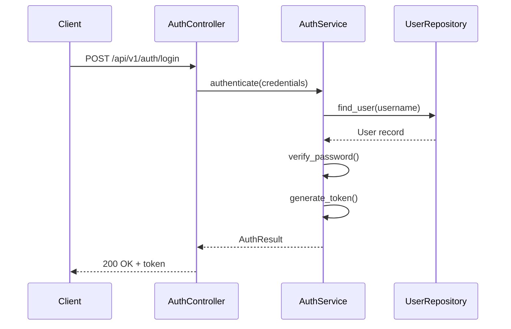
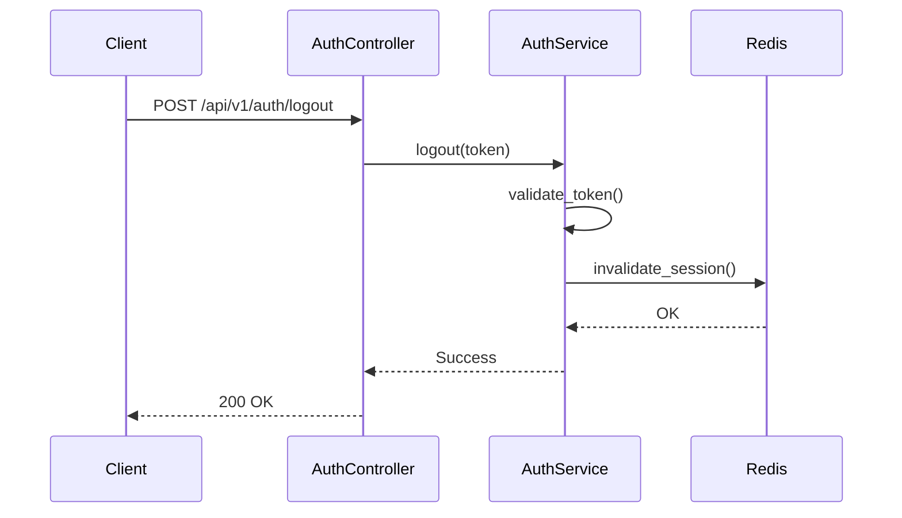
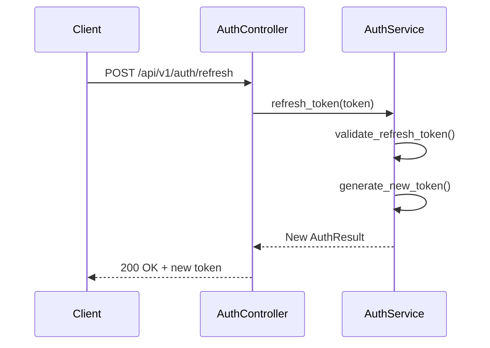

# ITEST-01: Authentication Service Integration Test Specification

**MVP Scope**: Integration test specifications for authentication API targeting ≥85% CTR coverage.

## 1. Document Control

| Item | Details |
|------|---------|
| **Status** | Approved |
| **Version** | 1.0.0 |
| **Date Created** | 2026-02-01T00:00:00 |
| **Last Updated** | 2026-02-05T00:00:00 |
| **Author** | Test Engineering Team |
| **Integration Scope** | Auth API, Database, TokenService |
| **CTR Reference** | CTR-01 |
| **SYS Reference** | SYS.01.01.01 |
| **Coverage Target** | ≥85% |
| **TASKS-Ready Score** | 88% |
| **Template Version** | 1.0 |

---

## 2. Test Scope

### 2.1 Components Under Test

| Component | Role | Interface |
|-----------|------|-----------|
| AuthService | Business Logic | Internal |
| AuthController | API Layer | REST API |
| UserRepository | Persistence | PostgreSQL |
| TokenService | Token Generation | Internal |

### 2.2 Integration Points

| ID | Source | Target | Protocol | CTR Reference |
|----|--------|--------|----------|---------------|
| IP-01 | Client | AuthController | REST/JSON | @ctr: CTR-01 |
| IP-02 | AuthController | AuthService | Internal | @sys: SYS.01.01.01 |
| IP-03 | AuthService | UserRepository | SQL | @sys: SYS.01.02.01 |

### 2.3 Dependencies

| Dependency | Strategy | Notes |
|------------|----------|-------|
| PostgreSQL | Test container | PostgreSQL 15 |
| Redis | Test container | Session cache |

---

## 3. Test Case Index

| ID | Name | Components | CTR Coverage | Priority |
|----|------|------------|--------------|----------|
| TSPEC.01.41.01 | Login endpoint | API → Service → DB | POST /api/v1/auth/login | P1 |
| TSPEC.01.41.02 | Logout endpoint | API → Service | POST /api/v1/auth/logout | P1 |
| TSPEC.01.41.03 | Token refresh | API → Service | POST /api/v1/auth/refresh | P1 |
| TSPEC.01.41.04 | User lookup flow | Service → DB | SYS.01.02.01 | P2 |

---

## 4. Test Case Details

### TSPEC.01.41.01: Login Endpoint Integration

**Components**: Client → AuthController → AuthService → UserRepository

**Traceability**:
- @ctr: CTR-01 (endpoint /api/v1/auth/login)
- @sys: SYS.01.01.01
- @spec: SPEC-01

**Contract Compliance**:

| Aspect | Expected | Validation |
|--------|----------|------------|
| Request Schema | `{"username": "string", "password": "string"}` | JSON Schema |
| Response Schema | `{"token": "string", "expires_at": "datetime"}` | JSON Schema |
| Status Code | 200 (success), 401 (unauthorized), 400 (bad request) | Assert |
| Headers | Content-Type: application/json | Assert |

**Sequence Diagram**:

**Side Effects**:

| Effect | Verification |
|--------|--------------|
| Last login updated | Query user.last_login |
| Login event logged | Check audit table |
| Session created | Verify Redis entry |

**Error Cases**:

| Error Condition | Expected Response | Recovery |
|-----------------|-------------------|----------|
| Invalid credentials | 401 Unauthorized | No retry |
| User not found | 401 Unauthorized | No retry |
| Database timeout | 503 Service Unavailable | Retry after 1s |

---

### TSPEC.01.41.02: Logout Endpoint Integration

**Components**: Client → AuthController → AuthService

**Traceability**:
- @ctr: CTR-01 (endpoint /api/v1/auth/logout)
- @sys: SYS.01.01.02
- @spec: SPEC-01

**Contract Compliance**:

| Aspect | Expected | Validation |
|--------|----------|------------|
| Request Headers | Authorization: Bearer {token} | Header check |
| Response Schema | `{"success": true}` | JSON Schema |
| Status Code | 200 (success), 401 (unauthorized) | Assert |

**Sequence Diagram**:

**Side Effects**:

| Effect | Verification |
|--------|--------------|
| Session invalidated | Query Redis for session |
| Logout event logged | Check audit table |

**Error Cases**:

| Error Condition | Expected Response | Recovery |
|-----------------|-------------------|----------|
| Invalid token | 401 Unauthorized | Re-authenticate |
| Already logged out | 200 OK (idempotent) | None |

---

### TSPEC.01.41.03: Token Refresh Integration

**Components**: Client → AuthController → AuthService

**Traceability**:
- @ctr: CTR-01 (endpoint /api/v1/auth/refresh)
- @sys: SYS.01.01.03
- @spec: SPEC-01

**Contract Compliance**:

| Aspect | Expected | Validation |
|--------|----------|------------|
| Request Headers | Authorization: Bearer {refresh_token} | Header check |
| Response Schema | `{"token": "string", "expires_at": "datetime"}` | JSON Schema |
| Status Code | 200 (success), 401 (expired), 400 (invalid) | Assert |

**Sequence Diagram**:

**Side Effects**:

| Effect | Verification |
|--------|--------------|
| Old token invalidated | Verify old token rejected |
| New session created | Query Redis |

**Error Cases**:

| Error Condition | Expected Response | Recovery |
|-----------------|-------------------|----------|
| Expired refresh token | 401 Unauthorized | Re-login |
| Invalid refresh token | 400 Bad Request | Re-login |

---

### TSPEC.01.41.04: User Lookup Flow

**Components**: AuthService → UserRepository → Database

**Traceability**:
- @sys: SYS.01.02.01
- @spec: SPEC-01

**Contract Compliance**:

| Aspect | Expected | Validation |
|--------|----------|------------|
| Query Type | SELECT | SQL parsing |
| Transaction | Read-only | Isolation check |
| Result | Single user or None | Row count |

**Side Effects**:

| Effect | Verification |
|--------|--------------|
| Query logged | Check slow query log |
| No data modification | Verify row counts |

**Error Cases**:

| Error Condition | Expected Response | Recovery |
|-----------------|-------------------|----------|
| Connection timeout | DatabaseError | Retry with backoff |
| Connection pool exhausted | DatabaseError | Queue request |

---

## 5. CTR Coverage Matrix

| CTR Endpoint | Method | Test IDs | Coverage |
|--------------|--------|----------|----------|
| /api/v1/auth/login | POST | TSPEC.01.41.01 | ✅ |
| /api/v1/auth/logout | POST | TSPEC.01.41.02 | ✅ |
| /api/v1/auth/refresh | POST | TSPEC.01.41.03 | ✅ |

**Coverage Summary**:
- Total CTR endpoints: 3
- Covered by ITEST: 3
- Coverage: 100%

---

## 6. Traceability

### 6.1 Upstream References

| Tag | Reference | Description |
|-----|-----------|-------------|
| @ctr | CTR-01 | Authentication API contract |
| @sys | SYS.01.01.01 | Authentication system requirement |
| @spec | SPEC-01 | Authentication service specification |

### 6.2 Downstream References

| Tag | Reference | Description |
|-----|-----------|-------------|
| @tasks | TASKS-01 | Implementation tasks |
| @code | `tests/integration/test_auth_api.py` | Test implementation |
