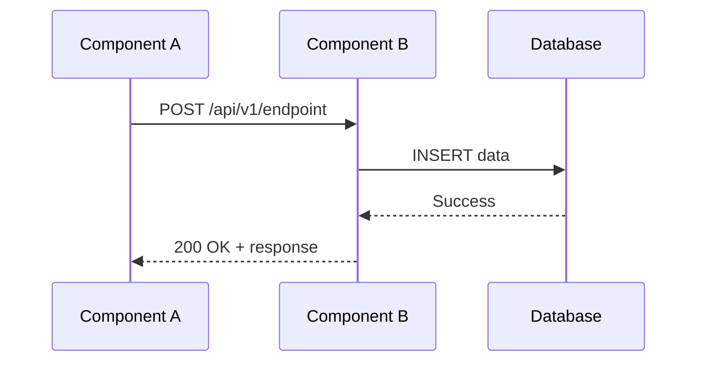
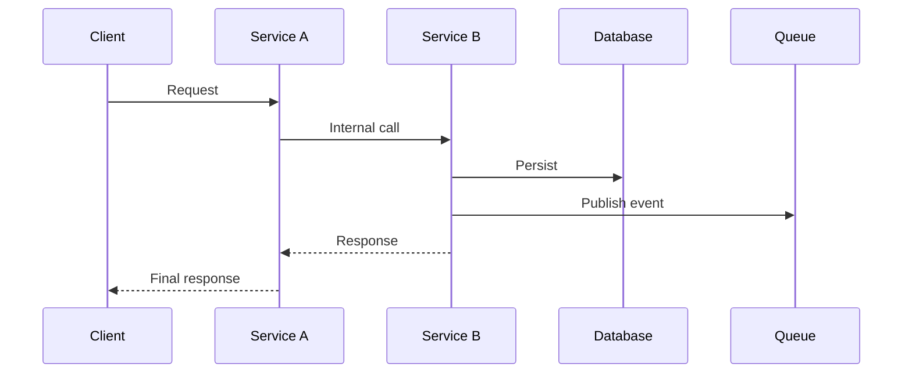

> **Dual-Format Note**:
>
> This MD template is the **primary source** for human workflow.
> - **For Autopilot**: See `ITEST-MVP-TEMPLATE.yaml` (YAML template)
> - **Shared Validation**: Both formats are validated by `ITEST_MVP_SCHEMA.yaml`
> - **Consistency Requirement**: MD and YAML templates MUST remain consistent.

---

<!--
AI_CONTEXT_START
Role: AI Test Engineer
Objective: Create integration test specifications for component interaction validation.
Constraints:
- Define test cases for component interactions per document.
- 6 sections required (aligned with MVP requirements).
- Required traceability tags: @ctr, @sys, @spec.
- TASKS-Ready threshold: ≥85%.
- Include sequence diagrams for complex interactions.
- Document contract compliance verification.
- Focus on API contracts and data flows.
AI_CONTEXT_END
-->

**MVP Template** — Single-file, streamlined ITEST for rapid MVP development.
Use this template for integration test specifications covering component interactions.

**Validation Note**: MVP templates are intentionally streamlined.

References: Schema `ITEST_MVP_SCHEMA.yaml` | Rules `ITEST_MVP_CREATION_RULES.md`, `ITEST_MVP_VALIDATION_RULES.md` | Matrix `TSPEC-00_TRACEABILITY_MATRIX-TEMPLATE.md`

# ITEST-NN: [Integration Scope] Integration Test Specification

**MVP Scope**: Integration test specifications for [Integration Scope] targeting ≥85% CTR coverage.

## 1. Document Control

| Item | Details |
|------|---------|
| **Status** | Draft / Review / Approved / Implemented |
| **Version** | 0.1.0 |
| **Date Created** | YYYY-MM-DD |
| **Last Updated** | YYYY-MM-DD |
| **Author** | [Author name] |
| **Integration Scope** | [Components being integrated] |
| **CTR Reference** | CTR-NN |
| **SYS Reference** | SYS.NN.01.01 |
| **Coverage Target** | ≥85% |
| **TASKS-Ready Score** | [XX]% (Target: ≥85%) |
| **Template Version** | 1.0 |

---

## 2. Test Scope

### 2.1 Components Under Test

| Component | Role | Interface |
|-----------|------|-----------|
| [Component A] | Producer | REST API |
| [Component B] | Consumer | REST API |
| [Database] | Persistence | SQL |

### 2.2 Integration Points

| ID | Source | Target | Protocol | CTR Reference |
|----|--------|--------|----------|---------------|
| IP-01 | Component A | Component B | REST/JSON | @ctr: CTR-NN |
| IP-02 | Component B | Database | SQL | @sys: SYS.NN.01.01 |

### 2.3 Dependencies

| Dependency | Strategy | Notes |
|------------|----------|-------|
| External API | Wiremock stub | Simulated responses |
| Database | Test container | PostgreSQL 15 |
| Message Queue | Embedded | In-memory |

---

## 3. Test Case Index

| ID | Name | Components | CTR Coverage | Priority |
|----|------|------------|--------------|----------|
| TSPEC.NN.41.01 | [Test name] | A → B | /api/v1/endpoint | P1 |
| TSPEC.NN.41.02 | [Test name] | B → DB | SYS.NN.01.01 | P1 |
| TSPEC.NN.41.03 | [Test name] | A → B → DB | Full flow | P1 |
| TSPEC.NN.41.04 | [Test name] | Error path | /api/v1/endpoint | P2 |

---

## 4. Test Case Details

### TSPEC.NN.41.01: [Test Name]

**Components**: Component A → Component B

**Traceability**:
- @ctr: CTR-NN (endpoint /api/v1/endpoint)
- @sys: SYS.NN.01.01
- @spec: SPEC-NN

**Contract Compliance**:

| Aspect | Expected | Validation |
|--------|----------|------------|
| Request Schema | `{"field": "string"}` | JSON Schema |
| Response Schema | `{"result": "object"}` | JSON Schema |
| Status Code | 200, 400, 500 | Assert |
| Headers | Content-Type: application/json | Assert |

**Sequence Diagram**:



**Side Effects**:

| Effect | Verification |
|--------|--------------|
| Database record created | Query assertion |
| Event published | Message queue check |
| Cache updated | Cache inspection |

**Error Cases**:

| Error Condition | Expected Response | Recovery |
|-----------------|-------------------|----------|
| Invalid request | 400 Bad Request | No retry |
| Service unavailable | 503 + retry-after | Retry with backoff |
| Database timeout | 500 + error body | Circuit breaker |

---

### TSPEC.NN.41.02: [Test Name]

**Components**: Component B → Database

**Traceability**:
- @sys: SYS.NN.01.01
- @spec: SPEC-NN

**Contract Compliance**:

| Aspect | Expected | Validation |
|--------|----------|------------|
| Query Type | INSERT/UPDATE | SQL parsing |
| Transaction | ACID compliant | Rollback test |
| Constraints | FK, Unique | Violation test |

**Data Flow**:

| Step | Input | Output | Validation |
|------|-------|--------|------------|
| 1 | Domain object | SQL params | Type mapping |
| 2 | SQL execution | Row count | Assert > 0 |
| 3 | Commit | Persisted data | Query verify |

**Side Effects**:

| Effect | Verification |
|--------|--------------|
| Audit log entry | Query audit table |
| Timestamp updated | Check updated_at |

---

### TSPEC.NN.41.03: [Test Name]

**Components**: Full Integration Flow (A → B → DB)

**Traceability**:
- @ctr: CTR-NN
- @sys: SYS.NN.01.01
- @spec: SPEC-NN

**End-to-End Flow**:



**Validation Checkpoints**:

| Checkpoint | Location | Assertion |
|------------|----------|-----------|
| CP-01 | After A receives | Request logged |
| CP-02 | After B processes | Data transformed |
| CP-03 | After DB persist | Record exists |
| CP-04 | After event | Message in queue |

---

## 5. CTR Coverage Matrix

| CTR Endpoint | Method | Test IDs | Coverage |
|--------------|--------|----------|----------|
| /api/v1/endpoint | POST | TSPEC.NN.41.01, TSPEC.NN.41.03 | ✅ |
| /api/v1/endpoint | GET | TSPEC.NN.41.04 | ✅ |
| /api/v1/health | GET | - | ❌ (STEST) |

**Coverage Summary**:
- Total CTR endpoints: [N]
- Covered by ITEST: [N]
- Coverage: [XX]%

---

## 6. Traceability

### 6.1 Upstream References

| Tag | Reference | Description |
|-----|-----------|-------------|
| @ctr | CTR-NN | API contract specification |
| @sys | SYS.NN.01.01 | System requirement |
| @spec | SPEC-NN | Technical specification |

### 6.2 Downstream References

| Tag | Reference | Description |
|-----|-----------|-------------|
| @tasks | TASKS-NN | Implementation tasks |
| @code | `tests/integration/test_[scope].py` | Test implementation |

---

## Appendix: Test Infrastructure

### Test Containers Configuration

```yaml
services:
  postgres:
    image: postgres:15
    environment:
      POSTGRES_DB: test_db
      POSTGRES_USER: test
      POSTGRES_PASSWORD: test

  wiremock:
    image: wiremock/wiremock:latest
    volumes:
      - ./stubs:/home/wiremock/mappings
```

### Stub Responses

| Endpoint | Response File | Description |
|----------|---------------|-------------|
| /external/api | `external_success.json` | Happy path |
| /external/api | `external_error.json` | Error scenario |
