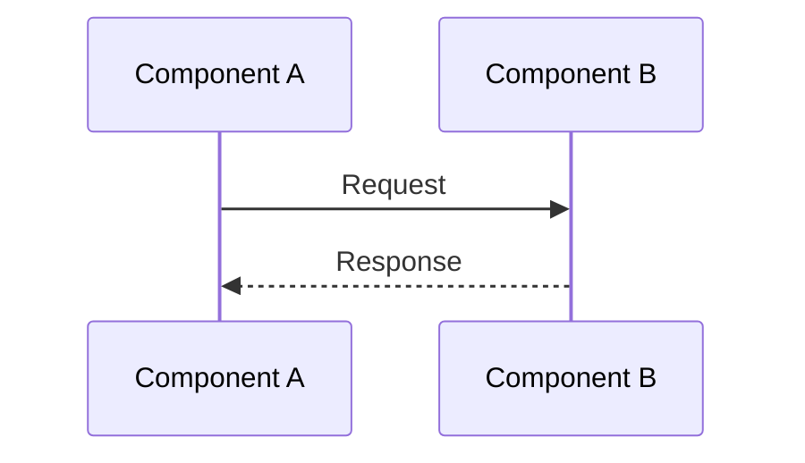

# ITEST MVP Creation Rules

## Purpose

AI guidance for creating integration test specifications that validate component interactions.

## Pre-Creation Checklist

Before creating an ITEST document:

- [ ] CTR documents exist for API contracts
- [ ] SYS requirements are finalized
- [ ] SPEC documents are approved
- [ ] Component boundaries are defined
- [ ] Integration points identified

## Document Naming

**Format**: `ITEST-NN_[integration_scope].md`

**Examples**:
- `ITEST-01_auth_service.md`
- `ITEST-02_data_pipeline.md`
- `ITEST-03_payment_gateway.md`

## Element ID Format

**Format**: `TSPEC.NN.41.SS`

| Component | Description |
|-----------|-------------|
| `TSPEC` | Artifact type |
| `NN` | Document number (matches filename) |
| `41` | Integration test type code |
| `SS` | Sequential test case number (01-99) |

## Required Sections

| Section | Required | Content |
|---------|----------|---------|
| 1. Document Control | Yes | Status, version, scores |
| 2. Test Scope | Yes | Components, integration points |
| 3. Test Case Index | Yes | ID, components, CTR coverage |
| 4. Test Case Details | Yes | Contract compliance, sequences |
| 5. CTR Coverage Matrix | Yes | CTR → Test mapping |
| 6. Traceability | Yes | @ctr, @sys, @spec tags |

## Traceability Rules

### Required Tags

| Tag | Requirement |
|-----|-------------|
| `@ctr` | Every test MUST trace to at least one CTR endpoint |
| `@sys` | Document MUST reference relevant SYS requirements |
| `@spec` | Document MUST reference source SPEC |

### Tag Format

```markdown
@ctr: CTR-NN (endpoint /api/v1/path)
@sys: SYS.NN.01.01
@spec: SPEC-NN
```

## Contract Compliance Table

Every test case MUST include a contract compliance table:

```markdown
| Aspect | Expected | Validation |
|--------|----------|------------|
| Request Schema | {...} | JSON Schema |
| Response Schema | {...} | JSON Schema |
| Status Code | 200, 400, 500 | Assert |
```

## Sequence Diagram Requirements

Complex interactions MUST include Mermaid sequence diagrams:



## Side Effects Documentation

Each test MUST document observable side effects:

```markdown
| Effect | Verification |
|--------|--------------|
| [Effect description] | [How to verify] |
```

## Coverage Requirements

| Metric | Target |
|--------|--------|
| CTR coverage | ≥85% |
| Sequence diagrams | 1 per complex flow |
| Contract tables | 1 per test |
| Side effects | Documented for all tests |

## Quality Gate Scoring

| Component | Weight | Criteria |
|-----------|--------|----------|
| CTR Coverage | 30% | Every CTR endpoint has ≥1 test |
| Contract Compliance | 25% | Schema validation defined |
| Sequence Diagrams | 20% | Complex flows visualized |
| Side Effects | 15% | State changes verified |
| Traceability | 10% | @ctr, @sys, @spec tags |

**Pass threshold**: ≥85%

## Common Mistakes

| Mistake | Correction |
|---------|------------|
| Missing @ctr tag | Link to CTR endpoint |
| No sequence diagram | Add for multi-component flows |
| Vague side effects | Be specific about verification |
| Missing error scenarios | Document failure paths |

## Validation Command

```bash
python scripts/validate_itest.py docs/10_TSPEC/ITEST/ITEST-01_*.md
```

## See Also

- [ITEST-MVP-TEMPLATE.md](ITEST-MVP-TEMPLATE.md)
- [ITEST_MVP_VALIDATION_RULES.md](ITEST_MVP_VALIDATION_RULES.md)
- [ITEST_MVP_QUALITY_GATES.md](ITEST_MVP_QUALITY_GATES.md)
