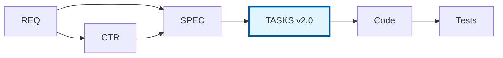
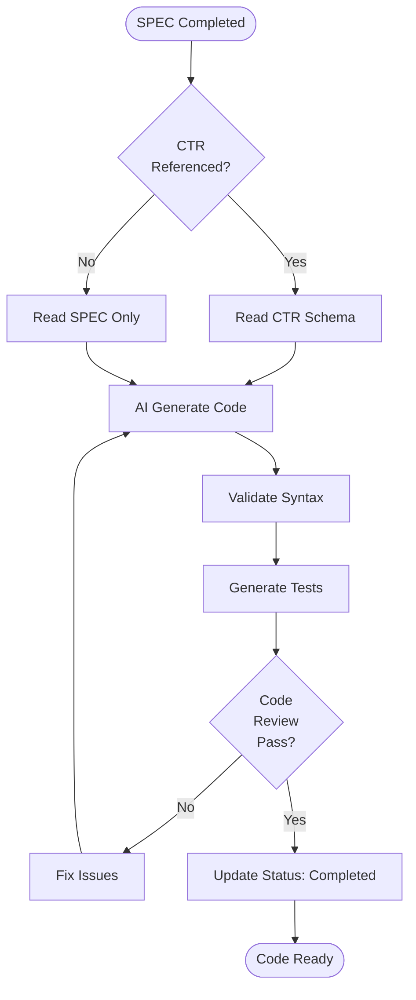

# TASKS-000: Code Generation Plans Master Index

Note: Some examples in this document show a portable `docs/` root. In this repository, artifact folders live at the ai_dev_flow root without the `docs/` prefix; see README → “Using This Repo” for path mapping.

## Purpose

This document serves as the master index for all Code Generation Plans (TASKS) in the project. Use this index to:

- **Discover** existing code generation plans
- **Track** AI-driven implementation status
- **Coordinate** code generation across components
- **Reference** implementation tasks and their completion status

## Position in Document Workflow (v2.0)



**Workflow (v2.0)**: `SPEC (Layer 9) → TASKS (Layer 10) → Code → Tests`

> **Note on Diagram Labels**: The above flowchart shows the sequential workflow. For formal layer numbers used in cumulative tagging, always reference the 15-layer architecture (Layers 0-14) defined in README.md. Diagram groupings are for visual clarity only.

## Code Generation Plans Index

| TASKS ID | Title | Status | Related SPEC | Related CTR | Components | Generated Code | Last Updated |
|----------|-------|--------|--------------|-------------|------------|----------------|--------------|
| [TASKS-01](./examples/TASKS-01_risk_validator_implementation.md) | Risk Validator Implementation | Planned | SPEC-03 | CTR-03 | RiskValidator class | `src/risk/validator.py` | 2025-11-02 |

## Planned

- Use this section to list TASKS documents planned but not yet created. Move rows to the main index table when created.

| ID | Plan Name | Source (SPEC) | Priority | Notes |
|----|-----------|---------------|----------|-------|
| TASKS-XX | … | SPEC-YY | High/Med/Low | … |

## Status Definitions

| Status | Meaning | Description |
|--------|---------|-------------|
| **Planned** | Not started | TASKS Plan created, code generation pending |
| **In Progress** | Active generation | AI currently generating code |
| **Code Review** | Generated, reviewing | Code generated, under review |
| **Testing** | In testing phase | Code reviewed, tests running |
| **Completed** | Deployed | Code generated, reviewed, tested, deployed |
| **Blocked** | Dependency wait | Waiting on upstream CTR or SPEC |

## Adding New Code Generation Plans

When creating a new TASKS Plan:

1. **Copy Template**:
   ```bash
   cp ai_dev_flow/11_TASKS/TASKS-TEMPLATE.md \
      ai_dev_flow/11_TASKS/TASKS-NN_component_name.md
   ```

2. **Assign TASKS ID**: Use next sequential number (TASKS-02, TASKS-03, ...)

3. **Update This Index**: Add new row to table above with:
   - TASKS ID and link to file
   - Title (component or feature name)
   - Status (Planned initially)
   - Related SPEC-ID
   - Related CTR-ID (if applicable)
   - Components to generate
   - Generated code file paths
   - Last Updated date

4. **Create Cross-References**: Update related 09_SPEC/CTR documents to reference new TASKS

## Allocation Rules

- **Numbering**: Allocate sequentially starting at `01`; keep numbers stable
- **One Task Per File**: Each `TASKS-NN` file covers a coherent implementation task
- **Slugs**: Short, descriptive, lower_snake_case
- **Cross-Links**: Each task should reference upstream 07_REQ/05_ADR/09_SPEC/08_CTR and downstream code/tests
- **Index Updates**: Add a line for every new task; do not remove past entries

## Index by Status

### Planned
- TASKS-01: Risk Validator Implementation

### In Progress
- None

### Code Review
- None

### Testing
- None

### Completed
- None

### Blocked
- None

## Index by Component Type

| Component Type | TASKS Plans | Count |
|----------------|-------------|-------|
| Agent | - | 0 |
| Service | TASKS-01 | 1 |
| MCP Server | - | 0 |
| Infrastructure | - | 0 |
| ML Model | - | 0 |
| Utility | - | 0 |

## Index by Priority

| Priority | TASKS Plans |
|----------|-------------|
| P0 (Critical) | - |
| P1 (High) | TASKS-01 |
| P2 (Medium) | - |
| P3 (Low) | - |

## Generated Code Summary

### Python Modules
- `src/risk/validator.py` (TASKS-01) - Risk Validator class

### Test Files
- `tests/risk/test_validator.py` (TASKS-01) - Unit tests for Risk Validator

### Configuration Files
- None yet

### Infrastructure
- None yet

## AI Generation Metrics

| Metric | Value | Description |
|--------|-------|-------------|
| Total TASKS Plans | 1 | Total code generation plans created |
| Lines Generated | 0 | Total lines of code generated by AI |
| Files Generated | 0 | Total files created by AI |
| Tests Generated | 0 | Total test files created |
| Generation Time | 0 min | Total AI generation time |
| Success Rate | N/A | Percentage of successful generations |

## Related Documents

- **Template**: [TASKS-TEMPLATE.md](./TASKS-TEMPLATE.md) - Use this to create new TASKS Plans
- **README**: [README.md](./README.md) - Learn about TASKS Plans purpose and structure
- **Example**: [TASKS-01](./examples/TASKS-01_risk_validator_implementation.md) - Reference code generation plan

## Maintenance Guidelines

### Updating This Index

**When starting code generation**:
- Update Status from "Planned" to "In Progress"
- Update Last Updated date
- Note AI agent starting generation

**When generation completes**:
- Update Status to "Code Review"
- Add generated file paths
- Update Lines Generated count
- Update Last Updated date

**When code review passes**:
- Update Status to "Testing"
- Update Last Updated date

**When tests pass**:
- Update Status to "Completed"
- Update Success Rate metric
- Update Last Updated date

**When blocked**:
- Update Status to "Blocked"
- Add reason in Notes
- Update Last Updated date

### Review Schedule

This index should be reviewed:
- **Daily**: By developers for generation status
- **Weekly**: By tech leads for code quality metrics
- **Monthly**: By architects for component coverage

## Quick Statistics

- **Total TASKS Plans**: 1
- **Planned**: 1
- **In Progress**: 0
- **Code Review**: 0
- **Testing**: 0
- **Completed**: 0
- **Blocked**: 0

## Usage Examples

### Finding Code Generation Plan for a Specification

**Question**: "Which TASKS Plan implements SPEC-03?"

**Answer**: Check "Related SPEC" column → TASKS-01 (Risk Validator Implementation)

### Checking What's Currently Being Generated

**Question**: "What's in progress?"

**Answer**: Check "Status" column for "In Progress" → None currently

### Identifying Which Components Are Generated

**Question**: "What code files have been generated?"

**Answer**: See "Generated Code Summary" section → Currently none (all planned)

### Finding Test Coverage

**Question**: "Which tests have been generated?"

**Answer**: See "Generated Code Summary" → Test Files section

## AI Generation Best Practices

1. **Always Start with SPEC**: Ensure SPEC-NN.yaml is complete before creating TASKS
2. **Reference CTR**: Link to API contracts for interface definitions
3. **Include Traceability**: Every generated file should have 07_REQ/05_ADR/BDD comments
4. **Generate Tests First**: Create test files before implementation
5. **Validate Generated Code**: Run linters, type checkers, and tests immediately
6. **Review AI Output**: Always review AI-generated code before committing
7. **Update Metrics**: Track generation time, lines of code, success rate

## Traceability Matrix

| TASKS | SPEC | CTR | REQ | BDD | ADR |
| TASKS-01 | SPEC-03 | CTR-03 | REQ-03 | BDD-03 | ADR-08 |


## Code Generation Workflow



> **Note on Diagram Labels**: The above flowchart shows the sequential workflow. For formal layer numbers used in cumulative tagging, always reference the 15-layer architecture (Layers 0-14) defined in README.md. Diagram groupings are for visual clarity only.

---

**Index Version**: 2.0
**Last Updated**: 2026-01-15
**Maintained By**: Development Team
**Schema Version**: TASKS v2.0 (11 sections)
