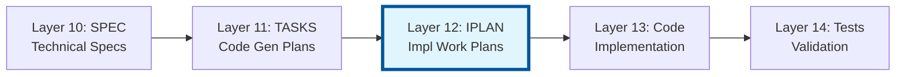
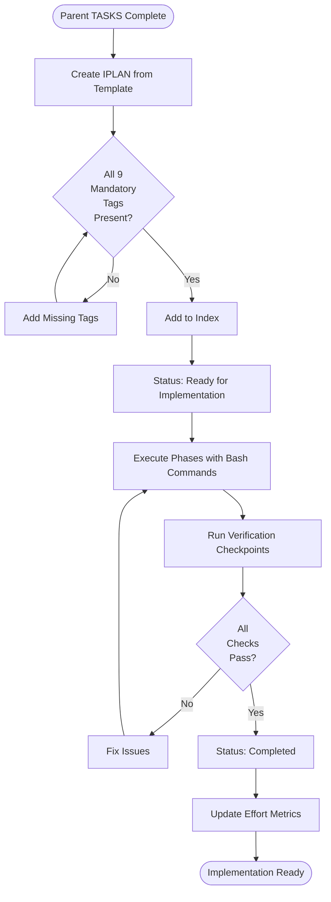

# ⚠️ DEPRECATED: IPLAN-000: Implementation Work Plans Master Index

> **Deprecation Date**: 2026-01-15
> **Status**: IPLAN has been merged into TASKS (Layer 11)
> **Replacement**: [`ai_dev_flow/11_TASKS/TASKS-TEMPLATE.md`](../11_TASKS/TASKS-TEMPLATE.md)
> 
> See [DEPRECATED.md](./DEPRECATED.md) for migration guide.

Note: Some examples in this index show a portable `docs/` root. In this repository, artifact folders live at the ai_dev_flow root without the `docs/` prefix; see README → “Using This Repo” for path mapping.

## Purpose

This document serves as the master index for all Implementation Plans (IPLAN) in the project. Use this index to:

- **Discover** existing implementation work plans with session context
- **Track** implementation progress across phases and sessions
- **Coordinate** execution of TASKS documents with bash commands and verification
- **Reference** completed and in-progress implementation work
- **Resume** work from checkpoints in new sessions

## Position in Document Workflow

**Layer 12: Implementation Work Plans**



> **Note on Diagram Labels**: The above flowchart shows the sequential workflow. For formal layer numbers used in cumulative tagging, always reference the 16-layer architecture (Layers 0-15) defined in README.md. Diagram groupings are for visual clarity only.

**Purpose**: Bridge between TASKS (WHAT to generate) and Code (HOW to execute)

## Implementation Work Plans Index

| ID | Title | Status | Parent TASKS | Required Tags | Component | Estimated Effort | Created | Completed | Link |
|----|-------|--------|--------------|---------------|-----------|------------------|---------|-----------|------|
| *No IPLAN documents yet* | - | - | - | - | - | - | - | - | - |

## Planned

- Use this section to list IPLAN documents planned but not yet created. Move rows to the main index table when created.

| ID | Session Name | Scope (11_TASKS/SPEC) | Priority | Notes |
|----|--------------|--------------------|----------|-------|
| IPLAN-XX | … | 11_TASKS/SPEC-YY | High/Med/Low | … |

### Example Entry (for reference):
```markdown
| IPLAN-01 | Implement Gateway Connection | In Progress | TASKS-01 | ✅ 9/9 tags | Gateway Service | 80 hours | 2025-11-12 | - | [Link](./IPLAN-01_implement_gateway_connection.md) |
```

## Status Definitions

| Status | Meaning | Description |
|--------|---------|-------------|
| **Draft** | Planning phase | IPLAN document created, not started |
| **Ready for Implementation** | Prepared | Prerequisites verified, ready to execute |
| **In Progress** | Active work | Implementation actively being executed |
| **Blocked** | Dependency wait | Waiting on external dependency or blocker |
| **Completed** | Finished | All phases complete, code committed, tests passing |
| **On Hold** | Paused | Work paused, can be resumed later |

## Cumulative Tagging Requirements

**Layer 12 Position**: All IPLAN MUST include these tags:

### Mandatory Tags (9 required)

1. `@brd` - Business Requirements Document (Layer 1)
2. `@prd` - Product Requirements Document (Layer 2)
3. `@ears` - Event-Action-Response-State (Layer 3)
4. `@bdd` - Behavior-Driven Development (Layer 4)
5. `@adr` - Architecture Decision Records (Layer 5)
6. `@sys` - System Requirements (Layer 6)
7. `@req` - Atomic Requirements (Layer 7)
8. `@spec` - Technical Specifications (Layer 10)
9. `@tasks` - Code Generation Plan (Layer 11)

### Optional Tags (if present in project)

10. `@impl` - Implementation Plan (Layer 8)
11. `@ctr` - Interface Contracts (Layer 9)

### Tag Validation

Use this index to track tag completeness:

**Tag Status Legend**:
- ✅ `9/9` - All mandatory tags present
- ✅ `11/11` - All mandatory + optional tags present
- ⚠️ `8/9` - Missing mandatory tag(s)
- ❌ `0/9` - No tags present

**Validation Command**:
```bash
python3 scripts/validate_tags_against_docs.py \
  --file 12_IPLAN/IPLAN-NN_*.md
```

## Adding New Implementation Work Plans

When creating a new IPLAN document:

1. **Copy Template**:
   ```bash
   cp 12_IPLAN/IPLAN-TEMPLATE.md \
      12_IPLAN/IPLAN-NN_descriptive_name.md
   ```

2. **Assign ID**: Use next sequential number (IPLAN-01, IPLAN-02, ...)

3. **Complete Document**:
   - Fill in all required sections
   - Add all 9 mandatory cumulative tags
   - Include optional tags (@impl, @ctr) if present in project
   - Provide executable bash commands
   - Add verification steps

4. **Update This Index**: Add new row to table above with:
   - ID and link to file
   - Title (descriptive task/feature name)
   - Status (Draft or Ready for Implementation initially)
   - Parent TASKS-ID
   - Tag validation status (e.g., ✅ 9/9 tags)
   - Component/feature being implemented
   - Estimated effort
   - Created date
   - Completed date (when done)

5. **Validate Tags**:
   ```bash
   python scripts/validate_tags_against_docs.py --file 12_IPLAN/IPLAN-NN_*.md
   ```

6. **Update Traceability Matrix**:
   ```bash
   python scripts/update_traceability_matrix.py \
     --artifact 12_IPLAN/IPLAN-NN_*.md \
     --matrix 12_IPLAN/IPLAN-00_TRACEABILITY_MATRIX.md
   ```

## Allocation Rules

- **Numbering**: Allocate sequentially starting at `01`; keep numbers stable
- **One Plan Per File**: Each `IPLAN-NN` file covers one implementation session or phase
- **Slugs**: Short, descriptive, lower_case_with_underscores
- **Cross-Links**: Reference parent TASKS and all upstream artifacts via tags
- **Index Updates**: Add entry for every new plan; do not remove past entries
- **Tag Completeness**: Verify all 9 mandatory tags present before adding to index
- **Version Control**: Git tracks file history and timestamps

## Index by Status

### Draft
- None

### Ready for Implementation
- None

### In Progress
- None

### Blocked
- None

### Completed
- None

### On Hold
- None

## Index by Parent TASKS

| Parent TASKS | IPLAN Documents | Count | Combined Effort |
|--------------|----------------------|-------|-----------------|
| *No parent TASKS yet* | - | 0 | 0 hours |

### Example:
```markdown
| TASKS-01 | IPLAN-01, IPLAN-02 | 2 | 160 hours |
```

## Index by Component Type

| Component Type | IPLAN Documents | Count |
|----------------|----------------------|-------|
| Gateway/Connection | - | 0 |
| Service | - | 0 |
| MCP Server | - | 0 |
| Infrastructure | - | 0 |
| ML Model | - | 0 |
| API Client | - | 0 |
| Utility | - | 0 |
| Testing | - | 0 |
| Documentation | - | 0 |

## Implementation Metrics

| Metric | Value | Description |
|--------|-------|-------------|
| Total IPLAN | 0 | Total implementation work plans created |
| Completed Plans | 0 | Plans fully executed and verified |
| In Progress Plans | 0 | Plans currently being executed |
| Total Estimated Effort | 0 hours | Combined effort estimates |
| Total Actual Effort | 0 hours | Combined actual time spent |
| Effort Variance | N/A | Actual vs. estimated (percentage) |
| Average Completion Time | N/A | Average time from start to completion |
| Tag Compliance Rate | N/A | Percentage with all 9 mandatory tags |

## Tag Compliance Summary

| Tag Requirement | Documents | Percentage |
|-----------------|-----------|------------|
| All 9 mandatory tags | 0 | N/A |
| All 11 tags (with optional) | 0 | N/A |
| Missing 1+ tags | 0 | N/A |
| No tags | 0 | N/A |

**Target**: 100% of documents have all 9 mandatory tags

## Session Resumption Index

Use this section to track which IPLAN are suitable for resumption:

| ID | Last Session Date | Phase Status | Resume Point | Blockers | Ready to Resume |
|----|------------------|--------------|--------------|----------|-----------------|
| *No resumable sessions* | - | - | - | - | - |

### Example:
```markdown
| IPLAN-01 | 2025-11-12 14:30 | Phase 2.3 (50%) | TASK-2.3: Protocol interface | None | ✅ Yes |
```

## Related Documents

- **Template**: [IPLAN-TEMPLATE.md](./IPLAN-TEMPLATE.md) - Use this to create new implementation work plans
- **README**: [README.md](./README.md) - Learn about IPLAN purpose, structure, and cumulative tagging
- **Traceability Matrix**: [IPLAN-00_TRACEABILITY_MATRIX.md](./IPLAN-00_TRACEABILITY_MATRIX.md) - Complete traceability tracking
- **Parent Artifact**: [../11_TASKS/README.md](../11_TASKS/README.md) - TASKS code generation plans
- **Framework Guide**: [../SPEC_DRIVEN_DEVELOPMENT_GUIDE.md](../SPEC_DRIVEN_DEVELOPMENT_GUIDE.md) - Complete workflow documentation

## Maintenance Guidelines

### Updating This Index

**When creating new IPLAN**:
- Add row to main index table
- Set Status to "Draft" or "Ready for Implementation"
- Include all required columns
- Verify tag completeness (✅ 9/9 or ✅ 11/11)
- Update "Index by Status" section
- Update "Index by Parent TASKS" section
- Update "Index by Component Type" section
- Update metrics

**When starting implementation**:
- Update Status from "Ready for Implementation" to "In Progress"
- Add entry to "Session Resumption Index"
- Update Last Session Date
- Update metrics

**When blocking occurs**:
- Update Status to "Blocked"
- Add blocker description
- Update "Session Resumption Index" with blocker info
- Set "Ready to Resume" to ❌ No

**When resuming work**:
- Update Status back to "In Progress"
- Update Last Session Date
- Update Phase Status
- Update Resume Point
- Clear blockers if resolved

**When completing implementation**:
- Update Status to "Completed"
- Add Completed date
- Update Actual Effort
- Calculate and update Effort Variance
- Remove from "Session Resumption Index"
- Update metrics

### Review Schedule

This index should be reviewed:
- **Daily**: By developers implementing tasks for status updates
- **Weekly**: By team leads for progress tracking
- **Sprint End**: By project managers for effort analysis
- **Monthly**: By architects for component coverage

## Quick Statistics

- **Total IPLAN**: 0
- **Draft**: 0
- **Ready for Implementation**: 0
- **In Progress**: 0
- **Blocked**: 0
- **Completed**: 0
- **On Hold**: 0
- **Tag Compliance**: N/A

## Usage Examples

### Finding Implementation Plan for a TASKS Document

**Question**: "Which IPLAN implements TASKS-01?"

**Answer**: Check "Parent TASKS" column in main index table → Look for TASKS-01

### Checking What's Currently In Progress

**Question**: "What implementations are active?"

**Answer**: Check "Status" column for "In Progress" → See "Index by Status: In Progress" section

### Identifying Resumable Work

**Question**: "Can I continue yesterday's work?"

**Answer**: Check "Session Resumption Index" → Look for your last session date and "Ready to Resume: ✅ Yes"

### Verifying Tag Compliance

**Question**: "Are all tags present in IPLAN-01?"

**Answer**: Check "Required Tags" column → Look for ✅ 9/9 or ✅ 11/11

### Finding Effort Estimates

**Question**: "How much effort is estimated for gateway implementation?"

**Answer**: Check "Estimated Effort" column for relevant IPLAN → See "Index by Component Type" for totals

## Best Practices

1. **Complete Tags Before Adding to Index**: Verify all 9 mandatory tags present
2. **Update Status Promptly**: Keep status current for team visibility
3. **Track Actual Effort**: Update when completing phases for future estimation
4. **Document Blockers**: Clear blocker descriptions help team assist
5. **Maintain Resume Points**: Enable seamless session continuity
6. **Validate Before Completing**: Run all verification checklists before marking complete
7. **Link to Parent TASKS**: Always reference the parent TASKS document
8. **Use Descriptive Slugs**: Choose clear, stable slugs that describe the work

## Traceability Validation

All IPLAN in this index should pass these validations:

```bash
# Validate all IPLAN have required tags
for file in 12_IPLAN/IPLAN-*.md; do
  python scripts/validate_tags_against_docs.py --file "$file"
done

# Expected: All files show ✅ 9/9 or ✅ 11/11 tags

# Generate complete traceability matrix
python scripts/generate_traceability_matrix.py --artifact-type IPLAN

# Expected: Matrix shows complete tag chains for all documents
```

## Implementation Workflow



> **Note on Diagram Labels**: The above flowchart shows the sequential workflow. For formal layer numbers used in cumulative tagging, always reference the 16-layer architecture (Layers 0-15) defined in README.md. Diagram groupings are for visual clarity only.

---

## Tag Validation Checklist

Before adding a IPLAN to this index, verify:

- [ ] All 9 mandatory tags present: @brd, @prd, @ears, @bdd, @adr, @sys, @req, @spec, @tasks
- [ ] Optional tags included if project uses them: @impl, @ctr
- [ ] Tag format correct: `@type: DOC-ID:REQ-ID`
- [ ] Each tag resolves to existing document
- [ ] Upstream documents reference this IPLAN in downstream traceability
- [ ] Validation script passes: `python scripts/validate_tags_against_docs.py`
- [ ] Traceability matrix updated: `python scripts/update_traceability_matrix.py`

---

**Index Version**: 1.0.0
**Last Updated**: 2025-11-12
**Maintained By**: Development Team
**Next Review**: 2025-11-19 (weekly)
**Framework Version**: AI Dev Flow 2.0
