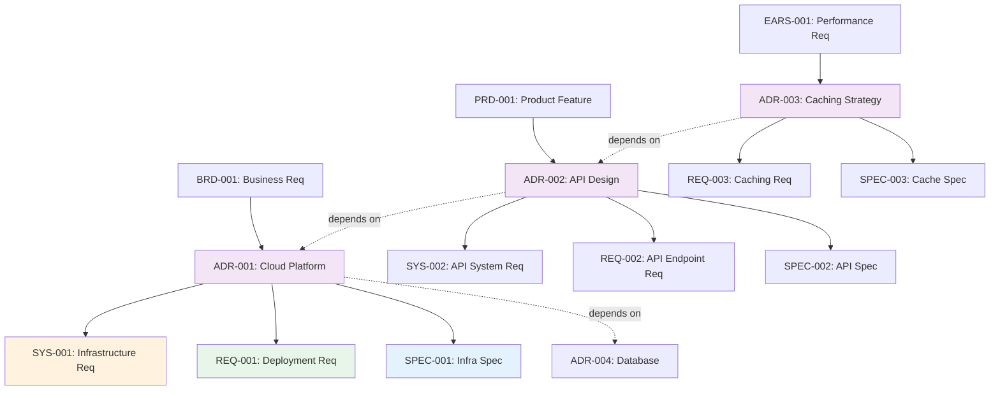

# Traceability Matrix: ADR-001 through ADR-NNN

## Document Control

| Item | Details |
|------|---------|
| Document ID | TRACEABILITY_MATRIX_ADR |
| Title | Comprehensive Architecture Decision Records Traceability Matrix |
| Status | [Active/Draft] |
| Version | 1.0.0 |
| Date Created | YYYY-MM-DD |
| Author | [Team Name] |
| Purpose | Track bidirectional traceability for all Architecture Decision Records |


---

**⚠️ TAG-BASED AUTO-GENERATION AVAILABLE**

This traceability matrix can be automatically generated by scanning code files for @adr:, @spec:, @test: tags.

**Recommended Approach:** Use tag-based auto-discovery instead of manual maintenance.

**Generate automatically using:**
```bash
# Extract tags from all files
python scripts/extract_tags.py --source src/ docs/ tests/ --output docs/generated/tags.json

# Validate tags against documents
python scripts/validate_tags_against_docs.py --tags docs/generated/tags.json --strict

# Generate ADR traceability matrix
python scripts/generate_traceability_matrices.py --type ADR --output docs/ADR/ADR-000_TRACEABILITY_MATRIX.md
```

**Benefits:**
- ✅ Single source of truth: Tags embedded in code
- ✅ Always up-to-date: Generated from current codebase
- ✅ No manual sync: Automated validation prevents drift
- ✅ Coverage metrics: Automatically calculated

**Tag Format:** `@adr: ADR-001:REQ-ID` (for multi-requirement docs) or `@adr: ADR-001` (for single-doc refs)

See: [TRACEABILITY.md](../TRACEABILITY.md#tag-based-auto-discovery-alternative) for complete tag-based workflow.

---

## 1. Overview

### 1.1 Document Type Description
Architecture Decision Records (ADRs) document significant architectural decisions, their context, rationale, consequences, and alternatives considered. ADRs provide the "WHY" behind technical choices.

### 1.2 Coverage Scope
This matrix tracks all ADRs, mapping upstream business/product requirements to downstream system requirements, atomic requirements, and specifications that implement the decisions.

### 1.3 Statistics
- **Total ADRs Tracked**: [X] documents
- **Active Decisions**: [Y] ADRs
- **Superseded Decisions**: [Z] ADRs
- **Coverage Period**: [Start Date] to [End Date]
- **Last Updated**: YYYY-MM-DD

---

---

## 2. Required Tags (Cumulative Tagging Hierarchy - Layer 5)

### 2.1 Tag Requirements for ADR Artifacts

**Layer**: 5
**Artifact Type**: ADR (Architecture Decision Records)
**Required Tags**: `@brd`, `@prd`, `@ears`, `@bdd`
**Tag Count**: 4

### 2.2 Tag Format

```markdown
@brd: BRD-009:FR-015, BRD-009:NFR-006
@prd: PRD-016:FEATURE-003
@ears: EARS-012:EVENT-002, EARS-012:STATE-001
@bdd: BDD-015:scenario-place-order, BDD-015:scenario-reject-invalid
```

**Format Rules**:
- Prefix: `@` symbol
- Artifact Type: lowercase (`brd`, `prd`, `ears`, `bdd`)
- Separator: colon `:` after artifact type, `:` between document ID and requirement ID
- Document ID: Standard format (e.g., `ADR-NNN`)
- Requirement ID: Specific requirement/section identifier
- Multiple Values: comma-separated for same artifact type

### 2.3 Example: ADR with Required Tags

```markdown
# ADR-033: Order Service Architecture

## 7. Traceability

### 7.1 Upstream Sources

**Required Tags** (Cumulative Tagging Hierarchy - Layer 5):
```markdown
@brd: BRD-009:FR-015, BRD-009:NFR-006
@prd: PRD-016:FEATURE-003
@ears: EARS-012:EVENT-002, EARS-012:STATE-001
@bdd: BDD-015:scenario-place-order, BDD-015:scenario-reject-invalid
```

### 7.2 Downstream Artifacts
[Links to SPEC, TASKS, Code that reference this ADR]
```

### 2.4 Validation Rules

1. **Required**: Each ADR artifact MUST include at least one tag for each required layer
2. **Format Compliance**: All tags must follow `@artifact-type:DOC-ID:REQ-ID` format
3. **Valid References**: All referenced documents and requirements must exist
4. **No Gaps**: Cannot skip any required upstream layer in the chain
5. **Tag Count**: Must have exactly 4 tags for Layer 5

### 2.5 Tag Discovery

ADR tags can be discovered automatically:
```bash
# Find all ADRs and their upstream tags
python scripts/extract_tags.py --type ADR --show-all-upstream

# Validate ADR-033 has required tags
python scripts/validate_tags_against_docs.py \
  --artifact ADR-033 \
  --expected-layers brd,prd,ears,bdd \
  --strict

# Generate ADR traceability report
python scripts/generate_traceability_matrices.py \
  --type ADR \
  --show-coverage
```

### 2.6 ADR Traceability Pattern

**Key Role**: ADR documents architectural choices that implement BDD acceptance criteria, bridging validated requirements and system design.

---

## 4. Complete ADR Inventory

| ADR ID | Title | Decision Category | Status | Date | Upstream Sources | Downstream Artifacts |
|--------|-------|-------------------|--------|------|------------------|---------------------|
| ADR-001 | [Architecture decision title] | [Category] | Accepted | YYYY-MM-DD | BRD-001, PRD-001, EARS-001 | SYS-001, REQ-001, SPEC-001 |
| ADR-002 | [Architecture decision title] | [Category] | Accepted | YYYY-MM-DD | PRD-002, BDD-001 | SYS-002, REQ-002, REQ-003 |
| ADR-NNN | ... | ... | ... | ... | ... | ... |

**Status Legend**:
- **Proposed**: Under review
- **Accepted**: Approved and active
- **Superseded**: Replaced by newer ADR
- **Deprecated**: No longer applicable
- **Rejected**: Not approved

---

## 5. Upstream Traceability

### 4.1 BRD → ADR Traceability

| BRD ID | BRD Title | ADR IDs | ADR Titles | Relationship |
|--------|-----------|---------|------------|--------------|
| BRD-001 | [Business requirement] | ADR-001, ADR-005 | [Architecture decisions] | Business constraints drive technical decisions |
| BRD-NNN | ... | ... | ... | ... |

### 4.2 PRD → ADR Traceability

| PRD ID | PRD Title | ADR IDs | ADR Titles | Relationship |
|--------|-----------|---------|------------|--------------|
| PRD-001 | [Product feature] | ADR-002, ADR-008 | [Architecture decisions] | Product requirements necessitate architectural choices |
| PRD-NNN | ... | ... | ... | ... |

### 4.3 EARS → ADR Traceability

| EARS ID | EARS Title | ADR IDs | ADR Titles | Relationship |
|---------|------------|---------|------------|--------------|
| EARS-001 | [Formal requirement] | ADR-003 | [Architecture decision] | Performance requirements drive architectural patterns |
| EARS-NNN | ... | ... | ... | ... |

### 4.4 BDD → ADR Traceability

| BDD ID | BDD Title | ADR IDs | ADR Titles | Relationship |
|--------|-----------|---------|------------|--------------|
| BDD-001 | [Test scenarios] | ADR-004 | [Architecture decision] | Testing requirements influence architectural approach |
| BDD-NNN | ... | ... | ... | ... |

### 4.5 Upstream Source Summary

| Source Category | Total Sources | ADRs Derived | Coverage % |
|-----------------|---------------|--------------|------------|
| BRD | [X] | [Y] ADRs | XX% |
| PRD | [X] | [Y] ADRs | XX% |
| EARS | [X] | [Y] ADRs | XX% |
| BDD | [X] | [Y] ADRs | XX% |
| Technical Analysis | [X] | [Y] ADRs | XX% |

---

## 6. Downstream Traceability

### 5.1 ADR → SYS Traceability

| ADR ID | ADR Title | SYS IDs | SYS Titles | Relationship |
|--------|-----------|---------|------------|--------------|
| ADR-001 | [Architecture decision] | SYS-001, SYS-002 | [System requirements] | Architectural decisions define system-level requirements |
| ADR-NNN | ... | ... | ... | ... |

### 5.2 ADR → REQ Traceability

| ADR ID | ADR Title | REQ IDs | REQ Titles | Relationship |
|--------|-----------|---------|------------|--------------|
| ADR-001 | [Architecture decision] | REQ-001, REQ-002, REQ-003 | [Atomic requirements] | Architectural patterns require specific implementations |
| ADR-NNN | ... | ... | ... | ... |

### 5.3 ADR → SPEC Traceability

| ADR ID | ADR Title | SPEC IDs | SPEC Titles | Relationship |
|--------|-----------|----------|-------------|--------------|
| ADR-001 | [Architecture decision] | SPEC-001, SPEC-002 | [Technical specifications] | Architectural decisions implemented in specifications |
| ADR-NNN | ... | ... | ... | ... |

### 5.4 ADR → IMPL Traceability

| ADR ID | ADR Title | IMPL IDs | IMPL Titles | Relationship |
|--------|-----------|----------|-------------|--------------|
| ADR-001 | [Architecture decision] | IMPL-001 | [Implementation plan] | Architectural changes require implementation planning |
| ADR-NNN | ... | ... | ... | ... |

### 5.5 Downstream Artifact Summary

| Artifact Type | Total Artifacts | ADRs Traced | Coverage % |
|---------------|-----------------|-------------|------------|
| SYS | [X] | [Y] ADRs | XX% |
| REQ | [X] | [Y] ADRs | XX% |
| SPEC | [X] | [Y] ADRs | XX% |
| IMPL | [X] | [Y] ADRs | XX% |
| Code | [X] | [Y] ADRs | XX% |

---

## 7. Architecture Decision Categories

### 6.1 ADRs by Decision Category

| Decision Category | ADR IDs | Total | Description |
|-------------------|---------|-------|-------------|
| [Infrastructure] | ADR-001, ADR-002, ADR-003 | 3 | Cloud platform, deployment, hosting |
| [Data Architecture] | ADR-004, ADR-005 | 2 | Database, storage, data flow |
| [Security] | ADR-006, ADR-007 | 2 | Authentication, encryption, access control |
| [Integration] | ADR-008, ADR-009 | 2 | API design, messaging, protocols |
| [Performance] | ADR-010 | 1 | Caching, scalability, optimization |

### 6.2 Technology Stack Summary

| Technology Area | Technologies Selected | ADR IDs | Status |
|-----------------|----------------------|---------|--------|
| [Cloud Platform] | [Azure/AWS/GCP] | ADR-001 | Implemented |
| [Database] | [PostgreSQL] | ADR-004 | Implemented |
| [API Framework] | [FastAPI] | ADR-008 | Implemented |
| [Authentication] | [OAuth 2.0] | ADR-006 | In Progress |

---

## 8. Cross-ADR Dependencies

### 7.1 ADR Relationship Map



> **Note on Diagram Labels**: The above flowchart shows the sequential workflow. For formal layer numbers used in cumulative tagging, always reference the 16-layer architecture (Layers 0-15) defined in README.md. Diagram groupings are for visual clarity only.

### 7.2 Inter-ADR Dependencies

| Source ADR | Target ADR | Dependency Type | Description |
|------------|------------|-----------------|-------------|
| ADR-001 | ADR-004 | Prerequisite | Cloud platform must be selected before database choice |
| ADR-002 | ADR-001 | Related | API design depends on cloud platform capabilities |
| ADR-003 | ADR-002 | Enhancement | Caching strategy enhances API performance |
| ADR-NNN | ... | ... | ... |

---

## 9. Decision Impact Analysis

### 8.1 Cost Impact

| ADR ID | Technology/Service | Est. Monthly Cost | Annual Cost | Impact Level |
|--------|-------------------|-------------------|-------------|--------------|
| ADR-001 | Azure Cloud Services | $X,XXX | $XX,XXX | High |
| ADR-004 | PostgreSQL Database | $XXX | $X,XXX | Medium |
| ADR-006 | Auth0 Service | $XXX | $X,XXX | Medium |
| ADR-NNN | ... | ... | ... | ... |
| **Total** | | **$X,XXX** | **$XX,XXX** | |

### 8.2 Implementation Complexity

| ADR ID | ADR Title | Complexity (1-5) | Effort (days) | Team Size | Status |
|--------|-----------|------------------|---------------|-----------|--------|
| ADR-001 | [Architecture decision] | 4 | 20 | 3 | Complete |
| ADR-002 | [Architecture decision] | 3 | 10 | 2 | In Progress |
| ADR-003 | [Architecture decision] | 2 | 5 | 1 | Not Started |
| ADR-NNN | ... | ... | ... | ... | ... |

### 8.3 Risk Assessment

| ADR ID | Identified Risks | Mitigation Strategies | Risk Level |
|--------|------------------|----------------------|------------|
| ADR-001 | Vendor lock-in | Use abstraction layer, containerization | Medium |
| ADR-004 | Data migration complexity | Incremental migration, rollback plan | High |
| ADR-006 | Third-party service dependency | Implement failover, local caching | Low |
| ADR-NNN | ... | ... | ... |

---

## 10. Implementation Status

### 9.1 Artifact Creation Coverage

| Artifact Type | Required | Created | Pending | Coverage % |
|---------------|----------|---------|---------|------------|
| SYS | [X] | [Y] | [Z] | XX% |
| REQ | [X] | [Y] | [Z] | XX% |
| SPEC | [X] | [Y] | [Z] | XX% |
| IMPL | [X] | [Y] | [Z] | XX% |
| Code | [X] | [Y] | [Z] | XX% |
| **Total** | **[X]** | **[Y]** | **[Z]** | **XX%** |

### 9.2 ADR Implementation Status

| ADR ID | SYS Status | REQ Status | SPEC Status | Code Status | Overall Status | Completion % |
|--------|------------|------------|-------------|-------------|----------------|--------------|
| ADR-001 | ✅ Complete | ✅ Complete | ✅ Complete | ✅ Complete | Complete | 100% |
| ADR-002 | ✅ Complete | 🟡 In Progress | 🟡 In Progress | ⏳ Pending | In Progress | 60% |
| ADR-003 | 🟡 In Progress | ⏳ Pending | ⏳ Pending | ⏳ Pending | Started | 25% |
| ADR-NNN | ... | ... | ... | ... | ... | ... |

### 9.3 Gap Analysis

**Missing Downstream Artifacts**:
- ADR-XXX: Missing SYS requirements (decision not translated to system requirements)
- ADR-YYY: Missing REQ decomposition (no atomic requirements defined)
- ADR-ZZZ: Missing SPEC implementation (no technical specifications)

**Orphaned Artifacts** (not linked to any ADR):
- SYS-XXX: System requirement with no architectural justification
- REQ-YYY: Atomic requirement with no architectural context
- SPEC-ZZZ: Technical specification with no architectural decision

---

## 11. Immediate Next Steps

### 10.1 Priority Actions

1. **Complete Missing SYS Requirements**: [X] ADRs need system requirements
2. **Decompose into REQ**: [Y] ADRs need atomic requirements
3. **Create SPEC Documents**: [Z] ADRs need implementation specifications
4. **Review Superseded ADRs**: [N] ADRs need status update

### 10.2 Architecture Review Schedule

| Review Type | Target Date | ADRs Scope | Status |
|-------------|-------------|------------|--------|
| [Quarterly Architecture Review] | YYYY-MM-DD | All active ADRs | Scheduled |
| [Technology Stack Review] | YYYY-MM-DD | Infrastructure ADRs | Planning |
| [Security Architecture Review] | YYYY-MM-DD | Security ADRs | Scheduled |

### 10.3 Quality Improvement Recommendations

- **Decision Rationale**: Ensure all ADRs document alternatives considered
- **Consequence Analysis**: Document both benefits and drawbacks
- **Implementation Tracking**: Link all ADRs to implementation artifacts
- **Review Cadence**: Schedule quarterly ADR reviews for relevance

---

## 12. Revision History

| Version | Date | Changes | Author |
|---------|------|---------|--------|
| 1.0.0 | YYYY-MM-DD | Initial traceability matrix creation | [Author Name] |

---

## 13. References

### Internal Documentation
- **ADR Index**: [ADR-000_index.md](ADR-000_index.md)
- **ADR Template**: [ADR-TEMPLATE.md](ADR-TEMPLATE.md)
- **Complete Traceability Matrix**: [../TRACEABILITY_MATRIX_COMPLETE-TEMPLATE.md](../TRACEABILITY_MATRIX_COMPLETE-TEMPLATE.md)
- **Traceability Standards**: [../TRACEABILITY.md](../TRACEABILITY.md)

### ADR Standards
- Michael Nygard's ADR Template
- ThoughtWorks Technology Radar
- Architecture Decision Records GitHub Organization

### Related Matrices
- [SYS Traceability Matrix](../SYS/SYS-000_TRACEABILITY_MATRIX-TEMPLATE.md)
- [REQ Traceability Matrix](../REQ/REQ-000_TRACEABILITY_MATRIX-TEMPLATE.md)
- [SPEC Traceability Matrix](../SPEC/SPEC-000_TRACEABILITY_MATRIX-TEMPLATE.md)

---

## Appendix A: Matrix Maintenance Guidelines

### Automated Generation
```bash
# Generate matrix from ADR directory
python ../scripts/generate_traceability_matrix.py \
  --type ADR \
  --input ../ADR/ \
  --template ADR-000_TRACEABILITY_MATRIX-TEMPLATE.md \
  --output TRACEABILITY_MATRIX_ADR.md

# Validate matrix
python ../scripts/validate_traceability_matrix.py \
  --matrix TRACEABILITY_MATRIX_ADR.md \
  --strict

# Update incrementally
python ../scripts/update_traceability_matrix.py \
  --matrix TRACEABILITY_MATRIX_ADR.md \
  --preserve-annotations
```

### Quality Checklist
- [ ] All ADR documents included in inventory
- [ ] Upstream sources documented (BRD, PRD, EARS, BDD)
- [ ] Downstream artifacts mapped (SYS, REQ, SPEC, IMPL)
- [ ] Decision categories classified
- [ ] Technology stack documented
- [ ] Cost impact analysis complete
- [ ] Implementation complexity assessed
- [ ] Risk assessment included
- [ ] Inter-ADR dependencies mapped
- [ ] Gap analysis identifies missing artifacts
- [ ] All hyperlinks resolve correctly
- [ ] Mermaid diagrams render without errors
