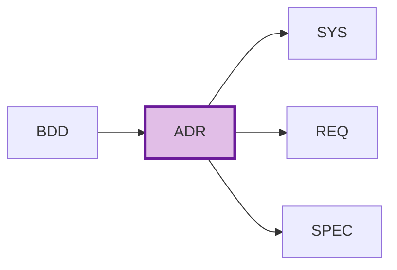

# ADR-000: Architecture Decision Records Master Index

## Purpose

This document serves as the master index for all Architecture Decision Records (ADRs) in the project. Use this index to:

- **Discover** architectural decisions and their rationale
- **Track** decision status and evolution
- **Coordinate** architecture changes across teams
- **Reference** decision history and alternatives considered

## Position in Development Workflow



> **Note on Diagram Labels**: The above flowchart shows the sequential workflow. For formal layer numbers used in cumulative tagging, always reference the 16-layer architecture (Layers 0-15) defined in README.md. Diagram groupings are for visual clarity only.

**Layer**: 5 (Architecture Layer)
**Upstream**: BRD, PRD, EARS, BDD
**Downstream**: SYS, REQ, SPEC

## Foundation ADRs

| ADR ID | Title | Status | Category | Last Updated |
|--------|-------|--------|----------|--------------|
| ADR-000 | Technology Stack | Reference | Foundation | See project docs |

**Note**: ADR-000 (Technology Stack) is typically located in project `docs/ADR/` directory and serves as the foundation for all technology decisions.

## Architecture Decision Records Index

| ADR ID | Title | Status | Category | Related BDD | Impact | Last Updated |
|--------|-------|--------|----------|-------------|--------|--------------|
| [ADR-TEMPLATE](./ADR-TEMPLATE.md) | Template | Reference | Reference | - | - | 2025-11-13 |

## Status Definitions

| Status | Meaning | Description |
|--------|---------|-------------|
| **Proposed** | Under consideration | ADR drafted, awaiting review and approval |
| **Accepted** | Approved | Decision approved, implementation in progress or complete |
| **Deprecated** | Being replaced | Decision still in use but migration to replacement planned |
| **Superseded** | Replaced | Completely replaced by newer ADR, kept for historical reference |

## Decision Categories

| Category | Description | Examples |
|----------|-------------|----------|
| **Infrastructure** | Deployment, scaling, networking | Cloud Run, Kubernetes, VPC design |
| **Integration** | System-to-system communication | API contracts, message queues, webhooks |
| **Technology Selection** | Framework, language, platform choices | Python vs Go, FastAPI vs Flask |
| **Data Architecture** | Database, storage, consistency | PostgreSQL, BigQuery, caching strategy |
| **security** | Authentication, authorization, encryption | OAuth2, RBAC, Secrets management |
| **Observability** | Monitoring, logging, alerting | Cloud Monitoring, OpenTelemetry |
| **AI/ML** | Model serving, training, MLOps | Vertex AI, model deployment patterns |

## Adding New Architecture Decisions

When creating a new ADR:

1. **Copy Template**:
   ```bash
   cp ai_dev_flow/ADR/ADR-TEMPLATE.md \
      docs/ADR/ADR-NNN_decision_title.md
   ```

2. **Assign ADR ID**: Use next sequential number (ADR-001, ADR-002, ...)

3. **Update This Index**: Add new row to table above

4. **Reference Technology Stack**: Include "Technology Stack Compliance" section referencing ADR-000

5. **Create Cross-References**: Link to upstream BDD scenarios and downstream SYS/REQ/SPEC

## Allocation Rules

- **Numbering**: Allocate sequentially starting at `001`
- **One Decision Per File**: Each `ADR-NNN` covers a single significant architectural decision
- **Slugs**: Short, descriptive, lower_snake_case
- **Alternatives Required**: Document at least 2-3 alternatives considered
- **Consequences Analysis**: Include positive and negative outcomes
- **Index Updates**: Add entry for every new ADR

## Index by Status

### Proposed
- None

### Accepted
- None

### Deprecated
- None

### Superseded
- None

## Index by Category

### Infrastructure
- None

### Integration
- None

### Technology Selection
- None

### Data Architecture
- None

### security
- None

### Observability
- None

### AI/ML
- None

## Decision Timeline


> **Note on Diagram Labels**: The above flowchart shows the sequential workflow. For formal layer numbers used in cumulative tagging, always reference the 16-layer architecture (Layers 0-15) defined in README.md. Diagram groupings are for visual clarity only.

## Impact Summary

| Impact Level | ADR Count | Description |
|--------------|-----------|-------------|
| **Critical** | 0 | Fundamental system architecture, affects all components |
| **High** | 0 | Significant architectural changes, affects multiple components |
| **Medium** | 0 | Localized architectural decisions, affects specific areas |
| **Low** | 0 | Minor decisions, limited scope |

## Metrics

| Metric | Value | Description |
|--------|-------|-------------|
| Total ADRs | 0 | Total architecture decisions documented |
| Proposed | 0 | Decisions under review |
| Accepted | 0 | Approved and implemented decisions |
| Deprecated | 0 | Decisions being phased out |
| Superseded | 0 | Historical decisions replaced by newer ones |

## Related Documents

- **Template**: [ADR-TEMPLATE.md](./ADR-TEMPLATE.md) - Use this to create new ADRs
- **README**: [README.md](./README.md) - Learn about ADR purpose, structure, and best practices
- **Traceability Matrix**: [ADR-000_TRACEABILITY_MATRIX-TEMPLATE.md](./ADR-000_TRACEABILITY_MATRIX-TEMPLATE.md)
- **CTR Policy**: [ADR-CTR_SEPARATE_FILES_POLICY.md](./ADR-CTR_SEPARATE_FILES_POLICY.md) - Contract file naming policy

## Maintenance Guidelines

### Updating This Index

- Update whenever new ADR is created
- Track status changes (Proposed → Accepted → Deprecated/Superseded)
- Maintain category classifications
- Document decision timeline and evolution

### Quality Checks

Before marking ADR as "Accepted":
- ✅ Problem statement clearly defined with business context
- ✅ At least 2-3 alternatives considered and documented
- ✅ Consequences analysis includes both positive and negative outcomes
- ✅ Technology Stack Compliance section references ADR-000
- ✅ Architecture flow diagrams included (Mermaid format)
- ✅ Implementation assessment covers complexity, dependencies, resources
- ✅ Rollback procedures documented
- ✅ Cross-references to BDD scenarios and downstream artifacts complete

---

**Index Version**: 2.0
**Last Updated**: 2025-11-13
**Maintainer**: [Project Team]
