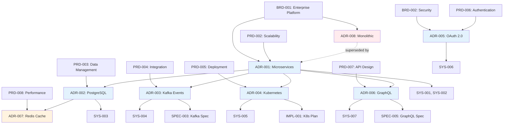

# Traceability Matrix: ADR-001 through ADR-NNN

## Document Control

| Item | Details |
|------|---------|
| Document ID | TRACEABILITY_MATRIX_ADR |
| Title | Comprehensive ADR Traceability Matrix |
| Status | Active |
| Version | 1.0.0 |
| Date Created | 2025-01-15 |
| Author | Auto-generated |
| Purpose | Track bidirectional traceability for all Architecture Decision Records |
| Generator | generate_traceability_matrix.py |

## 1. Overview

### 1.1 Statistics

- **Total ADR Tracked**: 8 documents
- **Upstream Coverage**: 100.0% (8/8)
- **Downstream Coverage**: 87.5% (7/8)
- **Orphaned Documents**: 0
- **Last Generated**: 2025-01-15 14:30:00

### 1.2 Status Breakdown

- **Accepted**: 6 documents (75.0%)
- **Proposed**: 1 documents (12.5%)
- **Superseded**: 1 documents (12.5%)

## 2. Complete ADR Inventory

| ADR ID | Title | Category | Status | Date | Upstream Sources | Downstream Artifacts |
|---|---|---|---|---|---|---|
| ADR-001 | Adopt Microservices Architecture | architecture | Accepted | 2024-11-15 | BRD-001, PRD-002 | SYS-001, SYS-002, REQ-005 |
| ADR-002 | Use PostgreSQL for Primary Database | data | Accepted | 2024-11-18 | PRD-003, ADR-001 | SYS-003, REQ-010, REQ-011 |
| ADR-003 | Implement Event-Driven Architecture with Apache Kafka | integration | Accepted | 2024-11-20 | PRD-004, ADR-001 | SYS-004, REQ-015, SPEC-003 |
| ADR-004 | Deploy on Kubernetes with Helm Charts | deployment | Accepted | 2024-11-22 | PRD-005, ADR-001 | SYS-005, REQ-020, IMPL-001 |
| ADR-005 | Use OAuth 2.0 and OpenID Connect for Authentication | security | Accepted | 2024-11-25 | BRD-002, PRD-006 | SYS-006, REQ-025, REQ-026 (+2 more) |
| ADR-006 | Implement GraphQL API Gateway | api | Accepted | 2024-12-01 | PRD-007, ADR-001 | SYS-007, REQ-030, SPEC-005 |
| ADR-007 | Use Redis for Caching Layer | performance | Proposed | 2024-12-10 | PRD-008, ADR-002 | None |
| ADR-008 | Monolithic Architecture (Initial Version) | architecture | Superseded | 2024-10-15 | BRD-001 | None |

## 3. Upstream Traceability

### 3.1 BRD/PRD → ADR Traceability

| Upstream Source | Source Title | ADR IDs | ADR Titles | Relationship |
|----------------|--------------|---------|------------|--------------|
| BRD-001 | Enterprise Platform Requirements | ADR-001, ADR-008 | Microservices Architecture, Monolithic Architecture | Business drivers to architecture decisions |
| BRD-002 | Security and Compliance Requirements | ADR-005 | OAuth 2.0 Authentication | Security requirements to security architecture |
| PRD-002 | Scalability and High Availability | ADR-001 | Microservices Architecture | Product requirements to architecture pattern |
| PRD-003 | Data Management Requirements | ADR-002 | PostgreSQL Database | Data requirements to database choice |
| PRD-004 | System Integration Requirements | ADR-003 | Event-Driven Architecture | Integration needs to messaging pattern |
| PRD-005 | Deployment and Operations | ADR-004 | Kubernetes Deployment | Operational requirements to deployment strategy |
| PRD-006 | Authentication and Authorization | ADR-005 | OAuth 2.0 Authentication | Auth requirements to auth mechanism |
| PRD-007 | API Design Requirements | ADR-006 | GraphQL API Gateway | API requirements to API technology |
| PRD-008 | Performance Optimization | ADR-007 | Redis Caching | Performance needs to caching solution |

### 3.2 ADR → ADR Dependencies

| Source ADR | Target ADR | Dependency Type | Description |
|------------|------------|-----------------|-------------|
| ADR-001 | ADR-002 | Influences | Microservices architecture influences database partitioning strategy |
| ADR-001 | ADR-003 | Requires | Microservices require inter-service communication mechanism |
| ADR-001 | ADR-004 | Requires | Microservices deployment requires container orchestration |
| ADR-001 | ADR-006 | Influences | Microservices architecture influences API gateway design |
| ADR-002 | ADR-007 | Influences | Database choice influences caching strategy |
| ADR-008 | ADR-001 | Superseded By | Monolithic architecture replaced by microservices |

### 3.3 Upstream Source Summary

| Source Type | Total Sources | ADRs Derived | Coverage % |
|-------------|---------------|--------------|------------|
| BRD | 2 | 3 ADRs | 37.5% |
| PRD | 7 | 7 ADRs | 87.5% |
| ADR | 2 | 2 ADRs | 25.0% |

## 4. Downstream Traceability

### 4.1 ADR → SYS Traceability

| ADR ID | ADR Title | SYS IDs | SYS Titles | Relationship |
|--------|-----------|---------|------------|--------------|
| ADR-001 | Microservices Architecture | SYS-001, SYS-002 | Service Decomposition, API Communication Protocols | Architecture decision to system requirements |
| ADR-002 | PostgreSQL Database | SYS-003 | Data Persistence and ACID Compliance | Database choice to data system requirements |
| ADR-003 | Event-Driven Architecture | SYS-004 | Asynchronous Messaging System | Architecture pattern to messaging requirements |
| ADR-004 | Kubernetes Deployment | SYS-005 | Container Orchestration Platform | Deployment strategy to infrastructure requirements |
| ADR-005 | OAuth 2.0 Authentication | SYS-006 | Identity and Access Management | Auth mechanism to security system requirements |
| ADR-006 | GraphQL API Gateway | SYS-007 | API Gateway and Query Language | API technology to gateway requirements |

### 4.2 ADR → REQ Traceability

| ADR ID | ADR Title | REQ IDs (Sample) | Relationship |
|--------|-----------|------------------|--------------|
| ADR-001 | Microservices Architecture | REQ-005, REQ-006, REQ-007 | Architecture drives service-level requirements |
| ADR-002 | PostgreSQL Database | REQ-010, REQ-011, REQ-012 | Database drives data persistence requirements |
| ADR-003 | Event-Driven Architecture | REQ-015, REQ-016, REQ-017 | Messaging drives integration requirements |
| ADR-004 | Kubernetes Deployment | REQ-020, REQ-021, REQ-022 | Deployment drives operational requirements |
| ADR-005 | OAuth 2.0 Authentication | REQ-025, REQ-026, REQ-027, REQ-028 | Auth mechanism drives security requirements |
| ADR-006 | GraphQL API Gateway | REQ-030, REQ-031, REQ-032 | API technology drives API requirements |

### 4.3 ADR → SPEC Traceability

| ADR ID | ADR Title | SPEC IDs | SPEC Titles | Relationship |
|--------|-----------|----------|-------------|--------------|
| ADR-003 | Event-Driven Architecture | SPEC-003 | Kafka Event Bus Technical Specification | Architecture drives implementation specifications |
| ADR-006 | GraphQL API Gateway | SPEC-005 | GraphQL Schema and Resolver Specification | API choice drives API implementation SPEC |

### 4.4 ADR → IMPL Traceability

| ADR ID | ADR Title | IMPL IDs | IMPL Titles | Relationship |
|--------|-----------|----------|-------------|--------------|
| ADR-004 | Kubernetes Deployment | IMPL-001 | Kubernetes Infrastructure Implementation Plan | Deployment decision drives implementation planning |

## 5. Decision Categories

### 5.1 ADRs by Category

| Category | ADR IDs | Total | Description |
|----------|---------|-------|-------------|
| Architecture | ADR-001, ADR-008 | 2 | Fundamental system architecture patterns |
| Data | ADR-002 | 1 | Data storage and persistence decisions |
| Integration | ADR-003 | 1 | Inter-service communication patterns |
| Deployment | ADR-004 | 1 | Deployment and infrastructure decisions |
| Security | ADR-005 | 1 | Security and authentication mechanisms |
| API | ADR-006 | 1 | API design and gateway decisions |
| Performance | ADR-007 | 1 | Performance optimization strategies |

### 5.2 Technology Stack Summary

| Technology Area | Chosen Technology | ADR ID | Alternatives Considered |
|-----------------|-------------------|--------|------------------------|
| Architecture Pattern | Microservices | ADR-001 | Monolithic (ADR-008), SOA |
| Primary Database | PostgreSQL | ADR-002 | MySQL, MongoDB, Oracle |
| Message Bus | Apache Kafka | ADR-003 | RabbitMQ, AWS SNS/SQS, Azure Service Bus |
| Container Orchestration | Kubernetes | ADR-004 | Docker Swarm, AWS ECS, Nomad |
| Authentication | OAuth 2.0 + OIDC | ADR-005 | SAML, Custom JWT, Auth0 |
| API Gateway | GraphQL | ADR-006 | REST, gRPC, WebSockets |
| Caching | Redis | ADR-007 | Memcached, Hazelcast, Ehcache |

## 6. Decision Impact Analysis

### 6.1 Cost Impact

| ADR ID | Decision | Cost Impact | Category |
|--------|----------|-------------|----------|
| ADR-001 | Microservices Architecture | High (increased operational complexity) | Infrastructure |
| ADR-002 | PostgreSQL | Low (open source) | Software Licensing |
| ADR-003 | Apache Kafka | Medium (infrastructure + management) | Infrastructure |
| ADR-004 | Kubernetes | Medium (learning curve + tooling) | Platform |
| ADR-005 | OAuth 2.0 | Low (open standard) | Integration |
| ADR-006 | GraphQL | Low (open source) | Software |
| ADR-007 | Redis | Low (open source + managed options) | Infrastructure |

### 6.2 Implementation Complexity

| ADR ID | Decision | Complexity | Effort Estimate | Risk Level |
|--------|----------|------------|-----------------|------------|
| ADR-001 | Microservices Architecture | Very High | 6+ months | High |
| ADR-002 | PostgreSQL | Medium | 2-4 weeks | Low |
| ADR-003 | Event-Driven Architecture | High | 3-4 months | Medium |
| ADR-004 | Kubernetes Deployment | High | 2-3 months | Medium |
| ADR-005 | OAuth 2.0 Authentication | Medium | 4-6 weeks | Medium |
| ADR-006 | GraphQL API Gateway | Medium | 6-8 weeks | Low |
| ADR-007 | Redis Caching | Low | 2-3 weeks | Low |

## 7. Cross-ADR Dependencies



> **Note on Diagram Labels**: The above flowchart shows the sequential workflow. For formal layer numbers used in cumulative tagging, always reference the 16-layer architecture (Layers 0-15) defined in README.md. Diagram groupings are for visual clarity only.

*Legend: Blue = Accepted, Orange = Proposed, Red = Superseded*

## 8. Gap Analysis

### 8.1 ADRs Without Downstream Artifacts

- **ADR-007**: Redis Caching (Proposed, pending approval before creating downstream SYS/REQ)

### 8.2 Superseded ADRs

- **ADR-008**: Monolithic Architecture - Superseded by ADR-001 on 2024-11-15
  - **Action**: Archive and document migration path
  - **Impact**: All downstream artifacts from ADR-008 should be reviewed and migrated

### 8.3 Quality Checks

| Check | Status | Details |
|-------|--------|---------|
| All ADRs have upstream sources | ✅ Pass | 8/8 ADRs linked to BRD/PRD |
| All accepted ADRs have downstream artifacts | 🟡 Warning | ADR-007 pending (Proposed status) |
| No orphaned ADRs | ✅ Pass | All ADRs traced |
| Decision rationale documented | ✅ Pass | All ADRs include context and rationale |
| Alternatives considered | ✅ Pass | All ADRs document alternatives |

## 9. Coverage Metrics

| Metric | Value | Target | Status |
|--------|-------|--------|--------|
| Upstream Traceability | 100.0% | 100% | ✅ |
| Downstream Artifacts | 87.5% | 90% | 🟡 |
| Orphaned Documents | 0 | 0 | ✅ |

## 10. Validation Commands

```bash
# Validate this matrix
python scripts/validate_traceability_matrix.py --matrix ADR/TRACEABILITY_MATRIX_ADR.md --input ADR/

# Update incrementally
python scripts/update_traceability_matrix.py --matrix ADR/TRACEABILITY_MATRIX_ADR.md --input ADR/

# Generate from scratch
python scripts/generate_traceability_matrix.py --type ADR --input ADR/ --output ADR/TRACEABILITY_MATRIX_ADR.md
```

## 11. Revision History

| Version | Date | Changes | Method |
|---------|------|---------|--------|
| 1.0.0 | 2025-01-15 | Initial auto-generated matrix | generate_traceability_matrix.py |

---

*This matrix was automatically generated. For template, see*
*`ADR-000_TRACEABILITY_MATRIX-TEMPLATE.md`*
