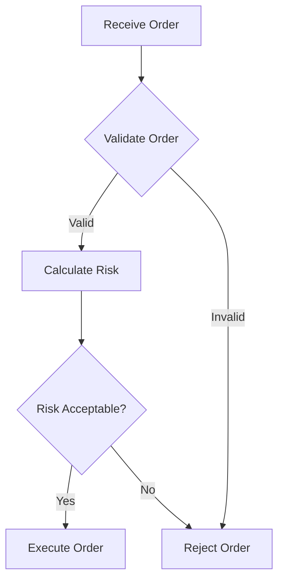

# AI Coding Tool Optimization Guide

**Version**: 1.0
**Last Updated**: 2025-11-07
**Purpose**: Guide for selecting and optimizing AI coding tools for this framework

---

See also:
- AI Assistant Playbook (index): AI_ASSISTANT_PLAYBOOK.md
- Execution Rules (project bootstrap flow): AI_ASSISTANT_RULES.md

---

## Quick Start (Assistant-Agnostic)

- Choose your assistant: Pick what you have handy; adjust size targets accordingly.
  - IDE assistant (e.g., Copilot): Aim for 10–30KB per file; add summaries if larger.
  - CLI assistant (e.g., Gemini CLI): Use file read tool for files >10KB; avoid `@` for large files.
  - Full workspace assistant (e.g., Claude Code): 20–50KB typical; up to 100KB without splitting.
- Suggested sizes: Standard docs 20–40KB; comprehensive guides ≤50KB; master references ≤100KB (split if >100KB).
- Validate locally (recommended):
  ```bash
  # Metadata frontmatter
  python3 scripts/validate_metadata.py .

  # Cross-document references
  python3 scripts/validate_cross_document.py --document 10_SPEC/SPEC-01_api_client_example.yaml

  # Traceability Section-7 links
  python3 scripts/validate_links.py

  # TASKS structure (checks Section 8: Implementation Contracts)
  bash scripts/validate_tasks.sh 11_TASKS/TASKS-01_example.md
  ```
- Split only when needed: Files >100KB or strong logical boundaries.
- See details: Token limits by tool and full validation guidance below.

---

## Units & Conversions (KB vs tokens)

- KB: 1 KB = 1,024 bytes (file size reported by the OS).
- Tokens: ~4 characters per token on average for English plaintext (≈0.75 words).
- Estimate tokens from size: tokens ≈ (KB × 1024) ÷ 4.
  - Examples: 20 KB ≈ 5,000 tokens; 50 KB ≈ 12,500 tokens; 100 KB ≈ 25,000 tokens.
- Estimate size from tokens: KB ≈ (tokens × 4) ÷ 1024.
  - Examples: 10,000 tokens ≈ 39 KB; 50,000 tokens ≈ 195 KB.
- Caveats: Code/JSON and non‑ASCII text tend to increase token counts; some tools compress inputs differently.

## Style and Tone Guidelines (All Tools)

- Use professional software development language (engineering tone).
- Avoid marketing/sales language and hype; be factual and concise.
- Be token-efficient: prefer bullets, short paragraphs, and concrete commands.
- No emotional language; state outcomes, rationale, and next steps plainly.
- Emoji policy: only informational emoji when helpful; keep to a minimum (0–1 typical).
- Prefer actionable output: commands, file paths, code identifiers, and checklists.
- Avoid redundancy: don’t restate prompts; summarize only when it adds value.

---

## Executive Summary

This framework is optimized for large-context tools (e.g., **Claude Code**) while remaining compatible with **Gemini CLI** and **GitHub Copilot**. Token limits have been adjusted from the legacy 10K limit (Gemini CLI `@` reference constraint) to 50K tokens standard, 100K tokens maximum.

**Key Changes from Previous Standards:**
- **Old Limit**: 10,000 tokens per file (designed for Gemini CLI `@` references)
- **New Limit**: 50,000 tokens standard, 100,000 tokens maximum (Claude Code optimized)
- **Impact**: 5-10x larger documentation files without artificial splitting
- **Migration**: Progressive adoption (new files and updates only)

---

## Traceability and Validation

Use your AI coding assistant for quick “trace-check” style reviews, and rely on local scripts for deterministic validation during CI or pre-commit.

Common local checks:

```bash
# Metadata frontmatter validation
python3 scripts/validate_metadata.py .

# Cross-document references (upstream/downstream integrity)
python3 scripts/validate_cross_document.py --document 10_SPEC/SPEC-01_api_client_example.yaml

# Section-7 link integrity (Traceability sections)
python3 scripts/validate_links.py

# TASKS structure rules (includes Section 8: Implementation Contracts)
bash scripts/validate_tasks.sh 11_TASKS/TASKS-01_example.md
```

Assistant guidance:
- If your assistant offers a built-in “trace-check” capability, use it to sanity-check tags and references.
- Prefer local scripts for authoritative results and CI integration.

---

## Token Limit Standards by Tool

### Claude Code (Primary Tool - RECOMMENDED)

**Context Window**: 200,000 tokens (~600KB text)

**Optimal File Sizes:**
- **Standard Documents** (REQ, ADR, BDD, SPEC, CTR): 5,000-15,000 tokens (20-60KB)
- **Template Files** (BRD-TEMPLATE, SPEC-TEMPLATE): 10,000-25,000 tokens (40-100KB)
- **Comprehensive Guides** (README, SPEC_DRIVEN_DEVELOPMENT_GUIDE): 15,000-50,000 tokens (60-200KB)
- **Master References** (complete traceability matrices): Up to 100,000 tokens (400KB) maximum

**Token Limits:**
- **Standard**: 50,000 tokens (200KB) per file
- **Maximum**: 100,000 tokens (400KB) absolute limit
- **Simultaneous Files**: Can handle 30-50 files at once
- **Total Context**: Aim for <150KB of plain-text input across all files (approx.)

**When to Use Claude Code:**
- Complex refactoring across multiple files
- Comprehensive documentation review
- Large file analysis (20-100KB files)
- Multi-file coordination tasks
- Primary development workflow

**Advantages:**
- Optimal for 20-40KB files (uses 20-30% of context)
- Single-file comprehensive documentation
- No artificial splitting required
- Superior reasoning and code quality
- MCP server support for extended capabilities

**Cost**: ~$3/hour of active usage

Reference: [AI_Coding_Tools_Comparison.md](../AI_Coding_Tools_Comparison.md)

#### Style and Tone (Strict)

- Professional engineering tone; avoid marketing or emotional language.
- Token-efficient output; keep responses compact and structured.
- Prefer bullets, diffs, code blocks, and explicit commands over narrative.
- Default to zero emoji; at most one informational emoji in long summaries.
- Avoid filler (apologies, small talk, restating prompts).

---

### Gemini CLI (secondary Tool - Alternative)

**Context Window**: 1,000,000 tokens (conversation total)

**CRITICAL LIMITATION**: The `@` file reference syntax is limited to ~13,000 tokens (~10-13KB) per file, NOT the full 1M context.

**File Handling Methods:**

#### Method 1: File Read Tool (RECOMMENDED for files >10K tokens)
```bash
gemini

# Gemini automatically uses file read tool
> "Read LARGE_FILE.md and summarize key requirements"
> "Analyze section 5 of LARGE_FILE.md"
> "Find all security requirements in LARGE_FILE.md"
```

**No token limit** - file read tool handles any size in chunks.

#### Method 2: @ Reference (for files ≤10K tokens only)
```bash
gemini @SMALL_FILE.md "Analyze this document"
```

**Limited to 10,000 tokens** - files larger than this will be truncated or error.

**Optimal File Sizes:**
- **@ Reference**: Up to 10,000 tokens (40KB) maximum
- **File Read Tool**: Any size (no practical limit)
- **Recommendation**: Design files for Claude Code (50K tokens), use file read tool for Gemini CLI

**When to Use Gemini CLI:**
- Large codebase exploration (1M token conversation context)
- Iterative development with conversation memory
- Free tier usage (60 requests/min, 1K requests/day)
- Google Search integration needed
- Multi-turn conversations requiring extensive history

**Workarounds for Large Files:**
- Use file read tool instead of `@` reference
- Create 10KB companion summary for quick `@` access (optional)
- Use `/compress` command for long conversations
- Leverage GEMINI.md for project context

**Cost**: Free tier available, paid tiers for higher limits

**Detailed Guidance**: See this guide’s Gemini CLI notes below

#### Style and Tone (Recommended)

- Professional engineering tone; avoid marketing or emotional language.
- Token-efficient summaries; prefer bullets and direct commands.
- Minimal emoji; only if informational and adds clarity.
- Keep interactive prompts short; reference file paths and sections explicitly.

---

### GitHub Copilot (Tertiary Tool - Inline Assistance)

**Context Window**: 64,000-128,000 tokens (varies by model)

**Optimal File Sizes:**
- **Single File**: 10-30KB (2,500-7,500 tokens)
- **Code File**: Up to 40KB (800-1,500 lines)
- **Multiple Files**: 10-20 files maximum
- **Total Context**: Aim for <50KB of plain-text input (approx.)

**Token Limits:**
- **Comfortable**: <30KB per file
- **Maximum**: ~60KB (will truncate beyond this)
- **Working Set**: Max 10 files in Copilot Edits mode

**When to Use GitHub Copilot:**
- Inline code completion
- Quick fixes and small refactors
- Native IDE integration
- Line-by-line assistance
- Real-time coding suggestions

**Strategy for Large Files (>30KB):**
- Create companion summary files (20-30KB executive summaries)
- Use external references with summaries in Copilot
- Chunk interactions (ask about one section at a time)
- Export TL;DR versions for Copilot context

**Cost**: $10-$19/month (Individual/Pro), $39/user/month (Business)

---

## File Splitting Guidelines

### When to Split Files

**Split ONLY when:**
1. File exceeds 100,000 tokens (Claude Code practical limit)
2. Logical module boundaries exist (separate functional concerns)
3. Team collaboration benefits from smaller, focused files
4. Independent maintenance is advantageous

**Do NOT split for:**
- Tool compatibility (use appropriate tool features instead)
- Arbitrary token limits below 100K
- Single cohesive documentation units
- Files between 10K-100K tokens (optimal for Claude Code)

### How to Split Files

**When splitting is necessary (>100K tokens):**

1. **Identify Logical Boundaries:**
   - Functional modules (auth, data access, API endpoints)
   - Major sections (overview, requirements, technical SPEC)
   - Independent concerns that can stand alone

2. **Create Section Files (RECOMMENDED):**

   Use section-based dot notation per [ID_NAMING_STANDARDS.md - Section-Based File Splitting](./ID_NAMING_STANDARDS.md#section-based-file-splitting-document-chunking):
   ```
   SPEC-03.0_index.md           (required index/overview)
   SPEC-03.1_interfaces.md      (interfaces, data models)
   SPEC-03.2_business_logic.md  (business logic, state management)
   SPEC-03.3_quality.md         (performance, observability)
   ```

   **Pattern**: `{TYPE}-{NN}.{SECTION}_{slug}.md`
   - Dash before document number, dot before section number
   - Section 0 is always required (index)
   - Distinct from element IDs which use all dots (`SPEC.03.01.05`)

3. **Create Index File (Section 0):**
   ```markdown
   ---
   doc_id: SPEC-03
   section: 0
   title: "Complete Specification Index"
   total_sections: 4
   ---
   # SPEC-03.0: Complete Specification - Index

   ## Section Map
   | Section | File | Description |
   |---------|------|-------------|
   | 0 | [Index](SPEC-03.0_index.md) | This file |
   | 1 | [Interfaces](SPEC-03.1_interfaces.md) | Interfaces & Data Models |
   | 2 | [Business Logic](SPEC-03.2_business_logic.md) | Core Logic |
   | 3 | [Quality](SPEC-03.3_quality.md) | Performance & Observability |

   ## Dependencies
   - Section 2 depends on Section 1 (data models)
   - Section 3 references all sections
   ```

4. **Maintain Cross-References:**
   - Each file includes header with link back to index
   - Cross-references use relative paths
   - Traceability links remain functional across files

---

## Tool Selection Decision Tree

```
Is file >100K tokens?
├─ YES → Must split at logical boundaries
└─ NO → Continue to tool selection

Primary tool: Claude Code?
├─ YES → Keep as single file (optimal up to 50K tokens)
└─ NO → Which tool?
    ├─ Gemini CLI → Use file read tool (no split needed)
    ├─ GitHub Copilot → Consider companion summary if >30KB
    └─ Multiple tools → Optimize for Claude Code, provide notes for others
```

### Decision Matrix

| File Size | Claude Code | Gemini CLI | GitHub Copilot |
|-----------|-------------|------------|----------------|
| <10KB | ✅ Excellent | ✅ @ reference works | ✅ Excellent |
| 10-30KB | ✅ Optimal | ✅ Use file read tool | ✅ Good |
| 30-50KB | ✅ Optimal | ✅ Use file read tool | ⚠️ Create summary |
| 50-100KB | ✅ Good | ✅ Use file read tool | ❌ Too large |
| >100KB | ⚠️ Consider split | ✅ Use file read tool | ❌ Must split |

---

## Migration Strategy

### For Existing Documentation

**No migration required** - existing files remain unchanged until naturally updated.

**When updating existing files:**
1. Check current token count
2. If <50K tokens: Keep as single file
3. If 50-100K tokens: Evaluate logical split points (usually keep as-is)
4. If >100K tokens: Split at logical boundaries
5. Update references and cross-links

### For New Documentation

**Apply new limits from day one:**
- Target 20-40KB for standard documents (optimal for Claude Code)
- Up to 50KB for comprehensive documents (standard limit)
- Up to 100KB for master references (maximum limit)
- No artificial splitting below 100KB

### Validation Updates

**Token counting:**
```bash
# Estimate tokens
wc -w document.md | awk '{print $1 * 1.33}'  # Approximate tokens

# Accurate count (if tiktoken available)
python -c "import tiktoken; enc = tiktoken.get_encoding('cl100k_base'); print(len(enc.encode(open('document.md').read())))"
```

**Validation rules:**
- Critical: File >100,000 tokens
- Warning: File >50,000 tokens (consider logical split)
- Info: File >30,000 tokens (monitor growth)

---

## Practical Examples

### Example 1: Standard Requirement Document (20KB)

**File**: REQ-01_authentication.md (20KB, ~5,000 tokens)

**Tool Usage:**
- **Claude Code**: ✅ Optimal (uses 2.5% of context)
- **Gemini CLI**: ✅ Excellent (use file read tool or @ reference)
- **GitHub Copilot**: ✅ Perfect size

**Recommendation**: Keep as single file, no special handling needed.

---

### Example 2: Comprehensive BRD (60KB)

**File**: BRD-TEMPLATE.md (60KB, ~15,000 tokens)

**Tool Usage:**
- **Claude Code**: ✅ Optimal (uses 7.5% of context, can load 10+ files simultaneously)
- **Gemini CLI**: ✅ Use file read tool (not @ reference)
- **GitHub Copilot**: ⚠️ Consider creating 20KB summary for quick reference

**Gemini CLI Commands:**
```bash
gemini

# Let Gemini use file read tool
> "Read BRD-TEMPLATE.md and identify key requirements"
> "Analyze section 5 of BRD-TEMPLATE.md for functional SPEC"
> "What are the security requirements in BRD-TEMPLATE.md?"
```

**Recommendation**: Keep as single file, provide tool-specific usage notes.

---

### Example 3: Large Specification (120KB)

**File**: SPEC-COMPLETE-SYSTEM.md (120KB, ~30,000 tokens)

**Tool Usage:**
- **Claude Code**: ⚠️ Exceeds 100K token limit → Must split
- **Gemini CLI**: ✅ Use file read tool (no issue)
- **GitHub Copilot**: ❌ Far too large

**Recommended Split:**
```
SPEC-SYSTEM-01_overview.md      (20KB) - Architecture, interfaces
SPEC-SYSTEM-02_core.md          (40KB) - Core business logic
SPEC-SYSTEM-03_integration.md   (30KB) - External integrations
SPEC-SYSTEM-004_quality.md       (30KB) - Performance, observability
SPEC-SYSTEM-00_index.md         (5KB)  - Complete index with cross-refs
```

---

## Code Block Policy (Optional)

**Updated policy** (previously prohibited, now optional):

### Small Code Examples (<50 lines)
**Acceptable inline** in documentation:
```python
def calculate_risk(position, volatility):
    """Calculate position risk using volatility."""
    return position * volatility * 0.01
```

### Large Implementations (>50 lines)
**Create separate `.py` files:**
- File: `examples/risk_calculator.py`
- Reference: `[See Code Example: risk_calculator.py - calculate_collection_risk()]`

### Complex Logic
**Use Mermaid flowcharts** for visualization:


> **Note on Diagram Labels**: The above flowchart shows the sequential workflow. For formal layer numbers used in cumulative tagging, always reference the 16-layer architecture (Layers 0-15) defined in README.md. Diagram groupings are for visual clarity only.

---

## Metadata Tagging for Documentation Sites

### Purpose

When building documentation sites (Docusaurus, MkDocs) for dual-architecture projects, use YAML frontmatter metadata to:
- Indicate architectural priority (recommended vs fallback)
- Enable visual hierarchy in navigation
- Support bidirectional cross-references
- Allow filtering/querying by architecture approach

### Tool Compatibility

**Claude Code:**
- ✅ Fully supports YAML frontmatter editing
- ✅ Can add metadata to multiple files efficiently
- ✅ Validates YAML syntax automatically
- ✅ Optimal for bulk metadata migration

**Gemini CLI:**
- ✅ Supports YAML frontmatter
- ⚠️ Use file read tool for files >10K tokens
- ✅ Good for single-file metadata updates

**GitHub Copilot:**
- ✅ Supports YAML frontmatter
- ⚠️ Limited context for bulk operations
- ✅ Good for individual file updates

### Token Impact

**Metadata Overhead:**
- YAML frontmatter: ~200-400 tokens (0.8-1.6KB)
- Custom admonitions: ~150-250 tokens (0.6-1KB)
- Total per document: ~350-650 tokens (1.4-2.6KB)

**Impact on File Sizes:**
- Minimal impact on token budgets
- <5% increase for typical documents
- Does not affect 50K/100K token limits

### Quick Template Reference

**Primary (Recommended) Implementation:**
```yaml
---
title: "DOC-XXX: Feature Name"
tags:
  - feature-doc
  - ai-agent-primary
  - recommended-approach
custom_fields:
  architecture_approach: ai-agent-based
  priority: primary
  development_status: active
---
```

**Complete Guide:**
See [METADATA_TAGGING_GUIDE.md](./METADATA_TAGGING_GUIDE.md) for comprehensive standards, validation scripts, and migration procedures.

---

## Summary

### Token Limits Quick Reference

| Tool | Optimal Range | Maximum | Notes |
|------|--------------|---------|-------|
| **Claude Code** | 20-50KB | 100KB | Primary tool, no splitting needed |
| **Gemini CLI** | Any size | N/A | Use file read tool for >10K tokens |
| **GitHub Copilot** | 10-30KB | 60KB | Consider summaries for >30KB |

### Key Principles

1. **Optimize for Claude Code** (primary tool)
2. **Single-file documentation** preferred (no artificial splitting)
3. **Split only when >100K tokens** or logical boundaries exist
4. **Provide tool-specific guidance** for Gemini CLI and GitHub Copilot
5. **Progressive adoption** (new files and updates, no forced migration)

### Best Practices

- Target 20-40KB for standard documents
- Up to 50KB for comprehensive documentation
- Maximum 100KB before considering split
- Use file read tool for Gemini CLI (not @ reference)
- Create companion summaries for GitHub Copilot if needed
- Code blocks: <50 lines inline, >50 lines in separate files
- Mermaid flowcharts for complex logic visualization

---

## References

- [AI_Coding_Tools_Comparison.md](../AI_Coding_Tools_Comparison.md) - Detailed comparison of all tools
- Gemini CLI file handling strategies: see this guide’s Gemini section
- [SPEC_DRIVEN_DEVELOPMENT_GUIDE.md](SPEC_DRIVEN_DEVELOPMENT_GUIDE.md) - Complete framework documentation standards
- [METADATA_TAGGING_GUIDE.md](./METADATA_TAGGING_GUIDE.md) - Dual-architecture metadata standards for documentation sites
